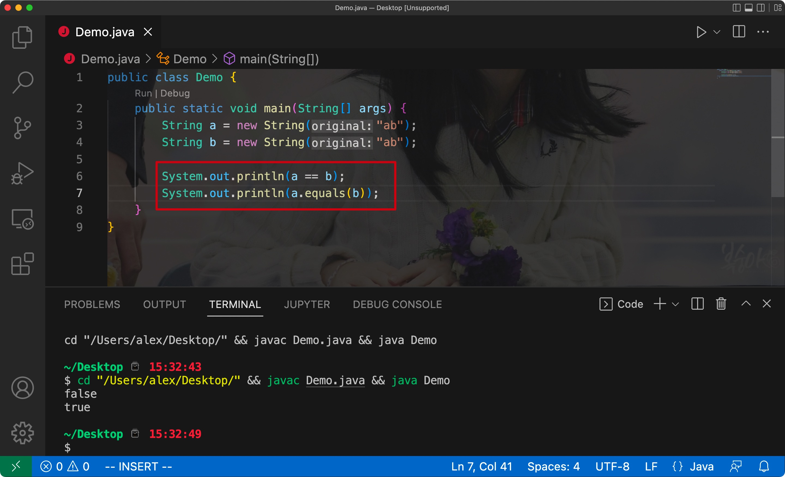

# JVM内存区域划分:


# 一、内存管理


## 1. 程序计数器

- 程序计数器: Program Counter Register

用于记录当前线程执行字节码的`行号`

字节码的解释器在执行字节码文件中的指令时，会修改字节码的行号，修改后的值就指向下一条即将执行的指令


Java执行多线程程序是基于轮转算法的，CPU的一个核心在某一时刻时只会执行一个线程，线程的时间片消耗完后，就会自动切换到其他的线程，而当前线程目前执行到位置会以行号的形式存放在**线程独有的程序计数器中**

> 下次再运行当前线程时，则从程序计数器中得知继续运行的位置
>
> 程序计数器所占空间较小

<hr>


## 2. 虚拟机栈/本地方法栈

- 虚拟机栈(VM Stack):

> 作为一个栈结构，存储每个方法对应的栈帧(局部变量表、操作数栈、动态连接、方法出口)

其中动态链接是指当前方法中调用的其他方法，通过该类的常量池可以找到对应方法的符号引用，然后将该符号引用转换为对方法的直接引用

最后方法出口规定了方法该如何结束


Eg:


每个方法调用的时候，其对应的信息封装为栈帧放入栈中，方法运行结束后再出栈:


- 本地方法栈:

> 作用同虚拟机栈相同，但其存放的是本地方法对应的栈帧

<hr>


## 3. 堆/方法区

- 堆:

> 对象的存储和管理区域，垃圾回收的主要作用区域，是JVM中最大的内存空间


- 方法区:

> (在JDK7之前)：由类信息表和运行时常量池组成

类信息表:

用于存储每个类对应的版本、字段、方法、接口等信息，同时会将编译时生成的类常量池数据存储在运行时常量池中

>类常量池也称作静态常量池


结构:


测试1:

- 使用new关键字创建的对象会放在`堆`中，所以两个对象对应的地址值不同，调用`==`比较的结果自然为false
- 而字符`abc`存放在方法区中的运行时常量池中，所以调用`equals`方法比较内容时，结果相同




- 使用""对应的字符串字面量时，会直接引用方法区中的字符串:


- 通过String实例调用`intern`方法会直接返回该实例引用的字符串常量在方法区中的地址:


intern方法的机制:

- 检查当前String实例对应的字符串是否存在于方法区内的运行时常量池中，存在则返回其中的地址，不存在则将该字符串放入运行时常量池中再返回对应的地址

Eg:


变化:

- 从JDK7开始，调用intern方法后，如果运行时常量池中没有对应的字符，则运行时常量池中会直接存储该字符串在堆中的引用:


Eg:


注意:

> JDK7之后，字符串常量池移动到了堆中

<hr>


## 4. 总结

- 程序计数器(线程独有): 记录当前线程执行的位置
- 虚拟机栈(线程独有): 存储栈帧来维持方法的调用顺序，控制程序有序运行
- 本地方法栈(线程独有): 作用同虚拟机栈，作用于本地方法
- 堆: 存储和管理所有的对象(包括数组)，JDK7之后其中还含有字符串常量池
- 方法区: 存储类信息、代码缓存、运行时常量池

<hr>


## 5. 爆内存/爆栈

- 在IDEA中设置对应程序的可用堆空间:


注意新版本中需要手动添加VM options选项


配置选项:

- -Xms: 最小堆内存
- -Xmx: 最大堆内存
- -XX: +HeapDumpOnOutOfMemoryError: 爆内存时，将信息输出


设置:


```shell
-Xms1m -Xmx1m -XX:+HeapDumpOnOutOfMemoryError
```


成功设置后，运行出现OutOfMemoryError时，项目目录中会出现一个hprof结尾的快照文件:


该文件可以借助IDEA的`Profiler`分析器来读取:


打开刚才生成的快照文件后，就可以查看哪些对象占用了大量空间，从而分析出导致爆内存的原因:


通过-Xss可以设定栈的容量:


<hr>


## 6. 直接内存

通过`Unsafe`实例对象，可以调用堆外内存(不受JVM控制)

> 通过Unsafe开辟堆外内存其实就是通过调用C/C++标准库里的malloc函数来分配内存空间


Eg:


该类的构造函数是private修饰的，只提供了一个theUnsafe对象，且只允许JDK自带的类调用它


这里我们使用反射的方式获取该字段即可:


<hr>


# 二、垃圾回收


## 1. 对象存活判定算法

以下算法均针对堆中的对象


### 1) 引用计数法

> 每个对象都包含一个`引用计数器`，用于存放引用的计数值(存放引用的次数)
> 每当一个地方引用了该对象时，计数器的值都会递增1
>
> 当引用失效时，则会递减1
>
> 计数器的值为0的时候，该对象则不会再被使用了，此时便会进行回收


- 引用计数法的缺点:

当两个对象彼此之间相互引用，但两者的直接引用变量已经无法找回了，此时通过引用计数法就无法回收它们(因为计数器的值还不为0)


Eg:

```java
public static void main(String[] args) {
  Test test1 = new Test();
  Test test2 = new Test();

  test1.another = test2;
  test2.another = test1;

  test1 = null;
  test2 = null;
}

static class Test {
  Test another;
}
```

- 此时test1和test2被彼此的变量域所引用，因此计数器的值不为0
- 但其直接引用的变量被设置为了null，因此无法手动断开它们彼此之间的引用

<hr>


### 2) 可达性分析算法

> 选择一个对象的引用作为树的根结点，其余引用作为其他的结点
>
> 如果其他的结点无法连接到根结点，那么不管其引用计数为多少，都会被回收


可被选为根结点的对象引用:

- 虚拟机栈中本地变量表引用的对象(方法中的局部变量)
- 类的静态域引用的对象
- 方法区中常量池引用的对象(String类型)
- 被添加了锁的对象
- 虚拟机内部用到的对象


例子:

假设一个方法的局部变量作为了根结点(GC Root)


方法结束后，运行的范围超出了局部变量的作用域，此时根结点被回收，其对应的引用则无法到达根结点了，所以一并回收


循环引用:


总结:

如果对象无法到达GC Roots，那么说明其不会再被使用，此时其会被回收

<hr>


### 3) 最终判定

- 在对象通过可达性分析算法判断可以回收后，会调用从`Object`继承来的`finalize`方法，如果该对象`finalize`没有重写该方法，则才会真正将其回收
- 执行`finalize`方法的线程不是主线程(Finalizer线程)，其优先级较低
- 通过`System.gc()`方法可以向垃圾回收器申请一次回收(垃圾回收器会对通过调用`finalize`方法来判断对象是否可以被回收)


注:

>System.gc()是Runtime.getRuntime().gc()的简写方式，两者作用相同


> 当可达性分析算法判定可以回收时，对象只进行了`一次标记`
>
> 之后如果对象没有重写`finalize`方法或者其重新的方法中没有重写建立与GC Roots的连接，那么就会真正的回收(`二次标记`)
>
> 如果该对象已经调用过了一次`finalize`方法(一次标记)，此时则不会再执行一次finalize方法，而是直接进行回收


当一个对象执行过一次`finalize`方法后，则会直接进行回收(finalize方法只执行一次)

Eg:


关系图:


<hr>


