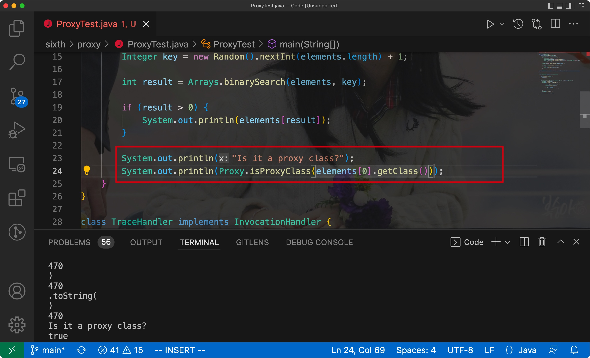

# 一、Java基础程序设计结构


## 1. 一个简单的Java应用程序

Eg:


- Java区分大小写(case sensitive)


分析code:

关键字public被称为**访问修饰符**(access modifier)

**修饰符用来控制程序的其他部分对当前这段程序的访问级别**


- 标准的命名规范:

类名是以大写字母开头的**名词**

如果由多个名词组成，那么每个单词的第一个字母都应该大写才行(大驼峰命名法/CamelCase)


**源文件的文件名**必须和**公共类的名字**相同


- 编译后的字节码文件会与源文件存储在同一个目录下
- 根据语言规范，main方法必须声明为public
- 每个Java应用程序都必须有一个main方法

<hr>


## 2. 注释

在Java中有3种注释，其中最常用的是//，其可注释的内容从//开始到本行结尾


- 如果需要长篇的注释，则可以如下注释将一段比较长的内容括起来

```java
/*

*/
```


最后一种可以用来自动地生成文档

```java
/**
*/
```


Code


注意:

在Java中，/**/注释不能相互嵌套

<hr>


## 3. 数据类型

- Java是一种强类型语言

> 这意味着**必须**为每个变量声明一个类型


8种基本类型(primitive type):

- 4种整形
- 2种浮点型
- 1种字符类型
- 1种boolean类型

<hr>


### 1) 整型

| Type  | Storage |          length          |
| :---: | ------- | :----------------------: |
|  int  | 4byte   | -2^31~2^31 - 1(超过20亿) |
| short | 2byte   |     -2^15 ~ 2^15 - 1     |
| long  | 8byte   |     -2^63 ~ 2^63 - 1     |
| byte  | 1byte   |        -128 ~ 127        |


- 在Java中，整型的范围与运行Java的机器无关，这样就解决了移植的问题
- long类型的数据后面需要添加一个L后缀
- 十六进制数有一个前缀"0x"或者"0X"；八进制数有一个前缀"0"


从Java7开始:

- 加上前缀0B/0b可以写二进制数
- 可以为数字字面量加下划线: 1_000_000(只是为了让人更易读)


Eg:


<hr>


### 2) 浮点类型

浮点类型可以用于表示有小数部分的数值

|  type  | storage |     length      |
| :----: | :-----: | :-------------: |
| float  |  4byte  | 有效位数有6~7位 |
| double |  8byte  | 有效位数有15位  |


float类型的数值需要加上后缀F/f，浮点数值没有的话默认为double类型

- 十六进制表示法:

0.125=2^-3^ -> 0x1.0p-3，其中p代表指数，指数的**基数为2，不是10**


- 所有的浮点数遵循IEEE754标准


溢出/出错的三个特殊情况下的浮点数值:

- 正无穷大(Double.POSITIVE_INFINITY)
- 负无穷大(Double.NEGATIVE_INFINITY)
- NaN(Double.NaN)


检测一个值是否为Double.NaN，需要使用Double.isNaN方法

Eg:


<hr>


### 3) char类型	

- char类型原本表示单个字符，**但现在不是了**
- 现在有些Unicode字符用一个char值描述，其余则使用两个char值
- char类型的字面量需要用单引号括起来

> char类型的值可以表示为16进制值，其范围从\u0000到\uffff，共2^16^ - 1


除了\u之外，还有其他的转移序列可以表示不同的意思


Eg:


**注意**：Unicode转移序列会在解析代码之前就得到处理，所以一定要注意注释中的转移序列

<hr>


### 4) Unicode/char

- 从Java SE5.0开始，**码点(code point)是指一个编码表中的某个字符对应的代码值**
- 在Unicode标准中，码点采用十六进制书写，并加上前缀"U+"
- Unicode的码点可以分为17个代码级别(code plane)
- UTF-16编码中，采用不同长度的编码表示所有的Unicode码点；在基本的多语言级别中，每个字符用16位表示，称为代码单元(code unit)；辅助字符则采用一对连续的代码单元进行encode(即两个16位的代码单元)

> Java中，char类型描述了UTF-16编码中的一个代码单元(16bit)
>
> 一个码点对应一个字符，但一个码点不一定对应一个代码单元

<hr>


## 4. 变量


### 1) 初始化

- 声明一个变量后，必须用赋值语句对变量进显式初始化
- 变量的声明最好靠近变量第一次使用的地方

<hr>


### 2) 常量

- 在Java中使用`final`关键字标记常量

Code:

```java
public class Constants {
  public static void main(String[] args) {
    final double CM_PER_INCH = 2.54;
    double paperWidth = 8.5;
    double paperHeight = 11;
    System.out.println("Paper size int centimeters: " + paparWidth * CM_PER_INCH);
  }
}
```


- `final`表示这个变量只能够被赋值一次。赋值后就不能再更改了，一般将常量名全大写，且单词之间用下划线隔开

<hr>


## 5. 运算符

注意:

> 整数被0除会产生异常，浮点数被0除会得到Double.INFINITY或者NaN


### 1) 数学函数/常量

幂运算:

```java
double y = Math.pow(x, a)
```

y将被设置为x的a次幂，注意返回类型为double


整数取余:

```java
int n = Math.floorMod(-1, 2);
```


Eg:


三角函数:

Math.sin

Math.cos

Math.tan

Math.atan

Math.atan2


指数函数和反函数(自然对数/10为底的对数):

Math.exp

Math.log

Math.log10


表示PI和e的常量:

Math.PI

Math.E


Eg:


<hr>


### 2) 数值类型转换(自动类型转换)

使用两个数值进行二元运算时，要先将两个数值转换为同一类型，然后再进行计算


<hr>


### 3) 强制类型转换

对浮点数进行舍入运算，可以使用Math.round方法:

```java
double x = 9.997;
int nx = (int) Math.round(x);
```


> 如果类型转换时超出了目标类型的表示范围，结果就会截断为完全不同的值

<hr>


### 4) 位运算符

&(and): 按位与。对应的bit都为1才为1

|(or): 按位或。有一个bit为1都为1

^(xor): 异或。对应bit都为1，则为0；否则为1(与&相反)


```
>>: 将所有的bit右移
<<: 将bit左移
>>>: 不带符号位填充高位
```

<hr>


### 5) 枚举类型

使用的时候，通过枚举类进行调用即可


枚举类和普通类类似，只不过字段固定(可以有方法)

<hr>


## 6. 字符串

> Java没有内置的字符串类型，而是在标准的Java库里提供了一个String预定义类


### 1) 子串

通过subsring即可，其中第二个参数是不想复制的第一个位置

<hr>


### 2) 拼接

Java可以使用+来连接字符串


如果需要将多个字符串进行拼接，且用定界符分隔的话，可以使用静态方法join:


<hr>


### 3) 不可变字符串

- Java字符串中的字符不能被修改，所以需要在原字符串的基础上进行提取，之后再进行拼接

> 拼接后的字符串是一个新的字符串


不可变字符串有利于编译器共享字符串

<hr>


### 4) 检测字符串是否相等

- 使用equals方法即可
- 如果想要检测相等时忽略大小写，则可以使用equalsIgnoreCase方法


- 使用"=="只能检测两个字符串是否相等，即判断两个字符串是否处于内存中的同一个位置处


> Java中只有字符串常量(字面量)是共享的，而使用"+"/substring等操作产生的结果不是共享的

<hr>


### 5) 空串/NULL

检查一个字符串既不是空串也不是null:

```java
if (str != null && str.length() > 0)
```


<hr>


### 6) 码点/代码单元

- char类型是一个采用UTF-16编码表示Unicode码点的代码单元
- 大多数常用的Unicode字符可以使用一个代码单元，辅助字符则需要两个代码单元


String实例的length方法：

- 返回字符串需要的**代码单元数量**，即Unicode code unit(而不是字符数量)
- 可以使用codePointCount方法获取对应范围内的码点数量(一个字符对应一个码点)


<hr>


### 7) String API


- char charAt(int index)

返回给定索引位置处的**代码单元**

- int codePointAt(int index)

返回给定位置处的码点

- int offsetByCodePoints(int startIndex, int cpCount)

返回从startIndex处开始，移动cpCount后的**码点索引**

- int compareTo(String other)

按照字典序比较字符串，如果当前字符串对象在参数对象前面，则返回一个负数，反之返回正数，相等则为0

- IntStream codePoints()

将字符串的码点作为一个流返回

- new String(int[] codePoints, int offset, int count)

将码点构造为一个字符串


- boolean startsWith(String prefix)

判断字符串是否以prefix字符串开头

- boolean endsWith(String suffix)

判断字符串是否以suffix字符串结尾

- int codePointCount(int startIndex, int endIndex)

返回参数区间内的码点数量

- String replace(CharSequence oldString, CharSequence newString)

用newString代替原始字符串中所有的oldString，参数可以是String/StringBuilder实例

- String trim()

删除原字符串头/尾的空格，然后返回一个新的字符串

- String join(CharSequence delimiter, CharSequence... elements)

返回一个新的字符串，并用给定的定界符连接所有的元素


Eg:


<hr>


### 8) 构建字符串

- 对于较短的字符构建字符串，或者来自按键/文件中的单词，使用字符串连接的话效率会很低的
- 使用StringBuilder就能解决这个问题


> StringBuilder自JDK5.0被引入，其前身为StringBuffer
>
> StringBuffer的效率较低，但其是线程安全的，适用于多线程的情况
>
> 如果所有字符串都在一个单线程中处理，则使用StringBuilder即可


相关方法:


<hr>


## 7. 输入输出


### 1) 输入

读取"标准输入流"的过程:

- 构造一个Scanner对象，并与"标准输入流"System.in关联

```java
Scanner in = new Scanner(System.in);
```


读取一行输入:

```java
String name = in.nextLine();
```


读取下一个整数:

```java
int age = in.nextInt();
```


读取下一个浮点数:

```java
double weight = in.nextDouble();
```


Code:


Scanner对应的实例方法:


<hr>


### 2) 格式化输出

- Java SE 5.0中沿用了C库函数中的printf方法


Eg:

```java
System.out.printf("%8.2f", x);
```


用于printf的转换符:


用于printf的标志:


<hr>


### 3) 读写文件

- 想要对文件进行读取，则需要用一个File对象构造一个Scanner对象

Eg:

```java
Scanner in = new Scanner(Paths.get("myfile.txt"), "UTF-8");
```


- 想要写文件则需要构造一个PrintWriter对象，在其构造器中提供文件名即可

Eg:

```java
PrintWriter out = new PrintWriter("myfile.txt", "UTF-8");
```


因为如果用一个不存在的文件构造Scanner会抛出异常，所以我们需要在main方法中加上throw标记

```java
public static void main(String[] args) throw IOException {
  Scanner in = new Scanner(Paths.get("file.txt"), "UTF-8");
  ...
}
```

<hr>


### 4) 控制流程


#### 1. 块作用域

- 块(block)决定了变量的作用域(scope)
- 不能在嵌套的两个块中声明同名的变量

<hr>


#### 2. 条件语句

- else子句与最邻近的if组成一组

<hr>


#### 3. 循环

while循环:

```java
while (condition) statement;
```


Eg Code:

```java
import java.util.Scanner;

public class Retirement {
    public static void main(String[] args) {
        Scanner in = new Scanner(System.in);

        System.out.println("How much money do you need to retire? ");
        double goal = in.nextDouble();

        System.out.println("How much money will you contribute every year? ");
        double payment = in.nextDouble();

        System.out.println("Interest rate in %: ");
        double interestRate = in.nextDouble();

        double balance = 0;
        int year = 0;

        while (balance < goal) {
            balance += payment;
            double interest = balance * interestRate / 100;
            balance += interest;
            year++;
        }

        System.out.println("You can retire in " + year + " years.");
    }
}
```


如果想要循环体至少执行一次，那么可以使用do/while循环语句:

```java
do statement while (condition);
```


Eg Code:

```java
import java.util.*;

public class Retirement2 {
    public static void main(String[] args) {
        Scanner in = new Scanner(System.in);

        System.out.println("How much money do you need to retire? ");
        double goal = in.nextDouble();

        System.out.println("How much money will you contribute every year? ");
        double payment = in.nextDouble();

        System.out.println("Interest rate in %: ");
        double interestRate = in.nextDouble();

        double balance = 0;
        int year = 0;

        String input;

        do {
            balance += payment;
            double interest = balance * interestRate / 100;
            balance += interest;

            year++;

            System.out.printf("After year %d, your balance is %,.2f%n", year, balance);

            System.out.print("Ready to retire? (Y/N) ");
            input = in.next();
        } while (input.equals("N"));

        System.out.println("You can retire in " + year + " years.");
    }
}
```

<hr>


#### 4. 确定循环(for)

- for循环的第一部分用于对计数器进行初始化
- 第二部分则是每轮循环执行前要检测的循环条件
- 第三部分则指明如何更新计数器

> for循环的3个部分最好对同一个计数器变量进行初始化、检测和更新


- 当一个变量在`for`语句的第1部分中声明后，这个变量的作用域就为整个`for`循环体
- 且该变量不能在`for`循环之外使用
- 可以在不同的`for`循环中使用同名的变量
- for和while可以相互替换


Eg Code:

```java
import java.util.Scanner;

public class LotteryOdds {
    public static void main(String[] args) {
        Scanner in = new Scanner(System.in);

        System.out.println("How many numbers do you need to draw? ");
        int k = in.nextInt();

        System.out.println("What is the highest number you can draw? ");
        int n = in.nextInt();

        int lotteryOdds = 1;

        for (int i = 1; i <= k; i++) {
            lotteryOdds = lotteryOdds * (n - i + 1) / i;
        }

        System.out.println("Your odds are 1 in " + lotteryOdds + ". Good luck!");
    }
}
```

<hr>


#### 5. 多重选择switch

- 用法和C/C++完全一致


case标签中允许的类型:

- char, byte, short, int等常量表达式
- 枚举常量
- 从Java SE7开始，case标签还可以是字符串字面量

<hr>


#### 6. 中断流程

break有带标签和不带标签之分，不带标签的用法和C/C++一致


带标签的break语句:

- 用与跳出多重嵌套循环语句
- 标签必须放在希望跳出的最外层循环之前，且标签后要紧跟一个冒号

Syntax:

```java
lable_name:

while () {
  break lable_name;
}
```


同时也可以用在if/块语句中:

```java
lable:
{
  if (condition) break label;
}
```


- continue和break一样，不过continue不会跳出循环，而是直接跳到for循环的更新部分/while的判断部分

<hr>


## 8. 大数值

如果基础数据类型不能满足精度要求，则需要使用java.math包下的BigInteger和BigDecimal类

- 这个两个类可以处理任意长度数字序列的数值
- BigInteger: 任意精度的整数运算
- BigDecimal: 任意精度的浮点数运算

使用静态的valueOf方法可以将普通的数值转换为大数值:

```java
BigInteger a = BigInteger.valueOf(100);
```


- 需要使用add和multipy方法处理数值:

```java
BigInteger c = a.add(b);
BigIntger d = c.multipy(b.add(BigInteger.valueOf(2)));
```


Eg Code:

```java
import java.math.BigInteger;
import java.util.Scanner;
import java.util.function.BinaryOperator;

public class BigIntegerTest {
    public static void main(String[] args) {
        Scanner in = new Scanner(System.in);

        System.out.println("How many numbers do you need to draw? ");
        int k = in.nextInt();

        System.out.println("What is the highest number you can draw? ");
        int n = in.nextInt();

        BigInteger lotteryOdds = BigInteger.valueOf(1L);

        for (int i = 1; i <= k; i++) {
            lotteryOdds = lotteryOdds.multiply(BigInteger.valueOf(n - i + 1)).divide(BigInteger.valueOf(i));
        }

        System.out.println("Your odds are 1 in " + lotteryOdds + " . Good luck!");
    } 
}

```


API:

- BigInteger add(BigInteger other)
- BigInteger substract(BigInteger other)
- BigInteger multipy(BigInteger other)
- BigInteger divide(BigInteger other)
- BigInteger mod(BigInteger other)
- static BigInteger valueOf(BigInteger other)


<hr>


## 9. 数组

- 数组: 用来存储同一类型值的集合，通过一个int下标可以访问数组中的每个值


初始化:

- 对于数字数组，每个元素都会初始化0
- boolean元素初始化为false
- 对象数组中的元素初始化为特殊值null


获取数组的长度:

数组名.length


- 一旦创建数组，其长度就固定了

<hr>


### 1. for each

Java中有一种增强的循环结构:

```java
for (variable : collection) statement
```

- 可以用来处理数组中的每个元素
- collection必须是一个数组获取实现了Iterable接口的类实例


如果想要打印数组所有值，使用Arrays类中的toString方法即可

<hr>


### 2. 数组初始化/匿名数组

创建数组的简写形式:

```java
int[] smallPrimes = {2, 3, 5, 7, 11, 13};
```


初始化匿名数组:

```java
new int[]{17, 19, 23, 29, 31, 37};
```

<hr>


### 3. 数组拷贝

- 将一个数组标量拷贝给另一个的话，两个数组变量就将引用同一个数组(浅拷贝)


如果希望将一个数组中的所有值拷贝到一个新的数组中去，那么就需要使用Arrays中的copyOf方法

```java
int[] copiedLuckyNumber = Arrays.copyOf(luckyNumbers, luckyNumbers.length);
```


- Arrays.copyOf通常用来进行数组扩容

<hr>


### 4. 数组排序

- 直接调用Arrays.sort方法即可对参数数组进行排序

> 对于原始类型，sort方法采用了优化的快速排序，如果是引用类型，则会采用归并排序


Eg Code:

```java
import java.util.Arrays;
import java.util.Scanner;

public class LotteryDrawing {
    public static void main(String[] args) {
        Scanner in = new Scanner(System.in);

        System.out.println("How many numbers do you need to draw? ");
        int k = in.nextInt();

        System.out.println("What is the highest number you can draw? ");
        int n = in.nextInt();

        int[] numbers = new int[n];
        for (int i = 0; i < numbers.length; i++) {
            numbers[i] = i + 1;
        }

        int[] result = new int[k];
        for (int i = 0; i < result.length; i++) {
            int r = (int) Math.random() * n;

            result[i] = numbers[r];

            numbers[r] = numbers[n - 1];
            n--;
        }

        Arrays.sort(result);
        System.out.println("Bet the following combination. It'll make you rich!");
        for (int r : result) {
            System.out.println(r); 
        }
    }
}

```


Arrays API:

- static String toString(type[] a)

将数组中的所有元素以字符串的形式返回

- static type copyOf(type[] a, int length)

复制对应长度的数组元素

- static type copyOfRange(type[] a, int start, int end)

拷贝对应范围内的数组元素

- static void sort(type[] a)

对数组进行排序

- static int binarySearch(type[] a, type v)

在有序数组中使用二分查找法搜索对应的元素并返回索引

- static void fill(type[] a, type v)

将对应数组中的所有元素设置为指定的值

- static boolean equals(type[] a, type[] b)

判断两个数组是否相等

<hr>


### 5. 多维数组

声明一个多维数组:

```java
double[][] balances;

初始化:
double[][] balances = new double[NYEARS][NRATES];
```


简写的方式初始化多维数组:

```java
int[][] magicSquare = {
  {16, 3, 2, 13},
  {5, 10, 11, 8}
};
```


快速打印一个二维数组:

```java
Arrays.deepToString(a);
```


Eg Code:

```java
public class CompoundInterest {
    public static void main(String[] args) {
        final double STARTRATE = 10;
        final int NRATES = 6;
        final int NYEARS = 10;

        double[] interestRate = new double[NRATES];
        for (int i = 0; i < interestRate.length; i++) {
            interestRate[i] = (STARTRATE + i) / 100.0;
        }

        double[][] balances = new double[NYEARS][NRATES];

        for (int col = 0; col < balances[0].length; col++) {
            balances[0][col] = 10000;
        }

        for (int row = 1; row < balances.length; row++) {
            for (int col = 0; col < balances[i].length; col++) {
                double oldBalance = balances[row - 1][col];

                double interest = oldBalance * interestRate[col];

                balances[row][col] = oldBalance + interest;
            }
        }

        for (int i = 0; i < interestRate.length; i++) {
            System.out.printf("%9.0f%%", 100 * interestRate[i]); 
        }

        System.out.println();

        for (double[] row : balances) {
            for (double b : row) {
                System.out.println("%10.2f", b); 
            } 

            System.out.println();
        }
    }    
}

```

<hr>


### 6. 不规则数组

创建不规则数组:

- 首先需要创建一个具有所含行数的数组:

```java
int[][] odds = new int[NMAX + 1][];
```

- 然后分配行:

```java
for (int n = 0; n < odds.length; n++) {
  odds[n] = new int[n + 1];
}
```


Eg Code:

```java
public class LotteryArray {
    public static void main(String[] args) {
        final int NMAX = 10;

        int[][] odds = new int[NMAX + 1][];
        for (int n = 0; n <= NMAX; n++) {
            odds[n] = new int[n + 1];
        }

        for (int n = 0; n < odds.length; n++) {
            for (int k = 0; k < odds[n].length; k++) {
                int lotteryOdds = 1;
                for (int i = 1; i <= k; i++) {
                    lotteryOdds = lotteryOdds * (n - i + 1) / i;
                }

                odds[n][k] = lotteryOdds;
            }
        }

        for (int[] row : odds) {
            for (int odd : row) {
                System.out.printf("%4d", odd); 
            } 

            System.out.println();
        }
    }
}
```


Output:


<hr>


# 二、对象/类


## 1. OOP

- 对于规模较小的问题，分解为过程的开发方式比较理想(POP)
- 对于规模较大的问题，则适用于面向对象


### 1) 类

> 由类构造对象的过程称为创建类的实例
>
> 构造出的对象就是类的实例


- 封装

从形式上看是将数据和行为组合在一个包内，并隐藏了具体的实现过程

> 对象中的数据称为实例域(instance field)，操作数据(实例域)的过程即为方法
>
> 每个对象的实例域值的集合称为当前对象的状态(state)


封装的关键:

> 不能让类中的实例域直接被其他类的方法访问
>
> 只能通过对象的方法对类的实例域进行修改/交互

<hr>


### 2) 对象

对象的三个特征:

- 对象的行为(behavior): 即类的方法
- 对象的状态(state): 类中实例域值的集合
- 对象标识(identity): 辨别不同对象的依据

<hr>


### 3) 构建类

构建类的简单规则:

- 在分析问题的过程中寻找名词，方法则对应名词(动词 + 名词)

<hr>


## 2. 预定义类


### 1) 对象/对象变量

- 使用对象前需要使用构造器(constructor)构造新的实例


对象变量:

- 一个对象变量没有包含一个实际的对象，仅仅只是引用了一个对象实例
- new操作符的返回值也是一个引用/对象变量


局部变量不会自动初始化为null，需要进行初始化(方法内的)

<hr>


### 2) Java类库中的LocalDate类

Java类库中，将保存时间和时间点命名分开来了


- 表示时间点: Date
- 保存时间: LocalDate


`LocalDate`类对象使用静态工厂方法来构造:

```java
LocalDate.now();
```


提供对应的日期，构造一个特定的日期对象:

```java
LocalDate.of(1999, 12, 31)
```

<hr>


### 3) 更改器方法与访问器方法


更改器方法:

- 会改变对象的状态


访问器方法:

- 只访问对象而不修改对象本身的状态的方法


Code:

```java
import java.time.*;

public class CalendarTest {
    public static void main(String[] args) {
        LocalDate date = LocalDate.now();
        int month = date.getMonthValue();
        int today = date.getDayOfMonth();

        date = date.minusDays(today - 1);
        DayOfWeek weekday = date.getDayOfWeek();
        int value = weekday.getValue();

        System.out.println("Mon Tue Wed Thu Fri Sat Sun");
        for (int i = 1; i < value; i++) {
            System.out.print("    ");
        }

        while (date.getMonthValue() == month) {
            System.out.printf("%3d", date.getDayOfMonth());
            if (date.getDayOfMonth() == today) {
                System.out.print("*");
            } else {
                System.out.print(" ");
            }
            date = date.plusDays(1);

            if (date.getDayOfWeek().getValue() == 1) {
                System.out.println();
            }
        }

        if (date.getDayOfWeek().getValue() != 1) {
            System.out.println();
        }
    }
}
```


Eg:


java.time.LocalDate

- static LocalTime new()

构造一个表示当前日期的对象


- static LocalTime of(int year, int month, int day)

构造一个给定日期的对象


- int getYear()
- int getMonthValue()
- int getDayOfMonth()
- DayOfWeek getDayOfWeek()
- LocalDate plusDays(int n)
- LocalDate minusDay(int n)

<hr>


## 3. 用户自定义类


### 1) Employee类

Code:

```java
import java.time.LocalDate;

public class EmployeeTest {
    public static void main(String[] args) {
        Employee[] staff = new Employee[3];

        staff[0] = new Employee("Carl Cracker", 75000, 1987, 12, 15);
        staff[1] = new Employee("Harry Hacker", 50000, 1989, 10, 1);
        staff[2] = new Employee("Tony Tester", 40000, 1990, 3, 15);

        for (Employee e : staff) {
            e.raiseSalary(5);
        }

        for (Employee e : staff) {
            System.out.println("name=" + e.getName() + ",salary=" + e.getSalary() + ",hireDay="
                    + e.getHireDay());
        }
    }
}

class Employee {
    private String name;
    private double salary;
    private LocalDate hireDay;

    public Employee(String n, double s, int year, int month, int day) {
        name = n;
        salary = s;
        hireDay = LocalDate.of(year, month, day);
    }

    public String getName() {
        return name;
    }

    public double getSalary() {
        return salary;
    }

    public LocalDate getHireDay() {
        return hireDay;
    }

    public void raiseSalary(double byPercent) {
        double raise = salary * byPercent / 100;
        salary += raise;
    }

}
```

<hr>


### 2) 多个源文件

如果有多个源文件需要编译，可以直接对其中一个具有Main的，获取引用最多类的文件进行编译，编译器会自动寻找其他类文件，并进行编译

> 如果源文件的版本比之前编译得到的class文件要新，则编译器会自动编译该文件

<hr>


### 3) 隐式参数/显示参数

在Employee类中，`raiseSalary`方法:

```java
number007.raiseSalary(5);

double raise = number007.salary * 5 / 100;
number007.salary += raise;
```


该方法有两个参数


- 第一参数为隐式参数:
    - 方法名前的Employee类对象
- 第二参数为显示参数:
    - 位于方法名后括号中的数值

> 显示参数是列在方法声明中的
>
> 隐式参数没有出现在方法声明中

<hr>


### 4) 封装的优点

`getName`、`getSalary`，`getHireDay`方法都是访问器方法


实例域的值应该具有的内容:

- 私有的数据域
- 公有的域访问器
- 公有的域更改器


这样写的好处:

1. 可以改变内容实现，但不会影响其他引用的部分
2. 更改器方法可以在赋值之前进行检查


注意：不要编写返回引用可变对象的访问器方法

> 如果需要返回一个可变对象的引用，应该首先对其进行克隆，再返回这个对象的副本

<hr>


### 5) 私有方法

- 在设计类的时候，有时会将一个方法拆分为多个独立的辅助方法
- 这些辅助方法不应该成为公有方法的一部分
- 如果私有方法不再使用，则对应的私有方法直接删除即可

<hr>


### 6) final实例域

- 定义为final的实例域在构建对象时必须初始化，且在之后的操作中，不能再对其进行修改

<hr>


### 7) 静态域/静态方法


#### (1) 静态域

- 被定义为static的域，则为静态域，其属于类，不属于任何独立的对象/实例

<hr>


#### (2) 静态方法

- 静态方法不能向对象使用，也就是没有隐式参数

> 可以认为静态方法就是没有this参数的方法


静态方法不能访问实例域，因为它不能操作对象；但静态方法可以访问类中的静态域

使用静态方法的两种情况:

- 不需要访问对象状态(字段/域)，所有参数都是显式参数
- 方法只需要反问类的静态域

<hr>


#### (3) 工厂方法

静态方法的一种常见用途:

> 使用静态方法构造对象


- 部分场景下，希望得到的对象实例和类名不同，所以需要使用静态工厂方法构造对象
- 构造器无法改变构造的对象类型，工厂方法可以返回对应的子类

<hr>


#### (4) main方法

- main方法本身不对任何对象进行操作，其执行并创建对象


Code:

```java
public class StaticTest {
    public static void main(String[] args) {
        Employee[] staff = new Employee[3];

        staff[0] = new Employee("Tom", 40000);
        staff[1] = new Employee("Dick", 60000);
        staff[2] = new Employee("Harry", 65000);

        for (Employee e : staff) {
            e.setId();
            System.out.println("name=" + e.getName() + ",id=" + e.getId() + ",salary=" + e.getSalary());
        }

        int n = Employee.getNextId();
        System.out.println("Next available id=" + n);
    }
}

class Employee {
    private static int nextId = 1;
    private String name;
    private double salary;
    private int id;

    public Employee(String n, double s) {
        name = n;
        salary = s;
        id = 0;
    }

    public String getName() {
        return name;
    }

    public double getSalary() {
        return salary;
    }

    public int getId() {
        return id;
    }

    public void setId() {
        id = nextId;
        nextId++;
    }

    public static int getNextId() {
        return nextId;
    }

    public static void main(String[] args) {
        Employee e = new Employee("Harry", 50000);
        System.out.println(e.getName() + " " + e.getSalary());
    }
}
```

<hr>


## 4. 方法参数

- 按值调用(call by value): 方法接收的是调用者提供的值
- 按引用调用(call by reference): 方法接收的是提供的变量地址

> Java总是按值传递的


Java中方法参数总结:

- 方法不能修改基本数据类型的参数
- 方法可以改变一个对象参数的状态(域)
- 方法不能让对象参数引用出一个新的对象

Code:

```java
import java.util.logging.Handler;

public class ParamTest {
    public static void main(String[] args) {
        System.out.println("Testing tripleValue:");
        double percent = 10;
        System.out.println("Before: percent=" + percent);
        tripleValue(percent);
        System.out.println("After percent=" + percent);


        System.out.println("\nTesting tripleSalary:");
        Employee harry = new Employee("Harry", 50000);
        System.out.println("Before: salary=" + harry.getSalary());
        tripleSalary(harry);
        System.out.println("After salary=" + harry.getSalary());


        System.out.println("\nTest swap:");
        Employee a = new Employee("Alice", 70000);
        Employee b = new Employee("Bob", 60000);
        System.out.println("Before: a=" + a.getName());
        System.out.println("Before: b=" + b.getName());
        swap(a, b);
        System.out.println("After: a=" + a.getName());
        System.out.println("After: b=" + b.getName());
    }

    public static void tripleValue(double x) {
        x = 3 * x;
        System.out.println("End of method: x=" + x);
    }

    public static void tripleSalary(Employee x) {
        x.raiseSalary(200);;
        System.out.println("End of method: salary=" + x.getSalary());
    }

    public static void swap(Employee x, Employee y) {
        Employee temp = x;
        x = y;
        y = temp;
        System.out.println("End of method: x=" + x.getName());
        System.out.println("End of method: y=" + y.getName());
    }
}

class Employee {
    private String name;
    private double salary;

    public Employee(String n, double s) {
        name = n;
        salary = s;
    }

    public String getName() {
        return name;
    }

    public double getSalary() {
        return salary;
    }

    public void raiseSalary(double byPercent) {
        double raise = salary * byPercent / 100;
        salary += raise;
    }
}
```

<hr>


## 5. 对象构造


### 1) 重载

> 如果多个方法有相同的名字、不同的参数，便产生了重载

- 编译器通过不同方法的参数类型，以及方法调用使用的值类型来挑选出对应的方法


> 要完整描述一个方法，需要指出方法名和参数类型，其称为方法签名(signature)

- 方法名相同，则参数类型或者数量不同才能进行重载

<hr>


### 2) 默认域初始化

- 类的域会被赋予初始值
- 而局部变量则不会

<hr>


### 3) 无参数构造器

- 如果一个类中没有构造器，则系统会提供一个无参数的构造器，其将所有的域都设置为默认值

<hr>


### 4) 初始化块

初始化数据域的方法:

- 在构造器中设置值
- 域的声明中设置值
- 初始化块(initialization block)

只要构造类的对象，初始化块就会执行；一般都用构造器而不是初始化块


- 对于静态域进行初始化，需要使用静态初始化块
- 静态域在类第一次加载的时候就会进行初始化


Code:

```java
import java.util.Random;

public class Contstructor {
    public static void main(String[] args) {
        Employee[] staff = new Employee[3];

        staff[0] = new Employee("Harry", 40000);
        staff[1] = new Employee(60000);
        staff[2] = new Employee();

        for (Employee e : staff) {
            System.out.println("name=" + e.getName() + ",id=" + e.getId() + ",salary=" + e.getSalary()); 
        }
    } 
}

class Employee {
    private static int nextId;
    private int id;
    private String name = "";
    private double salary;

    static {
        Random generator = new Random();
        nextId = generator.nextInt(10000);
    }

    {
        id = nextId;
        nextId++;
    }

    public Employee(String n, double s) {
        name = n;
        salary = s;
    }

    public Employee(double s) {
        this("Employee #" + nextId, s);
    }

    public Employee() {

    }

    public String getName() {
        return name;
    }

    public double getSalary() {
        return salary;
    }

    public int getId() {
        return id;
    }
}

```

<hr>


## 6. 包

- 使用包的主要原因: 确保类名的唯一性


### 1) 类的导入

访问其他包中的公有类的方法:

1. 在类中中添加完整的包名
2. 使用`import`

可以使用`*`表示导入包内的所有类(明确指出导入的类可读性较好)


如果导入的两个包中有同名的类，则需要指明导入的类:

```java
import java.util.*;
import java.sql.*;
import java.util.Date;
```


如果两个类都需要使用，那么需要在类名前添加完整的包名:

```java
java.util.Date deadline = new java.util.Date();
java.sql.Date today = new java.sql.Date();
```

编译器通过完整的包名类定位类

<hr>


### 2) 静态导入

`import`语句还可以导入静态方法和静态域


```java
import static java.lang.System.*;
```

<hr>


### 3) 将类放入包中

- 将包的名字放在源文件的开头，就可以将类放在包中


> 如果在源文件中放置package语句，则会放在一个默认的包中(一个没有名字的包)


编译器对文件进行操作(带有文件分割符和.java文件)

解释器加载类(带有.)


Code:

PackageTest.java:

```java

import static java.lang.System.*;
import third.PackageTest.com.horstmann.corejava.Employee;

public class PackageTest {
    public static void main(String[] args) {
        Employee harry = new Employee("Harry Hacker", 50000, 1989, 10, 1);

        harry.raiseSalary(5);

        out.println("name=" + harry.getName() + ",salary=" + harry.getSalary());
    }
}

```


Employee.java:

```java
package third.PackageTest.com.horstmann.corejava;

import java.time.LocalDate;

public class Employee {
    private String name;
    private double salary;
    private LocalDate hireDay;

    public Employee(String name, double salary, int year, int month, int day) {
        this.name = name;
        this.salary = salary;
        hireDay = LocalDate.of(year, month, day);
    }

    public String getName() {
        return this.name;
    }

    public double getSalary() {
        return this.salary;
    }

    public LocalDate getHireDay() {
        return this.hireDay;
    }

    public void raiseSalary(double byPercent) {
        double raise = salary * byPercent / 100;
        salary += raise;
    }
}

```

<hr>


### 4) 包作用域

- 标记为public: 可以被任意类使用
- 标记为private: 只能被定义它们的类使用
- 没有标记: 只能被同一个包中的方法访问


> 从JDK1.2开始，禁止加载用户自定义的、包名以`java.`开始的类

<hr>


## 5. 文档注释

- 文档注释与源代码位于同一个文件中


### 1) 方法注释

方法注释的标记:

- @param: 变量
- @return: 描述
- @throws: 表示方法可能抛出的异常

<hr>


### 2) 域注释

只对静态常量建立文档

<hr>


### 3) 通用注释


类文档注释标记:

@author: 姓名

@version: 当前的版本描述

@since: 文本

@deprecated: 表示当前类不再使用

<hr>


## 6. 类设计

1. 保证数据私有化(不要破坏封装性)
2. 要对数据进行初始化
3. 不要使用过多的基本类型
4. 为需要的域设置访问器和修改器
5. 类的职责要明确
6. 类名和方法名要明确反应出其作用
7. 优先使用不可变的类

<hr>


# 三、继承


## 1. 类、超类和子类


### 1) 定义子类

> extends关键字表示构造的新类派生于一个已经存在的类
>
> 已经存在的类称为超类(superclass)，基类(base class)或者父类(parent class)
>
> 新的类称为子类(subclass)、派生类(derived class)或者孩子类


- 通用的方法应该放在超类里，具有特殊用途的方法应该放在子类里

<hr>


### 2) 覆盖方法

- 如果超类中的方法对子类不适用，那么可以在子类中提供一个新的方法，来"覆盖"超类中的方法
- 如果子类中重写了超类中的方法，那么想要调用超类中的方法的话，需要使用关键字`super`

> 注意，`this`可以代表实例，但`super`并不代表实例对象


- 子类可以增加域、增加方法或者重写超类方法，但不能删除继承的任何域和方法

<hr>


### 3) 子类构造器

- 如果在构造对象时，想要对超类的私有域进行初始化，那么需要调用超类的构造器方法对这部分私有域进行初始化

> 如果子类的构造器没有显式调用超类构造器，则会自动调用超类默认的构造器(不带参数的)，如果超类没有默认构造器，且子类中没有调用其他的超类构造器，则会报错


- 一个对象变量/引用，可以指示多种实际类型的现象被称为多态(polymorphism)
- 在运行时能够自动选择调用哪个方法的现象称为动态绑定(Dynamic Dinding)


Code:


Employee.java:

```java
import java.time.*;

public class Employee {
    private String name;
    private double salary;
    private LocalDate hireDay;

    public Employee(String name, double salary, int year, int month, int day) {
        this.name = name;
        this.salary = salary;
        hireDay = LocalDate.of(year, month, day);
    }

    public String getName() {
        return this.name;
    }

    public double getSalary() {
        return this.salary;
    }

    public LocalDate getHireDay() {
        return this.hireDay;
    }

    public void raiseSalary(double byPercent) {
        double raise = salary * byPercent / 100;
        salary += raise;
    }
}
```


Manager.java:

```java
public class Manager extends Employee {
    private double bonus;

    public Manager(String name, double salary, int year, int month, int day) {
        super(name, salary, year, month, day);
        this.bonus = 0;
    }

    public double getSalary() {
        double baseSalary = super.getSalary();
        return baseSalary + this.bonus;
    }

    public void setBonus(double b) {
        this.bonus = b;
    }
}

```


ManagerTest.java:

```java
public class ManagerTest {
    public static void main(String[] args) {
        Manager boss = new Manager("Carl Cracker", 80000, 1987, 12, 15);
        boss.setBonus(5000);

        Employee[] staff = new Employee[3];

        staff[0] = boss;
        staff[1] = new Employee("Harry Hacker", 50000, 1989, 10, 1);
        staff[2] = new Employee("Tommy Tester", 40000, 1990, 3, 15);

        for (Employee e : staff) {
            System.out.println("name=" + e.getName() + ",salary=" + e.getSalary()); 
        }
    }
}
```

<hr>


### 4) 继承层次

- 由同一个父类衍生出来的所有类的集合称为继承层次(inheritance hierarchy)，
- 从特定的类到其祖先的路径称为该类的"继承链"(inheritance chain)

<hr>


### 5) 多态

子类的引用可以赋给超类，但超类的引用不能赋给子类(不能随便将一个员工升级为经理)

<hr>


### 6) 理解方法调用


- 假设要在类C的一个对象x上调用方法: x.f(args)

方法调用的过程描述:

1. 编译器首先查看对象的声明类型和方法名

编译器会列举所有C类中名为f的方法，和其超类中被`public`修饰的名为f的方法


2. 查看调用方法时提供的参数类型

如果在所有名为f的方法中，找到了一个与提供的参数类型完全匹配的方法，则使用它

该过程称为`重载解析`(overloading resolution)

> 注意: 该过程会考虑类型转换，如果没有一个与之匹配，或者有多个方法与之匹配，则会报错


3. 通过静态绑定的方式可以准确调用`private`, `static`, `final`方法


4. 当采用动态绑定时，虚拟机一定会调用最适合当前实例的方法

如果当前实例对应的类中有对应方法则调用，没有则到超类中找

> 虚拟机会预先为每个类创建一个方法表(method table)，其中列出了所有的方法签名和实践调用方法
>
> 之后每次调用方法时，虚拟机只需要查找该方法表即可


具体过程:

1. 虚拟机提取对应实例类的方法表
2. 虚拟机搜索对应方法的方法签名
3. 虚拟机调用方法

<hr>


### 7) final类和方法

被`final`修饰的类/方法不允许被扩展


- 将方法/类声明为final的目的：

确保它们不会在子类中改变语义，在处理相同问题的时候不允许子类处理

<hr>


### 8) 强制类型转换

进行类型转换的唯一原因:

> 忽视对象实际类型之后，使用对象的全部功能


- 将超类转换为子类之前，应该使用instanceof进行检查

<hr>


### 9) 抽象类

位于上层的类应该更具有通用性，一般只作为其他类的基类，不会用来创建实例


- 上层的类一般不需要实现方法，因此需要使用`abstract`关键字修饰

> 含有抽象方法的类必须声明为抽象类
>
> 不含抽象方法的类也可以声明为抽象类


拓展抽象类的两种选择:

1. 在抽象类中定义部分抽象方法或者不定义抽象方法，剩余的方法在子类中定义，且子类声明为抽象类
2. 在抽象父类中定义所有的抽象方法，这样子类就不是抽象的了


Code:


Main/PersonTest:

```java

public class PersonTest {
    public static void main(String[] args) {
        Person[] people = new Person[2];

        people[0] = new Employee("Harry Hacker", 50000, 1989, 10, 1);
        people[1] = new Student("Maria Morris", "computer science");

        for (Person p : people) {
            System.out.println(p.getName() + ", " + p.getDescription()); 
        }
    }    
}

```


Person:

```java
public abstract class Person {
    public abstract String getDescription();
    private String name;

    public Person(String name) {
        this.name = name;
    }

    public String getName() {
        return this.name;
    }
}
```


Student:

```java
public class Student extends Person {
    private String major;
    
    public Student(String name, String major) {
        super(name);
        this.major = major;
    }

    @Override
    public String getDescription() {
        return "a student majoring in " + major;
    }
}

```


Employee:

```java
import java.time.LocalDate;

public class Employee extends Person {
    private double salary;
    private LocalDate hireDay;

    public Employee(String name, double salary, int year, int month, int day) {
        super(name);
        this.salary = salary;
        this.hireDay = LocalDate.of(year, month, day);
    }

    public double getSalary() {
        return this.salary;
    }

    public LocalDate getHireday() {
        return this.hireDay;
    }

    @Override
    public String getDescription() {
        return String.format("an employee with a salary of $%.2f", salary);
    }

    public void raiseSalary(double byPercent) {
        double raise = salary * byPercent / 100;
        this.salary += raise;
    }
}

```

<hr>


### 10) 受保护的访问

- 声明为private的内容对任何其他类都是不可见的


> 有时希望超类中的方法/域能够被子类访问，此时将这些方法/域声明为`protected`


访问修饰符:

1. private: 只对本类可见
2. public: 对所有类可见
3. protected: 对本类和子类可见
4. 默认(无修饰符): 对本包可见

<hr>


## 2. 所有类的超类(Object)

- 如果一个类没有明确指定超类，则Object就是它的超类
- `Object`类型的对象变量可以引用任何类型的对象
- 所有的数组类型也是`Object`类的子类

<hr>


### 1) equals方法

- `Object`类中的`equals`方法用于检测一个对象是否等于另一个对象，检测方法是判断两个对象是否具有相同的引用

> 但对大多数类来说，判断引用相同意义不大
>
> 通常需要检测两个对象的状态是否相等(即对象中的域值集合)


- 判断的大致步骤:
    1. 通过`getClass`方法判断两个对象是否属于同一个类
    2. 调用超类的`equals`方法，再比较子类的域
    3. 如果字段为引用类型，则需要使用`Objects.equals`方法以防字段为`null`

<hr>


### 2) 相等测试/继承


`equals`方法需要具有的特性:

1. 自反性: x.equals(x)应该返回true(x != null)
2. 对称性: 如果y.equals(x)为true，则x.equals(y)也以应该返回true
3. 传递性: 如果x.equals(y) == true且y.equals(z) == true，则x.euqals(z) == true
4. 一致性: 只要x和y的引用对象不变，则反复调用x.equals(y)的结果应该不变
5. 对于非空引用x，x.euqals(null)返回false


编写`equals`方法的建议:

1. 显示参数命名为`otherObject`
2. 检测隐式参数`this`和`otherObeject`是否引用同一个对象
3. 检测显示显示参数是否为null，如果是则返回false
4. 检测`this`和`otherObject`是否属于同一个类(使用`getClass`)
5. 将`otherObject`转换为对应的类型变量(因为方法中定义的是Object)
6. 对所有需要比较的域进行比较，使用 == 比较基础类型域，使用`equals`方法比较对象域(引用类型)
7. 在子类中定义`equals`方法时，需要调用超类的`equals`方法


其余equals方法:


java.util.Arrays

- static Boolean equals(type[] a, type[] b): 比较两个数组中对应位置的元素是否相等


java.util.Objects

- static boolean equals(Object a, Object b): 如果都为null返回true，其中一个为null则返回false

<hr>


### 3) hashCode方法

散列码没有规律，两个不同的对象生成的散列码基本不会相等


- `StringBuilder`类中没有定义`hashCode`方法，所以其计算散列码的方式是调用`Object`类中的`hashCode`方法，导出对象的存储地址


自定义hashCode方法:

- 首先使用`Objects`类中的`hashCode`方法避免对象为null时进行无谓计算
- 对于基础类型，使用对应包装类的hashCode方法(在JDK9中被抛弃):

```java
Double.hashCode(salary)
```

- 可以使用`Objects`类中的`hashCode`方法并传入多个参数，这样可以对各个参数依次调用`Objects.hashCode`方法，并组合这些散列值

```java
Objects.hash(col1, col2, col3...);
```

- 如果域为数组类型，则使用`Arrays.hashCode`方法即可

<hr>


### 4) toString方法

- 只要对象和一个字符通过操作符"+"连接起来，编译时就会自动调用toString方法，以获取该对象的字符串描述
- `Object`类中的`toString`方法会输出对象所属的类名和散列码
- 数组类型并未重写`toString`方法


Code:


Main:

```java

public class EqualsTest {
    public static void main(String[] args) {
        Employee alice1 = new Employee("Alice Adams", 75000, 1987, 12, 15);
        Employee alice2 = alice1;
        Employee alice3 = new Employee("Alice Adams", 75000, 1987, 12, 15);
        Employee bob = new Employee("Bob Brandson", 50000, 1989, 10, 1);

        System.out.println("alice1 == alice2: " + (alice1 == alice2));

        System.out.println("alice1 == alice3: " + (alice1 == alice3));

        System.out.println("alice1.equals(alice3): " + alice1.equals(alice3));

        System.out.println("alice1.equals(bob): " + alice1.equals(bob));

        System.out.println("bob.toString()" + bob);
    
        Manager carl = new Manager("Carl Cracker", 80000, 1987, 12, 15);
        Manager boss = new Manager("Carl Cracker", 80000, 1987, 12, 15);
        boss.setBouns(5000);
        System.out.println("boss.toString(): " + boss.toString());
        System.out.println("carl.equals(boss): " + carl.equals(boss));
        System.out.println("alice1.hashCode(): " + alice1.hashCode());
        System.out.println("alice3.hashCode(): " + alice3.hashCode());
        System.out.println("bob.hashCode(): " + bob.hashCode());
        System.out.println("carl.hashCode()" + carl.hashCode());
    }    
}

```


Employee:

```java
import java.time.LocalDate;
import java.util.Objects;

public class Employee {
    private String name;
    private double salary;
    private LocalDate hireDay;
    
    public Employee(String name, double salary, int year, int month, int day) {
        this.name = name;
        this.salary = salary;
        this.hireDay = LocalDate.of(year, month, day);
    }

    public String getName() {
        return this.name;
    }

    public double getSalary() {
        return this.salary;
    }

    public LocalDate getHireDay() {
        return this.hireDay;
    }

    public void raiseSalary(double byPercent) {
        double raise = this.salary * byPercent / 100;
        this.salary += raise;
    }

    @Override
    public boolean equals(Object otherObject) {
        if (this == otherObject) {
            return true;
        }

        if (otherObject == null) {
            return false;
        }

        if (this.getClass() != otherObject.getClass()) {
            return false;
        }

        Employee other = (Employee) otherObject;

        return Objects.equals(name, other.name) && salary == other.salary
         && Objects.equals(this.hireDay, other.hireDay);
    }

    @Override
    public int hashCode() {
        return Objects.hash(this.name, this.salary, this.hireDay);
    }

    @Override
    public String toString() {
        return getClass().getName() + "[name=" + name + ",salary=" + salary + ",hireDay=" + hireDay+ "]";
    }
}

```


Manager:

```java

public class Manager extends Employee {
    private double bonus;
    
    public Manager(String name, double salary, int year, int month, int day) {
        super(name, salary, year, month, day);
        this.bonus = 0;
    }

    @Override
    public double getSalary() {
        double baseSalary = super.getSalary();
        return baseSalary + this.bonus;
    }

    public void setBouns(double bonus) {
        this.bonus = bonus;
    }

    public boolean equals(Object otherObject) {
        if (!super.equals(otherObject)) {
            return false;
        }

        Manager other = (Manager) otherObject;
        return bonus == other.bonus;
    }

    public int hashCode() {
        return super.hashCode() + 17 * Double.valueOf(this.bonus).hashCode();
    }

    public String toString() {
        return super.toString() + "[bonus=" + bonus + "]";
    }
}

```

<hr>


## 3. 泛型数组列表

- 如果没有错误，则将所有类型化数组列表转换成原始ArrayList对象(不带泛型)
- 所以类型转换(ArrayList)和(ArrayList<Employee>)将执行相同的运行检查

<hr>


## 4. 对象包装器/自动装箱

当需要将基本类型转换为对象，则需要使用包装器(wrapper)，对应的对象包装器类:

Integer, Long, Float, Double, Short, Byte, Character, Void, Boolean(前六个都继承自`Number`超类)

> 对象包装器类都是final修饰的，所以不能定义它们的子类
>
> 泛型中的类型参数不能为基本类型，但可以使用对应的包装类


- 自动拆装箱只是编译器认可的，而不是虚拟机

<hr>


## 5. 可变参数

Java SE5.0之前，方法的参数个数都是固定的，现在可以使用可变的参数数量

- 使用`...`可以表示可变参数，其本质上和对应类型的数组参数一样，编译器每次都会将该可变参数绑定到数组上

> 可变参数只允许出现在参数列表中的最后一个位置处

<hr>


## 6. 枚举类


示例:

```java
public enum Size {
  SMALL("S"),
  MEDIUM("M"),
  LARGE("L"),
  EXTRA_LARGE("XL");
  
  ...
}
```


- 所有枚举类都是`Enum`类的子类，该类中的`toString`方法可以返回枚举常量
- 逆方法是`valueOf`
- 通过静态的`values`方法可以返回包含所有枚举值的数组
- `ordinal`方法返回枚举常量在声明中的位置(从0开始)


Code:

```java
import java.util.Scanner;

public class EnumTest {
    public static void main(String[] args) {
        Scanner in = new Scanner(System.in);
        System.out.println("Enter a size: (SMALL, MEDIUM, LARGE, EXTRA_LARGE) ");
        String input = in.next().toUpperCase();
        Size size = Enum.valueOf(Size.class, input);

        System.out.println("size=" + size);
        System.out.println("abbreviation=" + size.getAbbreviation());
        if (size == Size.EXTRA_LARGE) {
            System.out.println("Good job--you paid attion to the _.");
        }
    }
}

enum Size {
    SMALL("S"),
    MEDIUM("M"),
    LARGE("L"),
    EXTRA_LARGE("XL");

    private String abbreviation;

    private Size(String abbreviation) {
        this.abbreviation = abbreviation;
    }

    public String getAbbreviation() {
        return this.abbreviation;
    }
}
```

<hr>


## 7. 反射

分析类即为反射(reflective)


反射机制的作用:

- 运行时分析类的能力
- 运行时查看对象
- 实现通用的数组操作
- 利用Method对象(类似C中的指针)

<hr>


### 1) Class类

所以的对应都有一个运行时的类型标识，该信息用来跟踪每个对象所属的类

> 可以通过专门的Java类来访问这些信息，这个类就叫`Class`


对于任意一个类名调用静态的`getClass`方法可以获得一个`Class`类型的实例

- 通过`Class`类型实例调用`getName`方法可以获取该`Class`实例对应的类名(包含包名)


也可以直接使用`Class`中的静态方法`forName`直接加载对应类的路径字符串(完整包名)来获取对应的`Class`实例(如果字符非法会抛出异常)


可以直接在类上调用其静态域`class`从而获取对应的`Class`实例


获取Class实例的3种方法总结:

1. 在类上调用`getClass`方法
2. 使用`Class`类中静态的`forName`方法
3. 通过对应的类调用`class`域


- Class类实际上是一个泛型类
- 可以通过`Class`使用`newInstance()`方法来动态创建一个对应类的实例对象(调用默认的空参构造方法)，如果类中没有默认的构造器，则会报错
- 如果想要创建实例时提供参数，则需要使用`Constructor`类中的`newInstance`方法


> 注意: `Class`类中的`newInstance`方法在JDK9中被遗弃了

<hr>


### 2) 捕获异常


异常的种类:

- 未检查/非检查异常: 不会检查处理器
- 已检查异常: 会检查是和否提供了处理器(try catch)


处理器/异常捕获:

- 将可能出现**已检查异常的代码**放入`try`块中，然后在`catch`子句中提供处理器代码

```java
try {
  statement might throw exception
} catch (Exception e) {
  e.printStackTrace();
}
```


- 如果`try`块中没有出现异常，则执行完成后会跳过`catch`块中的内容

<hr>


### 3) 利用反射分析类

反射最重要的内容: 检查类的结构


在`java.lang.reflect`包中，有`Field`，`Method`，`Constructor`三个类分别用来描述类的域、方法和构造器

- 其中的`getName`方法可以返回对应的域名称、方法名、构造器名
- `Field`类中的`getType`方法可以返回描述当前域对应类型的一个`Class`实例
- 它们都能够通过`getModifiers`方法获取其对应的修饰符情况


`Class`类中的方法(返回的项目中包含超类的内容):

- getFields: 返回类提供的所有`public`域
- getMethods: 返回所有的`public`方法
- getConstructors: 返回所有的`public`构造器


不包含超类中的内容:

- getDeclareFields: 返回所有的域
- getDeclareMethods: 返回所有的方法
- getDeclareConstructors: 返回所有的构造器


Code:

```java
import java.util.*;
import java.lang.reflect.*;

public class ReflectionTest {
    public static void main(String[] args) {
        String name;
        
        if (args.length > 0) {
            name = args[0];
        } else {
            Scanner in = new Scanner(System.in);
            System.out.println("Enter class name (e.g. java.util.Date): ");
            name = in.next();
        }

        try {
            Class cl = Class.forName(name);
            Class supercl = cl.getSuperclass();
            String modifiers = Modifier.toString(cl.getModifiers());

            if (modifiers.length() > 0) {
                System.out.print(modifiers + " ");
            }
            System.out.print("class " + name);

            if (supercl != null && supercl != Object.class) {
                System.out.println(" extend " + supercl.getName());
            }

            System.out.println("\n{\n");
            printConstructors(cl);
            System.out.println();
            printMethod(cl);
            System.out.println();
            printFields(cl);;
            System.out.println("}");
        } catch (ClassNotFoundException e) {
            e.printStackTrace();
        }

        System.exit(0);
    }

    public static void printConstructors(Class cl) {
        Constructor[] constructors =  cl.getDeclaredConstructors();

        for (Constructor c : constructors) {
            String name = c.getName();
            System.out.print("   ");
            String modifiers = Modifier.toString(c.getModifiers());

            if (modifiers.length() > 0) {
                System.out.println(modifiers + " ");
            }

            System.out.println(name + "(");

            Class[] paramTypes = c.getParameterTypes();
            for (int idx = 0; idx < paramTypes.length; idx++) {
                if (idx > 0) {
                    System.out.println(", ");;
                    System.out.println(paramTypes[idx].getName());
                }
            }

            System.out.println(");");
        }
    }

    public static void printMethod(Class cl) {
        Method[] methods = cl.getDeclaredMethods();

        for (Method m : methods) {
            Class retType = m.getReturnType() ;
            String name = m.getName();

            System.out.println("  ");

            String modifiers = Modifier.toString(m.getModifiers());
            if (modifiers.length() > 0) {
                System.out.println(modifiers + " ");
            }

            System.out.println(retType.getName() + " " + name + "(");

            Class[] paramTypes = m.getParameterTypes();
            for (int i = 0; i < paramTypes.length; i++) {
                if (i > 0)  {
                    System.out.println(", ");
                }

                System.out.println(paramTypes[i].getName());
            }
            System.out.println(");");
        }
    }

    public static void printFields(Class cl) {
        Field[] fields = cl.getDeclaredFields();

        for (Field f : fields) {
            Class type = f.getType();
            String name = f.getName();
            System.out.println("    "); 
            String modifiers = Modifier.toString(f.getModifiers());

            if (modifiers.length() > 0) {
                System.out.println(modifiers + "   ");
            }

            System.out.println(type.getName() + " " + name + ";");
        }
    }
}
```

<hr>


### 4) 分析实例

通过反射查看对象的域信息的步骤:

- 获取对应类的`Class`实例
- 通过该实例调用`getDeclaredFields`方法获取所有的域
- 通过对应的域实例，调用`get`方法并传入需要查看的实例引用即可


- 如果对应的域是一个私有域，则在调用`get`方法之前需要先调用`setAccessible`方法(对于Field, Method, Constructor都适用)


Code:


Main:

```java
import java.util.ArrayList;

public class ObjectAnalyzerTest {
    public static void main(String[] args) {
        ArrayList<Integer> squares = new ArrayList<>();
        for (int i = 0; i <= 5; i++) {
            squares.add(i * i);
        }

        System.out.println(new ObjectAnalyzer().toString(squares));
    }    
}
```


ObjectAnalyzer:

```java
import java.lang.reflect.AccessibleObject;
import java.lang.reflect.Array;
import java.lang.reflect.Field;
import java.lang.reflect.Modifier;
import java.util.ArrayList;

import javax.print.attribute.standard.Fidelity;

public class ObjectAnalyzer {
    private ArrayList<Object> visited = new ArrayList<>();

    public String toString(Object obj) {
        if (obj == null) {
            return "null";
        }

        if (visited.contains(obj)) {
            return "...";
        }

        visited.add(obj);
        Class cl = obj.getClass();
        if (cl == String.class) {
            return (String) obj;
        }

        if (cl.isArray()) {
            String r = cl.getComponentType() + "[]{";
            for (int i = 0; i < Array.getLength(obj); i++) {
                if (i > 0) {
                    r += ",";
                }
                Object val = Array.get(obj, i);

                if (cl.getComponentType().isPrimitive()) {
                    r += val;
                } else {
                    r += toString(val);
                }
            }

            return r + "}";
        }

        String r = cl.getName();

        do {
            r += "[";
            Field[] fields = cl.getDeclaredFields();
            AccessibleObject.setAccessible(fields, true);

            for (Field f : fields) {
                if (!Modifier.isStatic(f.getModifiers())) {
                    if (!r.endsWith("[")) {
                        r += ",";
                    }

                    r += f.getName() + "=";

                    try {
                        Class t = f.getType();
                        Object val = f.get(obj);
                        if (t.isPrimitive()) {
                            r += val;
                        } else {
                            r += toString(val);
                        }
                    } catch (Exception e) {
                        e.printStackTrace();
                    }
                }
            }

            r += "]";
            cl = cl.getSuperclass();
        } while (cl != null);

        return r;
    }
}
```

<hr>


### 5) 使用反射编写泛型数组

如果想要编写一个适合任意类型的数组扩容方法，在不使用反射的情况下只能使用`Object`数组引用，但`Object`数组不能转换会之前的类型

- 为了解决这个问题，我们可以使用`Array`类中的静态方法`newInstance`，只需要传入数组元素的类型和数组的长度即可


步骤:

- 获取该数组的`Class`实例
- 确定其是一个数组(`isArray`方法)
- 使用`Class`实例的`getComponentType`方法确定数组中元素的类型


Code:

```java
import java.lang.reflect.*;
import java.rmi.server.ObjID;
import java.util.*;

public class CopyOfTest {
    public static void main(String[] args) {
        int[] a = {1, 2, 3};
        a = (int[]) goodCopyOf(a, 10);
        System.out.println(Arrays.toString(a));

        String[] b = {"Tom", "Dick", "Harry"};
        b = (String[]) goodCopyOf(b, 10);
        System.out.println(Arrays.toString(b));

        System.out.println("The following call will generate an exception.");
        b = (String[]) badCopyOf(b, 10);
    }

    public static Object[] badCopyOf(Object[] a, int newLength) {
        Object[] newArray = new Object[newLength];
        System.arraycopy(a, 0, newArray, 0, Math.min(a.length, newLength));
        return newArray;
    }

    public static Object goodCopyOf(Object a, int newLength) {
        Class cl = a.getClass();
        if (!cl.isArray()) {
            return null;
        }

        Class componentType = cl.getComponentType();
        int length = Array.getLength(a);
        Object newArray = Array.newInstance(componentType, newLength);
        System.arraycopy(a, 0, newArray, 0, Math.min(length, newLength));
    
        return newArray;
    }
}

```

<hr>


### 6) 调用任意方法

- 利用`Method`类中的`invoke`方法可以调用包装在当前`Method`对象中的方法(即调用该方法)

invoke的方法签名:

```java
Object invoke(Object obj, Object... args)
```


- 第一个参数为调用方法的实例，如果是静态方法，则设置为null即可
- 后面的可变参数为传入方法的参数
- 如果方法的返回类型为基本类型，则会返回对应的包装类实例


获取对应的`Method`实例:

- 通过`Class`实例调用`getDeclareMethods`方法，然后在返回的数组中进行查找，直到发现想要的方法为止


Code:

```java
import java.lang.reflect.*;;

public class MethodsTableTest {
    public static void main(String[] args) throws Exception {
        Method square = MethodsTableTest.class.getMethod("square", double.class);
        Method sqrt = Math.class.getMethod("sqrt", double.class);

        printTable(1, 10, 10, square);
        printTable(1, 10, 10, sqrt);
    }

    public static double square(double x) {
        return x * x;
    }

    public static void printTable(double from, double to, int n, Method f) {
        System.out.println(f);
        double dx = (to - from) / (n - 1);

        for (double x = from; x <= to; x += dx) {
            try {
                double y = (Double) f.invoke(null, x);
                System.out.printf("%10.4f | %10.4f%n", x, y);
            } catch (Exception e) {
                e.printStackTrace();
            }
        }
    }
}
```


- 最好使用Java SE8中的lambda表达式，最好不要使用`Method`实例

<hr>


## 8. 继承的设计


设计继承关系的建议:

1. 将公共操作的域放在超类
2. 不要使用`protected`域
3. 覆盖重写方法时，不要改变其预期行为
4. 最好使用多态对象(便于维护和扩展)
5. 不要过多使用反射

<hr>


# 四、接口、lambda和内部类


## 1. 接口


### 1) 概念

- 接口是对类的一些需求的描述，实现接口的类要按照接口的描述实现需求功能

例子:

`Arrays`类中的`sort`方法可以对对象数组进行排序，但要求满足条件:

- 对象数组中的元素对应的类必须实现了`Comparable`接口


Comparable接口:

```java
public interface Comparable {
  int compareTo(Object other);
}
```

- 任何实现`Comparable`接口的类都需要包含`compareTo`方法
- Java SE5.0中，`Comparable`接口已经改进为了泛型类型


- 接口中的所有方法都自动为`public`，所以在接口中声明方法时不需要提供关键字
- 实例域和方法实现的任务一般由实现该接口的类来完成


让类实现接口的步骤:

1. 将类声明为实现对应的接口
2. 实现接口中未定义的方法


`Comparable`接口中的`compareTo`方法会出现的问题:

- 如果两个数进行运算后，得出的数据超过了`int`的范围，那么需要调用静态的Integer.compare方法，或者通过大小比较返回-1或者1


问题:

为何不直接在`Employee`类中提供一个`compareTo`方法呢？


sort方法中会存在的语句:

```java
if (a[i].compareTo(a[j]) > 0) {
  ...
}
```

- `sort`方法需要使用compareTo方法，所以a[i]必须有`compareTo`方法，保证其有`compareTo`方法的方式**就是保证其实现了Comparable接口**(是一个Comparable对象数组)，因为实现了该接口的话，必然就有`compareTo`方法


Code:


Main:

```java
import java.util.*;

public class EmployeeSortTest {
    public static void main(String[] args) {
        Employee[] staff = new Employee[3];

        staff[0] = new Employee("Harry Hacker", 35000);
        staff[1] = new Employee("Carl Cracker", 75000);
        staff[2] = new Employee("Tony Tester", 38000);
        
        Arrays.sort(staff);

        for (Employee e : staff) {
            System.out.println("name=" + e.getName() + ",salary=" + e.getSalary()); 
        }
    }
}
```


Employee:

```java
public class Employee implements Comparable<Employee> {
    private String name;
    private double salary;
    
    public Employee(String name, double salary) {
        this.name = name;
        this.salary = salary;
    }

    public String getName() {
        return name;
    }

    public double getSalary() {
        return salary;
    }

    public void raiseSalary(double byPercent) {
        double raise = salary * byPercent / 100;
        salary += raise;
    }

    @Override
    public int compareTo(Employee other) {
        return Double.compare(this.salary, other.salary);
    }
}

```

<hr>


### 2) 接口的特性

- 可以使用`instanceof`检查一个对象是否实现了某个特定的接口
- 接口之间可以进行拓展:

```java
public interface Moveable {
  void move(double x, double y);
}

public interface Powered extends Moveable {
  double milesPerGallon();
}
```


- 接口中可以包含常量，接口中的域会被自动设置为`public static final`

```java
public interface Powered extends Moveable {
  double milesPerGallon;
  double SPEED_LIMIT = 95;
}
```


- Java中一个类只能继承一个超类，但可以实现多个接口
- 实现了`Cloneable`接口的类，可以对该类实现克隆的能力

<hr>


### 3) 静态方法

- Java SE 8开始，接口中可以添加静态方法，但有违接口抽象规范的初衷
- 通常会将静态方法放在伴随类中: Collection/Collections和Path/Paths

<hr>


### 4) 默认方法

- 使用`default`修饰符可以标记一个接口方法为默认方法
- 默认方法可以不被实现类重写，默认方法可以调用任意其他方法


接口演化(interface evolution):

- 如果需要在一个接口中添加一个方法，但不想要目前实现它的其他类也一起做出修改，则将这个添加的方法设置为默认方法即可

<hr>


### 5) 默认方法冲突

- 接口中存在一个默认方法，而另一个超类/接口中存在同名方法，此时会产生二义性，解决的规则:
    1. 超类优先: 超类有则先用超类的
    2. 接口冲突: 如果多个接口中存在同名方法且参数类型相同，则必须**在实现类中重写这个方法**

<hr>


## 2. 接口示例


### 1) Comparator接口


场景:

`String`类已经实现了`Comparable`接口，但如果我们还想按照字符串长度递增的顺序对字符串对象进行排序呢？我们无法修改`String`类，也无法实现两种`compareTo`方法


- 此时需要使用`Arrays.sort`方法的第二个版本: 数组，比较器；比较器是`Comparator`接口的实例，Code:

```java
public interface Comparator<T> {
  int compare(T first, T second);
}
```


- 按照长度比较字符串，需要定义一个实现`Comparator<String>`接口的类:

```java
class LengthComparator implements Comparator<String> {
  public int compare(String first, String second) {
    return first.length() - second.length();
  }
}
```

- 然后需要创建一个实例，并传到`Arrays.sort`方法中作为比较器

<hr>


### 2) 对象克隆

- 如果希望获取一个初始状态与既存对象相同的新对象，且两者的状态存储在不同位置，则需要使用`clone`方法
- `clone`是`Object`的一个`protected`方法
- 如果直接调用`Object`中的`clone`方法，则只能对每个域进行逐个拷贝，如果对象的域中含有对象引用，拷贝域就会得到相同的引用(地址值)，这样一来，原对象和克隆的对象依然会共享一些信息
- 默认的`Object`类中的`clone`方法只是浅拷贝，并没有克隆对象中引用的其他对象


- 要实现深拷贝，必须重写`clone`方法，对于每个类:
    1. 默认的`clone`方法是否满足要求(浅拷贝)
    2. 是否在可变域上调用`clone`来修补默认的`clone`方法
    3. 是否应该使用`clone`

如果选择前两者:

1. 必须实现`Cloneable`接口
2. 必须重写`clone`方法，并设置`public`访问修饰符


- `Cloneable`接口只是一个标记，其并未提供`clone`方法
- 如果选择浅拷贝，依然需要实现`Cloneale`接口，并重写`clone`方法，其中使用`super.clone()`即可


Code:


Main:

```java

public class CloneTest {
    public static void main(String[] args) {
        try {
            Employee original = new Employee("John Q. Public", 5000);
            original.setHireDay(2000, 1, 1);
            Employee copy = original.clone();
            copy.raiseSalary(10);
            copy.setHireDay(2002, 12, 31);

            System.out.println("original=" + original);
            System.out.println("copy=" + copy);
        } catch (Exception e) {
            e.printStackTrace();
        }
    }    
}

```


Employee:

```java
import java.util.Date;
import java.util.GregorianCalendar;

public class Employee implements Cloneable {
    private String name;
    private double salary;
    private Date hireDay;

    public Employee(String name, double salary) {
        this.name = name;
        this.salary = salary;
        hireDay = new Date();
    }

    @Override
    public Employee clone() throws CloneNotSupportedException {
        Employee cloned = (Employee) super.clone();
        cloned.hireDay = (Date) hireDay.clone();

        return cloned;
    }

    public void setHireDay(int year, int month, int day) {
        Date newHireDay = new GregorianCalendar(year, month, day).getTime();

        hireDay.setTime(newHireDay.getTime());
    }

    public void raiseSalary(double byPercent) {
        double raise = salary * byPercent / 100;
        salary += raise;
    }

    @Override
    public String toString() {
        return "Employee[name=" + name + ",salary=" + salary + ",hireDay=" + hireDay + "]";
    }
}

```

<hr>


## 3. lambda表达式


### 1) 引入的原因

- lambda表达式是一个可以传递的代码块(在Java中本质上是一个实例对象)


例子:

```java
Arrays.sort(strings, new LengthComparator());
```


这里我们传入了一个实现了`Comparator`接口的实例对象，之后`sort`方法会调用其中的`compare`方法，从而实现按照我们指定的规则进行排序

<hr>


### 2) 语法

syntax:

```
(参数) -> 表达式
```

- 就算没有参数也要写上括号


如果需要执行的操作不能用一个表达式完全表达，则可以将这些步骤放在`{}`中:

```java
(String first, String second) {
  if (first.length() < second.length()) {
    return -1;
  } else if (first.length() > second.length()) {
    return 1;
  } else {
    return 0;
  }
}
```


- 如果可以推导出参数的类型，则可以在lambda表达式中省略参数的类型:

```java
Comparator<String> comp = (first, seconde) -> first.length() - second.length();
```

- 返回类型不需要指定


Code:

```java
import java.util.*;

import javax.swing.*;
import javax.swing.Timer;

public class LambdaTest {
    public static void main(String[] args) {
        String[] planets = new String[]{"Mercury", "Venus", "Earth", "Mars", "Jupiter", "Saturn", "Uranus", "Neptune"};
        System.out.println(Arrays.toString(planets));
        System.out.println("Sorted in dictionary order:");
        Arrays.sort(planets);

        System.out.println(Arrays.toString(planets));
        System.out.println("Sorted by length:");
        Arrays.sort(planets, (first, second) -> first.length() - second.length());
        System.out.println(Arrays.toString(planets));

        Timer t = new Timer(1000, event ->
         System.out.println("The time is " + new Date()));
        t.start();

        JOptionPane.showMessageDialog(null, "Quit program?");
        System.exit(0);
    }
}
```

<hr>


### 3) 函数式接口

- 对于**只有一个抽象方法的接口**，需要这种接口的对象时，可以提供一个lambda表达式，这种接口就是函数式接口(functional interface)


想要用lambda表达式做处理，必须要记住表达式最开始的用途

函数式接口示例:

```java
BiFunction<T, U, R>

BiFunction<String, String, Integer> comp = (first, second) -> first.length() - second.length();
```

`BiFunction`表述两个类型为T和U的参数，返回类型为R，不过该接口对排序没有作用(我们并不想返回/记录字符串长度的差值)


```java
public interface Predicate<T> {
  boolean test(T t);
}
```

该接口可用于`ArrayList`类中的`removeIf`方法，其参数就是一个`Predicate`接口:

```java
list.removeIf(e -> e == null);
```

- 删除列表中所有的null值

<hr>


### 4) 方法引用

```java
Timer t = new Timer(1000, event -> System.out.println(event));
// 等价于

Timer t = new Timer(1000, System.out::println);
```


- 其中`System.out::println`是一个方法引用，其等价于lambda表达式:

`x -> System.out.println(x)`


用`::`操作符分隔方法名和对象/类名的3种情况:

- object::instanceMethod
- Class::staticMethod
- Class::instanceMethod


前两种示例:

```java
System.out::println
Math::pow
```


第三种情况下，第一个参数会称为方法的目标:

```java
String::compareToIgnoreCase
// 等价于
(x, y) -> x.compareToIgnoreCase(y)
```

- 可使用`super::instanceMethod`传入超类的方法引用

<hr>


### 5) 构造器引用

例子:

```java
List<String> names = ...;
Stream<Person> stream = names.stream().map(Person::new);
```


- `map`方法会为每个列表元素调用`Person`类的构造器，具体调用哪个构造器取决于上下文(这里使用了一个字符串，所以会调用`Person(String)`构造器)
- 建立数组类型构造器引用: `int[]::new`


使用流和构造器引用可以构造泛型数组:

```java
People[] people = stream.toArray(Person[]::new);
```

<hr>


### 6) 变量作用域

- lambda表达式的3个部分:
    1. 代码块
    2. 参数
    3. 自由变量的值(非参数，且不在代码中定义)


实例:

```java
public static void repeatMessage(String text, int delay {
  ActionListener = event -> {
    Sysout.out.println(text);
    Toolkit.getDefaultToolkit().beep();
  };
  
  new Timer(delay, listener).start();
}
```

- 在lambda表达式中，有一个自由变量text
- lambda表达式**可以捕获外围作用域中变量的值**
- 但lambda表达式引用的变量**不能是会改变的值**

> 如果在lambda表达式中改变变量，并发执行时会出现线程不安全的情况

- 如果lambda表达式引用的变量可能在外部改变，那么也是不合法的:

```java
public static void repeat(String text, int count) {
  for (int i = 1; i <= count; i++) {
    ActionListener listener = event -> {
      System.out.println(i + ": " + text);
    };
    
    new Timer(1000, listener).start();
  }
}
```


> lambda表达式中捕获的变量必须是最终变量(effectively final)，即这个变量在初始化之后就不会再修改它的值了

<hr>


### 7) Comparator

该接口包含许多方便的静态方法来创建比较器


- `comparing`方法可以传入一个lambda表达式或者方法引用:

```java
Arrays.sort(people, Comparator(Person::getName));
```


- 还可以和`thenComparing`方法连起来使用:

```java
Arrays.sort(people, Comparator.comparing(Person::getLastName))
  .thenComparing(Person::getFirstName);
```

<hr>


## 4. 内部类

使用内部类的原因:

- 内部类可以访问该类定义所在作用域中的数据，包括私有的数据
- 内部类可以对同一个包中的其他类进行隐藏
- 想要定义一个回调函数时，使用匿名内部类比较方便


### 1) 使用内部类访问对象状态

- 内部类既可以访问自身的域，还可以访问它的外围类对象的域
- 内部类存在一个隐式引用，指向创建它的外部类对象


Code:

```java
import java.awt.*;
import java.awt.event.*;
import java.util.*;
import javax.swing.*;
import javax.swing.Timer;

public class InnerClassTest {
    public static void main(String[] args) {
        TalkingClock clock = new TalkingClock(1000, true);
        clock.start();

        JOptionPane.showMessageDialog(null, "Quit program?");
        System.exit(0);
    }
}

class TalkingClock {
    private int interval;
    private boolean beep;

    public TalkingClock(int interval, boolean beep) {
        this.interval = interval;
        this.beep = beep;
    }

    public void start() {
        ActionListener listener = new TimePrinter();
        Timer t = new Timer(interval, listener);
        t.start();
    }

    public class TimePrinter implements ActionListener {
        public void actionPerformed(ActionEvent event) {
            System.out.println("At the tone, the time is " + new Date());
        
            if (beep) {
                Toolkit.getDefaultToolkit().beep();
            }
        }
    }
}

```

- 类`TimePrinter`引用了外部类`TalkingClock`中的`beep`字段

<hr>


### 2) 内部类的语法规则

- 编写内部类对象的构造器:

```java
outerObject.new InnerClass(construction parameters);
```


- 在外围类作用域之外，引用内部类的方法:

```java
OuterClass.InnerClass;
```

<hr>


### 3) 讨论

// TODO

<hr>


### 4) 局部内部类

- 有时可以在一个方法中定义一个类
- 这种类称为局部内部类，其可以对外部世界完全隐藏(除了其所处的方法)


<hr>


### 5) 外部方法访问变量

- 局部类的优点:

能够访问局部变量，但必须是`final`修饰的

<hr>


### 6) 匿名内部类

语法:

```java
new SuperType(parameters) {
  inner class methods and data
}
```


Code:

```java
import java.awt.*;
import java.awt.event.*;
import java.sql.Time;
import java.util.*;
import javax.swing.*;
import javax.swing.Timer;

public class AnonymousInnerClassTest {
    public static void main(String[] args) {
        TalkingClock clock = new TalkingClock();
        clock.start(1000, true);

        JOptionPane.showMessageDialog(null, "Quit program?");
        System.exit(0);
    }
}

class TalkingClock {
    public void start(int interval, boolean beep)  {
        ActionListener listener = new ActionListener() {
            public void actionPerformed(ActionEvent event) {
                System.out.println("At the tone, the time is " + new Date());
                if (beep) {
                    Toolkit.getDefaultToolkit().beep();
                }
            }
        };

        Timer t = new Timer(interval, listener);
        t.start();
    }
}

```

<hr>


### 7) 静态内部类

- 有时候并不需要内部类引用外围的对象，此时可以将内部类声明为`static`，以取消对外围的引用


Code:

```java
public class StaticInnerClassTest {
    public static void main(String[] args) {
        double[] d = new double[20];
        for (int i = 0; i < d.length; i++) {
            d[i] = 100 * Math.random();
        }

        ArrayAlg.Pair p = ArrayAlg.minmax(d);
        System.out.println("min = " + p.getFirst());
        System.out.println("max = " + p.getSecond());
    }
}

class ArrayAlg {
    public static class Pair {
        private double first;
        private double second;

        public Pair(double f, double s) {
            first = f;
            second = s; 
        }

        public double getFirst() {
            return first;
        }

        public double getSecond() {
            return second;
        }
    }

    public static Pair minmax(double[] values) {
        double min = Double.POSITIVE_INFINITY;
        double max = Double.NEGATIVE_INFINITY;

        for (double v : values) {
            min = Math.min(min, v);
            max = Math.max(max, v);
        }

        return new Pair(min, max);
    }
}
```

<hr>


## 5. 代理


### 1) 使用代理的原因

- 有一个`Class`实例表示一个接口，但不知道它真正的类型，此时想要根据这个接口构建一个类，需要使用`newInstance`方法或者使用反射后通过`Coustructor`对象来创建实例
- 但接口不能被实例化，所以需要在运行时定义一个实现该接口的新类


使用代理类就能在运行时创建全新的类，并做到:

1. 实现接口中所需的全部方法
2. 实现`Object`类中的全部方法


> 但不能在运行时定义这些方法，而是要提供一个调用处理器(invocation handler)
>
> 调用处理器是实现了InvocationHandler接口的类实例


`InvocationHandler`接口中的唯一一个方法:

```java
Object invoke(Object proxy, Method method, Object[] args)
```


当使用代理类实例调用方法时，都会调用处理器中的`invoke`方法，并将`Method`对象和参数传给`invoke`方法

<hr>


### 2) 创建代理实例对象

> 创建代理对象实例，需要使用`Proxy`类中的`newProxyInstance`方法

其中的三个参数:

- 类加载器(class loader)
- Class对象数组: 每个Class实例都代表需要实现/代理的接口
- 一个invocationhandler处理器


Code:

```java
import java.lang.reflect.*;
import java.util.*;

public class ProxyTest {
    public static void main(String[] args) {
        Object[] elements = new Object[1000];

        for (int i = 0; i < elements.length; i++) {
            Integer value = i + 1;
            InvocationHandler handler = new TraceHandler(value);
            Object proxy = Proxy.newProxyInstance(null, new Class[]{Comparable.class}, handler);
            elements[i] = proxy;
        }

        Integer key = new Random().nextInt(elements.length) + 1;

        int result = Arrays.binarySearch(elements, key);

        if (result > 0) {
            System.out.println(elements[result]);
        }
    }
}

class TraceHandler implements InvocationHandler {
    private Object target;

    public TraceHandler(Object t) {
        target = t;
    }

    @Override
    public Object invoke(Object proxy, Method m, Object[] args) throws Throwable {
        System.out.println(target);
        System.out.println("." + m.getName() + "(");

        if (args != null) {
            for (int i = 0; i < args.length; i++) {
                System.out.println(args[i]); 

                if (i < args.length - 1) {
                    System.out.println(", ");
                }
            }
        }
        System.out.println(")");

        return m.invoke(target, args);
    }
}
```

在`binarySearch`方法中，每次调用代理对象(elements数组中的元素)中的方法(compareTo)时，都自动调用了处理器中的`invoke`方法后再调用`compareTo`方法，从而将每次调用的信息都打印了出来

<hr>


### 3) 代理类的特性

- 所有代理类都扩展自`Proxy`类
- 一个代理类只有一个实例域: 调用处理器
- 代理类一定是`public final`，可以使用`isProxyClass`方法检测一个`Class`实例是否为代理类



<hr>


# 五、异常、断言和日志


## 1. 处理错误

- 如果方法不能被正常的使用，方法则不会返回任何值，而是会抛出一个封装了错误信息的对象
- 同时会开始搜索能够处理该异常状态的异常处理器(exception handler)

<hr>


### 1) 异常分类

- 所有异常对象都是派生自`Throwable`类的一个实例
- 所以我们可以通过继承来创建一个自己的异常类


Java异常的层次结构:


- Error: 描述了Java运行时系统的**内部错误和资源耗尽错误**(不应该抛出该种对象)
- Exception层次:
    - 派生于RuntimeException
    - 其他


程序本身编写等等的问题属于`RuntimeException`

和程序无关，如文件不存在等问题属于其他异常

> 如果出现`RuntimeException`异常，那么一定是你的问题


- 派生于`Error`类或者`RuntimeException`类的所有异常: 非受查异常(unchecked)，即你自己没检查
- 其他异常: 受查异常(checked)


> 编译器会检查是否为所有的受查异常提供了异常处理器

<hr>


### 2) 声明受查异常

- 如果一个方法出现了错误，那么需要告诉编译器可能出现错误的类型
- 需要在方法声明的首部声明所有可能抛出的异常


以下4种情况时，应该使用`throws`子句声明异常，并抛出异常:

1. 调用一个声明了抛出异常的方法(`FileInputStream`构造器)
2. 运行时出现错误，使用`throw`语句抛出一个受查异常
3. 出现错误，直接抛出非受查异常
4. 内部错误，抛出Error实例


- 如果一个方法出现前两种情况，则必须要在方法首部声明这个方法可能会抛出的异常
- 只能声明受查异常
- 和访问修饰符一样，子类方法只能抛出更特定的异常，而不能抛出更通用的异常对象

<hr>


### 3) 抛出异常

语法:

```java
throw new ExceptionName();
```


抛出一个已经存在的异常类:

1. 找出一个合适的异常类
2. 创建这个异常类的一个实例对象
3. 抛出该实例对象

<hr>


### 4) 创建异常类

- 我们只需要定义一个继承`Exception`的类，或者继承`Exception`子类的类即可


- 定义的类应该包含两个构造器，一个是默认的空参构造，一个是带有详细描述信息的构造器(超类`Throwable`中的`toString`方法会打印这些详细信息)

Eg:

```java
class FileFormatException extends IOException {
  public FileFormatException() {
    
  }
  
  public FileFormatException(String message) {
    super(message);
  }
}
```

<hr>


## 2. 捕获异常


### 1) 捕获异常

- 捕获异常需要使用`try/catch`语句块

Syntax:

```java
try {
  code
} catch (ExceptionType e) {
  handler for this type
}
```


如果在`try`块中抛出了一个在`catch`子句中声明的异常类，则:

1. 跳过`try`块中剩余的部分
2. 执行`catch`中的代码


- 如果`try`中没有抛出异常，那么完成`try`语句块中的内容后，会跳过`catch`中的语句
- 如果抛出的异常没有在`catch`中声明，那么该方法会立即退出


- 一般来说，最好的做法是传递异常，即声明这个方法可能抛出的异常，让这个方法的调用者操心
- 如果调用的方法中抛出了受查异常，那么必须对其进行处理，或者继续抛出以传递该异常

<hr>


### 2) 捕获多个异常

一个`try`语句块可以对应多个`catch`语句块，从而捕获多种异常

- 从Java SE7开始，一个`catch`子句可以捕获多个异常了:

```java
catch (FileNotFoundException | UnknownHostException e)
```

- 注意同一个`catch`中的异常彼此之间不存在子类关系时才会需要该特性

<hr>


### 3) 再抛出异常/异常链

- 将原始异常设置为新异常的"原因'':

```java
Throwable e = se.getCause();
```

通过该条语句可以重新获得原始异常，这样可以抛出子系统中的高级异常，而不会丢失原始异常的细节

<hr>


### 4) finally子句

> finally子句可以用来恰当地关闭资源


- 不管是否有异常被捕获，`finally`子句中的代码都会被执行
- `try`可以之和`finally`子句搭配，而没有`catch`子句

Eg:

```java
InputStream in = ...;
try {
  code
} finally {
  in.close();
}
```

- 无论`try`是否出现异常，`finally`子句中的资源关闭都会执行


耦合`try/catch`和`try/finally`语句块

Eg:

```java
InputStream in = ...;

try {
  try {
    
  } finally {
    
  }
} catch () {
  
}
```

内层的`try`语句确保关闭输入流，外层的`try`确保报告出现的异常


- 如果`finally`子句中包含`return`子句，那么`finally`中的`return`子句会覆盖掉原来的返回值
- 在`finally`子句中调用`close`方法的话，可能会抛出`IOException`异常，此时还需要抛出`close`方法中的异常，代码会变得繁琐

<hr>


### 5) 带资源的try语句

- 如果资源(Scanner类等等)是一个实现了`AutoCloseable`接口的类，从Java SE 7开始为这些类提供了一个快捷方式


`AutoCloseable`接口中的方法:

```java
void close() throws Exception();
```

- `Closeable`是它的子接口，抛出`IOException`


带资源的try语句的最简形式(try-with-resources):

```java
try (Resource res = ...) {
  
}
```


- `try`退出后，会自动调用`res.close()`
- 其可以在`try`中指定多个资源:

```java
try (Scanner in = new Scanner(new ...);
    PrintWriter out = new PrintWriter()) {
  ...
}
```

<hr>


### 6) 分析堆栈轨迹元素

- Stack trace是一个方法调用过程的列表，其中包含了程序执行过程中方法调用的各种信息(位置，行号，方法名等等)，如果没有捕获异常，程序正常终止，则会显示该列表


- 通过调用`Throwable`类中的`printStackTrace()`方法访问堆栈轨迹的文本信息
- 可以使用`getStackTrace()`方法，这样能够获取`StackTraceElement`对象的一个数组


- 通过`StackTraceElement`类有可以获取文件名、当前执行的代码行号、类名和方法名的方法
- 静态的`Thread.getAllStackTrace()`方法可以产生所有线程的堆栈轨迹


Code:

```java
import java.util.Scanner;

public class StackTraceTest {
    public static int factorial(int n) {
        System.out.println("factorial(" + n + "):");
        Throwable t = new Throwable();
        StackTraceElement[] frames = t.getStackTrace();

        for (StackTraceElement f : frames) {
            System.out.println(f); 
        }

        int r;
        if (n <= 1) {
            r = 1;
        } else {
            r = n * factorial(n - 1);
        }

        System.out.println("return" + r);
        return r;
    }

    public static void main(String[] args) {
        Scanner in = new Scanner(System.in);
        System.out.println("Enter n: ");
        int n = in.nextInt();
        factorial(n);
    }
}
```

<hr>


## 3. 使用异常机制的技巧


1. 异常不能用来替代测试
    - 捕获异常的时间要远远大于测试，只在异常出现的情况下使用异常
2. 不要过分细化异常
3. 利用异常层次
    - 不要只抛出一个笼统的异常，要寻找更适合 的子类或者自己创建对应的异常类
    - 不要只捕获一个笼统的异常对象
4. 不要压制异常
    - 如果异常很重要，那么应该立马处理它们
5. 抛出异常时，应该抛出一个能确切指出错误的异常
6. 有时传递异常比捕获后处理要好

<hr>


## 4. 使用断言


### 1) 概念

- 在测试期间向Code中插入一些检查语句，发布时将会被自动移走


使用`assert`关键字进行断言检查，形式:

```java
assert 条件;
assert 条件 : 表达式;
```


如果结果为`false`，则会抛出一个`AssertionError`异常

第二种形式中，表达式会被传入`AssertionError`的构造器，转换为一个消息字符串

<hr>


### 2) 启用/禁用断言

- 默认情况下，断言是禁用的，运行程序时用`-enableassertions`或者`-ea`选项启用
- 启动/禁用断言时，不会重新编译程序，启动/禁用断言是类加载器的功能


在某个类或者整个包中使用断言:

```java
java -ea:MyClass -ea:com.company.mylib...
```


使用选项`-disableassertions`或者`-da`禁用某个特定类的包的断言

```java
java -ea:... -da:MyClass MyApp
```

<hr>


### 3) 使用断言完成检查


3种处理系统错误的机制:

- 抛出异常
- 日志
- 断言


使用断言的场景:

- 断言失败是致命的、不可恢复的错误
- 断言只用于开发和测试阶段

<hr>


### 4) 文档假设使用断言

- 日志记录是一种在程序整个生命周期都可以使用的策略性工具
- 断言只是一种测试和调试阶段使用的战术性工具

<hr>


## 5. 记录日志

记录日志API可以用来帮助观察程序运算的操作过程，其具有的优点:

- 可以快速取消，或者仅仅取消某个等级的日志
- 可以简单地禁止日志的输入
- 日志记录可以输出到不同的处理器中
- 记录器和处理器都可以对记录进行过滤
- 日志记录的格式可以任意改变(纯文本/XML)
- 应用程序可以使用多个日志记录器
- 日志的配置由配置文件控制

<hr>


### 1) 基本日志

- 要生成日志记录，可以使用全局日志记录器(global logger)，调用`info`方法即可

```java
Logger.getGlobal().info("XXXx");
```

- 使用`setLevel()`方法可以设置日志的等级

<hr>


### 2) 高级日志

- 通过`Logger`类中的`getLogger`方法可以创建/或者记录器，传入的字符串为该记录器的名字

```java
private static final Logger myLogger = Logger.getLogger("package path");
```


日志记录器的级别:

- SEVERE
- WARNING
- INFO
- CONFIG
- FINE
- FINER
- FINESET

> 默认情况下，日志记录器只记录前三个级别的日志


设置记录器最低记录的级别:

```java
logger.setLevel(Level.FINE);
```


- 设置为`Level.ALL`和`Level.OFF`可以开启和关闭所有级别的日志记录
- 通过`log`方法指定日志记录器的最低记录级别

<hr>


### 3) 修改日志管理器配置

默认情况下，配置文件在:

```
jre/lib/logging.properties
```

- 我们可以直接将对应的父类处理器日志等级，编码，格式写在一个properties文件中
- 再使用LogManager对象读取即可


- 调用LogManager类的getLogManager方法获取一个LogManager对象
- 通过该对象调用readConfiguration方法，传入一个properties文件流

Eg:


- 设置其他参数:

```properties
# 指定默认日志级别
java.util.logging.ConsoleHandler.level = ALL
# 指定默认日志消息格式
java.util.logging.ConsoleHandler.formatter = java.util.logging.SimpleFormatter
# 指定默认的字符集
java.util.logging.ConsoleHandler.encoding = UTF-8

# 设置日志的路径
java.util.logging.FileHandler.pattern=system.log

# 设置日志为追加
java.util.logging.FileHandler.append=true
```

<hr>


### 4) 处理器

默认情况下，日志记录器将记录发送到`ConsoleHandler`中，并将其输出到`System.err`流中

日志记录器还会将记录发送到父处理器中


处理器的日志记录级别:

```properties
# 指定默认处理器日志级别
java.util.logging.ConsoleHandler.level = ALL
```


安装自己的处理器

```java
Logger logger = Logger.getLogger();
logger.setLevel(Level.FINE);

// 禁用父处理器
logger.setUseParentHandlers(false);

// 创建新的处理器
Handler handler = new ConsoleHandler();
handler.setLevel(Level.FINE);

// 添加处理器
logger.addHandler(handlere);
```


处理器配置参数:


<hr>


### 5) 日志记录说明

1. 将日志记录器命名为与主应用程序包一样的名字
2. 默认的日志配置级别等于/高于INFO级别的所有信息记录到控制台
3. 所有`INFO`、`WARNING`、`SEVERE`级别的日志消息都将显示在控制台

Code:

```java
import java.awt.*;
import java.awt.event.*;
import java.io.*;
import java.util.logging.*;
import javax.swing.*;

public class LoggingImageViewer {
    public static void main(String[] args) {
        if (System.getProperty("java.util.logging.config.class") == null
        && System.getProperty("java.util.logging.config.file") == null) {
            try {
                Logger.getLogger("com.horstmann.corejava").setLevel(Level.ALL);
                final int LOG_ROTATION_COUNT = 10;
                Handler handler = new FileHandler("%h/LoggingImageViewer.log", 0, LOG_ROTATION_COUNT);
                Logger.getLogger("com.horstmann.corejava").addHandler(handler);
            } catch (IOException e) {
                Logger.getLogger("com.horstmann.corejava").log(Level.SEVERE, 
                "Can't create log file handler", e);
            }
        }

        EventQueue.invokeLater(() -> {
            Handler winHandler = new WindowHandler();
            winHandler.setLevel(Level.ALL);
            Logger.getLogger("com.horstmann.corejava").addHandler(winHandler);

            JFrame frame = new ImageViewerFrame();
            frame.setTitle("LoggingImageViewer");
            frame.setDefaultCloseOperation(JFrame.EXIT_ON_CLOSE);

            Logger.getLogger("com.horstmann.corejava").fine("Showing frame");
            frame.setVisible(true);
        });
    }
}

class ImageViewerFrame extends JFrame {
    private static final int DEFAULT_WIDTH = 300;
    private static final int DEFAULT_HEIGHT = 400;

    private JLabel label;
    private static Logger logger = Logger.getLogger("com.horsemann.corejava");

    public ImageViewerFrame() {
        logger.entering("ImageViewerFrame", "<init>");
        setSize(DEFAULT_WIDTH, DEFAULT_HEIGHT);

        JMenuBar menuBar = new JMenuBar();
        setJMenuBar(menuBar);

        JMenu menu = new JMenu("File");
        menuBar.add(menu);
    
        JMenuItem openItem = new JMenuItem("Open");
        menu.add(openItem);
        openItem.addActionListener(new FileOpenListener());

        JMenuItem exitItem = new JMenuItem("Exit");
        menu.add(exitItem);
        exitItem.addActionListener(new ActionListener(){
            public void actionPerformed(ActionEvent event) {
                logger.fine("Exiting.");
                System.exit(0);
            }
        });

        label = new JLabel();
        add(label);
        logger.exiting("ImageViewerFrame", "<init>");
    }


    private class FileOpenListener implements ActionListener {
        public void actionPerformed(ActionEvent event) {
            logger.entering("ImageViewerFrame.FileOpenListener", "actionPerformed", event);

            JFileChooser chooser = new JFileChooser();
            chooser.setCurrentDirectory(new File("."));

            chooser.setFileFilter(new javax.swing.filechooser.FileFilter() {
                public boolean accept(File f) {
                    return f.getName().toLowerCase().endsWith(".gif") || f.isDirectory();
                }

                public String getDescription() {
                    return "GIF Images";
                }
            });

            int r = chooser.showOpenDialog(ImageViewerFrame.this);

            if (r == JFileChooser.APPROVE_OPTION) {
                String name = chooser.getSelectedFile().getPath();
                logger.log(Level.FINE, "Reading file {0}", name);
                label.setIcon(new ImageIcon(name));
            } else {
                logger.fine("File open dialog canceled");
            }

            logger.exiting("ImageViewerFrame.FileOpenListener", "actionPerformed");
        }
    }
}

class WindowHandler extends StreamHandler {
    private JFrame frame;

    public WindowHandler() {
        frame = new JFrame();
        final JTextArea output = new JTextArea();
        output.setEditable(false);

        frame.setSize(200, 200);
        frame.add(new JScrollPane(output));
        frame.setFocusableWindowState(false);
        frame.setVisible(true);
        setOutputStream((new OutputStream() {
            public void write(int b) {
                
            }

            public void write(byte[] b, int off, int len) {
                output.append(new String(b, off, len));
            }
        }));
    }

    public void publish(LogRecord record) {
        if (!frame.isVisible()) {
            return;
        }

        super.publish(record);
        flush();
    }
}
```

<hr>


# 六、泛型设计

- 使用泛型机制编写的程序代码要比使用`Object`变量再进行强制类型转换的代码具有更好的安全性和可读性


## 1. 泛型设计


### 1) 类型参数的好处

- 在实现泛型之前，泛型程序都是用继承来实现的

以前的`ArrayList`:

```java
public class ArrayList {
  private Object[] elementData;
  
  ...
  public Object get(int i) {
    
  }
}
```


存在的问题:

1. 获取一个值的时候必须进行强制类型转换
2. 可以向列表中添加任意类的实例对象，而不会进行错误检查


未来解决该问题，引入了`类型参数`

- Java SE 7以及之后的版本中，构造函数中可以省略泛型类型参数

<hr>


## 2. 定义简单的泛型类

一个泛型类就是具有一个或者多个类型变量的类


Eg:


泛型类可以引入多个类型变量:

```java
public class Pair<T, U> {
  
}
```


类定义中的类型变量可以用来制定**方法的返回类型、方法的参数类型和域的类型**

```java
private T first;
```

Code:

```java
public class PairTest1 {
    public static void main(String[] args) {
        String[] words = {"Mary", "had", "a", "litter", "lamb"};
        Pair<String> mm = ArrayAlg.minmax(words);
        System.out.println("min = " + mm.getFirst());
        System.out.println("max = " + mm.getSecond());
    }
}

class ArrayAlg {
    public static Pair<String> minmax(String[] a) {
        if (a == null || a.length == 0) {
            return null;
        }

        String min = a[0];
        String max = a[0];

        for (int i = 1; i < a.length; i++) {
            if (min.compareTo(a[i]) > 0) {
                min = a[i];
            }

            if (max.compareTo(a[i]) < 0) {
                max = a[i];
            }
        }

        return new Pair<>(min, max);
    }
}
```


Pair:

```java
public class Pair<T> {
    private T first;
    private T second;

    public Pair() {
        this.first = null;
        this.second = null;
    }

    public Pair(T first, T second) {
        this.first = first;
        this.second = second;
    }

    public T getFirst() {
        return this.first;
    }

    public T getSecond() {
        return this.second;
    }

    public void setFirst(T newValue) {
        this.first = newValue;
    }
    public void setSecond(T newValue) {
        this.second = newValue;
    }
}
```

<hr>


## 3. 泛型方法

参数类型还可以应用在方法中:

```java
class ArrayAlg {
  public static<T> T getMiddle(T... a) {
    return a[a.length / 2];
  }
}
```


- 类型变量`<T>`放在修饰符后面，返回类型的前面
- 调用泛型方法的时候，参数类型可以省略:

```java
String middle = ArrayAlg.getMiddle("John", "Q.", "Public");
```


拓展:

以下示例会报错:

```java
double middle = ArrayAlg.getMiddle(3.14, 1729, 0);
```

- 编译器会将参数打包为两个`Integer`实例和一个`Double`实例，然后寻找它们的共同超类
- 但这里会找到两个: `Number`和`Comparable`接口，补救措施是将参数全部写为double类型


<hr>


## 4. 类型变量的限定

- 有时候需要对类型变量加以约束
- 如下，计算数组中的最大元素:

```java
class ArrayAlg {
  public static <T> T min(T[] a) {
    if (a == null || a.length == 0) {
      return null;
    }
    
    T smallest = a[0];
    for (int i = 1; i < a.length; i++) {
      if (smallest.compareTo(a[i] > 0)) {
        smallest = a[i];
      }
    }
    
    return smallest;
  }
}
```


- 该方法中调用了`compareTo`方法，所以需要`smallest`这个变量是一个`Comparable`实例才行

为T设置限定:

Syntax:

```java
public static <T extends bound> T method(T args);
```

> 这里的<T extends bound>将T限制为了bound这个类的实现类/子类


```java
public static <T extends Comparable> T min(T[] a);
```

这样一来，传入的参数数组只能是实现了`Comparable`接口的类了


- T表示`绑定类型`的子类型
- 绑定类型可以是类，也可以是接口
- 一个类型变量可以有多个绑定类型:

```java
T extends Comparable & Serializable
```


Code:

```java
import eighth.pair1.*;
import java.time.LocalDate;


public class PairTest2 {
    public static void main(String[] args) {
        LocalDate[] birthDays = {
            LocalDate.of(1906, 12, 9),
            LocalDate.of(1815, 12, 10),
            LocalDate.of(1903, 12, 3),
            LocalDate.of(1910, 6, 22),
        };

        Pair<LocalDate> mm = ArrayAlg.minmax(birthDays);
        System.out.println("min = " + mm.getFirst());
        System.out.println("max = " + mm.getSecond());
    }
}

class ArrayAlg {
    public static<T extends Comparable> Pair<T> minmax(T[] a) {
        if (a == null || a.length == 0) {
            return null;
        }

        T min = a[0];
        T max = a[0];
        for (int i = 1; i < a.length; i++) {
            if (min.compareTo(a[i]) > 0) {
                min = a[i];
            }

            if (max.compareTo(a[i]) < 0) {
                max = a[i];
            }
        }

        return new Pair<>(min, max);
    }
}

```

<hr>


## 5. 泛型Code和虚拟机


### 1) 类型擦除

- 每个泛型类型都有一个相应的原始类型(raw type)
- 原始类型的名字就是**删除类型参数后的类名**


- 将类型变量换为其对应的绑定类型/限定类型(类型变量没有绑定类型的话就换为Object)

> 上述过程就是类型擦除(type erase)

Eg:


擦除前:

```java
public class Pair<T> {
    private T first;
    private T second;

    public Pair() {
        this.first = null;
        this.second = null;
    }

    public Pair(T first, T second) {
        this.first = first;
        this.second = second;
    }

    public T getFirst() {
        return this.first;
    }

    public T getSecond() {
        return this.second;
    }

    public void setFirst(T newValue) {
        this.first = newValue;
    }
    public void setSecond(T newValue) {
        this.second = newValue;
    }
}
```


擦除后:

```java
public class Pair {
    private Object first;
    private Object second;

    public Pair() {
        this.first = null;
        this.second = null;
    }

    public Pair(Object first, Object second) {
        this.first = first;
        this.second = second;
    }

    public Object getFirst() {
        return this.first;
    }

    public Object getSecond() {
        return this.second;
    }

    public void setFirst(Object newValue) {
        this.first = newValue;
    }
    public void setSecond(Object newValue) {
        this.second = newValue;
    }
}
```

擦除类型变量后，就变成一个原始的`Pair`类了


- 当一个泛型类中有多个绑定类型时:

用第一个绑定类型来替换类中的类型变量


Eg:


- 最好将标签接口(没有方法的接口)放在绑定类型列表中的末位处

<hr>


### 2) 翻译泛型表达式

- 调用泛型方法时，如果擦除返回类型，编译器会自动插入强转
- 即将返回类型为`T`的方法修改为返回`Object`，再将其进行强转(对于泛型域来说也是如此)

<hr>


### 3) 翻译泛型方法

擦除前:

```java
public static <T extends Comparable> T min(T[] a);
```


擦除后:

```java
public static Comparable min (Comparable[] a)
```


1. 虚拟机中只有普通的类和方法，没有泛型
2. 所有类型参数在擦除时，都要用绑定类型来替换(没有绑定类型则用Object)

<hr>


### 4) 遗留代码

- 可以将一个原始类型的实例赋给一个参数化的类型变量:

```java
Class<T, U> var = new Class();
```

使用注解可以让这里的警告消失:

```java
@SuppressWarnings("unchecked")
```

<hr>


## 6. 约束与局限性


### 1) 类型参数不能为原始类型

> 因为类型擦除后，泛型类中只有`Object`域，而其不能存储原始类型，只能使用它们的包装类代替

<hr>


### 2) 类型查询

- 使用`instanceof`查询一个实例是否属于泛型类型时会报错，只能查看其是否属于对于的原始类型
- 在原始类型和泛型类型上使用`getClass`方法，返回的都是同一个`Class`实例

<hr>


### 3) 不能创建参数化类型数组

- 可以创建类型为`Pair<String>[]`的变量，但不能使用`new Pair<String>[10]`来初始化这个变量

<hr>


### 4) 不能实例化类型变量

非法:

```java
public Pair() {
  first = new T();
  second = new T();
}
```

<hr>


### 5) 不能构造泛型数组

<hr>


### 6) 泛型类的静态上下文中类型变量无效

> 不能在静态域/方法中引用类型变量

<hr>


### 7) 不能抛出/捕获泛型类实例

非法:

```java
public static<T extends Throwable> void doWork(Class<T> t) {
  try {
    
    // Can't catch type variable
  } catch (T e) {
    
  }
}
```


但可以在方法首部中抛出该泛型类实例:

```java
publc static<T extends Throwable> void doWork(Class<T> t) throw T {
  
}
```

<hr>


## 7. 泛型类型的继承规则

无论类型参数之间有什么关系，其对应的泛型类都没有联系:


<hr>


## 8. 通配符类型


### 1) 概念

- 使用通配符，可以允许类型参数变化:

```java
Pair<? extends Employee>
```

- 这样就表示类型参数为`Employee`的子类


Eg:

```java
public static void printBuddies(Pair<Employee> p) {
  Employee first = p.getFirst();
  Employee second = p.getSecond();
  System.out.println(first.getName() + " and " + second.getName() + " are buddies.");
}
```


- 我们不能将`Pair<Managere>`实例传入该方法中
- 但使用通配符类型就可以:

```java
public static void printBuddies(Pair<? extends Employee> p) {
}
```


- 类型`Pair<Manager>`是`Pair<? extends Employee>`的子类型

> 泛型类的继承/子类关系体现在<>里


- 但不能通过通配泛型类型变量来调用`setFirst`方法:


<hr>


### 2) 通配符超类型限定

- 通配符可以指定一个超类型限定(supertype bound)

```java
? super Manager
```


> 带有超类型限定的通配符可以向泛型对象写入(? super xxx)
>
> 带有子类型限定的通配符可以从对象读取(? extends XXX)


<hr>


### 3) 无限定通配符

无限定通配符:

```java
Pair<?>
```


通过无限定通配符，我们可以将一个泛型方法变得更简洁，且其中不需要实际的类型

```java
public static boolean hasNulls(Pair<?> p) {
  return p.getFirst() == null || p.getSecond() == null;
 }
```

<hr>


### 4) 通配符捕获

通配符不是类型变量，不能作为一种类型使用


Code:

```java
public class PairTest3 {
    public static void main(String[] args) {
        Manager ceo = new Manager("Gus Greedy", 800000, 2003, 12, 15);
        Manager cfo = new Manager("Sid Sneaky", 600000, 2003, 12, 15);
        Pair<Manager> buddies = new Pair<>(ceo, cfo);
        printBuddies(buddies);

        ceo.setBonus(10000000);
        cfo.setBonus(500000);

        Manager[] managers = {ceo, cfo};

        Pair<Employee> result = new Pair<>();
        minmaxBonus(managers, result);
        System.out.println("first: " + result.getFirst().getName()
        + ", second: " + result.getSecond().getName());
        maxminBonus(managers, result);
        System.out.println("first: " + result.getFirst().getName()
        + ", second: " + result.getSecond().getName());
    }

    public static void printBuddies(Pair<? extends Employee> p) {
        Employee first = p.getFirst();
        Employee second = p.getSecond();
        System.out.println(first.getName() + " and " + second.getName() + " are buddies.");
    }

    public static void minmaxBonus(Manager[] a, Pair<? super Manager> result) {
        if (a.length == 0) {
            return;
        }

        Manager min = a[0];
        Manager max = a[0];

        for (int i = 0; i < a.length; i++) {
            if (min.getBonus() > a[i].getBonus()) {
                min = a[i];
            }

            if (max.getBonus() < a[i].getBonus()) {
                max = a[i];
            }
        }

        result.setFirst(min);
        result.setSecond(max);
    }

    public static void maxminBonus(Manager[] a, Pair<? super Manager> result) {
        minmaxBonus(a, result);
        PairAlg.swapHelper(result);
    }


}

class PairAlg {
    public static boolean hasNulls(Pair<?> p) {
        return p.getFirst() == null || p.getSecond() == null;
    }

    public static void swap(Pair<?> p) {
        swapHelper(p);
    }

    public static <T> void swapHelper(Pair<T> p) {
        T t = p.getFirst();
        p.setFirst(p.getSecond());
        p.setSecond(t);
    }
}
```

<hr>


## 9. 反射/泛型

- 当使用反射分析泛型类的时候，类型参数会被擦除


### 1) 泛型Class类

`Class`类其实是一个泛型类，其类型参数就是得到该`Class`实例对应的类


`Class<T>`类中的`newInstance`方法可以直接返回类型为类型参数的一个实例，这样就避免了类型转换

<hr>


Code:

```java
import java.lang.reflect.*;;
import java.util.*;

public class GenericReflectionTest {

    public static void main(String[] args) {
        String name;
        if (args.length > 0) {
            name = args[0];
        } else {
            try (Scanner in = new Scanner(System.in)) {
                System.out.println("Enter class name (e.g. java.util.Collections): ");
                name = in.next();
            }
        }

        try {
            Class<?> cl = Class.forName(name);
            printClass(cl);
            for (Method m : cl.getDeclaredMethods()) {
                printMethod(m); 
            }
        } catch (ClassNotFoundException e) {
            e.printStackTrace();
        }
    }


    public static void printClass(Class<?> cl) {
        System.out.print(cl);
        printTypes(cl.getTypeParameters(), "<", ", ", ">", true);
        Type sc = cl.getGenericSuperclass();
        if (sc != null) {
            System.out.println(" extends ");
            printType(sc, false);
        }

        printTypes(cl.getGenericInterfaces(), " implements ", ", ", ", ", false);
        System.out.println();
    }

    public static void printMethod(Method m) {
        String name = m.getName();
        System.out.println(Modifier.toString(m.getModifiers()));
        System.out.print(" ");
        printTypes(m.getTypeParameters(), "<", ", ", "> ", true);
        
        printType(m.getGenericReturnType(), false);
        System.out.println(" ");
        System.out.println(name);
        System.out.println("(");
        printTypes(m.getGenericParameterTypes(), "", ", ", "", false);
        System.out.println(")");
    }

    public static void printTypes(Type[] types, String pre, String sep, String suf,
    boolean isDefinition) {
        if (pre.equals(" extends ") && Arrays.equals(types, new Type[]{Object.class})) {
            return;
        }
        if (types.length > 0) {
            System.out.println(pre);
        }

        for (int i = 0; i < types.length; i++) {
            if (i > 0)  {
                System.out.println(sep);
            }

            printType(types[i], isDefinition);;
        }

        if (types.length > 0) {
            System.out.println(suf);
        }
    }

    public static void printType(Type type, boolean isDefinition) {
        if (type instanceof Class) {
            Class<?> t = (Class<?>) type;
            System.out.println(t.getName());

        } else if (type instanceof TypeVariable) {
            TypeVariable<?> t = (TypeVariable<?>) type;
            System.out.println(t.getName());
            if (isDefinition) {
                printTypes(t.getBounds(), " extends ", " & ", "", false);
            }

        } else if (type instanceof WildcardType) {
            WildcardType t = (WildcardType) type;
            System.out.println("?");
            printTypes(t.getUpperBounds(), " extends ", " & ", "", false);
            printTypes(t.getLowerBounds(), " super ", " & ", "", false);

        } else if (type instanceof ParameterizedType) {
            ParameterizedType t = (ParameterizedType) type;
            Type owner = t.getOwnerType();
            if (owner != null) {
                printType(owner, false);
                System.out.println(".");
            }

        } else if (type instanceof GenericArrayType) {
            GenericArrayType t = (GenericArrayType) type;
            System.out.println("");
            printType(t.getGenericComponentType(), isDefinition);
            System.out.println("[]");
        }


    }
}

```

<hr>


# 七、


