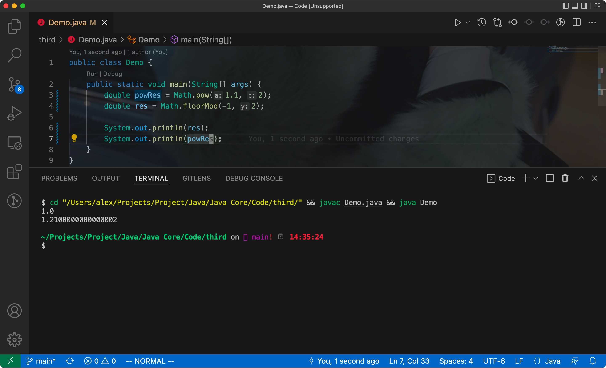

# 一、Java基础程序设计结构


## 1. 一个简单的Java应用程序

Eg:


- Java区分大小写(case sensitive)


分析code:

关键字public被称为**访问修饰符**(access modifier)

**修饰符用来控制程序的其他部分对当前这段程序的访问级别**


- 标准的命名规范:

类名是以大写字母开头的**名词**

如果由多个名词组成，那么每个单词的第一个字母都应该大写才行(大驼峰命名法/CamelCase)


**源文件的文件名**必须和**公共类的名字**相同


- 编译后的字节码文件会与源文件存储在同一个目录下
- 根据语言规范，main方法必须声明为public
- 每个Java应用程序都必须有一个main方法

<hr>


## 2. 注释

在Java中有3种注释，其中最常用的是//，其可注释的内容从//开始到本行结尾


- 如果需要长篇的注释，则可以如下注释将一段比较长的内容括起来

```java
/*

*/
```


最后一种可以用来自动地生成文档

```java
/**
*/
```


Code


注意:

在Java中，/**/注释不能相互嵌套

<hr>


## 3. 数据类型

- Java是一种强类型语言

> 这意味着**必须**为每个变量声明一个类型


8种基本类型(primitive type):

- 4种整形
- 2种浮点型
- 1种字符类型
- 1种boolean类型

<hr>


### 1) 整型

| Type  | Storage |          length          |
| :---: | ------- | :----------------------: |
|  int  | 4byte   | -2^31~2^31 - 1(超过20亿) |
| short | 2byte   |     -2^15 ~ 2^15 - 1     |
| long  | 8byte   |     -2^63 ~ 2^63 - 1     |
| byte  | 1byte   |        -128 ~ 127        |


- 在Java中，整型的范围与运行Java的机器无关，这样就解决了移植的问题
- long类型的数据后面需要添加一个L后缀
- 十六进制数有一个前缀"0x"或者"0X"；八进制数有一个前缀"0"


从Java7开始:

- 加上前缀0B/0b可以写二进制数
- 可以为数字字面量加下划线: 1_000_000(只是为了让人更易读)


Eg:


<hr>


### 2) 浮点类型

浮点类型可以用于表示有小数部分的数值

|  type  | storage |     length      |
| :----: | :-----: | :-------------: |
| float  |  4byte  | 有效位数有6~7位 |
| double |  8byte  | 有效位数有15位  |


float类型的数值需要加上后缀F/f，浮点数值没有的话默认为double类型

- 十六进制表示法:

0.125=2^-3^ -> 0x1.0p-3，其中p代表指数，指数的**基数为2，不是10**


- 所有的浮点数遵循IEEE754标准


溢出/出错的三个特殊情况下的浮点数值:

- 正无穷大(Double.POSITIVE_INFINITY)
- 负无穷大(Double.NEGATIVE_INFINITY)
- NaN(Double.NaN)


检测一个值是否为Double.NaN，需要使用Double.isNaN方法

Eg:


<hr>


### 3) char类型	

- char类型原本表示单个字符，**但现在不是了**
- 现在有些Unicode字符用一个char值描述，其余则使用两个char值
- char类型的字面量需要用单引号括起来

> char类型的值可以表示为16进制值，其范围从\u0000到\uffff，共2^16^ - 1


除了\u之外，还有其他的转移序列可以表示不同的意思


Eg:


**注意**：Unicode转移序列会在解析代码之前就得到处理，所以一定要注意注释中的转移序列

<hr>


### 4) Unicode/char

- 从Java SE5.0开始，**码点(code point)是指一个编码表中的某个字符对应的代码值**
- 在Unicode标准中，码点采用十六进制书写，并加上前缀"U+"
- Unicode的码点可以分为17个代码级别(code plane)
- UTF-16编码中，采用不同长度的编码表示所有的Unicode码点；在基本的多语言级别中，每个字符用16位表示，称为代码单元(code unit)；辅助字符则采用一对连续的代码单元进行encode(即两个16位的代码单元)

> Java中，char类型描述了UTF-16编码中的一个代码单元(16bit)
>
> 一个码点对应一个字符，但一个码点不一定对应一个代码单元

<hr>


## 4. 变量


### 1) 初始化

- 声明一个变量后，必须用赋值语句对变量进显式初始化
- 变量的声明最好靠近变量第一次使用的地方

<hr>


### 2) 常量

- 在Java中使用`final`关键字标记常量

Code:

```java
public class Constants {
  public static void main(String[] args) {
    final double CM_PER_INCH = 2.54;
    double paperWidth = 8.5;
    double paperHeight = 11;
    System.out.println("Paper size int centimeters: " + paparWidth * CM_PER_INCH);
  }
}
```


- `final`表示这个变量只能够被赋值一次。赋值后就不能再更改了，一般将常量名全大写，且单词之间用下划线隔开

<hr>


## 5. 运算符

注意:

> 整数被0除会产生异常，浮点数被0除会得到Double.INFINITY或者NaN


### 1) 数学函数/常量

幂运算:

```java
double y = Math.pow(x, a)
```

y将被设置为x的a次幂，注意返回类型为double


整数取余:

```java
int n = Math.floorMod(-1, 2);
```


Eg:




三角函数:

Math.sin

Math.cos

Math.tan

Math.atan

Math.atan2


指数函数和反函数(自然对数/10为底的对数):

Math.exp

Math.log

Math.log10


表示PI和e的常量:

Math.PI

Math.E


Eg:


<hr>


### 2) 数值类型转换(自动类型转换)

使用两个数值进行二元运算时，要先将两个数值转换为同一类型，然后再进行计算


<hr>


### 3) 强制类型转换

对浮点数进行舍入运算，可以使用Math.round方法:

```java
double x = 9.997;
int nx = (int) Math.round(x);
```


> 如果类型转换时超出了目标类型的表示范围，结果就会截断为完全不同的值

<hr>


### 4) 位运算符

&(and): 按位与。对应的bit都为1才为1

|(or): 按位或。有一个bit为1都为1

^(xor): 异或。对应bit都为1，则为0；否则为1(与&相反)


```
>>: 将所有的bit右移
<<: 将bit左移
>>>: 不带符号位填充高位
```

<hr>


### 5) 枚举类型

使用的时候，通过枚举类进行调用即可


枚举类和普通类类似，只不过字段固定(可以有方法)

<hr>


## 6. 字符串

> Java没有内置的字符串类型，而是在标准的Java库里提供了一个String预定义类


### 1) 子串

通过subsring即可，其中第二个参数是不想复制的第一个位置

<hr>


### 2) 拼接

Java可以使用+来连接字符串


如果需要将多个字符串进行拼接，且用定界符分隔的话，可以使用静态方法join:


<hr>


### 3) 不可变字符串

- Java字符串中的字符不能被修改，所以需要在原字符串的基础上进行提取，之后再进行拼接

> 拼接后的字符串是一个新的字符串


不可变字符串有利于编译器共享字符串

<hr>


### 4) 检测字符串是否相等

- 使用equals方法即可
- 如果想要检测相等时忽略大小写，则可以使用equalsIgnoreCase方法


- 使用"=="只能检测两个字符串是否相等，即判断两个字符串是否处于内存中的同一个位置处


> Java中只有字符串常量(字面量)是共享的，而使用"+"/substring等操作产生的结果不是共享的

<hr>


### 5) 空串/NULL

检查一个字符串既不是空串也不是null:

```java
if (str != null && str.length() > 0)
```


<hr>


### 6) 码点/代码单元

- char类型是一个采用UTF-16编码表示Unicode码点的代码单元
- 大多数常用的Unicode字符可以使用一个代码单元，辅助字符则需要两个代码单元


String实例的length方法：

- 返回字符串需要的**代码单元数量**，即Unicode code unit(而不是字符数量)
- 可以使用codePointCount方法获取对应范围内的码点数量(一个字符对应一个码点)


<hr>


### 7) String API


- char charAt(int index)

返回给定索引位置处的**代码单元**

- int codePointAt(int index)

返回给定位置处的码点

- int offsetByCodePoints(int startIndex, int cpCount)

返回从startIndex处开始，移动cpCount后的**码点索引**

- int compareTo(String other)

按照字典序比较字符串，如果当前字符串对象在参数对象前面，则返回一个负数，反之返回正数，相等则为0

- IntStream codePoints()

将字符串的码点作为一个流返回

- new String(int[] codePoints, int offset, int count)

将码点构造为一个字符串


- boolean startsWith(String prefix)

判断字符串是否以prefix字符串开头

- boolean endsWith(String suffix)

判断字符串是否以suffix字符串结尾

- int codePointCount(int startIndex, int endIndex)

返回参数区间内的码点数量

- String replace(CharSequence oldString, CharSequence newString)

用newString代替原始字符串中所有的oldString，参数可以是String/StringBuilder实例

- String trim()

删除原字符串头/尾的空格，然后返回一个新的字符串

- String join(CharSequence delimiter, CharSequence... elements)

返回一个新的字符串，并用给定的定界符连接所有的元素


Eg:


<hr>


### 8) 构建字符串

- 对于较短的字符构建字符串，或者来自按键/文件中的单词，使用字符串连接的话效率会很低的
- 使用StringBuilder就能解决这个问题


> StringBuilder自JDK5.0被引入，其前身为StringBuffer
>
> StringBuffer的效率较低，但其是线程安全的，适用于多线程的情况
>
> 如果所有字符串都在一个单线程中处理，则使用StringBuilder即可


相关方法:


<hr>


## 7. 输入输出


### 1) 输入

读取"标准输入流"的过程:

- 构造一个Scanner对象，并与"标准输入流"System.in关联

```java
Scanner in = new Scanner(System.in);
```


读取一行输入:

```java
String name = in.nextLine();
```


读取下一个整数:

```java
int age = in.nextInt();
```


读取下一个浮点数:

```java
double weight = in.nextDouble();
```


Code:


Scanner对应的实例方法:


<hr>


### 2) 格式化输出

- Java SE 5.0中沿用了C库函数中的printf方法


Eg:

```java
System.out.printf("%8.2f", x);
```


用于printf的转换符:


用于printf的标志:


<hr>


### 3) 读写文件

- 想要对文件进行读取，则需要用一个File对象构造一个Scanner对象

Eg:

```java
Scanner in = new Scanner(Paths.get("myfile.txt"), "UTF-8");
```


- 想要写文件则需要构造一个PrintWriter对象，在其构造器中提供文件名即可

Eg:

```java
PrintWriter out = new PrintWriter("myfile.txt", "UTF-8");
```


因为如果用一个不存在的文件构造Scanner会抛出异常，所以我们需要在main方法中加上throw标记

```java
public static void main(String[] args) throw IOException {
  Scanner in = new Scanner(Paths.get("file.txt"), "UTF-8");
  ...
}
```

<hr>


### 4) 控制流程


#### 1. 块作用域

- 块(block)决定了变量的作用域(scope)
- 不能在嵌套的两个块中声明同名的变量

<hr>


#### 2. 条件语句

- else子句与最邻近的if组成一组

<hr>


#### 3. 循环

while循环:

```java
while (condition) statement;
```


Eg Code:

```java
import java.util.Scanner;

public class Retirement {
    public static void main(String[] args) {
        Scanner in = new Scanner(System.in);

        System.out.println("How much money do you need to retire? ");
        double goal = in.nextDouble();

        System.out.println("How much money will you contribute every year? ");
        double payment = in.nextDouble();

        System.out.println("Interest rate in %: ");
        double interestRate = in.nextDouble();

        double balance = 0;
        int year = 0;

        while (balance < goal) {
            balance += payment;
            double interest = balance * interestRate / 100;
            balance += interest;
            year++;
        }

        System.out.println("You can retire in " + year + " years.");
    }
}
```


如果想要循环体至少执行一次，那么可以使用do/while循环语句:

```java
do statement while (condition);
```


Eg Code:

```java
import java.util.*;

public class Retirement2 {
    public static void main(String[] args) {
        Scanner in = new Scanner(System.in);

        System.out.println("How much money do you need to retire? ");
        double goal = in.nextDouble();

        System.out.println("How much money will you contribute every year? ");
        double payment = in.nextDouble();

        System.out.println("Interest rate in %: ");
        double interestRate = in.nextDouble();

        double balance = 0;
        int year = 0;

        String input;

        do {
            balance += payment;
            double interest = balance * interestRate / 100;
            balance += interest;

            year++;

            System.out.printf("After year %d, your balance is %,.2f%n", year, balance);

            System.out.print("Ready to retire? (Y/N) ");
            input = in.next();
        } while (input.equals("N"));

        System.out.println("You can retire in " + year + " years.");
    }
}
```

<hr>


#### 4. 确定循环(for)

- for循环的第一部分用于对计数器进行初始化
- 第二部分则是每轮循环执行前要检测的循环条件
- 第三部分则指明如何更新计数器

> for循环的3个部分最好对同一个计数器变量进行初始化、检测和更新


- 当一个变量在`for`语句的第1部分中声明后，这个变量的作用域就为整个`for`循环体
- 且该变量不能在`for`循环之外使用
- 可以在不同的`for`循环中使用同名的变量
- for和while可以相互替换


Eg Code:

```java
import java.util.Scanner;

public class LotteryOdds {
    public static void main(String[] args) {
        Scanner in = new Scanner(System.in);

        System.out.println("How many numbers do you need to draw? ");
        int k = in.nextInt();

        System.out.println("What is the highest number you can draw? ");
        int n = in.nextInt();

        int lotteryOdds = 1;

        for (int i = 1; i <= k; i++) {
            lotteryOdds = lotteryOdds * (n - i + 1) / i;
        }

        System.out.println("Your odds are 1 in " + lotteryOdds + ". Good luck!");
    }
}
```

<hr>


#### 5. 多重选择switch

- 用法和C/C++完全一致


case标签中允许的类型:

- char, byte, short, int等常量表达式
- 枚举常量
- 从Java SE7开始，case标签还可以是字符串字面量

<hr>


#### 6. 中断流程

break有带标签和不带标签之分，不带标签的用法和C/C++一致


带标签的break语句:

- 用与跳出多重嵌套循环语句
- 标签必须放在希望跳出的最外层循环之前，且标签后要紧跟一个冒号

Syntax:

```java
lable_name:

while () {
  break lable_name;
}
```


同时也可以用在if/块语句中:

```java
lable:
{
  if (condition) break label;
}
```


- continue和break一样，不过continue不会跳出循环，而是直接跳到for循环的更新部分/while的判断部分

<hr>


## 8. 大数值

如果基础数据类型不能满足精度要求，则需要使用java.math包下的BigInteger和BigDecimal类

- 这个两个类可以处理任意长度数字序列的数值
- BigInteger: 任意精度的整数运算
- BigDecimal: 任意精度的浮点数运算

使用静态的valueOf方法可以将普通的数值转换为大数值:

```java
BigInteger a = BigInteger.valueOf(100);
```


- 需要使用add和multipy方法处理数值:

```java
BigInteger c = a.add(b);
BigIntger d = c.multipy(b.add(BigInteger.valueOf(2)));
```


Eg Code:

```java
import java.math.BigInteger;
import java.util.Scanner;
import java.util.function.BinaryOperator;

public class BigIntegerTest {
    public static void main(String[] args) {
        Scanner in = new Scanner(System.in);

        System.out.println("How many numbers do you need to draw? ");
        int k = in.nextInt();

        System.out.println("What is the highest number you can draw? ");
        int n = in.nextInt();

        BigInteger lotteryOdds = BigInteger.valueOf(1L);

        for (int i = 1; i <= k; i++) {
            lotteryOdds = lotteryOdds.multiply(BigInteger.valueOf(n - i + 1)).divide(BigInteger.valueOf(i));
        }

        System.out.println("Your odds are 1 in " + lotteryOdds + " . Good luck!");
    } 
}

```


API:

- BigInteger add(BigInteger other)
- BigInteger substract(BigInteger other)
- BigInteger multipy(BigInteger other)
- BigInteger divide(BigInteger other)
- BigInteger mod(BigInteger other)
- static BigInteger valueOf(BigInteger other)


<hr>


## 9. 数组

- 数组: 用来存储同一类型值的集合，通过一个int下标可以访问数组中的每个值


初始化:

- 对于数字数组，每个元素都会初始化0
- boolean元素初始化为false
- 对象数组中的元素初始化为特殊值null


获取数组的长度:

数组名.length


- 一旦创建数组，其长度就固定了

<hr>


### 1. for each

Java中有一种增强的循环结构:

```java
for (variable : collection) statement
```

- 可以用来处理数组中的每个元素
- collection必须是一个数组获取实现了Iterable接口的类实例


如果想要打印数组所有值，使用Arrays类中的toString方法即可

<hr>


### 2. 数组初始化/匿名数组

创建数组的简写形式:

```java
int[] smallPrimes = {2, 3, 5, 7, 11, 13};
```


初始化匿名数组:

```java
new int[]{17, 19, 23, 29, 31, 37};
```

<hr>


### 3. 数组拷贝

- 将一个数组标量拷贝给另一个的话，两个数组变量就将引用同一个数组(浅拷贝)


如果希望将一个数组中的所有值拷贝到一个新的数组中去，那么就需要使用Arrays中的copyOf方法

```java
int[] copiedLuckyNumber = Arrays.copyOf(luckyNumbers, luckyNumbers.length);
```


- Arrays.copyOf通常用来进行数组扩容

<hr>


### 4. 数组排序

- 直接调用Arrays.sort方法即可对参数数组进行排序

> 对于原始类型，sort方法采用了优化的快速排序，如果是引用类型，则会采用归并排序


Eg Code:

```java
import java.util.Arrays;
import java.util.Scanner;

public class LotteryDrawing {
    public static void main(String[] args) {
        Scanner in = new Scanner(System.in);

        System.out.println("How many numbers do you need to draw? ");
        int k = in.nextInt();

        System.out.println("What is the highest number you can draw? ");
        int n = in.nextInt();

        int[] numbers = new int[n];
        for (int i = 0; i < numbers.length; i++) {
            numbers[i] = i + 1;
        }

        int[] result = new int[k];
        for (int i = 0; i < result.length; i++) {
            int r = (int) Math.random() * n;

            result[i] = numbers[r];

            numbers[r] = numbers[n - 1];
            n--;
        }

        Arrays.sort(result);
        System.out.println("Bet the following combination. It'll make you rich!");
        for (int r : result) {
            System.out.println(r); 
        }
    }
}

```


Arrays API:

- static String toString(type[] a)

将数组中的所有元素以字符串的形式返回

- static type copyOf(type[] a, int length)

复制对应长度的数组元素

- static type copyOfRange(type[] a, int start, int end)

拷贝对应范围内的数组元素

- static void sort(type[] a)

对数组进行排序

- static int binarySearch(type[] a, type v)

在有序数组中使用二分查找法搜索对应的元素并返回索引

- static void fill(type[] a, type v)

将对应数组中的所有元素设置为指定的值

- static boolean equals(type[] a, type[] b)

判断两个数组是否相等

<hr>


### 5. 多维数组

声明一个多维数组:

```java
double[][] balances;

初始化:
double[][] balances = new double[NYEARS][NRATES];
```


简写的方式初始化多维数组:

```java
int[][] magicSquare = {
  {16, 3, 2, 13},
  {5, 10, 11, 8}
};
```


快速打印一个二维数组:

```java
Arrays.deepToString(a);
```


Eg Code:

```java
public class CompoundInterest {
    public static void main(String[] args) {
        final double STARTRATE = 10;
        final int NRATES = 6;
        final int NYEARS = 10;

        double[] interestRate = new double[NRATES];
        for (int i = 0; i < interestRate.length; i++) {
            interestRate[i] = (STARTRATE + i) / 100.0;
        }

        double[][] balances = new double[NYEARS][NRATES];

        for (int col = 0; col < balances[0].length; col++) {
            balances[0][col] = 10000;
        }

        for (int row = 1; row < balances.length; row++) {
            for (int col = 0; col < balances[i].length; col++) {
                double oldBalance = balances[row - 1][col];

                double interest = oldBalance * interestRate[col];

                balances[row][col] = oldBalance + interest;
            }
        }

        for (int i = 0; i < interestRate.length; i++) {
            System.out.printf("%9.0f%%", 100 * interestRate[i]); 
        }

        System.out.println();

        for (double[] row : balances) {
            for (double b : row) {
                System.out.println("%10.2f", b); 
            } 

            System.out.println();
        }
    }    
}

```

<hr>


### 6. 不规则数组

创建不规则数组:

- 首先需要创建一个具有所含行数的数组:

```java
int[][] odds = new int[NMAX + 1][];
```

- 然后分配行:

```java
for (int n = 0; n < odds.length; n++) {
  odds[n] = new int[n + 1];
}
```


Eg Code:

```java
public class LotteryArray {
    public static void main(String[] args) {
        final int NMAX = 10;

        int[][] odds = new int[NMAX + 1][];
        for (int n = 0; n <= NMAX; n++) {
            odds[n] = new int[n + 1];
        }

        for (int n = 0; n < odds.length; n++) {
            for (int k = 0; k < odds[n].length; k++) {
                int lotteryOdds = 1;
                for (int i = 1; i <= k; i++) {
                    lotteryOdds = lotteryOdds * (n - i + 1) / i;
                }

                odds[n][k] = lotteryOdds;
            }
        }

        for (int[] row : odds) {
            for (int odd : row) {
                System.out.printf("%4d", odd); 
            } 

            System.out.println();
        }
    }
}
```


Output:


<hr>


# 二、对象/类


## 1. OOP

- 对于规模较小的问题，分解为过程的开发方式比较理想(POP)
- 对于规模较大的问题，则适用于面向对象


### 1) 类

> 由类构造对象的过程称为创建类的实例
>
> 构造出的对象就是类的实例


- 封装

从形式上看是将数据和行为组合在一个包内，并隐藏了具体的实现过程

> 对象中的数据称为实例域(instance field)，操作数据(实例域)的过程即为方法
>
> 每个对象的实例域值的集合称为当前对象的状态(state)


封装的关键:

> 不能让类中的实例域直接被其他类的方法访问
>
> 只能通过对象的方法对类的实例域进行修改/交互

<hr>


### 2) 对象

对象的三个特征:

- 对象的行为(behavior): 即类的方法
- 对象的状态(state): 类中实例域值的集合
- 对象标识(identity): 辨别不同对象的依据

<hr>


### 3) 构建类

构建类的简单规则:

- 在分析问题的过程中寻找名词，方法则对应名词(动词 + 名词)

<hr>


## 2. 预定义类


### 1) 对象/对象变量

- 使用对象前需要使用构造器(constructor)构造新的实例


对象变量:

- 一个对象变量没有包含一个实际的对象，仅仅只是引用了一个对象实例
- new操作符的返回值也是一个引用/对象变量


局部变量不会自动初始化为null，需要进行初始化(方法内的)

<hr>


### 2) Java类库中的LocalDate类

Java类库中，将保存时间和时间点命名分开来了


- 表示时间点: Date
- 保存时间: LocalDate


`LocalDate`类对象使用静态工厂方法来构造:

```java
LocalDate.now();
```


提供对应的日期，构造一个特定的日期对象:

```java
LocalDate.of(1999, 12, 31)
```

<hr>


### 3) 更改器方法与访问器方法


更改器方法:

- 会改变对象的状态


访问器方法:

- 只访问对象而不修改对象本身的状态的方法


Code:

```java
import java.time.*;

public class CalendarTest {
    public static void main(String[] args) {
        LocalDate date = LocalDate.now();
        int month = date.getMonthValue();
        int today = date.getDayOfMonth();

        date = date.minusDays(today - 1);
        DayOfWeek weekday = date.getDayOfWeek();
        int value = weekday.getValue();

        System.out.println("Mon Tue Wed Thu Fri Sat Sun");
        for (int i = 1; i < value; i++) {
            System.out.print("    ");
        }

        while (date.getMonthValue() == month) {
            System.out.printf("%3d", date.getDayOfMonth());
            if (date.getDayOfMonth() == today) {
                System.out.print("*");
            } else {
                System.out.print(" ");
            }
            date = date.plusDays(1);

            if (date.getDayOfWeek().getValue() == 1) {
                System.out.println();
            }
        }

        if (date.getDayOfWeek().getValue() != 1) {
            System.out.println();
        }
    }
}
```


Eg:


java.time.LocalDate

- static LocalTime new()

构造一个表示当前日期的对象


- static LocalTime of(int year, int month, int day)

构造一个给定日期的对象


- int getYear()
- int getMonthValue()
- int getDayOfMonth()
- DayOfWeek getDayOfWeek()
- LocalDate plusDays(int n)
- LocalDate minusDay(int n)

<hr>


## 3. 用户自定义类


### 1) Employee类

Code:

```java
import java.time.LocalDate;

public class EmployeeTest {
    public static void main(String[] args) {
        Employee[] staff = new Employee[3];

        staff[0] = new Employee("Carl Cracker", 75000, 1987, 12, 15);
        staff[1] = new Employee("Harry Hacker", 50000, 1989, 10, 1);
        staff[2] = new Employee("Tony Tester", 40000, 1990, 3, 15);

        for (Employee e : staff) {
            e.raiseSalary(5);
        }

        for (Employee e : staff) {
            System.out.println("name=" + e.getName() + ",salary=" + e.getSalary() + ",hireDay="
                    + e.getHireDay());
        }
    }
}

class Employee {
    private String name;
    private double salary;
    private LocalDate hireDay;

    public Employee(String n, double s, int year, int month, int day) {
        name = n;
        salary = s;
        hireDay = LocalDate.of(year, month, day);
    }

    public String getName() {
        return name;
    }

    public double getSalary() {
        return salary;
    }

    public LocalDate getHireDay() {
        return hireDay;
    }

    public void raiseSalary(double byPercent) {
        double raise = salary * byPercent / 100;
        salary += raise;
    }

}
```

<hr>


### 2) 多个源文件

如果有多个源文件需要编译，可以直接对其中一个具有Main的，获取引用最多类的文件进行编译，编译器会自动寻找其他类文件，并进行编译

> 如果源文件的版本比之前编译得到的class文件要新，则编译器会自动编译该文件

<hr>


### 3) 隐式参数/显示参数

在Employee类中，`raiseSalary`方法:

```java
number007.raiseSalary(5);

double raise = number007.salary * 5 / 100;
number007.salary += raise;
```


该方法有两个参数


- 第一参数为隐式参数:
    - 方法名前的Employee类对象
- 第二参数为显示参数:
    - 位于方法名后括号中的数值

> 显示参数是列在方法声明中的
>
> 隐式参数没有出现在方法声明中

<hr>


### 4) 封装的优点

`getName`、`getSalary`，`getHireDay`方法都是访问器方法


实例域的值应该具有的内容:

- 私有的数据域
- 公有的域访问器
- 公有的域更改器


这样写的好处:

1. 可以改变内容实现，但不会影响其他引用的部分
2. 更改器方法可以在赋值之前进行检查


注意：不要编写返回引用可变对象的访问器方法

> 如果需要返回一个可变对象的引用，应该首先对其进行克隆，再返回这个对象的副本

<hr>


### 5) 私有方法

- 在设计类的时候，有时会将一个方法拆分为多个独立的辅助方法
- 这些辅助方法不应该成为公有方法的一部分
- 如果私有方法不再使用，则对应的私有方法直接删除即可

<hr>


### 6) final实例域

- 定义为final的实例域在构建对象时必须初始化，且在之后的操作中，不能再对其进行修改

<hr>


### 7) 静态域/静态方法


#### (1) 静态域

- 被定义为static的域，则为静态域，其属于类，不属于任何独立的对象/实例

<hr>


#### (2) 静态方法

- 静态方法不能向对象使用，也就是没有隐式参数

> 可以认为静态方法就是没有this参数的方法


静态方法不能访问实例域，因为它不能操作对象；但静态方法可以访问类中的静态域

使用静态方法的两种情况:

- 不需要访问对象状态(字段/域)，所有参数都是显式参数
- 方法只需要反问类的静态域

<hr>


#### (3) 工厂方法

静态方法的一种常见用途:

> 使用静态方法构造对象


- 部分场景下，希望得到的对象实例和类名不同，所以需要使用静态工厂方法构造对象
- 构造器无法改变构造的对象类型，工厂方法可以返回对应的子类

<hr>


#### (4) main方法

- main方法本身不对任何对象进行操作，其执行并创建对象


Code:

```java
public class StaticTest {
    public static void main(String[] args) {
        Employee[] staff = new Employee[3];

        staff[0] = new Employee("Tom", 40000);
        staff[1] = new Employee("Dick", 60000);
        staff[2] = new Employee("Harry", 65000);

        for (Employee e : staff) {
            e.setId();
            System.out.println("name=" + e.getName() + ",id=" + e.getId() + ",salary=" + e.getSalary());
        }

        int n = Employee.getNextId();
        System.out.println("Next available id=" + n);
    }
}

class Employee {
    private static int nextId = 1;
    private String name;
    private double salary;
    private int id;

    public Employee(String n, double s) {
        name = n;
        salary = s;
        id = 0;
    }

    public String getName() {
        return name;
    }

    public double getSalary() {
        return salary;
    }

    public int getId() {
        return id;
    }

    public void setId() {
        id = nextId;
        nextId++;
    }

    public static int getNextId() {
        return nextId;
    }

    public static void main(String[] args) {
        Employee e = new Employee("Harry", 50000);
        System.out.println(e.getName() + " " + e.getSalary());
    }
}
```

<hr>


## 4. 方法参数

- 按值调用(call by value): 方法接收的是调用者提供的值
- 按引用调用(call by reference): 方法接收的是提供的变量地址

> Java总是按值传递的


Java中方法参数总结:

- 方法不能修改基本数据类型的参数
- 方法可以改变一个对象参数的状态(域)
- 方法不能让对象参数引用出一个新的对象

Code:

```java
import java.util.logging.Handler;

public class ParamTest {
    public static void main(String[] args) {
        System.out.println("Testing tripleValue:");
        double percent = 10;
        System.out.println("Before: percent=" + percent);
        tripleValue(percent);
        System.out.println("After percent=" + percent);


        System.out.println("\nTesting tripleSalary:");
        Employee harry = new Employee("Harry", 50000);
        System.out.println("Before: salary=" + harry.getSalary());
        tripleSalary(harry);
        System.out.println("After salary=" + harry.getSalary());


        System.out.println("\nTest swap:");
        Employee a = new Employee("Alice", 70000);
        Employee b = new Employee("Bob", 60000);
        System.out.println("Before: a=" + a.getName());
        System.out.println("Before: b=" + b.getName());
        swap(a, b);
        System.out.println("After: a=" + a.getName());
        System.out.println("After: b=" + b.getName());
    }

    public static void tripleValue(double x) {
        x = 3 * x;
        System.out.println("End of method: x=" + x);
    }

    public static void tripleSalary(Employee x) {
        x.raiseSalary(200);;
        System.out.println("End of method: salary=" + x.getSalary());
    }

    public static void swap(Employee x, Employee y) {
        Employee temp = x;
        x = y;
        y = temp;
        System.out.println("End of method: x=" + x.getName());
        System.out.println("End of method: y=" + y.getName());
    }
}

class Employee {
    private String name;
    private double salary;

    public Employee(String n, double s) {
        name = n;
        salary = s;
    }

    public String getName() {
        return name;
    }

    public double getSalary() {
        return salary;
    }

    public void raiseSalary(double byPercent) {
        double raise = salary * byPercent / 100;
        salary += raise;
    }
}
```

<hr>


## 5. 对象构造


### 1) 重载

> 如果多个方法有相同的名字、不同的参数，便产生了重载

- 编译器通过不同方法的参数类型，以及方法调用使用的值类型来挑选出对应的方法


> 要完整描述一个方法，需要指出方法名和参数类型，其称为方法签名(signature)

- 方法名相同，则参数类型或者数量不同才能进行重载

<hr>


### 2) 默认域初始化

- 类的域会被赋予初始值
- 而局部变量则不会

<hr>


### 3) 无参数构造器

- 如果一个类中没有构造器，则系统会提供一个无参数的构造器，其将所有的域都设置为默认值

<hr>


### 4) 初始化块

初始化数据域的方法:

- 在构造器中设置值
- 域的声明中设置值
- 初始化块(initialization block)

只要构造类的对象，初始化块就会执行；一般都用构造器而不是初始化块


- 对于静态域进行初始化，需要使用静态初始化块
- 静态域在类第一次加载的时候就会进行初始化


Code:

```java
import java.util.Random;

public class Contstructor {
    public static void main(String[] args) {
        Employee[] staff = new Employee[3];

        staff[0] = new Employee("Harry", 40000);
        staff[1] = new Employee(60000);
        staff[2] = new Employee();

        for (Employee e : staff) {
            System.out.println("name=" + e.getName() + ",id=" + e.getId() + ",salary=" + e.getSalary()); 
        }
    } 
}

class Employee {
    private static int nextId;
    private int id;
    private String name = "";
    private double salary;

    static {
        Random generator = new Random();
        nextId = generator.nextInt(10000);
    }

    {
        id = nextId;
        nextId++;
    }

    public Employee(String n, double s) {
        name = n;
        salary = s;
    }

    public Employee(double s) {
        this("Employee #" + nextId, s);
    }

    public Employee() {

    }

    public String getName() {
        return name;
    }

    public double getSalary() {
        return salary;
    }

    public int getId() {
        return id;
    }
}

```

<hr>


## 6. 包

- 使用包的主要原因: 确保类名的唯一性


### 1) 类的导入

访问其他包中的公有类的方法:

1. 在类中中添加完整的包名
2. 使用`import`

可以使用`*`表示导入包内的所有类(明确指出导入的类可读性较好)


如果导入的两个包中有同名的类，则需要指明导入的类:

```java
import java.util.*;
import java.sql.*;
import java.util.Date;
```


如果两个类都需要使用，那么需要在类名前添加完整的包名:

```java
java.util.Date deadline = new java.util.Date();
java.sql.Date today = new java.sql.Date();
```

编译器通过完整的包名类定位类

<hr>


### 2) 静态导入

`import`语句还可以导入静态方法和静态域


```java
import static java.lang.System.*;
```

<hr>


### 3) 将类放入包中

- 将包的名字放在源文件的开头，就可以将类放在包中


> 如果在源文件中放置package语句，则会放在一个默认的包中(一个没有名字的包)


编译器对文件进行操作(带有文件分割符和.java文件)

解释器加载类(带有.)


Code:

PackageTest.java:

```java

import static java.lang.System.*;
import third.PackageTest.com.horstmann.corejava.Employee;

public class PackageTest {
    public static void main(String[] args) {
        Employee harry = new Employee("Harry Hacker", 50000, 1989, 10, 1);

        harry.raiseSalary(5);

        out.println("name=" + harry.getName() + ",salary=" + harry.getSalary());
    }
}

```


Employee.java:

```java
package third.PackageTest.com.horstmann.corejava;

import java.time.LocalDate;

public class Employee {
    private String name;
    private double salary;
    private LocalDate hireDay;

    public Employee(String name, double salary, int year, int month, int day) {
        this.name = name;
        this.salary = salary;
        hireDay = LocalDate.of(year, month, day);
    }

    public String getName() {
        return this.name;
    }

    public double getSalary() {
        return this.salary;
    }

    public LocalDate getHireDay() {
        return this.hireDay;
    }

    public void raiseSalary(double byPercent) {
        double raise = salary * byPercent / 100;
        salary += raise;
    }
}

```

<hr>


### 4) 包作用域

- 标记为public: 可以被任意类使用
- 标记为private: 只能被定义它们的类使用
- 没有标记: 只能被同一个包中的方法访问


> 从JDK1.2开始，禁止加载用户自定义的、包名以`java.`开始的类

<hr>


## 5. 文档注释

- 文档注释与源代码位于同一个文件中


### 1) 方法注释

方法注释的标记:

- @param: 变量
- @return: 描述
- @throws: 表示方法可能抛出的异常

<hr>


### 2) 域注释

只对静态常量建立文档

<hr>


### 3) 通用注释


类文档注释标记:

@author: 姓名

@version: 当前的版本描述

@since: 文本

@deprecated: 表示当前类不再使用

<hr>


## 6. 类设计

1. 保证数据私有化(不要破坏封装性)
2. 要对数据进行初始化
3. 不要使用过多的基本类型
4. 为需要的域设置访问器和修改器
5. 类的职责要明确
6. 类名和方法名要明确反应出其作用
7. 优先使用不可变的类

<hr>


# 三、继承


## 1. 类、超类和子类


### 1) 定义子类

> extends关键字表示构造的新类派生于一个已经存在的类
>
> 已经存在的类称为超类(superclass)，基类(base class)或者父类(parent class)
>
> 新的类称为子类(subclass)、派生类(derived class)或者孩子类


- 通用的方法应该放在超类里，具有特殊用途的方法应该放在子类里

<hr>


### 2) 覆盖方法

- 如果超类中的方法对子类不适用，那么可以在子类中提供一个新的方法，来"覆盖"超类中的方法
- 如果子类中重写了超类中的方法，那么想要调用超类中的方法的话，需要使用关键字`super`

> 注意，`this`可以代表实例，但`super`并不代表实例对象


- 子类可以增加域、增加方法或者重写超类方法，但不能删除继承的任何域和方法

<hr>


### 3) 子类构造器

- 如果在构造对象时，想要对超类的私有域进行初始化，那么需要调用超类的构造器方法对这部分私有域进行初始化

> 如果子类的构造器没有显式调用超类构造器，则会自动调用超类默认的构造器(不带参数的)，如果超类没有默认构造器，且子类中没有调用其他的超类构造器，则会报错


- 一个对象变量/引用，可以指示多种实际类型的现象被称为多态(polymorphism)
- 在运行时能够自动选择调用哪个方法的现象称为动态绑定(Dynamic Dinding)


Code:


Employee.java:

```java
import java.time.*;

public class Employee {
    private String name;
    private double salary;
    private LocalDate hireDay;

    public Employee(String name, double salary, int year, int month, int day) {
        this.name = name;
        this.salary = salary;
        hireDay = LocalDate.of(year, month, day);
    }

    public String getName() {
        return this.name;
    }

    public double getSalary() {
        return this.salary;
    }

    public LocalDate getHireDay() {
        return this.hireDay;
    }

    public void raiseSalary(double byPercent) {
        double raise = salary * byPercent / 100;
        salary += raise;
    }
}
```


Manager.java:

```java
public class Manager extends Employee {
    private double bonus;

    public Manager(String name, double salary, int year, int month, int day) {
        super(name, salary, year, month, day);
        this.bonus = 0;
    }

    public double getSalary() {
        double baseSalary = super.getSalary();
        return baseSalary + this.bonus;
    }

    public void setBonus(double b) {
        this.bonus = b;
    }
}

```


ManagerTest.java:

```java
public class ManagerTest {
    public static void main(String[] args) {
        Manager boss = new Manager("Carl Cracker", 80000, 1987, 12, 15);
        boss.setBonus(5000);

        Employee[] staff = new Employee[3];

        staff[0] = boss;
        staff[1] = new Employee("Harry Hacker", 50000, 1989, 10, 1);
        staff[2] = new Employee("Tommy Tester", 40000, 1990, 3, 15);

        for (Employee e : staff) {
            System.out.println("name=" + e.getName() + ",salary=" + e.getSalary()); 
        }
    }
}
```

<hr>


### 4) 继承层次

- 由同一个父类衍生出来的所有类的集合称为继承层次(inheritance hierarchy)，
- 从特定的类到其祖先的路径称为该类的"继承链"(inheritance chain)

<hr>


### 5) 多态

子类的引用可以赋给超类，但超类的引用不能赋给子类(不能随便将一个员工升级为经理)

<hr>


### 6) 理解方法调用


- 假设要在类C的一个对象x上调用方法: x.f(args)

方法调用的过程描述:

1. 编译器首先查看对象的声明类型和方法名

编译器会列举所有C类中名为f的方法，和其超类中被`public`修饰的名为f的方法


2. 查看调用方法时提供的参数类型

如果在所有名为f的方法中，找到了一个与提供的参数类型完全匹配的方法，则使用它

该过程称为`重载解析`(overloading resolution)

> 注意: 该过程会考虑类型转换，如果没有一个与之匹配，或者有多个方法与之匹配，则会报错


3. 通过静态绑定的方式可以准确调用`private`, `static`, `final`方法


4. 当采用动态绑定时，虚拟机一定会调用最适合当前实例的方法

如果当前实例对应的类中有对应方法则调用，没有则到超类中找

> 虚拟机会预先为每个类创建一个方法表(method table)，其中列出了所有的方法签名和实践调用方法
>
> 之后每次调用方法时，虚拟机只需要查找该方法表即可


具体过程:

1. 虚拟机提取对应实例类的方法表
2. 虚拟机搜索对应方法的方法签名
3. 虚拟机调用方法

<hr>


### 7) final类和方法

被`final`修饰的类/方法不允许被扩展


- 将方法/类声明为final的目的：

确保它们不会在子类中改变语义，在处理相同问题的时候不允许子类处理

<hr>


### 8) 强制类型转换

进行类型转换的唯一原因:

> 忽视对象实际类型之后，使用对象的全部功能


- 将超类转换为子类之前，应该使用instanceof进行检查

<hr>


### 9) 抽象类

位于上层的类应该更具有通用性，一般只作为其他类的基类，不会用来创建实例


- 上层的类一般不需要实现方法，因此需要使用`abstract`关键字修饰

> 含有抽象方法的类必须声明为抽象类
>
> 不含抽象方法的类也可以声明为抽象类


拓展抽象类的两种选择:

1. 在抽象类中定义部分抽象方法或者不定义抽象方法，剩余的方法在子类中定义，且子类声明为抽象类
2. 在抽象父类中定义所有的抽象方法，这样子类就不是抽象的了


Code:


Main/PersonTest:

```java

public class PersonTest {
    public static void main(String[] args) {
        Person[] people = new Person[2];

        people[0] = new Employee("Harry Hacker", 50000, 1989, 10, 1);
        people[1] = new Student("Maria Morris", "computer science");

        for (Person p : people) {
            System.out.println(p.getName() + ", " + p.getDescription()); 
        }
    }    
}

```


Person:

```java
public abstract class Person {
    public abstract String getDescription();
    private String name;

    public Person(String name) {
        this.name = name;
    }

    public String getName() {
        return this.name;
    }
}
```


Student:

```java
public class Student extends Person {
    private String major;
    
    public Student(String name, String major) {
        super(name);
        this.major = major;
    }

    @Override
    public String getDescription() {
        return "a student majoring in " + major;
    }
}

```


Employee:

```java
import java.time.LocalDate;

public class Employee extends Person {
    private double salary;
    private LocalDate hireDay;

    public Employee(String name, double salary, int year, int month, int day) {
        super(name);
        this.salary = salary;
        this.hireDay = LocalDate.of(year, month, day);
    }

    public double getSalary() {
        return this.salary;
    }

    public LocalDate getHireday() {
        return this.hireDay;
    }

    @Override
    public String getDescription() {
        return String.format("an employee with a salary of $%.2f", salary);
    }

    public void raiseSalary(double byPercent) {
        double raise = salary * byPercent / 100;
        this.salary += raise;
    }
}

```

<hr>


### 10) 受保护的访问

- 声明为private的内容对任何其他类都是不可见的


> 有时希望超类中的方法/域能够被子类访问，此时将这些方法/域声明为`protected`


访问修饰符:

1. private: 只对本类可见
2. public: 对所有类可见
3. protected: 对本类和子类可见
4. 默认(无修饰符): 对本包可见

<hr>


## 2. 所有类的超类(Object)

- 如果一个类没有明确指定超类，则Object就是它的超类
- `Object`类型的对象变量可以引用任何类型的对象
- 所有的数组类型也是`Object`类的子类

<hr>


### 1) equals方法

- `Object`类中的`equals`方法用于检测一个对象是否等于另一个对象，检测方法是判断两个对象是否具有相同的引用

> 但对大多数类来说，判断引用相同意义不大
>
> 通常需要检测两个对象的状态是否相等(即对象中的域值集合)


- 判断的大致步骤:
    1. 通过`getClass`方法判断两个对象是否属于同一个类
    2. 调用超类的`equals`方法，再比较子类的域
    3. 如果字段为引用类型，则需要使用`Objects.equals`方法以防字段为`null`

<hr>


### 2) 相等测试/继承


`equals`方法需要具有的特性:

1. 自反性: x.equals(x)应该返回true(x != null)
2. 对称性: 如果y.equals(x)为true，则x.equals(y)也以应该返回true
3. 传递性: 如果x.equals(y) == true且y.equals(z) == true，则x.euqals(z) == true
4. 一致性: 只要x和y的引用对象不变，则反复调用x.equals(y)的结果应该不变
5. 对于非空引用x，x.euqals(null)返回false


编写`equals`方法的建议:

1. 显示参数命名为`otherObject`
2. 检测隐式参数`this`和`otherObeject`是否引用同一个对象
3. 检测显示显示参数是否为null，如果是则返回false
4. 检测`this`和`otherObject`是否属于同一个类(使用`getClass`)
5. 将`otherObject`转换为对应的类型变量(因为方法中定义的是Object)
6. 对所有需要比较的域进行比较，使用 == 比较基础类型域，使用`equals`方法比较对象域(引用类型)
7. 在子类中定义`equals`方法时，需要调用超类的`equals`方法


其余equals方法:


java.util.Arrays

- static Boolean equals(type[] a, type[] b): 比较两个数组中对应位置的元素是否相等


java.util.Objects

- static boolean equals(Object a, Object b): 如果都为null返回true，其中一个为null则返回false

<hr>


### 3) hashCode方法

散列码没有规律，两个不同的对象生成的散列码基本不会相等


- `StringBuilder`类中没有定义`hashCode`方法，所以其计算散列码的方式是调用`Object`类中的`hashCode`方法，导出对象的存储地址


自定义hashCode方法:

- 首先使用`Objects`类中的`hashCode`方法避免对象为null时进行无谓计算
- 对于基础类型，使用对应包装类的hashCode方法(在JDK9中被抛弃):

```java
Double.hashCode(salary)
```

- 可以使用`Objects`类中的`hashCode`方法并传入多个参数，这样可以对各个参数依次调用`Objects.hashCode`方法，并组合这些散列值

```java
Objects.hash(col1, col2, col3...);
```

- 如果域为数组类型，则使用`Arrays.hashCode`方法即可

<hr>


### 4) toString方法

- 只要对象和一个字符通过操作符"+"连接起来，编译时就会自动调用toString方法，以获取该对象的字符串描述
- `Object`类中的`toString`方法会输出对象所属的类名和散列码
- 数组类型并未重写`toString`方法


Code:


Main:

```java

public class EqualsTest {
    public static void main(String[] args) {
        Employee alice1 = new Employee("Alice Adams", 75000, 1987, 12, 15);
        Employee alice2 = alice1;
        Employee alice3 = new Employee("Alice Adams", 75000, 1987, 12, 15);
        Employee bob = new Employee("Bob Brandson", 50000, 1989, 10, 1);

        System.out.println("alice1 == alice2: " + (alice1 == alice2));

        System.out.println("alice1 == alice3: " + (alice1 == alice3));

        System.out.println("alice1.equals(alice3): " + alice1.equals(alice3));

        System.out.println("alice1.equals(bob): " + alice1.equals(bob));

        System.out.println("bob.toString()" + bob);
    
        Manager carl = new Manager("Carl Cracker", 80000, 1987, 12, 15);
        Manager boss = new Manager("Carl Cracker", 80000, 1987, 12, 15);
        boss.setBouns(5000);
        System.out.println("boss.toString(): " + boss.toString());
        System.out.println("carl.equals(boss): " + carl.equals(boss));
        System.out.println("alice1.hashCode(): " + alice1.hashCode());
        System.out.println("alice3.hashCode(): " + alice3.hashCode());
        System.out.println("bob.hashCode(): " + bob.hashCode());
        System.out.println("carl.hashCode()" + carl.hashCode());
    }    
}

```


Employee:

```java
import java.time.LocalDate;
import java.util.Objects;

public class Employee {
    private String name;
    private double salary;
    private LocalDate hireDay;
    
    public Employee(String name, double salary, int year, int month, int day) {
        this.name = name;
        this.salary = salary;
        this.hireDay = LocalDate.of(year, month, day);
    }

    public String getName() {
        return this.name;
    }

    public double getSalary() {
        return this.salary;
    }

    public LocalDate getHireDay() {
        return this.hireDay;
    }

    public void raiseSalary(double byPercent) {
        double raise = this.salary * byPercent / 100;
        this.salary += raise;
    }

    @Override
    public boolean equals(Object otherObject) {
        if (this == otherObject) {
            return true;
        }

        if (otherObject == null) {
            return false;
        }

        if (this.getClass() != otherObject.getClass()) {
            return false;
        }

        Employee other = (Employee) otherObject;

        return Objects.equals(name, other.name) && salary == other.salary
         && Objects.equals(this.hireDay, other.hireDay);
    }

    @Override
    public int hashCode() {
        return Objects.hash(this.name, this.salary, this.hireDay);
    }

    @Override
    public String toString() {
        return getClass().getName() + "[name=" + name + ",salary=" + salary + ",hireDay=" + hireDay+ "]";
    }
}

```


Manager:

```java

public class Manager extends Employee {
    private double bonus;
    
    public Manager(String name, double salary, int year, int month, int day) {
        super(name, salary, year, month, day);
        this.bonus = 0;
    }

    @Override
    public double getSalary() {
        double baseSalary = super.getSalary();
        return baseSalary + this.bonus;
    }

    public void setBouns(double bonus) {
        this.bonus = bonus;
    }

    public boolean equals(Object otherObject) {
        if (!super.equals(otherObject)) {
            return false;
        }

        Manager other = (Manager) otherObject;
        return bonus == other.bonus;
    }

    public int hashCode() {
        return super.hashCode() + 17 * Double.valueOf(this.bonus).hashCode();
    }

    public String toString() {
        return super.toString() + "[bonus=" + bonus + "]";
    }
}

```

<hr>


## 3. 泛型数组列表

- 如果没有错误，则将所有类型化数组列表转换成原始ArrayList对象(不带泛型)
- 所以类型转换(ArrayList)和(ArrayList<Employee>)将执行相同的运行检查

<hr>


## 4. 对象包装器/自动装箱

当需要将基本类型转换为对象，则需要使用包装器(wrapper)，对应的对象包装器类:

Integer, Long, Float, Double, Short, Byte, Character, Void, Boolean(前六个都继承自`Number`超类)

> 对象包装器类都是final修饰的，所以不能定义它们的子类
>
> 泛型中的类型参数不能为基本类型，但可以使用对应的包装类


- 自动拆装箱只是编译器认可的，而不是虚拟机

<hr>


## 5. 可变参数

Java SE5.0之前，方法的参数个数都是固定的，现在可以使用可变的参数数量

- 使用`...`可以表示可变参数，其本质上和对应类型的数组参数一样，编译器每次都会将该可变参数绑定到数组上

> 可变参数只允许出现在参数列表中的最后一个位置处

<hr>


## 6. 枚举类


示例:

```java
public enum Size {
  SMALL("S"),
  MEDIUM("M"),
  LARGE("L"),
  EXTRA_LARGE("XL");
  
  ...
}
```


- 所有枚举类都是`Enum`类的子类，该类中的`toString`方法可以返回枚举常量
- 逆方法是`valueOf`
- 通过静态的`values`方法可以返回包含所有枚举值的数组
- `ordinal`方法返回枚举常量在声明中的位置(从0开始)


Code:

```java
import java.util.Scanner;

public class EnumTest {
    public static void main(String[] args) {
        Scanner in = new Scanner(System.in);
        System.out.println("Enter a size: (SMALL, MEDIUM, LARGE, EXTRA_LARGE) ");
        String input = in.next().toUpperCase();
        Size size = Enum.valueOf(Size.class, input);

        System.out.println("size=" + size);
        System.out.println("abbreviation=" + size.getAbbreviation());
        if (size == Size.EXTRA_LARGE) {
            System.out.println("Good job--you paid attion to the _.");
        }
    }
}

enum Size {
    SMALL("S"),
    MEDIUM("M"),
    LARGE("L"),
    EXTRA_LARGE("XL");

    private String abbreviation;

    private Size(String abbreviation) {
        this.abbreviation = abbreviation;
    }

    public String getAbbreviation() {
        return this.abbreviation;
    }
}
```

<hr>


## 7. 反射

分析类即为反射(reflective)


反射机制的作用:

- 运行时分析类的能力
- 运行时查看对象
- 实现通用的数组操作
- 利用Method对象(类似C中的指针)

<hr>


### 1) Class类

所以的对应都有一个运行时的类型标识，该信息用来跟踪每个对象所属的类

> 可以通过专门的Java类来访问这些信息，这个类就叫`Class`


对于任意一个类名调用静态的`getClass`方法可以获得一个`Class`类型的实例

- 通过`Class`类型实例调用`getName`方法可以获取该`Class`实例对应的类名(包含包名)


也可以直接使用`Class`中的静态方法`forName`直接加载对应类的路径字符串(完整包名)来获取对应的`Class`实例(如果字符非法会抛出异常)


可以直接在类上调用其静态域`class`从而获取对应的`Class`实例


获取Class实例的3种方法总结:

1. 在类上调用`getClass`方法
2. 使用`Class`类中静态的`forName`方法
3. 通过对应的类调用`class`域


- Class类实际上是一个泛型类
- 可以通过`Class`使用`newInstance()`方法来动态创建一个对应类的实例对象(调用默认的空参构造方法)，如果类中没有默认的构造器，则会报错
- 如果想要创建实例时提供参数，则需要使用`Constructor`类中的`newInstance`方法


> 注意: `Class`类中的`newInstance`方法在JDK9中被遗弃了

<hr>


### 2) 捕获异常


异常的种类:

- 未检查/非检查异常: 不会检查处理器
- 已检查异常: 会检查是和否提供了处理器(try catch)


处理器/异常捕获:

- 将可能出现**已检查异常的代码**放入`try`块中，然后在`catch`子句中提供处理器代码

```java
try {
  statement might throw exception
} catch (Exception e) {
  e.printStackTrace();
}
```


- 如果`try`块中没有出现异常，则执行完成后会跳过`catch`块中的内容

<hr>


### 3) 利用反射分析类

反射最重要的内容: 检查类的结构


在`java.lang.reflect`包中，有`Field`，`Method`，`Constructor`三个类分别用来描述类的域、方法和构造器

- 其中的`getName`方法可以返回对应的域名称、方法名、构造器名
- `Field`类中的`getType`方法可以返回描述当前域对应类型的一个`Class`实例
- 它们都能够通过`getModifiers`方法获取其对应的修饰符情况


`Class`类中的方法(返回的项目中包含超类的内容):

- getFields: 返回类提供的所有`public`域
- getMethods: 返回所有的`public`方法
- getConstructors: 返回所有的`public`构造器


不包含超类中的内容:

- getDeclareFields: 返回所有的域
- getDeclareMethods: 返回所有的方法
- getDeclareConstructors: 返回所有的构造器


Code:

```java
import java.util.*;
import java.lang.reflect.*;

public class ReflectionTest {
    public static void main(String[] args) {
        String name;
        
        if (args.length > 0) {
            name = args[0];
        } else {
            Scanner in = new Scanner(System.in);
            System.out.println("Enter class name (e.g. java.util.Date): ");
            name = in.next();
        }

        try {
            Class cl = Class.forName(name);
            Class supercl = cl.getSuperclass();
            String modifiers = Modifier.toString(cl.getModifiers());

            if (modifiers.length() > 0) {
                System.out.print(modifiers + " ");
            }
            System.out.print("class " + name);

            if (supercl != null && supercl != Object.class) {
                System.out.println(" extend " + supercl.getName());
            }

            System.out.println("\n{\n");
            printConstructors(cl);
            System.out.println();
            printMethod(cl);
            System.out.println();
            printFields(cl);;
            System.out.println("}");
        } catch (ClassNotFoundException e) {
            e.printStackTrace();
        }

        System.exit(0);
    }

    public static void printConstructors(Class cl) {
        Constructor[] constructors =  cl.getDeclaredConstructors();

        for (Constructor c : constructors) {
            String name = c.getName();
            System.out.print("   ");
            String modifiers = Modifier.toString(c.getModifiers());

            if (modifiers.length() > 0) {
                System.out.println(modifiers + " ");
            }

            System.out.println(name + "(");

            Class[] paramTypes = c.getParameterTypes();
            for (int idx = 0; idx < paramTypes.length; idx++) {
                if (idx > 0) {
                    System.out.println(", ");;
                    System.out.println(paramTypes[idx].getName());
                }
            }

            System.out.println(");");
        }
    }

    public static void printMethod(Class cl) {
        Method[] methods = cl.getDeclaredMethods();

        for (Method m : methods) {
            Class retType = m.getReturnType() ;
            String name = m.getName();

            System.out.println("  ");

            String modifiers = Modifier.toString(m.getModifiers());
            if (modifiers.length() > 0) {
                System.out.println(modifiers + " ");
            }

            System.out.println(retType.getName() + " " + name + "(");

            Class[] paramTypes = m.getParameterTypes();
            for (int i = 0; i < paramTypes.length; i++) {
                if (i > 0)  {
                    System.out.println(", ");
                }

                System.out.println(paramTypes[i].getName());
            }
            System.out.println(");");
        }
    }

    public static void printFields(Class cl) {
        Field[] fields = cl.getDeclaredFields();

        for (Field f : fields) {
            Class type = f.getType();
            String name = f.getName();
            System.out.println("    "); 
            String modifiers = Modifier.toString(f.getModifiers());

            if (modifiers.length() > 0) {
                System.out.println(modifiers + "   ");
            }

            System.out.println(type.getName() + " " + name + ";");
        }
    }
}
```

<hr>


### 4) 分析实例

通过反射查看对象的域信息的步骤:

- 获取对应类的`Class`实例
- 通过该实例调用`getDeclaredFields`方法获取所有的域
- 通过对应的域实例，调用`get`方法并传入需要查看的实例引用即可


- 如果对应的域是一个私有域，则在调用`get`方法之前需要先调用`setAccessible`方法(对于Field, Method, Constructor都适用)


Code:


Main:

```java
import java.util.ArrayList;

public class ObjectAnalyzerTest {
    public static void main(String[] args) {
        ArrayList<Integer> squares = new ArrayList<>();
        for (int i = 0; i <= 5; i++) {
            squares.add(i * i);
        }

        System.out.println(new ObjectAnalyzer().toString(squares));
    }    
}
```


ObjectAnalyzer:

```java
import java.lang.reflect.AccessibleObject;
import java.lang.reflect.Array;
import java.lang.reflect.Field;
import java.lang.reflect.Modifier;
import java.util.ArrayList;

import javax.print.attribute.standard.Fidelity;

public class ObjectAnalyzer {
    private ArrayList<Object> visited = new ArrayList<>();

    public String toString(Object obj) {
        if (obj == null) {
            return "null";
        }

        if (visited.contains(obj)) {
            return "...";
        }

        visited.add(obj);
        Class cl = obj.getClass();
        if (cl == String.class) {
            return (String) obj;
        }

        if (cl.isArray()) {
            String r = cl.getComponentType() + "[]{";
            for (int i = 0; i < Array.getLength(obj); i++) {
                if (i > 0) {
                    r += ",";
                }
                Object val = Array.get(obj, i);

                if (cl.getComponentType().isPrimitive()) {
                    r += val;
                } else {
                    r += toString(val);
                }
            }

            return r + "}";
        }

        String r = cl.getName();

        do {
            r += "[";
            Field[] fields = cl.getDeclaredFields();
            AccessibleObject.setAccessible(fields, true);

            for (Field f : fields) {
                if (!Modifier.isStatic(f.getModifiers())) {
                    if (!r.endsWith("[")) {
                        r += ",";
                    }

                    r += f.getName() + "=";

                    try {
                        Class t = f.getType();
                        Object val = f.get(obj);
                        if (t.isPrimitive()) {
                            r += val;
                        } else {
                            r += toString(val);
                        }
                    } catch (Exception e) {
                        e.printStackTrace();
                    }
                }
            }

            r += "]";
            cl = cl.getSuperclass();
        } while (cl != null);

        return r;
    }
}
```

<hr>


### 5) 使用反射编写泛型数组

如果想要编写一个适合任意类型的数组扩容方法，在不使用反射的情况下只能使用`Object`数组引用，但`Object`数组不能转换会之前的类型

- 为了解决这个问题，我们可以使用`Array`类中的静态方法`newInstance`，只需要传入数组元素的类型和数组的长度即可


步骤:

- 获取该数组的`Class`实例
- 确定其是一个数组(`isArray`方法)
- 使用`Class`实例的`getComponentType`方法确定数组中元素的类型


Code:

```java
import java.lang.reflect.*;
import java.rmi.server.ObjID;
import java.util.*;

public class CopyOfTest {
    public static void main(String[] args) {
        int[] a = {1, 2, 3};
        a = (int[]) goodCopyOf(a, 10);
        System.out.println(Arrays.toString(a));

        String[] b = {"Tom", "Dick", "Harry"};
        b = (String[]) goodCopyOf(b, 10);
        System.out.println(Arrays.toString(b));

        System.out.println("The following call will generate an exception.");
        b = (String[]) badCopyOf(b, 10);
    }

    public static Object[] badCopyOf(Object[] a, int newLength) {
        Object[] newArray = new Object[newLength];
        System.arraycopy(a, 0, newArray, 0, Math.min(a.length, newLength));
        return newArray;
    }

    public static Object goodCopyOf(Object a, int newLength) {
        Class cl = a.getClass();
        if (!cl.isArray()) {
            return null;
        }

        Class componentType = cl.getComponentType();
        int length = Array.getLength(a);
        Object newArray = Array.newInstance(componentType, newLength);
        System.arraycopy(a, 0, newArray, 0, Math.min(length, newLength));
    
        return newArray;
    }
}

```

<hr>


### 6) 调用任意方法

- 利用`Method`类中的`invoke`方法可以调用包装在当前`Method`对象中的方法(即调用该方法)

invoke的方法签名:

```java
Object invoke(Object obj, Object... args)
```


- 第一个参数为调用方法的实例，如果是静态方法，则设置为null即可
- 后面的可变参数为传入方法的参数
- 如果方法的返回类型为基本类型，则会返回对应的包装类实例


获取对应的`Method`实例:

- 通过`Class`实例调用`getDeclareMethods`方法，然后在返回的数组中进行查找，直到发现想要的方法为止


Code:

```java
import java.lang.reflect.*;;

public class MethodsTableTest {
    public static void main(String[] args) throws Exception {
        Method square = MethodsTableTest.class.getMethod("square", double.class);
        Method sqrt = Math.class.getMethod("sqrt", double.class);

        printTable(1, 10, 10, square);
        printTable(1, 10, 10, sqrt);
    }

    public static double square(double x) {
        return x * x;
    }

    public static void printTable(double from, double to, int n, Method f) {
        System.out.println(f);
        double dx = (to - from) / (n - 1);

        for (double x = from; x <= to; x += dx) {
            try {
                double y = (Double) f.invoke(null, x);
                System.out.printf("%10.4f | %10.4f%n", x, y);
            } catch (Exception e) {
                e.printStackTrace();
            }
        }
    }
}
```


- 最好使用Java SE8中的lambda表达式，最好不要使用`Method`实例

<hr>


## 8. 继承的设计


设计继承关系的建议:

1. 将公共操作的域放在超类
2. 不要使用`protected`域
3. 覆盖重写方法时，不要改变其预期行为
4. 最好使用多态对象(便于维护和扩展)
5. 不要过多使用反射

<hr>


# 四、接口、lambda和内部类


