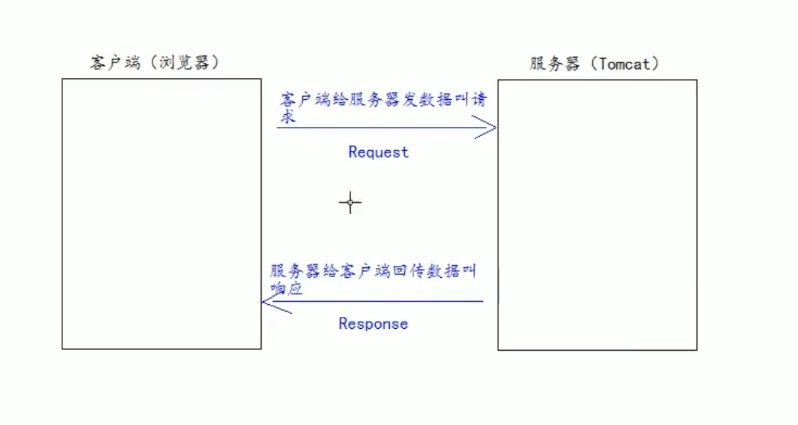

# 一、概念

## Java Web

- Java Web: 通过java编写的可以通过浏览器访问的程序的总称
- Java Web是基于请求和响应来开发的

## 请求

- 请求是指client发送给server数据(request)

## 响应

- server向client回传数据

# 二、Web资源的分类

按照技术和呈现的效果不同，分为静态资源和动态资源

静态:

html/css/js/txt/mp4/jpg...

动态:

jsp/servlet程序

