# 一、概念


## Java Web

- Java Web: 通过java编写的可以通过浏览器访问的程序的总称
- Java Web是基于请求和响应来开发的


## 请求

- 请求是指client发送给server数据(request)


## 响应

- server向client回传数据


<hr>


# 二、Web资源的分类

按照技术和呈现的效果不同，分为静态资源和动态资源


静态:

html/css/js/txt/mp4/jpg...


动态:

jsp/servlet程序

<hr>


# 三、常用的Web服务器

web容器就是web服务器


- Tomcat(最常用): 免费，由Apache提供，一种轻量级的web容器
- Jboss: 纯Java的EJB服务器，开源免费
- GlassFish: 应用很少，由Oracle开发
- Resin: 由CAUCHO开发，收费，由Java开发，对servlet/jsp提供了良好的支持，性能优良
- WebLogic: Oracle的产品，收费web服务器中应用最广泛的，适合大公司

<hr>


# 四、Tomcat和Servlet/jsp的版本对应关系

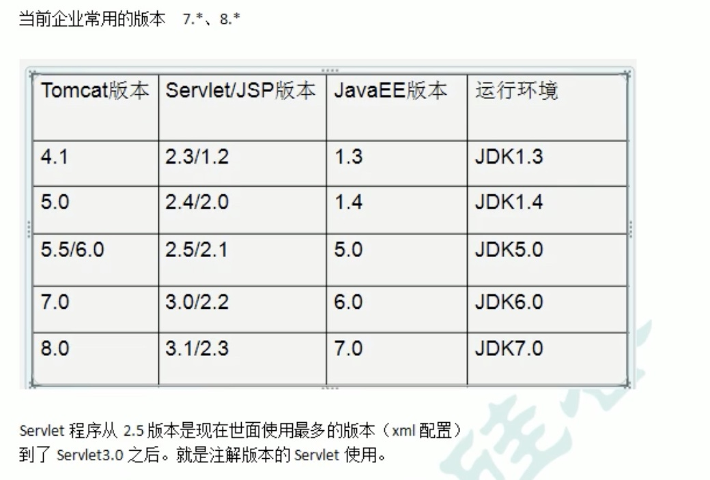

<hr>


# 五、Tomcat使用


## 1. 目录

- bin: 存放可执行程序
- conf: 存放配置文件
- lib: 存放依赖jar包
- logs: 存放运行时输出的日志文件
- temp: 存放运行时产生的临时数据
- webapps: 存放部署的项目/工程
- work: 存放运行时jsp翻译为servlet的源码，和session序列化(钝化)的目录


## 2. 启动Tomcat

- 打开bin目录中的startup.sh(mac)/startup.bat(win)文件即可


测试:

- 

在浏览器地址栏中输入

```
http://localhost:8080
http://127.0.0.1:8080
```


- 使用catalina run命令可以在其中失败时显示错误信息


## 3. 关闭Tomcat

- 运行shutdown.sh即可


## 4. 修改默认端口

- Tomcat默认端口为:8080


可通过conf文件夹中的server.xml文件修改


<hr>


## 5. 部署web工程


### 1) 第一种方式

- 将工程目录复制到Tomcat的webapps目录下

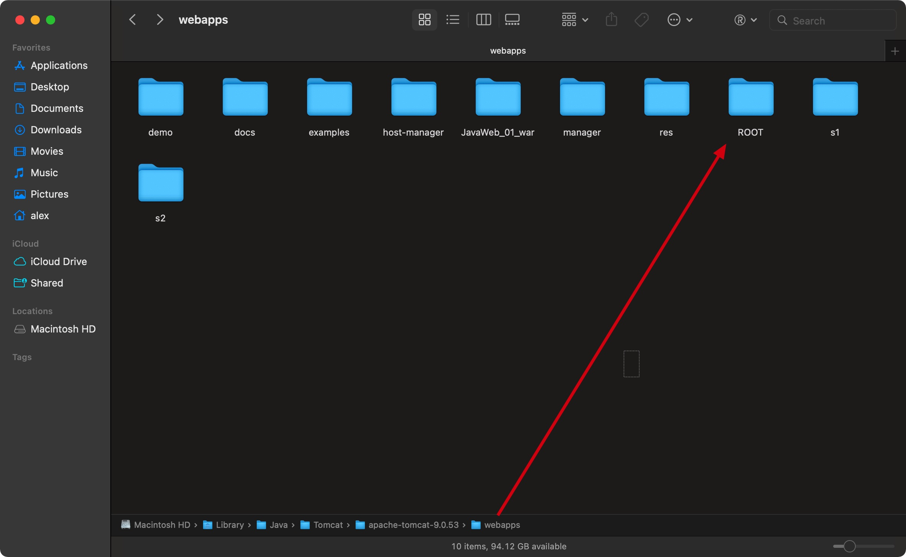

- 输入localhost:8080后默认会进入ROOT目录中

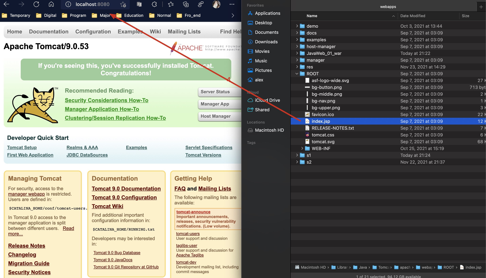


- 想要访问我们自己的项目的话，直接在后面写上文件路径即可

Eg:

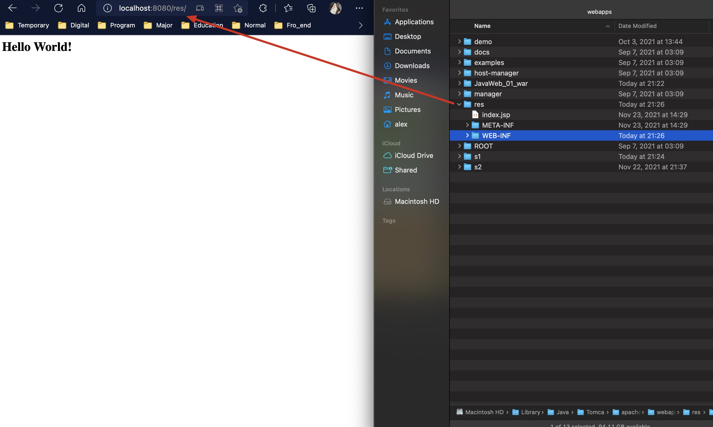


### 2) 第二种方式

- 在Tomcat的conf/Catalina/localhost目录下，创建一个xml文件即可，对应的语法如下

```xml
<Context path="/map_path" docBase="file_path"/>
```


- 其中path属性为浏览器中输入的地址
- docBase为文件的真实地址

Eg:


#### 1) 双击打开和通过Tomcat的不同点

- 直接双击打开时使用的协议为file，会直接读取协议名后面的文件路径，会直接访问磁盘文件，而不会经过网络


- 而通过Tomcat需要浏览器向服务器传递ip/工程路径/文件路径


#### 2) 默认访问

- 如果没有指定工程名，那么默认访问ROOT目录下的index.jsp文件
- 如果指定了工程名，但没有指定文件路径，那么默认访问其下的index.html文件

<hr>


## 6. IDEA中使用Tomcat

- 配置好对应路径即可


### 1. 动态web工程目录介绍


- webapp:

存放web工程的资源文件(html, css, js等等)

- src:

存放源代码

- WEB-INF

是一个受保护的目录，浏览器无法直接访问

- lib

存放第三方jar包(maven项目中没有)

- web.xml

整个web工程的配置文件，可以配置很多组件(Servlet, Filter, Listener, Session等等)


### 2. 在IDEA中修改Tomcat配置

Eg:


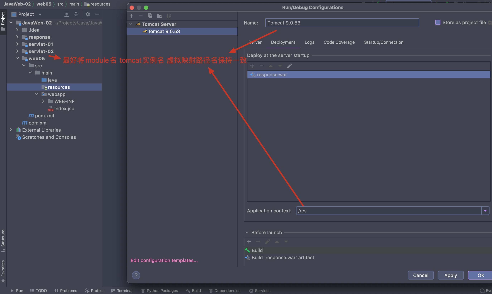

<hr>


# 六、Servlet

- Servlet是Java EE规范之一。规范就是接口
- Servlet是Java Web三大组件之一。三大组件: Servlet程序、Filter过滤器、Listener监听器
- Servlet是运行在服务器上的一个Java程序，它可以接受客户端发送的请求，并响应数据给client


## 6.1 第一个servlet程序

- 首先在Tomcat中给定一个项目的工程路径

Eg:

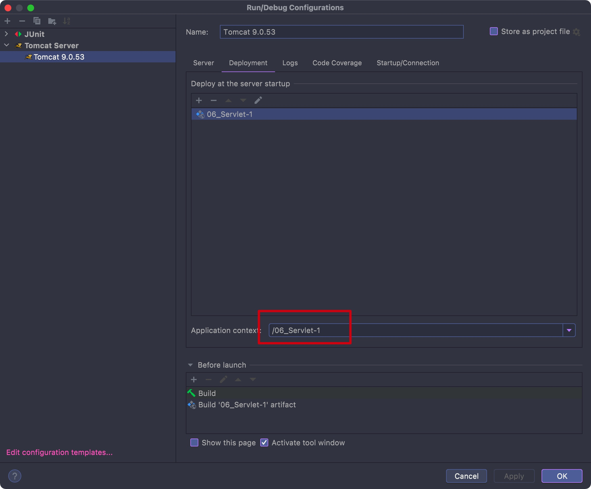


- 创建一个Servlet程序实现Servlet接口
- 实现service方法，处理请求并响应

Eg:

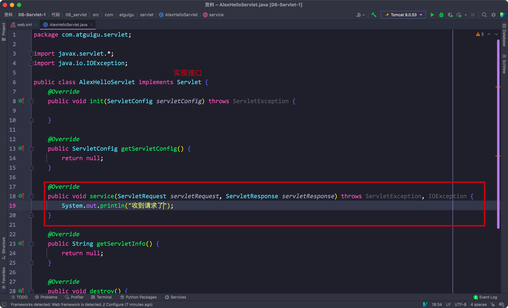


- 在web.xml中配置Servlet程序的访问地址

Eg:

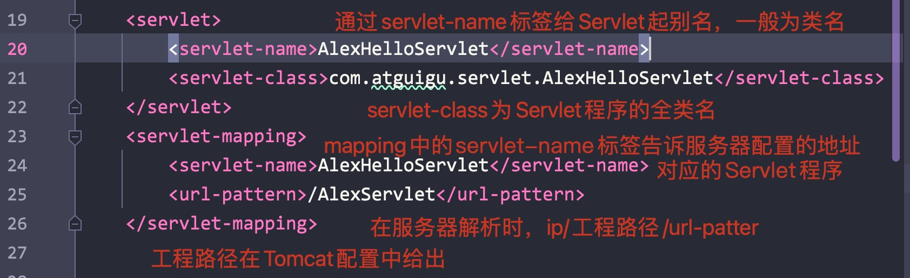


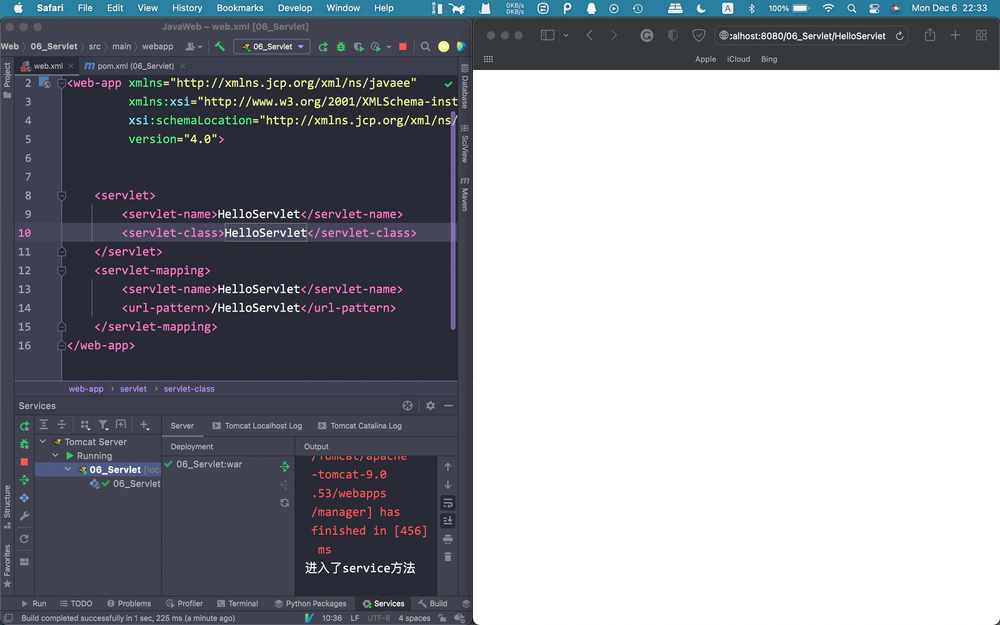


## 6.2 url到Servlet的过程

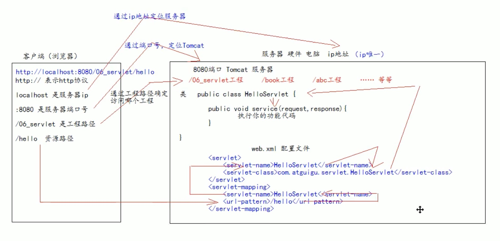


通过ip找到server，通过端口号定位到对应的应用，通过工程路径定位到Tomcat中的工程

通过资源路径在工程对应的web.xml配置文件中找到工程下对应的Servlet程序


## 6.3 Servlet的生命周期

调用方法的顺序:

1. 执行Servlet构造方法
2. 执行init初始化方法

这两步只在第一次访问时，在创建Servlet程序的时候才会使用


3. 执行Service方法

每次访问都会执行

4. 执行destroy方法销毁

只有停止工程时才会执行(关闭Tomcat)

Eg:

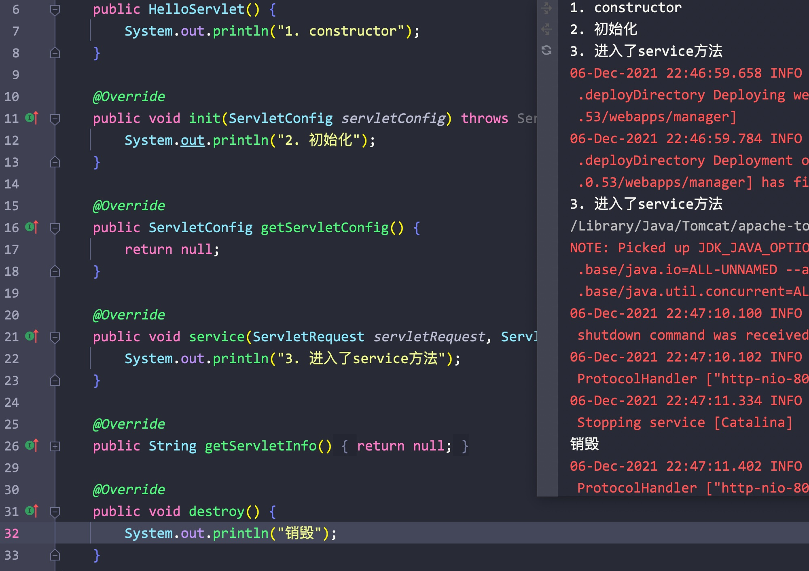


## 6.4 请求分发

- 通过Service方法提供的ServletRequest对象
- 将其转换为HttpServletRequest对象
- 调用getMethod方法获取请求的方法
- 最后根据返回的请求方法进行请求分发处理

Eg:

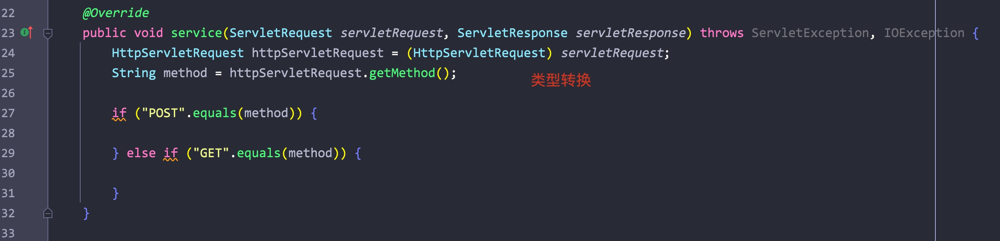


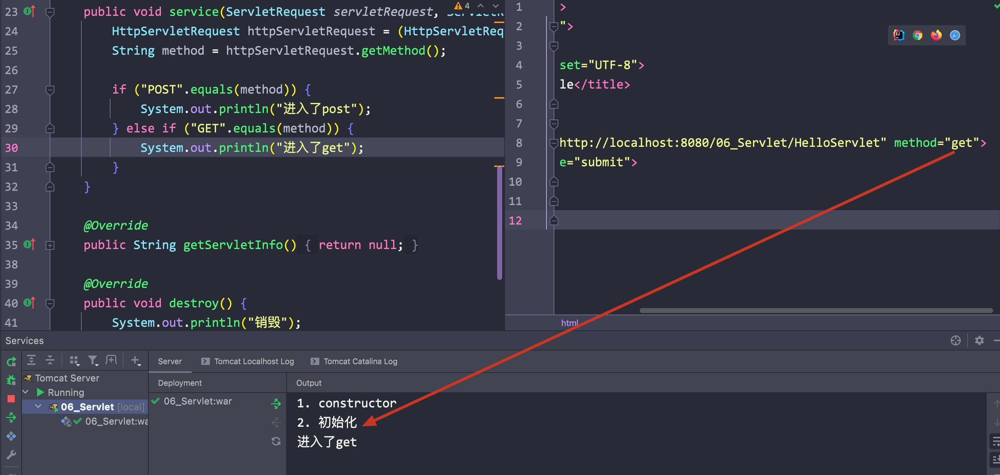

最好将两种请求的处理封装为两个独立的方法


## 6.5 通过继承HttpServlet实现Servlet程序

- 编写一个类继承HttpServlet类
- 根据业务需要重写doGet和doPost方法
- 到web.xml中配置访问地址

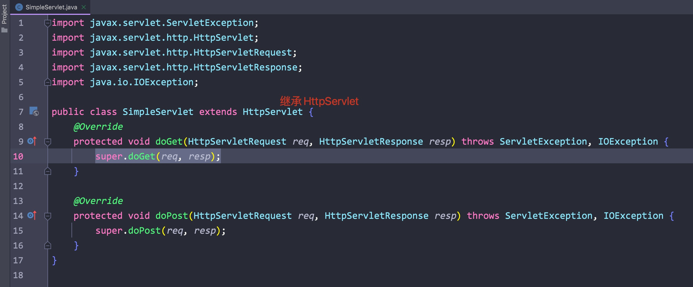


## 6.6 Servlet类的继承体系

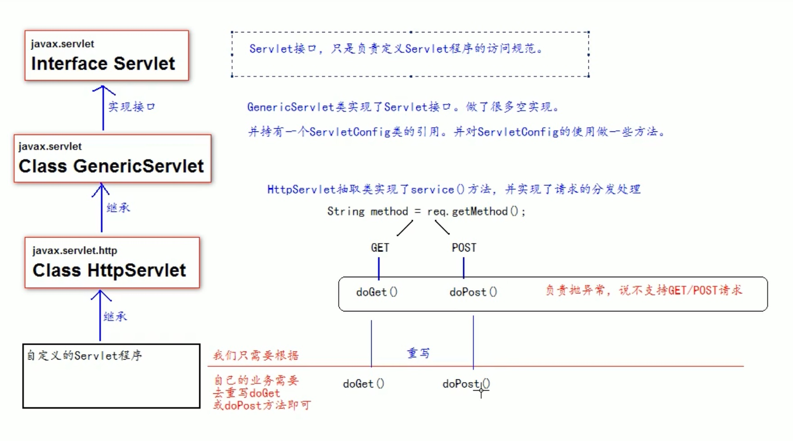


# 七、ServletConfig类

- 可以获取Servlet程序的别名: Servlet-name的值
- 获取初始化参数init-param

- 获取ServletContext对象

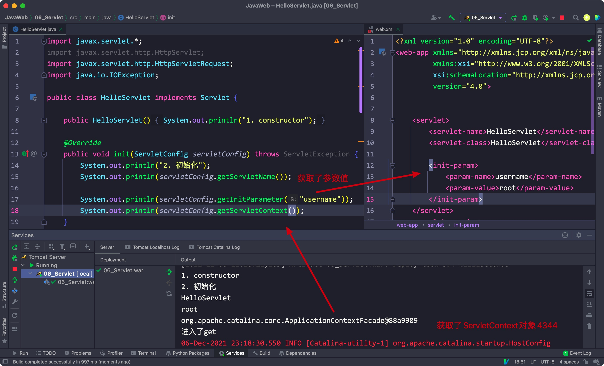


**注意：**init-param标签要写在servlet标签中，通过servletConfig获取到的配置只能是本servlet中的配置(web.xml中同一个servlet标签下的配置)


## 1) 重写init方法注意

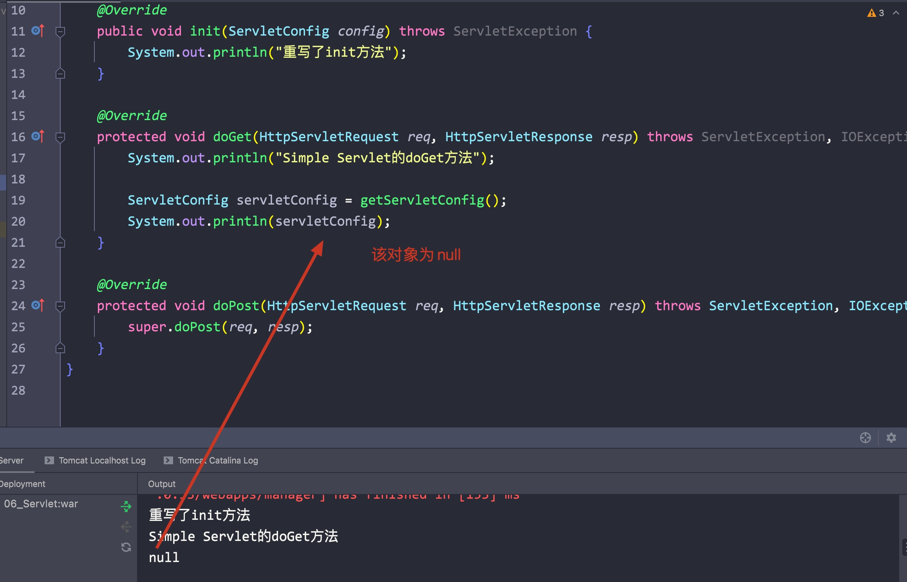


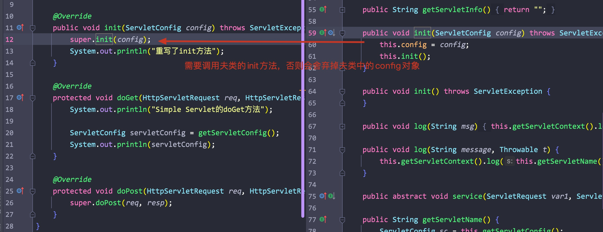


# 八、ServletContext类


## 1) 定义

- 其是一个接口表示Servlet上下文对象
- 一个Web工程中只有一个ServletContext对象(多个Servlet程序共用一个)
- ServletContext是一个域对象，在web工程停止后就销毁了(对应的参数都没了)


域对象:

像Map一样存储数据的对象称为域对象

域指的是存取数据的操作范围


|        |     存数据     | 取数据         | 删除数据          |
| :----: | :------------: | -------------- | ----------------- |
|  Map   |     put()      | get()          | remove()          |
| 域对象 | setAttribute() | getAttribute() | removeAttribute() |


## 2) ServletContext类的四个作用

- 获取web.xml中配置的上下文参数context-param
- 获取当前工程路径，格式: /工程路径
- 获取工程部署后在服务器硬盘上的绝对路径
- 像Map一样存取数据


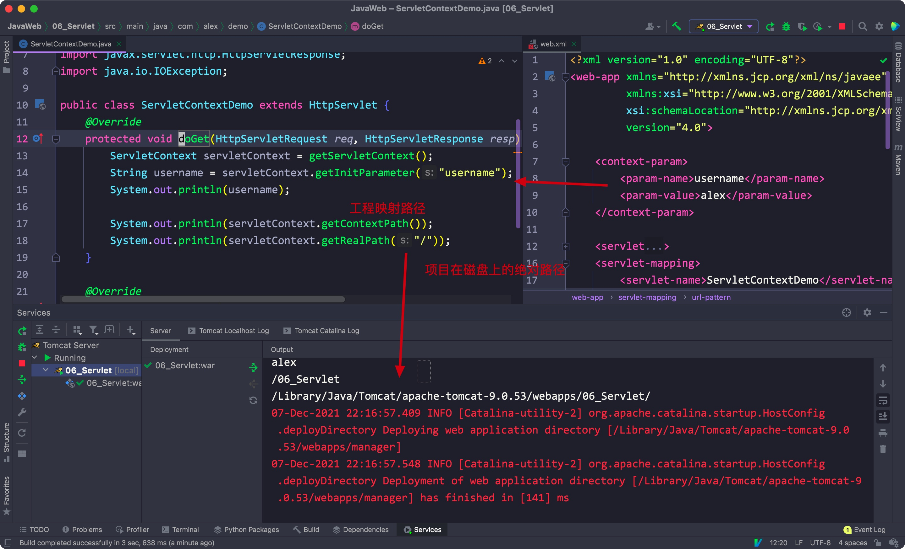

注意这里只能获取context-param标签中的参数，不能获取servlet标签中的init-param参数


通过setAttribute方法添加属性键值对，用getAttribute方法通过对应的键获取值

<hr>


# 九、Http协议

- Http协议中传输的数据叫做报文


## 1) 请求的HTTP协议格式

- 请求分为get/post


### (1) GET请求


结构:

1. 请求行
    1. 请求的方式			GET
    2. 请求的资源路径
    3. 请求协议的版本号      HTTP/1.1
2. 请求头
    1. Key : value


Eg:

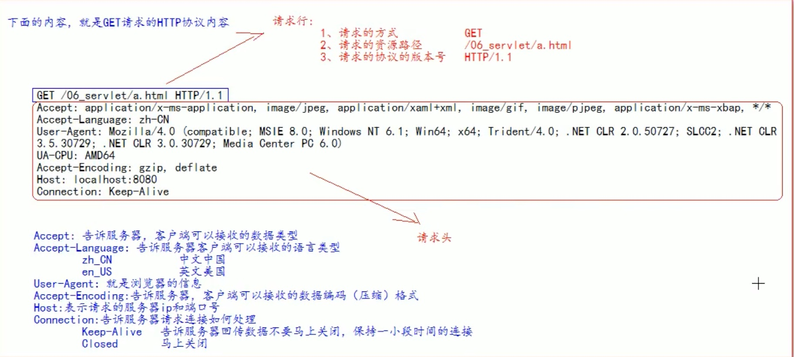


### (2) POST请求


结构:

1. 请求行

    1. 请求的方式			POST
    2. 请求的资源路径
    3. 请求协议的版本号      HTTP/1.1

2. 请求头

    1. Key : value

    空行

3. 请求体(发送给服务器的数据)

Eg:

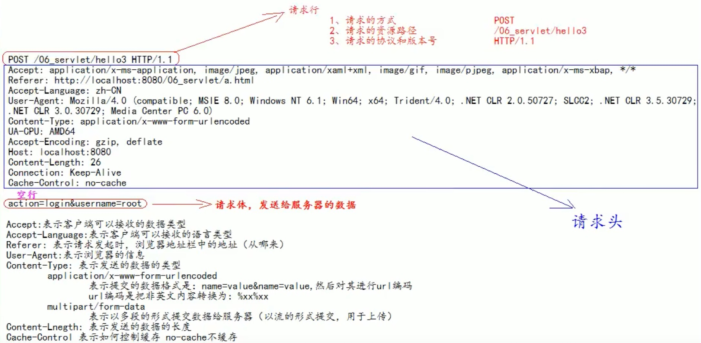


### (3) 常用的请求头

- Accept: 客户端可以接收的数据类型
- Accept-Language: 客户端可以接收的语言类型
- User-Agent: 表示客户端浏览器的信息
- Host: 表示请求时服务器的ip和端口号


### (4) 两种请求两种请求的区别


- Get
    - form标签 method = get
    - a 标签
    - link标签引入css
    - script引入js文件
    - img引入图片
    - iframe引入html页面
    - 浏览器地址栏输入地址后回车
- POST
    - form标签 method = post


## 2) 响应的HTTP协议格式


1. 响应行

    1. 响应的协议和版本号
    2. 响应状态吗
    3. 响应状态描述符

2. 响应头

    1. key : value

    空行

3. 响应体 -> 回传给client的数据

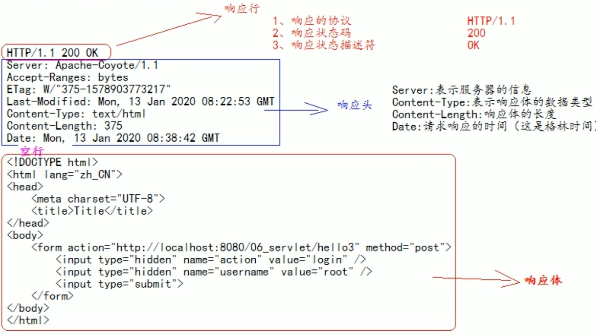


通过Chrome查看:

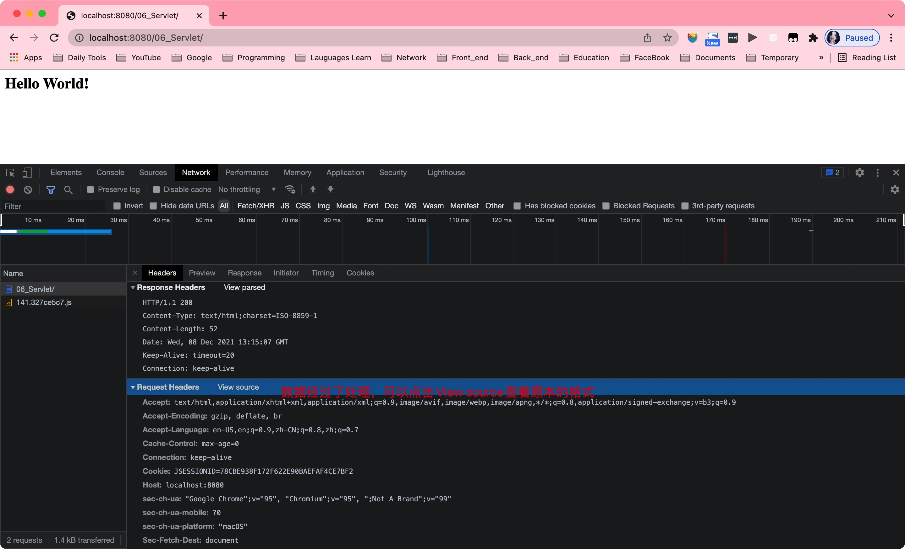


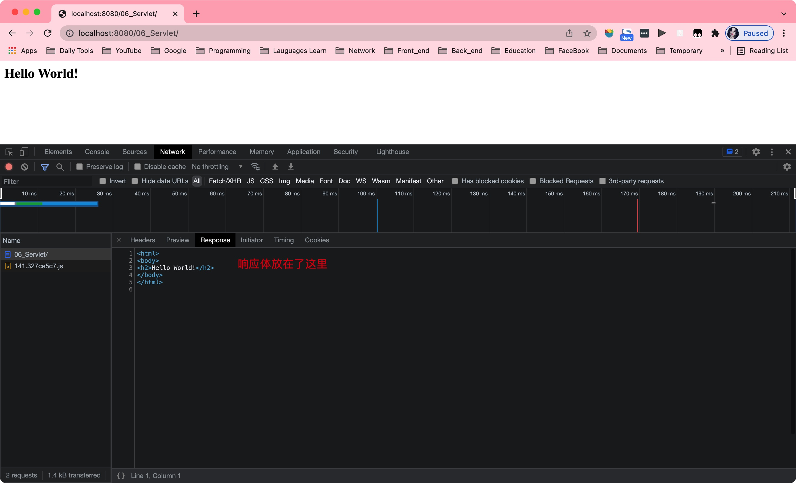


## 3) 常见的状态码

- 200: 请求成功
- 302: 请求重定向
- 404: 表示服务器收到了请求，但你要的数据不存在(地址错误或者DNS污染/GFW)
- 500: 表示服务器已经收到了请求，但服务器内部错误(代码错误)


## 4) MIME类型说明

MIME是在HTTP协议中指定数据类型的

MIME: Multipurpose Internet Mail Extensions，即多功能internet邮件扩展服务

格式: 大类型/小类型。格式与一种文件的后缀名对应


常见的MIME类型:

|       文件        |                 MIEME类型                  |
| :---------------: | :----------------------------------------: |
|     html文件      |        .html .htm         text/html        |
|   普通文本文件    |       .txt                text.plain       |
|  RTF文本(类Unix)  |      .rtf            application/rtf       |
|       GIF图       |      .gif                  image/gif       |
|      JPEG图       |      .jpeg jpg            image/jpeg       |
|    au声音文件     |      .au                 audio/basic       |
|   MIDI音乐文件    | .mid .midi          audio/mid audio/x-mail |
| RealAudio音乐文件 | .ra      .ram        audio/x-pen-realaudio |
|     MPEG文件      | .mpg       .mpeg                video/mpeg |
|      AVI文件      |       .avi           video/x-msvideo       |
|   GZIP压缩文件    |     .gz            application/x-gzip      |
|      TAR文件      |     .tar            application/x-tar      |

<hr>


# 十、HttpServletRequest类


## 1) 作用

- 请求进入Tomcat后，Tomcat会将请求发送过来的Http协议信息解析后封装好，写入到一个Request对象中
- 然后将该对象传递给service方法(doGet, doPost)
- 我们可以通过HttpServletRequest对象获取到所有的请求信息


## 2) 常用方法

- getRequestURI(): 获取请求的资源路径
- getRequestURL(): 获取请求的统一资源定位符(文件在服务器上的绝对路径)
- getRemoteHost(): 获取client的ip地址(请求的发送者)
- getHeader(): 获取请求头信息
- getParameter(): 获取请求的参数
- getParameterValues(): 获取多个请求的参数
- getMethod(): 获取请求的方式GET/POST
- setAttribute(key, value): 设置域数据
- getAttribute(key): 获取域数据
- getRequestDispatcher(): 获取请求转发对象

Eg:

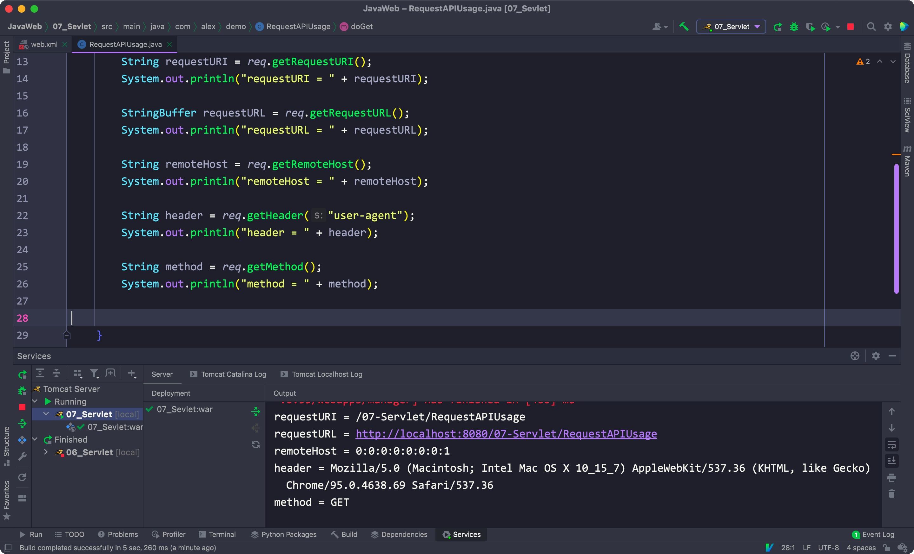


## 3) 获取client发送的参数

- getParameter(): 获取单个参数
- getParamterValues(): 获取多个参数


Eg:

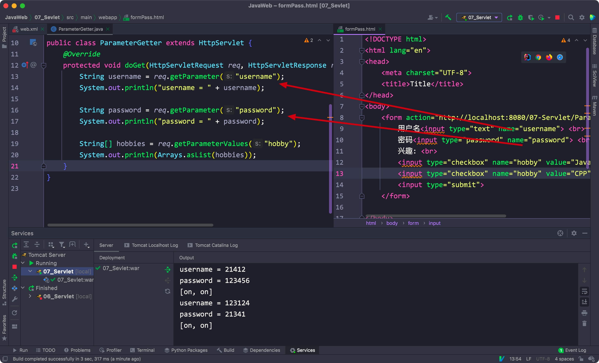

通过input标签中的name属性值获取即可


## 4) post方法乱码

- 解决方法需要用req对象调用setCharacterEncoding()方法设置字符编码

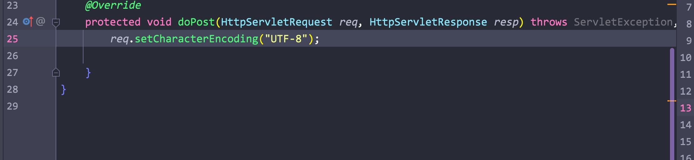

- 一定要在获取对应参数之前设置，否则无效


## 5) 请求转发


特点:

- 浏览器地址不变
- 只有一次请求
- 可以共享Request域中的数据
- 可以转发到WEB-INF目录中(无法通过URL直接访问)
- 不能访问当前工程以外的资源(无法出站)

Eg:


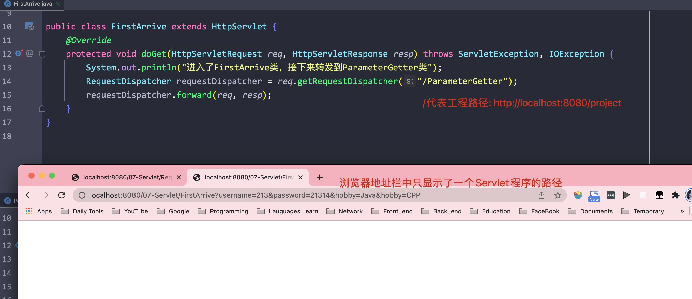


相关方法:

- getRequestDispatcher(String str): 获取对应转发Servlet程序的一个转发类对象
- forward(request, response): 将当前程序的请求和响应对象转发为之前指定的目录程序

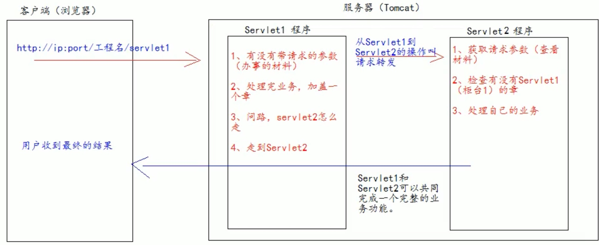


## 6) base标签的作用

使用html的a标签:

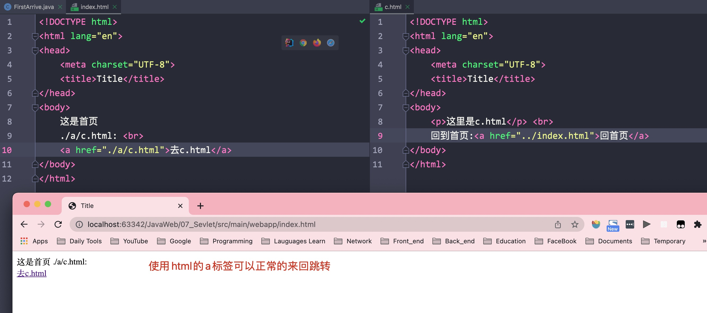


使用servlet请求转发:

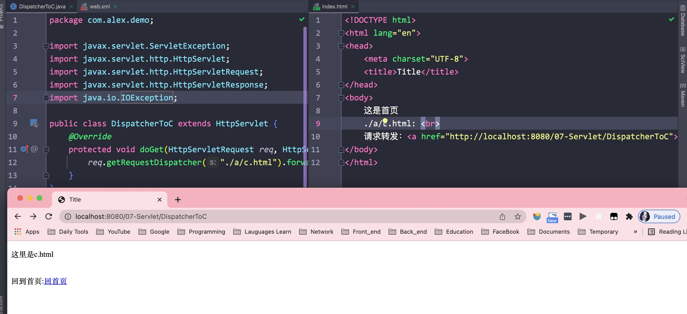


此时无法跳转回来:

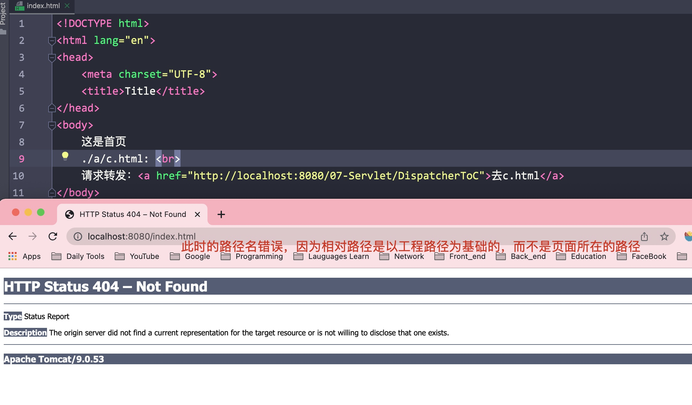


为了解决这个问题，需要使用base标签指定url

Eg:

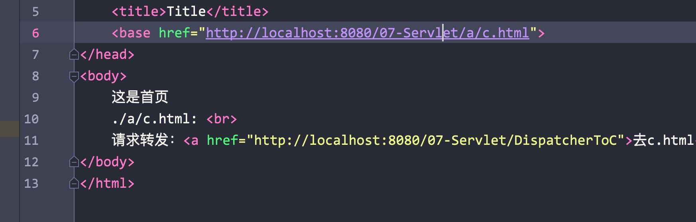


## 7) web中"/"的作用

- 在web中，**"/"是一种绝对路径**


- 如果"/"被浏览器解析，得到的地址为: http://ip:port

Eg:

```html
<a href="/">text</a>
```


- 如果"/"被服务器解析，获取的地址为: http://ip:port/工程路径


Eg:

```
web.xml中的配置:
<url-pattern>/servlet<url-pattern>

Java Code:

servletContext.getRealPath("/")
request.getRequestDispatcher("/")
```


特殊情况:

```
response.sendRediect("/");
将斜杠发送给浏览器解析，获得http://ip:port			(重定向)
```

<hr>


# 十一、HttpServletResponse类


## 1) 作用

和HttpServletRequest类一样，每次有请求进来后，Tomcat服务器都会创建一个Response对象传递给Servlet程序使用

HttpServletResponse表示所有响应的信息

如果我们需要设置返回给客户端的信息，都可以通过HttpServletResponse对象来设置


## 2) 两个输出流

- getOutputStream(): 获取字节流，常用为用户提供下载服务(传递二进制数据)
- getWriter(): 获取字符流，常用于回传字符串(常用)


Eg:

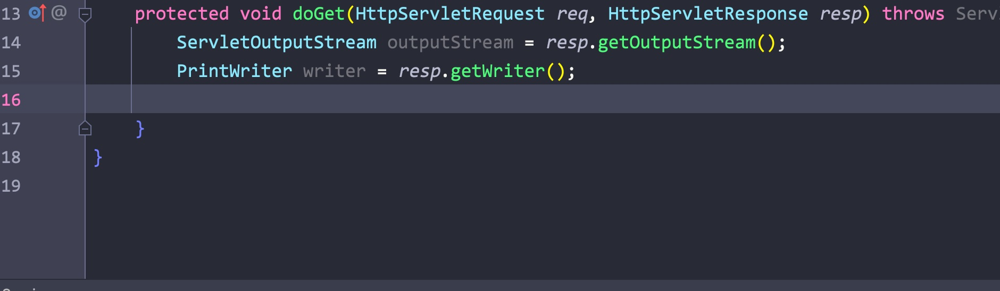

- 两个流只能同时获取一个，否则会报错


## 3) 返回字符串给Client

- 通过HttpServletResponse对象调用getWriter方法，获取一个PrintWriter对象
- 通过该PrintWriter对象输出字符串


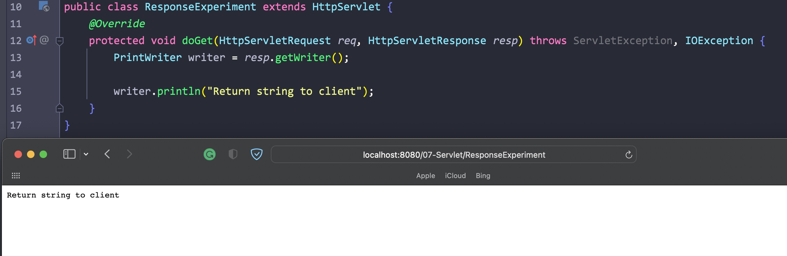


## 4) 中文显示错误

当我们返回的字符串为中文时，浏览器显示不正常:

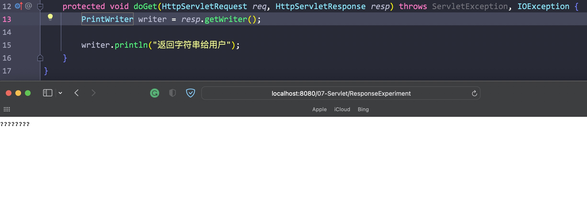


通过setCharacterEncoding()方法设置字符编码即可:

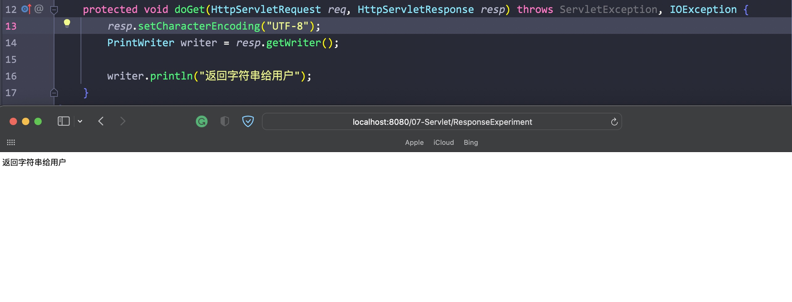


- 还可以通过setContentType()方法设置client和server的字符编码


Syntax:

```java
responseObject.setContentType("text/html; charset=UTF-8");
```


Eg:

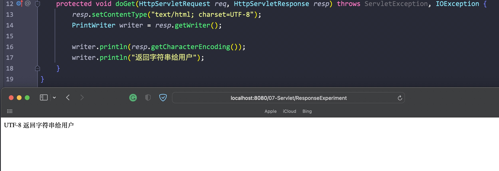


## 5) 请求重定向


特点(和请求转发刚好相反！):

- 浏览器地址会发生变化
- 会有两次请求(所以Tomcat会将两次请求封装为两对不同的请求和响应对象)
- 不能共享Response域中的数据(因为两次请求，对象不同)
- 不能访问WEB-INF中的数据
- 可以访问工程目录外的资源


Eg:

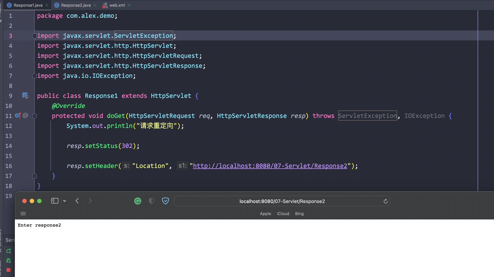


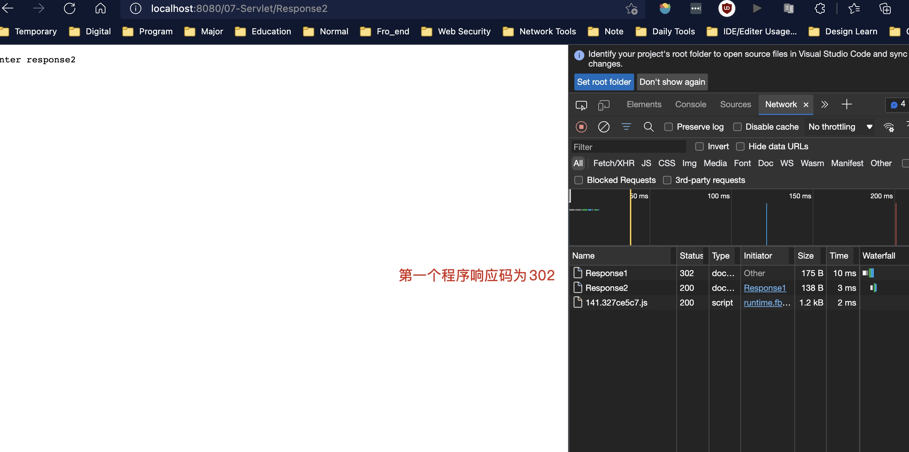


使用setStatus()方法设置相应码

使用setHeader()方法设置响应头信息


**常用的方法:**

- sendRedirect()

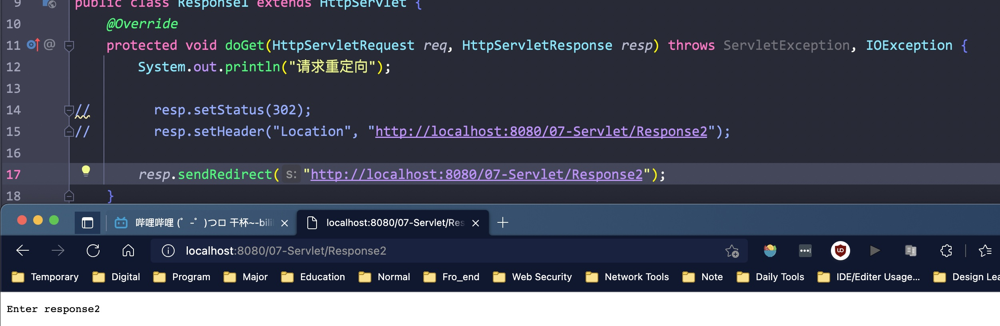

<hr>


# 十二、JavaEE三层架构


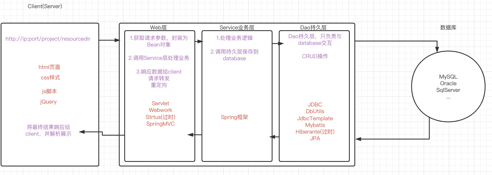


## 1. 书城项目结构

- web层				   com.alex.web/servlet/controller
- service层           com.alex.service                                  Service接口包
- ​                           com.alex.service.impl                         Service接口实现类
- dao持久层        com.alex.dao                                       Dao接口包
- ​                           com.alex.dao.impl                              Dao接口实现类
- 实体bean对象  com.alex.pojo/entity/bean/domain   JavaBean类
- 测试包               com.alex.test/junit
- 工具类               com.alex.utils

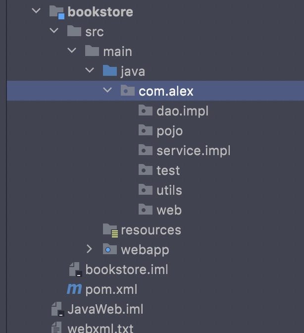


## 2. 创建用户数据库

Eg:

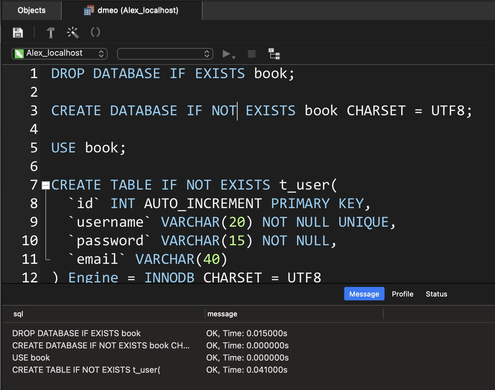


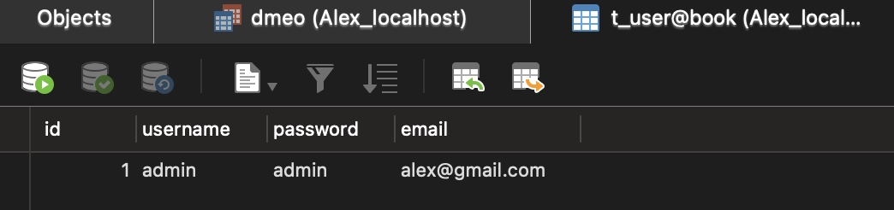


## 3.创建数据库表对应的User类

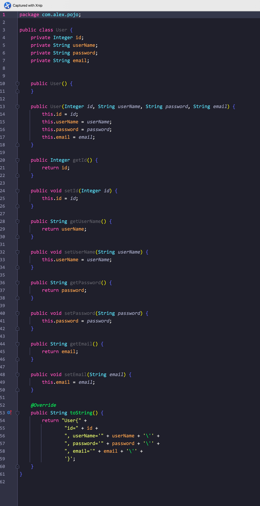


## 4. 


