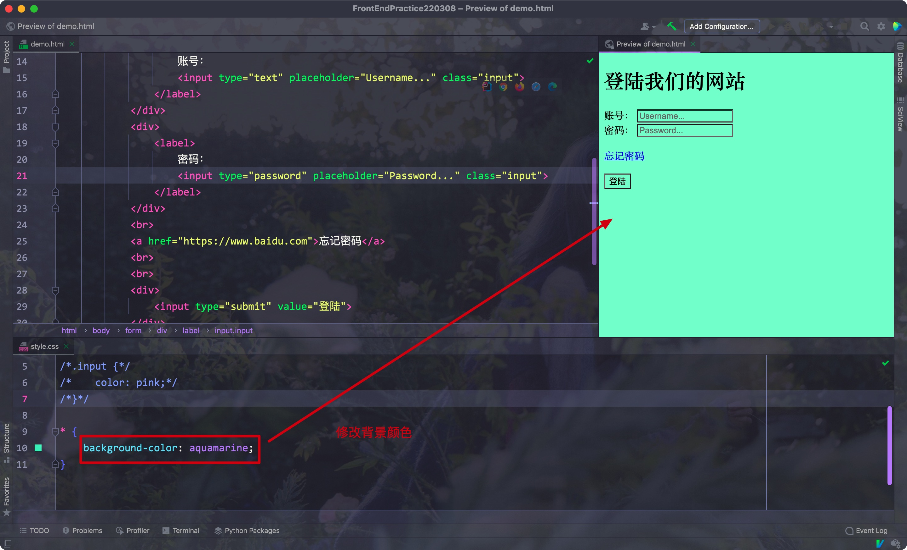

# 一、选择器

- 在html的head标签内，添加一个link标签即可

Eg:


## 1. 标签选择器

syntax:

```css
table_name {
  attrbution_name: value;
  attr2: value2;
  ...
}
```

<hr>


## 2. ID选择器

- 注意: 每个标签的id必须是唯一的


syntax:

```css
#id {
  attribution: value;
}
```


Eg:


<hr>


## 3. 类选择器

- class属性和id差不多，但它可以重复

syntax:

```css
.className {
  attribution: value;
}
```


Eg:


<hr>


## 4. 通配符选择器

- 设置所有元素的属性值


syntax:

```css
* {
  attribution: value;
  ....
}
```

Eg:



<hr>


## 5. 元素内的标签

syntax:

```css
div input {
  attribution: value;
  ...
}
```

可以批量设置div下的所有input标签


Eg:


<hr>


## 6. 组合选择器

- 不同的选择器之间用逗号隔开

syntax:

```css
#idSelector, .classSelector {
  attribution: value;
}
```


Eg:


<hr>


## 7. 选择器的优先级


- 内联选择器的优先级最高

Eg:


- 想要优先级底的实现作用的话，需要添加!important标记

Eg:


<hr>


# 二、边距

## 1. 外边距

Sample:


- 浏览器中默认设置了一个外边距，对应的属性为margin

Eg:


- 浏览器的优先级很低，所以可以被我们自己的样式文件覆盖掉

Eg:


其余属性:

- margin-bottom: 底部外边距
- margin-left: 左侧外边距
- margin-right: 右侧外边距
- margin-top: 顶部外边距

直接写四个数字可以分别代替上、右、下、左四个方位

Eg:


<hr>


## 2. 内边距

- 对应的属性名为padding

Eg:


