# 一、图片和视频内嵌


用IDEA创建一个web项目

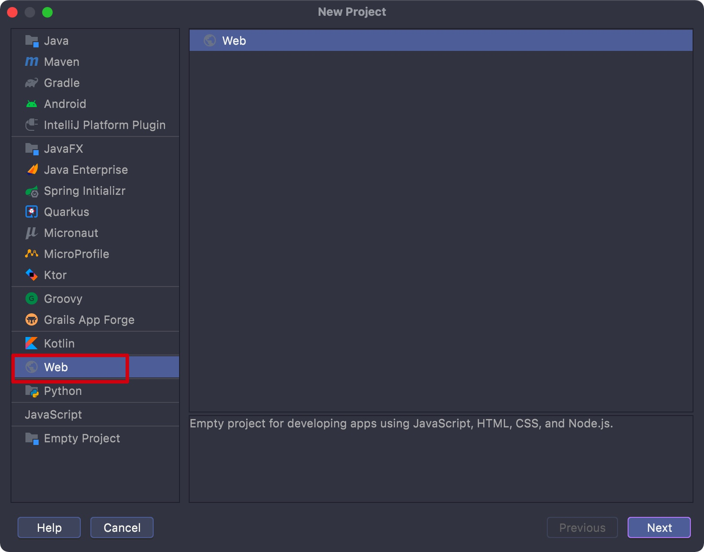


- 修改预览选项，使得修改可以实时体现:

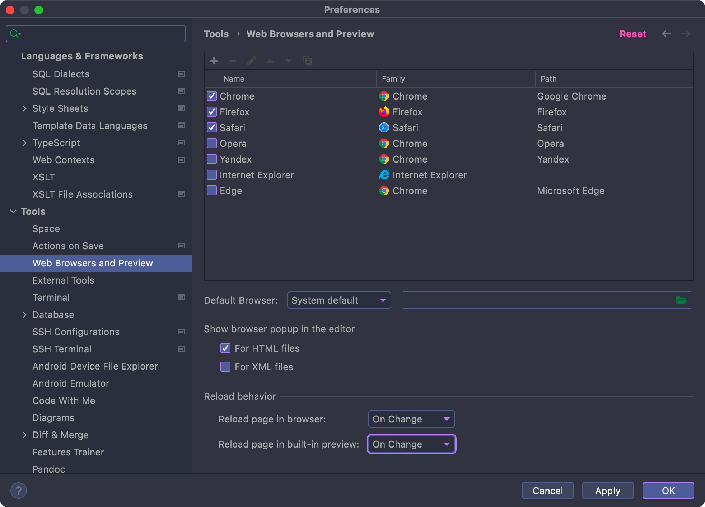


- img: 图片标签

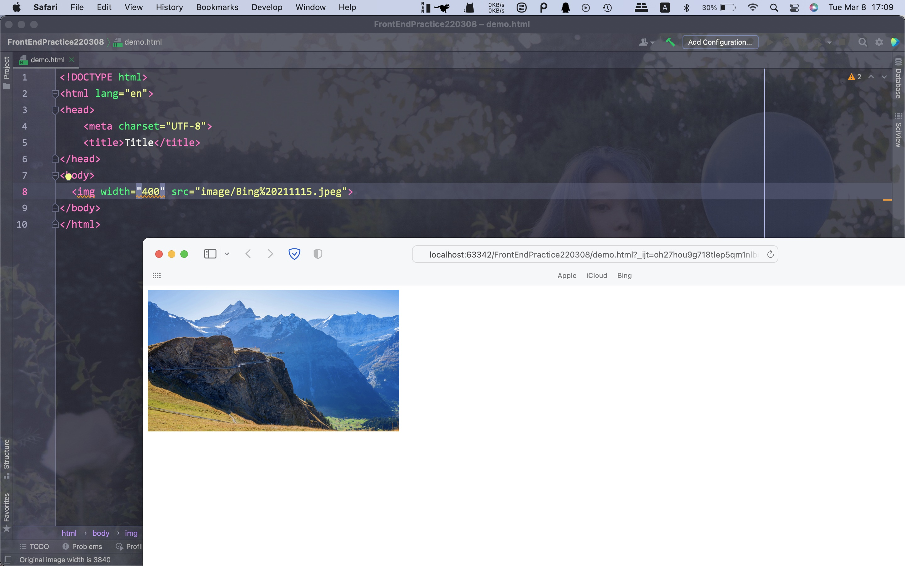


- iframe: 创建一个内嵌的网页内容

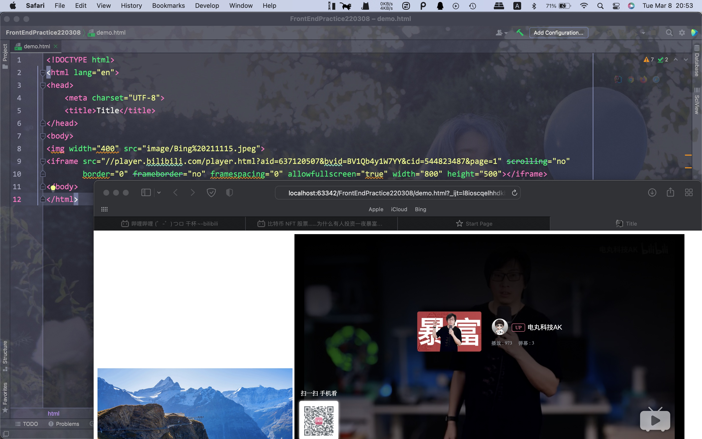

<hr>


# 二、语法和常用标签


## 1. 转义字符

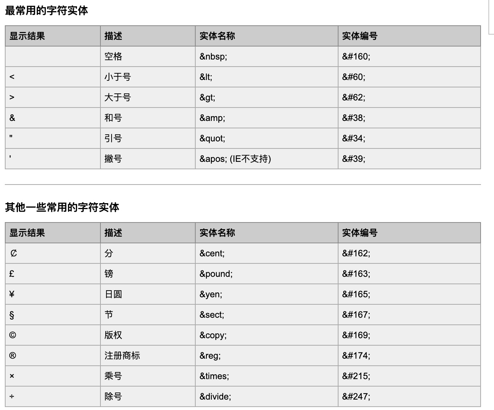

<hr>


## 2. div和span

- div: 默认占一整行

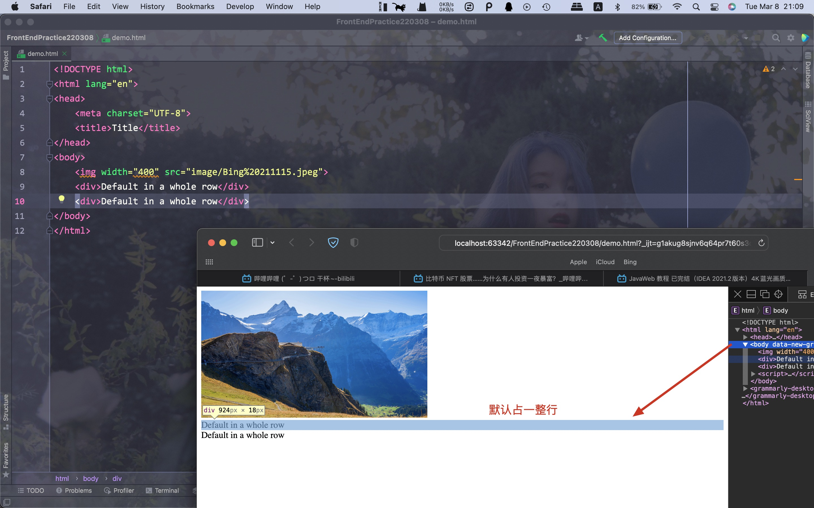


- span: 将元素限制在其所具有的范围内

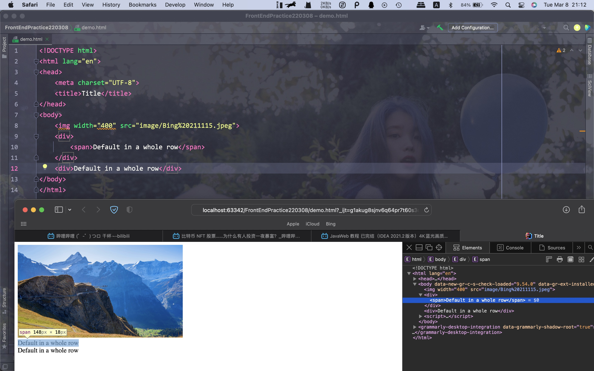


- br: (break)换行

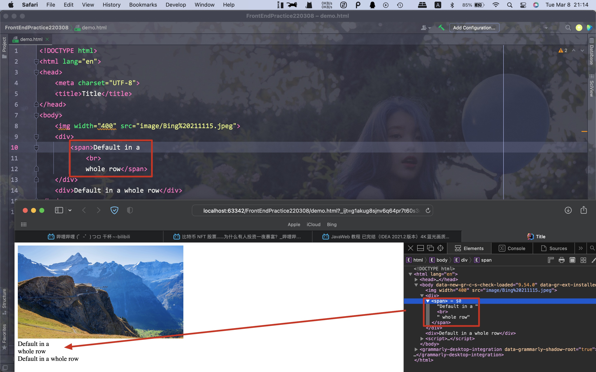


- hr: Horizontal Rule，水平线
- p: Paragraph，段落


字节跳动提供的icons库:

https://iconpark.oceanengine.com/home


将图标放入项目目录中后，在HTML头部中添加link标签即可

```html
<link rel="icon" href="image_path" type="image/x-icon" />
```


Eg:

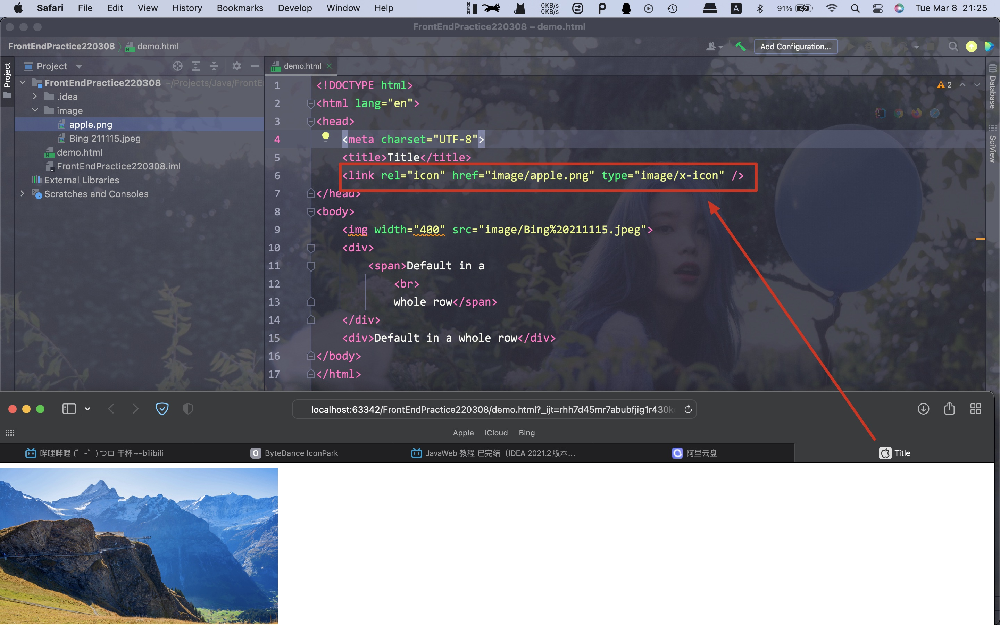


- h1～h6: 标题标签

- a:

    - 可以用来指向一个链接
    - 可以用来指定页面上的锚点(可以跳转到指定id的元素位置)

    ```html
    <a href="url">content</a>
    
    <a href="#href_name">跳转</a>
    
    <div id="href_name">
      
    </div>
    ```

Eg:

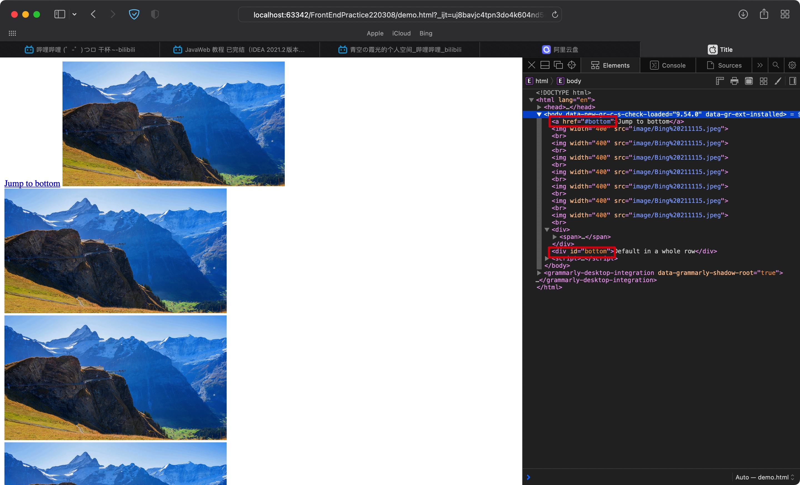


- ul: unorder list，无序列表
- ol: order list，有序列表
- li: list item，放在ul或者ol标签内，表示标签内的元素项


- 表格:

```html
<table>
  <thead>
    <tr>
      <th>表头</th>
    </tr>
  </thead>
  
  <tbody>
    <tr>
      <td>表元素</td>
    </tr>
  </tbody>
</table>
```

tr: table row

th: table head

td: table data


Eg:

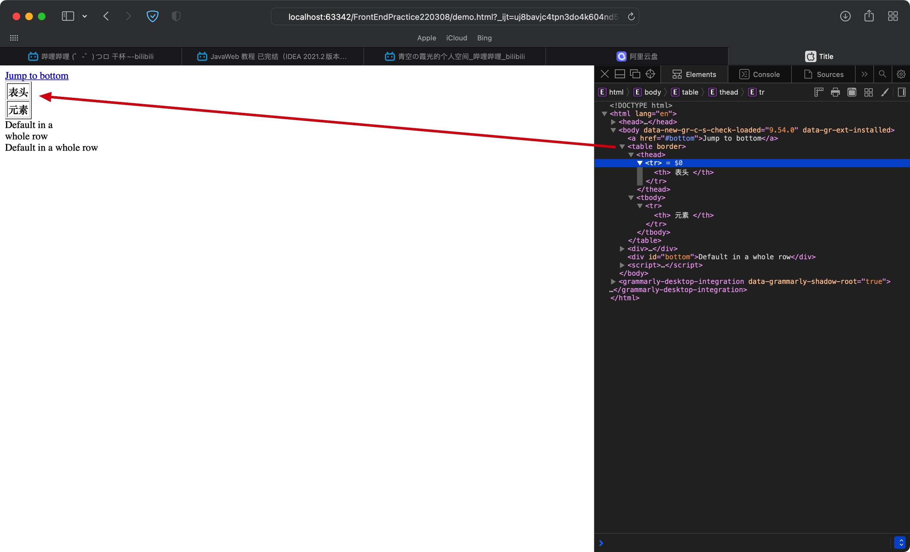

- border: 表示边框，在HTML5已经弃用了，现在使用CSS来指定

<hr>


# 三、表单

一般会将输入框放在label标签下，其效果同span，但与span不同的是，我们点击前面的文字也能聚焦到输入框内(文字需也在label标签内)


```html
<lable>
  输入框
  <input type="text">
</lable>
```


Eg:

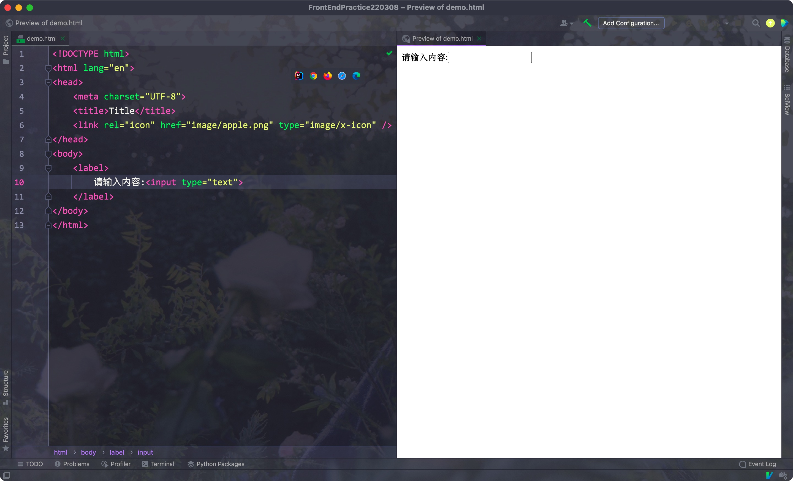


## 1. input标签

input标签有多个类型:

- text: 文本
- password: 密码
- button: 按钮
- submit: 发送表单(需要放在同一个lable下)
- checkbox: 复选框
- radio: 单选框(需要将多个单选框的name属性设置为同一个)
- file: 文件
- color: 选择颜色


Eg:

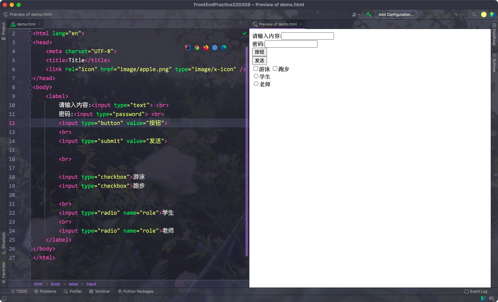


属性:

- placeholder: 设置文本框内的默认文字
- value: 设置文本框内的默认文本

<hr>


## 2. form

表单一般使用form标签囊括起来

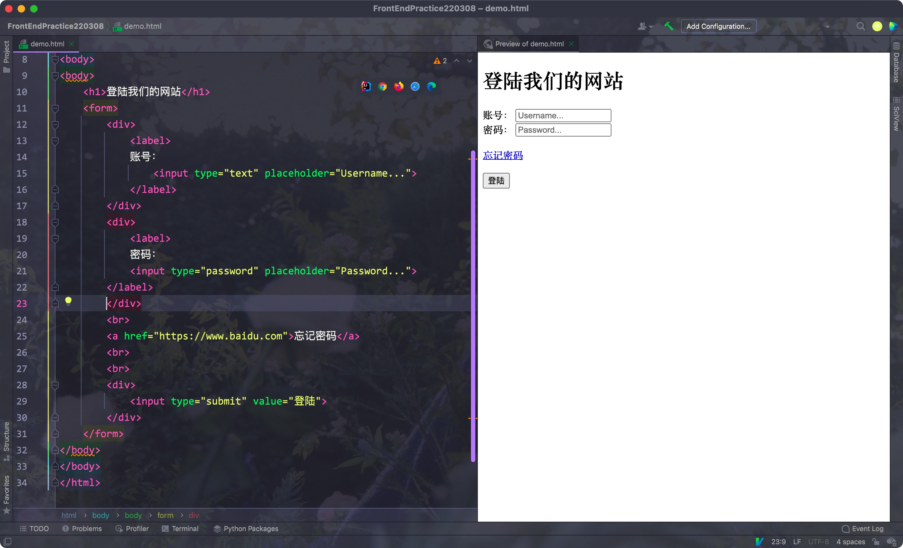

<hr>


## 3. 多行文本框

使用textarea标签可以创建一个多行文本框:

```html
<label>
  <textarea placeholder="content">
</label>
```

<hr>


## 4. 下拉列表

```html
<label>
  <select>
    <option></option>
    <option></option>
  </select>
</label>
```


Eg:

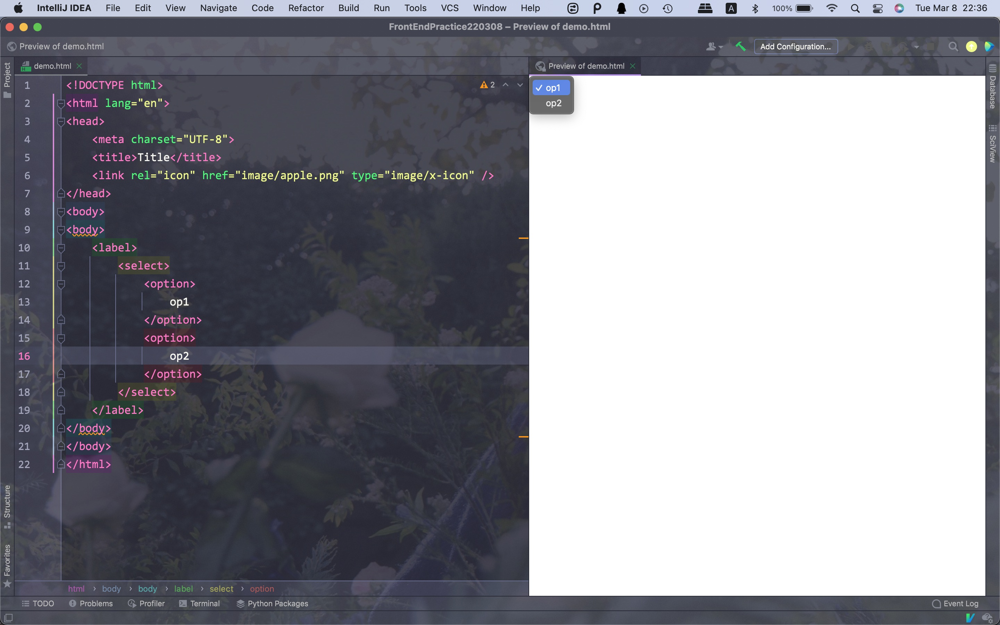

<hr>


