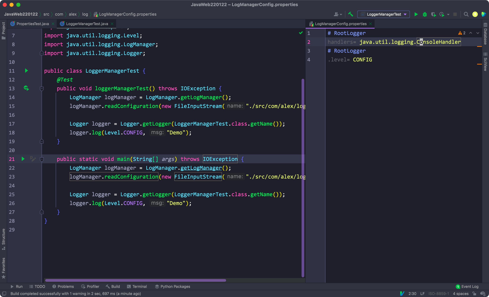

# 一、jdk自带的Log

- 通过Log，我们可以控制程序在不同环境下的输出信息
- 可以输出到控制台，也能输出到文件中


日志输出:


- 这里使用了默认等级INFO


## 1) 日志等级

在Level类中，显示了7个日志等级:

- SEVERE: 最高级
- WARNING
- INFO: 默认的日志等级
- CONFIG
- FINE
- FINER
- FINEST


由上到下严重程度依次下降


- 如果不做任何设置的话，我们创建的Logger对象默认会使用一个ConsoleLogger对象作为父日志处理器
- 低于默认日志等级的日志信息不会被打印出来

Eg:


- 想要重新设置日志等级以打印其他等级的日志，首先需要禁用默认的父日志处理器
- 再设置父日志处理器和当前Logger的日志等级(日志在打印时，会判断其是否低于日志处理器和其父处理器的日志等级)

Eg:


<hr>


## 2) 输出到文件

- 创建一个FileHandler，在创建对象时即可设置日志的路径
- 设置其日志等级后添加进Logger对象即可
- 其默认格式为XML，且默认会覆盖掉日志文件

Eg:


- 在创建FileHandler的时候可以手动设置为追加，并将格式设置为和ConsoleHandler一样的简单格式

Eg:


<hr>


## 3) 日志过滤器

- 通过Logger对象调用setFilter即可设置过滤器(lambda)

Eg:


这里我们过滤掉了输出不为Worst的日志

<hr>


# 二、Propertiest

- 我们可以将信息作为键值对的形式进行存储和获取，但需要将信息存储在一个.properties文件下
- 使用一个Properties对象，调用load方法即可加载该文件

Eg:


- 其本质上是Map的实现类，其直接继承了Hashtable类，所以本质上就是一个Hash表
- Hashtable里面的方法都由synchronized关键字修饰，所以是线程安全的

Eg:


- 所以我们可以将其作为hash表来使用


- 通过store方法，可以将其输出到任意位置，第二个参数为注释


- 在System类中也能使用getProperties方法，从而获取系统信息:


<hr>


# 三、日志配置文件

- 之前为了重新设置日志默认等级，我们需要调用setUseParentHandlers方法禁用父类日志处理器
- 再自行创建一个新的日志处理器，并设置两个日志处理器的默认等级


- 我们可以直接将对应的父类处理器日志等级，编码，格式写在一个properties文件中
- 再使用LogManager对象读取即可


- 调用LogManager类的getLogManager方法获取一个LogManager对象
- 通过该对象调用readConfiguration方法，传入一个properties文件流

Eg:




- 设置其他参数:

```properties
# 指定默认日志级别
java.util.logging.ConsoleHandler.level = ALL
# 指定默认日志消息格式
java.util.logging.ConsoleHandler.formatter = java.util.logging.SimpleFormatter
# 指定默认的字符集
java.util.logging.ConsoleHandler.encoding = UTF-8

# 设置日志的路径
java.util.logging.FileHandler.pattern=system.log

# 设置日志为追加
java.util.logging.FileHandler.append=true
```

<hr>


# 四、使用Lombok快速开启日志

- 使用Lombok中的@Log注解就能直接获取一个log对象
- 将其作为正常的Logger对象调用即可
- 其中topic字段为该log的名称

Eg:


<hr>
