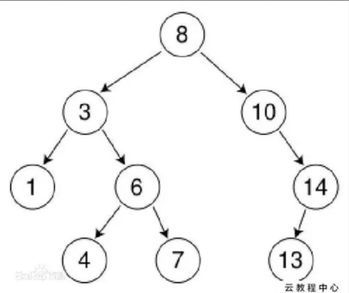

# 一、二进制表示法


## 1) 原码

- 最高位为符号位，最高位为0表示正数，为1表示负数


- -1用原码表示: 1001
- 1用原码表示: 0001


- 原码表示虽然简单，但在计算的时候会出现问题:

1 + (-1) = 0001 + 1001 = 1010 ≠ 0

<hr>


## 2) 反码

- 为了解决原码出现的问题，出现了反码:
    - 正数不变
    - 负数除了符号位，其余位取反表示


使用反码后计算1 + (-1 ):

1 + (-1) = 0001 + 1110 = 1111

再对结果取反: 1000 = -0


- 但问题是，如果1000 = -0，那么0000 = +0
- 在现实中，0应该没有符号才对，所以反码也不行

<hr>


​	


## 3) 补码

- 为了解决补码出现的问题，这里引入了补码:
    - 正数同样保持原码不变
    - 负数则先去反码，在反码的基础上 + 1后即可得到补码


使用补码计算1 + (-1):

- 1 + (-1) - > 0001 + 1110(反码) -> 0001 + 1111(补码) -> (1)0000(溢出位舍弃) = 0


因此，在Java中，负数都用补码来表示

<hr>


# 二、数据类型


## 1) 整数/字符/字符串

- byte: -128 ~ 127(1byte)
- short: -256 ~ 255(2byte)
- int: -2^31 ~ 2^31 - 1(4byte)，数字默认为int类型
- long: -2 ^ 31 ~ 2 ^ 31 - 1(8byte)，注意long类型数字末尾需加上"L"
- char: char(2yte)无符号，且对应的是Unicode编码表，这也是Java能使用中文作为变量名的原因，0 ~ 65535
    - char类型也可以使用'\uxxx'的形式来表示，最大为: \uFFFF

Eg:


- 如果数字大到long也放不下的话，可以使用BigInteger类:


<hr>


## 2) 小数/浮点数

- float(4byte)
- double(8byte): 默认的小数类型

浮点数的存放:

float:(共31位)

| S(从右往左第31位，最左边1位) | E(之后8位) | M(最后23位) |
| :--------------------------: | :--------: | :---------: |

| S(最左边1位) | E(之后11位) | M(最后52位) |
| :----------: | :---------: | :---------: |


- S: sign bit，表示符号。1为负，0为正
- E: exponent，表示指数(2的多少次方)\
- M: 尾数，表示有效的数字

每个浮点数 = (-1) ^s^ * 2^E^ * M


例子:


- 首位为0，这里舍去了
- E为: 10000010 = 2
- M为: 101...


这里M位之前默认省略了一个1，本来该是1.0101

省略第一个1，只保留了剩下的101

所以最后二进制表示为：(-1)^0^ * 2^2^ * 1.0101 = 101.01

<hr>


# 三、String/StringBuilder

- 如果赋值为静态的字符串，则会放进字符串常量池中，如果使用new的方式则不会放进字符串常量池内，两者在内存中不在同一个位置


- 使用+，+=运算符可以拼接字符串，但JVM会优化为StringBuilder
- 因为String在Java中是final char[]，所以每次修改String都会创建一个新的对象
- 为了防止重复创建对象，最好使用StringBuilder对象


- String intern: 返回字符串的规范化表示形式
    - 底层：查看字符串常量池中是否有该字符串，有则返回其引用(new String的不算)，没有则添加进去，再返回其引用

Eg:


- 第一条比较时，abc因为str2已经被放在常量池中了，所以会返回常量池中的引用，但str1不在常量池中
- 第二条: str1对应的字符串存在于常量池中，而str2也在常量池中，所以指向的是同一个地址

<hr>


# 四、可变参数

- Java5中引入，允许在调用方法的时候传入不定长度的同种类型的参数(Java语法糖)，会将多个参数包装为一个数组


- 传入的参数个数可以不确定，该可变参数必须放在方法列表的最后一个位置:


<hr>


# 五、lambda表达式

- 想要使用只有一个普通方法的接口时(默认方法不算)，需要使用匿名内部类进行实现
- 这里可以使用lambda表达式简写实现的过程:


简写:


- 在lambda表达式中，只能访问final类型或者隐式final变量:


<hr>


# 六、Enum枚举类

- 枚举类本质就是一个类，其继承了Enum类
- 使用时直接通过枚举类调用即可(当作static final字段)


对应的方法:

- Enum[] value(): 作为数组返回所有的枚举类型字段
- Enum.class valueOf(String name): 接收一个字符串作为参数，返回同字符串相同的枚举字段


## 反编译

- 使用javap命令可以反编译:


<hr>


# 七、异常/错误


## 1) 异常


- 异常分为两类(都直接或间接继承自Exception):
    - 直接继承自Exception的异常，在编译前就需要处理的异常，否则不能编译(IOException)
    - 继承自RuntimeException的异常，编译后才会出现的异常(ArithmeticException)


## 2) 错误

经典面试题:


- 错误出现后程序就会停止(JVM罢工)
- 错误Error和Exception都继承自Throwable抽象类


## 3) 自定义异常/finally

- 创建一个类，继承Exception或者RunTimeException即可


- try可以只和catch或者finally中的一个组合(finally仅限RunTimeException)


- 可以通过"|"符号来并列多个异常


<hr>


# 八、泛型/集合类


## 1) 初入泛型

jdk1.5引入


场景:

- 设计一个Score类，其代表每个学生的信息和对应的分数，且分数可以有两种表示方法: (优秀|良好|不及格)和具体数字(即字符串和Integer)


方法一:

我们可以将score字段定义为Object，获取对应分数时进行强制类型转换


Eg:


这种方法的缺点:

- 需要手动进行类型转换(有可能出错)


Eg:


- 这里转换的类型不对，但只有在运行时才会发现问题


- 用泛型可以解决这个问题:


- 使用泛型可以在创建对象时显示指定类型，使得对应的泛型字段也能直接返回确定的类型
- 泛型只是Java的语法糖，编译时JVM依然会进行强制类型转换，**称为类型擦除**

<hr>


## 2) 泛型的使用

- 对类设定泛型后，该类就变为了一个泛型类，在创建对象时需要前明确泛型的具体类型
- T指type，也可以用其他的字母，且可以有多个泛型字段(有几个就在尖括号里写几个代表泛型的字母):


对于常见的泛型命名:

- E(element): 常见于Java集合框架
- K(key)
- N(number)
- T(type)
- V(value)


- 因为泛型是指代具体的类型，所以是不确定的，如果对类指定泛型，那么必须是在创建对象后才能确定泛型指代的类型
- 所以泛型字段不能被static修饰:


- 但是方法的返回值和参数类型可以设置为泛型:


- 可以使用通配符"?"来指代多种不同的类型


<hr>


## 3) 泛型的界限

- 注意: 泛型类型返回的类型始终以上限类型为准


- 上限:

```java
public class ClassName<T extends Class> {
  
}
```


- 限定泛型类型的最高层父类，传入的类型可以是该父类下的所有子类:


- 下限:

```java
Score<? super Class> obj = new Score<>();
```


- 下限指定开始的类型，但返回类型始终以上限类型为准

<hr>


## 4) 接口中的使用

- 可以在实现接口的时候指定泛型的类型


- 这里通过桥接的方式遵循了多态重写的规则:


<hr>


## 5) Hash简单原理


- 通过数组存放数据时，创造和查询比较快，但增加和删除比较慢
- 相应的，使用链表时又和数组相反


为了折中，可以将数组中的每个元素作为一个链表的头节点，通过每个对象/元素的地址值(hashCode)进行hash运算得到一个相对唯一的位置，添加到数组中对应的位置即可


- hash碰撞:

在通过地址值得到hashcode的过程中，不同的对象也有可能的出相同的hash值，此时就在数组的同一个位置上向后延伸链表即可(链表元素变多后会变成二叉树的形式)


## 6) 二叉搜索树/平衡二叉树

- 在hash表中，如果一个链表的节点过多，就失去了意义
- 此时我们会将其中的节点组织为一颗二叉搜索树，这样就能利用二分法进行搜索了:




- 但问题在于，如果添加节点到这颗树中的时候，没有遵循规律，那么这颗树很有可能退化为链表！


- 此时该二叉树不是一个平衡二叉树(左右子树的高度差大于1)，此时就无法利用二叉搜索树使用二分法了


- 为了能够利用二叉搜索树，我们应该将其恢复为一颗平衡二叉树


左左失衡:

- 将树右旋即可


右右失衡:

- 将树左旋即可


左右失衡:

- 先左旋，再右旋


右左失衡

- 先右旋，再左旋


<hr>


# 九、红黑树


## 1) 红黑树的特性

- **红黑树也是一种二叉搜索树**
- 每个节点都是黑色(包括null)或者红色
- 根节点为黑色
- 节点左右如果没有子节点，一律视为黑色节点
- **一个节点到其任意一个子孙节点的所有路径上**，包含相同数目的黑色节点


红黑树比起平衡树的优点: 旋转次数少

<hr>


## 2) 插入的规则

1. 将新插入的节点标记为红色
2. 如果插入的节点作为root，则变为黑色
3. 如果插入节点的父节点不是黑色，且它也不是root，则遵循以下规则:
    1. 如果插入节点的父节点的兄弟节点(uncle节点)是红色
        - 将父节点和兄弟节点标记为红色
        - 将祖父节点标记为红色(父节点的父节点)
        - 让插入节点的颜色与其祖父节点一致，之后再重复前两个步骤
    2. 如果插入节点的uncle节点为黑色，则需要旋转(同二叉平衡树的旋转)


模拟:

[Red/Black Tree Visualization (usfca.edu)](https://www.cs.usfca.edu/~galles/visualization/RedBlack.html)

<hr>


