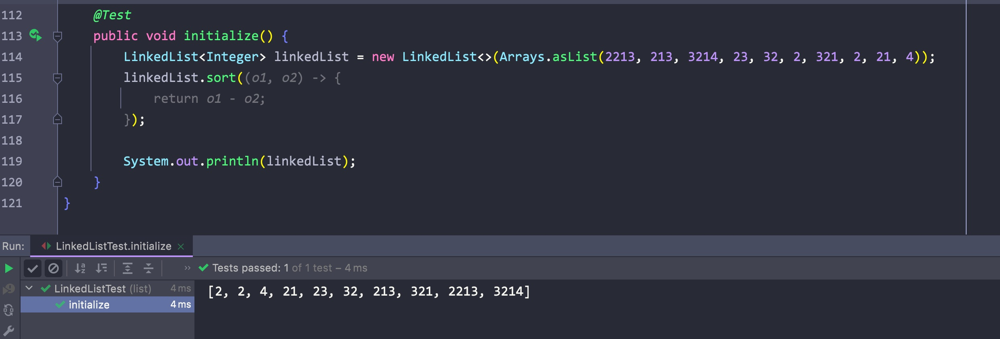
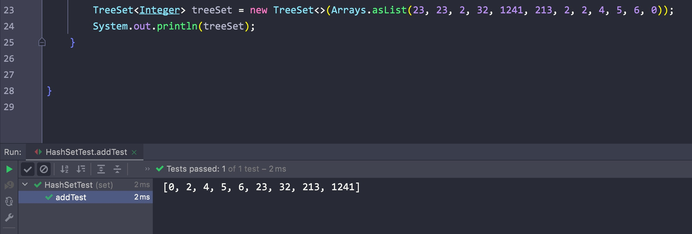

# 一、二进制表示法


## 1) 原码

- 最高位为符号位，最高位为0表示正数，为1表示负数


- -1用原码表示: 1001
- 1用原码表示: 0001


- 原码表示虽然简单，但在计算的时候会出现问题:

1 + (-1) = 0001 + 1001 = 1010 ≠ 0

<hr>


## 2) 反码

- 为了解决原码出现的问题，出现了反码:
    - 正数不变
    - 负数除了符号位，其余位取反表示


使用反码后计算1 + (-1 ):

1 + (-1) = 0001 + 1110 = 1111

再对结果取反: 1000 = -0


- 但问题是，如果1000 = -0，那么0000 = +0
- 在现实中，0应该没有符号才对，所以反码也不行

<hr>


​	


## 3) 补码

- 为了解决补码出现的问题，这里引入了补码:
    - 正数同样保持原码不变
    - 负数则先去反码，在反码的基础上 + 1后即可得到补码


使用补码计算1 + (-1):

- 1 + (-1) - > 0001 + 1110(反码) -> 0001 + 1111(补码) -> (1)0000(溢出位舍弃) = 0


因此，在Java中，负数都用补码来表示

<hr>


# 二、数据类型


## 1) 整数/字符/字符串

- byte: -128 ~ 127(1byte)
- short: -256 ~ 255(2byte)
- int: -2^31 ~ 2^31 - 1(4byte)，数字默认为int类型
- long: -2 ^ 31 ~ 2 ^ 31 - 1(8byte)，注意long类型数字末尾需加上"L"
- char: char(2yte)无符号，且对应的是Unicode编码表，这也是Java能使用中文作为变量名的原因，0 ~ 65535
    - char类型也可以使用'\uxxx'的形式来表示，最大为: \uFFFF

Eg:


- 如果数字大到long也放不下的话，可以使用BigInteger类:


<hr>


## 2) 小数/浮点数

- float(4byte)
- double(8byte): 默认的小数类型

浮点数的存放:

float:(共31位)

| S(从右往左第31位，最左边1位) | E(之后8位) | M(最后23位) |
| :--------------------------: | :--------: | :---------: |

| S(最左边1位) | E(之后11位) | M(最后52位) |
| :----------: | :---------: | :---------: |


- S: sign bit，表示符号。1为负，0为正
- E: exponent，表示指数(2的多少次方)\
- M: 尾数，表示有效的数字

每个浮点数 = (-1) ^s^ * 2^E^ * M


例子:


- 首位为0，这里舍去了
- E为: 10000010 = 2
- M为: 101...


这里M位之前默认省略了一个1，本来该是1.0101

省略第一个1，只保留了剩下的101

所以最后二进制表示为：(-1)^0^ * 2^2^ * 1.0101 = 101.01

<hr>


# 三、String/StringBuilder

- 如果赋值为静态的字符串，则会放进字符串常量池中，如果使用new的方式则不会放进字符串常量池内，两者在内存中不在同一个位置


- 使用+，+=运算符可以拼接字符串，但JVM会优化为StringBuilder
- 因为String在Java中是final char[]，所以每次修改String都会创建一个新的对象
- 为了防止重复创建对象，最好使用StringBuilder对象


- String intern: 返回字符串的规范化表示形式
    - 底层：查看字符串常量池中是否有该字符串，有则返回其引用(new String的不算)，没有则添加进去，再返回其引用

Eg:


- 第一条比较时，abc因为str2已经被放在常量池中了，所以会返回常量池中的引用，但str1不在常量池中
- 第二条: str1对应的字符串存在于常量池中，而str2也在常量池中，所以指向的是同一个地址

<hr>


# 四、可变参数

- Java5中引入，允许在调用方法的时候传入不定长度的同种类型的参数(Java语法糖)，会将多个参数包装为一个数组


- 传入的参数个数可以不确定，该可变参数必须放在方法列表的最后一个位置:


<hr>


# 五、lambda表达式

- 想要使用只有一个普通方法的接口时(默认方法不算)，需要使用匿名内部类进行实现
- 这里可以使用lambda表达式简写实现的过程:


简写:


- 在lambda表达式中，只能访问final类型或者隐式final变量:


<hr>


# 六、Enum枚举类

- 枚举类本质就是一个类，其继承了Enum类
- 使用时直接通过枚举类调用即可(当作static final字段)


对应的方法:

- Enum[] value(): 作为数组返回所有的枚举类型字段
- Enum.class valueOf(String name): 接收一个字符串作为参数，返回同字符串相同的枚举字段


## 反编译

- 使用javap命令可以反编译:


<hr>


# 七、异常/错误


## 1) 异常


- 异常分为两类(都直接或间接继承自Exception):
    - 直接继承自Exception的异常，在编译前就需要处理的异常，否则不能编译(IOException)
    - 继承自RuntimeException的异常，编译后才会出现的异常(ArithmeticException)


## 2) 错误

经典面试题:


- 错误出现后程序就会停止(JVM罢工)
- 错误Error和Exception都继承自Throwable抽象类


## 3) 自定义异常/finally

- 创建一个类，继承Exception或者RunTimeException即可


- try可以只和catch或者finally中的一个组合(finally仅限RunTimeException)


- 可以通过"|"符号来并列多个异常


<hr>


# 八、泛型


## 1) 初入泛型

jdk1.5引入


场景:

- 设计一个Score类，其代表每个学生的信息和对应的分数，且分数可以有两种表示方法: (优秀|良好|不及格)和具体数字(即字符串和Integer)


方法一:

我们可以将score字段定义为Object，获取对应分数时进行强制类型转换


Eg:


这种方法的缺点:

- 需要手动进行类型转换(有可能出错)


Eg:


- 这里转换的类型不对，但只有在运行时才会发现问题


- 用泛型可以解决这个问题:


- 使用泛型可以在创建对象时显示指定类型，使得对应的泛型字段也能直接返回确定的类型
- 泛型只是Java的语法糖，编译时JVM依然会进行强制类型转换，**称为类型擦除**
- 正是因为底层依然是通过Object类型进行强制转换，所以泛型类型必须为引用类型，不能为基础类型

<hr>


## 2) 泛型的使用

- 对类设定泛型后，该类就变为了一个泛型类，在创建对象时需要前明确泛型的具体类型
- T指type，也可以用其他的字母，且可以有多个泛型字段(有几个就在尖括号里写几个代表泛型的字母):


对于常见的泛型命名:

- E(element): 常见于Java集合框架
- K(key)
- N(number)
- T(type)
- V(value)


- 因为泛型是指代具体的类型，所以是不确定的，如果对类指定泛型，那么必须是在创建对象后才能确定泛型指代的类型
- 所以泛型字段不能被static修饰:


- 但是方法的返回值和参数类型可以设置为泛型:


- 可以使用通配符"?"来指代多种不同的类型


<hr>


## 3) 泛型的界限

- 注意: 泛型类型返回的类型始终以上限类型为准


- 上限:

```java
public class ClassName<T extends Class> {
  
}
```


- 限定泛型类型的最高层父类，传入的类型可以是该父类下的所有子类:


- 下限:

```java
Score<? super Class> obj = new Score<>();
```


- 下限指定开始的类型，但返回类型始终以上限类型为准

<hr>


## 4) 接口中的使用

- 可以在实现接口的时候指定泛型的类型


- 这里通过桥接的方式遵循了多态重写的规则:


<hr>


## 5) Hash简单原理


- 通过数组存放数据时，创造和查询比较快，但增加和删除比较慢
- 相应的，使用链表时又和数组相反


为了折中，可以将数组中的每个元素作为一个链表的头节点，通过每个对象/元素的地址值(hashCode)进行hash运算得到一个相对唯一的位置，添加到数组中对应的位置即可


- hash碰撞:

在通过地址值得到hashcode的过程中，不同的对象也有可能的出相同的hash值，此时就在数组的同一个位置上向后延伸链表即可(链表元素变多后会变成二叉树的形式)


## 6) 二叉搜索树/平衡二叉树

- 在hash表中，如果一个链表的节点过多，就失去了意义
- 此时我们会将其中的节点组织为一颗二叉搜索树，这样就能利用二分法进行搜索了:


- 但问题在于，如果添加节点到这颗树中的时候，没有遵循规律，那么这颗树很有可能退化为链表！


- 此时该二叉树不是一个平衡二叉树(左右子树的高度差大于1)，此时就无法利用二叉搜索树使用二分法了


- 为了能够利用二叉搜索树，我们应该将其恢复为一颗平衡二叉树


左左失衡:

- 将树右旋即可


右右失衡:

- 将树左旋即可


左右失衡:

- 先左旋，再右旋


右左失衡

- 先右旋，再左旋


<hr>


# 九、红黑树


## 1) 红黑树的特性

- **红黑树也是一种二叉搜索树**
- 每个节点都是黑色(包括null)或者红色
- 根节点为黑色
- 节点左右如果没有子节点，一律视为黑色节点
- **一个节点到其任意一个子孙节点的所有路径上**，包含相同数目的黑色节点


红黑树比起平衡树的优点: 旋转次数少(三次以内可恢复平衡)

<hr>


## 2) 插入的规则

1. 将新插入的节点标记为红色
2. 如果插入的节点作为root，则变为黑色
3. 如果插入节点的父节点不是黑色，且它也不是root，则遵循以下规则:
    1. 如果插入节点的父节点的兄弟节点(uncle节点)是红色
        - 将父节点和兄弟节点标记为红色
        - 将祖父节点标记为红色(父节点的父节点)
        - 让插入节点的颜色与其祖父节点一致，之后再重复前两个步骤
    2. 如果插入节点的uncle节点为黑色，则需要旋转(同二叉平衡树的旋转)


模拟:

[Red/Black Tree Visualization (usfca.edu)](https://www.cs.usfca.edu/~galles/visualization/RedBlack.html)

<hr>


# 十、集合类


- 实现了Iterator接口的类都能够使用for each进行遍历


## 1) ArrayList

继承链:


拓展:

- Serializable:

实现该接口的类都能实现自动序列化

其中如果部分字段不需要通过序列化传输，则会使用transient关键字修饰


- source code:


1. 三个构造方法:

```java
private static final int DEFAULT_CAPACITY = 10;
private static final Object[] EMPTY_ELEMENTDATA = {};
final Object[] DEFAULTCAPACITY_EMPTY_ELEMENTDATA = {};

// 实际存储元素的数组
transient Object[] elementData;

// 记录集合中元素的个数
private int size;

public ArrayList(int initialCapacity) {
  
  // 分配出对应的数组给elementData
  if (initialCapacity > 0) {
    this.elementData = new Object[initialCapacity];
    
    // 如果为0则设置一个空数组
  } else if (initialCapacity == 0) {
    this.elementData = EMPTY_ELEMENTDATA;
    
		// 初始空间为负数，直接抛出异常
  } else {
    throw new IllegalArgumentException("Illegal Capacity: "+ initialCapacity);
  }
}


// 空参构造，传入默认的空数组
public ArrayList() {
  this.elementData = DEFAULTCAPACITY_EMPTY_ELEMENTDATA;
}


// 将其他的集合类作为参数传入
public ArrayList(Collection<? extends E> c) {
  Object[] a = c.toArray();
  
  // 如果传入的集合不为空
  if ((size = a.length) != 0) {
    if (c.getClass() == ArrayList.class) {
      elementData = a;
    } else {
      elementData = Arrays.copyOf(a, size, Object[].class);
    }
    
    // 如果为空
  } else {
    elementData = EMPTY_ELEMENTDATA;
  }
}
```


2. contains/indexOf/lastIndexOf

```java
public boolean contains(Object o) {
  return indexOf(o) >= 0;
}


public int indexOf(Object o) {
  return indexOfRange(o, 0, size);
}

int indexOfRange(Object o, int start, int end) {
  Object[] es = elementData;
  
  // 查找的元素为null，则查看数组中是否有空元素
  if (o == null) {
    for (int i = start; i < end; i++) {
      if (es[i] == null) {
        return i;
      }
    }
    
    // 不为空，则一一匹配
  } else {
    for (int i = start; i < end; i++) {
      if (o.equals(es[i])) {
        return i;
      }
    }
  }
  return -1;
}


public int lastIndexOf(Object o) {
  return lastIndexOfRange(o, 0, size);
}

// 反向遍历
int lastIndexOfRange(Object o, int start, int end) {
  Object[] es = elementData;
  if (o == null) {
    for (int i = end - 1; i >= start; i--) {
      if (es[i] == null) {
        return i;
      }
    }
  } else {
    for (int i = end - 1; i >= start; i--) {
      if (o.equals(es[i])) {
        return i;
      }
    }
  }
  return -1;
}
```


3. get/add/set/remove

```java
public static int checkIndex(int index, int length) {
  return Preconditions.checkIndex(index, length, null);
}

E elementData(int index) {
  return (E) elementData[index];
}

private Object[] grow(int minCapacity) {
  return elementData = Arrays.copyOf(elementData, newCapacity(minCapacity));
}

private Object[] grow() {
  return grow(size + 1);
}

... 


public E get(int index) {
  
  // 首先检查索引的合法性
  Objects.checkIndex(index, size);
  
  // 通过索引直接在数组中获取元素
  return elementData(index);
}


// 同get
public E set(int index, E element) {
  Objects.checkIndex(index, size);
  E oldValue = elementData(index);
  elementData[index] = element;
  return oldValue;
}


private void add(E e, Object[] elementData, int s) {
  
  // 集合已经满了，需要扩容
  if (s == elementData.length)
    elementData = grow();
  elementData[s] = e;
  size = s + 1;
}


public boolean add(E e) {
  modCount++;
  add(e, elementData, size);
  return true;
}


// 检查索引是否合法
private void rangeCheckForAdd(int index) {
  if (index > size || index < 0)
    throw new IndexOutOfBoundsException(outOfBoundsMsg(index));
}

public void add(int index, E element) {
  rangeCheckForAdd(index);
  modCount++;
  final int s;
  Object[] elementData;
  if ((s = size) == (elementData = this.elementData).length)
    elementData = grow();
  
  // 移动后面的元素，注意这里使用的arraycopy是native方法，其由C++实现
  System.arraycopy(elementData, index,
                   elementData, index + 1,
                   s - index);
  elementData[index] = element;
  size = s + 1;
}


public E remove(int index) {
  Objects.checkIndex(index, size);
  final Object[] es = elementData;

  @SuppressWarnings("unchecked") E oldValue = (E) es[index];
  fastRemove(es, index);

  return oldValue;
}
```

<hr>


## 2) LinkedList

继承链:


- 其本质为一个双向链表


1. 通过一个内部类实现双向链表

```java
private static class Node<E> {
    E item;
    Node<E> next;
    Node<E> prev;

    Node(Node<E> prev, E element, Node<E> next) {
        this.item = element;
        this.next = next;
        this.prev = prev;
    }
}
```


2. 对应的字段

```java
transient int size = 0;
transient Node<E> first;
transient Node<E> last;
```


3. 构造方法

```java
public LinkedList() {
}

public LinkedList(Collection<? extends E> c) {
    this();
    addAll(c);
}
```


4. 添加

```java
public boolean add(E e) {
    linkLast(e);
    return true;
}

// 尾插法
void linkLast(E e) {
  final Node<E> l = last;
  final Node<E> newNode = new Node<>(l, e, null);
  last = newNode;
  if (l == null)
  first = newNode;
  else
  l.next = newNode;
  size++;
  modCount++;
}
```


5. 删除

```java
public E removeFirst() {
  final Node<E> f = first;
  if (f == null)
    throw new NoSuchElementException();
  return unlinkFirst(f);
}


public E removeLast() {
  final Node<E> l = last;
  if (l == null)
    throw new NoSuchElementException();
  return unlinkLast(l);
}

private E unlinkFirst(Node<E> f) {
  // assert f == first && f != null;
  final E element = f.item;
  final Node<E> next = f.next;
  f.item = null;
  f.next = null; // help GC
  first = next;
  if (next == null)
    last = null;
  else
    next.prev = null;
  size--;
  modCount++;
  return element;
}


private E unlinkLast(Node<E> l) {
  // assert l == last && l != null;
  final E element = l.item;
  final Node<E> prev = l.prev;
  l.item = null;
  l.prev = null; // help GC
  last = prev;
  if (prev == null)
    first = null;
  else
    prev.next = null;
  size--;
  modCount++;
  return element;
}


public boolean remove(Object o) {
  if (o == null) {
    for (Node<E> x = first; x != null; x = x.next) {
      if (x.item == null) {
        unlink(x);
        return true;
      }
    }
  } else {
    for (Node<E> x = first; x != null; x = x.next) {
      if (o.equals(x.item)) {
        unlink(x);
        return true;
      }
    }
  }
  return false;
}

E unlink(Node<E> x) {
  // assert x != null;
  final E element = x.item;
  final Node<E> next = x.next;
  final Node<E> prev = x.prev;

  if (prev == null) {
    first = next;
  } else {
    prev.next = next;
    x.prev = null;
  }

  if (next == null) {
    last = prev;
  } else {
    next.prev = prev;
    x.next = null;
  }

  x.item = null;
  size--;
  modCount++;
  return element;
}
```


6. get/set

```java
public E get(int index) {
  checkElementIndex(index);
  return node(index).item;
}


public E set(int index, E element) {
  checkElementIndex(index);
  Node<E> x = node(index);
  E oldVal = x.item;
  x.item = element;
  return oldVal;
}


Node<E> node(int index) {
  // assert isElementIndex(index);

  // 判断索引和集合长度一半之间的大小关系
  // 如果在前半部分，则从头开始
  if (index < (size >> 1)) {
    Node<E> x = first;
    for (int i = 0; i < index; i++)
      x = x.next;
    return x;
    
    // 从尾开始
  } else {
    Node<E> x = last;
    for (int i = size - 1; i > index; i--)
      x = x.prev;
    return x;
  }
}
```


- 拓展:

可以通过Arrays.asList的方式初始化集合(只读的)，或者实现匿名内部类(JDK9之前需要在new Type<>中指明匿名类的泛型类型，)


7. 排序

这里需要实现Comparator接口中的compare方法即可

```java
* a negative integer, zero, or a positive integer as the
*first argument is less than, equal to, or greater than the
*         second.
* @throws NullPointerException if an argument is null and this
*         comparator does not permit null arguments
* @throws ClassCastException if the arguments' types prevent them from
*         being compared by this comparator.
*/
int compare(T o1, T o2);
```




<hr>


## 3) 迭代器

- 如果集合类实现了RandomAccess接口，那么使用for循环会更快一些(index的方式)，实现的类: ArrayList, Vector
- 增强for循环的本质为迭代器:


- 我们还可以通过forEach方法遍历元素:


- 其可以用lombda表达式代替，甚至使用System.out::println


拓展(常用的四个函数式接口):


<hr>


## 4) Set

- 继承链:


Set的特点:

- 其中不能有重复数字
- 不能在特定位置进行修改(不支持set, get, remove)，只能通过迭代器或者遍历


HashSet:

- 其底层维护了一个HashMap

输出元素的**顺序是按照Hashcode来的**

其利用了HashMap中的key不可重复这一特性来实现自己的功能


LinkedHashSet:

- 其继承自HashSet，只是对HashMap进行了包装，通过链表实现了有序


- TreeSet

其底层为红黑树，**输出结果默认是按照数字大小来的**，可以通过匿名内部类手动设置比较规则





<hr>


## 5) Map

- Map接口本身不继承任何接口


遍历Map可以使用entrySet方法获取带有内部Entry类的Set集合，遍历该集合即可


### 1. HashMap

继承链:


- HashMap底层就是hash表，其由数组 + 链表组成，每个数组元素都是链表的头节点
- 如果一个位置上对应链表的长度过长，查询用时又变回了O(n)
- 为了解决这个问题，从jdk8开始从数组 + 链表变为了数组 + 红黑树


构造方法:

```java
// 向左移动4个bit位，相当于 * 2^4
static final int DEFAULT_INITIAL_CAPACITY = 1 << 4; // aka 16
static final int MAXIMUM_CAPACITY = 1 << 30;


transient Node<K,V>[] table;

transient Set<Map.Entry<K,V>> entrySet;
transient int size;
transient int modCount;
int threshold;
final float loadFactor;

public HashMap(int initialCapacity, float loadFactor) {
    if (initialCapacity < 0)
        throw new IllegalArgumentException("Illegal initial capacity: " +
                                           initialCapacity);
    if (initialCapacity > MAXIMUM_CAPACITY)
        initialCapacity = MAXIMUM_CAPACITY;
    if (loadFactor <= 0 || Float.isNaN(loadFactor))
        throw new IllegalArgumentException("Illegal load factor: " +
                                           loadFactor);
    this.loadFactor = loadFactor;
    this.threshold = tableSizeFor(initialCapacity);
}


// 初始化时显式指定其容量
public HashMap(int initialCapacity) {
    this(initialCapacity, DEFAULT_LOAD_FACTOR);
}


// 无参构造，将负载因子初始化为默认值
public HashMap() {
    this.loadFactor = DEFAULT_LOAD_FACTOR; // all other fields defaulted
}
```

- 负载因子代表一个阈值，如果集合里的元素占比超过了负载因子代表的百分比，则会进行扩容


红黑树:

```java
static final class TreeNode<K,V> extends LinkedHashMap.Entry<K,V> {
    TreeNode<K,V> parent;  // red-black tree links
    TreeNode<K,V> left;
    TreeNode<K,V> right;
    TreeNode<K,V> prev;    // needed to unlink next upon deletion
    boolean red;
    TreeNode(int hash, K key, V val, Node<K,V> next) {
        super(hash, key, val, next);
    }
  	
  
  	......
}
```


继承LinkedHashMap:

```java
static class Entry<K,V> extends HashMap.Node<K,V> {
    Entry<K,V> before, after;
    Entry(int hash, K key, V value, Node<K,V> next) {
        super(hash, key, value, next);
    }
}
```


- 其中继承了LinkedHashMap.Entry<K, V>类中的before和after(用来保存加入的顺序)

<hr>


### 2. LinkedHashMap

- 其能自动排序(Entry继承了HashMap.Entry后，向其中添加了before和after)

<hr>


### 3. TreeMap

- 有序的Map，默认按照key升序排列(也可以通过匿名内部类的方法修改排序规则)


Eg:


- 其内部维护了一颗红黑树:

```java
static final class Entry<K,V> implements Map.Entry<K,V> {
    K key;
    V value;
    Entry<K,V> left;
    Entry<K,V> right;
    Entry<K,V> parent;
    boolean color = BLACK;

    
    Entry(K key, V value, Entry<K,V> parent) {
        this.key = key;
        this.value = value;
        this.parent = parent;
    }

   
    public K getKey() {
        return key;
    }

    
    public V getValue() {
        return value;
    }

    
    public V setValue(V value) {
        V oldValue = this.value;
        this.value = value;
        return oldValue;
    }

    public boolean equals(Object o) {
        if (!(o instanceof Map.Entry))
            return false;
        Map.Entry<?,?> e = (Map.Entry<?,?>)o;

        return valEquals(key,e.getKey()) && valEquals(value,e.getValue());
    }

    public int hashCode() {
        int keyHash = (key==null ? 0 : key.hashCode());
        int valueHash = (value==null ? 0 : value.hashCode());
        return keyHash ^ valueHash;
    }

    public String toString() {
        return key + "=" + value;
    }
}
```


其余方法:

- merge:


- computeIfPresent(如果存在才进行修改)


<hr>


# 十一、Stream流

- jdk1.8新特性
- 将一个数组/集合变为一个流，再添加相应的工序


Eg:

- 将一个集合倒序排序，再排除小于等于10的元素


- 对应方法:
    - Stream<E> stream(): 将当前对象变为一个Stream对象
    - Stream<T> sorted(): 对当前流对象进行排序
    - Stream<T> sorted(Comparator<? super T> comparator): 设置自定义排序规则
    - Stream<T> filter(Predicate<? super T> predicate): 设置过滤器，只放过符合条件的元素
    - <R, A> R collect(Collector<? super T, A, R> collector): 传入一个Collector，调用toList方法重新打包


Eg:

- 获取一个数组的最大最小值


步骤:

- 将其转换为流对象
- 通过mapToInt()方法将流转换为IntStream对象
- 调用summaryStatistics方法得到一个IntSummaryStatistics对象
- 调用getMax和getMin方法获取最值


Eg:

- 得到一个集合对象的最值


步骤

- 先转换为Stream对象
- 再调用mapToInt方法将Stream对象转换为IntStream对象
- 再使用summaryStatistics()方法返回一个SummaryStatistics对象


其余方法:

- distinct(): 去重
- limit(int num): 限定输出的元素个数


拓展:

- 流式计算时，会先统计所有的步骤，再执行每个步骤

<hr>


# 十二、Optional判空工具

- 对于任何一个对象，使用静态方法:
    - static<T> Optional<T> of(T value): 传入一个对象，返回一个Optional对象
    - static<T> Opiontal<T> ofNullable(T value): 如果参数不为null才返回一个Optional对象，否则返回一个null对象
- void ifPresent(Consumer<? super T> action): 如果对象不为空才执行其中的操作
- void ifPresentOrElse(Consumer<? super T> action, Runnable emptyAction): 如果为空则输出另一参数
- boolean isPresent(): 判断是否为null
- orElse(String str): 如果当前Optional为空，则返回对应的string
- T get()

Eg:


<hr>


# 十三、反射/注解

注意:

反射次数多的话，不利于后期的维护


## 1) 类的加载

- Java程序启动时，ClassLoader会将一部分类进行加载，然后将类的信息提取出来，存放在元空间中(jdk8之前存放在永久代中)
- 同时会生成一个Class对象放在内存里，且该对象只会存在一个，防止重复加载


防止类重复加载的机制: 双亲委派机制


- 其中我们自己编写的类由AppClassLoader这个加载器加载
- jdk原生的类都由BootstrapClassLoader加载
- 其中ExtClassLoader是AppClassLoader的父加载器，BoostrapLoader是ExtClassLoader的父加载器
- BootstrapLoader由C++实现，所以不能直接获取

Eg:


- 因为BootstrapLoader为C++原生实现，所以无法获取

<hr>


## 2) 获取Class对象

- 可以通过类名直接调用.class()方法，其会返回对应的唯一class对象

- 可通过该类的一个对象调用getClass()方法
- 可通过Class类中的静态方法forName()加载对应的类返回class对象，传入对应类的包名路径
- 返回的Class对象属于一个泛型类


可通过getName方法获取对象的类名:


- 数组同样是一个对象


- 基础类型同样有对应的Class对象，其存放在对应的包装类里


<hr>


## 3) 对应方法

- 可以通过getClass来代替instanceOf
- 通过getSuperclass()
- 通过asSubClass()方法判断当前类是否为参数类的子类，如果不是则会抛出异常
- 通过getGenericSuperclass方法获取父类类型
- 通过getGenericInterfaces方法获取父类接口

Eg:


<hr>


## 4) 构建实例对象

- 通过Class对象调用newInstance()方法构造对象


该方式在jdk9之后就被舍弃了

Eg:


- 通过Class对象调用getConstructor方法获取对应的构造方法，其中加载的是参数对应类型的Class对象
- 获取Constructor后调用newInstance方法构建实例对象


如果构造方法被private修饰:

- 获取该Class对象后，获取声明的构造方法
- 直接修改构造方法的访问权限即可


- getDeclaredConstructor(Class<?>... parameterTypes): 

接受多个参数，返回一个构造器对象，传入对应构造方法的参数对应类型的Class对象

如果是空参构造则不需要任何参数


- getDeclaredConstructors():

返回所有声明过的构造器对象


修改构造器的访问权限:

- void setAccessible(boolean flag): 设置当前构造器的访问权限

<hr>


## 5) 调用类方法

- 通过Class对象调用getMethod()方法:
    -  Method getMethod(String name, Class<?>... parameterTypes): 第一个参数为获取的方法对应的方法名称，后面为方法参数对应的类型(有几个参数就传入几个Class对象)，最后返回一个Method方法
    - Object invoke(Object obj, Object... args): 第一个参数为对应类的实例对象，第二个参数为传入的具体参数


Eg:


该方式的好处:

- 不需要导入类就能使用，一切对象都抽象为Object


访问private修饰方法的过程同访问private构造方法相同


- 通过getDeclaredMethod方法获取对应的Method对象
- 通过Method对象调用setAccessiable方法设置可见性


如果方法的参数为可变参数，那么传入一个数组的Class对象即可

Eg:


通过Method对象可以获取方法的信息:

- getName(): 获取方法的名字
- getReturnType(): 返回方法的返回类型
- getTypeParameters(): 返回参数

Eg:


<hr>


## 6) 类的字段/属性

- 通过类的Class对象调用getField或者getDeclaredField字段获取对应的Field对象
- 如果字段为private，需要通过setAccessiable方法设置访问修饰符，再使用set方法设置字段的值


<hr>


## 7) 自定义ClassLoader

1. 首先创建一个类，并编译为.class文件
2. 创建一个继承ClassLoader类的自定义ClassLoader类，自己写一个defineClass，其调用内部被protected修饰的defineClass方法
3. 通过一个FileInputStream对象与外部的class文件建立输入流
4. 调用read方法将流读取到一个字节数组中
5. 创建一个自定义ClassLoader的实例对象，获取构造方法，调用newInstance()方法构建对象实例


Eg:


<hr>


# 十四、注解


## 1) overview

大多数注解和注释相同，但其可以选择保存在运行时中


jdk自带注解:

- @Override:

检查方法是否是重写方法。如果对应父类没有改方法会报错


- @Deprecated:

标记过时的方法，编译时会警告


- @SuppressWarnings

指示编译器去忽略注解中声明的警告


- @FunctionalInterface 

Java 8 开始支持，标识一个匿名函数或函数式接口。


- @SafeVarargs

Java 7 开始支持，忽略任何使用参数为泛型变量的方法或构造函数调用产生的警告。


元注解:

用来指明注解的信息

- Retention:

标记该注解保存在哪里


- Target:

标记注解的作用范围


自定义注解:


<hr>


## 2) 通过反射获取注解

- 首先获取类的Class对象，直接调用getAnnotation或者getAnnotations方法可以获取类上的注解
- 通过Annotation对象调用annotitionType方法可以获取注解的类型，也可以直接获取注解中的字段值

Eg:


