# 一、Socket技术


## 1. 建立Socket连接

- Socket是系统提供的通信技术，其支持TCP和UDP。Java对其底层进行了一套封装
- 要实现Socket通信，我们必须创建一个发送者(client)和接收者(server)，我们需要提前启动服务器，让服务器被动监听


### 1.1 server的创建

- 创建一个ServerSocket对象，调用其构造方法，其中传入服务器绑定的端口号:

```java
ServerSocket server = new ServerSocket(8080);
```

- 因为该类实现了Closeable接口，所以可以放在try()中，这样其就能自动关闭，不再需要我们手动使用close方法

```java
try (ServerSocket server = new ServerSocket(8080)) {
            
} catch (IOException e) {
  e.printStackTrace();
}
```

- 使用该ServerSocket对象调用accept方法，其会暂时阻塞当前这个服务器，直到接收到来自client的连接

```java
System.out.println("Waiting for client...");
Socket clientSocket = server.accept();
```


- accept方法会返回一个Socket对象，其代表与当前server建立连接的client
- 通过该Socket对象，调用getInetAddress()能获取一个InetAddress对象，再调用getHostAddress()能获取client的ip地址:

```java
System.out.println("client ip address: " + clientSocket.getInetAddress().getHostAddress());
```


完整写法:

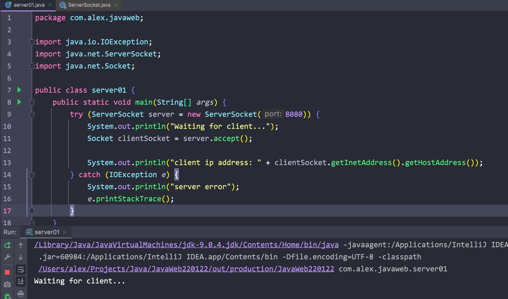


### 1.2 client的创建

创建一个Socket对象，调用其构造方法，传入需要连接的服务ip地址和服务器对应的端口号(在创建ServerSocket对象时写了)

```java
Socket clientSocket = new Socket("localhost", 8080);
```


同样将其放入try中

```java
try (Socket clientSocket = new Socket("localhost", 8080)) {
  System.out.println("Connected!");
} catch (IOException e) {
  System.out.println("connection failed!");
  e.printStackTrace();
}
```


### 1.3 使用

- 先开启服务器:


- 再启动client进行连接:

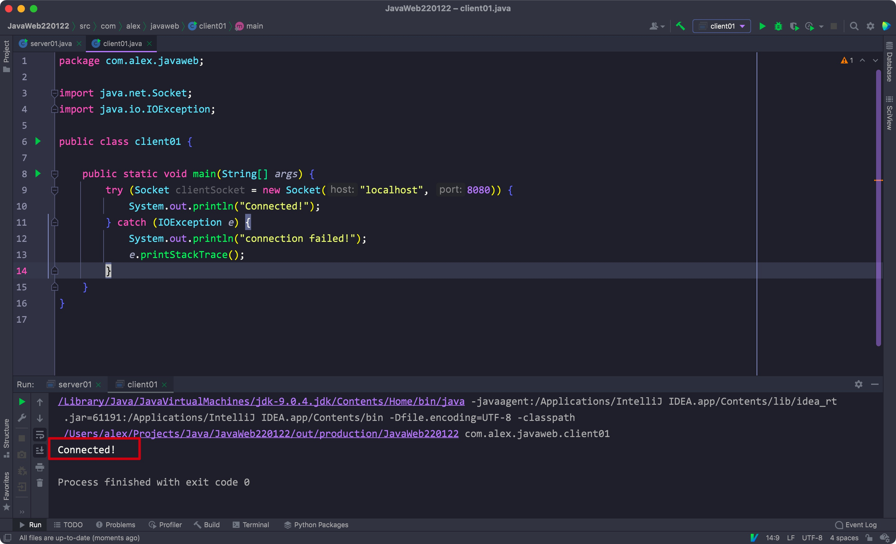


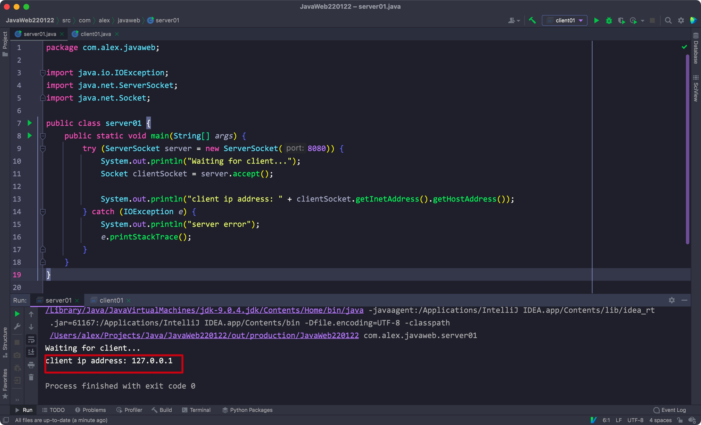


- 将accept方法放在循环里就能一直接收连接请求了:

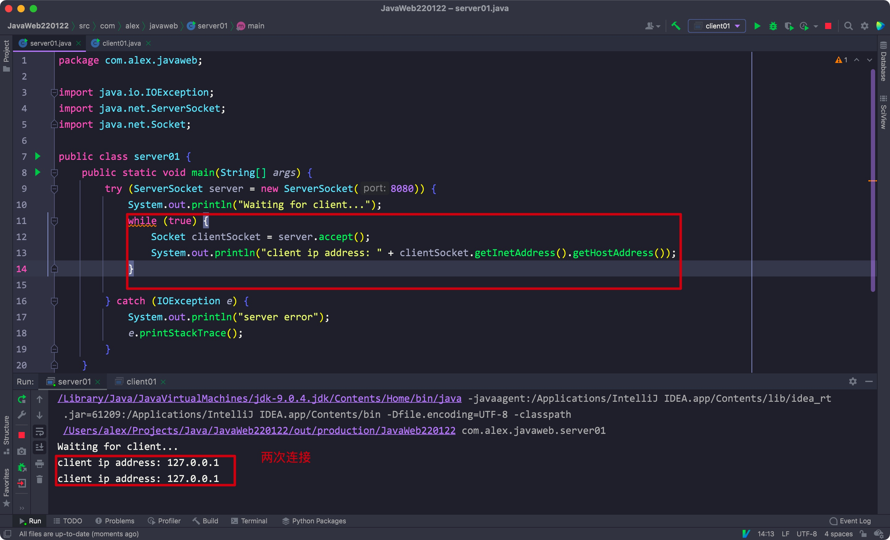


## 2. Socket传输数据


### 2.1 client向server传输数据


Client:

1. 通过client的Socket对象调用getOutputStream()方法获取对应服务器的输出流
2. 将获取的输出流封装为OutputStreamWriter对象，调用write方法收获数据
3. 通过OutputStreamWriter对象调用flush方法，将数据发送给server

```java
public static void main(String[] args) {
  try (Socket clientSocket = new Socket("localhost", 8080)) {
    OutputStreamWriter writer = new OutputStreamWriter(clientSocket.getOutputStream());
    writer.write("I'm a client, this is some date from here");
    writer.flush();

  } catch (IOException e) {
    System.out.println("Connection error");
    e.printStackTrace();
  }
}
```


Server:

1. 通过ServerSocket对象调用accept方法获取的Socket对象调用getInputStream方法，获取一个InputStream对象
2. 封装该InputStream为一个BufferedReader对象
3. 调用readLine方法输出数据

```java
public static void main(String[] args) {
  try (ServerSocket serverSocket = new ServerSocket(8080)) {
    System.out.println("Waiting for client...");
    Socket clientSocket = serverSocket.accept();

    System.out.println("client ip address: " + clientSocket.getInetAddress().getHostAddress());

    BufferedReader reader = new BufferedReader(new InputStreamReader(clientSocket.getInputStream()));
    System.out.println("This is data from client: " + reader.readLine());

  } catch(IOException e) {
    System.out.println("Server error!");
    e.printStackTrace();
  }
}
```


### 2.2 server回传确认数据给client


Server:

1. 通过获取的Socket对象调用getOutputStream方法，获取一个OutputStream对象
2. 将其包装为一个OutputStreamWriter，再调用write方法写入传输数据
3. 调用flush方法将数据发送给client
4. 最后关闭流对象和clientSocket

```java
OutputStreamWriter writer = new OutputStreamWriter(clientSocket.getOutputStream());
writer.write("This is server, I received your data!");
writer.flush();

reader.close();
writer.close();
clientSocket.close();
```


Client:

1. 通过Socket对象调用getInputStream方法，获取一个InputStream对象
2. 将其包装为一个BufferedReader对象，再调用readLine对象输出数据
3. 最后关闭流对象

```java
System.out.println("Waiting for server response");
BufferedReader reader = new BufferedReader(new InputStreamReader(clientSocket.getInputStream()));
System.out.println("This is response from server: " + reader.readLine());
```


Complete:

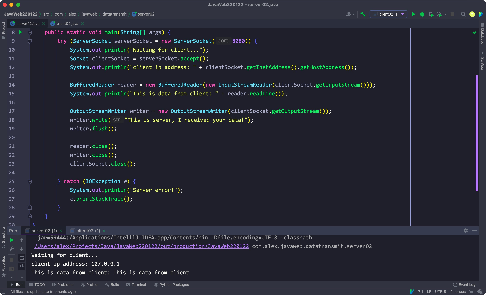


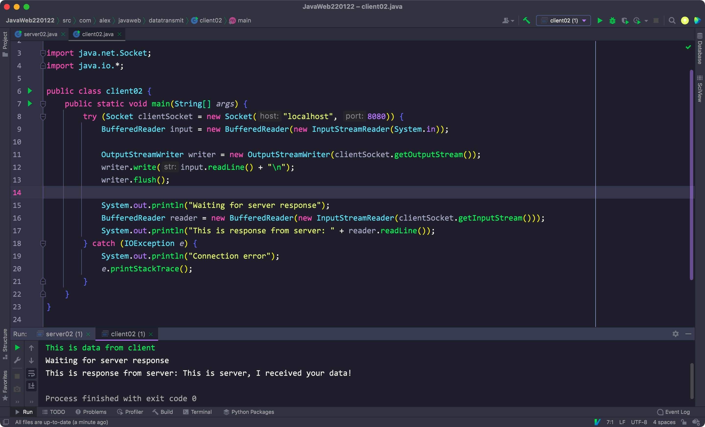


### 2.3 其他方法

- void shutdownInput(): 关闭Socket对象的输入流
- void shutdownOutpu(): 关闭Socket对象的输出流
- void setSoTimeout(int timeout): 设置超时的时间(server一定时间内没有收到client的数据)
- void setKeepAlive(boolean on): 如果一定时间后没有数据往来，server会发送一个ACK数据包以确定client在线，如果不在线则断开连接释放资源，如果不设置则会一直保持连接
- void setReceiveBufferSize(int size): 单位为字节，该方法可以设置TCP连接的接收缓冲区大小
- void setSendBufferSize(int size): 单位为字节，该方法可以设置TCP连接的发送缓冲区大小


## 3. Socket传输文件


Client:

1. 创建一个FlieInputStream对象，与被传输的文件之间建立一个文件输入流
2. 通过client的Socket对象调用getOutputStream方法，与server建立一个输出流
3. 创建一个字节数组作为缓冲区，通过FileInputStream对象调用read方法将文件内容传入缓冲区
4. 通过while循环，使用OutputStream对象的write方法将缓冲区的数据发送给server
5. 循环结束后，通过OutputStream对象调用flush方法将缓冲区的数据全部发送出去
6. 最后关闭相关的流

```java
public static void main(String[] args) {
  try(Socket clientSocket = new Socket("localhost", 8080)) {
    FileInputStream fileInputStream = new FileInputStream("/Users/alex/Desktop/demo.txt");
    OutputStream outputStream = clientSocket.getOutputStream();

    byte[] buffer = new byte[1024];
    int byteNum = 0;

    while ((byteNum = fileInputStream.read(buffer)) != -1) {
      outputStream.write(buffer, 0, byteNum);
    }
    
    fileInputStream.close();
    outputStream.flush();
  } catch(IOException e) {
    System.out.println("Connection error");
    e.printStackTrace();
  }
}
```


Server:

1. 通过client的Socket对象调用getInputStream方法获取一个输入流
2. 与需要输出的位置建立一个文件输出流，创建对应的FlieOutputStream对象
3. 创建一个字节缓冲数组，通过InputStream对象调用read对象将数据写入缓冲区
4. 通过while循环将所有数据写入到输出的文件中
5. 最后通过FileOutputStream对象调用flush方法将所有数据发送出去
6. 最后关闭相应的流和Socket对象

```java
public static void main(String[] args) {
  try(ServerSocket serverSocket = new ServerSocket(8080)) {
    System.out.println("Waiting for client...");
    Socket clientSocket = serverSocket.accept();
    System.out.println("Client IP address: " + clientSocket.getInetAddress().getHostAddress());

    InputStream clientInputStream = clientSocket.getInputStream();
    FileOutputStream fileOutputStream = new FileOutputStream("serveroutput/text.txt");

    byte[] buffer = new byte[1024];
    int curBytes = 0;

    while ((curBytes = clientInputStream.read(buffer)) != -1) {
      fileOutputStream.write(buffer, 0, curBytes);
    }
    fileOutputStream.flush();
    clientInputStream.close();
    clientSocket.close();
  } catch(IOException e) {
    System.out.println("Server error!");
    e.printStackTrace();
  }
}
```


使用:

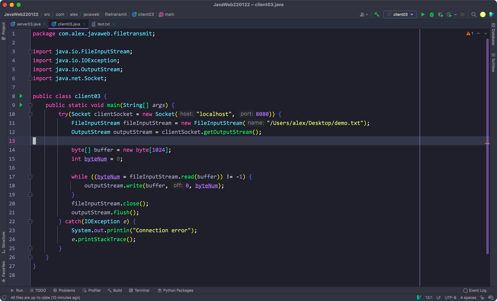


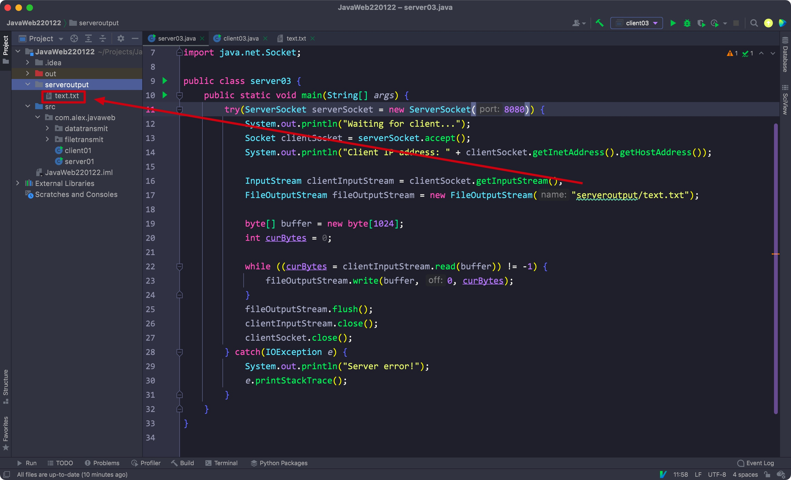


## 4. 浏览器访问server


Server打印请求:

1. 通过client获得的Socket对象获取一个输入流
2. 通过while循环，借用输入流对象调用read方法输出对应的字符

```java
public static void main(String[] args) {
  try(ServerSocket serverSocket = new ServerSocket(8080)) {
    System.out.println("Waiting for client...");
    Socket clientSocket = serverSocket.accept();

    InputStream inputStream = clientSocket.getInputStream();

    int curByte = 0;

    while (true) {
      curByte = inputStream.read();

      if (curByte == -1) {
        break;
      }

      System.out.print((char) curByte);
    }

  } catch(IOException e) {
    System.out.println("Server error");
    e.printStackTrace();
  }
}
```


Eg:

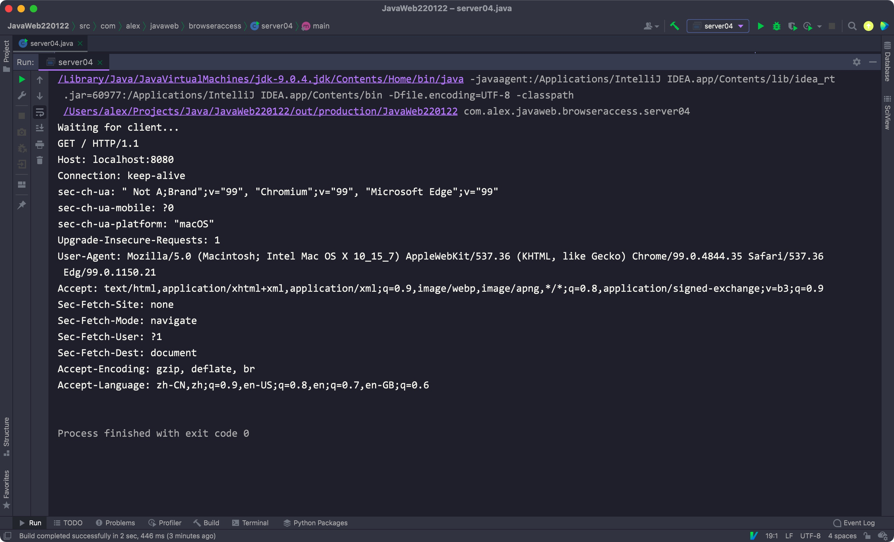


server回传响应:

1. 通过client的Socket对象获取一个OutputStream对象
2. 将其封装为一个OutputStreamWriter对象
3. 通过该对象调用write方法，在其中写上响应头和响应字段
4. 最后调用flush方法发送，最后关闭流

```java
public static void main(String[] args) {
  try (ServerSocket serverSocket = new ServerSocket(8080)) {
    System.out.println("Waiting for client...");
    Socket clientSocket = serverSocket.accept();

    OutputStreamWriter writer = new OutputStreamWriter(clientSocket.getOutputStream());
    writer.write("HTTP/1.1 200 Accepted\r\n");
    writer.write("\r\n");
    writer.write("<h1>Demo Test</h1>");
    writer.flush();

  } catch (IOException e) {
    System.out.println("Server error");
    e.printStackTrace();
  }
}
```


Eg:

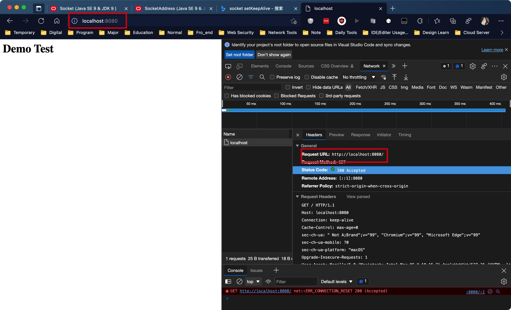


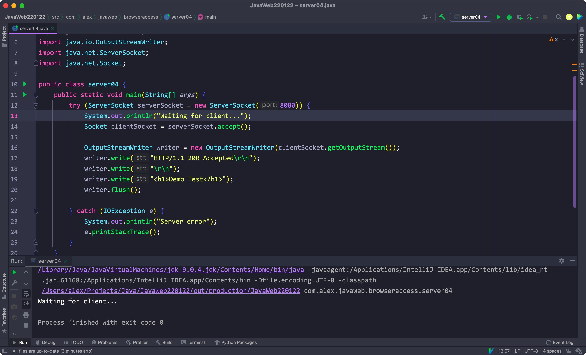

<hr>


# 二、


