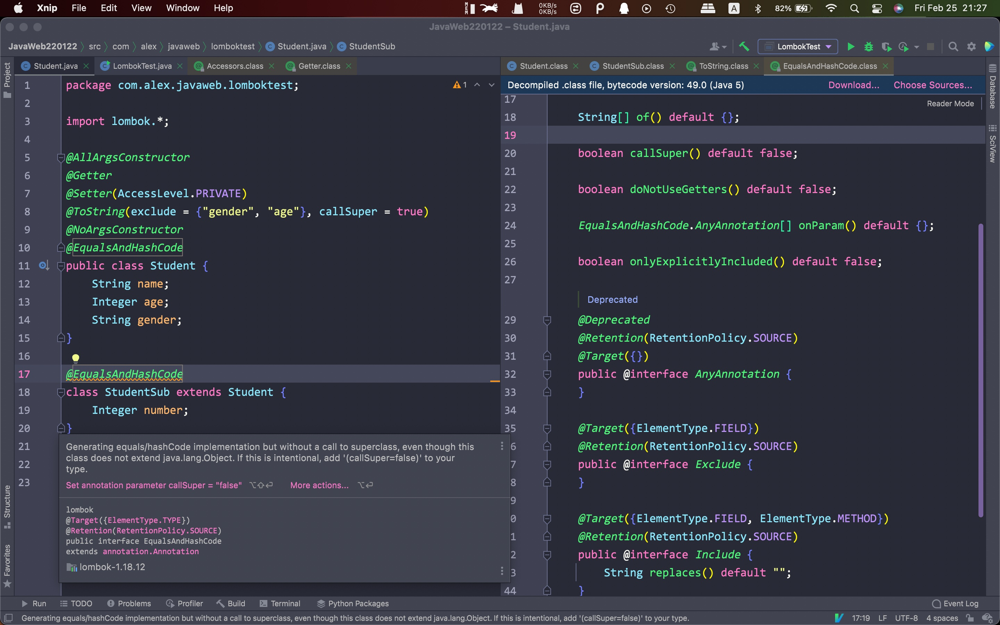

# 一、常用的

- @AllArgsConstructor: 自动创建一个全参构造方法
- @NoArgsConstructor: 自动创建一个空参构造方法
- @Getter: 为所有的一般字段创建getter方法
- @Setter: 为所有的一般字段创建setter方法
- @ToString: 自动创建一个toString方法

Eg:


<hr>


# 二、Setter/Getter

将Setter和Getter注解放在不同的位置上会有不同的结果:

- 放在类上: 对该类的所有字段都有效
- 放在一个字段上: 只对该字段有效


Eg:


- 通过在注解的后面设置AcceseLevel字段来限定方法的访问权限(PUBLIC/PRIVATE)

Eg:


- @Accessors: 用来修饰Setter和Getter方法

    - 使用chain = true将对应方法设置为链式方法

    Eg:

    

    

    

    - 使用fluent = true实现链式方法，并将方法名改为字段名本身

    Eg:

    

    <hr>

    

    

    

    


# 三、ToString

- 自动创建一个toString方法


其余选项:

- includeFieldNames: 是否包含字段名称，默认为true
- exclude: 不显示的字段
- of: 显示的字段
- callSuper: 调用Object类的toString方法(输出对象的内存地址)
- Include(rank = int_num, name = nameStr): 设置字段的输出顺序(rank值大的靠前)和字段的输出名称


# 四、EqualsAndHashCode

- 自动生成Equals和HashCode方法


其余选项:

- callSuper: 调用父类的equals方法(针对有继承父类的类)


释义:

EqualsAndHashCode生成的Equals方法**不会比较父类字段的属性**，class source code:

```java
public boolean equals(Object o) {
  
  // 是否为同一个对象
  if (o == this) {
    return true;
    
    // 是否为同一个类型
  } else if (!(o instanceof Student)) {
    return false;
  } else {
    
    // 转换后比价
    Student other = (Student)o;
    if (!other.canEqual(this)) {
      return false;
    } else {
      
      // Java的Goto语句，
      label47: {
        
        // 获取两个属性值再比较
        Object this$name = this.getName();
        Object other$name = other.getName();
        if (this$name == null) {
          if (other$name == null) {
            
            // 直接跳出最外层
            break label47;
          }
        } else if (this$name.equals(other$name)) {
          break label47;
        }

        return false;
      }

      Object this$age = this.getAge();
      Object other$age = other.getAge();
      if (this$age == null) {
        if (other$age != null) {
          return false;
        }
      } else if (!this$age.equals(other$age)) {
        return false;
      }

      Object this$gender = this.getGender();
      Object other$gender = other.getGender();
      if (this$gender == null) {
        if (other$gender != null) {
          return false;
        }
      } else if (!this$gender.equals(other$gender)) {
        return false;
      }

      return true;
    }
  }
}
```


Eg:




