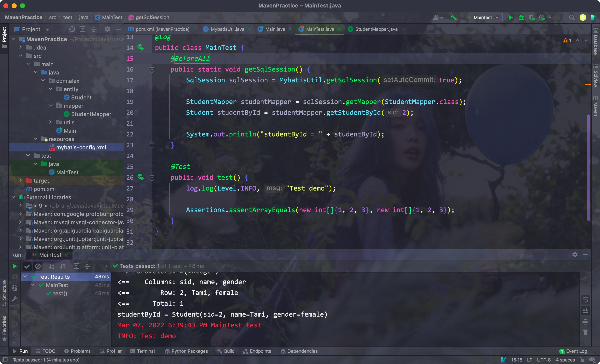

# 一、创建Maven项目


## 1. 界面

- 通过IDEA创建一个Maven项目

Eg:


<hr>


## 2. 项目组成


- 其中target文件夹内的内容在编译后才会生成，src/main/java下是源代码

- resources下都是我们需要的资源/配置文件
- src/test/下的都是进行测试需要的code
- **pom.xml是maven的配置文件**


Eg:


- 其中groupId表示该项目所在的组名
- artifactId表示该项目在该组中的唯一名称


- version表示项目的版本，后面的SNAPSHOT表示快照，正式上线的项目只会带有版本号
- properties表示我们使用的jdk版本

<hr>


# 二、导入对应的配置

- 在pom.xml中创建一个dependencies标签
- 在其中写入外部类的信息即可

比如lombok:

```xml
<dependency>
    <groupId>org.projectlombok</groupId>
    <artifactId>lombok</artifactId>
    <version>1.18.22</version>
    <scope>provided</scope>
</dependency>
```


Eg:


- 成功导入后，左边的External Lib中会显示我们导入的外部类


直接使用即可:


<hr>


# 三、依赖的作用域

除了groupId、artifactId、version外，maven还有其他的属性:

- type: 指明依赖的范围，默认值为jar。**大多数情况下不必声明**
- scope: 依赖的范围(重点)
- optional: 标记依赖是否可选
- exclusions: 用来排除传递性依赖(依赖其他项目时，如果其他项目开启该选项，则不用下载其他项目的依赖)


scope对应的属性:

- compile: 默认的依赖范围。如果没有明确指定依赖有效范围的话，就使用该范围，其在编译、运行、测试时都有效
- provided: 在编译、测试时有效，运行时无效
- runtime: 只在运行、测试时有效，编译时无效
- test: 只在测试时有效


Junit5的scope就使用了test:

```xml
<dependency>
    <groupId>org.junit.jupiter</groupId>
    <artifactId>junit-jupiter-api</artifactId>
    <version>5.8.1</version>
    <scope>test</scope>
</dependency>
```


- 因为scope属性为test，所以只能在test下使用，该目录下的文件不会在最后被打包到项目中去，只在开发阶段有用

Eg:


- 注意，Junit5中，Assert变为了Assertions

Eg:


- 再添加Mybatis和JDBC的依赖:

```xml
<dependency>
    <groupId>org.mybatis</groupId>
    <artifactId>mybatis</artifactId>
    <version>3.5.7</version>
</dependency>

<dependency>
    <groupId>mysql</groupId>
    <artifactId>mysql-connector-java</artifactId>
    <version>8.0.27</version>
</dependency>
```


- 在resources文件下存放mybatis的配置文件:


Junit5解决了重复运行前置条件的问题:

- BeforeAll: 只运行一次
- BeforeEach: 每个测试方法运行前都运行一次前置条件

Eg:




- DisplayName(String): 自定义测试名称
- RepeatedTest(int): 指定重复测试的次数

Eg:


<hr>


# 四、可选和排除依赖

之前提到过，在依赖中添加optional标签并设置为true后，该依赖就变为了可选依赖

对于可选依赖，maven默认不会导入它

Eg:


- 如果想要禁用当前的依赖，手动加载另一个版本的依赖，需要使用exclusion标签
- 其中为每个想要禁用的依赖添加一个exclusion标签

Eg:


- 这里我们排除了junit-platform-commons，导入了1.7.1的版本

<hr>


# 五、父子项目依赖

- 在项目中创建一个子module，且依然选择maven
- 创建时默认选择当前项目作为父项目
- 子module里会有一个parent标签，父项目的pom里会有一个modules标签

Eg:


- 子项目会默认继承父项目下的所有依赖
- 如果不想让子项目继承所有依赖，可以把所有父项目的依赖放入dependencyManager标签下
- 放在dependencyManager标签下的依赖默认不会被子项目继承，子项目需要显式地在其pom文件中指明导入的依赖才能使用(只需要groupId和artifactId，不需要版本号)

Eg:


- 此时子项目无法找到对应的依赖


- 此时不需要指定版本号
- 父项目pom中没有放在dependencyManager下的依赖还是会默认被子项目继承

<hr>


# 六、Maven命令


