# 一、引入Mybatis

- 官网:

[mybatis – MyBatis 3 | 简介](https://mybatis.org/mybatis-3/zh/index.html)


- 通过jar包引入:

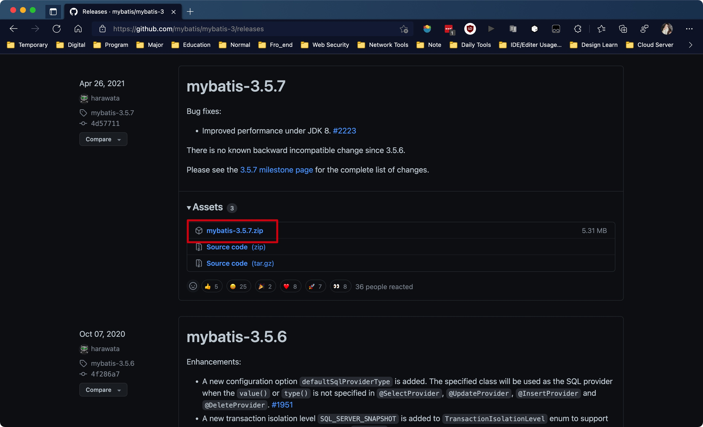


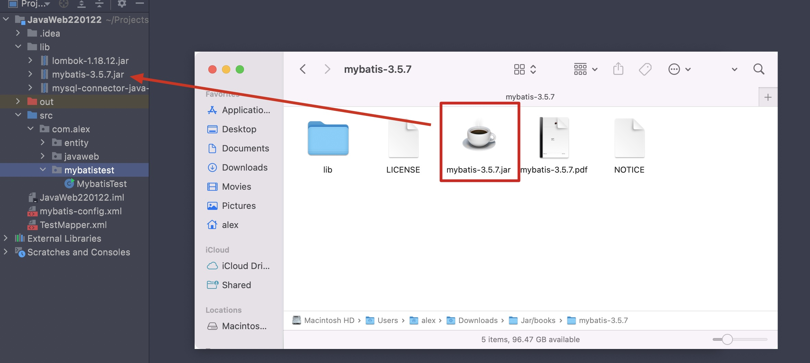


- 通过maven引入

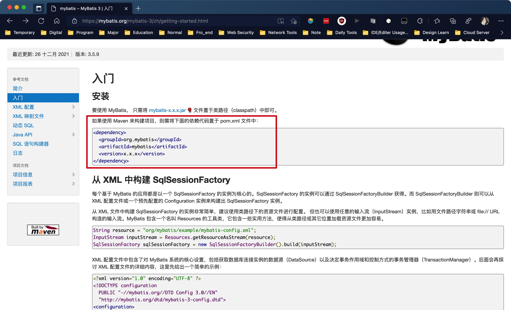

<hr>


# 二、初次使用


步骤:

1. 创建一个mabatis-config.xml作为mybatis的配置文件，在其中填写驱动、url、用户名、密码
2. 调用SqlSessionFactoryBuilder类中的build方法，传入该配置文件的文件输入流对象，返回一个SqlSessionFactory对象，通过该对象调用openSession方法，返回一个SqlSession
3. 创建一个Mapper.xml文件，将其通过url的方式写在mybatis的配置文件中，注意namespace属性对应该映射文件的文件名，id之后需要写在通过SqlSession调用的select方法中，type属性即为我们查询后对应的类所在的路径(需写完整的包路径)，将Mapper写在mybatis配置文件中
4. 创建好对象后，通过SqlSession对象调用select方法，返回对应的对象或者对象集合


## 1) 创建配置文件

- 配置文件参照官网:

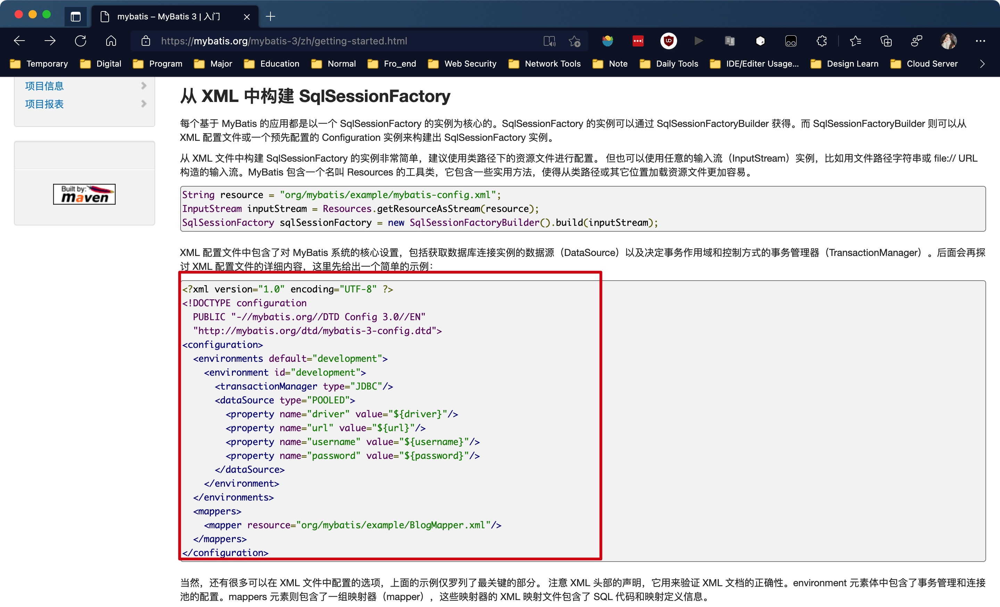


- 填写其中的driver, url, username, password信息，将其中的mapper先暂时删除:

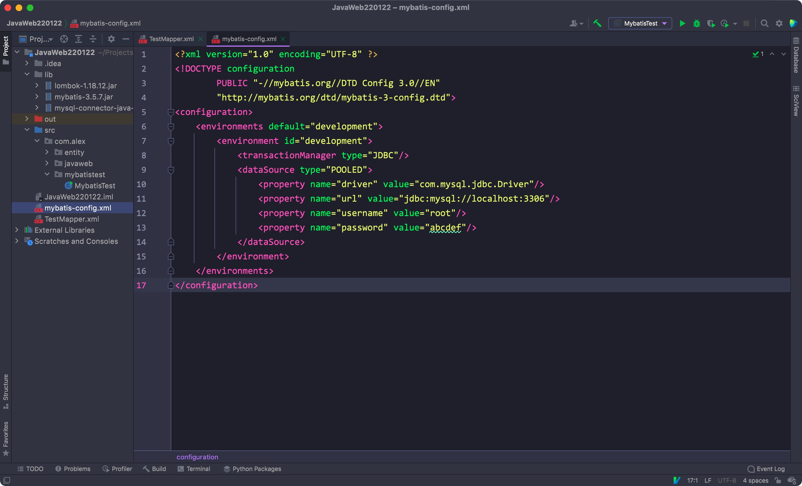


Xml:

```xml
<?xml version="1.0" encoding="UTF-8" ?>
<!DOCTYPE configuration
        PUBLIC "-//mybatis.org//DTD Config 3.0//EN"
        "http://mybatis.org/dtd/mybatis-3-config.dtd">
<configuration>
    <environments default="development">
        <environment id="development">
            <transactionManager type="JDBC"/>
            <dataSource type="POOLED">
                <property name="driver" value="com.mysql.jdbc.Driver"/>
                <property name="url" value="jdbc:mysql://localhost:3306"/>
                <property name="username" value="root"/>
                <property name="password" value="abcdef"/>
            </dataSource>
        </environment>
    </environments>
</configuration>
```


## 2) 获取SqlSession对象

- 创建一个FileInputStream对象给配置文件创建一个输入流
- 创建一个SqlSessionFactoryBuilder匿名对象，调用build方法，传入之前创建的输入流，返回一个SqlSessionFactory对象
- 通过该SqlSessionFactory对象调用openSession方法，返回一个SqlSession对象

```java
public class MybatisTest {
  // 这里使用了lombok注解
  @SneakyThrows(FileNotFoundException.class)
  public static void main(String[] args) {
    FileInputStream mybatisConfigFile = new FileInputStream("mybatis-config.xml");
    SqlSessionFactory sqlSessionFactory = new SqlSessionFactoryBuilder().build(mybatisConfigFile);

    @Cleanup
    SqlSession sqlSession = sqlSessionFactory.openSession();
  }
}
```


## 3) 创建映射文件

- 同样参照官网，创建一个映射文件:

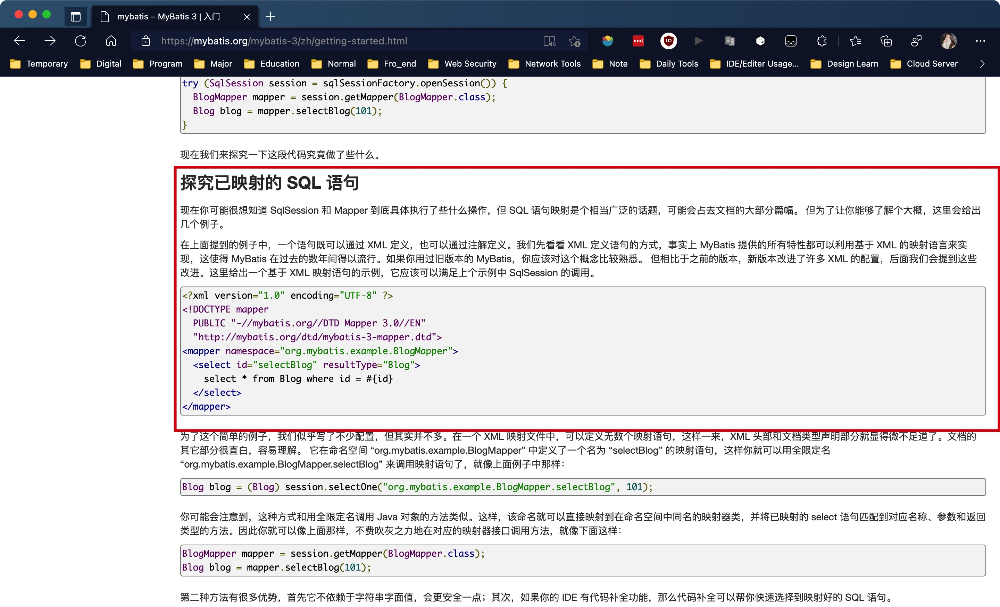


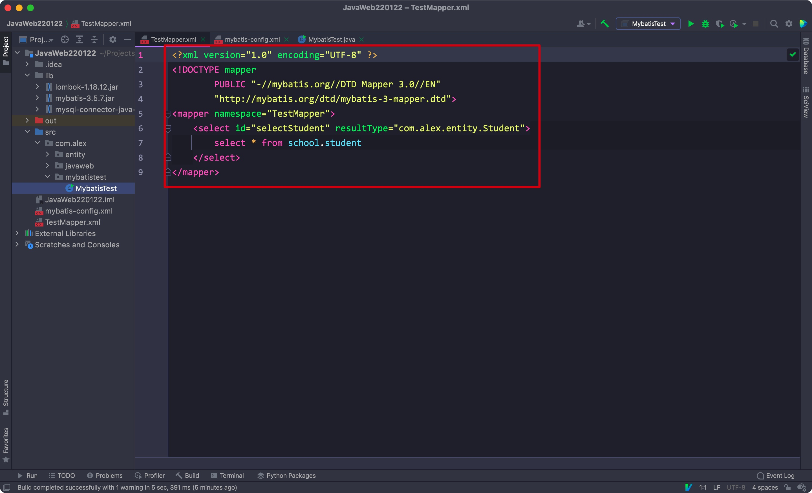

- 注意修改其中的namespace和resultType的内容
- select标签包裹的就是我们自定义的SQL语句


- 最后记得将我们的mapper写在Mybatis配置文件中:

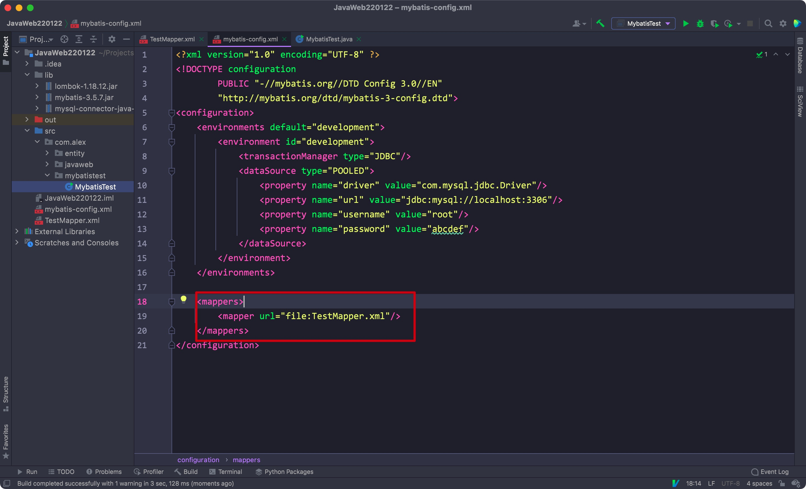

<hr>


## 4) 执行查询/返回对象

- 通过之前获取的SqlSession对象，调用selectList或者selectOne方法(取决于返回的数据行数)，返回对应的对象或者对象集合

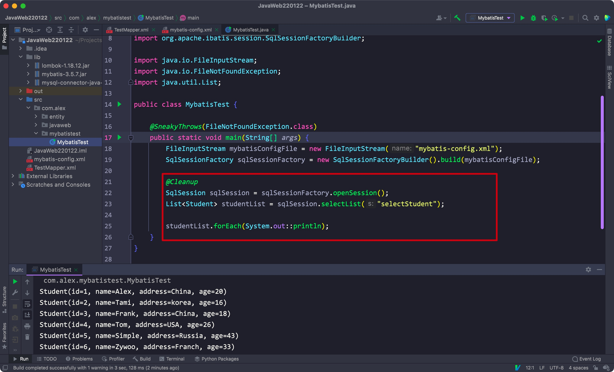

<hr>


# 三、Mybatis简单配置


## 1) 封装/接口映射器

- 首先将创建SqlSession的过程封装为一个方法，创建在MybatisUtil类中:

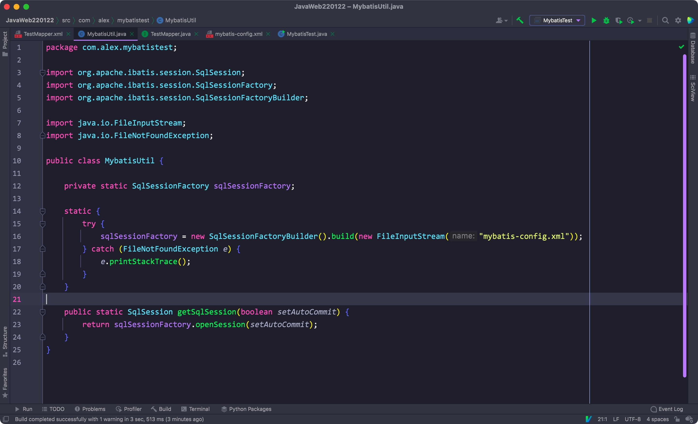

- 因为SqlSessionFactory对象只需要创建一个，所以这里设置为private static
- openSession方法中的boolean参数表示是否开始自动提交


- 使用selectList/selectOne方法的话，返回的类型不确定，需要我们手动转换
- 我们可以创建一个接口与映射器对应起来，只需要将Mapper.xml中的namespace改为接口所在的包名即可
- 注意将接口和mapper.xml放在同一个包下
- 最后将mybatis配置文件中的Mapper路径从url改为resource(注意用/区分包)

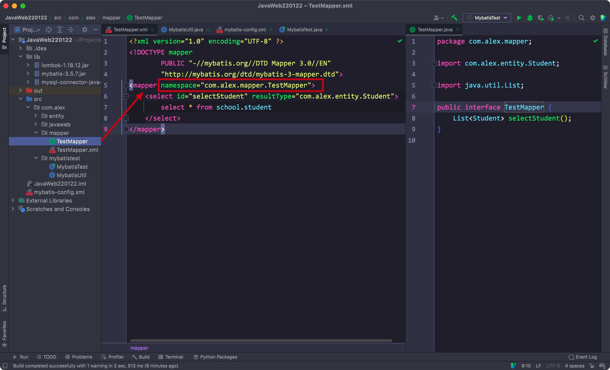


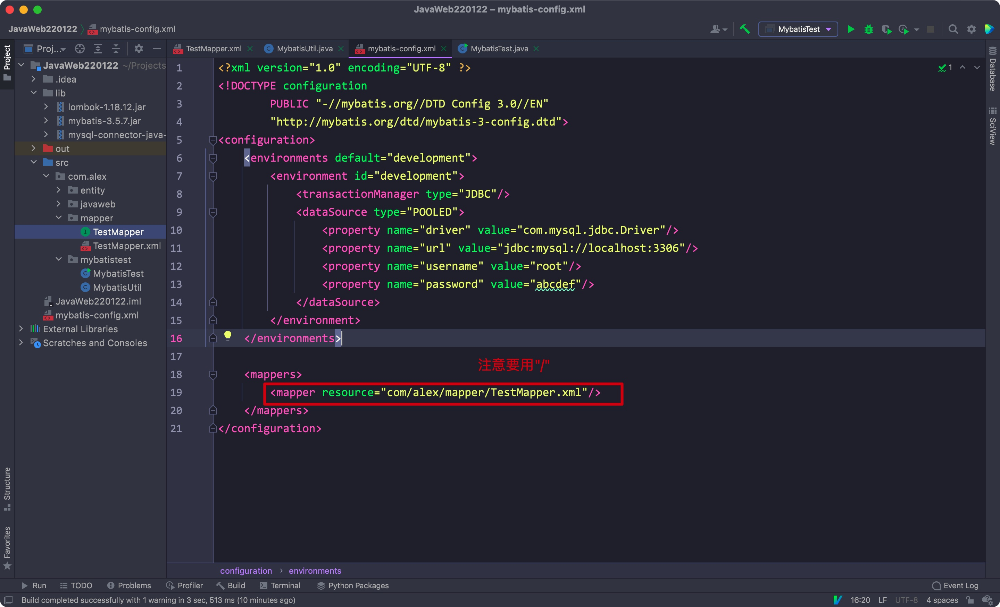


- 设置好后，Mybatis会自动为我们创建的接口动态代理创建一个实现类
- 我们通过sqlSession对象调用getMapper方法，传入该接口，即可返回一个实现类对象
- 通过该实现类对象调用我们在接口中定义的方法即可

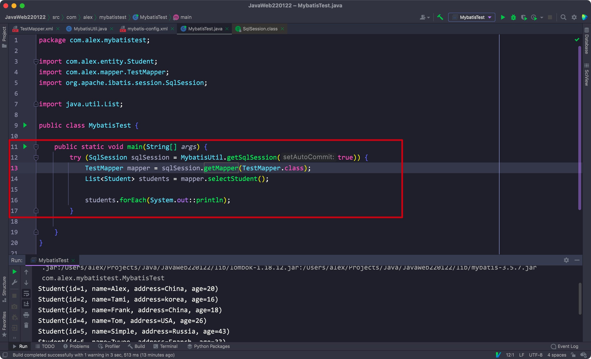


## 2) 简单配置

- 在environments标签里可以有多个environment标签，每个标签通过environment中的id属性来区分
- 我们可以通过SqlSessionFactoryBuilder对象的build方法来指定使用的环境(不同的数据库或者账号)

Eg:

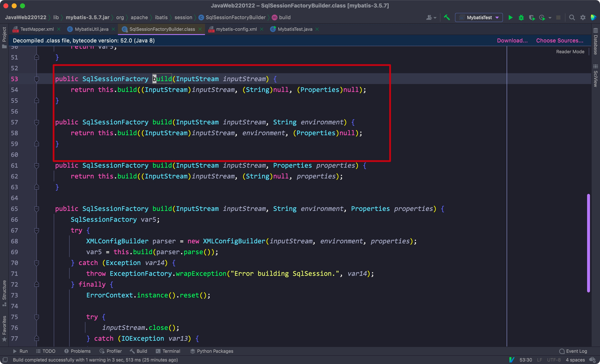


- 配置文件中的标签必须遵循一定的顺序，否则会报错

Eg:

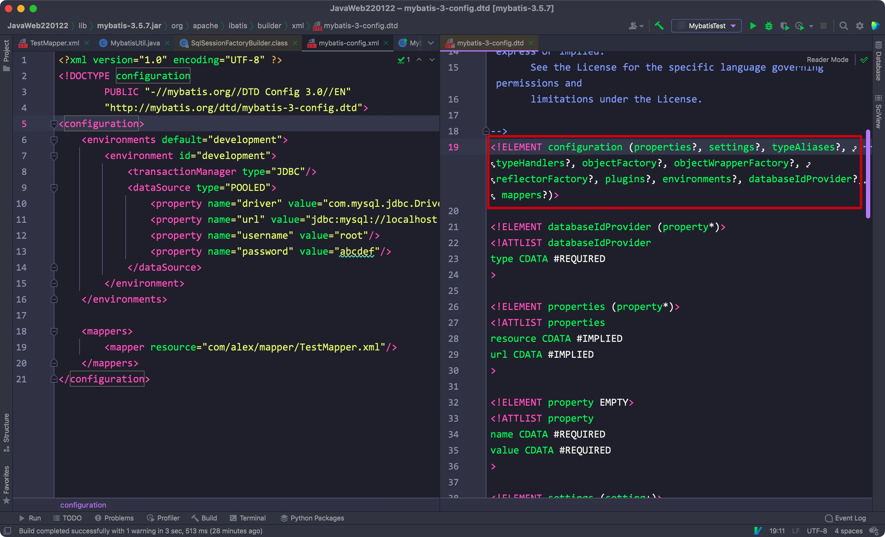


- 通过typeAliases标签，可以为制定包下的类全部取别名(默认为小写)
- 修改后，Mapper中的resultType也要修改

Eg:

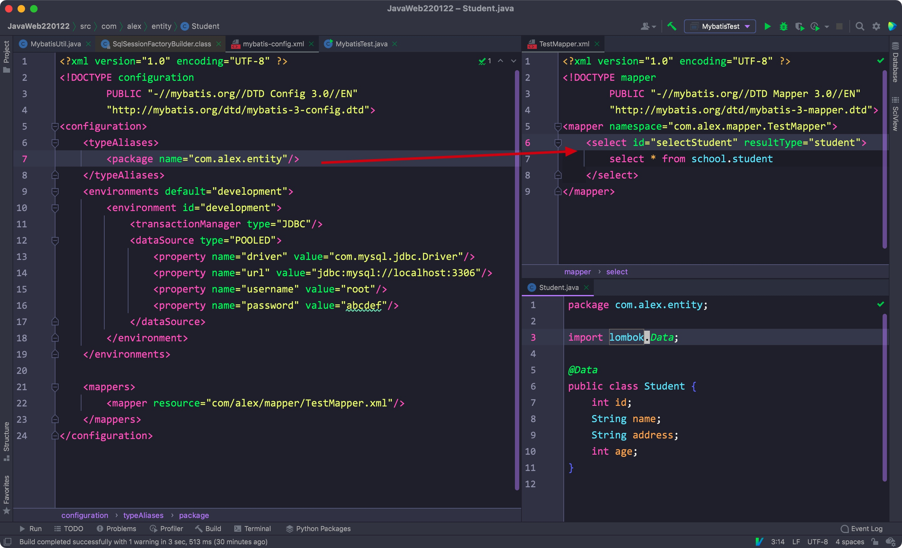


- 如果不想要默认的别名，可以在类上通过Alias注解设置想要的别名

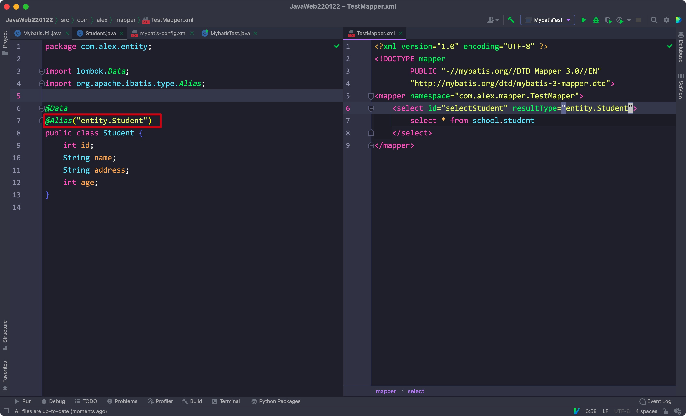


