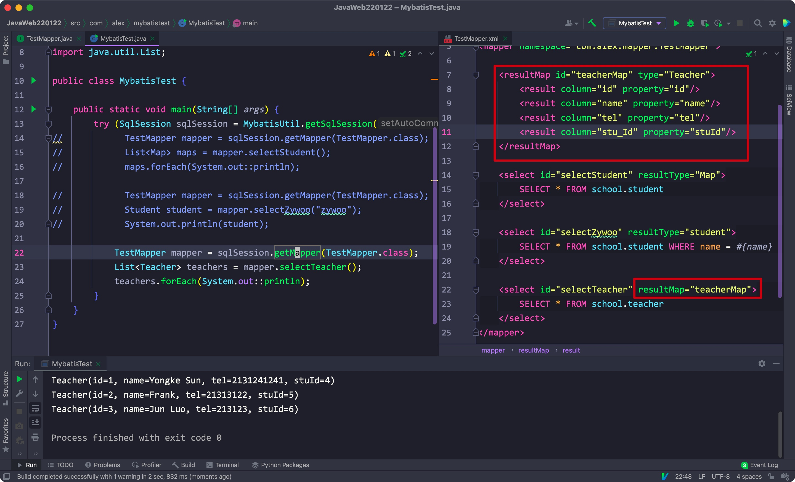
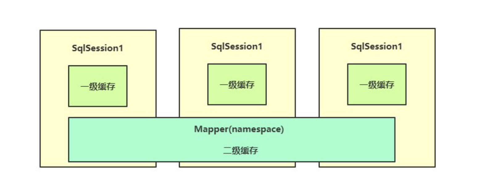
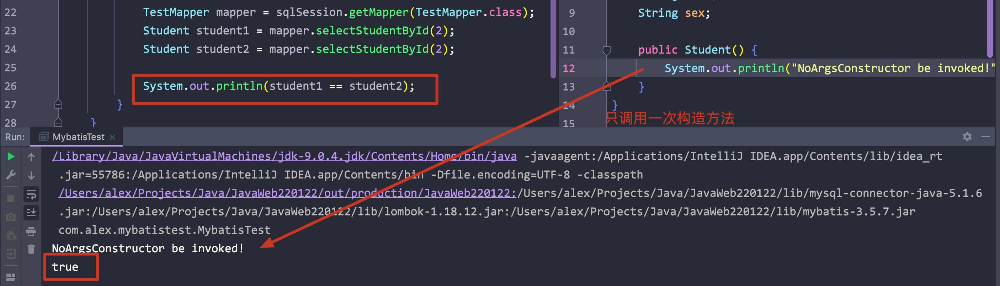

# 一、引入Mybatis

- 官网:

[mybatis – MyBatis 3 | 简介](https://mybatis.org/mybatis-3/zh/index.html)


- 通过jar包引入:


- 通过maven引入


<hr>


# 二、初次使用


步骤:

1. 创建一个mabatis-config.xml作为mybatis的配置文件，在其中填写驱动、url、用户名、密码
2. 调用SqlSessionFactoryBuilder类中的build方法，传入该配置文件的文件输入流对象，返回一个SqlSessionFactory对象，通过该对象调用openSession方法，返回一个SqlSession
3. 创建一个Mapper.xml文件，将其通过url的方式写在mybatis的配置文件中，注意**namespace属性对应该映射文件的文件名**，id。之后需要写在通过SqlSession调用的select方法中，**type属性即为我们查询后映射的类所在的路径或者类对应的别名**(需写完整的包路径)，将Mapper写在mybatis配置文件中
4. 创建好对象后，通过SqlSession对象调用select方法，返回对应的对象或者对象集合


## 1) 创建配置文件

- 配置文件参照官网:


- 填写其中的driver, url, username, password信息，将其中的mapper先暂时删除:


Xml:

```xml
<?xml version="1.0" encoding="UTF-8" ?>
<!DOCTYPE configuration
        PUBLIC "-//mybatis.org//DTD Config 3.0//EN"
        "http://mybatis.org/dtd/mybatis-3-config.dtd">
<configuration>
    <environments default="development">
        <environment id="development">
            <transactionManager type="JDBC"/>
            <dataSource type="POOLED">
                <property name="driver" value="com.mysql.jdbc.Driver"/>
                <property name="url" value="jdbc:mysql://localhost:3306"/>
                <property name="username" value="root"/>
                <property name="password" value="abcdef"/>
            </dataSource>
        </environment>
    </environments>
</configuration>
```


## 2) 获取SqlSession对象

- 创建一个FileInputStream对象给配置文件创建一个输入流
- 创建一个SqlSessionFactoryBuilder匿名对象，调用build方法，传入之前创建的输入流，返回一个SqlSessionFactory对象
- 通过该SqlSessionFactory对象调用openSession方法，返回一个SqlSession对象

```java
public class MybatisTest {
  // 这里使用了lombok注解
  @SneakyThrows(FileNotFoundException.class)
  public static void main(String[] args) {
    FileInputStream mybatisConfigFile = new FileInputStream("mybatis-config.xml");
    SqlSessionFactory sqlSessionFactory = new SqlSessionFactoryBuilder().build(mybatisConfigFile);

    @Cleanup
    SqlSession sqlSession = sqlSessionFactory.openSession();
  }
}
```


## 3) 创建映射文件

- 同样参照官网，创建一个映射文件:


- 注意修改其中的namespace和resultType的内容
- select标签包裹的就是我们自定义的SQL语句


- 最后记得将我们的mapper写在Mybatis配置文件中:


<hr>


## 4) 执行查询/返回对象

- 通过之前获取的SqlSession对象，调用selectList或者selectOne方法(取决于返回的数据行数)，返回对应的对象或者对象集合


<hr>


# 三、Mybatis简单配置


## 1) 封装/接口/映射器

- 首先将创建SqlSession的过程封装为一个方法，创建在MybatisUtil类中:


- 因为SqlSessionFactory对象只需要创建一个，所以这里设置为private static
- openSession方法中的boolean参数表示是否开启自动提交


- 使用selectList/selectOne方法的话，返回的类型不确定，需要我们手动转换
- 我们可以创建一个接口与映射器对应起来，只需要将Mapper.xml中的namespace改为接口所在的包名即可
- 注意将接口和mapper.xml放在同一个包下
- 最后将mybatis配置文件中的Mapper路径从url改为resource(注意用"/"区分包)


- 设置好后，Mybatis会自动为我们创建的接口动态代理创建一个实现类
- 我们**通过sqlSession对象调用getMapper方法，传入该接口**，即可返回一个实现类对象
- 通过该实现类对象调用我们在接口中定义的方法即可


## 2) 简单配置

- 在environments标签里可以有多个environment标签，每个标签通过environment中的id属性来区分
- 我们可以通过SqlSessionFactoryBuilder对象的build方法来指定使用的环境(不同的数据库或者账号)

Eg:


- 配置文件中的标签必须遵循一定的顺序，否则会报错

Eg:


- 通过typeAliases标签，可以为指定包下的类全部取别名(默认为类名全小写)
- 修改后，Mapper中的resultType也要修改为对应的类名

Eg:


- 如果不想要默认的别名，可以在类上通过Alias注解设置想要的别名


- 如果不想指定具体的类名，可以全部改为Map:
    - 将接口中方法对应类型改为Map
    - 将Mapper配置文件中的resultType改为Map

Eg:


<hr>


## 3) 简单CRUD

1. 在Mapper中可以写多个sql语句，不同的sql对应不同的标签(CRUD)
2. 为了让数据库中的a_b字段对应类中的aB驼峰字段，**需要在Mybatis配置文件中添加一个settings字段，将mapUnderscoreToCamelCase属性设置为true**
3. 在mapper中设置好对应的sql后，需要在接口中也写上同名的方法(名字同id)
4. 最后通过接口的实现类直接执行方法即可


Eg:


- 如果需要传入WHERE子句的参数，最好使用#{}，括号中写上对应的字段名称，${}也可以，但其和statement一样会产生sql注入问题


- 如果类中字段和表中的字段不同，需要我们在mapper中设置映射关系





- 如果方法中有显式的构造方法，Mybatis一定会尝试调用一个
- 如果构造方法有多个时，只有当存在满足表中所有字段的构造方法时，才能正常使用
- 如果有多个构造方法，但没有一个符合条件时，会报错:

Eg:


- 对于insert/update/delete，需要使用paramType标签设置Mapper.xml文件


<hr>


## 4) 复杂查询

场景:

一个老师会对应多个学生，现在要查询出每个老师的信息和对应的所有学生的信息


1. 教师类


2. 学生类


3. 对应的表和SQL


SQL:

```mysql
SELECT
	t1.sid,
	t1.name AS 'student_name',
	t1.sex,
	t3.tid,
	t3.name AS 'teacher_name'
FROM
	school.student AS t1
INNER JOIN school.teach AS t2 ON t1.sid = t2.sid
INNER JOIN school.teacher AS t3 ON t2.tid = t3.tid
```


4. 在映射文件中创建对应的select标签，并创建对应的resultMap标签以设置映射关系，在接口中定义方法


- 在教室类中使用collection标签，其中写入学生类各个字段的对应关系，使用ofType属性定义集合中存储的类
- 最后记得在接口中定义同名方法


5. Result


场景2:

查询每个学生和其对应的老师


1. 学生类


2. 映射文件和接口方法


- 使用association标签表示与其关联的其他对象，注意**这里使用javaType属性指定类**


3. Result


## 5) 事务操作

通过SqlSession对象可以调用一下方法控制事务:

- commit(): 提交事务
- rollback(): 回滚事务

<hr>


## 6) 动态SQL

官方链:

[mybatis – MyBatis 3 | 动态 SQL](https://mybatis.org/mybatis-3/zh/dynamic-sql.html)

- 在对应的SQL标签中可以使用一些条件分支标签


### 1. if

- 在test属性中设置触发的条件
- 在标签内写上触发条件后拼接上的SQL


释义:

- 这里我们查询的学生id为2，所以触发了test里的条件，后面拼接上了一段新的SQL，所以将Tami这条记录排除掉了


### 2. Choose

- 其作用类似switch
- 其中when标签类似于case
- otherwise类似default


这里查询的id小于等于3，所以触发了第一个when条件，在后面进一步限制了性别，只保留了Tami

<hr>


## 7) Mybatis的缓存(面试重点)

- Mybatis存在两级缓存，其中一级缓存无法关闭，二级缓存是默认关闭的
- 关系如图:




### 1. L1 Cache

- 每个SqlSession独占一个L1 cache，如果该SqlSession关闭了，那么其对应的L1 cache就会直接清除
- 所以通过同一个SqlSession查询后转换得到的对象是同一个，只在第一次查询时访问数据库并构建对象
- 之后再执行相同的查询时，会直接从缓存中获取对象，所以获取的对象前后是相同的

Eg:




- 在两次相同的查询中，一旦中途修改了数据，那么缓存会直接清除，之后会重新从数据库中查询数据


- 每个SqlSession独占一个L1 cache


### 2. L2 cache

- 在Mybatis配置文件中，在settings标签内设置cacheEnabled为true就能统一控制缓存
- 二级缓存是默认关闭的，需要在Mapper配置文件中设置才行
- 开启后，查询时会先查看L2中是否存在对于的对象，没有的话再去查看L1，最后再去数据库中重新获取
- 注意：**只有一个SqlSession结束后，其在L1 cache的数据才能被写入L2 cache**

Eg:


配置:

在Mapper的cache标签中的配置:

- eviction(清除策略): 
    - FIFO: 先进先出(队列)
    - LRU
- flushInterval: 刷新缓存的时段
- size: 缓存存储的引用数量
- readOnly: 返回的对象是否为只读


- 缓存会带来一致性问题:

运行时，通过其他的MySQL session修改了其中的值，但由于存在缓存，所以会一直读取缓存中的数据，而不是库中修改后的数据


- 通过在某个具体的select/insert/update/delete标签内设置useCache和flushCache属性即可停用缓存，并在每次执行时都更新缓存


<hr>


## 8) 注解开发

- 之前，我们需要创建一个Mapper.xml文件，并将其写在Mybatis的配置文件中，且需要创建一个接口对应其中的CRUD标签
- 使用注解时只需要一个接口类即可，S**QL和字段间的一切对应关系只需要以注解的形式写在接口的方法上即可**，不再需要创建一个mapper.xml文件


- 一对多的关系:


- 如果一条SQL查询需要两个参数，那么需要在SQL中使用注解来指定参数，否则会报错


<hr>


## 9) Mybatis的动态代理机制

### 1. 静态代理


- 静态代理需要对接口的具体实现
- 接口定义行为
- 创建一个类对其实现
- 再创建一个代理类，其接收一个接口的实现类对象
- 最后调用时，**使用代理类对象中的实现类对象执行接口中的方法**


Eg:


### 2. 动态代理

- 让代理类实现InvocationHandler接口，重写其中的invoke方法


代理类:


- Mybatis下binding包里MapperProxy类:


- Mybatis还是属于半自动框架

<hr>
