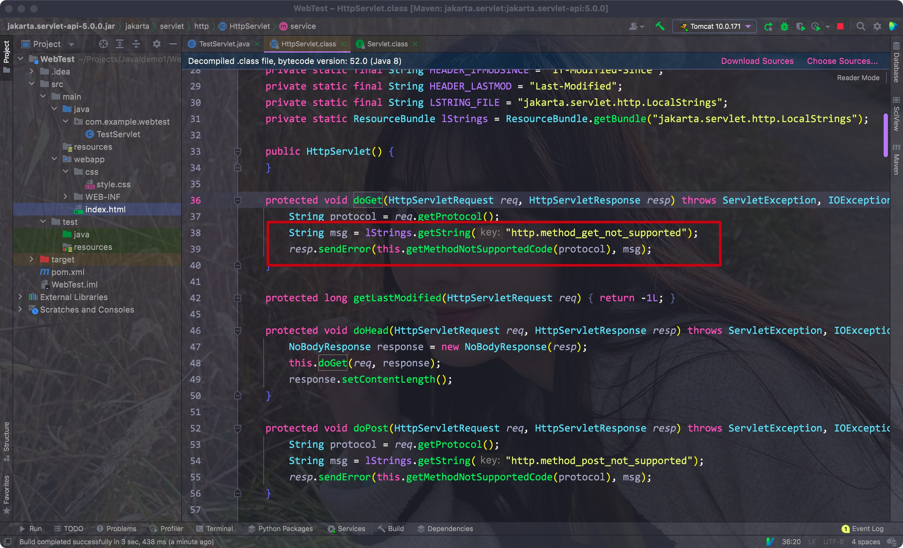
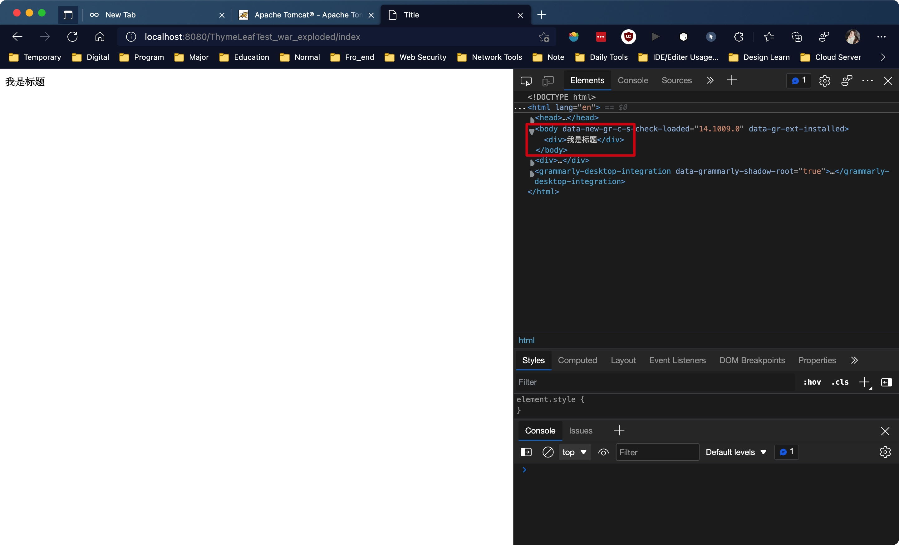

# 一、创建一个Servlet

- Servle是JavaEE的一个标准，编写后可交由web服务器运行(Tomcat)


创建一个类，实现Servlet接口即可，再使用WebServlet注册其访问路径(注册的方式仅限新版)

```java
@WebServlet("/test")
public class TestServlet implements Servlet {
  @Override
  ...
}
```


Eg:


## 1. 注册Servlet的两种方式

- 使用注解是最简单的一种
- 同时也可以使用web.xml文件

Eg:


自定义访问的路径名称:


## 2. 将静态资源放在webapp目录下

- 如果有index.html，项目启动后会自动访问该页面

Eg:


<hr>


# 二、使用HttpServlet


## 1. Servlet的生命周期

- 各个方法的加载步骤:
    - 第一次使用: 构造方法 -> init -> service
    - 之后每次刷新: service
    - 关闭后: destory方法


Servlet下的实现抽象类:

- GenericServlet: 没有重写service方法


HttpServlet: 继承了GenericServlet的一个抽象类，需要我们重写service方法，否则会出现方法不可用的提示

Eg:





- 为了让页面正常访问，我们需要重写doGet方法
- 使用setContentType设置返回的数据类型和编码格式
- 使用getWrite获取一个Writer对象

Eg:

```java
@WebServlet("/test")
public class TestServlet extends HttpServlet {
    @Override
    protected void doGet(HttpServletRequest req, HttpServletResponse resp) throws IOException {
        resp.setContentType("text/html;charset=UTF-8");
        resp.getWriter().print("<h1>Servlet</h1>");
    }
}
```


<hr>


# 三、WebServlet注解

source code

:


- name:
- value: 指定servlet的路径
- urlPatterns: 同value
- loadOnStartup: Servlet的加载顺序


可以使用通配符来指定任意文件类型，或者所有文件都由该Servlet处理

Eg:


通过loadOnStartUp可以指定Servlet的加载优先级(如果为负，则不会在部署前加载)，init方法在部署前就会运行一次

Eg:


<hr>


# 四、POST登陆

- 创建一张user表，创建对应的对象和mapper

Eg:


- 编写登陆页面
- 创建一个form表单，**指定其method和action属性**
- 其中**action属性的值对应处理该表单的Servlet程序的注册路径**
- 注意在input标签内添加对应的name属性值，方便之后从Map中取出

Eg:


- 编写对应的Servlet程序
- 调用HttpServletRequest对象的getParameterMap方法，返回所有的Map键值对
- 通过该Map获取对应的值即可

Eg:


<hr>


# 五、下载文件

- 在前端页面中添加一个a标签作为下载链接
- 修改herf为对应的Servlet程序的注册路径，download标签为用户下载后的文件名

Eg:

```html
<a href="file" download="Irene.jpg">Download File</a>
```


- 创建一个Servlet程序，其注册路径对应a标签中的href属性，**注意重写的是doGet方法**
- 先通过HttpServletResponse对象调用setContentType方法，设置对应的文件类型
- 获取文件的输入流，通过HttpServletResponse对象获取response的输出流
- 通过commons.io工具类中的copy方法将输入流复制到输出流即可


不同文件类型对应的响应头:


Eg:


<hr>


# 六、上传文件


## 1. 前端部分

- 需要创建一个form表单，方法设置为post，action指定对应的Servlet程序路径
- 使用enctype属性，使得文件可以分段传输
- 创建一个file类型的input标签，注意设置其name属性，后面Servlet程序会用到

```html
<form method="post" action="file" enctype="multipart/form-data">
  <div>
    <input type="file" name="upload-file">
  </div>
  <div>
    <button type="submit">上传</button>
  </div>
</form>
```

<hr>


## 2. 后端部分

- 重写doPost方法，与服务端接收文件的路径建立文件输出流
- 通过HttpServletRequest对象调用getPart方法，传入前端设置的input中的name属性值
- 调用apache.commons.io中的copy方法，将输入流复制给输出流
- 注意要在该Servlet程序中添加@MultipartConfig注解后，才能支持文件分段

Eg:

```java
@MultipartConfig
@WebServlet("/file")
public class DownUpLoadFile extends HttpServlet {
    @Override
    protected void doPost(HttpServletRequest req, HttpServletResponse resp) throws ServletException, IOException {
        try(FileOutputStream fileOutputStream = new FileOutputStream("/Users/alex/Desktop/Irene.jpg")) {
            Part part = req.getPart("upload-file");
            IOUtils.copy(part.getInputStream(), fileOutputStream);

            resp.setContentType("text/html;charset=UTF-8");
            resp.getWriter().write("Upload success!");
        }
    }
}
```


Eg:


<hr>


# 七、XHR请求


## 1. 前端

- 在html中加上一个div标签用来表示时间，添加一个按钮用来更新时间
- 将该按钮绑定一个onclick事件，用该事件对应的js文件来更新div中的值
- 需要注意的是，通过Servlet程序返回的数据可以通过XHR对象直接获取

Eg:


HTML:

```html
<div id="time"></div>
<br>
<button onclick="updateTime()">更新数据</button>
<script>
  updateTime()
</script>
```


JS:

```javascript
function updateTime() {
    let xhr = new XMLHttpRequest();
    xhr.onreadystatechange = function () {
        if (xhr.readyState === 4 && xhr.status === 200) {
            document.getElementById("time").innerText = xhr.responseText
        }
    };
    xhr.open('GET', 'time', true);
    xhr.send();
}
```

- 这里通过getElementById函数获取id为"time"的标签对象
- 再调用innerText字段以修改时间，赋值则通过XHR对象的responseText字段值
- 其中open方法中的第二个参数对应Servlet的注册路径


## 2. 后端

- 创建一个Servlet，创建一个SampleDateFormat对象，用来格式化当前的时间并返回为字符串
- 最后通过Writer传出，可使用XHR对象的responseText字段获取它

```java
@WebServlet("/time")
public class TimeServlet extends HttpServlet {
    @Override
    protected void doGet(HttpServletRequest req, HttpServletResponse resp) throws IOException {
        SimpleDateFormat dateFormat = new SimpleDateFormat("yyyy年MM月dd日 HH:mm:ss");
        String date = dateFormat.format(new Date());
        resp.setContentType("text/html;charset=UTF-8");
        resp.getWriter().write(date);
    }
}
```


Eg:


<hr>


# 八、重定向/请求转发


## 1. 重定向

- 重定向可以直接定向到任意URL
- 使用HttpServletResponse对象调用sendRedirect方法，传入需要重定向的Servlet程序对应的注册路径
- 该方法会将响应的状态码设置为302，并在响应头中添加一个Location属性，该属性表明重定向的网址

Eg:

```java
resp.sendRedirect("time");
```


<hr>


## 2. 请求转发

- 请求转发只能进行域内的转发，即仅限当前项目内的Servlet程序
- 通过HttpServletRequest对象调用getRequestDispatcher()方法，参数为转发的Servlet程序对应的注册路径，会返回一个RequestDispatcher对象
- 再通过该RequestDispatcher对象调用forward方法，传入对应的request和response

Eg:

```java
RequestDispatcher dispatcherType = req.getRequestDispatcher("/time");
dispatcherType.forward(req, resp);
```


- 此处的状态码为405，因为LoginServlet重写的方法为doPost，而转发到的TimeServlet只重写了doGet，所以方法不可以用

<hr>


# 九、ServletContext

- Servlet是一个全局的对象，其能够作用在同一项目中的所有Servlet程序中
- 通过getServletContext方法即可获取对应的ServletContext对象
- 通过setAttribute方法可以放置对应的键值对数据到ServletContext对象中，通过getAttribute方法即可根据键或者对应的值

Eg:


- 在Login中，如果登陆成功，我们就通过ServletContext进行请求转发
- 在ServletContextDemo中，我们在init方法内设置了ServletContext对象的属性
- 在doGet方法中将属性作为响应打印到页面中了


## 1. 方法

获取ServletContext对象:

- Servlet getServletContext()

请求转发:

- RequestDispatcher getRequestDispatcher("/servlet_path"): 注意参数字符串为该Servlet的完整注册路径，需要带上"/"
    - 之后还需要使用forward方法完成转发


设置参数:

- void setAttribute(String var1, Object var2)


获取参数:

- Object getAttribute(String var1)
- Enumeration<String> getAttributeNames()


获取资源(限webapp下的资源):

- InputStream getResourceAsStream(String var1)

Eg:


<hr>


# 十、初始化参数


## 1. WebServlet注解

- 通过WebServlet注解，可以设置其initParams属性，其本质为一个WebInitParam注解数组
- 通过注解设置初始化参数即可
- 通过getInitParameter方法可以获取对应的参数value

Eg:

```java
@WebServlet(value = "/servletContext", initParams = {
        @WebInitParam(name = "version", value = "10.01"),
        @WebInitParam(name = "user", value = "Alex")
})
```


Eg:


<hr>


## 2. web.xml配置

同Servlet注册一样，初始化参数也可以跟@WebServlet注解一样在web.xml中设置


- 注意：这里是通过ServletContext对象的getInitParameter方法

Eg:

```xml
<context-param>
    <param-name>lbwnb</param-name>
    <param-value>我是全局初始化参数</param-value>
</context-param>
```


<hr>


# 十一、Cookie

- 为了让用户不会在刷新后重复输入其登陆信息，我们可以在用户第一次访问的时候就为其添加一个Cookie，其中保存用户提交上来的用户名和密码
- 保持的Cookie由client的浏览器统一管理
- 下次再访问页面的时候就根据页面中的Cookie直接登陆即可


## 1. 添加/获取Cookie

- 创建一个Cookie对象，向构造方法中传入一个name和value属性
- 通过HttpServletResponse对象调用addCookie方法传入该cookie对象
- 该cookie可随Request对象传递给其他的Servlet程序


- 接收的Servlet程序通过HttpServletRequest对象，调用getCookies方法获取对应的Cookie对象数组
- 通过遍历该数组可以获取所有的Cookie对象


涉及的方法:


- Cookie类的构造方法

Cookie(String name, String value)


- 向HttpServletRequest对象中添加Cookie对象

void addCookie(Cookie var1)


- 获取请求中的所有Cookie对象

Cookie[] getCookies()


- 获取Cookie对象中的name和value属性

String getName()

String getValue()

<hr>


## 2. Cookie的其他属性

- name
- value
- maxAge: Cookie的过期时间，单位为秒；如果为负数，Cookie为临时Cookie，关闭浏览器后会失效；如果为0，则表明删除Cookie。其默认值为-1
- secure: 表明其是否使用安全协议传输，默认为false
- path: 表明其使用的路径
- domain: 可访问该Cookie的域名
- comment
- version

这些属性都可以在浏览器中查看:


设置属性:

- 设置一个过期时间

void setMaxAge(int expiry)

<hr>


## 3. 实现Cookie自动登陆

- 用户第一次登陆时，只要勾选了记住我多选框，则在响应中添加一个Cookie
- 当用户再次访问登陆页面时，判断其是否有Cookie，有则判断Cookie是否有效，有效则自动登陆，无效则清空Cookie并让用户登陆


### 1) 前端

- 添加一个记住我多选框
- 设置其name属性方便之后Request对象通过getParameterMap方法对应的Map使用containsKey方法判断其是否勾选了记住我

Eg:

```html
记住我
<label>
  <input type="checkbox" name="remember-me">
</label>
```


### 2) 后端

- 在登陆页面的doPost方法中判断其是否勾选了多选框
- 有则在登陆成功后为其创建两个Cookie对应用户名和密码，并设置过期时间
- 将两个Cookie对象添加到Response对象中

Eg:

```java
if (user != null) {
  if (parameterMap.containsKey("remember-me")) {
    Cookie userNameCookie = new Cookie("userName", userName);
    userNameCookie.setMaxAge(20);

    Cookie passwordCookie = new Cookie("password", password);
    passwordCookie.setMaxAge(20);

    resp.addCookie(userNameCookie);
    resp.addCookie(passwordCookie);
  }
  
  ServletContext servletContext = getServletContext();
  servletContext.getRequestDispatcher("/servletContext").forward(req, resp);
}
```


将我们的登陆页面设置为默认的页面:


- 重写doGet方法，判断是否有Cookie
- 有则尝试取出对应的用户信息并尝试验证，通过则直接转发

Eg:

```java
protected void doGet(HttpServletRequest req, HttpServletResponse resp) throws ServletException, IOException {
  Cookie[] cookies = req.getCookies();
  if(cookies != null){
    String username = null;
    String password = null;
    for (Cookie cookie : cookies) {
      if(cookie.getName().equals("userName")) {
        username = cookie.getValue();
      }
      if(cookie.getName().equals("password")) {
        password = cookie.getValue();
      }
    }

    if(username != null && password != null){
      try (SqlSession sqlSession = MybatisUtil.getSqlSession(true)){
        UserMapper mapper = sqlSession.getMapper(UserMapper.class);
        User user = mapper.getUser(username, password);

        if(user != null){
          resp.sendRedirect("time");
          return;
        } else {
          System.out.println("Wrong cookie");
        }
      }
    } else {
      System.out.println("no user info");
    }
  } else {
    System.out.println("No request cookie");
  }
  req.getRequestDispatcher("/").forward(req, resp);
}
```


Eg:


勾选后，可在浏览器里查看到三个值:


可看到，Response中添加了一个Cookie


- 再次刷新，Cookie被保存在了Request中

Eg:


- 再次访问login页面，我们的cookie就起作用了

Eg:


<hr>


# 十二、Session

目前我们只用上了Cookie来自动登录，但问题是，我们现在无法控制用户对页面的访问

现在用户不需要登录也可以访问我们的页面，这样显然不行，所以需要我们能够辨别哪些是已经登陆的用户

为了解决这个问题，我们需要使用Session

为了确保唯一性，会先给浏览器生成一个随机的Cookie，其名为JSESSIONID，该值是随机的

通过该Cookie值生成一个唯一的Session，这样就能根据Session判断哪些用户登录了，那些用户没有登录


## 后端

- 在首次访问的时候，Web Server就会为用户创建一个唯一的Session对象，可以通过Request调用getSession方法获取它
- 我们只需要使用该HttpSession对象存储对应的数据即可，之后访问其他页面时，只需要判断其Session中的数据是否正确即可


- 在Login中，对登录成功的用户设置Session值

```java
HttpSession session = req.getSession();
session.setAttribute("user", user);
```


在重定向的Servlet中判断其Session对应的用户是否已经登陆，未登陆则转向登陆页面

```java
User user = (User) session.getAttribute("user");
if (user == null) {
  System.out.println("Session wrong");
  session.invalidate();
  return false;
}

return true;


resp.sendRedirect("login");
```


<hr>


# 十三、Filter

- 按照之前Session的使用逻辑，我们在每个Servlet程序前对用户的Session值进行判断，从而达到明确是否为登陆用户的功能
- Filter可以一次性过滤访问指定路径Servlet的请求，对这些请求做统一的判断


创建一个Filter:

- 创建一个实现Filter接口的类，重写其中的doFilter方法
- 使用@WebFilter注解注册Filter过滤的路径

Eg:

```java
@WebFilter("/*")
public class FilterTest1 implements Filter {
    @Override
    public void doFilter(ServletRequest servletRequest, ServletResponse servletResponse, FilterChain filterChain) throws IOException, ServletException {
        HttpServletRequest httpServletRequest = (HttpServletRequest) servletRequest;
        System.out.println(httpServletRequest.getRequestURL());
    }
}
```


此时Filter将所有请求都拦截了

**放行的话需要通过FilterChain对象调用doFilter方法**，传入ServletRequest和ServletResponse对象

```java
filterChain.doFilter(servletRequest, servletResponse);
```

- 该方法会将请求传给下一个Filter，如果没有下一个Filter了，则直接放行至Servlet和Web资源
- 过滤器的过滤顺序是按照过滤器的类名排序进行的
- Filter返回Response的顺序类似递归


- 实际使用:

和Servlet一样，我们日常使用的方法不是实现接口，而是继承对应的Http抽象类


1. 继承HttpFilter类
2. 通过获取请求的URL，判断其申请的是否为一个静态资源
3. 是则放行，不是则检查其Session判断是否登陆
4. 未登陆则直接重定向

Eg:

```java
@WebFilter("/*")
public class SessionFilter extends HttpFilter {
    @Override
    protected void doFilter(HttpServletRequest req, HttpServletResponse res, FilterChain chain) throws IOException, ServletException {
        String requestURL = req.getRequestURL().toString();

        if (!requestURL.endsWith(".js") && !requestURL.endsWith(".css")) {
            HttpSession session = req.getSession();

            User user = (User) session.getAttribute("user");
            if (user == null && requestURL.endsWith("login")) {
                res.sendRedirect("login");
                return;
            }
        }

        chain.doFilter(req, res);
    }
}
```


<hr>


# 十四、Lisener

- 监听器有很多种，其能够监听对应类的创建与销毁，以及在对应类上对属性/值的修改

分类:


Eg:

监听Session的创建


<hr>


# 十五、JSP加载原理

通过IDEA创建一个新项目:


- 其中<%= %>可以将对应的Java内容转变为HTML的标签内容
- <% %>中可以直接编写Java Code

Eg:


JSP在编写的时候一定程度上提供了便利，但其不便于维护，先后端耦合度太高，开发者的指责不明确


本质上，Tomcat在加载JSP页面时，会将.jsp动态转换为java类，并编译为.class进行加载，其生成的Java类其实就是Servlet的子类

其会直接将JSP页面内的内容全部编译为字符串后输出，所以JSP本质上还是一个Servlet！

<hr>


# 十六、Thymeleaf


## 1) 初入

- Thymeleaf是一个Java模版引擎，既实现了JSP的模版，也兼顾了前后端分离


IDEA创建:


- 首先需要在resource目录下创建一个html文件，其中需要在html标签内添加xmlns:th="http://www.thymeleaf.org"，以引入Thymeleaf的标签属性

Eg:

```html
<!DOCTYPE html>
<html lang="en" xmlns:th="http://www.thymeleaf.org">
<head>
    <meta charset="UTF-8">
    <title>Title</title>
</head>
<body>
    <div th:text="${title}"></div>
</body>
</html>
```


之后我们需要编写一个Servlet作为默认页面(注意修改javax为jakarta)

Eg:

```java
@WebServlet("/index")
public class HelloServlet extends HttpServlet {

    TemplateEngine engine;
    @Override
    public void init() throws ServletException {
        engine = new TemplateEngine();
        ClassLoaderTemplateResolver r = new ClassLoaderTemplateResolver();
        engine.setTemplateResolver(r);
    }

    @Override
    protected void doGet(HttpServletRequest req, HttpServletResponse resp) throws ServletException, IOException {
        Context context = new Context();
        context.setVariable("title", "我是标题");
        engine.process("test.html", context, resp.getWriter());
    }
}
```


页面:




- 在Servlet中，我们通过org.thymeleaf.context.Context这个对象，调用了setVariable方法，将test.html中对应的title修改为了我们所需的文本
- 最后使用我们获取的模版引擎对象对页面进行了处理

<hr>


## 2) 语法基础

后端部分:

```java
@WebServlet("/index")
public class HelloServlet extends HttpServlet {

    TemplateEngine engine;
    @Override
    public void init() throws ServletException {
        engine = new TemplateEngine();
        ClassLoaderTemplateResolver r = new ClassLoaderTemplateResolver();
        engine.setTemplateResolver(r);
    }

    @Override
    protected void doGet(HttpServletRequest req, HttpServletResponse resp) throws ServletException, IOException {
        Context context = new Context();
        context.setVariable("title", "我是标题");
        engine.process("test.html", context, resp.getWriter());
    }
}
```

我们需要先创建一个模版引擎对象: TemplateEngine，我们需要使用该对象将模版文件渲染为HTML文件

使用前还需要为该引擎设置一个模版解析器，其决定了从哪里获取模版文件，ClassLoaderTemplateResovler表示加载内部文件

获取该模版对象后，我们就能一直使用了，解析为HTML的过程:

```java
 @Override
    protected void doGet(HttpServletRequest req, HttpServletResponse resp) throws ServletException, IOException {
        Context context = new Context();
        context.setVariable("title", "我是标题");
        engine.process("test.html", context, resp.getWriter());
    }
}
```

1. 创建上下文，其中包含所有需要替换的内容
2. 通过setVariable方法将对应内容进行替换
3. 最后使用process进行解析即可


- 为普通标签添加内容:

```html
<div th:text="${title}"></div>
```

th:text表示为当前标签指定内部的文本


- 如果想要传入链接，则需要使用th:utext:

```html
<div th:utext="${title}"></div>
```


- 传入的属性其实是一个字符串对象引用，所以可以调用该字符串对象对应的方法

```html
<div th:text="${title.toUpperCase()}"></div>
```


- th:还可以拼接标签的属性，而属性的值可以让后端通过Context对象替换

```java
@Override
protected void doGet(HttpServletRequest req, HttpServletResponse resp) throws ServletException, IOException {
    Context context = new Context();
    context.setVariable("url", "http://n.sinaimg.cn/sinakd20121/600/w1920h1080/20210727/a700-adf8480ff24057e04527bdfea789e788.jpg");
  	context.setVariable("alt", "图片就是加载不出来啊");
    engine.process("test.html", context, resp.getWriter());
}
```

```html
<!DOCTYPE html>
<html lang="en" xmlns:th="http://www.thymeleaf.org">
<head>
    <meta charset="UTF-8">
    <title>Title</title>
</head>
<body>
    
</body>
</html>
```


- 同样的，我们还可以在其中使用运算(算术/三元)
- 多个属性间还可以使用 + 进行拼接，其中的字符串需要使用单引号

Eg:

```html
<div th:text="${name}+' 我是文本 '+${value}"></div>
```

<hr>


## 3) 流程控制语句


### 1. If


- 使用th:if标签
- 同样使用Context对象调用setVariable方法替换标签中的值(只能传入boolean值或者NULL)
- 如果设置为true，则会显示该标签，否则不显示该标签


具体的判断规则:

- 如果值不是空的：

    - 如果值是布尔值并且为`true`。
    - 如果值是一个数字，并且是非零
    - 如果值是一个字符，并且是非'0'
    - 如果值是一个字符串，而不是“错误”、“关闭”或“否”
    - 如果值不是布尔值、数字、字符或字符串。

    以上返回为true，会显示该标签

- 如果值为空，th:if将计算为false

Eg:


传入为null，所以默认为false，该标签不会显示


- th:unless与th:if相反

<hr>


### 2. switch

- th:switch
- th:case
- th:default


<hr>


### 3. list


遍历操作

- th:each
    - 其中填写"元素名称 : ${列表变量名称}"即可，通过元素名称即可获取对应的值
    - 注意需要写在li标签内

syntax:

```html
<ul>
  <li th:each="element : ${listName}" th:text="${element}"></li>
</ul>
```


Eg:


获取迭代状态:

- 在元素后面添加iterStat即可，之后通过该iterStat获取对应的字段:

    - 当前*迭代索引*，以0开头。这是`index`属性。

    - 当前*迭代索引*，以1开头。这是`count`属性。

    - 迭代变量中的元素总量。这是`size`属性。

    - 每个迭代的*迭代变量*。这是`current`属性。

    - 当前迭代是偶数还是奇数。这些是`even/odd`布尔属性。

    - 当前迭代是否是第一个迭代。这是`first`布尔属性。

    - 当前迭代是否是最后一个迭代。这是`last`布尔属性。

Eg:


<hr>


## 4) 页面模版

在一些页面进行跳转的时候，多个页面间可能会有重复的部分，以前我们需要将重复的部分CV到不同的页面，这时候会出现大量的冗余代码，所以引入了Thymeleaf模版


- 在使用模版前，我们需要在每个html页面中写重复的内容:


- 两个html中有重复的部分


- 我们需要先将重复的部分放在一个html中，并在对应的标签内设置对应的属性

Eg:

```html
<!DOCTYPE html>
<html xmlns:th="http://www.thymeleaf.org" lang="en">
<body>
    <div class="head" th:fragment="head-title">
        <div>
            <h1>我是标题内容，每个页面都有</h1>
        </div>
        <hr>
    </div>
</body>
</html>
```


之后将重复的部分通对应的fragment名称写在需要使用的页面上即可:

```html
<div th:include="head.html::head-title"></div>
```


Eg:


我们可以使用th:insert、th:replace、th:include三种方法，三种的区别:

- th:insert 直接用div片段插入相应位置的标签
- th:replace 直接将对应的标签整体进行替换
- th:include 同insert，但原模版位置的外标签属性等不会保留


不同的页面还可以定制模版内的属性值

- 我们在模版页面中添加一个h2标题，其中的内容由每个页面自己决定


模版页面:

```html
<div class="head" th:fragment="head-title(sub)">
    <div>
        <h1>我是标题内容，每个页面都有</h1>
        <h2 th:text="${sub}"></h2>
    </div>
    <hr>
</div>
```


调用页面:

```html
<div th:include="head.html::head-title('这个是第1个页面的二级标题')"></div>
<div class="body">
    <ul>
        <li th:each="title, iterStat : ${list}" th:text="${iterStat.index}+'.《'+${title}+'》'"></li>
    </ul>
</div>
```


Eg:


