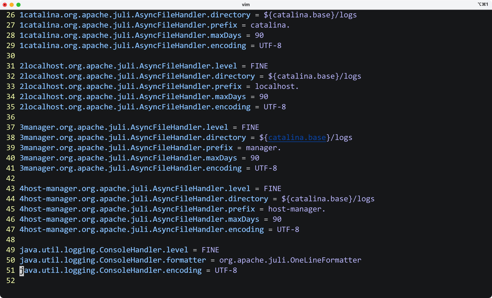

# 一、初入

- Tomcat服务器为我们抽象了所有的HTTP操作
- 示例版本:9.0.53

官网下载压缩包:

[Apache Tomcat® - Welcome!](https://tomcat.apache.org/)


启动bin目录下的start.sh开启服务器，启动同目录下的shutdown.sh关闭服务器

在浏览器地址栏输入http://localhost:8080，即可访问

Eg:


修改conf目录下的logging.properties文件就可以修改服务器的字符编码

Eg:




<hr>


# 二、在IDEA中创建web项目

- 选择JavaEE


- Tomcat10及以上版本较新，需要在pom文件中将javax包改为jakarta

```xml
<dependency>
    <groupId>jakarta.servlet</groupId>
    <artifactId>jakarta.servlet-api</artifactId>
    <version>5.0.0</version>
    <scope>provided</scope>
</dependency>
```

offical:


Eg:


- Mac OS下启动Tomcat发生权限问题:

进入bin目录，给*.sh设置权限即可

```shell
chmod 777 *.sh
```

<hr>

