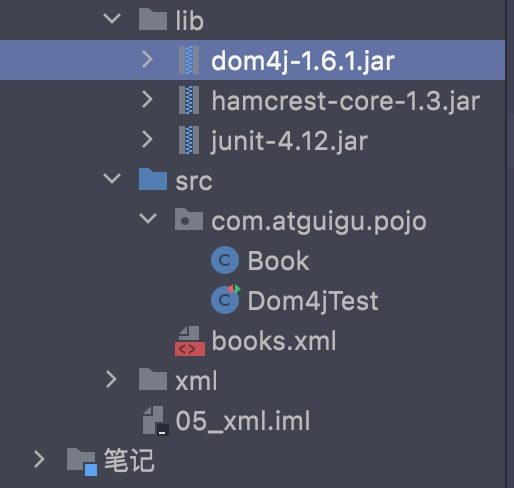

# 一、简介

- XML是可扩展的标记性语言


作用:

- 保存数据，数据具有自我描述性
- 可以作为项目/模块的配置文件
- 可以作为网络传输的格式(现在以JSON为主)


描述对象:

```xml
<students>
  <student>
    <id>1</id>
    <name>alex</name>
  </student>
  <student>
    <id>2</id>
    <name>john</name>
  </student>
</students>
```

<hr>


# 二、语法


- 注释与HTML一致
- 元素: 从开始标签到结束标签的部分
- 命名:
    - 名称不含空格
- XML大小写敏感
- XML的属性和HTML类似
- XML中元素都必须关闭
- XML中必须有一个唯一的根元素(没有父标签的元素，必须唯一)
- CDATA: 在CDATA中的内容不会被解析:

```xml
<![CDATA[content]]>
```

<hr>


# 三、XML解析技术

- HTML和XML都是标记型语言，都可以使用DOM技术来解析


早期的解析技术:

- DOM: 由W3C组织制定，所有语言都对该解析技术进行了实现
- SAX(simple api for xml过时): 它一行一行的读取xml文件，相比DOM，不会创建大量的dom对象，因此在内存和性能上更优


第三方解析:

- jdom: 在dom的基础上进行了封装
- dom4j: 对jdom进行了封装(重点)
- pull: 主要用于Android开发，和sax类似

****


# 四、dom4j

- 它不是sun的技术，属于第三方公司，需要在dom4j官网下载对应的jar包


## 4.1 dom4j的使用


目录:

- docs: 文档
- lib: 依赖jar
- src: 源码


1. 在项目中导入dom4j的jar包




2. 根据xml文件创建对应的类


3. 创建一个saxReader对象

通过saxReader的read对象读取xml文件，生成document对象


## 4.2 将XML中的数据转换为java对象


<hr>


# 五、jdk原始解析

- 使用jdk自带的org.w3c包下的内容即可(同Mybatis)


