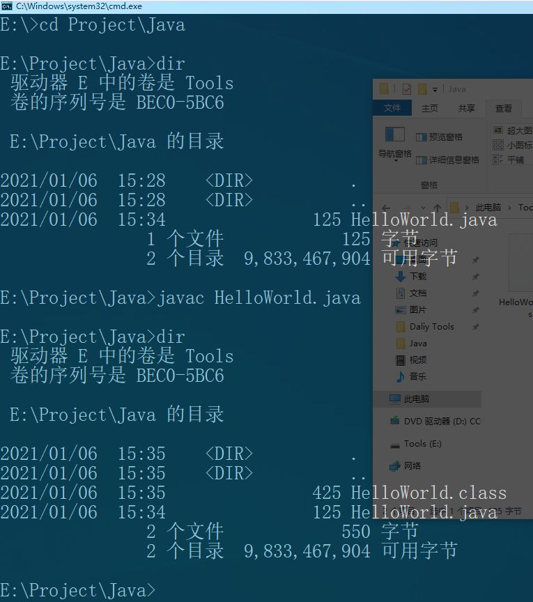
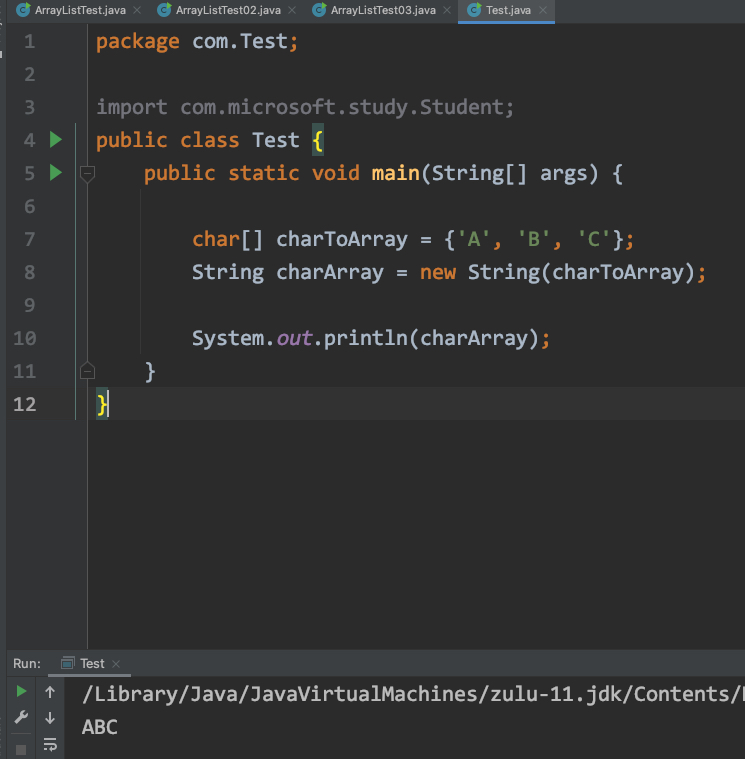
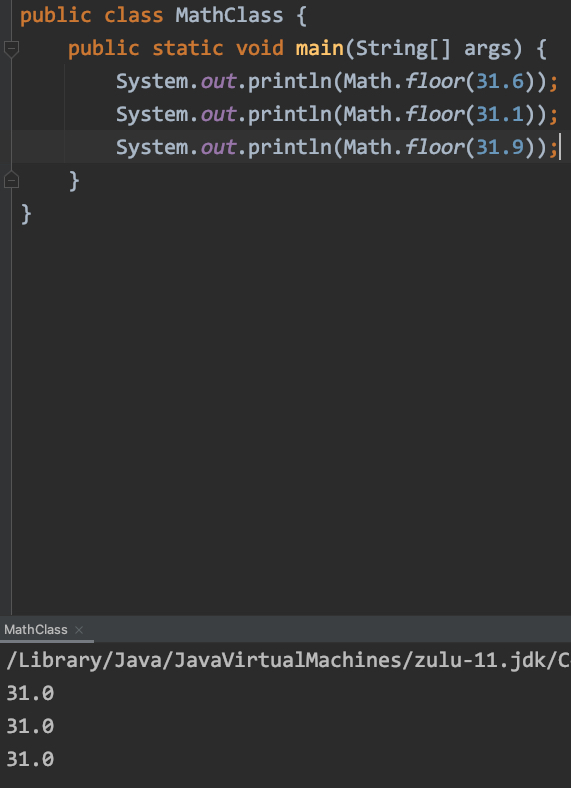
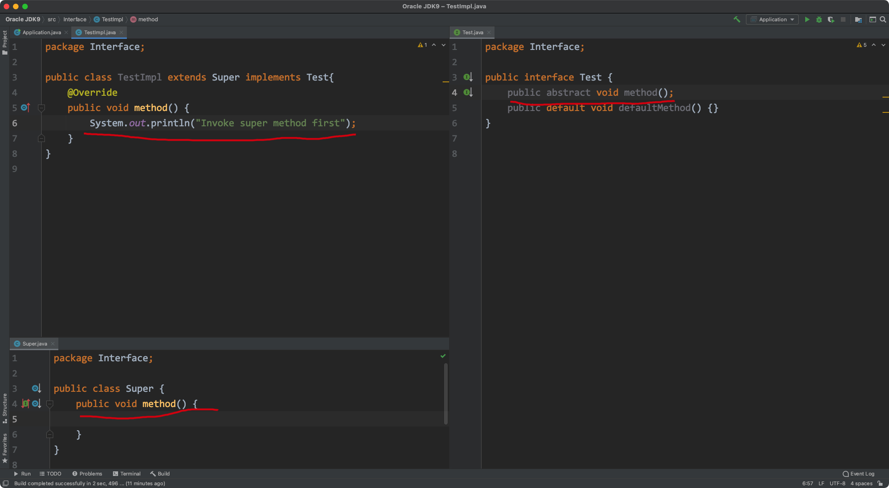
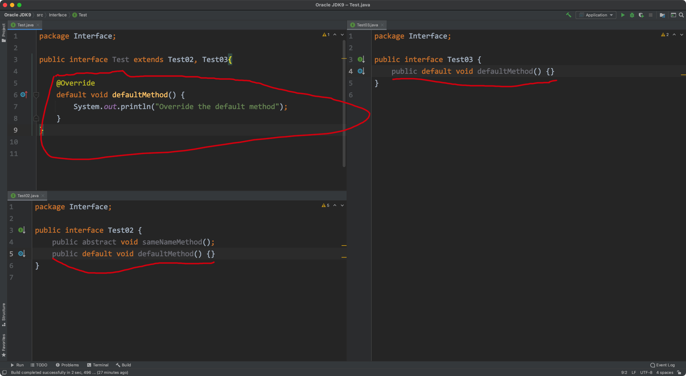
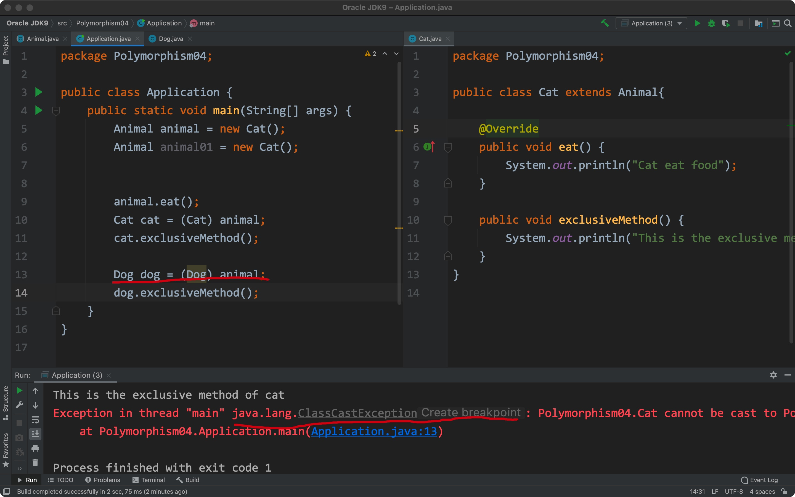
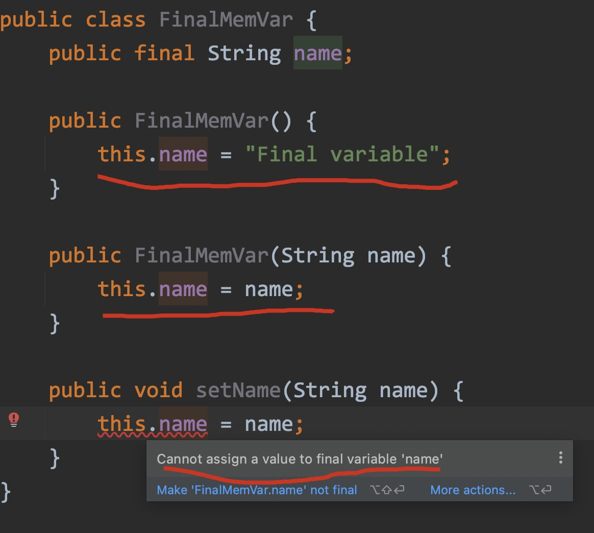

# 1.Installation of Java (Win10 ver.)


## 1) Download jdk from official website

LINK:https://www.oracle.com/cn/java/technologies/javase/javase9-archive-downloads.html

ARM64:https://www.azul.com/downloads/zulu-community/


## 2) configuration of Java

Double click to install, but don't choose public jre.


configure system environment


%JAVA_HOME% can convert to directory "E:\Dev-Tools\Java\9.0.4" auto.


check status

```shell
java -version
```


****

# 2.First program in win10


## 1) edit a java source file


create a java file in Windows10


**code**

```java
public class HelloWorld {
    public static void main(String[] args) {
        System.out.println("Hello World");
    }
}
```


## 2) Compile source file by cmd


open cmd:

1.win+r

2.type 'cmd' and press enter

3.change to correct directory 

4.use command 'javac' to compile java source file than get a .class file





## 3) Run .class file


Don't use ".class" postfix

```shell
java HelloWorld
```


Result:


****

# 3.Explanation for first program


source code:

```java
pulic class HelloWorld {
    public static void main {
        System.out.println("HelloWorld");
    }
}
```


first row:

public class classname


comment:classname must match the filename.


second row:

public static void main(String[] args) 


comment: a const content


third row:

System.out.println("HelloWorld");


comment:output content in " ".

****


# 4.Name


## 1) class name


UpperCamelCase name method


exam:

```java
HelloWorld
AnimalType
```


## 2) variable/method/parameter name


lowerCamelCase name method


exam:

```java
accountBalance
nextDate
```


## 3) constant name


Upper name


exam:

```java
LISTNUMBER
```

****


# 5.Output


## 1.constant output

### 1) integer


```java
System.out.println(int_num);
```


exam:


### 2) floating-point


```java
System.out.println(float_num);
```


exam:


### 3) character


```java
System.out.println('character');
```


character must be a single character in ' '


exam:


special:

inside the  ' '  can't be null


exam:


### 4) string


```java
System.out.println("random string");
```


exam:


### 5) boolean


```java
System.out.println(true/false);
```


exam:


## 2. variable output


### 1) integer


```java
int testNum = 24;
long testNum4 = 3124L;
System.out.println(testNum4);
System.out.println(testNum);
```


exam:


### 2) float-point


```java
float testNum = 231.3124F;
double testNum4 = 312312.4124124;
System.out.println(testNum4);
System.out.println(testNum);
```


exam:


### 3) left


```java
char outPutTest = 'H';
boolean boolTest = true;
System.out.println(outPutTest);
System.out.println(boolTest);
```


exam:

****


# 6.Primitive types


**Attention**

1. String **not** a basic type.
2. Float-type is a **probably** value, not a accuracy value.
3. Data range is **not 100% relate** to type, for example, float is wider than long, but float is 4 bytes, long is 8 bytes.
4. A float-type data is a **double by default**, use float need to add a F to express a float data.
5. A integer data is a **int by default**, use long need to add a L to express a long data.
6. Basic type haven't address value, so can use to generics


exam:

```java
float sumNumber = 123.241794719F
long countNumber = 123424214L;
```


## 1) integer


| keyword | byte |    range     |
| :-----: | :--: | :----------: |
|  byte   |  1   |   -128~127   |
|  short  |  2   | -32768~32767 |
|   int   |  4   | -2^31~2^31-1 |
|  long   |  8   |     ...      |


## 2) float


| keyword | byte |
| :-----: | :--: |
|  float  |  4   |
| double  |  8   |


## 3) left


| keyword | byte |    range    |
| :-----: | :--: | :---------: |
|  char   |  2   |   0-65535   |
| boolean |  1   | true, false |

****


# 7.Type conversion


## 1) auto type convert


**Attention**

1. Apply only From **small to big**, byte -> short -> int -> long.
2. Just happen **between different type data**, and don't need special analyze.(**Implicit**)
3. Between smaller type constant/variable and greater type constant/variable in arithmetic, result is the greater one type.


### 1. same type

```java
long autoIntConvertTest = 10000;        // default by int
double autoFloConvertTest = 231.241F;   // default by double

System.out.println(autoIntConvertTest);
System.out.println(autoFloConvertTest); 
```


exam:


### 2. different type

```java
float autoIntToFlo = 123241L;		// The range of float is greater than long

System.out.println(autoIntToFlo);
```


exam:


## 2) force type convert


**Attention**

1. Need a special process and special format.
2. Format: smallerType variable = (smallerType)greaterTypeVariable/constant


**Special notice**

1. Don't comment to use.	// maybe happen overflow/lose precision
2. byte/short/char can be use to arithmetic.
3. byte/short/char will be convert to int-type when be used to arithmetic.     // plus, minus, etc.
4. boolean-type can't be use to force type convert.


### 1. overflow


long -> int


```java
long longToInt = 8000000000L;
int resultInt = (int)longToInt;     // The range of longToInt is greater than resultInt, overflow happened.

System.out.println(resultInt);
```


exam:


### 2. lose precision


float-point -> integer


```java
float floatSource = 213124.98492F;
int floatToInt = (int)floatSource;           // From float to int, decimal part will be abandon.

System.out.println(floatToInt);
```


exam:


### 3. left


byte/short/char will convert to int in arithmetic.


```java
char charInAri = 'A';
int charToInt = charInAri + 1;      // char-type will be converted to int in arithmetic.

System.out.println(charToInt);
System.out.println((char)charToInt);
```


exam:


**Same principles for byte/short**


### 4. constant optimize


**Attention**

1. Only for constant, can't contain any variables.
2. It's a implicit process by compiler.


```java
short intToshort1 = 100;     // the value on right is under the range of left
        
System.out.println(intToshort1);
```


exam:


```java
byte intToByte = 128;     // the value on right is greater the range of left
        
System.out.println(intToByte);
```


exam:


```java
byte intToByte = 1;     
short intToShort = 2;
byte intToByte1 = intToByte + intToShort1;
/**
* can't use int-type variable, but can use int-type constant.
*/
System.out.println(intToByte1);
```

- intoToByte and intToShort were be conversed to into type


exam:


```java
byte intToByte = 1 + 2;
/**
* Compiler will convert int-type to byte-type auto.
*/
System.out.println(intToByte);
```


exam:


****


# 8.String-type

**String-type is a kind of quote type, so it have address value**

**The String class belong java.lang package, so don't need to import**

**String will store data as a character table(each character is belong "char" type)**


## 1) with plus operator


**Attention**

1. Plus between two Strings means concatenate two string.
2. Plus between a String value and any other type value, the other type value will be convert to string type.


### 1. concatenate between two string values.


```java
String testStr1 = "A test ";
String testStr2 = "statement.";

System.out.println(testStr1 + testStr2);        // plus operator will be regard a concatenate sign.
```


exam:


### 2. concatenate with other type value.


```java
String testStr1 = "A test ";
int testInt1 = 10;
int testInt2 = 20;

/*
	other type with string by plus will be convert to string type.
*/
System.out.println(testStr1 + testInt1);        
System.out.println(testStr1 + testInt1 + testInt2);        
System.out.println(testStr1 + (testInt1 + testInt2));
```


exam:


## 2) string overview


API documents: All the stringliterals are the instant implement of this class

Namely: All the String in " ", are objects of the String class, even don't use new keyword


**The feature of the String**

- The content of string never change(is constant)		[Important]
- Because them are constants, so the string are shared
- The string just like array of char in result, but the the underlying principle is array of byte


## 3) creation method


### 1. Constructor method


#### 1) null parameters

null parameter, create a blank string without anything.


Principle: 

```java
public String() {
  
}
```


Sytax:

```java
String object_name = new String();
```


exam:


#### 2) Follow the char-array to create string


Principle:

```java
public String(char[] array) {
  
}
```


Syntax:

```java
String object_name = new String(char_array);
```

exam:




#### 3) Follow the byte-array to create string


Principle:

```java
public static(byte[] array) {
  
}
```


Syntax

```java
String object_name = new String(byte_array);
```


exam:


### 2. Common create


Syntax:

```java
String object_name = "content";
```


## 4) string in memory


**For common method**

- The string which is created by common method will store in string-constant-pool
- The string-constant-pool will contain a string-object, which store a address value of byte-array
- The string-constant-pool is in heap(since jdk 1.7)

**For constructor method**

- If you transmit a char-array, it will convert to a byte-array in heap, than the string-object in heap will get the address value of the new byte-array.
- The string-object will not be stored in string-constant-pool


Chinese Overview:


**Attention**

- The "==" operator will compare the address value
- The [equal] method will compare the content of the string


## 5) comparison for string


### 1. Use "==" operator


syntax:

```java
String str1 = "content1";
String str2 = "content2";


System.out.println(content1 == content2);
```


exam:


**Explanation**

- The "==" operator only compare the address value

- "str1" and "str2" stored the string "Test" which in string-constant-pool
- "str3" stored the string "Test" which in heap, not in string-constant-pool, so the result of the third output is false


### 2. Use equals method


Syntax:

```java
String str1 = "content1";
String str2 = "content2";

System.out.println(str1.equals(str2));
```


exam:


**Explanation**

- The [equals] method only compare the string literally
- The [equals] method also can be invoked by stringliteral

exam:


**Attention**

- Better not to use string-object to invoke [equals] method(Maybe cause NullPointerException)
- Better use stringliteral to invoke [equals] method

exam:


**Extension**

- The [equalsIgnoreCase] method can compare string and ignore cap.


Syntax:

```java
String str1 = "content1";
String str2 = "Content2";

System.out.println(str1.equalsIgnoreCase(str2));
```


exam:


## 6) get string


### 1. Get length


Principle:

```java
public int length() {
  
}
```


Syntax:

```java
String str1 = "content1";

int str1Length = str1.length();
```


exam:


### 2. Concatenate


Principle:

```java
public String concat(String str) {
  
}
```

 Receive a string-type parameters and return a string-type object.


Syntax:

```java
String str1 = "Test";
String str2 = "statement";
String str3 = str1.concat(str2);
```


exam:


**The result is same with '+' operator**


### 3. Search single character


Principle

```java
public char charAt(int index) {

}
```

Receive a index than return the responding character.


Syntax:

```java
String str1 = "Test Statement";

int result = str1.charAt(s);
```


exam:


### 4. Find the location of  responding string


Principle:

```java
public int indexOf(String str) {
  
}
```

Receive a string what you want to find, if it exists, the method will return a number which is the first time the string needed appear.(The index have the same rule with array)


Syntax:

```java
String str1 = "content";

int location = str1.indexOf("Any string you want to find")
```


exam:


## 7) cut string


Single parameter:


Principle:

```java
public String substring(int beginIndex) {
  
}
```

Receive a index number, than return a string which will generated by cut the object-string from the index to end.


Syntax:

```java
String str1 = "Test"
  
String result = str1.substring(1);
```


exam:


Dul parameters:


Principle:

```java
public String substring(int beginIndex, int endIndex)
```

Receive two numbers which will be the begin and end, than return a string which was generated by object-string.


Syntax:

```java
String str1 = "Test";

String result = str1.substring(1,3);
```


exam:


## 8) string conversion


### 1. Split to char-array than return


Principle:

```java
public char[] toCharArray() {

}
```


Syntax:

```java
String str1 = "Hello";

char[] receiver = str1.toCharArray();
```


exam:


### 2. Get the under lying byte-array


Principle

```java
public byte[] getBtye() {
  
}
```


Syntax:

```java
String str1 = "Hello";

byte[] receiver = str1.getBtye();
```


exam:


### 3. Replace the required string to new string


Principle:

```java
public String replace(CharSequence oldString, CharSequence newString) {
  
}
```


Syntax:

```java
String str1 = "Hello";

String str1New = str1.replace("ll", "**");
```


exam:


## 9) String division/split


Principle:

```java
public String[] split(String regex) {
  
}
```


Syntax:

```java
String str1 = "aaa, bbb, ccc";
String[] receiver = str1.split(",");
```


exam:


**Attention**

- If you want to split string by "." symbol, you need to type "//." 
- The "regex" is "regular expression"


exam:


****


# Special Tool


## jshell

temporary on jdk9.0.4


### open jshell:


command in cmd

```shell
jshell
```


exam:


### use jshell:


type statement you want, don't need to create class file and main method.


exam:


### exit jshell


command:

```jshell
/exit
```


exam:


****


# 9.switch statement notice


**Attention**

1. condition in switch only can use: 

   ​	basic type: byte/short/char/int

   ​	quote type: String, enum

2. the value of case can't repeat.

3. the sequence can change.

****


# 10.Method Reload


**Use some method name but have different parameters or different types**


exam:


Related reason:

1. Different parameters number.
2. Different parameters type.
3. Different parameters sequence.

Not related reason:

1. The name of parameters.
2. The type of method's return value.


exam:


****


# 11.Array


**Array type is a kind of quote type**


## 1) dynamic initialize


exam:


Two steps:


## 2) static initialize


exam:


1.standard


Two steps:


2.omitted


**Attention**

Omitted static initialize can't use two steps.


## 3) default value in an array


Dynamic initialize:

|        Type        | Default values |
| :----------------: | :------------: |
|    int(integer)    |       0        |
| Float(float-point) |      0.0       |
|        char        |    '\u0000'    |
|      boolean       |     false      |
|     Quote type     |      null      |


static initialize:

Also have default values but will be replaced to values in {} immediately.


## 4) Exception


### 1. ArrayIndexOutOfBoundException


reason:The index number is wrong


exam:


### 2. NullPointerException


reason: The array have't initialized.

You must assign something address to the array.


exam:


Need to assign some objects to the array:


## 5) get array's length


```java
int[] arrTest = new int[4];

int arrlength = arrTest.length;
```


exam:


**Attention**

The length of array can't change after created.


If assign another array to a array-variable-name, just create a new array pointed by the variable, the old array will be CG.


## 6) as parameters in method


Array can be a parameter which can be transmitted to a method as a parameters.

**Attention**

When the array as a parameters in method, it just transmit a address value, which stored in stack, the whole array was stored in heap.


exam:


## 7) as return value in method


Return a array for return multiple values.


When the array as a return value in method, it just transmit a address value, which stored in stack, the whole array was stored in heap.


exam:


## 8) store objects


follow this:

```java
int[] arrTest = new int[length];
```


```java
class object1 = new class();
class object2 = new class();
class object3 = new class();

class[] object = new class[length];
```


exam:

****


# 12.Java's memory division


## 1) Chinese overview


## 2) English ver.


### 1. Stack


1. Which store local variables in method, method must run in stack.
2. If beyond scope, will disappear in stack memory.


exam:


### 2. Heap


1. Everything created by "new" key word.
2. Which has a adress value by hexadecima.
3. Everyone has a default value(The same rules with array)


### 3. Method Area


Store information about .class file, and information about method.


## 3) Memory using step


****


# 13.Class


The full name:object-oriented programming.


## 1) basic concept


- attribution
- action


**In java class:**

- member variable(attribution): Some variables in a class file.

Usually defined out of method.

- member method(action): Some method in a class file.

Don't need static keyword(If you invoke the method by object.)


## 2) creation and usage of class


### 1. Create a class


Create some member variables(attribution) and member methods(action).


exam:


### 2. Use class file by object


- Import class file package(can omit it, if the class file at the same package)

  import package_name.class;

- Create a object.

class_name object_name = new class_name();

- invoke member variables and member methods by object.

object.variable_name/object.method()

The "." means invoke.


exam:


**Attention**

If don assign any value to member variables, they will be initialized to default values(Same rule with array)


## 3) object invoke in memory


### 1. Normal invoke


Chinese ver.


method only can run in stack(enter stack), if method run over, it will out stack(the order like bullet, the lastest enter one will out at first)


### 2. As a parameter in method


Chinese ver.


The parameter was transmitted to method just is a address value.


exam:


### 3. As a return value in method


Chinese ver.


The return value just a address value of object.


exam:


## 4) difference between member variable and local variable


- Different place to find them

Local: Internal variable in the method.

Member: outside the method but in the class.


- Different scope

Local: Only can use in method range.

Member: The whole class.


- Different default value

Local: Don't have default value, so need initialize.

Member: Will have default value(Same rule with array).


- Different places in memory

Local: stack

Member: heap


- Different life cycle

Local: Appear by the method enter stack, disappear by method out stack.

Member: Appear by the creation of object, disappear by the CG of object.


## 5) encapsulation


### 1. invoke method is a kind encapsulation.


exam:


### 2. private keyword


If you use private to define a member variable, the variable can't be directly accessed by other class.


exam:


If you want to accese and modify the variable which is definded by private, you need to make getter and setter method.


exam:


**Attention**

The boolean-type member variable's getter must write by "isSth."


exam:


### 3. this keyword in method


- If the local variable(in method) is the same with member variable, can use this keyword to distinguish them.
- In a member method, can use "this" to call another member method(Just for emphasize)


Call member variable

exam1:


**Attention**

Which object invoke method, which object is replace this keyword.


Call another member method

exam2:


Call another constructor

exam3:


## 6) create a standard class


### 1. Constructor  method


- The name of constructor must the same with class_name
- The constructor method don't need return type/value and void keyword
- If you don't write any constructor method, the complier will make a constructor(null parameters) by default
- If you write a constructor method, the compiler will not make a default one
- The constructor method also can overload


exam:


### 2. A standard class


**Attention**

A standard class be called by "Java Bean"


1. All the member variables need to use private keyword
2. All the member variables need a pair of getter/setter methods
3. Need to write a null parameters constructor method
4. Need to write a full parameters constructor method


exam:


## 7) anonymous object


**Attention**

- Just for use once situation, and need to create a new object if you want to reuse


```java
new class_name().member_variable = xxx;
new class_name().member_method();
```


exam:


As parameters and return values:


Parameters :

```java
method_name(new Scanner(System.in));

public static void method_name(Scanner scanner) {
  
}
```


Return values :

```java
public static void main(String[] args) {
        Scanner anonObj = methodTest();
        int input = anonObj.nextInt();
    }
    
    public static Scanner methodTest() {
        Scanner input = new Scanner(System.in);
        
        return input;
    }
}
```

```java
public static Scanner methodTest() {

        return new Scanner(System.in);
    }
```


exam:


## 8) static keyword


### 1. Overview


- For field(member variable/class attribution), it **belong to class** **rather than instant object** if it be modified by static
- If all the class-objects have a **same field**(member variable), you can use static to modify the field
- The field which modified by static is **shared by all the class-objects**
- Any static content(field/method) should **invoke by class name**


### 2. For field


- The static keyword for field, just can used to some fields which are **shared by all the class-objects**
- If a field was modify by static, **once change all changed**
- The modify field(member variable) also called "**static variable**"
- The static variable can **accessed by object/class_name**


exam:


### 3. For method


- The method which modified by static, is **called "static" method**
- Static-method can **invoke without create object**
- Use **class name** can invoke the static method(Don't use object to invoke, may generate some mistakes)
- If the method will be invoke **in it own class**, can use it and don't need to use class name
- You can also use object to invoke the static method, but **not recommend** this way, others may think it is a dynamic(member) method


exam:


### 4. Attention


- Static **can't directly access** non-static

In memory, the static content will **be created first**, than create the non-static content, so when use static content to access the non-static content, the non-static content **not be created yet**.

- In static method, can't use "this" keyword

"this"keyword means object which invoke the method, but static method **don't need object**, so it **can't be found** in static method.


exam:


### 5. Memory division


Chinese overview:


- The static content are stored in method area
- In method area, there was a "static zone" to store static variable


### 6. Static code block


**Feature**

- Write in a class file, only run once if the class be used at the first time
- Static content always be prioritized, so the static code can run earlier than others


Syntax:

```java
static {
  // content
}
```


exam:


## 9) as member var


- We usually define a string type "name", it is also a class


exam:


****


# 14.Input


## 1) Scanner usage


1. Import package(java.util;), only class in java.lang don't need import(String)
2. Create a object just like to use a class file
3. Use the member methods in class by object
4. The next will receive the input by string, than convert to the corresponding type


import

```java
import java.util;
```


create

```java
Scanner object = new Scanner(System.in);
```


use

```java
int receiced = object.nextInt();
```

**Attention**

The String type need to use "next()" method.


exam:


****


# 15.Random


## 1) random() without parameters


**The generated random number will be limited in data range**


In int range:

```java
import java.util.Random;
Random random = new Random();

System.out.println(random.nextInt());
```


exam:


## 2) random() with parameters


**The num in next_type() will be limit the range**

Just like this: [0, num)   -----> 0~num-1


```java
Random random = new random();

System.out.println(random.nextInt(3));
```


exam:


****


# 16.ArrayList


## 1) basic structure

Since jdk1.6 the second <> behind ArrayList don't need to fill type:

```java
ArrayList<type> object = new ArrayList<>();
```


**Attention**

- The type in <> is generics, it limit the ArrayList object's data type.
- The <> or generics only can be the quote type, can use basic type(int, double etc.)


exam:


## 2) common methods


### 1. Add


add data to list

```java
object.add(add_data);
```


exam:


**Attention**

- The add method have return value, the value is boolean-value
- The return value is needless in ArrayList, because the add method is certainly sucess
- For other list, the add action may not be sure to success, so need the return value
- The add_data must match the type in generics


exam:


### 2. Get


return the value by the index

```java
object.get(index);
```


exam:


The return value is the same type of the generics.


**combination with for**

exam:


### 3. Remove


remove/delete the data by index

```java
object.remove(index);
```


The return value is the removed data

exam:


### 4. Size


Get the collection's length by size() method.

```java
object.size();
```


exam:


## 3) use primitive type by package-type


**The reason to use package type**

- The basic type can't use to limit the generics
- The package type can use to limit the generics(for OOP)

**Attention**

The package-type is in java.lang package, so don't need to import


The relationship:

| Basic Type | Package Type |
| :--------: | :----------: |
|    int     |   Integer    |
|    long    |     Long     |
|   float    |    Float     |
|   double   |    Double    |
|    byte    |     Byte     |
|    char    |  Character   |
|   short    |    Short     |
|  boolean   |   Boolean    |


```java
ArrayList<Integer> object = new ArrayList<>();
```


exam:


## 4) store custom objects


Generics: <Class>

```java
ArrayList<custom_class> list_name = new ArrayList<>();

list_name = new custom_class();
```


exam:


## 5) as method parameter


**Attention**

When the list as the parameters, it just transmit the address value to the method


```java
ArrayList<String> object_name = new ArrayList<>();

public static void method(ArrayList<String> parameter_name) {
  
}
```


exam:


## 6) as method return value


```java
public static ArrayList<Integer> evenPick(ArrayList<Integer> list) {       
  
  return list;
}
```


exam:


****


# 17.Arrays


## 1) toString


Principle:

```java
public static String toString(array) {
  
}
```


Syntax:

```java
int[] intArray = {10, 23, 24};

String intToString = Arrays.toString(intArray);
```


exam:


## 2) sort


Principle:

```java
public static void sort(array) {
  
}
```

- If the parameter is number-array, the [sort] method will sort the number from small to big
- If the parameter is string-array, the [sort] method will sort it follow the letter increasing
- If the parameter is custom-type, the custom-class need to have interface which are Comparable or Comparator


Syntax:

```java
int[] intArray = {123, 23, 232};
Array.sort(intArray);

System.out.println(Array.toString);
```


exam:


****


# 18.Math


- The Math class belong java.lang package, so don't need to import


## 1) abs(absolute)


Principle:

```java
public static int abs(int a) {
    return (a < 0) ? -a : a;
}
```

The [abs] method will return the absolute value of parameter


Syntax:

```java
Math.abs(number);
```


exam:


## 2) ceil


Principle:

```java
public static double ceil(double a) {
    return StrictMath.ceil(a); // default impl. delegates to StrictMath
}
```

The [ceil] method will round up for parameter


Syntax:

```java
Math.ceil(doubleNumber);
```


exam:


## 3) floor


Principle:

```java
public static double floor(double a) {
    return StrictMath.floor(a); // default impl. delegates to StrictMath
}
```

The [floor] method will round down for the parameter


Syntax:

```java
Math.floor(doubleNumber);
```


exam:




## 4) round


Principle:

```java
public static long round(double a) {
}
```

The [round] method will standard round for parameter


Syntax:

```java
Math.round(number);
```


exam:


****


# 19.Inheritance


## 1) overview


- Inheritance is one of the OOP's features
- If some class have some attribution and actions, one class can inheritant the same content, and also can have own exclusive content
- Use inheritance, can avoid to repeat write the same code, and can reuse the same code
- Inheritance is the pre-condition of polymorphism
- Inheritance can reflect on "extends" and "implements"


**In a inheritance relationship**

- Sub-class can have super class(father class)'s shared contents
- Sub-class can also can have own contents.

Just like in a company, ordinary clerk is a kind of staff, executive also is a kind of staff, so they can inheritant some same content(name, age etc.) for class: staff


## 2) usage


Syntax:

```java
public class SuperClass() {
  
}

public class SubClass extends SuperClass() {
  
}
```

When one class extends from another class, it be called "sub-class" and can inheritant the super-class's shared contents(methods/variables).


exam:


## 3) order of access


**There are two ways in super/sub classes inheritant relationship, if the member variable have same name**


- Directly access member variable by subclass object

The invoked variable will be used in subclass first, if the subclass haven't it, will go to super class to search.

- Indirectly access by member method

Where the method in, the corresponding variable will be used first


**Directly access**

exam:


**Indirectory**

exam:


**There is one rule in sub/super class relationship, if the member method have same name**

- The sub method will be ran first, if you use sub object to invoke


exam:


## 4) super keyword


- If you want to use super-class's member variable, you can use "super" keyword to invoke it
- If you want to invoke super-class method, you can use "super" to call it
- You can use "super" to call super-class constructor


exam:


## 5) override


- In inheritance relationship, some methods have same name and parameter_list

"@override"is a annotation, it can check the correctness of override

- Sub-class method  "<=" super-class method's **scope**

Object is the greatest class

- The authority of  sub-class method must **">="** super-class method

public > protected > (default) > private


**Difference between override and overload**

- Override only happened in inheritance relationship, them have same name and parameters
- Overload happened in a same class, them have same name, but different parameters


exam1:


exam2:


Class "String" is belong to Object, so it's wrong


exam3:


Instance:


## 6) constructor


1. If you invoke sub-class constructor, it will invoke super-class constructor first, than run sub-class constructor

In sub-class constructor, there is a implicit "super()" invoke, compiler will auto add a "super()" if you don't write a super() invoke statement.

If you want to add "super();" to invoke super constructor, it only can write in sub-class constructor, and only can be write in first statement, and only can invoke one.


exam:


Only can write in first statement:


Only can invoke one constructor:


Only can write "super()" in sub-class constructor:


## 7) in memory


Chinese version:


## 8) feature


- Java is single inheritance

Wrong exam:

```java
class A {}

class B {}

class C extends A, B {}					// It's wrong.
```


- Java can have multi level inheritance 

exam:

```java
class A {}
class B extends A {}
class C extends B {}
```


- A class only can have one super class, but a class can have many sub class

exam:

```java
class A {}
class B extends A {}
class C extends A {}
```

****


# 20.Abstraction


## 1) overview


- If a method don't know how to implement definitely, it's a abstractive method
- Abstractive method must in a abstractive class or interface(abstractive class can have non-abstractive method)


## 2) format


Principle

```java
public abstract class Animal() {
  public abstract void method() {
    
  }
}
```


## 3) usage


1. Can't create a abstractive class'object
2. Must create a sub-class to inheritant abstractive class
3. Sub-class must implement all the abstractive methods in abstractive class
4. If a sub-class don't want to implement all the abstract class methods, it can be a abstract class
5. If you want to access abstract class constructor, can accese via sub class constructor


Wrong

exam1:


exam2/3:


**Extension**

- Sometime, an abstract class hasn't any method, it can be used in **adapter** pattern


exam4:


# 21.Interface


## 1) overview


- Interface is publish standard of multi classes
- Interface is a kind of quote data type, it's most important content is abstract method
- Interface's file name is "***.interface", after complied, the interface also be a ".class" file


Defind a interface:

```java
public interface interface_name() {
  
}
```


**The content of interface**

In java7:

- Constant
- Abstract method

In java8:

- Default method
- Static mehod

In java9:

- Private method


## 2) usage


- Interface can't use directly, must have a "implement class" to implements the interface

- All the version of java, can define abstract method
- The "implement class" must override(implement) all the abstract methods in interface
- If the "implement class" hadn't implement all the abstract methods, it must be a abstract class


 Interface format:

```java
public interface interface_name() {
	public abstract return_type method_name(parameter_list);  
}
```


Implement class format:

```java
public class interface_nameImpl implements interface_name() {
  
}
```


exam1:


exam4:


**Attention**

- The abstract method in interface, must be two stationary words: "public abstract"
- This two stationary words can omitted


exam:


## 3) default method


- From java8, can define default method in interface, it can solve the problem of level up for interface

The "level up for interface" means add some new methods in interface, but the "implement class" will be wrong, so default method can solve this problem without change "implement class"

- The default method must have "{}"

- The default method of interface can invoked by "implement class" object

"implement class" will inheritant default method auto, so don't need to override

- The default method of interface can be override by "implement class"


Format:

```java
public default return_type method_name() {
  
}
```

**The "public" keyword can omit**


exam2:


exam3:


## 4) static method


- Since java8, can define static method in interface
- The "public" can omitted
- Static alse have "{}"
- Can't use "implement class" object to invoke static method
- Can invoke static method by interface_name

 


Format:

```java
public static void staticMethod() {
  
}
```


exam:


## 5) private method


This feature can be used in java9

- If some default methods have repeated code, and don't want "implement class" to access it, can use private method to solve it.
- Common private method can solve default methods' problem
- Static private method can solve static methods' problem


Format:

```java
private return_type method_name() {
  
}
```


exam:


## 6) constant


Format:

```java
public static final type constant_name = data;
```


- Can omit "public static final", but the effect is same
- Must use uppercase for constant separate by underline
- Can be invoke in implement-class by interface-name(just like static variable in a class)


## 7) summary


- The  member variable is constant("public static final" can omitted)

The constant must be assigned value, and write by uppercase than separate by underline

- In interface, the most crucial is abstract method, implement-class(non abstract) must implement all the abstract method

Format: "public abstract" can be omitted

- Since java8, can define default method in interface(Default method can't invoke by implement class)

Format: "public default" can be omitted

- Since java8, can define static method in interface(Static method can invoked by implement class)
- Since java9, can define private method(private method only can be invoked by interface itself)


## 8) attention


- The interface haven't constructor and static block

exam:


- A class only can have one super-class, but can implement multi interface

exam:


- If the interfaces have same abstract method, only need override once in implement-class

exam:


- The implement-class must override all the abstract method, if don't override, it must be a abstract method

exam:


- If the interfaces have repeat default method, must override in implement-class

exam:


- If the super-class has same method with interface, the sub-class/implement-class use super-method first, and don't need to override interface's abstract method

exam:




## 9) multi inheritance


- A class only can extends one super class
- A class can implement multi interfaces
- A interface can extends multi interfaces


1. If the super-interfaces have repeat abstract method, it's right
2. If the super-interfaces have repeat default method, the sub-interface need to override the default method(With "default" keyword)


exam:




## 10) as member var


- Can use polymorphism's feature


exam:


## 11) as parameter and return value


exam:


****


# 22.Polymorphism


## 1) overview


Concept: A **Object** has multi forms.


exam:

- A student also is a person, so it has two forms: student, person


## 2) usage


Format:

```java
Super-class object_name = new sub-class();

or:
interface object_name = new implement_class();
```


**Attention**

- Even use super/interface on the left, but the created object is belong sub-class/implement-class


exam:


exam:


## 3) member variable


**Only notice left class**


- If use object to directly access member variable, will invoke the variable which belongs to **left class**
- If use method to indirectly access member variable, will use the method which belongs to the object(The variable is also used by it)


exam1:


exam2:


## 4) member method


**Little summary**

- The compiler will set it as a sub object
- While you use it, it only can use as a super object
- The regular usage is use it to invoke a override method in sub-class(if not override, it will invoke super class)


exam:


## 5) advantage


- Can stored into a single array
- The methods are same, and don't care of the class behind the  "new" keyword


exam:


## 6) transformation of object


### 1. Up


- From small range to big range	 ---------> (int -> double)
- After upcast, the object only can be **used as a super object**, so **can't invoke sub-class exclusive method**.


Simple exam:

```java
Animal test = new Cat();			// The object "test" is a Cat object, but only can use as a Animal object.
test.eat();										// If the Cat class override the "eat()" method, it can invoke "eat()" from Cat class.
```

Created **a cat object**, but only can **use it as a animal**.

The "test" is a cat, also is a animal(**Animal include cat**), so can **use it as a animal**.


exam:


### 2. Down


- After upcast, if want the object(was upcasted) to access the original exclusive method, need downcast first
- If you want to transformate the upcasted object, need to use the original class_name to downcast


exam:


**Exception**

- If the target class is wrong, will be arise a exception:

java.lang.ClassCastException


exam:




## 7) Instanceof


- If you don't kown what classes the object(upcasted) belongs to, can use "instanceof" to verify.
- The "instanceof" will return a boolean value


Format:

```java
boolean result = Object instanceof targetClass;
```


exam:


Imagine that your girl friend want a pet(an animal).

Than you give her a cat/dog, and her want to feed it as a cat/dog.

So she need to kown what kind of animals it is.

It is why you need to use "instanceof" to verify.

****


# 23.Final


## 1) overview


- Modify a class
- Modify a method
- Modify a local variable
- Modify a member variable

**Attention**

Can use "final" with "abstract"  // A abstract class **must be implemented all the method**, but a final class **can't be override** all the method.


## 2) for class


**Stop override all the things(member variable, member method)**

- Stop inherit(Can't have sub-class)
- Stop method override(Can't override by sub-class)
- Stop change value(Can't modify by sub-class)
- Can extends from other simple class


exam:


## 3) for method


- Can't be override


exam:


## 4) for local variable


- For basic type:

Can't change value


exam:


- For quote type:

Can't change the address value stored, but can change the value in the object


exam1:


exam2:


## 5) for member variable


- If a member variable modified by "final", it **won't have a default value**(If you are not assign any value)
- If you not initialize the "final" member variable, it **must** be assigned by constructor(**none para. and all para**.)


exam:




# 24.Access modifer


## 1) var/method

|                                        | public | protected | (default) | private |
| :------------------------------------: | :----: | :-------: | :-------: | :-----: |
|             In same class              |  YES   |    YES    |    YES    |   YES   |
|            In same package             |  YES   |    YES    |    YES    |   NO    |
|    In different package(sub class)     |  YES   |    YES    |    NO     |   NO    |
| In different package and not sub class |  YES   |    NO     |    NO     |   NO    |

**Attention**

(default) means don't write any modifier.


**Different package**

- Sub class

Can't access default and private


exam:


- Stranger(different package and not sub-class)

Can't access accept publish


exam:


## 2) class


|              | public | protected | (default) | Private |
| :----------: | :----: | :-------: | :-------: | :-----: |
|    Outer     |  YES   |    NO     |    YES    |   NO    |
| Member inner |  YES   |    YES    |    YES    |   YES   |
| Local inner  |   NO   |    NO     |    YES    |   NO    |

****


