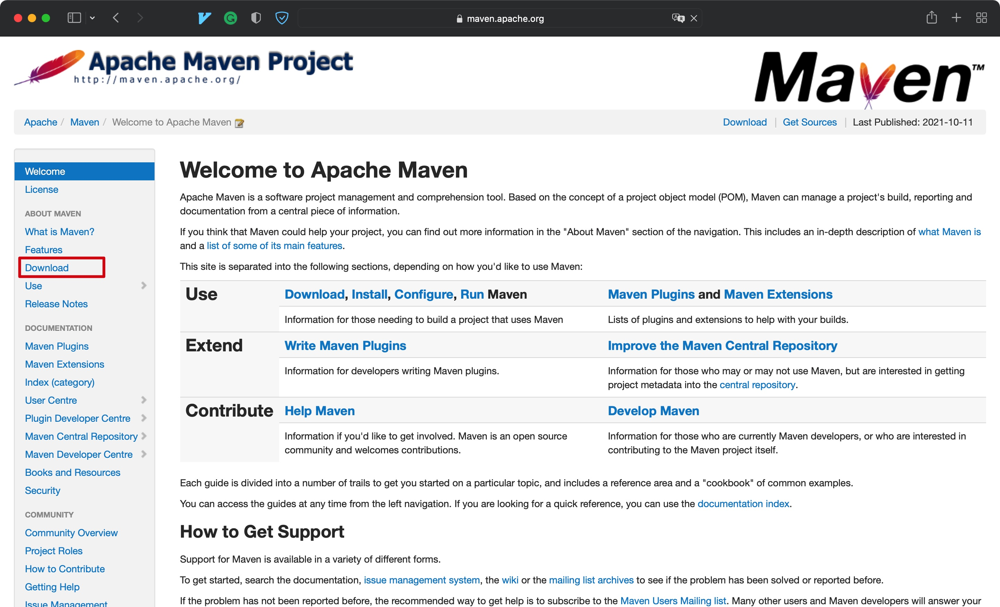
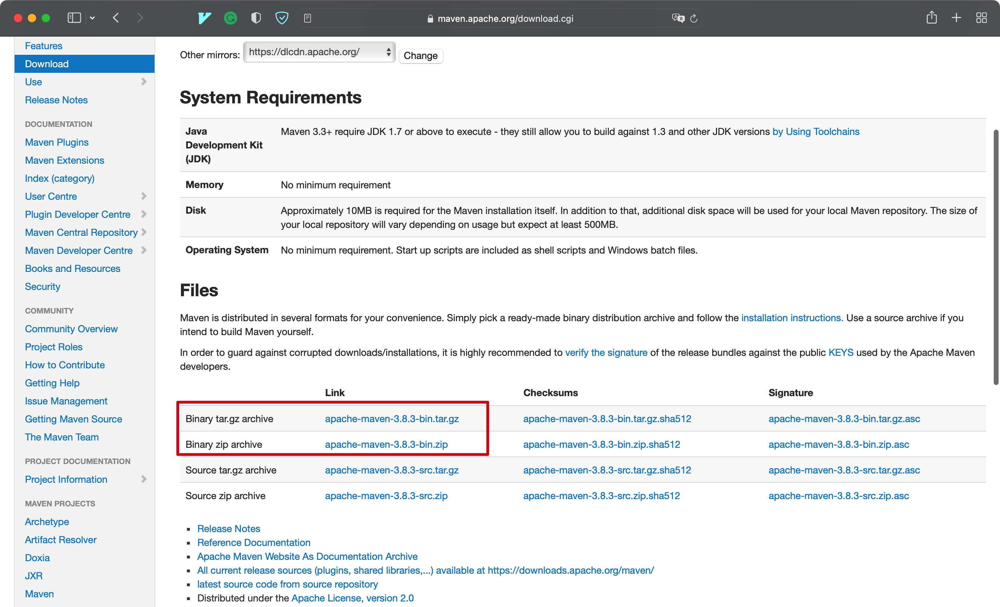
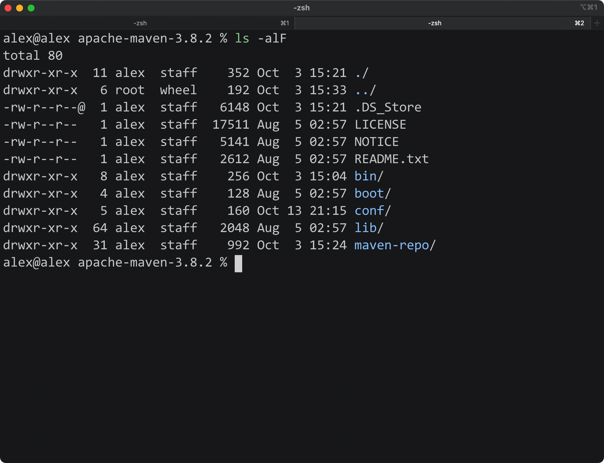
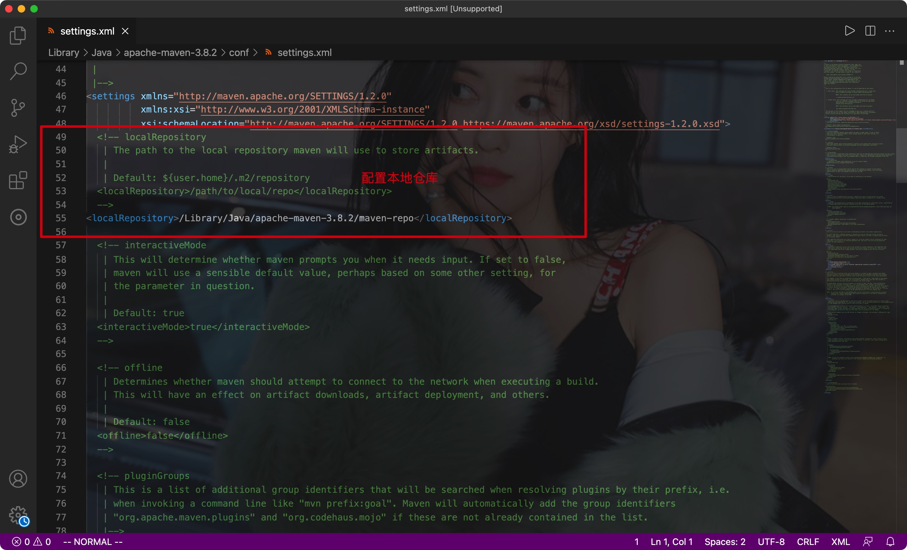
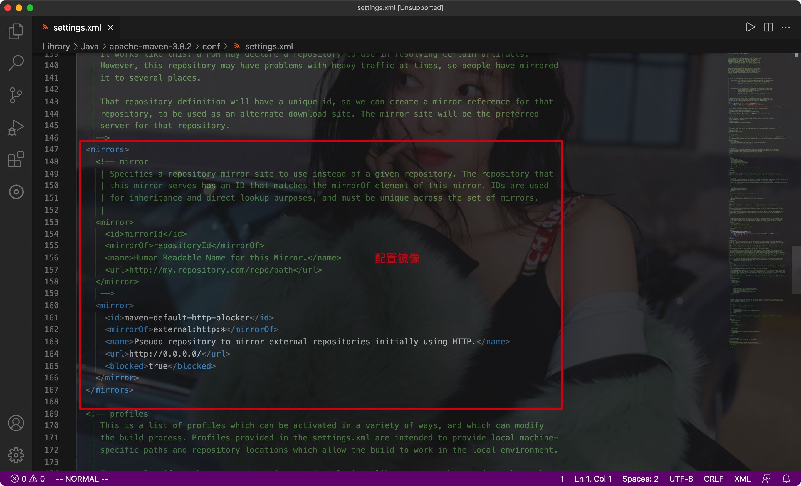
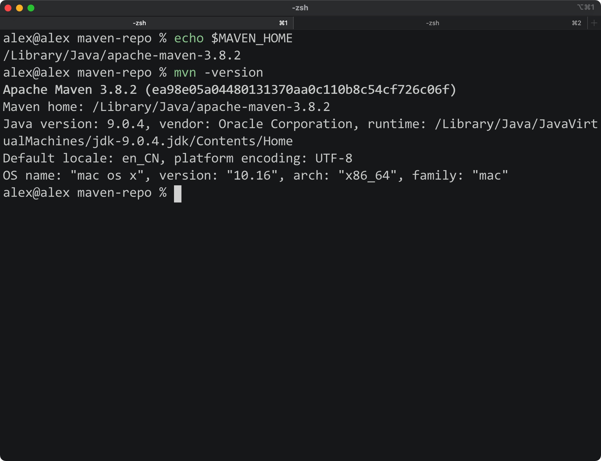
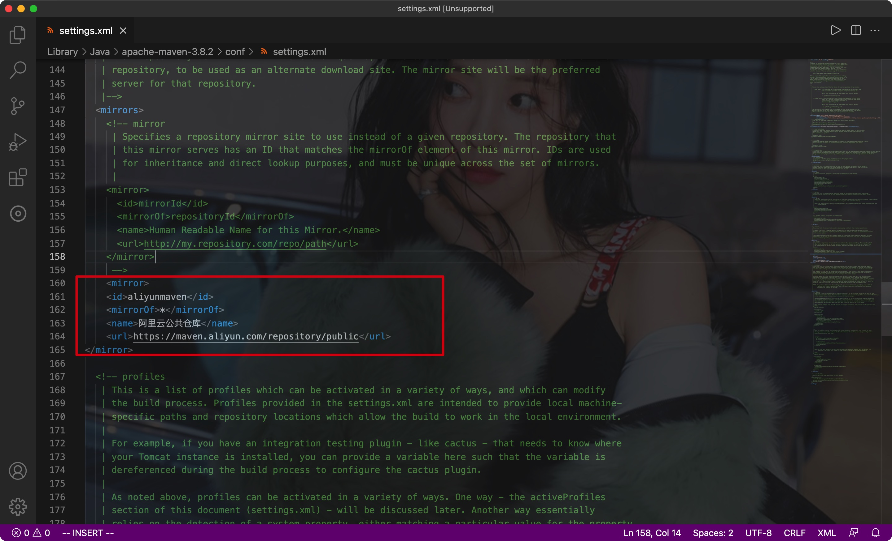
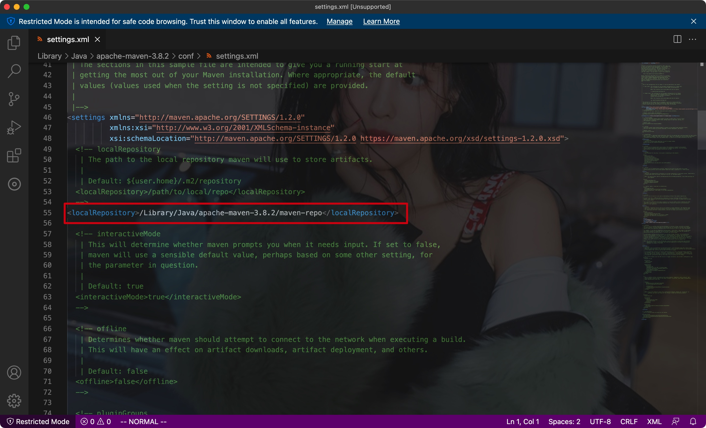

# 一、安装/配置

- Maven是一个**项目架构管理工具**，能**通过项目中的配置文件自动导入相应的jar包**


## 1.1 安装







- 大致结构:




## 1.2 配置文件

- 配置文件目录:

```shell
apache-maven-3.8.2/conf/settings.xml
```


- 内容:







## 1.3 环境变量

- 在Mac OS下:

进入zsh配置: cd ~/.zshrc

```shell
MAVEN_HOME=/Library/Java/apache-maven-3.8.2
export MAVEN_HOME
export PATH=$PATH:$MAVEN_HOME/bin
export M2_HOME=/Library/Java/apache-maven-3.8.2
export PATH=$PATH:$M2_HOME/bin
```


- 通过shell检测




## 1.4 配置镜像

- 推荐使用阿里云镜像

```xml
<mirror>
    <id>aliyunmaven</id>
    <mirrorOf>*</mirrorOf>
    <name>阿里云公共仓库</name>
    <url>https://maven.aliyun.com/repository/public</url>
</mirror>
```


Eg:




## 1.5 仓库

- 仓库分为本地仓库和远程仓库


创建一个本地仓库，并在配置文件中指定:




