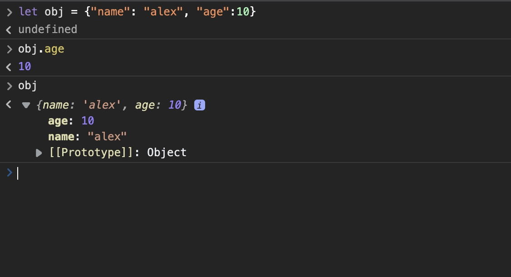
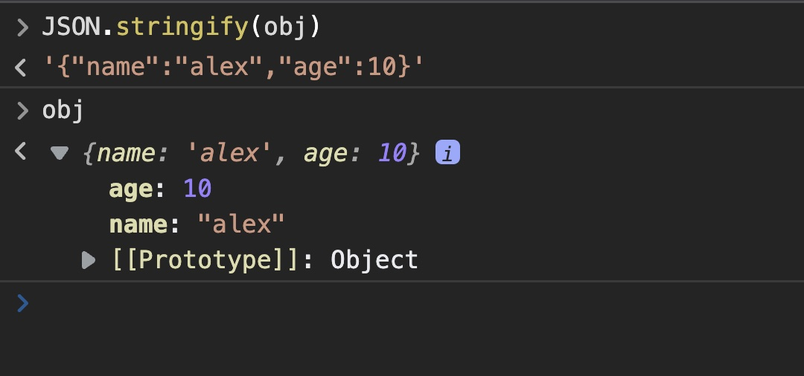
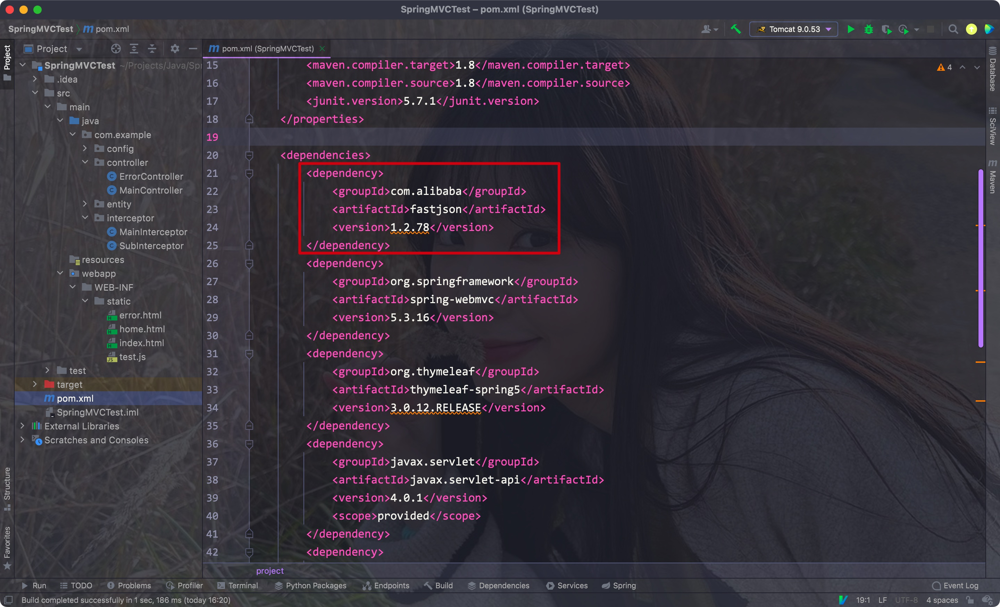
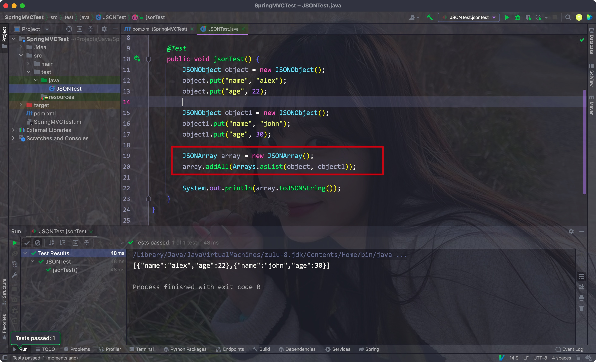
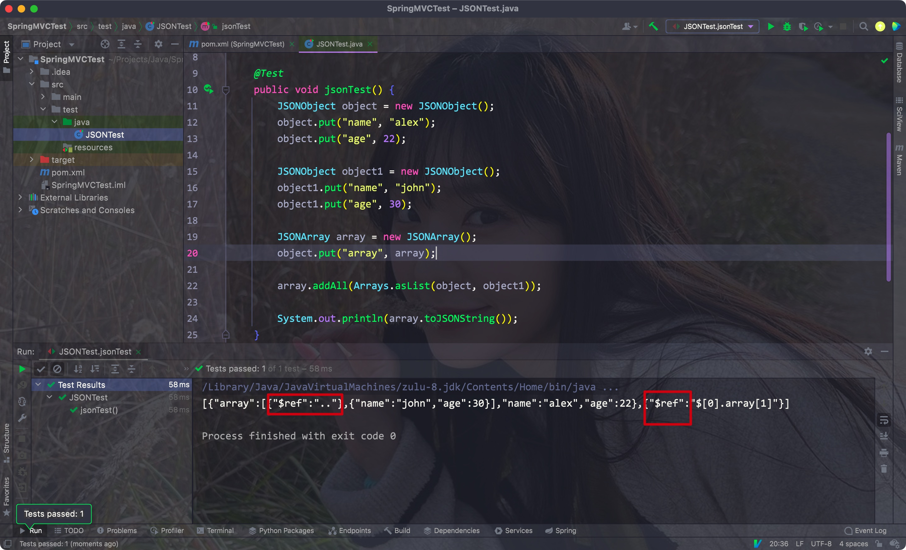
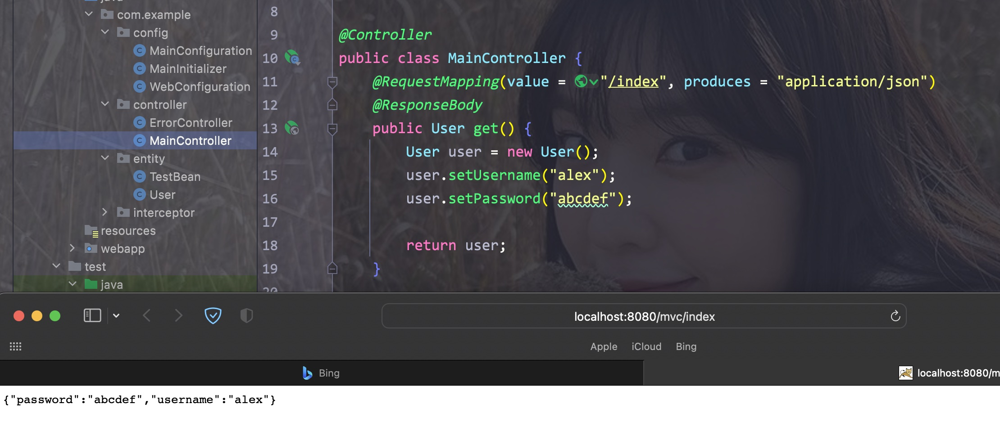

# 一、初入

- JSON: JavaScript Object Notation，即JS对象简谱。是一种轻量化的数据交换格式


通过JSON可以方便地进行前后端交互:

- 将后端对象以json的格式输出
- 而JSON可以直接被JS转换为对应的JS对象，从而用来填充前端数据


Eg:



<hr>


# 二、数据格式

- json也是以键值对的形式表示的，其中键为字符串，值为任意对象类型


单个JSON对象的格式如下

```json
{"name": "alex", "age": 22}
```


多个对象可以以数组的形式表示

```json
[{"name": "alex", "age": 22}, {"name": "john", "age": 23}]
```


在前端中，我们可以使用stringify()方法将一个JS对象转换为JSON字符串

Eg:



<hr>


# 三、后端引入

- 这里我们引入阿里的fastjson这个JSON解析框架

Eg:




- 我们只需要创建一个JSONObject对象实例，使用的时候把它当作一个Map即可
- 调用toJSONString方法即可将其转换为一个JSON字符串

Eg:


- JSONArray即为对应的JSON数组类型

Eg:




如果出现循环引用的话，则会使用$ref语法来表示对应的对象

Eg:




<hr>


# 四、应用

在controller的方法中，我们可以直接返回对应的JSON字符串

- 注意：需要在方法上添加一个@ResponseBody注解
- 并在RequestMapping注解上添加一个produce属性，用来标注返回的格式

Eg:


直接返回一个对象也能直接转换为JSON(如果使用JackSon就不需要任何配置)

因为这里我们使用的是fastjson，所以需要先配置一下:

- 在Web配置类中添加FastJSON转换器

Eg:

```java
@Override
public void configureMessageConverters(List<HttpMessageConverter<?>> converters) {
  converters.add(new FastJsonHttpMessageConverter());
}
```





