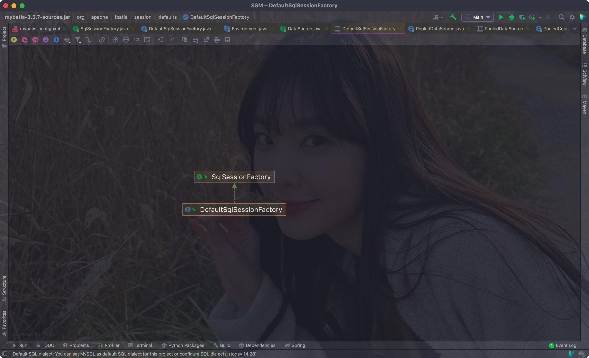
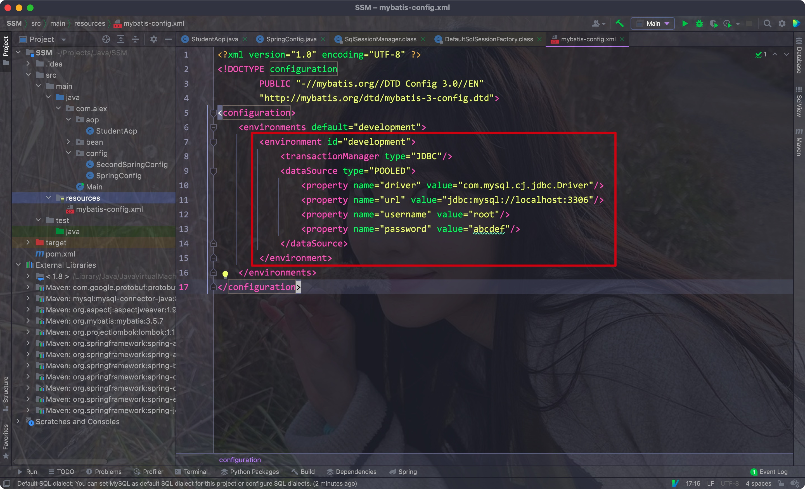
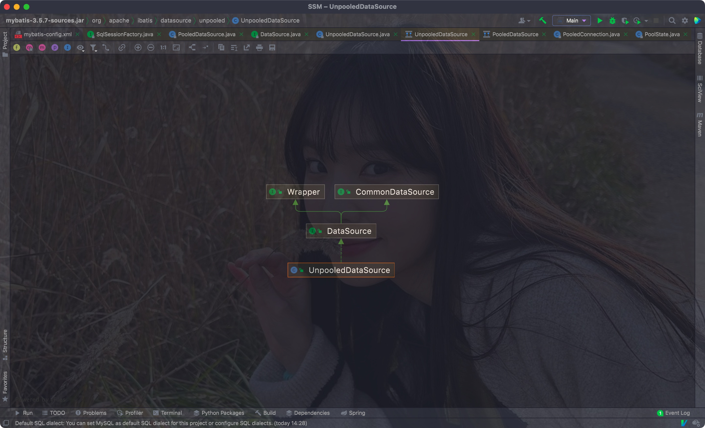
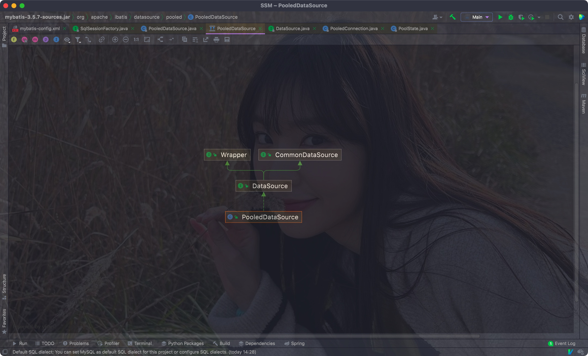

# 一、数据源DataSource


## 1. Mybatis获取Session的原理


- 在JDBC中，我们获取一个Connection的过程很麻烦，需要加载驱动
- 且每次使用后还需要手动关闭，频繁进行开启和关闭的话，其实很消耗资源，因此我们需要更好的方式
- Mybatis就使用了更好的方式


Mybatis中OpenSession方法的源码:

1. 我们调用的openSession方法其实是接口SqlSessionFactory中的
2. SqlSessionFactory的其中一个实现类为DefaultSqlSessionFactory
3. 而DefaultSqlSessionFactory类中，每个openSession方法都调用了其内部一个private方法: openSessionFromDataSource





Eg

```java
private SqlSession openSessionFromDataSource(ExecutorType execType, TransactionIsolationLevel level, boolean autoCommit) {
  Transaction tx = null;

  DefaultSqlSession var8;
  try {
    
    // 获取环境信息
    Environment environment = this.configuration.getEnvironment();
    TransactionFactory transactionFactory = this.getTransactionFactoryFromEnvironment(environment);
    
    // 加载dataSource的信息，返回事务对象
    tx = transactionFactory.newTransaction(environment.getDataSource(), level, autoCommit);
    Executor executor = this.configuration.newExecutor(tx, execType);
    var8 = new DefaultSqlSession(this.configuration, executor, autoCommit);
  } catch (Exception var12) {
    this.closeTransaction(tx);
    throw ExceptionFactory.wrapException("Error opening session.  Cause: " + var12, var12);
  } finally {
    ErrorContext.instance().reset();
  }

  return var8;
}
```


- 其中getEnvironment就是获取配置文件中的环境:




- 其中的getDataSource就是获取配置文件中的dataSource标签

而其中的DataSource是一个接口，其定义了两个方法:

Eg:

```java
public interface DataSource  extends CommonDataSource, Wrapper {
  Connection getConnection() throws SQLException;
  
  Connection getConnection(String username, String password)
    throws SQLException;
}

```

- 所以，Mybatis不是像JDBC那样通过DriverManager获取连接的，而是通过DataSource的实现类


- 为了解决JDBC那种十分占用资源的方法，Mybatis通过DataSource来同一管理所有的连接
- 需要Connection对象的时候，则根据DataSource内部机制合理分配一个连接对象


- 而常用的DataSource实现方式则是池化技术，即：

在一开始的时候就创建若干连接，这样之后需要连接的时候就能直接获取对应的连接对象

Eg:


- 其实在Mybatis的配置文件中，dataSource标签里的type属性就指定了DataSource的实现
- 默认的是POOLED，即池化实现

Eg:

```xml
dataSource type="POOLED">
<property name="driver" value="com.mysql.cj.jdbc.Driver"/>
<property name="url" value="jdbc:mysql://localhost:3306"/>
<property name="username" value="root"/>
<property name="password" value="abcdef"/>
</dataSource>
```

 

- mybatis可以有三种datasource实现:
    - POOLED: 池化
    - UNPOOLED: 不使用池化
    - JNDI(暂不了解)

<hr>


## 2. DataSource的实现

这里我们只考虑两个实现类:

- PooledDataSource
- UnpooledDataSource


### 1) UnpooledDataSource




- 其通过调用内部的**doGetConnection**方法获取一个连接

```mysql
private ClassLoader driverClassLoader;
private Properties driverProperties;

// 存放驱动
private static Map<String, Driver> registeredDrivers = new ConcurrentHashMap<>();

private String driver;
private String url;
private String username;
private String password;

private Boolean autoCommit;
private Integer defaultTransactionIsolationLevel;
private Integer defaultNetworkTimeout;

......

@Override
public Connection getConnection() throws SQLException {
	return doGetConnection(username, password);
}

@Override
public Connection getConnection(String username, String password) throws SQLException {
	return doGetConnection(username, password);
}
```


- doGetConnection:

第一个doGetConnection创建了一个Properties对象，并将用户名和密码加载到其中

之后调用另一个doGetConnection对象，传入构建好的Properties对象

该方法中调用了initializeDriver方法来加载驱动到类中的一个ConcurrentHashMap中

**最终还是通过DriverManager来获取连接**

```java
private Connection doGetConnection(String username, String password) throws SQLException {
  Properties props = new Properties();
  if (driverProperties != null) {
    props.putAll(driverProperties);
  }
  if (username != null) {
    props.setProperty("user", username);
  }
  if (password != null) {
    props.setProperty("password", password);
  }
  return doGetConnection(props);
}


private Connection doGetConnection(Properties properties) throws SQLException {
  initializeDriver();
  
  // 和JDBC一样通过DriverManager获取连接
  Connection connection = DriverManager.getConnection(url, properties);
  configureConnection(connection);
  return connection;
}
```


初始化驱动:

```java
private synchronized void initializeDriver() throws SQLException {
  if (!registeredDrivers.containsKey(driver)) {
    Class<?> driverType;
    try {
      if (driverClassLoader != null) {
        driverType = Class.forName(driver, true, driverClassLoader);
      } else {
        driverType = Resources.classForName(driver);
      }
      // DriverManager requires the driver to be loaded via the system ClassLoader.
      // http://www.kfu.com/~nsayer/Java/dyn-jdbc.html
      Driver driverInstance = (Driver) driverType.getDeclaredConstructor().newInstance();
      DriverManager.registerDriver(new DriverProxy(driverInstance));
      
      
      // 放入ConcurrentHashMap中
      registeredDrivers.put(driver, driverInstance);
    } catch (Exception e) {
      throw new SQLException("Error setting driver on UnpooledDataSource. Cause: " + e);
    }
  }
}
```

<hr>


### 2) PooledDataSource




其复用了UnpooledDataSource中的操作，同时将自身传入PoolState形成了一个新的代理对象

```java
public class PooledDataSource implements DataSource {

private static final Log log = LogFactory.getLog(PooledDataSource.class);

// 代理对象，其中有两个链表来记录连接实例的状态
private final PoolState state = new PoolState(this);

// 复用
private final UnpooledDataSource dataSource;
```


PoolState:

```java
public class PoolState {

protected PooledDataSource dataSource;

protected final List<PooledConnection> idleConnections = new ArrayList<>();
protected final List<PooledConnection> activeConnections = new ArrayList<>();
}
```


- 其实现的getConnection方法都调用了popConnection方法

```java
@Override
public Connection getConnection() throws SQLException {
  return popConnection(dataSource.getUsername(), dataSource.getPassword()).getProxyConnection();
}

@Override
public Connection getConnection(String username, String password) throws SQLException {
  return popConnection(username, password).getProxyConnection();
}
```


popConnection方法:

```java
private PooledConnection popConnection(String username, String password) throws SQLException {
  boolean countedWait = false;
  PooledConnection conn = null;
  long t = System.currentTimeMillis();
  int localBadConnectionCount = 0;

  
  // 判断需要的连接对象是否为空
  while (conn == null) {
    
    // 为代理实例连接加锁
    synchronized (state) {
      
      // 判断代理连接对象中的空闲连接链表是否为null，即是否有空闲的connection对象
      if (!state.idleConnections.isEmpty()) {
        // Pool has available connection
        
        // 如果有则获取链表空闲链表头的连接对象
        conn = state.idleConnections.remove(0);
        if (log.isDebugEnabled()) {
          log.debug("Checked out connection " + conn.getRealHashCode() + " from pool.");
        }
      } else {
        // Pool does not have available connection
        
        // 如果活跃连接数小于规定的最大连接数
        if (state.activeConnections.size() < poolMaximumActiveConnections) {
          // Can create new connection
          
          // 直接使用UnpooledConnection的DataSource实例创建连接并封装成PooledConnection实例
          conn = new PooledConnection(dataSource.getConnection(), this);
          if (log.isDebugEnabled()) {
            log.debug("Created connection " + conn.getRealHashCode() + ".");
          }
        } else {
          // Cannot create new connection
          
          
          // 如果活跃连接数满了，则从state这个代理实例的活跃连接链表中获取最早的连接实例
          PooledConnection oldestActiveConnection = state.activeConnections.get(0);
          
          // 判断该连接实例是否超时
          long longestCheckoutTime = oldestActiveConnection.getCheckoutTime();
          if (longestCheckoutTime > poolMaximumCheckoutTime) {
            // Can claim overdue connection
            state.claimedOverdueConnectionCount++;
            state.accumulatedCheckoutTimeOfOverdueConnections += longestCheckoutTime;
            state.accumulatedCheckoutTime += longestCheckoutTime;
            
            
            // 将超时的connect实例从活跃链表中移除
            state.activeConnections.remove(oldestActiveConnection);
            if (!oldestActiveConnection.getRealConnection().getAutoCommit()) {
              try {
                oldestActiveConnection.getRealConnection().rollback();
              } catch (SQLException e) {
                
                log.debug("Bad connection. Could not roll back");
              }
            }
            
            // 将复用的connect实例构建为新的PooledConnection实例，最后返回
            conn = new PooledConnection(oldestActiveConnection.getRealConnection(), this);
							......
            
            // 如果没有超时的connection实例，则只能等待
          } else {
            // Must wait
            try {
              if (!countedWait) {
                state.hadToWaitCount++;
                countedWait = true;
              }
              if (log.isDebugEnabled()) {
                log.debug("Waiting as long as " + poolTimeToWait + " milliseconds for connection.");
              }
              long wt = System.currentTimeMillis();
              state.wait(poolTimeToWait);
              state.accumulatedWaitTime += System.currentTimeMillis() - wt;
            } catch (InterruptedException e) {
              break;
            }
          }
        }
      }
      if (conn != null) {
        // ping to server and check the connection is valid or not
        if (conn.isValid()) {
          if (!conn.getRealConnection().getAutoCommit()) {
            conn.getRealConnection().rollback();
          }
			......

  
  // 返回获取的实例
  return conn;
}
```


- PopConnection方法其实返回了一个PooledConnection对象，其通过实现InvocationHandler接口，重写其中的invoke方法后实现了动态代理
- 在重写的invoke方法中，又调用了其代理的PooledDataSource实例中的pushConnection方法

Eg:

```java
class PooledConnection implements InvocationHandler {

	private static final String CLOSE = "close";
	private static final Class<?>[] IFACES = new Class<?>[] { Connection.class };

	private final int hashCode;
  
  // 代理的实例
  private final PooledDataSource dataSource;
  private final Connection realConnection;
  private final Connection proxyConnection;
  private long checkoutTimestamp;
  private long createdTimestamp;
  private long lastUsedTimestamp;
  private int connectionTypeCode;
  private boolean valid;
}
```


重写的invoke方法:

```java
@Override
public Object invoke(Object proxy, Method method, Object[] args) throws Throwable {
  String methodName = method.getName();
  if (CLOSE.equals(methodName)) {
    
    // 调用了PooledDataSource中的方法
    dataSource.pushConnection(this);
    return null;
  }
  try {
    if (!Object.class.equals(method.getDeclaringClass())) {
      // issue #579 toString() should never fail
      // throw an SQLException instead of a Runtime
      checkConnection();
    }
    return method.invoke(realConnection, args);
  } catch (Throwable t) {
    throw ExceptionUtil.unwrapThrowable(t);
  }

}
```


PooledConnection中的pushConnection方法:

```java
protected void pushConnection(PooledConnection conn) throws SQLException {

  // 为代理实例加锁
  synchronized (state) {
    
    // 获取活跃connection链表中的connection实例，并移除
    state.activeConnections.remove(conn);
    if (conn.isValid()) {
      
      // 查看空闲链表容量是否已满
      if (state.idleConnections.size() < poolMaximumIdleConnections && conn.getConnectionTypeCode() == expectedConnectionTypeCode) {
        state.accumulatedCheckoutTime += conn.getCheckoutTime();
        if (!conn.getRealConnection().getAutoCommit()) {
          conn.getRealConnection().rollback();
        }
        
        // 没满则获取其中的connection实例，并构建为PooledConnection实例
        PooledConnection newConn = new PooledConnection(conn.getRealConnection(), this);
        
        // 将该实例从活跃链表回收至空闲链表
        state.idleConnections.add(newConn);
        .....
    }
  }
}
```


