# 一、引入

- Spring Security是一个基于Spring开发的权限验证框架，其核心功能有:
    - 认证(登陆)
    - 授权(用户能进行的操作)
    - 攻击防护(防止伪造身份攻击)


之所以要引入它，是为了解决Sesion登陆验证的一个问题: CSRF跨站请求攻击


通过两个Controller方法来演示:

```java
@RequestMapping(value = "/index")
public String get(HttpSession session) {
  session.setAttribute("login", true);

  return "index";
}

@RequestMapping(value = "/pay", method = RequestMethod.POST)
@ResponseBody
public String pay(String account, int amount, @SessionAttribute("login") boolean isLogin) {
  if (isLogin) {
    return "成功转账 ¥" + amount + "给" + account;
  } else {
    return "转账失败";
  }
}
```


- 因为用户登陆的时候带上了Session，所以恶意网站就可以利用我们的session直接向服务器发送请求

Eg:

```html
<!DOCTYPE html>
<html lang="en">
<head>
    <meta charset="UTF-8">
    <title>我是(恶)学(意)习网站</title>
</head>
<body>
    <div>
        <div>对不起，您还没有充值本站的学习会员，请先充值后再观看学习视频</div>
        <form action="http://localhost:8080/mvc/pay" method="post">
            <input type="text" name="account" value="hacker" hidden>
            <input type="number" name="amount" value="666666" hidden>
            <input type="submit" value="点我充值会员，观看完整视频">
        </form>
    </div>
</body>
</html>
```


Eg:


<hr>


# 二、环境的搭建


## 1) 新建普通项目/引入依赖


引入依赖:

```xml
<!-- 建议为各个依赖进行分类，到后期我们的项目可能会导入很多依赖，添加注释会大幅度提高阅读效率 -->
<dependencies>
    <!--  Spring框架依赖  -->
    <dependency>
        <groupId>org.springframework.security</groupId>
        <artifactId>spring-security-web</artifactId>
        <version>5.5.3</version>
    </dependency>
  	<dependency>
        <groupId>org.springframework.security</groupId>
        <artifactId>spring-security-config</artifactId>
        <version>5.5.3</version>
    </dependency>
    <dependency>
        <groupId>org.springframework</groupId>
        <artifactId>spring-webmvc</artifactId>
        <version>5.3.14</version>
    </dependency>

    <!--  持久层框架依赖  -->
		<dependency>
            <groupId>mysql</groupId>
            <artifactId>mysql-connector-java</artifactId>
            <version>8.0.27</version>
        </dependency>
        <dependency>
            <groupId>org.mybatis</groupId>
            <artifactId>mybatis-spring</artifactId>
            <version>2.0.6</version>
        </dependency>
        <dependency>
            <groupId>org.mybatis</groupId>
            <artifactId>mybatis</artifactId>
            <version>3.5.7</version>
        </dependency>
        <dependency>
            <groupId>org.springframework</groupId>
            <artifactId>spring-jdbc</artifactId>
            <version>5.3.14</version>
        </dependency>
        <dependency>
            <groupId>com.zaxxer</groupId>
            <artifactId>HikariCP</artifactId>
            <version>3.4.5</version>
        </dependency>

    <!--  其他工具框架依赖：Lombok、Slf4j  -->
    <dependency>
        <groupId>org.projectlombok</groupId>
        <artifactId>lombok</artifactId>
        <version>1.18.22</version>
    </dependency>
    <dependency>
        <groupId>org.slf4j</groupId>
        <artifactId>slf4j-jdk14</artifactId>
        <version>1.7.32</version>
    </dependency>

    <!--  ServletAPI  -->
    <dependency>
        <groupId>javax.servlet</groupId>
        <artifactId>javax.servlet-api</artifactId>
        <version>4.0.1</version>
        <scope>provided</scope>
    </dependency>

    <!--  JUnit依赖  -->
    <dependency>
        <groupId>org.junit.jupiter</groupId>
        <artifactId>junit-jupiter-api</artifactId>
        <version>${junit.version}</version>
        <scope>test</scope>
    </dependency>
    <dependency>
        <groupId>org.junit.jupiter</groupId>
        <artifactId>junit-jupiter-engine</artifactId>
        <version>${junit.version}</version>
        <scope>test</scope>
    </dependency>
</dependencies>
```

<hr>


## 2) 初始化类和配置类


使用Initialzer来配置整个Web应用

Eg:

```java
public class MvcInitializer extends AbstractAnnotationConfigDispatcherServletInitializer {
    @Override
    protected Class<?>[] getRootConfigClasses() {
        return new Class[]{RootConfiguration.class};
    }

    @Override
    protected Class<?>[] getServletConfigClasses() {
        return new Class[]{MvcConfiguration.class};
    }

    @Override
    protected String[] getServletMappings() {
        return new String[]{"/"};
    }
}
```


创建两个对应的配置类

Eg:


<hr>


## 3) MVC配置

创建Thymeleaf视图解析器，并配置对应的静态资源路径


Thymeleaf依赖:

```xml
<dependency>
  <groupId>org.thymeleaf</groupId>
  <artifactId>thymeleaf-spring5</artifactId>
  <version>3.0.12.RELEASE</version>
</dependency>
```


Eg:


<hr>


## 4) 页面和Controller

- 将之前的前端模版中的静态资源全部放在WEB-INFO的static下
- 创建一个映射/index路径的Controller方法

```java
@Controller
public class PageController {

    @RequestMapping("/index")
    public String login(){
        return "index";
    }
}
```


将页面静态资源放在WEB-INFO下

Eg:


<hr>


## 5) 配置SpringSecurity

- 和MVC一样，我们需要为SpringSecurity创建一个初始化器:
- 同MVC一样，这里同样需要继承一个Initializer类

```java
public class SecurityInitializer extends AbstractSecurityWebApplicationInitializer {
}
```


- 之后还需要一个单独的配置类用于配置
- 注意除了常规的@Configuration注解外，这里还需要一个@EnableWebSecurity注解

```java
@Configuration
@EnableWebSecurity
public class SecurityConfiguration extends WebSecurityConfigurerAdapter {
}
```


- 该配置类需要和RootConfiguration放在一起被MVC的初始化器加载

Eg:


<hr>


## 6) 效果

配置好Spring Security之后，不管我们输入什么路径，都会被重定向到SpringSecurity默认的登陆页面上去:


<hr>


# 三、用户认证


## 1) 直接认证

在SpringSecurity配置类中重写configure方法(参数为AutenticationManagerBuilder)

- 在该方法中创建一个加密实例
- 之后使用参数调用inMemoryAuthentication方法选择直接验证
- 调用passwordEncoder方法传入加密实例
- 调用withUser传入用户名
- 调用password方法，其中的参数为加密实例对密码进行加密后的返回值
- 最后使用roles方法设置用户的角色

Eg:


- 这里我们将输入的参数先进行了一次加密后再进行对比(hash值)


<hr>


## 2) 数据库认证

- 首先将加密后的密码写入数据库中:

Eg:


- 创建一个实现类，实现UserDetailsService接口(之前先创建一个根据用户名获取密码的Mapper)


- 通过自动注入获取一个对应的Service对象
- 在重写的configure方法中通过AuthenticationManagerBuilder对象调用userDetailsService方法传入该Service实例，并传入加密实例

Eg:


<hr>


## 3) 自定义登陆/登出页面

Spring Security的自带页面:

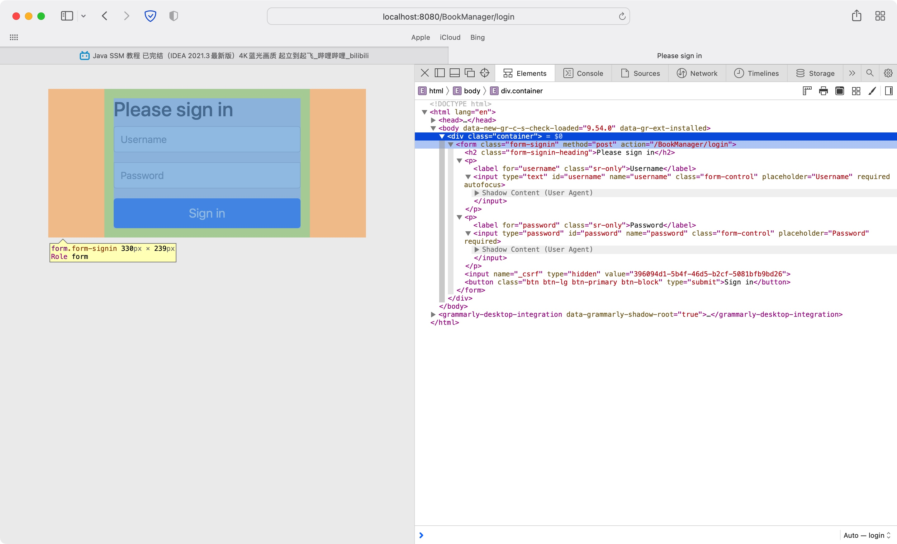


- 其中在输入框下面有一个隐藏的input标签:

```html
<input name="_csrf" type="hidden" value="396094d1-5b4f-46d5-b2cf-5081bfb9bd26">
```

这个标签存储了一串类似hash值的字符，其实就是用来防止CSRF攻击的


- 从Spring Security4.0开始，默认就会启用CSRF防护
- 其会直接拦截所有类型的请求，除非带有一个CSRF Token
- 如果提交的是表单，则在表单中必须有一个Token字符串，如果是JSON数据格式，则需要在请求头中包含此Token字符串
- 因此想要不被拦截，我们还需要在输入框下添加一个输入框:

```html
<input type="text" th:name="${_csrf.getParameterName()}" th:value="${_csrf.token}" hidden>
```

- 其中Token的键名称和对应的字符都会由Spring Security自动提供


配置后端:


1. 配置拦截规则:

- 重写另一个参数为HttpSecurity实例的方法以配置拦截规则
- 调用authorizedRequest方法配置拦截的请求
- 调用antMatchers()传入匹配的路径，传入"/static/**"表示所有的静态资源，在调用permitAll方法，表示所有人均可访问
- 再次调用antMatchers()，传入/**代表所有路径，最后调用hasRole方法限定权限

Eg:

```java
@Override
    protected void configure(HttpSecurity http) throws Exception {
        http
                .authorizeRequests()
                .antMatchers("/static/**").permitAll()
                .antMatchers("/**").hasRole("user");
    }
```


2. 配置表单登陆和登陆页面

- 在之前配置的基础上，使用and()连接之后的操作
- 调用formLogin方法开启表单登陆
- 使用loginPage方法指定登陆的页面
- 再使用loginProcessingUrl**指定表单的提交地址**
- defaultSuccessingUrl: 指定登陆成功后跳转的页面，**注意要添加第二个参数true**
- permitAll将登陆页面对所有人放开


Eg:

```java
@Override
    protected void configure(HttpSecurity http) throws Exception {
        http
                .authorizeRequests()
                .antMatchers("/static/**").permitAll()
                .antMatchers("/**").hasRole("user")
                .and()
                .formLogin()
                .loginPage("/login")
                .loginProcessingUrl("/doLogin")
                .defaultSuccessUrl("/index", true)
                .permitAll()
    }
```


3. 配置登出页面

```java
@Override
    protected void configure(HttpSecurity http) throws Exception {
        http
                .authorizeRequests()
                .antMatchers("/static/**").permitAll()
                .antMatchers("/**").hasRole("user")
                .and()
                .formLogin()
                .loginPage("/login")
                .loginProcessingUrl("/doLogin")
                .defaultSuccessUrl("/index", true)
                .permitAll()
                .and()
                .logout()
                .logoutUrl("/logout")
                .logoutSuccessUrl("/login");
    }
```

- 使用logout方法开启登出操作
- 使用logoutUrl指定退出登陆的请求地址
- logoutSuccessUrl: 指定退出后重定向的地址


4. 在Controller中编写login对应的方法

Eg:

```java
@RequestMapping("/login")
public String login() {
  return "login";
}
```


配置前端:


1. 添加属性，添加带有CSRF的input标签，并设置表单的action和method

Eg:

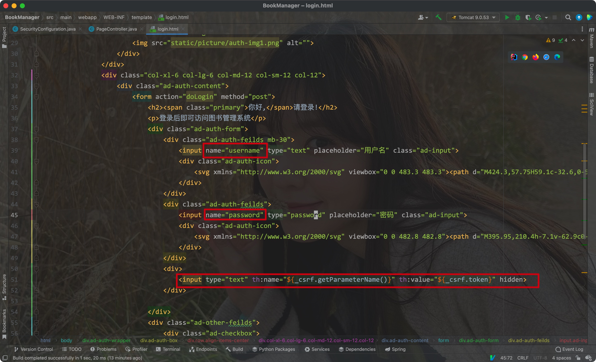


2. 将logout改为带有CSRF属性的input表单

Eg:

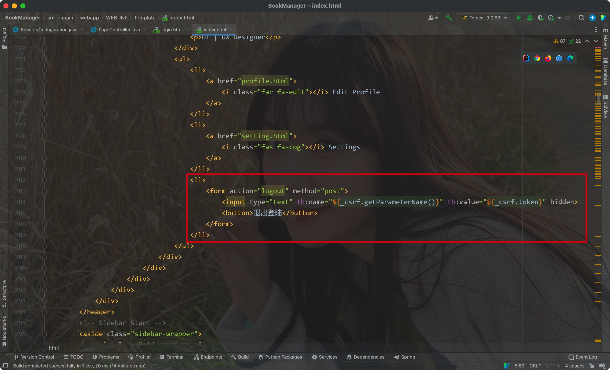


关闭csrf:

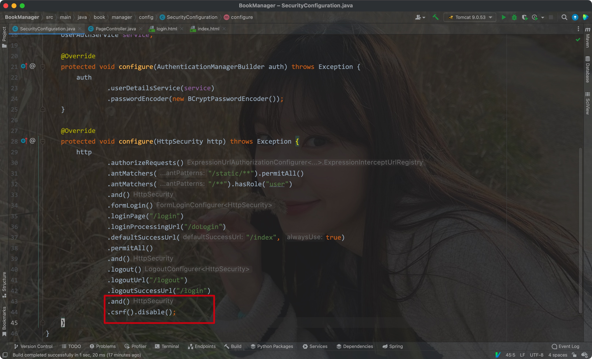


注意将logout改回去:

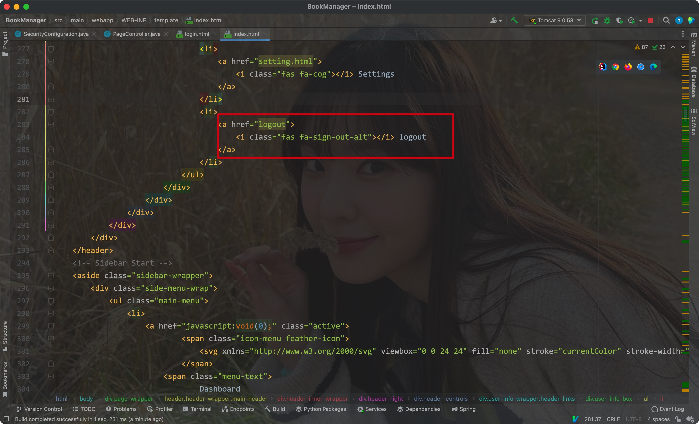

<hr>


# 四、授权

- 对于一个用户的操作其实就是在访问我们在Controller中的路径
- 所以控制不同的用户所拥有的权限其实就是决定用户能否访问对应的Servlet


例子:

- 对于一个QQ群，其中有三种用户，各自能够访问的权限如下
    - 群主：`/login`、`/logout`、`/chat`、`/edit`、`/delete`、`/upgrade`
    - 管理员：`/login`、`/logout`、`/chat`、`/edit`
    - 普通群成员：`/login`、`/logout`、`/chat`


Spring Security提供了两种授权方式:

- 基于权限的授权: 只要拥有某权限就能访问某路径
- 基于角色的权限: 根据用户的角色来决定是否可以访问某个路径

<hr>


## 1) 基于角色授权

- 我们这里创建两种用户，一种是普通用户，一种是管理员用户，普通用户只能访问index，而管理员可以访问任意页面


数据库：

- 为了对用户进行区分，我们需要在数据库中新增一个role字段

Eg:

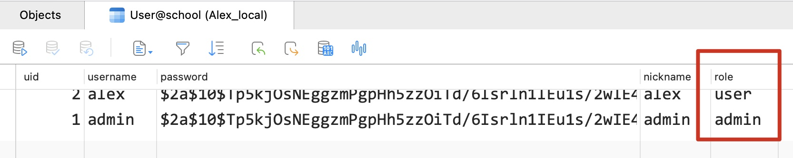


SpringSecurity权限设置:

```java
 http
                .authorizeRequests()
                .antMatchers("/static/**").permitAll()
                .antMatchers("/**").hasAnyRole("user", "admin")
                .anyRequest().hasRole("admin")
```

- 将index的权限开放给user和admin
- 将任意路径的权限只开放给admin


实体类:

创建一个User类来表示数据库的记录，并修改Mapper

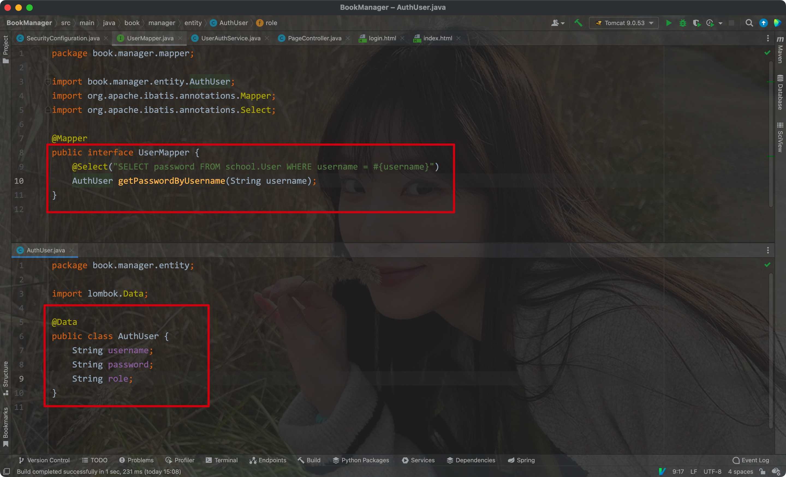


Service

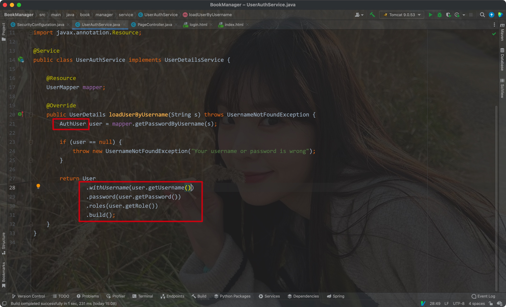


普通用户尝试访问admin:

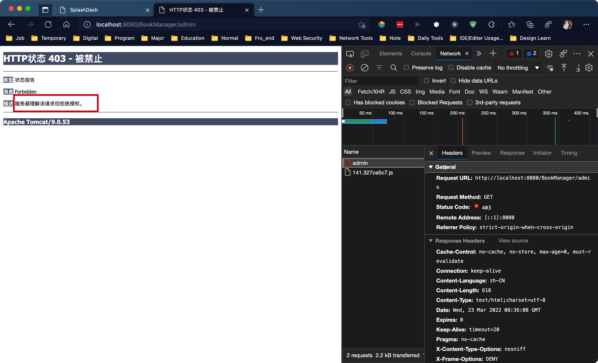


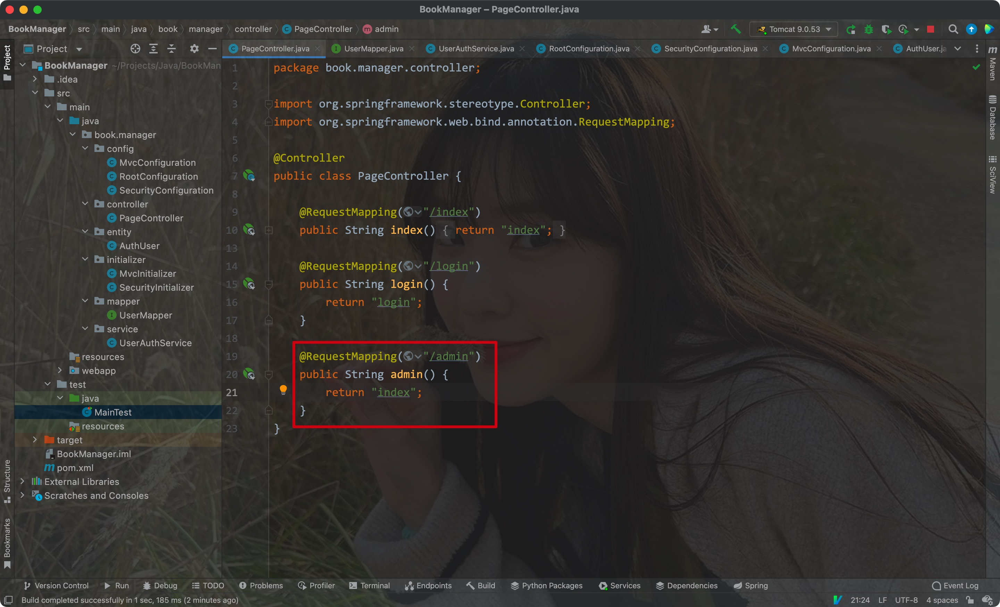

<hr>


## 2) 基于权限授权

在使用autMatchers设置对应路径后，我们可以使用hasAuthority方法代替hasRole方法，在其中传入页面权限即可

Eg:

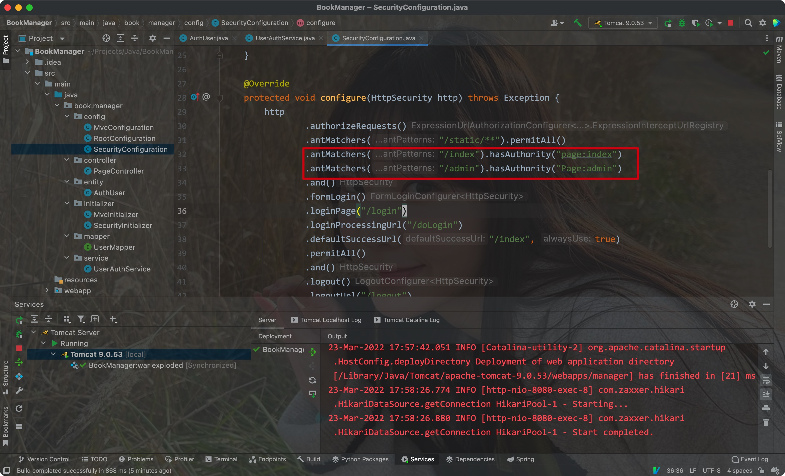


在Service中，我们只能授予其固定权限:

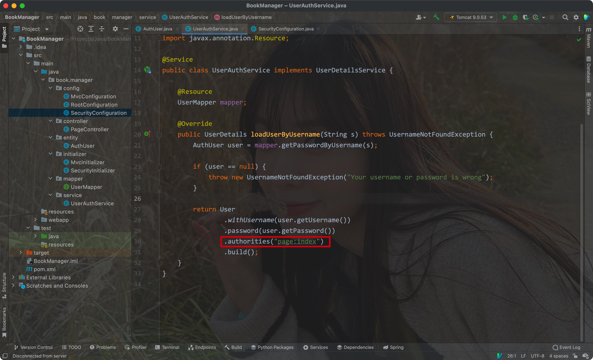

- 这样不管是普通用户还是admin，其都只能访问index这个页面

<hr>


## 3) 基于注解授权

- 如果要为Controller配置权限，则需要在Mvc的配置类上添加注解

Eg:

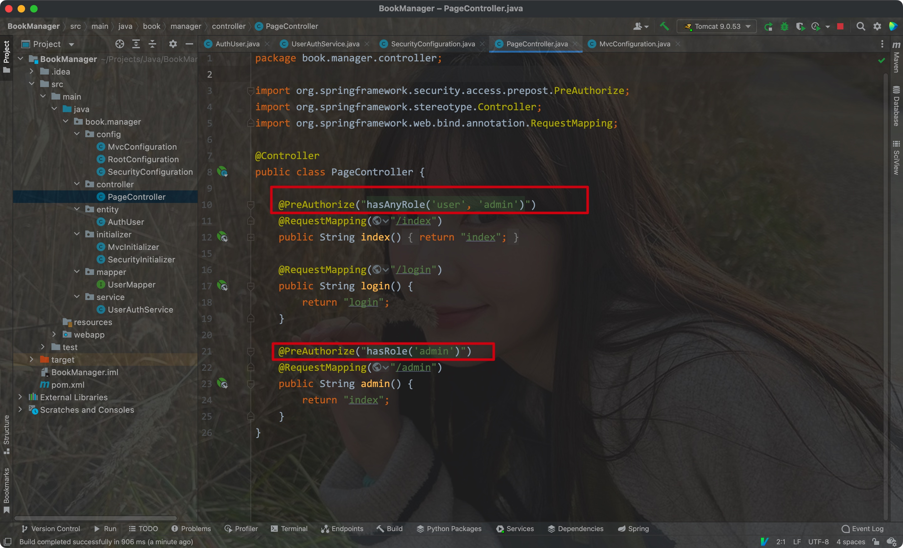

<hr>


# 五、记住我

- 只需要在SpringSecurity的配置文件中调用对于方法即可
- 前端页面需要有对应name属性的表单参数

Eg:

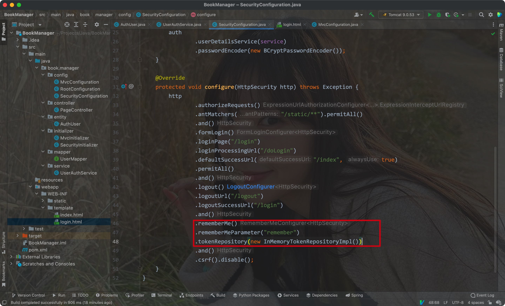

在rememberMeParameter方法中传入对应前端标签的name属性

tokenRepository方法可以传入两种参数，一种是将Token放在内存里的(Server的内存)，另一种是放在数据库里(之后可以放在Redis里)

前端:

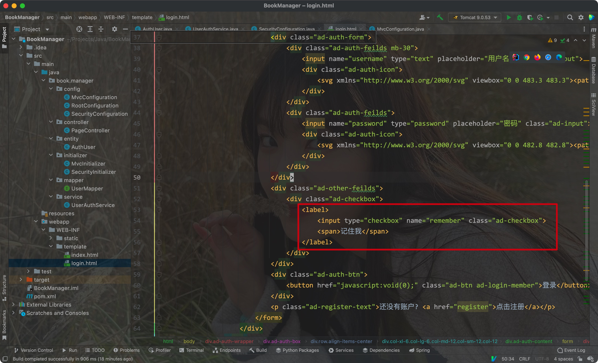


默认14天过期

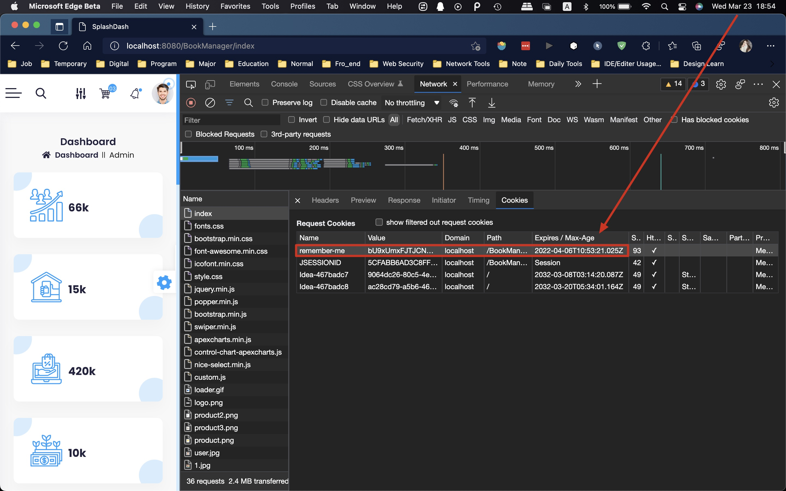


- 数据库存放:


SpringSecurityConfiguration:

```java
@Resource
PersistentTokenRepository repository;

@Bean
public PersistentTokenRepository jdbcRepository(@Autowired DataSource dataSource){
    JdbcTokenRepositoryImpl repository = new JdbcTokenRepositoryImpl();  //使用基于JDBC的实现
    repository.setDataSource(dataSource);   //配置数据源
  	repository.setCreateTableOnStartup(true);   //启动时自动创建用于存储Token的表（建议第一次启动之后删除该行）
    return repository;
}
```


- Configure方法:

```java
.and()
.rememberMe()
.rememberMeParameter("remember")
.tokenRepository(repository)
.tokenValiditySeconds(60 * 60 * 24 * 7)  //Token的有效时间（秒）默认为14天
```


该方法在第一次执行时会在数据库中插入一条数据，这样即使服务器重启，token也依然有效

<hr>


# 六、


