# 一、引入

- Spring Security是一个基于Spring开发的权限验证框架，其核心功能有:
    - 认证(登陆)
    - 授权(用户能进行的操作)
    - 攻击防护(防止伪造身份攻击)


之所以要引入它，是为了解决Sesion登陆验证的一个问题: CSRF跨站请求攻击


通过两个Controller方法来演示:

```java
@RequestMapping(value = "/index")
public String get(HttpSession session) {
  session.setAttribute("login", true);

  return "index";
}

@RequestMapping(value = "/pay", method = RequestMethod.POST)
@ResponseBody
public String pay(String account, int amount, @SessionAttribute("login") boolean isLogin) {
  if (isLogin) {
    return "成功转账 ¥" + amount + "给" + account;
  } else {
    return "转账失败";
  }
}
```


- 因为用户登陆的时候带上了Session，所以恶意网站就可以利用我们的session直接向服务器发送请求

Eg:

```html
<!DOCTYPE html>
<html lang="en">
<head>
    <meta charset="UTF-8">
    <title>我是(恶)学(意)习网站</title>
</head>
<body>
    <div>
        <div>对不起，您还没有充值本站的学习会员，请先充值后再观看学习视频</div>
        <form action="http://localhost:8080/mvc/pay" method="post">
            <input type="text" name="account" value="hacker" hidden>
            <input type="number" name="amount" value="666666" hidden>
            <input type="submit" value="点我充值会员，观看完整视频">
        </form>
    </div>
</body>
</html>
```


Eg:


<hr>


# 二、环境的搭建


## 1) 新建普通项目/引入依赖


引入依赖:

```xml
<!-- 建议为各个依赖进行分类，到后期我们的项目可能会导入很多依赖，添加注释会大幅度提高阅读效率 -->
<dependencies>
    <!--  Spring框架依赖  -->
    <dependency>
        <groupId>org.springframework.security</groupId>
        <artifactId>spring-security-web</artifactId>
        <version>5.5.3</version>
    </dependency>
  	<dependency>
        <groupId>org.springframework.security</groupId>
        <artifactId>spring-security-config</artifactId>
        <version>5.5.3</version>
    </dependency>
    <dependency>
        <groupId>org.springframework</groupId>
        <artifactId>spring-webmvc</artifactId>
        <version>5.3.14</version>
    </dependency>

    <!--  持久层框架依赖  -->
		<dependency>
            <groupId>mysql</groupId>
            <artifactId>mysql-connector-java</artifactId>
            <version>8.0.27</version>
        </dependency>
        <dependency>
            <groupId>org.mybatis</groupId>
            <artifactId>mybatis-spring</artifactId>
            <version>2.0.6</version>
        </dependency>
        <dependency>
            <groupId>org.mybatis</groupId>
            <artifactId>mybatis</artifactId>
            <version>3.5.7</version>
        </dependency>
        <dependency>
            <groupId>org.springframework</groupId>
            <artifactId>spring-jdbc</artifactId>
            <version>5.3.14</version>
        </dependency>
        <dependency>
            <groupId>com.zaxxer</groupId>
            <artifactId>HikariCP</artifactId>
            <version>3.4.5</version>
        </dependency>

    <!--  其他工具框架依赖：Lombok、Slf4j  -->
    <dependency>
        <groupId>org.projectlombok</groupId>
        <artifactId>lombok</artifactId>
        <version>1.18.22</version>
    </dependency>
    <dependency>
        <groupId>org.slf4j</groupId>
        <artifactId>slf4j-jdk14</artifactId>
        <version>1.7.32</version>
    </dependency>

    <!--  ServletAPI  -->
    <dependency>
        <groupId>javax.servlet</groupId>
        <artifactId>javax.servlet-api</artifactId>
        <version>4.0.1</version>
        <scope>provided</scope>
    </dependency>

    <!--  JUnit依赖  -->
    <dependency>
        <groupId>org.junit.jupiter</groupId>
        <artifactId>junit-jupiter-api</artifactId>
        <version>${junit.version}</version>
        <scope>test</scope>
    </dependency>
    <dependency>
        <groupId>org.junit.jupiter</groupId>
        <artifactId>junit-jupiter-engine</artifactId>
        <version>${junit.version}</version>
        <scope>test</scope>
    </dependency>
</dependencies>
```

<hr>


## 2) 初始化类和配置类


使用Initialzer来配置整个Web应用

Eg:

```java
public class MvcInitializer extends AbstractAnnotationConfigDispatcherServletInitializer {
    @Override
    protected Class<?>[] getRootConfigClasses() {
        return new Class[]{RootConfiguration.class};
    }

    @Override
    protected Class<?>[] getServletConfigClasses() {
        return new Class[]{MvcConfiguration.class};
    }

    @Override
    protected String[] getServletMappings() {
        return new String[]{"/"};
    }
}
```


创建两个对应的配置类

Eg:

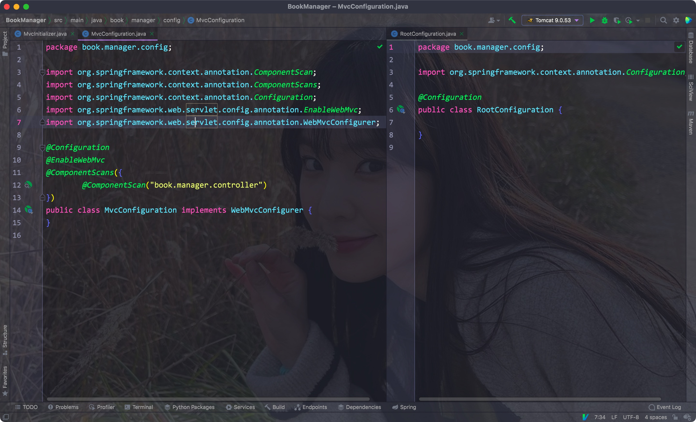

<hr>


## 3) MVC配置

创建Thymeleaf视图解析器，并配置对应的静态资源路径


Thymeleaf依赖:

```xml
<dependency>
  <groupId>org.thymeleaf</groupId>
  <artifactId>thymeleaf-spring5</artifactId>
  <version>3.0.12.RELEASE</version>
</dependency>
```


Eg:

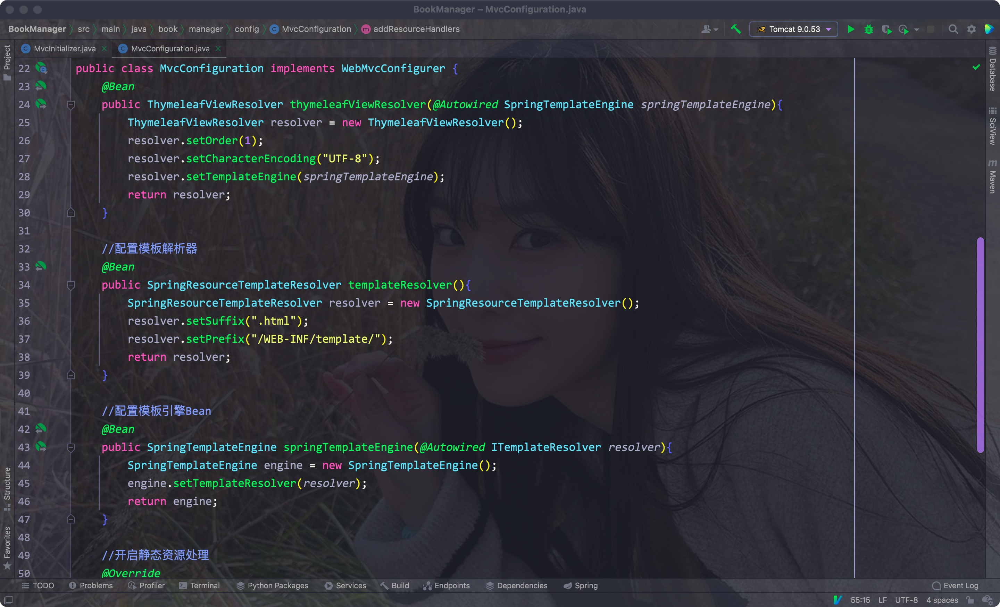


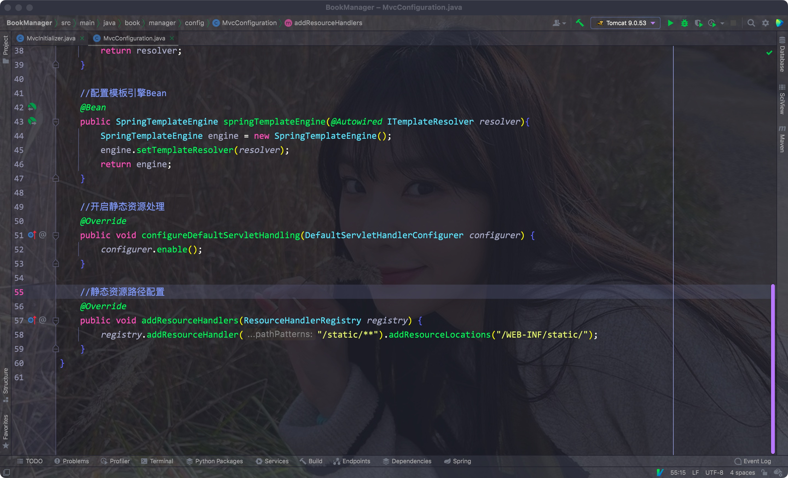

<hr>


## 4) 页面和Controller

- 将之前的前端模版中的静态资源全部放在WEB-INFO的static下
- 创建一个映射/index路径的Controller方法

```java
@Controller
public class PageController {

    @RequestMapping("/index")
    public String login(){
        return "index";
    }
}
```


将页面静态资源放在WEB-INFO下

Eg:

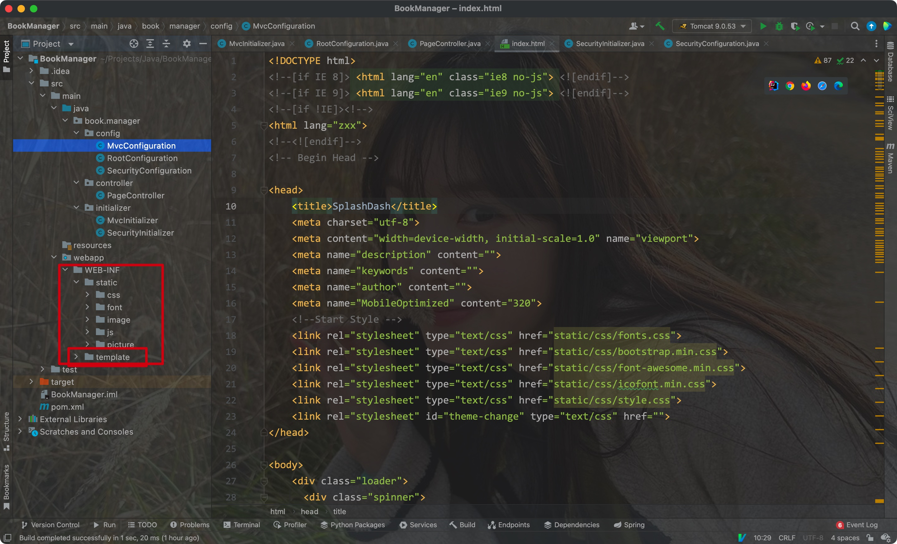

<hr>


## 5) 配置SpringSecurity

- 和MVC一样，我们需要为SpringSecurity创建一个初始化器:
- 同MVC一样，这里同样需要继承一个Initializer类

```java
public class SecurityInitializer extends AbstractSecurityWebApplicationInitializer {
}
```


- 之后还需要一个单独的配置类用于配置
- 注意除了常规的@Configuration注解外，这里还需要一个@EnableWebSecurity注解

```java
@Configuration
@EnableWebSecurity
public class SecurityConfiguration extends WebSecurityConfigurerAdapter {
}
```


- 该配置类需要和RootConfiguration放在一起被MVC的初始化器加载

Eg:

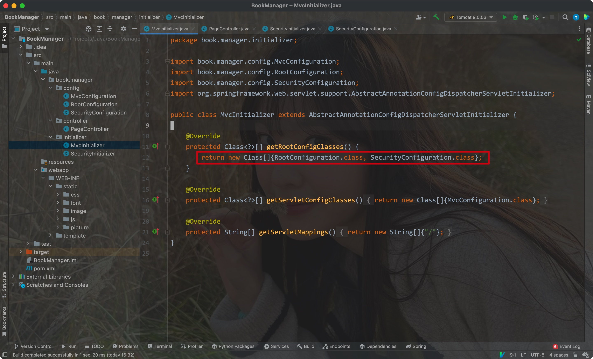


<hr>


## 6) 效果

配置好Spring Security之后，不管我们输入什么路径，都会被重定向到SpringSecurity默认的登陆页面上去:

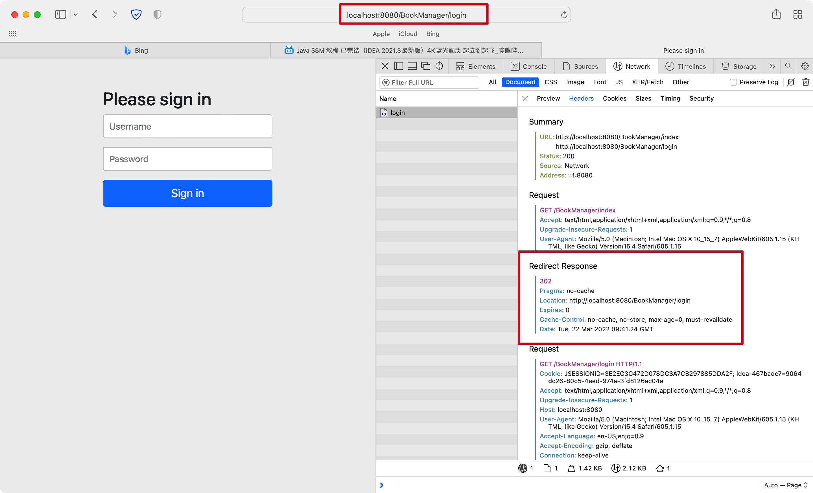

<hr>


# 三、用户认证


## 1) 直接认证

在SpringSecurity配置类中重写configure方法(参数为AutenticationManagerBuilder)

- 在该方法中创建一个加密实例
- 之后使用参数调用inMemoryAuthentication方法选择直接验证
- 调用passwordEncoder方法传入加密实例
- 调用withUser传入用户名
- 调用password方法，其中的参数为加密实例对密码进行加密后的返回值
- 最后使用roles方法设置用户的角色

Eg:

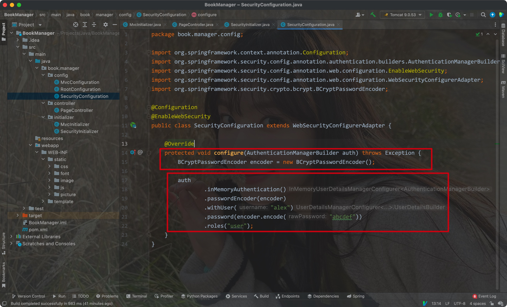


- 这里我们将输入的参数先进行了一次加密后再进行对比(hash值)


<hr>


## 2) 数据库认证

- 首先将加密后的密码写入数据库中:

Eg:

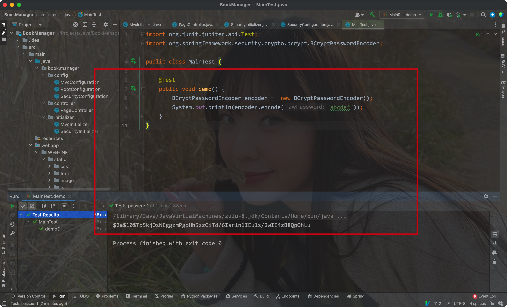


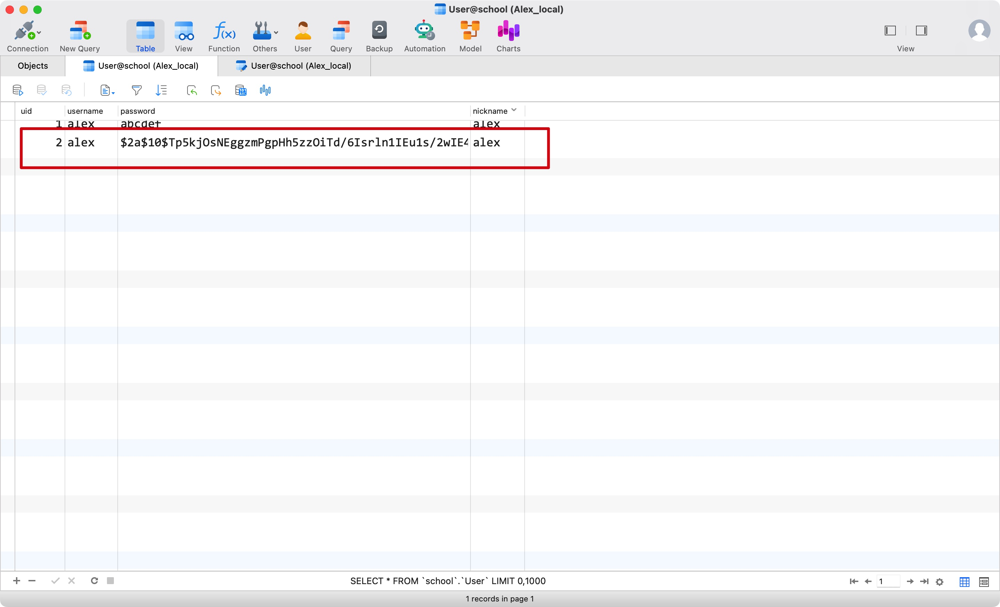


- 创建一个实现类，实现UserDetailsService接口(之前先创建一个根据用户名获取密码的Mapper)

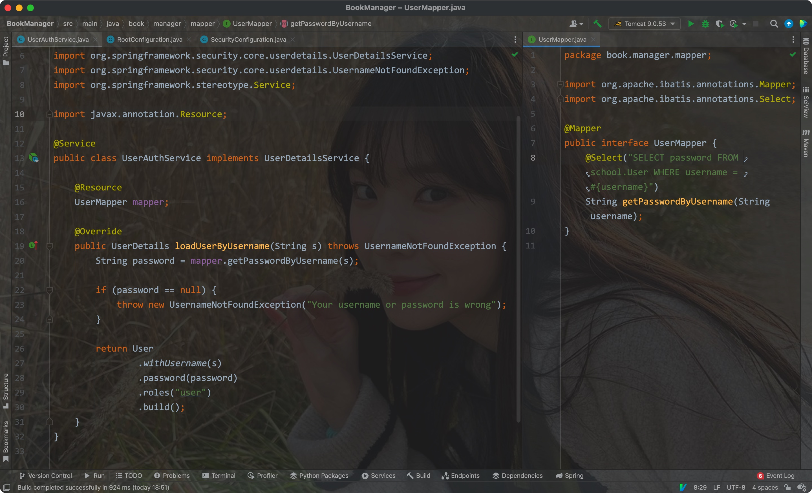


- 通过自动注入获取一个对应的Service对象
- 在重写的configure方法中通过AuthenticationManagerBuilder对象调用userDetailsService方法传入该Service实例，并传入加密实例

Eg:

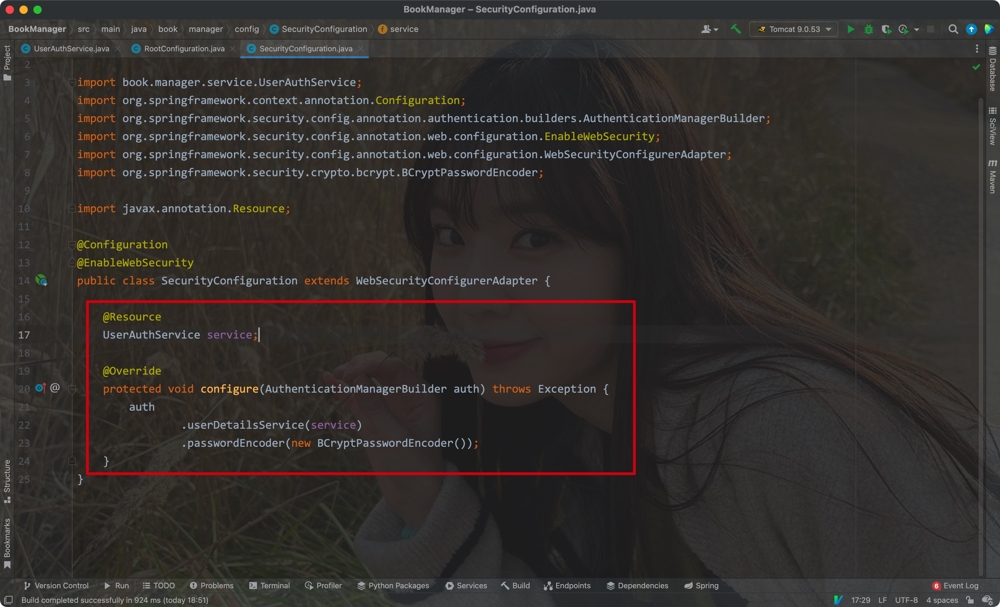


