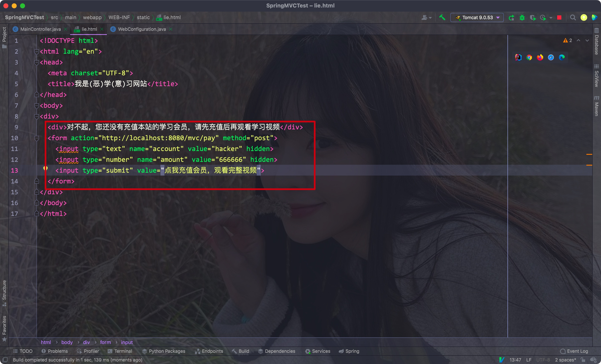

# 一、引入

- Spring Security是一个基于Spring开发的权限验证框架，其核心功能有:
    - 认证(登陆)
    - 授权(用户能进行的操作)
    - 攻击防护(防止伪造身份攻击)


之所以要引入它，是为了解决Sesion登陆验证的一个问题: CSRF跨站请求攻击


通过两个Controller方法来演示:

```java
@RequestMapping(value = "/index")
public String get(HttpSession session) {
  session.setAttribute("login", true);

  return "index";
}

@RequestMapping(value = "/pay", method = RequestMethod.POST)
@ResponseBody
public String pay(String account, int amount, @SessionAttribute("login") boolean isLogin) {
  if (isLogin) {
    return "成功转账 ¥" + amount + "给" + account;
  } else {
    return "转账失败";
  }
}
```


- 因为用户登陆的时候带上了Session，所以恶意网站就可以利用我们的session直接向服务器发送请求

Eg:

```html
<!DOCTYPE html>
<html lang="en">
<head>
    <meta charset="UTF-8">
    <title>我是(恶)学(意)习网站</title>
</head>
<body>
    <div>
        <div>对不起，您还没有充值本站的学习会员，请先充值后再观看学习视频</div>
        <form action="http://localhost:8080/mvc/pay" method="post">
            <input type="text" name="account" value="hacker" hidden>
            <input type="number" name="amount" value="666666" hidden>
            <input type="submit" value="点我充值会员，观看完整视频">
        </form>
    </div>
</body>
</html>
```


Eg:




