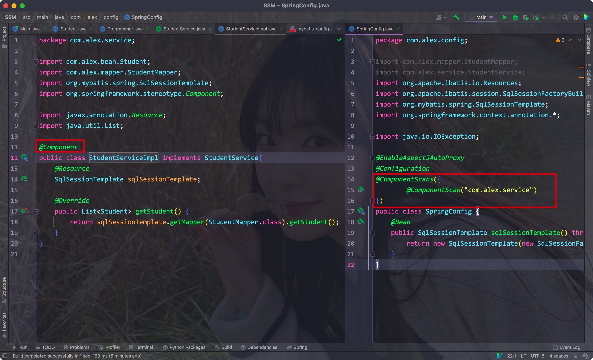

# 一、理论

- 在之前的项目结构中，我们需要在多个Servlet中获取Service的实现类，而Servlet查询数据时又依赖于Mapper

- 该种构建项目的方式会使多个模组相互依赖，耦合度很高
- 如果想要替换掉其中一个模组，另外的地方都要修改，开发用时很长
- Spring的主要目的就是为了将各个模组解耦，它就是为了简化开发而生，它是轻量级的**IoC**和**AOP**的容器框架，主要是针对**JavaBean**的生命周期进行管理的轻量级容器


## 1. JavaBean

- JavaBean其实就是所有字段属性带有Setter和Getter，且字段都被private修饰的类


## 2. IoC理论

- 因为之前的开发方式中，各个部分间都无法离开彼此，不便于模块化开发
- IOC是Inversion of Control的缩写，翻译为：“控制反转”，把复杂系统分解成相互合作的对象
- 这些对象类通过封装以后，内部实现对外部是透明的，从而降低了解决问题的复杂度，而且可以灵活地被重用和扩展。


之前的各模组关系:


使用IOC容器后:


- IoC会为我们管理类，需要都由IoC动态提供
- 当我们需要一个接口的实现时，由它根据配置文件来决定到底给我们哪一个实现类，这样，我们就可以不用再关心我们要去使用哪一个实现类了
- 我们只需要关心，给到的一定是一个可以正常使用的实现类

<hr>


# 二、IoC初入

- 需要注意的是，IoC容器的目的是解耦，而不是减少代码量


- 我们首先学习的是Core Container里的内容


## 1. 第一个Spring程序

- 我们首先创建一个空的Maven项目，再直接引入Spring的依赖

Eg:


- 导入后，我们需要在resources目录下创建一个Spring的xml配置文件，文件名随意

Eg:


- 创建后会提示创建新的应用上下文，按照提示创建即可


- 在主方法中加载配置文件，并创建一个应用上下文:

```java
ClassPathXmlApplicationContext context = new ClassPathXmlApplicationContext("spring-config.xml");
```


我们的目的是让IoC容器为我们创建对象，为此，**我们需要在spring的配置文件中注册对应的类**


我们将类单独放在一个bean目录下，再将类的别名和路径写在spring配置文件的<beans>标签内(单独写在单标签bean中)

Eg:


- 注意: 注册时对应类的name标签属性必须唯一，id标签同name的作用一样


- 通过IoC容器创建一个对象:
    - 通过创建的context对象，调用getBean方法，其中传入Spring中类的注册别名或者类的Class对象

Eg:


<hr>


## 2. 创建bean实例的两种模式

- singleton: 单例模式(默认的模式)
- prototype: 原型模式


按照之前创建对象的方法，获取到的同一个类的多个实例其实是同一个:


从构造方法的调用上看，IoC容器默认只会使用单例模式创建一个唯一的对象


- IoC容器默认情况下会在创建Context实例的时候就为注册的Bean创建一个实例对象(在加载配置文件的时候就开始了)

Eg:


- 想要IoC容器在创建对象示例时分别创建不同的示例，则需要在注册Bean的时候在配置中添加属性，将scope属性设置为"prototype"即可

Eg:

```xml
<bean name="classAlias" class="path" scope="prototype"/>
```


<hr>


## 3. 初始化方法和销毁方法

- 我们可以在Spring配置文件中对Bean对象进行注册的时候就指定初始化和销毁该对象的方法
- 注意：**只有scope为默认值singleton时，才能够调用destroy方法**
- **只有在Context实例手动关闭后，才会调用destroy方法**

Eg:


<hr>


## 4. 指定Bean对象加载的次序

- 我们可以通过在一个bean标签内添加depends-on标签指定当前bean对象需要依赖的类
- 此时该依赖类则会在其加载前进行加载

Eg:


- 很明显，IoC容器加载Bean的时候是默认按照bean的顺序来的


我们可以在Student对于的bean标签后添加一个depends-on标签让其依赖的bean先加载

Eg:


<hr>


# 三、依赖注入

为每个注册的bean的成员属性进行赋值的过程就是依赖注入，即将预先给定的属性注入到对象中

**注意：注入成功的前提是该字段已经设置了setter**

使用property标签即可


## 1. 基础类型

- 我们可以在Spring的xml配置文件中，在每对bean标签内添加对应的property标签即可


Eg:

```xml
<property name="fieldName" value="fieldValue"/>
```


<hr>


## 2. 自定义的引用类型

- 如果该Bean类中的字段有我们自定义的其他Bean类型
- 那么需要先注册该Bean类型，再使用ref代替value，注意ref里的值是该Bean对应的alias

Eg:


<hr>


## 3. list/map字段

在property标签内，使用list标签即可，list标签使用value标签，其中的type属性指定了元素的类型

```xml
<list>
  <value type="type_name">actual_value</value>
  <value type="type_name">actual_value</value>
  <value type="type_name">actual_value</value>
</list>
```


Eg:


- 对于map类型的字段，我们只需要将list改为map，将value改为entry，其中的属性变为key和value即可

```xml
<map>
	<entry key="keyName" value="val"/>
</map>
```


Eg:


<hr>


## 4. 使用自动装配

- 使用的前提是需要装配的字段有setter方法，且对应的class类已经被加载到到了IoC中


- 在bean标签中添加一个autowire属性即可
    - byType: 根据类型自动装配
    - byName: 根据setter中的字段名称来自动装配对于的bean


<hr>


## 5. 指定构造方法

- Spring默认会使用空参构造方法，通过constructor-arg标签指定调用构造方法中参数列表的变量名、类型或者参数的索引

Eg:

```xml
<constructor-arg name="argName" value="val"/>
<constructor-arg index="indexNum" value="val"/>
```


- type: 参数的类型
- index: 参数在参数列表中的索引位置
- name: 参数的名称

<hr>


# 四、AOP

AOP: aspect orient programming

AOP就是在运行的时候，动态的将其他code切入到bean的指定方法、位置上，我们可以使用AOP来帮助我们在方法执行前/后，添加一些额外的操作，**所以本质上就是代理**(代理自己管理对象的生命周期，而装饰则让client自己管理)

通过AOP，我们可以在不改变源代码的基础上进行增强处理


AOP将业务流程切断，并在切断的位置处添加一个额外操作，再将它们连起来

其原理是通过动态代理来的，但不是和Mybatis一样通过JDK实现的，而是通过第三方的库

他能够直接对父类进行代理，而不是生成接口的代理类


## 1. 引入/导入依赖


Spring是支持AOP的框架之一，其整合了部分AspectJ框架，使用前需要导入依赖:

```xml
<dependency>
    <groupId>org.springframework</groupId>
    <artifactId>spring-aspects</artifactId>
    <version>5.3.13</version>
</dependency>
```


且需要修改一下之前的Spring配置文件:

```xml
<?xml version="1.0" encoding="UTF-8"?>
<beans xmlns="http://www.springframework.org/schema/beans"
       xmlns:xsi="http://www.w3.org/2001/XMLSchema-instance"
       xmlns:aop="http://www.springframework.org/schema/aop"
       xsi:schemaLocation="http://www.springframework.org/schema/beans http://www.springframework.org/schema/beans/spring-beans.xsd
       http://www.springframework.org/schema/aop http://www.springframework.org/schema/aop/spring-aop.xsd">
</beans>
```


结合AOP的原理，我们需要知道以下条件:

- 需要切入的类，需要切入的方法
- 切入后的添加的操作
- 是在切入前还是切入后执行
- 告诉spring需要切入


Eg:

- 在Student类中的test方法后切入一个log打印操作


步骤:

1. 创建一个新的类，其中创建切入对应类前后的方法
2. 将这个类作为bean注册到IoC中
3. 在Spring配置文件中通过<aop:config>标签编写对应的aop操作
4. 在aop:config中创建切片: 标签<aop:aspect>，在其中创建切入点<aop:pointcut>和切入操作<aop:after>或者<aop:before>等等


1. 创建一个StudentAop类，编写需要添加的操作

Eg:


2. 将该类注册为bean

Eg:


3. 创建aop配置


- aop:aspect(指明插入的操作来自哪个bean)

这里**在ref属性中填写切入的操作来自的bean即可**


- aop:pointcut(指明切入点，指明切入的类和方法)

其中的id属性可以任意给出，其用来唯一标识一个切入点

expression属性则用来指明切入的类对应的方法，其中常用的是execution:


execution解析

execution的格式如下:

修饰符 包名.类名.方法名(参数)

1. 修饰符: public, private, void, static等等，使用*表示任意修饰符
2. 包名: 同样可以使用*代表包下所有的类
3. 方法名: 通过*可以代表类的所有方法
4. 参数: 通过它才能让spring知道切入的是哪个方法，可以直接写切入方法的参数类型，也可以使用*代表一个参数，使用..代表任意参数

Eg:


- 除了execution，我们也可以通过注解来匹配对应的切入方法

Eg:


<hr>


## 2. 通过增强方法获取切入方法的信息

- 之前我们将需要插入到切入方法的增强方法通过配置在Spring的配置文件中指明了
- 如果在执行AOP方法时还需要切入方法的一些信息时，只需要在AOP方法中添加一个JoinPoint类型的参数:


<hr>


## 3. 环绕方法

- 环绕方法是对切入方法的完全代理，可以控制其是否调用，返回值是否输入等
- 环绕方法只需要将aop:after改为aop:around即可

Eg:


如图: 结果中只输出了环绕方法的字符，没有输出test方法中的参数


在环绕方法中添加ProceedingJoinPoint连接点，再通过其调用proceed方法才能使得切入方法得到执行

且如果想让切入方法返回对应的值的话，还必须改写环绕方法的返回类型，并返回proceed方法返回的对象

Eg:


<hr>


## 4. 接口实现AOP

- 创建一个类，实现对应的接口后，该类中的方法就能在对应的位置插入

Eg:


AOP中的术语:

- 通知(Advice): AOP框架中的增强处理
- 连接点(Join point): 能够插入切面的一个点，这个点可以是方法的调用、异常的抛出，也就是方法执行前后需要做的内容
- 切点(Pointcut): 可以插入增强处理的连接点，可以是方法执行前后，也可以是是抛出异常
- 切面(Aspect): 可以是Advice和Pointcut的结合(即aop:aspect中可以有aop:pointcut和aop:advisor)

<hr>


# 五、通过注解代替XML配置注册Bean

- 导入spring-context配置，创建一个类以代替之前的xml配置文件
- 在该类上添加Configuration注解，并按照提示配置上下文
- 创建对应的bean类，在配置类中编写对应bean的方法，并在方法上添加Bean注解
- 在main方法中，创建一个AnnotationConfigApplication实例，调用构造方法加载该配置类的class对象
- 之后调用getBean方法即可


Eg:


- 与xml不同的是，我们可以在配置类中通过常规的方式初始化对象

<hr>


## 1. 相关配置

- 在每个bean上通过scope注解即可指定其创建实例的模式:

Eg:


- 在Bean注解中添加字符串，可以为当前这个Bean设置别名


注册的bean会在IDEA下面的工具栏有所显示：


<hr>


## 2. 扫描注册

通过在类上添加Component注解可以使得当前类被自动扫描到，只需要配置类使用ComponentScan注解即可，每个注解可用来扫描一个包下的类，使用ComponentScans注解即可一次扫描多个包下的类


同样的，scope注解也可以添加到对应的类上

Eg:


<hr>


## 3. 注解自动装配

- 同之前使用xml文件一样，如果一个类中有一些字段为引用类型，我们可以添加自动注入(autowire)从而自动创建一个引用类型实例


在注解中有两种方法:


1. 在配置文件的Bean中，添加引用类型参数

Eg:


2. 在使用@Component注解的类中，为引用类型添加@Resource注解


- 或者为引用类型的setter方法添加@Autowired注解:


<hr>


# 六、注解实现AOP

- 与使用XML相同，我们依然需要创建一个类，其中编写需要切入的增强方法(before/after等等)


AOP依赖:

```xml
<dependency>
  <groupId>org.springframework</groupId>
  <artifactId>spring-aspects</artifactId>
  <version>5.3.13</version>
</dependency>
```


1. 首先，我们需要在配置类上添加@EnableAspectJAutoProxy注解以开启AOP，并注册增强内容所在的类为bean

Eg:


2. 在增强内容所在类上添加@Aspect注解，以表明其为一个切面配置

在其中编写对应的增强方法，使用@Before/@After等注解将增强操作添加到对应的切面中


注意: JoinPoint属于org.aspectj.lang.JoinPoint下

Eg:


<hr>


## 1. 返回值处理

- 使用AfterReturning可以指定方法返回后的操作
- 想要获取其返回值的话，需要在@AfterReturning注解中添加参数returning
- 注意方法参数名需要和returning的值相同才行

Eg:

```java
@AfterReturing("execution()", returning="val")
public void after(Object val) {
  
}
```


<hr>


## 2. 环绕方法

- 使用Around注解即可，同样需要添加一个ProceedingJoinPoint参数
- 同样需要该对象调用proceed方法才能执行原方法
- 注意，ProceedingJoinPoint属于org.aspectj.lang下

Eg:

```java
@Around("execution(* package_path)")
public Object around(ProceedingJoinPoint point) {
  Object returnVal = point.proceed();
  
  return returnVal;
}
```


Eg:


<hr>


## 3. Import

- 使用Import可以将其他的类强制注册为Bean，或者载入其他配置类中注册的bean

Eg:


- 通过这种方法，我们可以强行注册所有的类为Bean，甚至是JDK自带的类

<hr>


# 七、整合Mybatis框架


## 1. SqlSessionTemplate


- 首先需要两个新的依赖:

spring-jdbc和mybatis-spring

Eg:

```xml
<dependency>
  <groupId>org.mybatis</groupId>
  <artifactId>mybatis-spring</artifactId>
  <version>2.0.6</version>
</dependency>
<dependency>
  <groupId>org.springframework</groupId>
  <artifactId>spring-jdbc</artifactId>
  <version>5.3.13</version>
</dependency>
```


mybatis-spring中为我们提供了一个SqlSessionTemplate类，其就是一个封装好的工具类，可以让我们将SqlSessionFactory注册为Bean

因为不能修改依赖的源码，所以这里我们不能在spring的配置类中使用scan的方式进行注册，而是需要在配置类中使用@Bean注解:

```java
@Bean
public SqlSessionTemplate sqlSessionTemplate() throws IOException {

  return new SqlSessionTemplate(new SqlSessionFactoryBuilder().
                                build(Resources.getResourceAsReader("mybatis-config.xml")));
}
```


- 这里我们将SqlSessionTemplate直接注册为了bean，这样我们就能够直接从IoC容器中获取我们需要的对象实例了，而不是使用我们自己编写的工具类


- 按照我们编写服务层的逻辑来的话，我们需要在service包下编写对应的接口和其实现类
- 并且在使用的时候需要创建对应的实现类实例才能使用接口定义的功能

Eg:


- 但有了之前注册的SqlSessionTemplate后，我们就可以直接将对应的查询功能集成到实现类中
- 并将实现类通过扫描注册为bean，这样使用的时候只需要使用接口即可，IoC容器会自动为我们获取接口的实现类实例:

Eg:




- 通过这种方式，我们就实现了解耦，之后就只需要使用接口而不用关心实现类

<hr>


## 2. 直接注册Mapper为Bean

上述方法其实还不够简便，依然需要我们使用SqlSessionTemplate实例去获取Mapper对象

其实可以在Spring配置类中直接通过注解将Mapper接口注册为bean:


这样我们甚至就不用在Mybatis配置文件中指定Mapper的包路径了

<hr>


## 3. 通过DataSource实现类代替配置文件

想要取代SqlSessionFactory的话，要么像之前那样使用SqlSessionTemplate，要么使用SqlSessionFactoryBean的Bean


- 这里我们通过注册一个DataSource的实现类和一个SqlSessionFactoryBean来代替mybatis的配置文件:

```java
@Bean
public DataSource dataSource() {
  PooledDataSource source = new PooledDataSource();
  source.setDriver("com.mysql.cj.jdbc.Driver");
  source.setUrl("jdbc:mysql://localhost:3306");
  source.setUsername("root");
  source.setPassword("abcdef");

  return source;
}

@Bean
public SqlSessionFactoryBean sqlSessionFactoryBean(@Autowired DataSource dataSource) {
  SqlSessionFactoryBean bean = new SqlSessionFactoryBean();
  bean.setDataSource(dataSource);

  return bean;
}
```

- 之后基于Spring的开发均不再需要Mybatis的XML配置文件了

<hr>


## 4. HikariPC数据源

- HikariPC数据源实现是Spring官方指定的数据源实现，速度很快
- Druid也是一种数据源实现，其自带后台监控，所以较慢


使用:

- 导入依赖

```xml
<dependency>
    <groupId>com.zaxxer</groupId>
    <artifactId>HikariCP</artifactId>
    <version>3.4.5</version>
</dependency>
```


- 之后修改dataSource的定义

```java
@Bean
public DataSource dataSource() throws SQLException {
    HikariDataSource dataSource = new HikariDataSource();
    dataSource.setJdbcUrl("jdbc:mysql://localhost:3306/study");
    dataSource.setDriverClassName("com.mysql.cj.jdbc.Driver");
    dataSource.setUsername("root");
    dataSource.setPassword("123456");
    return dataSource;
}
```


- 其采用了SLF4J这个日志框架，所以我们还需要导入SLF4J的依赖

Eg:

```xml
<dependency>
    <groupId>org.slf4j</groupId>
    <artifactId>slf4j-jdk14</artifactId>
    <version>1.7.25</version>
</dependency>
```

注意版本一定要和`slf4j-api`保持一致！


- Lombok可以通过@Slf4j注解快速开启对应的日志

<hr>


## 5. Spring管理事务

- 首先在配置类上添加一个@EnableTransactionManagement注解
- 之后在配置类将一个事务管理器注册为Bean

Eg:


- 之后只需要在需要执行事务操作的方法上添加@Transactional注解即可

Eg:


- 在默认传播级别下，事务中遇到错误就会自动会滚
- 通过该注解可以设置其他的事务属性(包括隔离等级)

Eg:


- 事务传播规则:


