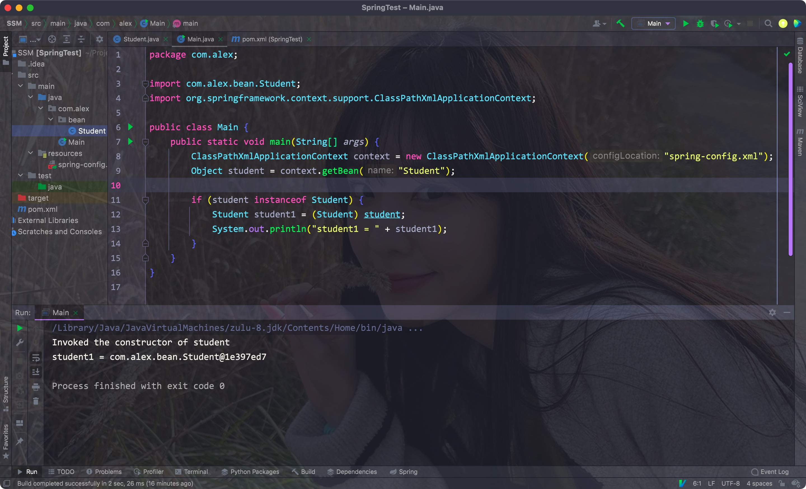
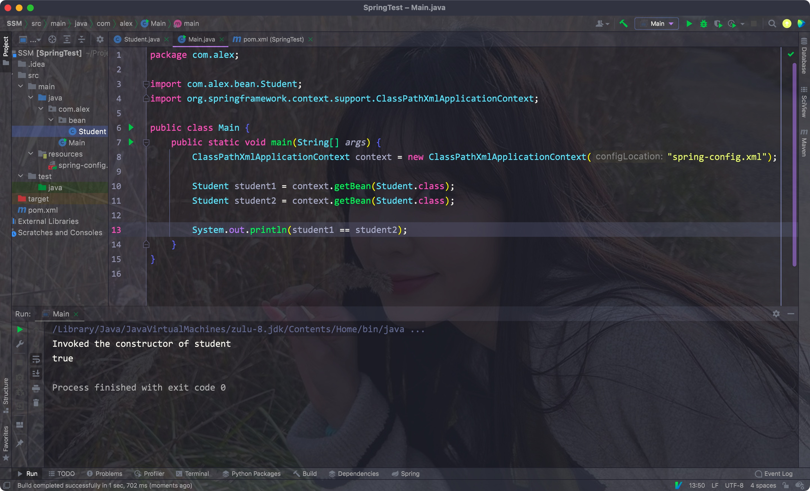

# 一、理论

- 在之前的项目结构中，我们需要在多个Servlet中获取Service的实现类，而Servlet查询数据时又依赖于Mapper

- 该种构建项目的方式会使多个模组相互依赖，耦合度很高
- 如果想要替换掉其中一个模组，另外的地方都要修改，开发用时很长
- Spring的主要目的就是为了将各个模组解耦，它就是为了简化开发而生，它是轻量级的**IoC**和**AOP**的容器框架，主要是针对**JavaBean**的生命周期进行管理的轻量级容器


## 1. JavaBean

- JavaBean其实就是所有字段属性带有Setter和Getter，且字段都被private修饰的类


## 2. IoC理论

- 因为之前的开发方式中，各个部分间都无法离开彼此，不便于模块化开发
- IOC是Inversion of Control的缩写，翻译为：“控制反转”，把复杂系统分解成相互合作的对象
- 这些对象类通过封装以后，内部实现对外部是透明的，从而降低了解决问题的复杂度，而且可以灵活地被重用和扩展。


之前的各模组关系:


使用IOC容器后:


- IoC会为我们管理类，需要都由IoC动态提供
- 当我们需要一个接口的实现时，由它根据配置文件来决定到底给我们哪一个实现类，这样，我们就可以不用再关心我们要去使用哪一个实现类了
- 我们只需要关心，给到的一定是一个可以正常使用的实现类

<hr>


# 二、初入

- 需要注意的是，IoC容器的目的是解耦，而不是减少代码量


- 我们首先学习的是Core Container里的内容


## 1. 第一个Spring程序

- 我们首先创建一个空的Maven项目，再直接引入Spring的依赖

Eg:


- 导入后，我们需要在resources目录下创建一个Spring的xml配置文件，文件名随意

Eg:


- 创建后会提示创建新的应用上下文，按照提示创建即可


- 在主方法中加载配置文件，并创建一个应用上下文:

```java
ClassPathXmlApplicationContext context = new ClassPathXmlApplicationContext("spring-config.xml");
```


我们的目的是让IoC容器为我们创建对象，为此，**我们需要在spring的配置文件中注册对应的类**


我们将类单独放在一个bean目录下，再将类的别名和路径写在spring配置文件的<beans>标签内(单独写在单标签bean中)

Eg:


- 注意: 注册时对应类的name标签属性必须唯一，id标签同name的作用一样


- 通过IoC容器创建一个对象:
    - 通过创建的context对象，调用getBean方法，其中传入Spring中类的注册别名或者类的Class对象

Eg:



<hr>


## 2. 创建bean实例的两种模式

- singleton: 单例模式(默认的模式)
- prototype: 原型模式


按照之前创建对象的方法，获取到的同一个类的多个实例其实是同一个:



从构造方法的调用上看，IoC容器默认只会使用单例模式创建一个唯一的对象


- IoC容器默认情况下会在创建Context实例的时候就为注册的Bean创建一个实例对象(在加载配置文件的时候就开始了)

Eg:


- 想要IoC容器在创建对象示例时分别创建不同的示例，则需要在注册Bean的时候在配置中添加属性，将scope属性设置为"prototype"即可

Eg:

```xml
<bean name="classAlias" class="path" scope="prototype"/>
```


<hr>


## 3. 初始化方法和销毁方法

- 我们可以在Spring配置文件中对Bean对象进行注册的时候就指定初始化和销毁该对象的方法
- 注意：**只有scope为默认值singleton时，才能够调用destroy方法**
- **只有在Context实例手动关闭后，才会调用destroy方法**

Eg:


<hr>


## 4. 指定Bean对象加载的次序

- 我们可以通过在一个bean标签内添加depends-on标签指定当前bean对象需要依赖的类
- 此时该依赖类则会在其加载前进行加载

Eg:


- 很明显，IoC容器加载Bean的时候是默认按照bean的顺序来的


我们可以在Student对于的bean标签后添加一个depends-on标签让其依赖的bean先加载

Eg:


<hr>


# 三、依赖注入

为每个注册的bean的成员属性进行赋值的过程就是依赖注入，即将预先给定的属性注入到对象中

**注意：注入成功的前提是该字段已经设置了setter**

使用property标签即可


## 1. 基础类型

- 我们可以在Spring的xml配置文件中，在每对bean标签内添加对应的property标签即可


Eg:

```xml
<property name="fieldName" value="fieldValue"/>
```


<hr>


## 2. 自定义的引用类型

- 如果该Bean类中的字段有我们自定义的其他Bean类型
- 那么需要先注册该Bean类型，再使用ref代替value，注意ref里的值是该Bean对应的alias

Eg:


<hr>


## 3. list/map字段

在property标签内，使用list标签即可，list标签使用value标签，其中的type属性指定了元素的类型

```xml
<list>
  <value type="type_name">actual_value</value>
  <value type="type_name">actual_value</value>
  <value type="type_name">actual_value</value>
</list>
```


Eg:


- 对于map类型的字段，我们只需要将list改为map，将value改为entry，其中的属性变为key和value即可

```xml
<map>
	<entry key="keyName" value="val"/>
</map>
```


Eg:


<hr>


## 4. 使用自动装配

- 使用的前提是需要装配的字段有setter方法，且对应的class类已经被加载到到了IoC中


- 在bean标签中添加一个autowire属性即可
    - byType: 根据类型自动装配
    - byName: 根据setter中的字段名称来自动装配对于的bean


<hr>


## 5. 指定构造方法

- Spring默认会使用空参构造方法，通过constructor-arg标签指定调用构造方法中参数列表的变量名、类型或者参数的索引

Eg:

```xml
<constructor-arg name="argName" value="val"/>
<constructor-arg index="indexNum" value="val"/>
```


- type: 参数的类型
- index: 参数在参数列表中的索引位置
- name: 参数的名称

<hr>


