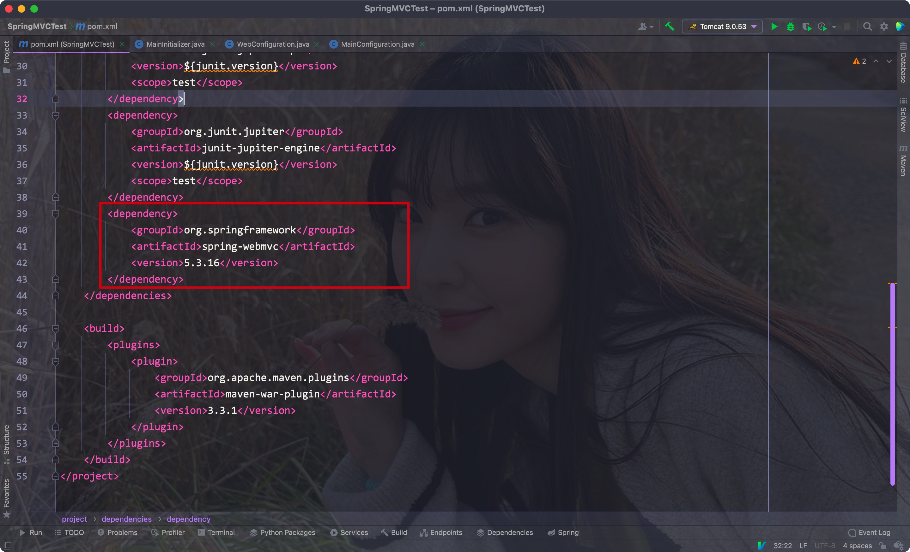
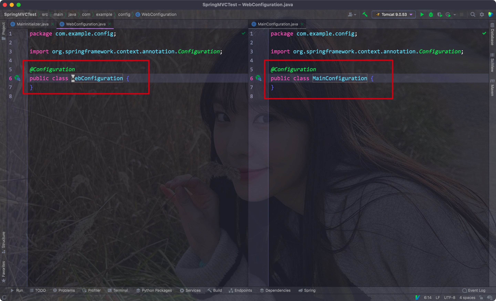
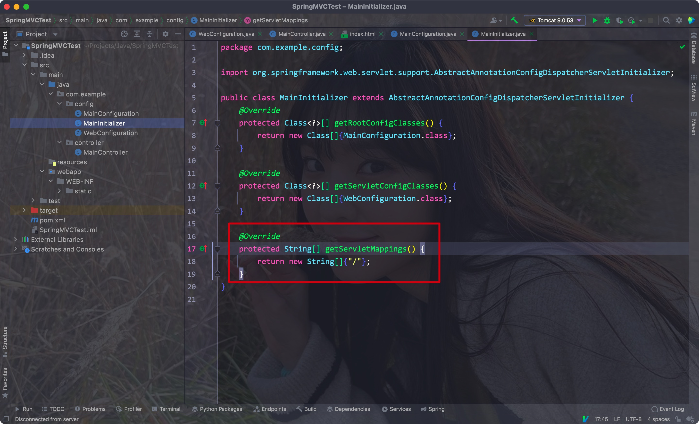
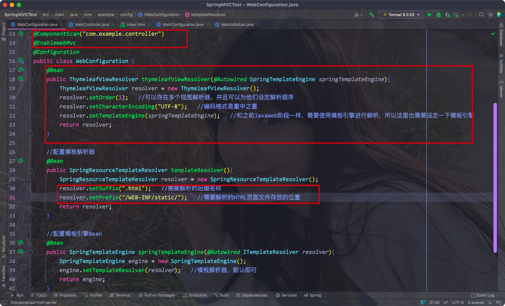
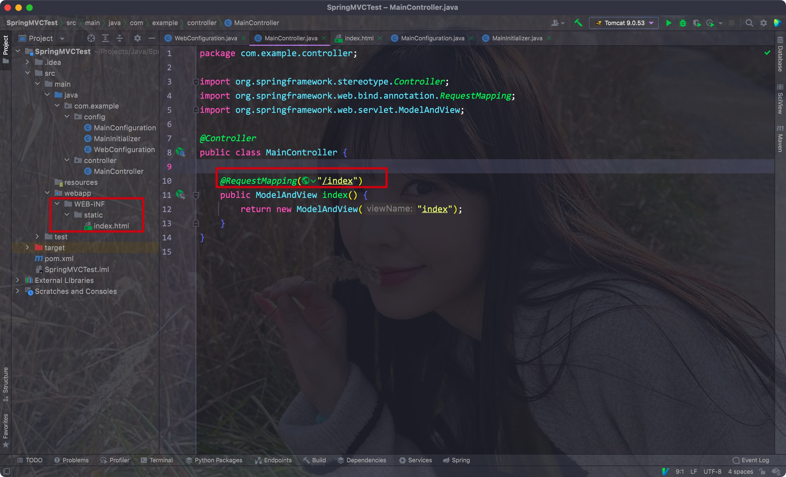
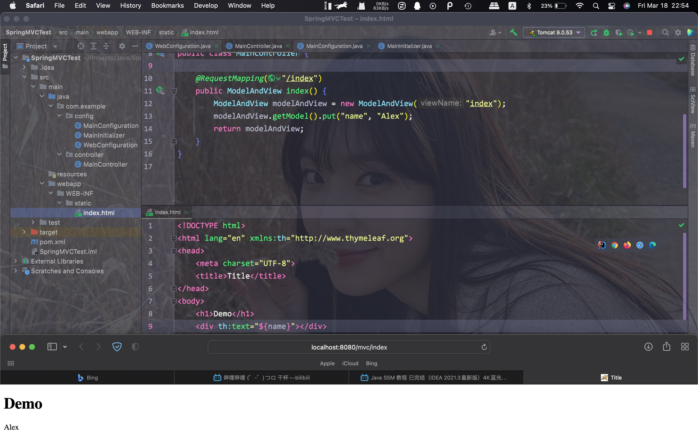
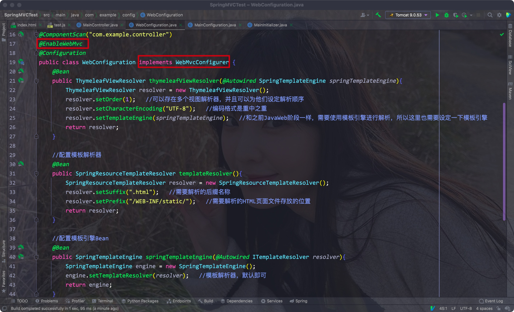
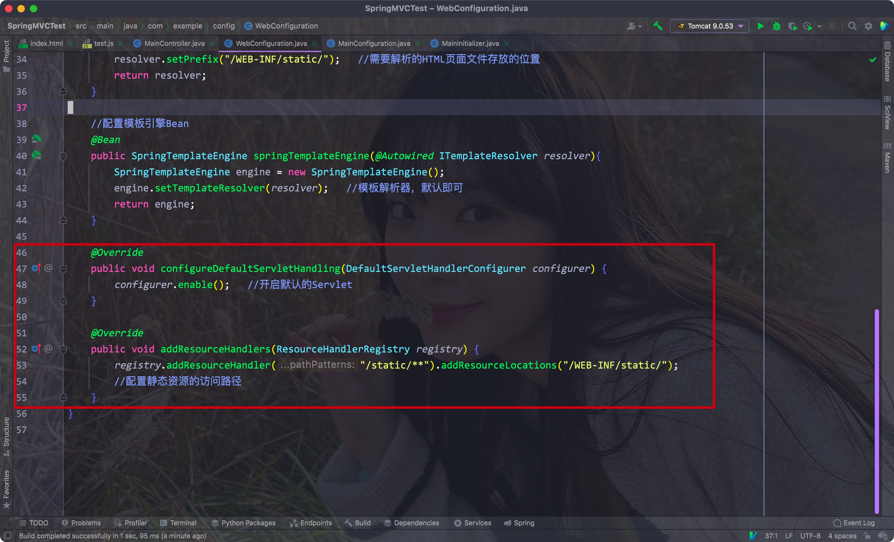
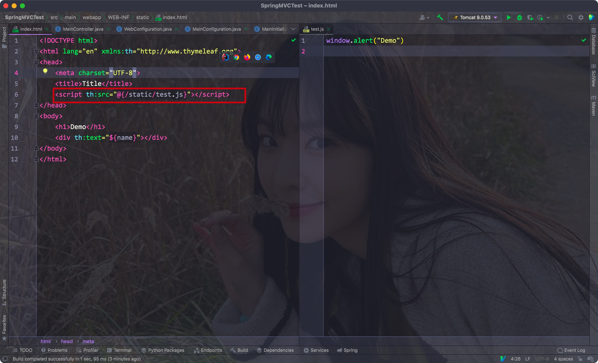

# 一、理论

业务中，我们通常参照一下流程来实现:


而在之前使用Servlet实现表示层的过程中，几个小功能通常需要我们编写好几个Servlet程序才能实现

SpringMVC就是为了解决这个问题而诞生的表示层框架(在SSH时期是Struts)，MVC的释义:

- M: model，即对应的数据模型(实体类)
- V: view，即前端的页面
- C: controller，即控制器(代替了Servlet来处理各种请求)


SpringMVC将这三种进行了解耦，最后将View和Model结合起来进行渲染(即Thymeleaf)

<hr>


# 二、配置

- 目前SpringMVC不支持Tomcat 10，所以需要使用Tomcat9


## 1. 依赖

我们需要引入名为spring-webmvc的依赖，其包括了之前Spring的一些依赖

Eg:



<hr>


## 2. 配置文件

- 这里我们就不再需要web.xml了，只需要一个AbstractAnnotationConfigDispatcherServletInitializer的实现子类即可
- 其中需要重写三个方法:
    - 其中getRootConfigClasses方法是用来获取Spring基础配置类的(Service层)
    - getServletConfigClasses方法是用来获取与web相关的配置的(Controller，DispatcherServlet等)


为了取代web.xml，我们需要让Tomcat使用DispatcherServlet:


- 为了能够成功地重写这三个方法，我们需要创建两个配置类

Eg:




记得添加"/"映射路径



<hr>


# 三、配置Controller和ViewResolver


## 1. 逻辑

- 之前我们配置了DispatcherServlet，现在所有的请求都会经由它同一分配

Eg:


- DispatcherServlet会根据对应的路径选择合适的Controller处理，处理完成后会返回一个ModelAndView对象(即前端页面)
- 之后视图解析器会将该对象处理为一个View并交由DispatcherServlet返回给Client
- 我们其实只需要写Controller和ViewResolver即可

<hr>


## 2. Controller/ViewResolver

- 我们这里选择Thymeleaf作为视图解析器，依赖如下

```xml
<dependency>
  <groupId>org.thymeleaf</groupId>
  <artifactId>thymeleaf-spring5</artifactId>
  <version>3.0.12.RELEASE</version>
</dependency>
```


- 视图解析器在Servlet层，所以我们需要写在WebConfig类中
- 同样我们需要使用ComponentScan注册Controller
- 再使用@EnableMVC标记为Web

Eg:




- 在Controller中，在方法上使用@RequestMapping设置对应的路径
- 方法中直接返回一个ModelAndView对象即可，参数即为我们构建的View的文件名(在WebConfig中会将对应的路径和后缀拼接完整)

Eg:




- 同样，我们可以往model中传入对应的数据
- 之后结合Thymeleaf就能渲染出完整页面了

Eg:



<hr>


## 3. 解析静态资源

- 我们需要让Web配置类实现WebMvcConfigurer接口，并添加@EnableWEbMvc注解

Eg:






- 这里addResourceHandlers方法自动添加了对应的路径前缀

Eg:




