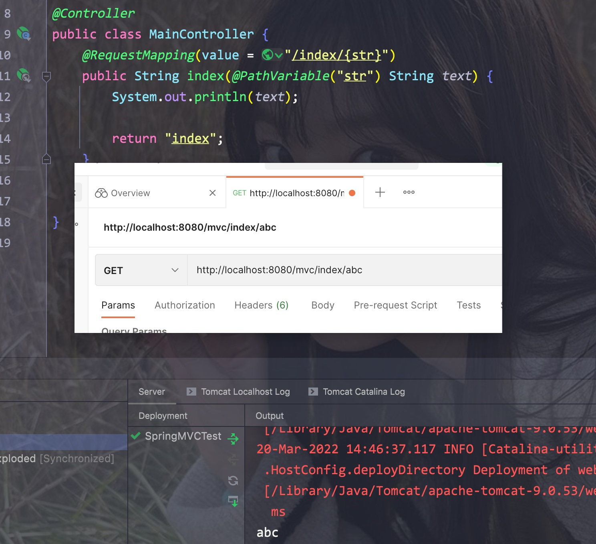

# 一、理论

业务中，我们通常参照以下流程来实现:


而在之前使用Servlet实现表示层的过程中，几个小功能通常需要我们编写好几个Servlet程序才能实现

SpringMVC就是为了解决这个问题而诞生的表示层框架(在SSH时期是Struts)，MVC的释义:

- M: model，即对应的数据模型(实体类)
- V: view，即前端的页面
- C: controller，即控制器(代替了Servlet来处理各种请求)


SpringMVC将这三种进行了解耦，最后将View和Model结合起来进行渲染(即Thymeleaf)

<hr>


# 二、配置

- 目前SpringMVC不支持Tomcat 10，所以需要使用Tomcat9


## 1. 依赖

我们需要引入名为spring-webmvc的依赖，其包括了之前Spring的一些依赖

Eg:


<hr>


## 2. 配置文件

- 这里我们就不再需要web.xml了，只需要一个AbstractAnnotationConfigDispatcherServletInitializer的实现子类即可
- 其中需要重写三个方法:
    - 其中getRootConfigClasses方法是用来获取Spring基础配置类的(Service层)
    - getServletConfigClasses方法是用来获取与web相关的配置的(Controller，DispatcherServlet等)


为了取代web.xml，我们需要让Tomcat使用DispatcherServlet:


- 为了能够成功地重写这三个方法，我们需要创建两个配置类

Eg:


记得添加"/"映射路径


<hr>


# 三、配置Controller和ViewResolver


## 1. 逻辑

- 之前我们配置了DispatcherServlet，现在所有的请求都会经由它同一分配

Eg:


- DispatcherServlet会根据对应的路径选择合适的Controller处理，处理完成后会返回一个ModelAndView对象(即前端页面)
- 之后视图解析器会将该对象处理为一个View并交由DispatcherServlet返回给Client
- 我们其实只需要写Controller和ViewResolver即可

<hr>


## 2. Controller/ViewResolver

- 我们这里选择Thymeleaf作为视图解析器，依赖如下

```xml
<dependency>
  <groupId>org.thymeleaf</groupId>
  <artifactId>thymeleaf-spring5</artifactId>
  <version>3.0.12.RELEASE</version>
</dependency>
```


- 视图解析器在Servlet层，所以我们需要写在WebConfig类中
- 同样我们需要使用ComponentScan注册Controller
- 再使用@EnableMVC标记为Web

Eg:


- 在Controller中，在方法上使用@RequestMapping设置对应的路径
- 方法中直接返回一个ModelAndView对象即可，参数即为我们构建的View的文件名(在WebConfig中会将对应的路径和后缀拼接完整)

Eg:


- 同样，我们可以往model中传入对应的数据
- 之后结合Thymeleaf就能渲染出完整页面了

Eg:


<hr>


## 3. 解析静态资源

- 我们需要让Web配置类实现WebMvcConfigurer接口，并添加@EnableWEbMvc注解

Eg:


- 这里addResourceHandlers方法自动添加了对应的路径前缀

Eg:


<hr>


# 四、RequestMapping注解参数

其中的参数:


## 1. value/path

- 其中name和path是相同的，都表示该方法对应的访问
- 该属性为数组类型，所以可以让多种路径都经过它处理，同时还可以使用通配符
    - ?: 代表任意一个字符
    - *: 代表任意多个字符
    - **: 代表当前目录下的任意目录


Eg:


- 该注解放在类上的话，就会为所有的方法加上前缀

Eg:

<hr>


## 2. method

- 该属性可以用来限制请求的类型

Eg:


这些请求方法都有对应的衍生注解:
Eg:


<hr>


## 3. params

- 通过该属性可以限定请求中所携带属性的类型，同时可以使用!取反或者关系运算符

Eg:


<hr>


## 4. header属性

- 其用法和params差不多，但限定的是请求头中的内容

Eg:


- 该示例中，我们拦截了一切带有connection请求头的request

<hr>


# 五、@RequestParam和@RequestHeader


## 1. @RequestParam

- 该注解写在Controller方法的参数列表中，可以用来直接获取对应的参数


其他参数:


- 其中value和name是可以互换使用的
- 在没加上required属性的情况下，默认为true(必须要有才能访问)
- 我们也可以使用defaultValue属性，手动为其添加对应的默认值

Eg:


- 如果请求的参数和方法中的参数同名的话，其实可以直接获取
- 更有甚者，如果请求参数中的内容和方法中的实体类对应的话，**可以直接包装为一个实体类**
- 该实体类甚至不需要注册为bean

Eg:


<hr>


## 2. @RequestHeader

Eg:


<hr>


# 六、@CookieValue和@SessionAttribute

这两个注解所拥有的属性和前面的@RequestMapping和@RequestHeader差不多


## 1. @CookieValue

- 通过在控制器对应的方法参数中添加该注解即可获取对应的Cookie值

Eg:


- 注意，这里我们使用了HttpServletResponse对象实例来存放对应的Cookie

<hr>


## 2. @SessionAttribute

- 注意我们需要在参数列表中使用HttpSession来自动获取请求中的Session
- 设置Session的方法为"setAttribute"

Eg:


<hr>


# 七、请求转发和重定向

记得要将需要请求转发/重定向的方法对应的返回值改为String


- 请求转发只需要在需要在需要转发的方法return中写上: "forward:forwardPath"即可

Eg:


- 重定向则只需要写上: "redirect:path"即可

Eg:


<hr>


# 八、BeandeWeb作用域/生命周期

在Spring中，Bean的作用域包括了singleton和prototype，但在SpringMVC中会进一步细分:

- request: 每次http请求都会生成一个新的实例，请求结束后bean也会消失
- session: 对于每个会话来说都会生成一个新的实例(关闭浏览器就是关闭一个回话)


Eg:

@RequestScope注解下，每次请求都会创建新的实例


@SessionScope注解下，每个会话都会有一个新的实例

Eg:


- 默认情况下会使用单例模式，所以不管是否为同一个请求或者同一个回话，其都只会返回一个实例对象

<hr>


# 九、RestFul风格

- 其作用是利用http协议的特性，将参数通过URL拼接传给服务器


Eg:

我们的请求为:

`http://localhost:8080/mvc/index/abc`


- 只需要在Controller对应的方法中，在RequestMapping注解的路径后添加一个{"路径变量名"}
- 在方法的参数中添加一个使用了@PathVariable注解的形参即可(注解中的属性为其对应的路径变量名)

Eg:



<hr>


## 1. 不同的请求方法

按照功能，我们可以对URL划分:

- POST : .../mvc/index 添加用户信息，携带表单
- GET: .../mvc/index/{id} 获取用户信息，id直接放在URL里
- PUT: .../mvc/index 修改用户信息，携带表单
- DELETE: .../mvc/index/{idx} 删除用户信息，id放在URL里


对应的请求映射方法:


<hr>


# 十、拦截器

拦截器的作用与Filter类似，但Filter作用于Servlet之前

而拦截器会在Servlet与RequestMapping之间，即DispatcherServlet在将请求交给对应的Controller之前先交给拦截器

- 拦截器只会拦截所有Controller中定义的请求映射路径，不会拦截静态资源

Eg:


<hr>


## 1. 创建拦截器

- 我们需要创建一个类，其需要实现HandlerInterceptor接口(该接口中都是默认方法)

Eg:

```java
public class MainInterceptor implements HandlerInterceptor {
    @Override
    public boolean preHandle(HttpServletRequest request, HttpServletResponse response, Object handler) throws Exception {
        System.out.println("我是处理之前");
        return true;
    }

    @Override
    public void postHandle(HttpServletRequest request, HttpServletResponse response, Object handler, ModelAndView modelAndView) throws Exception {
        System.out.println("我是处理之后");
    }

    @Override
    public void afterCompletion(HttpServletRequest request, HttpServletResponse response, Object handler, Exception ex) throws Exception {
        System.out.println("我是完成之后");
    }
}
```


创建之后，我们需要在Web配置类中重写**addInterceptor**方法，使用其提供的参数"registy"

调用**addInterceptor**方法传入一个对应的拦截器实例对象

调用**addPatterns**方法设置其拦截的路径规则

调用**excludePathPatterns**方法设置不进行连接的路径


Eg:


- 在整个流程结束后才会调用afterCompletion方法
- 如果在preHandle方法中直接返回false，则会直接终止流程

Eg:


- 如果在放行后，controller对应方法处理中抛出了异常的话，则不会执行postHandle方法
- 但之后还是会执行afterCompletion方法

<hr>


## 2. 多级拦截器

- 创建一个SubInterceptor类，同样在Web配置类中调用addInterceptor方法进行注册

Eg:


- 拦截器拦截的顺序就是其在web配置类中注册的顺序

Eg:


如果前面的拦截器在preHandle中返回了false，那么和单个拦截器一样便不再继续了

<hr>


# 十一、自定义异常处理

如果Controller的方法中出现了异常，那么其会默认出现一个页面

Eg:


如果不想在出现异常的时候返回默认页面，而是我们自己的页面呢？


- 首先创建一个Controller类用来处理异常，**该类需要使用@ControllerAdvice注解**
- **其中的方法使用@ExceptionHandler注解**，其中的**属性代表该方法处理的异常种类**
- 在方法中可以将异常对象放入参数列表中

Eg:


<hr>


# 十二、文件上传下载


## 1. 文件上传

- 在SpringMVC中，我们需要在Web配置中注册一个Resolver的bean


在配置前我们需要引入依赖，该依赖还包含了commons.io

Eg:

```xml
<dependency>
  <groupId>commons-fileupload</groupId>
  <artifactId>commons-fileupload</artifactId>
  <version>1.4</version>
</dependency>
```


配置一个Resolver:

```java
@Bean("multipartResolver")
public CommonsMultipartResolver commonsMultipartResolver() {
  CommonsMultipartResolver resolver = new CommonsMultipartResolver();
  resolver.setMaxUploadSize(1024 * 1024 * 10);
  resolver.setDefaultEncoding("UTF-8");

  return resolver;
}
```


- 之后我们只需要编写对应的Controller方法即可

Eg:

```java
@RequestMapping(value = "/upload", method = RequestMethod.POST)
@ResponseBody
public String upload(@RequestParam CommonsMultipartFile file) throws IOException {
  File fileObj = new File("/Users/alex/Desktop/test.html");
  file.transferTo(fileObj);
  System.out.println("用户上传的文件已保存到：" + fileObj.getAbsolutePath());
  return "文件上传成功！";
}
```


- 在前端页面中设置一个上传表单:

Eg:


<hr>


## 2. 文件下载

- 对于下载，我们只需要使用HttpServletResponse实例，设置响应的内容类型
- 通过该响应获取一个输出流，为传输给用户的文件建立一个输入流
- 最后通过commons.io中的copy方法将输入流复制给输出流即可

Eg:

```java
@RequestMapping(value = "/download", method = RequestMethod.GET)
@ResponseBody
public void download(HttpServletResponse response) {
  response.setContentType("multipart/form-data");

  try (FileInputStream fileInputStream = new FileInputStream("/Users/alex/Desktop/test.html")) {
    ServletOutputStream fileOutputStream = response.getOutputStream();
    IOUtils.copy(fileInputStream, fileOutputStream);
  } catch (IOException e) {
    e.printStackTrace();
  }
}
```


