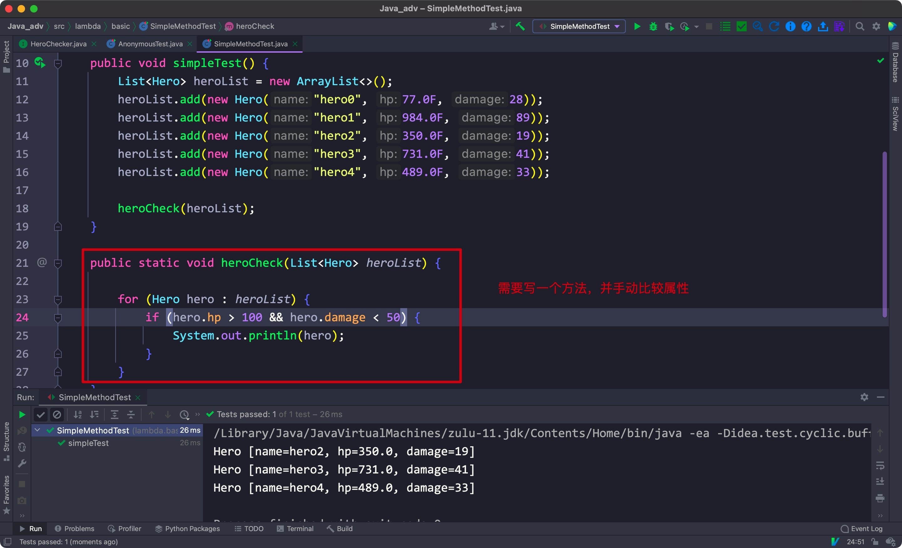
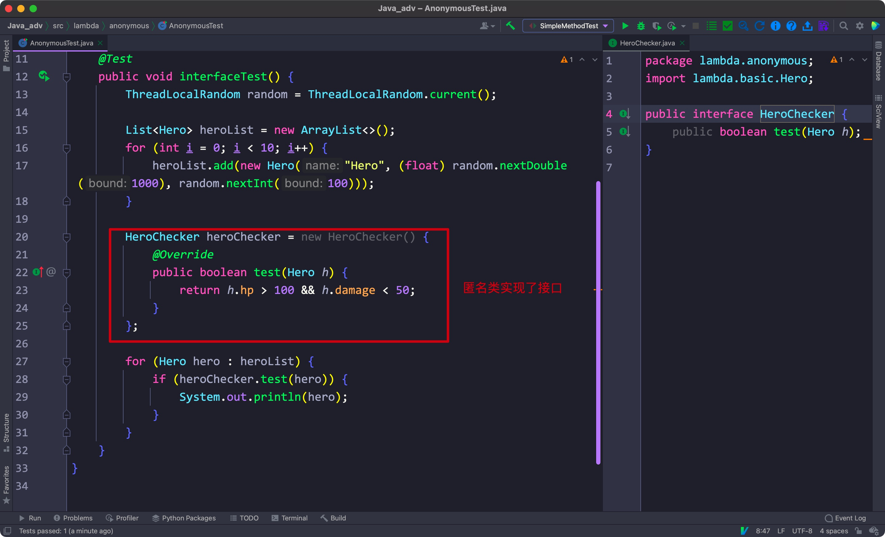
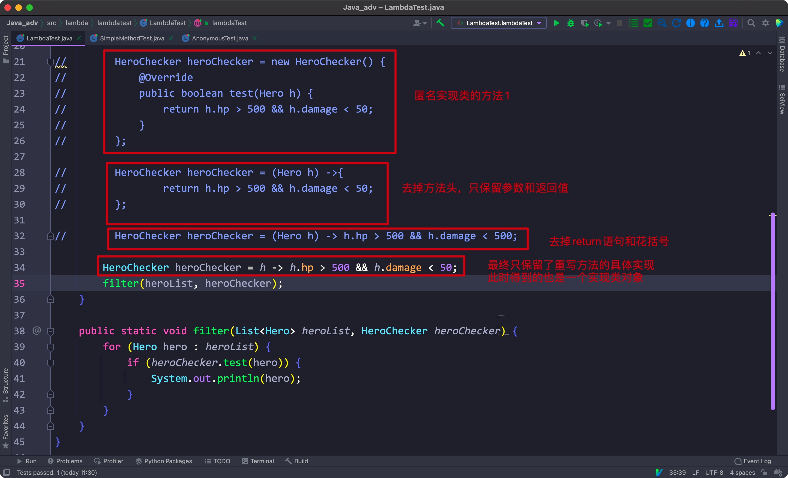
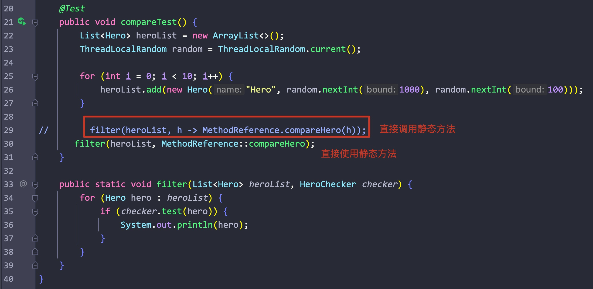

# 一、StackTrackElement

- 属于java.lang下，用于操作堆栈跟踪


相关方法:


构造方法:

- StackTraceElement(String declaringClass, String methodName, String fileName, int lineNumber)	
- StackTraceElement(String classLoaderName, String moduleName, String moduleVersion, String declaringClass, String methodName, String fileName, int lineNumber)


实例方法:

- boolean equals(Object obj): 
- String getClassLoaderName(): 返回该元素表示位置的**类加载器**的名称
- String getClassName(): 返回该元素表示位置的**类**的名称
- String getFileName(): 返回该元素表示位置的**源文件**的名称
- int getLineNumber(): 返回该元素表示位置的**源码位置**的行号
- String getMethodName(): 返回该元素表示位置的**方法**的名称
- String getModuleName():返回该元素表示位置的**模块**的名称
- String getModuleVersion(): 返回该元素表示位置的**模块版本**的名称
- int hashCode():
- boolean isNativeMethod():
- String toString():


****


# 二、Enum

- 用于创建枚举类，固定相关的值
- 创建相关对象时，直接调用枚举类中的字段来创建对象
- 使用对象时，直接通过类调用，获取通过方法来查找即可


## 1.创建

-  构造方法应该设置为private，不能新增enum类里的值，否则就不起限制作用了
- 每个实例都应该大写
- 如果有字段，则在实例后面添加括号


exam:


相关方法


构造方法: 

- protected Enum(String name, int ordinal): 仅有的构造方法


实例方法:

- int compareTo(E e): 对比和参数在类中的顺序
- boolean equals(Object other): 如果参数非该枚举类，返回false
- Class<E> getDeclaringClass(): 返回当前枚举对象所属的类
- String name(): 返回当前枚举类型的字面量
- int ordinal(): 返回当前枚举类型在枚举类中声明的位置
- String toString():
- static <T extends Enum<T>> T valueOf(Class<T> enumType, String name): 返回指定枚举类中，指定名称的枚举对象所属的枚举类类


****


# 三、Multi Thread

- 在未使用多线程之前，我们只有一个线程(main主线程)
- 我们可以在处理其他类的时候，在该类的对象上创建一个新的线程，可以提供运行效率
- 想要在一个类的对象上创建一个新的线程，该类必须继承Thread类，或者实现Runable接口，两者都需要重写run()方法


## 1) 基础

1.创建一个实现Runnable接口的类，重写run()方法:


2.在main()中创建该对象，并将其传入Thread的构造方法中:


- 使用start()方法开始该线程


## 2) Thread

- 属于java.lang包下，其实现了implements类


相关方法:


构造方法:

- Thread(): 创建一个线程
- Thread(Runnable target): 接收一个Runnable对象(或者其实现类)，以此创建一个线程
- Thread(Runnable target, String name): 接收一个字符串，将其作为线程名称
- Thread(String name): 接收一个字符串，将其作为线程名称


静态方法:

- static Thread CurrentThread(): 返回当前线程
- void interrupt(): 打断该线程
- boolean isInterrupted(): 判断该线程是否被打断
- static void sleep(long milis): 将该线程指定休眠时间，参数为毫秒值


## 3) synchronized

- volatile: 修饰变量，使得其作为共享内存，而不会保存在本地缓存中

volatile: 易变的，不稳定的


# 四、args参数

- 使用java命令调用.class文件时，在java命令后的输入内容即为参数，会被保存在args数组中，可以在程序中将其输出


****


# 五、Lombda表达式

- 函数式风格，进一步简化匿名实现


情景:

给你一个Hero类，和一个包含Hero类的集合，请你输出其中hp > 100且damage < 50的英雄


## 5.1 以往的方法

- 在一个方法中手动比较英雄的属性:




## 5.2 通过匿名类实现接口的方法




## 5.3 简化为lambda表达式



- 该lambda表达式整体就是一个匿名的实现类对象，其将一个方法的实现作为参数传入了方法中


## 5.3 lambda的缺点

- 可读性差
- 不便于维护，不方便调试
- 有版本限制jdk8才开始支持


## 5.4方法引用


### 1) 引用静态方法

- 可以在lambda表达式中直接调用静态方法

syntax:

```java
method(param -> Class.staticMethod(param))
```




- 也可以直接引用静态方法

```java
method(h -> Class::staticMethod);
```


