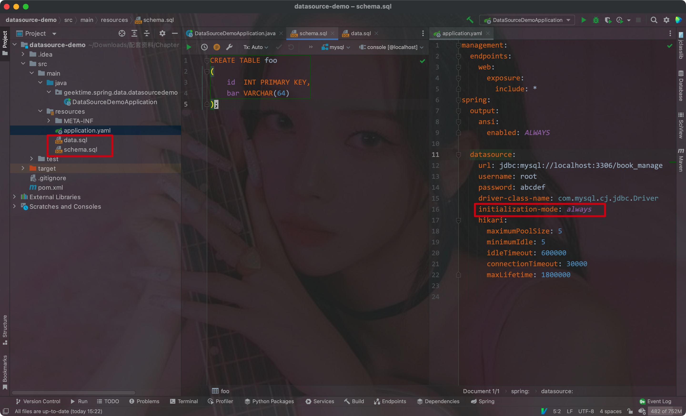

# 一、初入


## 1. 配置一个Spring项目

可以在https://start.spring.io上配置Spring项目:

- 在其中可以选择构建工具(Maven/Gradle)、语言(Java, Kotlin, Groovy)，SpringBoot的版本，项目的具体信息，打包的方式，Java的版本等等
- 在右边可以选择添加对应的依赖


点击生成后，会生成一个压缩文件包，解压后导入至IDEA即可(注意需要设置项目的Java版本，并加载Maven的pom.xml文件):


<hr>


## 2. Hello World

`HelloSpringApplication.java`文件中的`main`方法就是整个Spring项目的入口


编写一个Controller:

- 在HelloSpringApplication类上添加一个`@RestController`注解
- 在类中添加一个hello方法，该方法有一个`@RequestMapping`注解


添加好注解后直接运行该程序，此时会在8080端口开启一个Tomcat服务器:


通过curl命令即可访问该Controller:


我们导入了Actuator工具，访问actuator/health路径可以查看当前项目的状态:


补充:

1. `@RestController`:

该注解等同于`@Controller` +` @ResponseBody`

@Controller: 

> 将被其修饰的类注入到SpringBoot的IoC容器中，使得项目运行时，该类就被实例化，即该类充当`Controller`的作用


@ResponseBody:

> 指定被修饰的类中所有的API接口返回的数据都以JSON字符串的形式返回


2. curl:

一个利用URL规则在命令行下工作的文件传输工具，其支持文件的上传和下载


3. Actuator:


通过在项目中引入该依赖，可以直接访问项目的`/actuator/health`路径查看项目的状态

也可以访问`/actuator/beans`查看项目中注册的bean，返回的数据都是JSON格式，所以需要安装对应的浏览器插件才可以方便地查看

通过访问`/actuator/mappings`可以查看所有web的URL映射

通过访问`/actuator/env`可以查看所有的环境信息


默认情况下，只开放了`health`和`info`，想要手动开启其他的路径访问，需要在配置文件中填写:

```properties
management.endpoints.web.exposure.include=health, beans, info
```

<hr>


## 3. 打包和运行

通过maven中的package插件，我们可以将项目打包为一个`.jar`文件，然后只需要使用`java -jar`命令即可运行该项目:


<hr>


# 二、Spring数据操作


## 1. JDBC

数据源的通用配置:


### 1) 配置数据源

必要的内容:

```yaml
spring:
  datasource:
    url: "jdbc:mysql://localhost/test"
    username: "dbuser"
    password: "dbpass"
```


导入对应的依赖:

- JDBC API
- MySQL Driver

```xml
<dependency>
  <groupId>org.springframework.boot</groupId>
  <artifactId>spring-boot-starter-jdbc</artifactId>
</dependency>
<dependency>
  <groupId>mysql</groupId>
  <artifactId>mysql-connector-java</artifactId>
  <version>8.0.28</version>
</dependency>
```


通用的配置:

```yaml
spring:
	datasource:
    url: jdbc:mysql://localhost:3306/book_manage
    username: root
    password: abcdef
    driver-class-name: com.mysql.cj.jdbc.Driver
```


> 默认的数据库连接池为HikariCP

- 设置HikariCP的配置:

```yaml
spring:
	datasource:
      hikari:
        maximumPoolSize: 5
        minimumIdle: 5
        idleTimeout: 600000
        connectionTimeout: 30000
        maxLifetime: 1800000
```


导入配置后，通过`@Resource`注解即可自动注入`JdbcTemplate`实例对象进行JDBC操作:


JdbcTemplate文档:

https://docs.spring.io/spring-framework/docs/current/javadoc-api/org/springframework/jdbc/core/JdbcTemplate.html


其他人的博客:

https://www.cnblogs.com/caoyc/p/5630622.html


- 通过在配置文件中设置`initialization-mode: always`，即可自动加载`resources`目录下的.sql文件并运行:

```yaml
spring:
  datasource:
    initialization-mode: always
```



---


### 2) 配置多个数据源

- 首先需要在配置文件中填写多个数据源的基本信息

Eg:

```properties
management.endpoints.web.exposure.include=*
spring.output.ansi.enabled=ALWAYS

foo.datasource.url=jdbc:mysql://localhost:3306/sql_practice
foo.datasource.username=root
foo.datasource.password=abcdef
foo.datasource.driver-class-name=com.mysql.cj.jdbc.Driver

bar.datasource.url=jdbc:mysql://localhost:3306/book_manage
bar.datasource.username=root
bar.datasource.password=abcdef
bar.datasource.driver-class-name=com.mysql.cj.jdbc.Driver
```

- 这里我们用不同的开头来区分不同的数据源，而不是使用默认的`spring`


在运行主类中加载两个数据源并获取它们的url:


结果:


注意:

1. 多彩输出

如果终端支持ANSI，设置彩色输出会让日志更具可读性。通过在`application.properties`中设置`spring.output.ansi.enabled`参数来支持。


2. 自动配置排除

在`@SpringBootApplication`注解中，通过指定`exclude`的值即可排除对应的自动配置类:

```java
@SpringBootApplication(exclude = {DataSourceAutoConfiguration.class,
                              DataSourceTransactionManagerAutoConfiguration.class,
                                  JdbcTemplateAutoConfiguration.class})
```


3. `@ConfigurationProperties("")`

我们可以通过该注解自动加载配置文件中对应的配置

> 在方法上使用该注解时，该方法必须有`@Bean`注解，且其所在的类上必须有`@Configuration`注解(@SpringBootApplication注解中含有)


说明文章:

https://cloud.tencent.com/developer/article/1870740

---


### 3) 数据库连接池


- HikariCP

官网:

https://github.com/brettwooldridge/HikariCP


在Spring Boot1.x中，默认会使用Tomcat作为数据源，所以想要使用HikariCP时还需要先排除掉Tomcat的数据源

在Spring Boot2.x中，会默认使用HikariCP作为数据库连接池

常规的配置项:


- Druid

官网:

https://github.com/alibaba/druid


在Wiki常见问题一栏中可以看到其各种使用上的方法解答:


使用时的注意事项:

1. 因为SpringBoot2.x默认使用的是HikariCP，所以我们需要先在JDBC依赖中排除掉它:

```xml
<dependency>
  <groupId>org.springframework.boot</groupId>
  <artifactId>spring-boot-starter-jdbc</artifactId>
  <exclusions>
    <exclusion>
      <groupId>com.zaxxer</groupId>
      <artifactId>HikariCP</artifactId>
    </exclusion>
  </exclusions>
</dependency>
```


2. Druid依赖需要我们手动导入:

```xml
<dependency>
  <groupId>com.alibaba</groupId>
  <artifactId>druid-spring-boot-starter</artifactId>
  <version>1.1.10</version>
</dependency>
```


使用Druid对密码进行加密的操作:

1. 首先在命令行中进入jar包所在的路径中，然后运行命令:

```shell
java -cp druid-1.0.16.jar com.alibaba.druid.filter.config.ConfigTools 自己的密码
```


2. 之后会生成私钥、公钥和加密后的密码:


3. 将公钥和密码写在配置文件中，并启用加密配置


加密配置:

```properties
spring.datasource.druid.connection-properties=config.decrypt=true;config.decrypt.key=${public-key}
# 启用ConfigFilter
spring.datasource.druid.filter.config.enabled=true
```

---


补充:

- `@Component`注解: 注册一个通用的bean
- `@Repository`: 注册一个与Dao相关的类为bean
- `@Service`: 注册一个服务类为bean
- `@Controller`: 注册一个Controller类为bean
- `@RestController`: 注册一个类为Restful风格的bean(返回的数据都是JSON)


<hr>


### 4) 常用注解


- config
    - @Configuration: 将当前类注册为配置类
    - @ImportResource: 将配置文件以外的配置导入进来
    - @ComponentScan: 指定包扫描的路径
    - @Bean: 将方法返回的作为Bean保持在Context中
- bean定义
    - @Component: 定义类为bean
    - @Repository: 标明访问数据库的类为bean
    - @Service: 注册一个服务层的类为bean
    - @Controller/@RestController: MVC类，后者组合了@ResponseBody
- 注入
    - @Autowired: 根据类型注入一个类
    - @Qualifier: 配合Autowired根据名字进行注入
    - @Resource: 直接根据名字进行注入
    - @Value: 获取配置文件中的值


