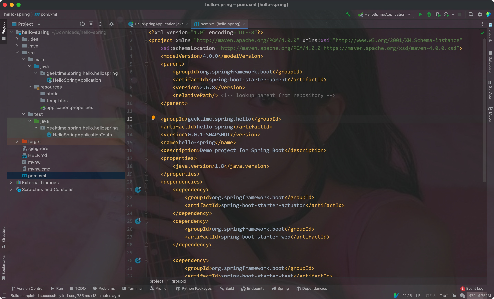

# 一、起步


## 1. 定义

- Spring的核心:

> 提供一个容器(应用上下文/ Spring application context)，它们会创建和管理应用组件
>
> 这些组件也称为`bean`，会在Spring应用的上下文中进行装配，从而形成一个完整的应用程序


- bean装配:

> 通过基于`依赖注入`(dependency injection)的模式即可实现bean的装配


在之前的版本中，Spring应用上下文会通过XML文件将多个bean装配在一起:

```xml
<bean id="inventoryService"
      class="com.example.InventoryService"/>
<bean id="productService"
      class="com.example.ProductService" />
	<construct-arg ref="inventoryService"/>
</bean>
```


但现在的版本中，都会通过Java进行配置:

```java
@Configuration
public class ServiceConfiguration {
  @Bean
  public InventoryService inventoryService() {
    return new InvetoryService();
  }
  
  @Bean
  public ProductService productService() {
    return new ProductService();
  }
}
```


Explain:

- `@Configuration`注解会告知Spring这是一个配置类，改类会为容器/上下文提供`bean`/应用组件
- 配置类的方法使用了`@Bean`注解进行了标注，表明这些方法的返回对象会作为bean添加到容器/上下文中

> 默认时，bean对应的bean ID和其定义的方法名是相同的


- 基于Java的配置会带来更强的安全性和更好的重构能力
- 不管是XML还是Java，只有当Spring不能进行自动配置时才有使用的必要


- Spring中，自动配置技术的前身是自动装配(autowiring)和组件扫描(component scanning)
- 通过组件扫描(component Scanning)，Spring可以自动发现应用路径下的组件(bean)，并创建为Spring应用容器/上下文中的bean
- 通过自动装配(autowiring)，可以为组件/bean自动注入他们依赖的其他bean/组件


- Spring Boot是Spring框架的拓展，其提供了众多的增强方法: 自动配置(autoconfiguration)等等，其自动配置的能力超过了自动装配和组件扫描


> Spring Boot大幅减少了构建应用所需的显式配置
>
> Spring XML是一种过时的方法，基于Java的配置才是主流

---


## 2. 初始化Spring应用


### 1) 通过Spring Initializer初始化Spring项目

可以在https://start.spring.io上配置Spring项目:

- 在其中可以选择构建工具(Maven/Gradle)、语言(Java, Kotlin, Groovy)，SpringBoot的版本，项目的具体信息，打包的方式，Java的版本等等
- 在右边可以选择添加对应的依赖


点击生成后，会生成一个压缩文件包，解压后导入至IDEA即可(注意需要设置项目的Java版本，并加载Maven的pom.xml文件):



---


### 2) 检查Spring项目的结构


- mvnw和mvnw.cmd:

Maven包安装器脚本(wrapper)，在没有安装Maven的情况下，也可以构建项目

- pom.xml:

Maven构建规范

- TacoCloudApplicatin:

Spring Boot主类，其会启动整个项目

- application.properties:

指定项目的相关配置

- static:

存放任意为浏览器提供服务的静态内容

- templates:

存放用来渲染到浏览器的模版文件

- TacoCloudApplicationTests.java:

简单的测试类，其用来确保Spring应用的上下文可以成功被加载


#### 构建规范

pom.xml文件包含了我们所需的所有依赖

Eg:


- 将项目打包为JAR文件是因为所有的Java云平台都能运行JAR文件，而WAR包只适合部署在常规的Java应用服务器上


- `<parent>`标签元素下的`<version>`元素表明我们的项目需要以`spring-boot-starter-parent`作为当前项目的父POM
- 这个父POM中为Spring项目提供了一些常用的库提供了依赖管理，版本统一由父POM管理，不再需要我们自己操心


- Spring Boot start依赖的特别之处在于它们本身并不包含库代码，只是传递性地拉取其他的库，这种starter依赖的三种好处:
    - 构建文件会显著减小并易于管理
    - 能够根据功能来考虑依赖
    - 不用担心库的版本


- Spring Boot插件提供的功能:
    - 提供了一个Maven goal，其允许我们使用Maven来运行应用
    - 其会确保依赖所有的库都包含在可执行的JAR文件中，并保证它们在运行时的路径下是可用的
    - 会在JAR中生成一个`manifest`文件，其会将引导类(TacoCloudApplication)声明为JAR的主类

---


#### 引导应用

> TacoCloudApplication作为主类，会在JAR运行时被执行
>
> 其还需要一个最小化的Spring配置，用来引导应用


Eg:


Explain:

- `@SpringBootApplication`是一个组合注解，其组合了其他3个其他的注解:

    - `@SpringBootConfiguraion`:

    将类`声明为配置类`，其是`@Configuration`注解的特殊形式

    - `@EnableAutoConfiguration`:

    启动Spring Boot的`自动配置`

    - `@ComponentScan`: 

    启用组件扫描: 使得其他被`@Component`、`@Controller`、`@Service`等注解声明的类能够被Spring自动发现，并注册为Spring应用容器/上下文中的组件/bean


- 改引导类中的`main()`方法会调用`SpringApplication`中的静态`run()`方法，后者会执行应用的引导过程，即`创建应用上下文/容器`
- 其中传入的参数为配置类和命令行参数

---


#### 测试应用


- 该类会确保Spring应用上下文能够成功加载
- `@SpringBootTest`会告知Junit在启动测试时添加Spring Boot的功能，可视为在`main()`方法中调用`SpringApplication.run()`

---


## 3. 编写Spring项目

- 刚开始，我们尝试为该项目添加一个主页，此时需要两个代码构件:
    - 一个控制器类，用来`处理请求`
    - 一个视图模版，用来定义主页的样子

---


### 1) 处理web请求

> Spring MVC是Spring自带的一个Web框架，其`核心是控制器(controller)的理念`

- 控制器:

> 处理器请求并以某种方式进行信息响应的类
>
> 控制器可以填充可选的数据模型并将请求传递给一个视图，然后生成返回给浏览器的HTML文件


Controller Eg:


- `@Controller`注解使得该类被扫描并设别为一个组件，并创建一个HomeController实例作为Spring应用上下文/容器中的bean


- 其中的`home()`方法该有`@GetMapping`注解，表明该方法`可以处理HTTP GET请求`，该方法只是返回一个String类型的home值
- 该返回值会被解析为视图(html文件)的逻辑名，视图的实现取决于多个因素(模版引擎的选择等)

---


#### Why is Thymeleaf?

- Thymeleaf是Spring官方指定的默认模版引擎


- 模版的名称是由逻辑视图名派生而来的，如模版路径: "/templates/home.html"
- 因此我们需要将模版放在`/src/main/resources/templates/home.html`

---


### 2) 定义视图

主页模版:


- ``标签中，使用了thymeleaf的`th:src`属性和`@{}`表达式
- 图片是相对容器/上下文的`/images/image.jpg`来引用的，静态资源是存放在`/src/main/resources/static`文件夹下的，所以对应的图片必须位于:`/src/main/resources/static/images`下

---


### 3) 测试控制器

- 我们的测试需要对路径"/"发送一个HTTP GET请求，并期望获取成功的结果，其视图名称为"home"，且内容包含"Welcome to..."

Eg:


- 注意这里只需要在类上添加`@WebMvcTest`注解，注解中添加测试的Controller即可，`不要加上@SpringBootTest注解`
- `@WebMvcTest`注解会让测试在Spring MVC应用的上下文/容器中执行，即其会将HomeController这个类注册到Spring MVC容器中，这样我们就可以向其发送请求了
- 测试类中注入的`MockMvc`实例能够让测试实现mockup(样机)

---


### 4) 构建/运行应用

- 通过IDE中的按钮即可启动整个应用，并在浏览器中访问它

Eg:


---


### 5) 了解Spring Boot DevTools

- 我们在依赖项中导入了这个依赖，其为开发者提供了一些有用的工具:
    - 代码变更后`应用自动重启`
    - 浏览器的资源(JavaScript、CSS等)发生变化时，会自动刷新浏览器
    - 自动禁用模版缓存
    - 针对H2数据库，内置了H2控制台

---


#### 应用自动重启

- 在应用加载时，该应用会被加载到JVM中的两个独立的类加载器中(Application ClassLoader和Bootstrap ClassLoader)
- 一个会加载我们自己编写的代码(项目中`src/main`下的全部内容)，这些内容经常改变；另一个会加载依赖的库，这些库不太可能改变


- 一旦探测到src/main下的代码发生改动后，`DevTools只会重新加载包含项目代码的类加载器`，另一个则保持不变，该策略能够减少应用启动的时间
- 但该自动重启策略的不足在于: `自动重启无法反映依赖项的变化`，即依赖项改变后不会自动重启，需要我们手动重启

---


#### 浏览器自动刷新和禁用模版缓存


- 禁用模版缓存

当使用Thymeleaf、FreeMaker等模版模版引擎时，会在配置的时候缓存模版解析的结果，这样就`能在提供服务的时候减少重复解析模版了`

但在开发时，我们就`无法通过刷新浏览器来查看模版变更的结果了`

DevTools则通过禁用模版缓存解决了这个问题


- 浏览器自动刷新

DevTools依赖会在项目启动的时候自动启动一个LiveReload服务器，其需要浏览器中的LiveReload插件进行配合，此时只要项目中在浏览器中呈现的内容(模版、html、样式表和JS等)发生变化时，就会自动刷新浏览器


配置步骤:

1. 在浏览器中安装Live Reload插件


2. 在项目中添加DevTools依赖

```xml
<dependency>
  <groupId>org.springframework.boot</groupId>
  <artifactId>spring-boot-devtools</artifactId>
  <scope>runtime</scope>
  <optional>true</optional>
</dependency>
```


3. 在IDEA中，修改资源后手动进行Build操作


---


#### 内置的H2控制台

- 如果我们在项目中使用了H2数据库(内置的一种数据库，不需要额外安装)，则DevTools就会自动启动H2
- 通过浏览器，我们可以在http://localhost:8080/h2-console中查看H2使用的数据

---


## 4. Spring全貌


