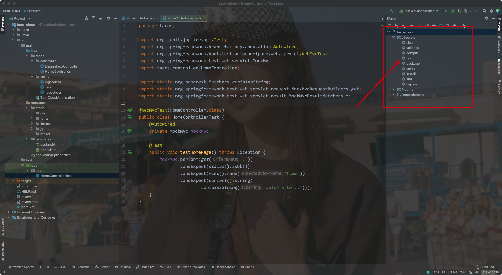

# 一、起步


## 1. 定义

- Spring的核心:

> 提供一个容器(应用上下文/ Spring application context)，它们会创建和管理应用组件
>
> 这些组件也称为`bean`，会在Spring应用的上下文中进行装配，从而形成一个完整的应用程序


- bean装配:

> 通过基于`依赖注入`(dependency injection)的模式即可实现bean的装配


在之前的版本中，Spring应用上下文会通过XML文件将多个bean装配在一起:

```xml
<bean id="inventoryService"
      class="com.example.InventoryService"/>
<bean id="productService"
      class="com.example.ProductService" />
	<construct-arg ref="inventoryService"/>
</bean>
```


但现在的版本中，都会通过Java进行配置:

```java
@Configuration
public class ServiceConfiguration {
  @Bean
  public InventoryService inventoryService() {
    return new InvetoryService();
  }
  
  @Bean
  public ProductService productService() {
    return new ProductService();
  }
}
```


Explain:

- `@Configuration`注解会告知Spring这是一个配置类，改类会为容器/上下文提供`bean`/应用组件
- 配置类的方法使用了`@Bean`注解进行了标注，表明这些方法的返回对象会作为bean添加到容器/上下文中

> 默认时，bean对应的bean ID和其定义的方法名是相同的


- 基于Java的配置会带来更强的安全性和更好的可重构性
- 不管是XML还是Java，只有当Spring不能进行自动配置时才有使用的必要


- Spring中，自动配置技术的前身是自动装配(autowiring)和组件扫描(component scanning)
- 通过组件扫描(component Scanning)，Spring可以自动发现应用路径下的组件(bean)，并创建为Spring应用容器/上下文中的bean
- 通过自动装配(autowiring)，可以为组件/bean自动注入他们依赖的其他bean/组件


- Spring Boot是Spring框架的拓展，其提供了众多的增强方法: 自动配置(autoconfiguration)等等，其自动配置的能力超过了自动装配和组件扫描


> Spring Boot大幅减少了构建应用所需的显式配置
>
> Spring XML是一种过时的方法，基于Java的配置才是主流

---


## 2. 初始化Spring应用


### 1) 通过Spring Initializer初始化Spring项目

可以在https://start.spring.io上配置Spring项目:

- 在其中可以选择构建工具(Maven/Gradle)、语言(Java, Kotlin, Groovy)，SpringBoot的版本，项目的具体信息，打包的方式，Java的版本等等
- 在右边可以选择添加对应的依赖


点击生成后，会生成一个压缩文件包，解压后导入至IDEA即可(注意需要设置项目的Java版本，并加载Maven的pom.xml文件):


---


### 2) 检查Spring项目的结构


- mvnw和mvnw.cmd:

Maven包安装器脚本(wrapper)，在没有安装Maven的情况下，也可以构建项目

- pom.xml:

Maven构建规范

- TacoCloudApplicatin.java:

Spring Boot主类，其会启动整个项目

- application.properties:

指定项目的相关配置

- static:

存放任意为浏览器提供服务的静态内容

- templates:

存放用来渲染到浏览器的模版文件

- TacoCloudApplicationTests.java:

简单的测试类，其用来确保Spring应用的上下文可以成功被加载


#### 构建规范

pom.xml文件包含了我们所需的所有依赖

Eg:


- 将项目打包为JAR文件是因为所有的Java云平台都能运行JAR文件，而WAR包只适合部署在常规的Java应用服务器上


- `<parent>`标签元素下的`<version>`元素表明我们的项目需要以`spring-boot-starter-parent`作为当前项目的父POM
- 这个父POM中为Spring项目提供了一些常用的库提供了依赖管理，版本统一由父POM管理，不再需要我们自己操心


- Spring Boot start依赖的特别之处在于它们本身并不包含库代码，只是传递性地拉取其他的库，这种starter依赖的三种好处:
    - 构建文件会显著减小并易于管理
    - 能够根据功能来考虑依赖
    - 不用担心库的版本


- 最后的Spring Boot插件提供的功能:
    - 提供了一个Maven编译目标，其允许我们使用Maven来运行应用
    - 其会确保依赖所有的库都包含在可执行的JAR文件中，并保证它们在运行时的路径中可用
    - 会在JAR中生成一个`manifest`文件，声明引导类为可执行JAR的主类(这里为TacoCloudApplication)

---


#### 引导应用

> TacoCloudApplication作为主类，会在JAR运行时被执行
>
> 其还需要一个最小化的Spring配置，用来引导应用


Eg:


Explain:

- `@SpringBootApplication`是一个组合注解，其组合了其他3个其他的注解:

    - `@SpringBootConfiguraion`:

    将类`声明为配置类`，其是`@Configuration`注解的特殊形式

    - `@EnableAutoConfiguration`:

    启动Spring Boot的`自动配置`

    - `@ComponentScan`: 

    启用组件扫描: 使得其他被`@Component`、`@Controller`、`@Service`等注解声明的类能够被Spring自动发现，并注册为Spring应用容器/上下文中的组件/bean


- 改引导类中的`main()`方法会调用`SpringApplication`中的静态`run()`方法，后者会执行应用的引导过程，即`创建应用上下文/容器`
- 其中传入的参数为配置类和命令行参数

---


#### 测试应用


- 该类会确保Spring应用上下文能够成功加载
- `@SpringBootTest`会告知Junit在启动测试时添加Spring Boot的功能，可视为在`main()`方法中调用`SpringApplication.run()`

---


## 3. 编写Spring项目

- 刚开始，我们尝试为该项目添加一个主页，此时需要两个代码构件:
    - 一个控制器类，用来`处理主页请求`
    - 一个视图模版，用来定义主页的样子
- 最后需要一个简单的测试类来测试我们的主页

---


### 1) 处理web请求

> Spring MVC是Spring自带的一个Web框架，其`核心是控制器(controller)的概念`

- 控制器:

> 处理器请求并以某种方式进行信息响应的类
>
> 控制器可以选择性地填充数据模型并将请求传递给一个视图，然后生成返回给浏览器的HTML文件


Controller Eg:


- `@Controller`注解使得该类被扫描并识别为一个组件，并创建一个HomeController实例作为Spring应用上下文/容器中的bean


- 其中的`home()`方法该有`@GetMapping`注解，表明该方法`可以处理HTTP GET请求`，该方法只是返回一个String类型的home值
- 该返回值会被解析为`视图(html文件)的逻辑名`，视图的实现取决于多个因素(模版引擎的选择等)

---


#### Why is Thymeleaf?

- Thymeleaf是Spring官方指定的默认模版引擎


- 模版的名称是由逻辑视图名派生而来的，如模版路径: "/templates/home.html"
- 因此我们需要将模版放在`/src/main/resources/templates/home.html`

---


### 2) 定义视图

主页模版:


Thymeleaf的命名空间:

```html
<html xmlns="http://www.w3.org/1999/xhtml"
      xmlns:th="http://www.thymeleaf.org">
</html>
```


- ``标签中，使用了thymeleaf的`th:src`属性和`@{}`表达式
- 图片是相对容器/上下文的`/images/image.jpg`来引用的，静态资源是存放在`/src/main/resources/static`文件夹下的
- 所以对应的图片必须位于:`/src/main/resources/static/images`下

---


### 3) 测试控制器

- 我们的测试需要对路径"/"发送一个HTTP GET请求，并期望获取成功的结果
- 其视图名称为"home"，且内容包含"Welcome to..."

Eg:


- 注意这里只需要在类上添加`@WebMvcTest`注解，注解中添加测试的Controller即可，`不要加上@SpringBootTest注解`
- `@WebMvcTest`注解会让测试在Spring MVC应用的上下文/容器中执行，即其会将HomeController这个类注册到Spring MVC容器中，这样我们就可以向其发送请求了
- 测试类中注入的`MockMvc`实例能够让测试实现mockup(样机)，从而测试驱动模型


该请求规定了下列期望值：

- 响应应该有一个HTTP 200（OK）状态。
- 视图应该有一个合理的主页名称。
- 呈现的视图应该包含 “Welcome to...”


我们也可以选择使用maven进行测试:

- maven命令:

```shell
mvnw test
```

Eg:



---


### 4) 构建/运行应用

- 通过IDE中的按钮即可启动整个应用，并在浏览器中访问它

Eg:


---


### 5) 了解Spring Boot DevTools

- 我们在依赖项中导入了这个依赖，其为开发者提供了一些有用的工具:
    - 代码变更后`应用自动重启`
    - 浏览器的资源(JavaScript、CSS等)发生变化时，会`自动刷新浏览器`
    - 自动`禁用模版缓存`
    - 针对H2数据库，内置了`H2控制台`

---


#### 应用自动重启

- 在应用加载时，该应用会被加载到JVM中的`两个独立的类加载器`中(Application ClassLoader和Bootstrap ClassLoader)
- 一个会加载我们`自己编写的代码`(项目中`src/main`下的全部内容)，这些内容经常改变；另一个会`加载依赖的库`，这些库不太可能改变
- 一旦探测到src/main下的代码发生改动后，`DevTools只会重新加载包含项目代码的类加载器`，另一个则保持不变，该策略能够减少应用启动的时间

- 但该自动重启策略的不足在于: `自动重启无法反映依赖项的变化`，即依赖项改变后不会自动重启，需要我们手动重启

---


#### 浏览器自动刷新和禁用模版缓存


- 禁用模版缓存

当使用Thymeleaf、FreeMaker等模版模版引擎时，会在配置的时候缓存模版解析的结果，这样就`能在提供服务的时候减少重复解析模版了`

但在开发时，我们就`无法通过刷新浏览器来查看模版变更的结果了`

DevTools则通过禁用模版缓存解决了这个问题


- 浏览器自动刷新

DevTools依赖会在项目启动的时候自动启动一个LiveReload服务器，其需要浏览器中的LiveReload插件进行配合，此时只要项目中在浏览器中呈现的内容(模版、html、样式表和JS等)发生变化时，就会自动刷新浏览器


配置步骤:

1. 在浏览器中安装Live Reload插件


2. 在项目中添加DevTools依赖

```xml
<dependency>
  <groupId>org.springframework.boot</groupId>
  <artifactId>spring-boot-devtools</artifactId>
  <scope>runtime</scope>
  <optional>true</optional>
</dependency>
```


3. 在IDEA中，修改资源后手动进行Build操作


---


#### 内置的H2控制台

- 如果我们在项目中使用了H2数据库(内置的一种数据库，不需要额外安装)，则DevTools就会自动启动H2
- 通过浏览器，我们可以在http://localhost:8080/h2-console中查看H2使用的数据

---


## 4. Spring全貌


### 1) 核心框架

- Spring核心是一切的基础，其提供了核心容器、依赖注入框架等重要特性
- Spring MVC是Spring的Web框架，Spring MVC还可以用来创建REST API用来生成非HTML的输出
- Spring核心框架提供了对数据持久化的支持(存储)，比如基于模版的JDBC支持
- 新版的Spring中增加了对反应式编程的支持(reactive)，具体实现为名为Spring WebFlux的反应式Web框架

---


### 2) Spring Boot

- Spring Boot能够实现自动配置和starter依赖
- 其他Spring Boot特性:
    - 利用Actuator能够检测应用运行的状况，例如指标、线程、健康状况以及环境属性等等
    - 环境属性规范
    - 对测试的支持

---


### 3) Spring Data

- Spring Data提供的数据持久化功能:
    - 将数据repository定义为简单的Java接口，**在定义数据连接和数据操作时只使用一种命名约定即可**

- Spring Data能够处理多种类型的数据库: 关系型(JPA)、文档型(mongo)、图数据库(Neo4j)等等

---


### 4) Spring Security

- Spring Security框架解决了应用程序通用的安全需求，包括身份验证、授权和API安全等等

---


### 5) Spring Integration/Spring Batch

- Spring Integration:

其解决了实时集成的问题


- Spring Batch:

其解决了批处理集成的问题

---


### 6) Spring Cloud

现在的应用程序不在作为单个部署单元来开发，而是通过微服务来组成的多个部署单元共同组成一个应用程序


Spring Cloud是通过Spring开发云原生应用的项目

---


### 7) Spring Native

- Spring Native项目使用GraalVM镜像将Spring启动项目编译为本机的可执行文件，使得镜像启动速度大大提升，并且更加轻量级

---


## 5. 小结

- Spring的目的就是为了更加轻松的开发
- Spring Boot构建在Spring之上，其通过自动配置等功能简化了大量步骤
- Spring应用程序可以通过Spring Initializer进行初始化
- 在Spring容器/上下文中，组件/bean可以通过XML或者Java代码进行声明，可以通过组件扫描进行发现，也可以通过Spring Boot进行自动配置

---


# 二、Web应用开发


## 1. 展现信息

功能需求背景:

我们的应用(Taco Cloud)应该可以在线订购Taco，除此之外，还应该允许客户自行通过配料(ingredient)来设计自己的taco


具体需求:

- Taco Cloud需要一个页面为用户呈现出可选择的配料，选择的配料可能会随时变化，因此不能将它们通过硬编码的方式写到HTML中
- 我们应该将数据从数据库中传递到页面上，进而展现给客户


功能分析:

- Spring Web中，获取/处理数据是Controller的任务
- 将数据渲染到HTML中并在浏览器中展现是视图(view)的任务


需要构建的组件:

- 定义taco成分属性的`领域实体类`
- 获取配料信息，并将信息传递给视图的Spring MVC中的`Controller类`
- 在浏览器中渲染配料列表的`视图模版`


组件之间的关系:


- 我们暂时不考虑数据库相关的内容(即暂时不考虑从数据库中获取数据)
- 目前的控制器只负责向视图提供组件/taco的成分
- 我们首先需要确定表示成分的领域实体类

---


### 1) 构建领域实体

- 应用的领域实体类:

> 应用处理的主题领域: 影响应用理解的思想和概念

当前应用中实体类的关系:


在我们的Taco Cloud应用中，`领域对象`包括:

taco设计类、taco成分类、顾客、顾客下的Taco订单类


1. taco配料类(Ingredient)

每种taco的成分需要一个名称和类型，每种酱料还需要一个ID

Eg:


> 注意这里内部的枚举类不能用Static修饰，否则可以在创建Ingredient实例的情况下直接创建一个Type实例


该类表述了配料的三种属性，这里使用了Lombok库中的注解`@Data`，从而自动生成了所有缺失的方法

`@RequiredArgsConstructor`注解则会通过被`final`修饰的所有字段生成一个构造器方法


lombok依赖导入:


2. 定义taco类


3. 定义taco订单类


- 这个的`addTaco`方法只是为了方便地将taco添加到订单中

---


### 2) 创建控制器类

- 控制器负责处理HTTP请求(GET, POST等等)
- 控制器要么`将请求传递给视图以便渲染HTML`，要么`直接将数据写入响应体中`(RESTful)


我们需要创建一个简单的控制器，其功能有:

- 处理路径"/design"的HTTP GET请求
- 构建配料的列表
- 处理请求，将配料数据传递给HTML视图模版，再响应给浏览器


Eg:

```java
package tacos.web;

import java.util.Arrays;
import java.util.List;
import java.util.stream.Collectors;

import org.springframework.stereotype.Controller;
import org.springframework.ui.Model;
import org.springframework.web.bind.annotation.GetMapping;
import org.springframework.web.bind.annotation.ModelAttribute;
import org.springframework.web.bind.annotation.RequestMapping;
import org.springframework.web.bind.annotation.SessionAttributes;

import lombok.extern.slf4j.Slf4j;
import tacos.entity.Ingredient;
import tacos.entity.Ingredient.Type;
import tacos.entity.Taco;

@Slf4j
@Controller
@RequestMapping("/design")
@SessionAttributes("tacoOrder")
public class DesignTacoController {
  @ModelAttribute
  public void addIngredientsToModel(Model model) {
    List<Ingredient> ingredients = Arrays.asList(
      new Ingredient("FLTO", "Flour Tortilla", Type.WRAP),
      new Ingredient("COTO", "Corn Tortilla", Type.WRAP),
      new Ingredient("GRBF", "Ground Beef", Type.PROTEIN),
      new Ingredient("CARN", "Carnitas", Type.PROTEIN),
      new Ingredient("TMTO", "Diced Tomatoes", Type.VEGGIES),
      new Ingredient("LETC", "Lettuce", Type.VEGGIES),
      new Ingredient("CHED", "Cheddar", Type.CHEESE),
      new Ingredient("JACK", "Monterrey Jack", Type.CHEESE),
      new Ingredient("SLSA", "Salsa", Type.SAUCE),
      new Ingredient("SRCR", "Sour Cream", Type.SAUCE)
    );

    Type[] types = Ingredient.Type.values();
    for (Type type : types) {
      model.addAttribute(type.toString().toLowerCase(),
                         filterByType(ingredients, type));
    }
  }

  @GetMapping
  public String showDesignForm(Model model) {
    model.addAttribute("taco", new Taco());
    return "design";
  }

  private Iterable<Ingredient> filterByType(
    List<Ingredient> ingredients, Type type) {
    return ingredients
      .stream()
      .filter(x -> x.getType().equals(type))
      .collect(Collectors.toList());
  }

}
```


- `@Slf4j`: 该注解将在运行时自动生成一个SLF4J的日志实例对象

该注解与以下code等效:

```java
private static final org.slf4j.Logger log =
      org.slf4j.LoggerFactory.getLogger(DesignTacoController.class);
```


- `@DesignController`: 该注解标识该类为控制器，并让其被Spring应用上下文/容器发现并自动创建其实例对象为bean/组件
- `@RequestMapping`: 在类上时，表示该处理器处理的请求类型，我们这里制定了它处理的路径为"/design"

---


#### 处理GET请求

例子中的`@RequestMapping`可以和`@GetMapping`注解组合起来使用:

> 即当收到`/design`的HTTP GET请求时，`showDesignForm`方法会进行处理


其他请求映射注解:

**Spring MVC 请求映射注解**

| 注解            | 描述                  |
| :-------------- | :-------------------- |
| @RequestMapping | 通用请求处理          |
| @GetMapping     | 处理 HTTP GET 请求    |
| @PostMapping    | 处理 HTTP POST 请求   |
| @PutMapping     | 处理 HTTP PUT 请求    |
| @DeleteMapping  | 处理 HTTP DELETE 请求 |
| @PatchMapping   | 处理 HTTP PATCH 请求  |


- `showDesignForm`方法仅仅是返回一个字符串值为"design"，该值为视图的`逻辑名称`
- `addIngredientsToModel`方法使用了`@ModelAttribute`注解，其会在处理请求时被调用，并构造一个配料对象放入到模型中
- `filterByType`方法则根据类型过滤列表，然后将其作为属性传递到`showDesignForm`方法中的`Model`对象中去

- `Model`是一个对象，负责在控制器(controller)和视图中传输数据，放置在其中的数据被复制到Servlet响应属性中，视图可以找到它们

---


### 3) 设计视图

- 这里我们使用Thymeleaf来定义视图


注意:

- Thymeleaf这种视图库`与web框架之间是解耦的`，所以它们`不知道Spring中的Model对象`，自然也就`无法获取控制器放在Model中的数据`了，但`可以处理Servlet中的请求属性`
- 而模型中的数据被复制到了Servlet中的请求属性中，所以`视图模版可以访问这些属性`


例子:

如果Servlet的请求属性中有一个键为"message"的属性，那么在Thymeleaf中可以这样获取:

```html
<p th:text="${message}">placeholder message</p>
```


- `th:text`是一个thymeleaf的命名空间属性，`用于需要被替换的地方`，而`${}`操作符用于`指定请求的属性值`(这里是message)


- `th:each`用于遍历元素的集合

Eg:

```html
<h3>Designate your wrap:</h3>
<div th:each="ingredient : ${wrap}">
  <input th:field="*{ingredients}" type="checkbox" th:value="${ingredient.id}"/>
  <span th:text="${ingredient.name}">INGREDIENT</span><br/>
</div>
```

- 这里对wrap属性中集合的每个元素进行重复呈现，每个元素都用`ingredient`这个thymeleaf变量表示
- `<div>`内部的`<input>`元素和`<span>`元素表示复选框，input中的`th:value`会将input中的`value属性`替换为thymeleaf元素中的`id属性值`
- 同理，`th:text`则会将`<span>`中的"INGREDIENT"文本内容替换为thymeleaf元素中的`name属性值`


在实际渲染后，该部分可能为:

```html
<div>
  <input name="ingredients" type="checkbox" value="FLTO" />
  <span>Flour Tortilla</span><br/>
</div>
```


完整的design页面:

```html
<!DOCTYPE html>
<html xmlns="http://www.w3.org/1999/xhtml"
      xmlns:th="http://www.thymeleaf.org">
    <head>
        <title>Taco Cloud</title>
        <link rel="stylesheet" th:href="@{/styles.css}" />
    </head>

    <body>
        <h1>Design your taco!</h1>
        
        <form method="POST" th:object="${taco}">
            <div class="grid">
                <div class="ingredient-group" id="wraps">
                    <h3>Designate your wrap:</h3>
                    <div th:each="ingredient : ${wrap}">
                        <input name="ingredients" type="checkbox" th:value="${ingredient.id}"/>
                        <span th:text="${ingredient.name}">INGREDIENT</span><br/>
                    </div>
                </div>
                <div class="ingredient-group" id="proteins">
                    <h3>Pick your protein:</h3>
                    <div th:each="ingredient : ${protein}">
                        <input name="ingredients" type="checkbox" th:value="${ingredient.id}" />
                        <span th:text="${ingredient.name}">INGREDIENT</span><br/>
                    </div>
                </div>
                <div class="ingredient-group" id="cheeses">
                    <h3>Choose your cheese:</h3>
                    <div th:each="ingredient : ${cheese}">
                        <input name="ingredients" type="checkbox" th:value="${ingredient.id}"/>
                        <span th:text="${ingredient.name}">INGREDIENT</span><br/>
                    </div>
                </div>
                <div class="ingredient-group" id="veggies">
                    <h3>Determine your veggies:</h3>
                    <div th:each="ingredient : ${veggies}">
                        <input name="ingredients" type="checkbox" th:value="${ingredient.id}"/>
                        <span th:text="${ingredient.name}">INGREDIENT</span><br/>
                    </div>
                </div>
                <div class="ingredient-group" id="sauces">
                    <h3>Select your sauce:</h3>
                    <div th:each="ingredient : ${sauce}">
                        <input name="ingredients" type="checkbox" th:value="${ingredient.id}"/>
                        <span th:text="${ingredient.name}">INGREDIENT</span><br/>
                    </div>
                </div>
            </div>
            <div>
                <h3>Name your taco creation:</h3>
                <input type="text" th:field="*{name}"/><br/>
                <button>Submit your taco</button>
            </div>
        </form>
    </body>
</html>
```

- 注意: 第12行中的`design`要改为`taco`


- 其中我们使用了`@{}`操作符表示产生上下文相对路径的静态引用

> Spring中的静态内容是从项目根路径中的`/static`提供的


运行程序:


- 但此时我们的程序并不能够处理提交的表单请求，我们需要更多的Controller来处理

---


## 2. 处理表单提交

- 我们在视图的`<form>`标签中将`method`属性设置为了`POST`
- 又因为我们没有设置`action`属性，所以最终会通过`HTTP POST`方法将表单`提交到当前这个路径`中去，所以我们需要在`/design`路径下有一个方法来处理同一接口的POST请求
- 提交的字段被绑定到了Taco对象中，会作为参数传递给`processTaco`方法


Eg:

```java
@PostMapping
public String processTaco(Taco taco) {
  log.info("Processing taco: " + taco);

  return "redirect:/orders/current";
}
```


- 当使用该方法时，表明该方法应处理`/design`接口的POST请求
- 视图中的表单用到的是`checkbox`元素，它们都带有一个值为"ingredient"的name属性，和ingredient名称，两者与Taco类的ingredients和name属性对应

问题:

> 这里复选框中都是文本值，但Taco类中的配料列表为List<Ingredient> ingredients，两者无法直接对应，所以`需要我们手动实现一个转换器`

- 这里我们要用到Spring的`Converter`接口，实现其`convert`方法


Eg:

```java
package tacos.web;

import org.springframework.core.convert.converter.Converter;
import org.springframework.stereotype.Component;

import tacos.Ingredient;
import tacos.Ingredient.Type;

import java.util.HashMap;
import java.util.Map;

@Component
public class IngredientByIdConverter implements Converter<String, Ingredient> {
    private Map<String, Ingredient> ingredientMap = new HashMap<>();

    public IngredientByIdConverter() {
        ingredientMap.put("FLTO",
                new Ingredient("FLTO", "Flour Tortilla", Type.WRAP));
        ingredientMap.put("COTO",
                new Ingredient("COTO", "Corn Tortilla", Type.WRAP));
        ingredientMap.put("GRBF",
                new Ingredient("GRBF", "Ground Beef", Type.PROTEIN));
        ingredientMap.put("CARN",
                new Ingredient("CARN", "Carnitas", Type.PROTEIN));
        ingredientMap.put("TMTO",
                new Ingredient("TMTO", "Diced Tomatoes", Type.VEGGIES));
        ingredientMap.put("LETC",
                new Ingredient("LETC", "Lettuce", Type.VEGGIES));
        ingredientMap.put("CHED",
                new Ingredient("CHED", "Cheddar", Type.CHEESE));
        ingredientMap.put("JACK",
                new Ingredient("JACK", "Monterrey Jack", Type.CHEESE));
        ingredientMap.put("SLSA",
                new Ingredient("SLSA", "Salsa", Type.SAUCE));
        ingredientMap.put("SRCR",
                new Ingredient("SRCR", "Sour Cream", Type.SAUCE));
    }

    @Override
    public Ingredient convert(String id) {
        return ingredientMap.get(id);
    }
}
```

- `@Component`注解注解使得该类被注册为Spring上下文中的bean，且在`请求参数转换为类属性的时候使用它`
- `processDesign`方法同样返回的是一个视图逻辑名，但这里的返回值前缀为`redirect:`，其表示该视图为一个重定向视图，即处理完成后，会被重定向到"/orders/current"中


业务逻辑:

> 处理完成后，为用户跳转到订单表单，让用户填写具体的信息后提交订单


- 因此我们还需要一个控制器处理"/orders/current"的请求

Eg:

```java
import org.springframework.stereotype.Controller;
import org.springframework.ui.Model;
import org.springframework.web.bind.annotation.GetMapping;
import org.springframework.web.bind.annotation.RequestMapping;

import lombok.extern.slf4j.Slf4j;
import tacos.TacoOrder;

@Slf4j
@Controller
@RequestMapping("/orders")
public class OrderController {

  @GetMapping("/current")
  public String orderForm(Model model) {
    model.addAttribute("tacoOrder", new TacoOrder());
    return "orderForm";
  }

}
```


同样，我们还需要创建一个视图

Eg:

```html
<!DOCTYPE html>
<html xmlns="http://www.w3.org/1999/xhtml"
      xmlns:th="http://www.thymeleaf.org">
<head>
    <title>Taco Cloud</title>
    <link rel="stylesheet" th:href="@{/css/bootstrap-theme.css}" />
</head>

<body>
<form method="POST" th:action="@{/orders}" th:object="${tacoOrder}">
    <h1>Order your taco creations!</h1>
    
    <a th:href="@{/design}" id="another">Design another taco</a><br/>
    <div th:if="${#fields.hasErrors()}">
                <span class="validationError">
                    Please correct the problems below and resubmit.
                </span>
    </div>
    <h3>Deliver my taco masterpieces to...</h3>

    <label for="name">Name: </label>
    <input type="text" th:field="*{deliveryName}"/>
    <br/>

    <label for="street">Street address: </label>
    <input type="text" th:field="*{deliveryStreet}"/>
    <br/>

    <label for="city">City: </label>
    <input type="text" th:field="*{deliveryCity}"/>
    <br/>

    <label for="state">State: </label>
    <input type="text" th:field="*{deliveryState}"/>
    <br/>

    <label for="zip">Zip code: </label>
    <input type="text" th:field="*{deliveryZip}"/>
    <br/>

    <h3>Here's how I'll pay...</h3>

    <label for="ccNumber">Credit Card #: </label>
    <input type="text" th:field="*{ccNumber}"/>
    <br/>

    <label for="ccExpiration">Expiration: </label>
    <input type="text" th:field="*{ccExpiration}"/>
    <br/>

    <label for="ccCVV">CVV: </label>
    <input type="text" th:field="*{ccCVV}"/>
    <br/>

    <input type="submit" value="Submit order"/>
</form>
</body>
</html>
```

- 注意这里`th:field`的值应该加上delivery前缀，这些字段应该与tacoOrder类中的字段对应


- 我们在action属性里指定了表单发送的路径为`/orders`，因此还需要另一个方法处理`/orders`接口中的POST请求

Eg:

```java
@PostMapping
public String processOrder(TacoOrder tacoOrder) {
  log.info("Order submitted: " + tacoOrder);
  return "redirect:/";
}
```


效果:


打印的日志:

```
Order submitted: TacoOrder(deliveryName=alex, deliveryStreet=1234 7th street, deliveryCity=newyork, deliveryState=none, deliveryZip=zipcode, ccNumber=2313124, ccExpiration=someday, ccCVV=see-see-see, tacos=[])
```

- 现在我们成功处理了定制taco到提交订单的流程，然而我们并未对提交的表单信息做任何验证，所以我们接下来要进行验证

---


## 3. 验证表单输入

- 现在我们没有对表单进行任何验证，用户可以随便乱写其中的内容，因此我们需要对内容进行验证
- 传统方法是一个一个地校验每个参数，但这样做的话`会需要一堆if/else块`，会很难阅读


> Spring支持`Java's Bean validation API`
>
> 其使得声明验证规则和声明逻辑一样简单，在Spring Boot 2.3.0之前，web starter中自带了这个依赖


在Spring MVC中进行应用验证的步骤:

- 添加validation`对应的starter依赖`
- 需要`对验证的类声明验证规则`(Taco)
- `指定`验证`应该执行的控制器`(precessDesign方法和processOrder方法)
- 修改视图以`提示信息错误`


maven依赖:

```xml
<dependency>
  <groupId>org.springframework.boot</groupId>
  <artifactId>spring-boot-starter-validation</artifactId>
</dependency>
```

---


### 1) 声明验证规则

- 对Taco类添加验证规则:
    - 该类中的name属性和ingredients属性都不应该为null
    - 且配料列表中至少需要有一项配料

> 为类的列添加规则需要使用`@NotNull`和`@Size`注解


Eg:

```java
@Data
public class Taco {

    @NotNull
    @Size(min = 5, message = "Name must be at least 5 characters long")
    private String name;

    @NotNull
    @Size(min = 1, message = "You must choose at least 1 ingredient")
    private List<Ingredient> ingredients;
}
```

- 通过`@size`注解中的min属性值还可以设置该字段的最小长度，通过message属性值还可以设置其对应的规则信息


对于订单类(TacoOrder)进行验证:

- 地址不能为空白字段，所以需要使用`Hibernate.validator`下的`@NotBlank`注解
- 信用卡卡号字段(ccNumber)即Credit Card Num需要确保它有效，因此用到了`@CreditCardNumber`注解
- 信用卡有效期需要符合"MM/YY"格式，这里我们用到了`@Pattern`注解来表示一个`正则表达式`
- ccCVV(Card Validation Value)必须为一个三位数，这里用到了`@Digits`注解

Eg:

```java
package tacos;

import lombok.Data;
import org.hibernate.validator.constraints.CreditCardNumber;

import javax.validation.constraints.Digits;
import javax.validation.constraints.NotBlank;
import javax.validation.constraints.Pattern;
import java.util.ArrayList;
import java.util.List;

@Data
public class TacoOrder {

    @NotBlank(message = "Delivery name is required")
    private String deliveryName;

    @NotBlank(message = "Street is required")
    private String deliveryStreet;

    @NotBlank(message = "City is required")
    private String deliveryCity;

    @NotBlank(message = "State is required")
    private String deliveryState;

    @NotBlank(message = "Zip code is required")
    private String deliveryZip;

    @CreditCardNumber(message = "Not a valid credit card number")
    private String ccNumber;

    @Pattern(regexp = "^(0[1-9]|1[0-2])([\\/])([1-9][0-9])$", message = "Must be formatted MM/YY")
    private String ccExpiration;

    @Digits(integer = 3, fraction = 0, message = "Invalid CVV")
    private String ccCVV;

    private List<Taco> tacos = new ArrayList<>();

    public void addTaco(Taco taco) {
        this.tacos.add(taco);
    }
}
```

---


### 2) 表单绑定验证

- 在相应的类上设置好验证规则后，我们需要`在控制器中指定验证的执行`


- 在前端页面中，**返回的是一个Taco实例对象**，所以我们`需要验证的也是这个对象`，因此在对应的控制器方法(processTaco)中，我们需要`对Taco对象参数进`行验证
- 设置验证的方法就是在参数前添加一个`@Valid`注解
- 如果返回的对象有任何错误，那么这些`错误就会被第二个参数捕获`，我们只需要通过它调用`hasErrors`方法即可


Eg:

```java
@PostMapping
public String processTaco(@Valid @ModelAttribute("taco") Taco taco, Errors errors) {
  if (errors.hasErrors()) {
    return "design";
  }

  log.info("Processing taco: " + taco);

  return "redirect:/orders/current";
}
```


逻辑:

如果有错误，我们便不处理这个订单，而是重新显示表单(design)


- 同样的，我们也需要验证提交的订单

Eg:

```java
@PostMapping
public String processOrder(@Valid @ModelAttribute("tacoOrder") TacoOrder tacoOrder, Errors errors) {
  if (errors.hasErrors()) {
    return "orderForm";
  }

  log.info("Order submitted: " + tacoOrder);
  return "redirect:/";
}
```


问题:

- 我们虽然验证了错误，但用户并未收到任何提示，所以我们需要给用户一些提醒

---


### 3) 为用户显示验证错误

- thymeleaf中提供了`fields`属性和`th:errors`属性用来访问Errors对象

Eg:

```html
<label for="ccNumber">Credit Card #: </label>
<input type="text" th:field="*{ccNumber}"/>
<span class="validationError"
      th:if="${#fields.hasErrors('ccNumber')}"
      th:errors="*{ccNumber}">CC Num Error</span>
```


Eg:


Html:

```html
<!DOCTYPE html>
<html xmlns="http://www.w3.org/1999/xhtml"
      xmlns:th="http://www.thymeleaf.org">
<head>
    <title>Taco Cloud</title>
    <link rel="stylesheet" th:href="@{/css/bootstrap-theme.css}" />
</head>

<body>
<form method="POST" th:action="@{/orders}" th:object="${tacoOrder}">
    <h1>Order your taco creations!</h1>
    
    <a th:href="@{/design}" id="another">Design another taco</a><br/>
    <div th:if="${#fields.hasErrors()}">
                <span class="validationError">
                    Please correct the problems below and resubmit.
                </span>
    </div>
    <h3>Deliver my taco masterpieces to...</h3>

    <label for="name">Name: </label>
    <input type="text" th:field="*{deliveryName}"/>
    <span class="validationError"
          th:if="${#fields.hasErrors('deliveryName')}"
          th:errors="*{deliveryName}">Delivery Name Error</span>
    <br/>

    <label for="street">Street address: </label>
    <input type="text" th:field="*{deliveryStreet}"/>
    <span class="validationError"
          th:if="${#fields.hasErrors('deliveryStreet')}"
          th:errors="*{deliveryStreet}">Delivery Street Error</span>
    <br/>

    <label for="city">City: </label>
    <input type="text" th:field="*{deliveryCity}"/>
    <span class="validationError"
          th:if="${#fields.hasErrors('deliveryCity')}"
          th:errors="*{deliveryCity}">Delivery City Error</span>
    <br/>

    <label for="state">State: </label>
    <input type="text" th:field="*{deliveryState}"/>
    <span class="validationError"
          th:if="${#fields.hasErrors('deliveryState')}"
          th:errors="*{deliveryState}">Delivery State Error</span>
    <br/>

    <label for="zip">Zip code: </label>
    <input type="text" th:field="*{deliveryZip}"/>
    <span class="validationError"
          th:if="${#fields.hasErrors('deliveryZip')}"
          th:errors="*{deliveryZip}">Delivery Zip Error</span>
    <br/>

    <h3>Here's how I'll pay...</h3>

    <label for="ccNumber">Credit Card #: </label>
    <input type="text" th:field="*{ccNumber}"/>
    <span class="validationError"
          th:if="${#fields.hasErrors('ccNumber')}"
          th:errors="*{ccNumber}">CC Num Error</span>
    <br/>

    <label for="ccExpiration">Expiration: </label>
    <input type="text" th:field="*{ccExpiration}"/>
    <span class="validationError"
          th:if="${#fields.hasErrors('ccExpiration')}"
          th:errors="*{ccExpiration}">CC Expiration Error</span>
    <br/>

    <label for="ccCVV">CVV: </label>
    <input type="text" th:field="*{ccCVV}"/>
    <span class="validationError"
          th:if="${#fields.hasErrors('ccCVV')}"
          th:errors="*{ccCVV}">CC CVV Error</span>
    <br/>

    <input type="submit" value="Submit order"/>
</form>
</body>
</html>
```


效果图:


---


## 4. 视图控制器

- 我们现在为项目编写了三个控制器，它们都遵循相同的模式:
    - 都使用了`@Controller`注解
    - 除了`HomeController`之外，都使用了`@RequestMapping`注解定义控制器处理的路径
    - 都有至少一个方法，大多数方法都使用了`@GetMapping`或者`@PostMapping`注解


> 如果一个控制器很简单: 不填充任何属性到模型中或者流程输入(HomeController)，那么可以只用视图控制器来代替，其只用于将请求转发给视图


Eg:

```java
package tacos.web;

import org.springframework.context.annotation.Configuration;
import org.springframework.web.servlet.config.annotation.ViewControllerRegistry;
import org.springframework.web.servlet.config.annotation.WebMvcConfigurer;

@Configuration
public class WebConfig implements WebMvcConfigurer {
    @Override
    public void addViewControllers(ViewControllerRegistry registry) {
        registry.addViewController("/") .setViewName("home");
    }
}
```

- 我们通过实现`WebMvcConfigurer`接口，重写了其`addViewControllers`方法
- 其中我们使用一个`ViewControllerRegistry`实例对象调用`addViewController`方法设置视图控制器处理GET请求的路径，调用`setViewName`方法指定了转发请求所用的视图逻辑名


- 通过这个类就可以替换掉HomeController了，不过还需要将之前测试类中`@WebMvcTest`注解内对HomeController的引用

Eg:


- 该配置甚至还可以直接写在引导类中，同样只需要实现对应的`WebMvcConfigurer`接口即可:


注意:

最好为每种配置都创建一个新的配置类，保持引导配置的简洁

---


## 5. 视图模版


各种视图模版的支持情况:

**表 2.2 支持的模板选项**

| 模板                    | Spring Boot starter 依赖             |
| :---------------------- | :----------------------------------- |
| FreeMarker              | spring-boot-starter-freemarker       |
| Groovy Templates        | spring-boot-starter-groovy-templates |
| JavaServer Page （JSP） | None （provided by Tomcat or Jetty） |
| Mustache                | spring-boot-starter-mustache         |
| Thymeleaf               | spring-boot-starter-thymeleaf        |


注意:如果需要打包为可执行的jar文件，则无法通过JSP来实现

---


### 1) 缓存模版

- 默认情况下，模版只在第一次使用的时候被解析一次，解析的结果会被缓存，这样在生产环节中可以提高性能
- 但开发中则无法看到实时的修改，只能重启，因此我们可以在配置中手动禁用模版的缓存

**表 2.3 启用/禁用模板缓存的属性**

| 模板             | 缓存使能属性                 |
| :--------------- | :--------------------------- |
| Freemarker       | spring.freemarker.cache      |
| Groovy Templates | spring.groovy.template.cache |
| Mustache         | spring.mustache.cache        |
| Thymeleaf        | spring.thymeleaf.cache       |


禁用Thymeleaf模版缓存对应的配置项:


- 最简单的方法还是使用Spring Boot的DevTools依赖(其能够根据环境自动禁用/启用模版缓存)

---


# 三、处理数据


## 1. 使用JDBC读写数据


传统情况下使用JDBC执行查询操作:

```java
public Optional<Ingredient> findById(String id) {
  Connection connection = null;
  PreparedStatement statement = null;
  ResultSet resultSet = null;
  try {
    connection = dataSource.getConnection();
    statement = connection.prepareStatement(
        "select id, name, type from Ingredient");
    statement.setString(1, id);
    resultSet = statement.executeQuery();
    Ingredient ingredient = null;
    if(resultSet.next()) {
      ingredient = new Ingredient(
        resultSet.getString("id"),
        resultSet.getString("name"),
        Ingredient.Type.valueOf(resultSet.getString("type")));
    }
    return Optional.of(ingredient);
  } catch (SQLException e) {
    // ??? What should be done here ???
  } finally {
    if (resultSet != null) {
      try {
        resultSet.close();
      } catch (SQLException e) {}
    }
    if (statement != null) {
      try {
        statement.close();
      } catch (SQLException e) {}
    }
    if (connection != null) {
      try {
        connection.close();
      } catch (SQLException e) {}
    }
  }
  return null;
}
```

- 该方法中只有几行用于查询，其余都是用于创建连接、创建语句(statement)和关闭结果集、语句和连接的语句
- 在处理过程中还需要处理SQLException，其对排除问题并无较大帮助


使用JdbcTemplate:

```java
private JdbcTemplate jdbcTemplate;

public Optional<Ingredient> findById(String id) {
  List<Ingredient> results = jdbcTemplate.query(
    "select id, name, type from Ingredient where id=?",
    this::mapRowToIngredient,
    id);
  return results.size() == 0 ?
      Optional.empty() :
      Optional.of(results.get(0));
}
private Ingredient mapRowToIngredient(ResultSet row, int rowNum)
    throws SQLException {
  return new Ingredient(
    row.getString("id"),
    row.getString("name"),
    Ingredient.Type.valueOf(row.getString("type")));
}
```

- 使用JdbcTemplate明显要简单得多，没有创建语句和清除/关闭语句

---


### 1) 改造实体类适应持久化

- 将对象放入数据库时，最好有一个唯一标识对象的字段，这里我们可以选择使用一个`Long`类型的`id`对象属性
- 该对象实例何时被创建也很有用，所以需要一个字段表示其对应的创建日期和时间

Eg:


Taco类

```java
public class Taco {
    
    private Long id;

    private Date createdAt;
   	...
}
```


TacoOrder类

```java
@Data
public class TacoOrder {
    private static final long serialVersionUID = 1L;
    
    private Long id;

    private Date createdAt;
		...
}
```

---


### 2) 使用JdbcTemplate

- 使用之前，我们需要导入对应的依赖:

```xml
<dependency>
   <groupId>org.springframework.boot</groupId>
   <artifactId>spring-boot-starter-jdbc</artifactId>
</dependency>
```


- 我们还需要一个关系型数据库实现持久化存储，这里我们选择H2嵌入式数据库
- 因为我们使用了Spring Boot Dev-tools，所以我们可以访问H2控制台(默认在http://localhost:8080/h2-console)

```xml
<dependency>
  <groupId>com.h2database</groupId>
  <artifactId>h2</artifactId>
  <scope>runtime</scope>
</dependency>
```


- 默认情况下，数据库名称是随机的，所以很难确定数据库的连接URL，我们可以在`application.properties`中指定对应的属性来表示数据库的名称:

```properties
spring.datasource.generate-unique-name=false
spring.datasource.name=tacocloud
```


- 但yaml格式的配置文件具有更好的可读性，所以最好使用yaml格式:

```yaml
spring:
  datasource:
    generate-unique-name: false
    name: tacocloud
```


- `spring.datasource.generate-unique-name`配置项用来指定是否为数据库指定随机值
- `spring.datasource.name=tacocloud`则直接指明了数据库的名称
- 此时我们的H2数据库连接URL为: `jdbc:h2:mem:tacocloud`
- 我们可以通过jdbc-url配置项指定对应的控制台URL

---


#### 定义JDBC存储库(repository)

- 我们需要对一个Ingredient对象进行CRUD，对应的操作如下:
    - 查询所有的Ingredient记录，将所有记录存放在对应的集合实例中
    - 实现通过id查询单个Ingredient对象
    - 保存一个Ingredient实例对象


通过接口定义上述的三种功能:

```java
package tacos.data;

import tacos.Ingredient;

import java.util.Optional;

public interface IngredientRepository {
    Iterable<Ingredient> findAll();
    
    Optional<Ingredient> findById(String id);
    
    Ingredient save(Ingredient ingredient);
}
```


之后我们需要实现这三个接口描述的功能:

```java
package tacos.data;

import org.springframework.beans.factory.annotation.Autowired;
import org.springframework.jdbc.core.JdbcTemplate;
import org.springframework.stereotype.Repository;
import tacos.Ingredient;

import java.util.Optional;

@Repository
public class JdbcIngredientRepository implements IngredientRepository{
    private JdbcTemplate jdbcTemplate;

    public JdbcIngredientRepository(JdbcTemplate jdbcTemplate) {
        this.jdbcTemplate = jdbcTemplate;
    }
  	...
}
```

- 这里使用了`@Repository`注解，该注解是Spring中的原型注解之一(包括@Controller和@Component)
- `@Repository`注解可以让该类被Spring扫描并在上下文/容器中生成对应的bean实例对象


- 我们这里使用到了`JdbcTemplate`，该实例bean可以从容器中获取，我们只需要使用`@Autowired`注解即可将其注入

Eg:

```java
@Autowired
public JdbcIngredientRepository(JdbcTemplate jdbcTemplate) {
  this.jdbcTemplate = jdbcTemplate;
}
```


`findAll`和`findById`的实现:

```java
@Override
public Iterable<Ingredient> findAll() {
    return jdbcTemplate.query("SELECT id, name, type FROM Ingredient",
            this::mapRowToIngredient);
}

@Override
public Optional<Ingredient> findById(String id) {
    List<Ingredient> results = jdbcTemplate.query("SELECT id, name, type FROM Ingredient WHERE id = ?",
            this::mapRowToIngredient,
            id);

    return results.size() == 0 ? Optional.empty() : Optional.of(results.get(0));
}

private Ingredient mapRowToIngredient(ResultSet row, int rowNum) throws SQLException {
    return new Ingredient(
            row.getString("id"),
            row.getString("name"),
            Ingredient.Type.valueOf(row.getString("type"))
    );
}
```

- 上述两个方法都使用了`JdbcTemplate`实例，其中`findAll`使用了JdbcTemplagte的`query`方法
- `query`方法接收一个查询的SQL以及Spring的RowMapper(一个函数式接口)实现:

> public <T> List<T> query(String sql, RowMapper<T> rowMapper) throws DataAccessException

- 我们的`mapRowToIngredient`方法用于将结果集中的数据映射到具体的实体类对象中


- `findById`方法需要使用WHERE子句，所以需要通过id列的值获取对应的实体对象，对`query`调用中存在id值，查询执行的时候，"?"会被替换为id值

> public <T> List<T> query(String sql, RowMapper<T> rowMapper, @Nullable Object... args) throws DataAccessException

- 我们也可以不使用方法引用，而是使用匿名内部类:

```java
@Override
public Optional<Ingredient> findById(String id) {
    List<Ingredient> results = jdbcTemplate.query("SELECT id, name, type FROM Ingredient WHERE id = ?",
            new RowMapper<Ingredient>() {
                @Override
                public Ingredient mapRow(ResultSet rs, int rowNum) throws SQLException {
                    return new Ingredient(
                            rs.getString("id"),
                            rs.getString("name"),
                            Ingredient.Type.valueOf(rs.getString("type")));
                };
            },
            id);

    return results.size() == 0 ? Optional.empty() : Optional.of(results.get(0));
}
```

---


#### 插入一行数据

- 通过JdbcTemplate的`update`方法即可查询数据或进行更新操作

Eg:

```java
@Override
public Ingredient save(Ingredient ingredient) {
  jdbcTemplate.update("INSERT INTO Ingredient (id, name, type) VALUES(?, ?, ?)",
                      ingredient.getId(),
                      ingredient.getName(),
                      ingredient.getType().toString());

  return ingredient;
}
```

- 在方法中，我们将Ingredient实例的三个属性值传入了SQL中，该方法不需要将ResultSet对象中的数据与实体对象映射


- 最后我们只需要在控制器中注入这个类的实例对象即可使用，之前的`DesignTacoController`则不用再通过硬编码的方式初始化对应的数据了:

Eg:

```java
@Slf4j
@Controller
@RequestMapping("/design")
@SessionAttributes("tacoOrder")
public class DesignTacoController {

    private final IngredientRepository ingredientRepo;

    @Autowired
    public DesignTacoController(IngredientRepository ingredientRepo) {
        this.ingredientRepo = ingredientRepo;
    }

    @ModelAttribute
    public void addIngredientsToModel(Model model) {
        Iterable<Ingredient> ingredients = ingredientRepo.findAll();

        Type[] types = Ingredient.Type.values();
        for (Type type : types) {
            model.addAttribute(type.toString().toLowerCase(),
                    filterByType((List<Ingredient>) ingredients, type));
        }
    }
    
    ...
}
```

- 我们通过注入的`IngredientRepository`实例的`findAll`方法提取出了所有的Ingredient对象，然后再添加到视图模型中

- 同样的，我们还可以通过其来简化我们的`IngredientByIdConverter`，通过`findById`方法可以替换其中的Map对象:

```java
@Component
public class IngredientByIdConverter implements Converter<String, Ingredient> {

    private IngredientRepository ingredientRepo;

    @Autowired
    public IngredientByIdConverter(IngredientRepository ingredientRepo) {
        this.ingredientRepo = ingredientRepo;
    }

    @Override
    public Ingredient convert(String id) {
        return ingredientRepo.findById(id).orElse(null);
    }
}
```


在开始测试前，我们需要创建Ingredient这张表

---


### 3) 定义schema/预加载数据

- 除了Ingredient表之外，我们还需要保存订单、设计信息的表:


各个表的用途:

- Taco_Order: 保存`订单的细节`
- Taco: 保存Taco的`设计信息`
- Ingredient_Ref: 保存Taco表中每行的一列或者多列信息，用于`将Taco映射到对应的Ingredient`
- Ingredient: 保存`原料信息`

> Taco_Order和Taco是聚合关系，Taco_Order聚合根
>
> Ingredient是其聚合的唯一成员，Taco通过Ingredient_Ref引用它

- 这里我们用到了DDD的设计理念(领域驱动设计)


- 为了初始化对应的表，我们应该将对应的SQL文件放在`/src/main/resources`下:

schema.sql:

```sql
create table if not exists Taco_Order
(
    id              identity,
    delivery_Name   varchar(50) not null,
    delivery_Street varchar(50) not null,
    delivery_City   varchar(50) not null,
    delivery_State  varchar(2)  not null,
    delivery_Zip    varchar(10) not null,
    cc_number       varchar(16) not null,
    cc_expiration   varchar(5)  not null,
    cc_cvv          varchar(3)  not null,
    placed_at       timestamp   not null
);

create table if not exists Taco
(
    id             identity,
    name           varchar(50) not null,
    taco_order     bigint      not null,
    taco_order_key bigint      not null,
    created_at     timestamp   not null
);

create table if not exists Ingredient_Ref
(
    ingredient varchar(4) not null,
    taco       bigint     not null,
    taco_key   bigint     not null
);


create table if not exists Ingredient
(
    id   varchar(4)  not null,
    name varchar(25) not null,
    type varchar(10) not null
);

alter table Taco
    add foreign key (taco_order) references Taco_Order (id);
alter table Ingredient_Ref
    add foreign key (ingredient) references Ingredient (id);
```


- 此时表中还没有任何数据，所以我们还需要一个data.sql文件来插入对应的数据:


data.sql:

```sql
delete
from Ingredient_Ref;
delete
from Taco;
delete
from Taco_Order;

delete
from Ingredient;
insert into Ingredient (id, name, type)
values ('FLTO', 'Flour Tortilla', 'WRAP');
insert into Ingredient (id, name, type)
values ('COTO', 'Corn Tortilla', 'WRAP');
insert into Ingredient (id, name, type)
values ('GRBF', 'Ground Beef', 'PROTEIN');
insert into Ingredient (id, name, type)
values ('CARN', 'Carnitas', 'PROTEIN');
insert into Ingredient (id, name, type)
values ('TMTO', 'Diced Tomatoes', 'VEGGIES');
insert into Ingredient (id, name, type)
values ('LETC', 'Lettuce', 'VEGGIES');
insert into Ingredient (id, name, type)
values ('CHED', 'Cheddar', 'CHEESE');
insert into Ingredient (id, name, type)
values ('JACK', 'Monterrey Jack', 'CHEESE');
insert into Ingredient (id, name, type)
values ('SLSA', 'Salsa', 'SAUCE');
insert into Ingredient (id, name, type)
values ('SRCR', 'Sour Cream', 'SAUCE');
```

- 我们这里只设置了Ingredient相关的逻辑，并未实现其他实体对象的持久化

---


### 4) 插入数据


