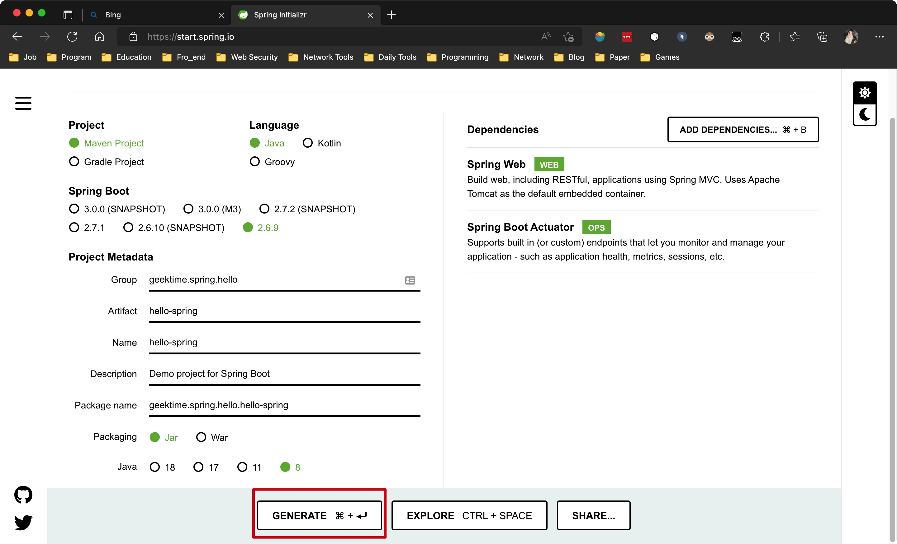
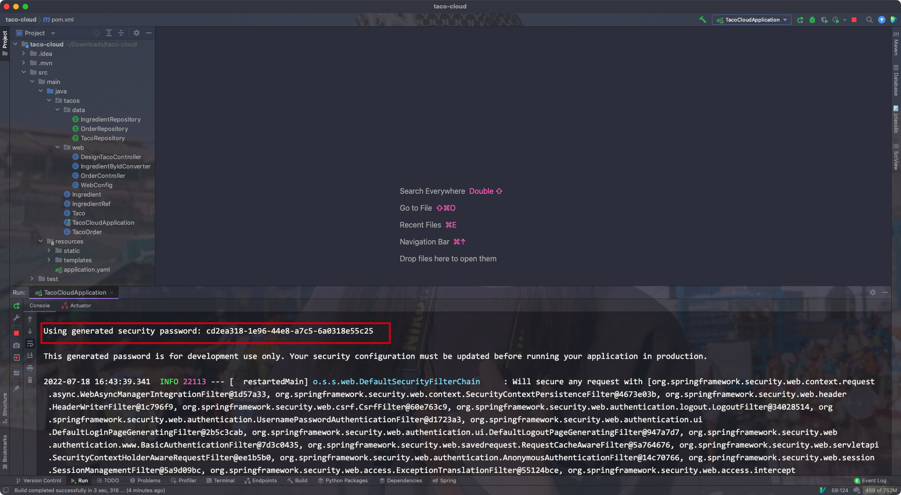

# 一、起步


## 1. 定义

- Spring的核心:

> 提供一个容器(应用上下文/ Spring application context)，它们会创建和管理应用组件
>
> 这些组件也称为`bean`，会在Spring应用的上下文中进行装配，从而形成一个完整的应用程序


- bean装配:

> 通过基于`依赖注入`(dependency injection)的模式即可实现bean的装配


在之前的版本中，Spring应用上下文会通过XML文件将多个bean装配在一起:

```xml
<bean id="inventoryService"
      class="com.example.InventoryService"/>
<bean id="productService"
      class="com.example.ProductService" />
	<construct-arg ref="inventoryService"/>
</bean>
```


但现在的版本中，都会通过Java进行配置:

```java
@Configuration
public class ServiceConfiguration {
  @Bean
  public InventoryService inventoryService() {
    return new InvetoryService();
  }
  
  @Bean
  public ProductService productService() {
    return new ProductService();
  }
}
```


Explain:

- `@Configuration`注解会告知Spring这是一个配置类，改类会为容器/上下文提供`bean`/应用组件
- 配置类的方法使用了`@Bean`注解进行了标注，表明这些方法的返回对象会作为bean添加到容器/上下文中

> 默认时，bean对应的bean ID和其定义的方法名是相同的


- 基于Java的配置会带来更强的安全性和更好的可重构性
- 不管是XML还是Java，只有当Spring不能进行自动配置时才有使用的必要


- Spring中，自动配置技术的前身是自动装配(autowiring)和组件扫描(component scanning)
- 通过组件扫描(component Scanning)，Spring可以自动发现应用路径下的组件(bean)，并创建为Spring应用容器/上下文中的bean
- 通过自动装配(autowiring)，可以为组件/bean自动注入他们依赖的其他bean/组件


- Spring Boot是Spring框架的拓展，其提供了众多的增强方法: 自动配置(autoconfiguration)等等，其自动配置的能力超过了自动装配和组件扫描


> Spring Boot大幅减少了构建应用所需的显式配置
>
> Spring XML是一种过时的方法，基于Java的配置才是主流

---


## 2. 初始化Spring应用


### 1) 通过Spring Initializer初始化Spring项目

可以在https://start.spring.io上配置Spring项目:

- 在其中可以选择构建工具(Maven/Gradle)、语言(Java, Kotlin, Groovy)，SpringBoot的版本，项目的具体信息，打包的方式，Java的版本等等
- 在右边可以选择添加对应的依赖




点击生成后，会生成一个压缩文件包，解压后导入至IDEA即可(注意需要设置项目的Java版本，并加载Maven的pom.xml文件):


---


### 2) 检查Spring项目的结构


- mvnw和mvnw.cmd:

Maven包安装器脚本(wrapper)，在没有安装Maven的情况下，也可以构建项目

- pom.xml:

Maven构建规范

- TacoCloudApplicatin.java:

Spring Boot主类，其会启动整个项目

- application.properties:

指定项目的相关配置

- static:

存放任意为浏览器提供服务的静态内容

- templates:

存放用来渲染到浏览器的模版文件

- TacoCloudApplicationTests.java:

简单的测试类，其用来确保Spring应用的上下文可以成功被加载


#### 构建规范

pom.xml文件包含了我们所需的所有依赖

Eg:


- 将项目打包为JAR文件是因为所有的Java云平台都能运行JAR文件，而WAR包只适合部署在常规的Java应用服务器上


- `<parent>`标签元素下的`<version>`元素表明我们的项目需要以`spring-boot-starter-parent`作为当前项目的父POM
- 这个父POM中为Spring项目提供了一些常用的库提供了依赖管理，版本统一由父POM管理，不再需要我们自己操心


- Spring Boot start依赖的特别之处在于它们本身并不包含库代码，只是传递性地拉取其他的库，这种starter依赖的三种好处:
    - 构建文件会显著减小并易于管理
    - 能够根据功能来考虑依赖
    - 不用担心库的版本


- 最后的Spring Boot插件提供的功能:
    - 提供了一个Maven编译目标，其允许我们使用Maven来运行应用
    - 其会确保依赖所有的库都包含在可执行的JAR文件中，并保证它们在运行时的路径中可用
    - 会在JAR中生成一个`manifest`文件，声明引导类为可执行JAR的主类(这里为TacoCloudApplication)

---


#### 引导应用

> TacoCloudApplication作为主类，会在JAR运行时被执行
>
> 其还需要一个最小化的Spring配置，用来引导应用


Eg:


Explain:

- `@SpringBootApplication`是一个组合注解，其组合了其他3个其他的注解:

    - `@SpringBootConfiguraion`:

    将类`声明为配置类`，其是`@Configuration`注解的特殊形式

    - `@EnableAutoConfiguration`:

    启动Spring Boot的`自动配置`

    - `@ComponentScan`: 

    启用组件扫描: 使得其他被`@Component`、`@Controller`、`@Service`等注解声明的类能够被Spring自动发现，并注册为Spring应用容器/上下文中的组件/bean


- 改引导类中的`main()`方法会调用`SpringApplication`中的静态`run()`方法，后者会执行应用的引导过程，即`创建应用上下文/容器`
- 其中传入的参数为配置类和命令行参数

---


#### 测试应用


- 该类会确保Spring应用上下文能够成功加载
- `@SpringBootTest`会告知Junit在启动测试时添加Spring Boot的功能，可视为在`main()`方法中调用`SpringApplication.run()`

---


## 3. 编写Spring项目

- 刚开始，我们尝试为该项目添加一个主页，此时需要两个代码构件:
    - 一个控制器类，用来`处理主页请求`
    - 一个视图模版，用来定义主页的样子
- 最后需要一个简单的测试类来测试我们的主页

---


### 1) 处理web请求

> Spring MVC是Spring自带的一个Web框架，其`核心是控制器(controller)的概念`

- 控制器:

> 处理器请求并以某种方式进行信息响应的类
>
> 控制器可以选择性地填充数据模型并将请求传递给一个视图，然后生成返回给浏览器的HTML文件


Controller Eg:


- `@Controller`注解使得该类被扫描并识别为一个组件，并创建一个HomeController实例作为Spring应用上下文/容器中的bean


- 其中的`home()`方法该有`@GetMapping`注解，表明该方法`可以处理HTTP GET请求`，该方法只是返回一个String类型的home值
- 该返回值会被解析为`视图(html文件)的逻辑名`，视图的实现取决于多个因素(模版引擎的选择等)

---


#### Why is Thymeleaf?

- Thymeleaf是Spring官方指定的默认模版引擎


- 模版的名称是由逻辑视图名派生而来的，如模版路径: "/templates/home.html"
- 因此我们需要将模版放在`/src/main/resources/templates/home.html`

---


### 2) 定义视图

主页模版:


Thymeleaf的命名空间:

```html
<html xmlns="http://www.w3.org/1999/xhtml"
      xmlns:th="http://www.thymeleaf.org">
</html>
```


- ``标签中，使用了thymeleaf的`th:src`属性和`@{}`表达式
- 图片是相对容器/上下文的`/images/image.jpg`来引用的，静态资源是存放在`/src/main/resources/static`文件夹下的
- 所以对应的图片必须位于:`/src/main/resources/static/images`下

---


### 3) 测试控制器

- 我们的测试需要对路径"/"发送一个HTTP GET请求，并期望获取成功的结果
- 其视图名称为"home"，且内容包含"Welcome to..."

Eg:


- 注意这里只需要在类上添加`@WebMvcTest`注解，注解中添加测试的Controller即可，`不要加上@SpringBootTest注解`
- `@WebMvcTest`注解会让测试在Spring MVC应用的上下文/容器中执行，即其会将HomeController这个类注册到Spring MVC容器中，这样我们就可以向其发送请求了
- 测试类中注入的`MockMvc`实例能够让测试实现mockup(样机)，从而测试驱动模型


该请求规定了下列期望值：

- 响应应该有一个HTTP 200（OK）状态。
- 视图应该有一个合理的主页名称。
- 呈现的视图应该包含 “Welcome to...”


我们也可以选择使用maven进行测试:

- maven命令:

```shell
mvnw test
```

Eg:


---


### 4) 构建/运行应用

- 通过IDE中的按钮即可启动整个应用，并在浏览器中访问它

Eg:


---


### 5) 了解Spring Boot DevTools

- 我们在依赖项中导入了这个依赖，其为开发者提供了一些有用的工具:
    - 代码变更后`应用自动重启`
    - 浏览器的资源(JavaScript、CSS等)发生变化时，会`自动刷新浏览器`
    - 自动`禁用模版缓存`
    - 针对H2数据库，内置了`H2控制台`

---


#### 应用自动重启

- 在应用加载时，该应用会被加载到JVM中的`两个独立的类加载器`中(Application ClassLoader和Bootstrap ClassLoader)
- 一个会加载我们`自己编写的代码`(项目中`src/main`下的全部内容)，这些内容经常改变；另一个会`加载依赖的库`，这些库不太可能改变
- 一旦探测到src/main下的代码发生改动后，`DevTools只会重新加载包含项目代码的类加载器`，另一个则保持不变，该策略能够减少应用启动的时间

- 但该自动重启策略的不足在于: `自动重启无法反映依赖项的变化`，即依赖项改变后不会自动重启，需要我们手动重启

---


#### 浏览器自动刷新和禁用模版缓存


- 禁用模版缓存

当使用Thymeleaf、FreeMaker等模版模版引擎时，会在配置的时候缓存模版解析的结果，这样就`能在提供服务的时候减少重复解析模版了`

但在开发时，我们就`无法通过刷新浏览器来查看模版变更的结果了`

DevTools则通过禁用模版缓存解决了这个问题


- 浏览器自动刷新

DevTools依赖会在项目启动的时候自动启动一个LiveReload服务器，其需要浏览器中的LiveReload插件进行配合，此时只要项目中在浏览器中呈现的内容(模版、html、样式表和JS等)发生变化时，就会自动刷新浏览器


配置步骤:

1. 在浏览器中安装Live Reload插件


2. 在项目中添加DevTools依赖

```xml
<dependency>
  <groupId>org.springframework.boot</groupId>
  <artifactId>spring-boot-devtools</artifactId>
  <scope>runtime</scope>
  <optional>true</optional>
</dependency>
```


3. 在IDEA中，修改资源后手动进行Build操作


---


#### 内置的H2控制台

- 如果我们在项目中使用了H2数据库(内置的一种数据库，不需要额外安装)，则DevTools就会自动启动H2
- 通过浏览器，我们可以在http://localhost:8080/h2-console中查看H2使用的数据

---


## 4. Spring全貌


### 1) 核心框架

- Spring核心是一切的基础，其提供了核心容器、依赖注入框架等重要特性
- Spring MVC是Spring的Web框架，Spring MVC还可以用来创建REST API用来生成非HTML的输出
- Spring核心框架提供了对数据持久化的支持(存储)，比如基于模版的JDBC支持
- 新版的Spring中增加了对反应式编程的支持(reactive)，具体实现为名为Spring WebFlux的反应式Web框架

---


### 2) Spring Boot

- Spring Boot能够实现自动配置和starter依赖
- 其他Spring Boot特性:
    - 利用Actuator能够检测应用运行的状况，例如指标、线程、健康状况以及环境属性等等
    - 环境属性规范
    - 对测试的支持

---


### 3) Spring Data

- Spring Data提供的数据持久化功能:
    - 将数据repository定义为简单的Java接口，**在定义数据连接和数据操作时只使用一种命名约定即可**

- Spring Data能够处理多种类型的数据库: 关系型(JPA)、文档型(mongo)、图数据库(Neo4j)等等

---


### 4) Spring Security

- Spring Security框架解决了应用程序通用的安全需求，包括身份验证、授权和API安全等等

---


### 5) Spring Integration/Spring Batch

- Spring Integration:

其解决了实时集成的问题


- Spring Batch:

其解决了批处理集成的问题

---


### 6) Spring Cloud

现在的应用程序不在作为单个部署单元来开发，而是通过微服务来组成的多个部署单元共同组成一个应用程序


Spring Cloud是通过Spring开发云原生应用的项目

---


### 7) Spring Native

- Spring Native项目使用GraalVM镜像将Spring启动项目编译为本机的可执行文件，使得镜像启动速度大大提升，并且更加轻量级

---


## 5. 小结

- Spring的目的就是为了更加轻松的开发
- Spring Boot构建在Spring之上，其通过自动配置等功能简化了大量步骤
- Spring应用程序可以通过Spring Initializer进行初始化
- 在Spring容器/上下文中，组件/bean可以通过XML或者Java代码进行声明，可以通过组件扫描进行发现，也可以通过Spring Boot进行自动配置

---


# 二、Web应用开发


## 1. 展现信息

功能需求背景:

我们的应用(Taco Cloud)应该可以在线订购Taco，除此之外，还应该允许客户自行通过配料(ingredient)来设计自己的taco


具体需求:

- Taco Cloud需要一个页面为用户呈现出可选择的配料，选择的配料可能会随时变化，因此不能将它们通过硬编码的方式写到HTML中
- 我们应该将数据从数据库中传递到页面上，进而展现给客户


功能分析:

- Spring Web中，获取/处理数据是Controller的任务
- 将数据渲染到HTML中并在浏览器中展现是视图(view)的任务


需要构建的组件:

- 定义taco成分属性的`领域实体类`
- 获取配料信息，并将信息传递给视图的Spring MVC中的`Controller类`
- 在浏览器中渲染配料列表的`视图模版`


组件之间的关系:


- 我们暂时不考虑数据库相关的内容(即暂时不考虑从数据库中获取数据)
- 目前的控制器只负责向视图提供组件/taco的成分
- 我们首先需要确定表示成分的领域实体类

---


### 1) 构建领域实体

- 应用的领域实体类:

> 应用处理的主题领域: 影响应用理解的思想和概念

当前应用中实体类的关系:


在我们的Taco Cloud应用中，`领域对象`包括:

taco设计类、taco成分类、顾客、顾客下的Taco订单类


1. taco配料类(Ingredient)

每种taco的成分需要一个名称和类型，每种酱料还需要一个ID

Eg:


> 注意这里内部的枚举类不能用Static修饰，否则可以在创建Ingredient实例的情况下直接创建一个Type实例


该类表述了配料的三种属性，这里使用了Lombok库中的注解`@Data`，从而自动生成了所有缺失的方法

`@RequiredArgsConstructor`注解则会通过被`final`修饰的所有字段生成一个构造器方法


lombok依赖导入:


2. 定义taco类


3. 定义taco订单类


- 这个的`addTaco`方法只是为了方便地将taco添加到订单中

---


### 2) 创建控制器类

- 控制器负责处理HTTP请求(GET, POST等等)
- 控制器要么`将请求传递给视图以便渲染HTML`，要么`直接将数据写入响应体中`(RESTful)


我们需要创建一个简单的控制器，其功能有:

- 处理路径"/design"的HTTP GET请求
- 构建配料的列表
- 处理请求，将配料数据传递给HTML视图模版，再响应给浏览器


Eg:

```java
package tacos.web;

import java.util.Arrays;
import java.util.List;
import java.util.stream.Collectors;

import org.springframework.stereotype.Controller;
import org.springframework.ui.Model;
import org.springframework.web.bind.annotation.GetMapping;
import org.springframework.web.bind.annotation.ModelAttribute;
import org.springframework.web.bind.annotation.RequestMapping;
import org.springframework.web.bind.annotation.SessionAttributes;

import lombok.extern.slf4j.Slf4j;
import tacos.entity.Ingredient;
import tacos.entity.Ingredient.Type;
import tacos.entity.Taco;

@Slf4j
@Controller
@RequestMapping("/design")
@SessionAttributes("tacoOrder")
public class DesignTacoController {
  @ModelAttribute
  public void addIngredientsToModel(Model model) {
    List<Ingredient> ingredients = Arrays.asList(
      new Ingredient("FLTO", "Flour Tortilla", Type.WRAP),
      new Ingredient("COTO", "Corn Tortilla", Type.WRAP),
      new Ingredient("GRBF", "Ground Beef", Type.PROTEIN),
      new Ingredient("CARN", "Carnitas", Type.PROTEIN),
      new Ingredient("TMTO", "Diced Tomatoes", Type.VEGGIES),
      new Ingredient("LETC", "Lettuce", Type.VEGGIES),
      new Ingredient("CHED", "Cheddar", Type.CHEESE),
      new Ingredient("JACK", "Monterrey Jack", Type.CHEESE),
      new Ingredient("SLSA", "Salsa", Type.SAUCE),
      new Ingredient("SRCR", "Sour Cream", Type.SAUCE)
    );

    Type[] types = Ingredient.Type.values();
    for (Type type : types) {
      model.addAttribute(type.toString().toLowerCase(),
                         filterByType(ingredients, type));
    }
  }

  @GetMapping
  public String showDesignForm(Model model) {
    model.addAttribute("taco", new Taco());
    return "design";
  }

  private Iterable<Ingredient> filterByType(
    List<Ingredient> ingredients, Type type) {
    return ingredients
      .stream()
      .filter(x -> x.getType().equals(type))
      .collect(Collectors.toList());
  }

}
```


- `@Slf4j`: 该注解将在运行时自动生成一个SLF4J的日志实例对象

该注解与以下code等效:

```java
private static final org.slf4j.Logger log =
      org.slf4j.LoggerFactory.getLogger(DesignTacoController.class);
```


- `@DesignController`: 该注解标识该类为控制器，并让其被Spring应用上下文/容器发现并自动创建其实例对象为bean/组件
- `@RequestMapping`: 在类上时，表示该处理器处理的请求类型，我们这里制定了它处理的路径为"/design"

---


#### 处理GET请求

例子中的`@RequestMapping`可以和`@GetMapping`注解组合起来使用:

> 即当收到`/design`的HTTP GET请求时，`showDesignForm`方法会进行处理


其他请求映射注解:

**Spring MVC 请求映射注解**

| 注解            | 描述                  |
| :-------------- | :-------------------- |
| @RequestMapping | 通用请求处理          |
| @GetMapping     | 处理 HTTP GET 请求    |
| @PostMapping    | 处理 HTTP POST 请求   |
| @PutMapping     | 处理 HTTP PUT 请求    |
| @DeleteMapping  | 处理 HTTP DELETE 请求 |
| @PatchMapping   | 处理 HTTP PATCH 请求  |


- `showDesignForm`方法仅仅是返回一个字符串值为"design"，该值为视图的`逻辑名称`
- `addIngredientsToModel`方法使用了`@ModelAttribute`注解，其会在处理请求时被调用，并构造一个配料对象放入到模型中
- `filterByType`方法则根据类型过滤列表，然后将其作为属性传递到`showDesignForm`方法中的`Model`对象中去

- `Model`是一个对象，负责在控制器(controller)和视图中传输数据，放置在其中的数据被复制到Servlet响应属性中，视图可以找到它们

---


### 3) 设计视图

- 这里我们使用Thymeleaf来定义视图


注意:

- Thymeleaf这种视图库`与web框架之间是解耦的`，所以它们`不知道Spring中的Model对象`，自然也就`无法获取控制器放在Model中的数据`了，但`可以处理Servlet中的请求属性`
- 而模型中的数据被复制到了Servlet中的请求属性中，所以`视图模版可以访问这些属性`


例子:

如果Servlet的请求属性中有一个键为"message"的属性，那么在Thymeleaf中可以这样获取:

```html
<p th:text="${message}">placeholder message</p>
```


- `th:text`是一个thymeleaf的命名空间属性，`用于需要被替换的地方`，而`${}`操作符用于`指定请求的属性值`(这里是message)


- `th:each`用于遍历元素的集合

Eg:

```html
<h3>Designate your wrap:</h3>
<div th:each="ingredient : ${wrap}">
  <input th:field="*{ingredients}" type="checkbox" th:value="${ingredient.id}"/>
  <span th:text="${ingredient.name}">INGREDIENT</span><br/>
</div>
```

- 这里对wrap属性中集合的每个元素进行重复呈现，每个元素都用`ingredient`这个thymeleaf变量表示
- `<div>`内部的`<input>`元素和`<span>`元素表示复选框，input中的`th:value`会将input中的`value属性`替换为thymeleaf元素中的`id属性值`
- 同理，`th:text`则会将`<span>`中的"INGREDIENT"文本内容替换为thymeleaf元素中的`name属性值`


在实际渲染后，该部分可能为:

```html
<div>
  <input name="ingredients" type="checkbox" value="FLTO" />
  <span>Flour Tortilla</span><br/>
</div>
```


完整的design页面:

```html
<!DOCTYPE html>
<html xmlns="http://www.w3.org/1999/xhtml"
      xmlns:th="http://www.thymeleaf.org">
    <head>
        <title>Taco Cloud</title>
        <link rel="stylesheet" th:href="@{/styles.css}" />
    </head>

    <body>
        <h1>Design your taco!</h1>
        
        <form method="POST" th:object="${taco}">
            <div class="grid">
                <div class="ingredient-group" id="wraps">
                    <h3>Designate your wrap:</h3>
                    <div th:each="ingredient : ${wrap}">
                        <input name="ingredients" type="checkbox" th:value="${ingredient.id}"/>
                        <span th:text="${ingredient.name}">INGREDIENT</span><br/>
                    </div>
                </div>
                <div class="ingredient-group" id="proteins">
                    <h3>Pick your protein:</h3>
                    <div th:each="ingredient : ${protein}">
                        <input name="ingredients" type="checkbox" th:value="${ingredient.id}" />
                        <span th:text="${ingredient.name}">INGREDIENT</span><br/>
                    </div>
                </div>
                <div class="ingredient-group" id="cheeses">
                    <h3>Choose your cheese:</h3>
                    <div th:each="ingredient : ${cheese}">
                        <input name="ingredients" type="checkbox" th:value="${ingredient.id}"/>
                        <span th:text="${ingredient.name}">INGREDIENT</span><br/>
                    </div>
                </div>
                <div class="ingredient-group" id="veggies">
                    <h3>Determine your veggies:</h3>
                    <div th:each="ingredient : ${veggies}">
                        <input name="ingredients" type="checkbox" th:value="${ingredient.id}"/>
                        <span th:text="${ingredient.name}">INGREDIENT</span><br/>
                    </div>
                </div>
                <div class="ingredient-group" id="sauces">
                    <h3>Select your sauce:</h3>
                    <div th:each="ingredient : ${sauce}">
                        <input name="ingredients" type="checkbox" th:value="${ingredient.id}"/>
                        <span th:text="${ingredient.name}">INGREDIENT</span><br/>
                    </div>
                </div>
            </div>
            <div>
                <h3>Name your taco creation:</h3>
                <input type="text" th:field="*{name}"/><br/>
                <button>Submit your taco</button>
            </div>
        </form>
    </body>
</html>
```

- 注意: 第12行中的`design`要改为`taco`


- 其中我们使用了`@{}`操作符表示产生上下文相对路径的静态引用

> Spring中的静态内容是从项目根路径中的`/static`提供的


运行程序:


- 但此时我们的程序并不能够处理提交的表单请求，我们需要更多的Controller来处理

---


## 2. 处理表单提交

- 我们在视图的`<form>`标签中将`method`属性设置为了`POST`
- 又因为我们没有设置`action`属性，所以最终会通过`HTTP POST`方法将表单`提交到当前这个路径`中去，所以我们需要在`/design`路径下有一个方法来处理同一接口的POST请求
- 提交的字段被绑定到了Taco对象中，会作为参数传递给`processTaco`方法


Eg:

```java
@PostMapping
public String processTaco(Taco taco) {
  log.info("Processing taco: " + taco);

  return "redirect:/orders/current";
}
```


- 当使用该方法时，表明该方法应处理`/design`接口的POST请求
- 视图中的表单用到的是`checkbox`元素，它们都带有一个值为"ingredient"的name属性，和ingredient名称，两者与Taco类的ingredients和name属性对应

问题:

> 这里复选框中都是文本值，但Taco类中的配料列表为List<Ingredient> ingredients，两者无法直接对应，所以`需要我们手动实现一个转换器`

- 这里我们要用到Spring的`Converter`接口，实现其`convert`方法


Eg:

```java
package tacos.web;

import org.springframework.core.convert.converter.Converter;
import org.springframework.stereotype.Component;

import tacos.Ingredient;
import tacos.Ingredient.Type;

import java.util.HashMap;
import java.util.Map;

@Component
public class IngredientByIdConverter implements Converter<String, Ingredient> {
    private Map<String, Ingredient> ingredientMap = new HashMap<>();

    public IngredientByIdConverter() {
        ingredientMap.put("FLTO",
                new Ingredient("FLTO", "Flour Tortilla", Type.WRAP));
        ingredientMap.put("COTO",
                new Ingredient("COTO", "Corn Tortilla", Type.WRAP));
        ingredientMap.put("GRBF",
                new Ingredient("GRBF", "Ground Beef", Type.PROTEIN));
        ingredientMap.put("CARN",
                new Ingredient("CARN", "Carnitas", Type.PROTEIN));
        ingredientMap.put("TMTO",
                new Ingredient("TMTO", "Diced Tomatoes", Type.VEGGIES));
        ingredientMap.put("LETC",
                new Ingredient("LETC", "Lettuce", Type.VEGGIES));
        ingredientMap.put("CHED",
                new Ingredient("CHED", "Cheddar", Type.CHEESE));
        ingredientMap.put("JACK",
                new Ingredient("JACK", "Monterrey Jack", Type.CHEESE));
        ingredientMap.put("SLSA",
                new Ingredient("SLSA", "Salsa", Type.SAUCE));
        ingredientMap.put("SRCR",
                new Ingredient("SRCR", "Sour Cream", Type.SAUCE));
    }

    @Override
    public Ingredient convert(String id) {
        return ingredientMap.get(id);
    }
}
```

- `@Component`注解注解使得该类被注册为Spring上下文中的bean，且在`请求参数转换为类属性的时候使用它`
- `processDesign`方法同样返回的是一个视图逻辑名，但这里的返回值前缀为`redirect:`，其表示该视图为一个重定向视图，即处理完成后，会被重定向到"/orders/current"中


业务逻辑:

> 处理完成后，为用户跳转到订单表单，让用户填写具体的信息后提交订单


- 因此我们还需要一个控制器处理"/orders/current"的请求

Eg:

```java
import org.springframework.stereotype.Controller;
import org.springframework.ui.Model;
import org.springframework.web.bind.annotation.GetMapping;
import org.springframework.web.bind.annotation.RequestMapping;

import lombok.extern.slf4j.Slf4j;
import tacos.TacoOrder;

@Slf4j
@Controller
@RequestMapping("/orders")
public class OrderController {

  @GetMapping("/current")
  public String orderForm(Model model) {
    model.addAttribute("tacoOrder", new TacoOrder());
    return "orderForm";
  }

}
```


同样，我们还需要创建一个视图

Eg:

```html
<!DOCTYPE html>
<html xmlns="http://www.w3.org/1999/xhtml"
      xmlns:th="http://www.thymeleaf.org">
<head>
    <title>Taco Cloud</title>
    <link rel="stylesheet" th:href="@{/css/bootstrap-theme.css}" />
</head>

<body>
<form method="POST" th:action="@{/orders}" th:object="${tacoOrder}">
    <h1>Order your taco creations!</h1>
    
    <a th:href="@{/design}" id="another">Design another taco</a><br/>
    <div th:if="${#fields.hasErrors()}">
                <span class="validationError">
                    Please correct the problems below and resubmit.
                </span>
    </div>
    <h3>Deliver my taco masterpieces to...</h3>

    <label for="name">Name: </label>
    <input type="text" th:field="*{deliveryName}"/>
    <br/>

    <label for="street">Street address: </label>
    <input type="text" th:field="*{deliveryStreet}"/>
    <br/>

    <label for="city">City: </label>
    <input type="text" th:field="*{deliveryCity}"/>
    <br/>

    <label for="state">State: </label>
    <input type="text" th:field="*{deliveryState}"/>
    <br/>

    <label for="zip">Zip code: </label>
    <input type="text" th:field="*{deliveryZip}"/>
    <br/>

    <h3>Here's how I'll pay...</h3>

    <label for="ccNumber">Credit Card #: </label>
    <input type="text" th:field="*{ccNumber}"/>
    <br/>

    <label for="ccExpiration">Expiration: </label>
    <input type="text" th:field="*{ccExpiration}"/>
    <br/>

    <label for="ccCVV">CVV: </label>
    <input type="text" th:field="*{ccCVV}"/>
    <br/>

    <input type="submit" value="Submit order"/>
</form>
</body>
</html>
```

- 注意这里`th:field`的值应该加上delivery前缀，这些字段应该与tacoOrder类中的字段对应


- 我们在action属性里指定了表单发送的路径为`/orders`，因此还需要另一个方法处理`/orders`接口中的POST请求

Eg:

```java
@PostMapping
public String processOrder(TacoOrder tacoOrder) {
  log.info("Order submitted: " + tacoOrder);
  return "redirect:/";
}
```


效果:


打印的日志:

```
Order submitted: TacoOrder(deliveryName=alex, deliveryStreet=1234 7th street, deliveryCity=newyork, deliveryState=none, deliveryZip=zipcode, ccNumber=2313124, ccExpiration=someday, ccCVV=see-see-see, tacos=[])
```

- 现在我们成功处理了定制taco到提交订单的流程，然而我们并未对提交的表单信息做任何验证，所以我们接下来要进行验证

---


## 3. 验证表单输入

- 现在我们没有对表单进行任何验证，用户可以随便乱写其中的内容，因此我们需要对内容进行验证
- 传统方法是一个一个地校验每个参数，但这样做的话`会需要一堆if/else块`，会很难阅读


> Spring支持`Java's Bean validation API`
>
> 其使得声明验证规则和声明逻辑一样简单，在Spring Boot 2.3.0之前，web starter中自带了这个依赖


在Spring MVC中进行应用验证的步骤:

- 添加validation`对应的starter依赖`
- 需要`对验证的类声明验证规则`(Taco)
- `指定`验证`应该执行的控制器`(precessDesign方法和processOrder方法)
- 修改视图以`提示信息错误`


maven依赖:

```xml
<dependency>
  <groupId>org.springframework.boot</groupId>
  <artifactId>spring-boot-starter-validation</artifactId>
</dependency>
```

---


### 1) 声明验证规则

- 对Taco类添加验证规则:
    - 该类中的name属性和ingredients属性都不应该为null
    - 且配料列表中至少需要有一项配料

> 为类的列添加规则需要使用`@NotNull`和`@Size`注解


Eg:

```java
@Data
public class Taco {

    @NotNull
    @Size(min = 5, message = "Name must be at least 5 characters long")
    private String name;

    @NotNull
    @Size(min = 1, message = "You must choose at least 1 ingredient")
    private List<Ingredient> ingredients;
}
```

- 通过`@size`注解中的min属性值还可以设置该字段的最小长度，通过message属性值还可以设置其对应的规则信息


对于订单类(TacoOrder)进行验证:

- 地址不能为空白字段，所以需要使用`Hibernate.validator`下的`@NotBlank`注解
- 信用卡卡号字段(ccNumber)即Credit Card Num需要确保它有效，因此用到了`@CreditCardNumber`注解
- 信用卡有效期需要符合"MM/YY"格式，这里我们用到了`@Pattern`注解来表示一个`正则表达式`
- ccCVV(Card Validation Value)必须为一个三位数，这里用到了`@Digits`注解

Eg:

```java
package tacos;

import lombok.Data;
import org.hibernate.validator.constraints.CreditCardNumber;

import javax.validation.constraints.Digits;
import javax.validation.constraints.NotBlank;
import javax.validation.constraints.Pattern;
import java.util.ArrayList;
import java.util.List;

@Data
public class TacoOrder {

    @NotBlank(message = "Delivery name is required")
    private String deliveryName;

    @NotBlank(message = "Street is required")
    private String deliveryStreet;

    @NotBlank(message = "City is required")
    private String deliveryCity;

    @NotBlank(message = "State is required")
    private String deliveryState;

    @NotBlank(message = "Zip code is required")
    private String deliveryZip;

    @CreditCardNumber(message = "Not a valid credit card number")
    private String ccNumber;

    @Pattern(regexp = "^(0[1-9]|1[0-2])([\\/])([1-9][0-9])$", message = "Must be formatted MM/YY")
    private String ccExpiration;

    @Digits(integer = 3, fraction = 0, message = "Invalid CVV")
    private String ccCVV;

    private List<Taco> tacos = new ArrayList<>();

    public void addTaco(Taco taco) {
        this.tacos.add(taco);
    }
}
```

---


### 2) 表单绑定验证

- 在相应的类上设置好验证规则后，我们需要`在控制器中指定验证的执行`


- 在前端页面中，**返回的是一个Taco实例对象**，所以我们`需要验证的也是这个对象`，因此在对应的控制器方法(processTaco)中，我们需要`对Taco对象参数进`行验证
- 设置验证的方法就是在参数前添加一个`@Valid`注解
- 如果返回的对象有任何错误，那么这些`错误就会被第二个参数捕获`，我们只需要通过它调用`hasErrors`方法即可


Eg:

```java
@PostMapping
public String processTaco(@Valid @ModelAttribute("taco") Taco taco, Errors errors) {
  if (errors.hasErrors()) {
    return "design";
  }

  log.info("Processing taco: " + taco);

  return "redirect:/orders/current";
}
```


逻辑:

如果有错误，我们便不处理这个订单，而是重新显示表单(design)


- 同样的，我们也需要验证提交的订单

Eg:

```java
@PostMapping
public String processOrder(@Valid @ModelAttribute("tacoOrder") TacoOrder tacoOrder, Errors errors) {
  if (errors.hasErrors()) {
    return "orderForm";
  }

  log.info("Order submitted: " + tacoOrder);
  return "redirect:/";
}
```


问题:

- 我们虽然验证了错误，但用户并未收到任何提示，所以我们需要给用户一些提醒

---


### 3) 为用户显示验证错误

- thymeleaf中提供了`fields`属性和`th:errors`属性用来访问Errors对象

Eg:

```html
<label for="ccNumber">Credit Card #: </label>
<input type="text" th:field="*{ccNumber}"/>
<span class="validationError"
      th:if="${#fields.hasErrors('ccNumber')}"
      th:errors="*{ccNumber}">CC Num Error</span>
```


Eg:


Html:

```html
<!DOCTYPE html>
<html xmlns="http://www.w3.org/1999/xhtml"
      xmlns:th="http://www.thymeleaf.org">
<head>
    <title>Taco Cloud</title>
    <link rel="stylesheet" th:href="@{/css/bootstrap-theme.css}" />
</head>

<body>
<form method="POST" th:action="@{/orders}" th:object="${tacoOrder}">
    <h1>Order your taco creations!</h1>
    
    <a th:href="@{/design}" id="another">Design another taco</a><br/>
    <div th:if="${#fields.hasErrors()}">
                <span class="validationError">
                    Please correct the problems below and resubmit.
                </span>
    </div>
    <h3>Deliver my taco masterpieces to...</h3>

    <label for="name">Name: </label>
    <input type="text" th:field="*{deliveryName}"/>
    <span class="validationError"
          th:if="${#fields.hasErrors('deliveryName')}"
          th:errors="*{deliveryName}">Delivery Name Error</span>
    <br/>

    <label for="street">Street address: </label>
    <input type="text" th:field="*{deliveryStreet}"/>
    <span class="validationError"
          th:if="${#fields.hasErrors('deliveryStreet')}"
          th:errors="*{deliveryStreet}">Delivery Street Error</span>
    <br/>

    <label for="city">City: </label>
    <input type="text" th:field="*{deliveryCity}"/>
    <span class="validationError"
          th:if="${#fields.hasErrors('deliveryCity')}"
          th:errors="*{deliveryCity}">Delivery City Error</span>
    <br/>

    <label for="state">State: </label>
    <input type="text" th:field="*{deliveryState}"/>
    <span class="validationError"
          th:if="${#fields.hasErrors('deliveryState')}"
          th:errors="*{deliveryState}">Delivery State Error</span>
    <br/>

    <label for="zip">Zip code: </label>
    <input type="text" th:field="*{deliveryZip}"/>
    <span class="validationError"
          th:if="${#fields.hasErrors('deliveryZip')}"
          th:errors="*{deliveryZip}">Delivery Zip Error</span>
    <br/>

    <h3>Here's how I'll pay...</h3>

    <label for="ccNumber">Credit Card #: </label>
    <input type="text" th:field="*{ccNumber}"/>
    <span class="validationError"
          th:if="${#fields.hasErrors('ccNumber')}"
          th:errors="*{ccNumber}">CC Num Error</span>
    <br/>

    <label for="ccExpiration">Expiration: </label>
    <input type="text" th:field="*{ccExpiration}"/>
    <span class="validationError"
          th:if="${#fields.hasErrors('ccExpiration')}"
          th:errors="*{ccExpiration}">CC Expiration Error</span>
    <br/>

    <label for="ccCVV">CVV: </label>
    <input type="text" th:field="*{ccCVV}"/>
    <span class="validationError"
          th:if="${#fields.hasErrors('ccCVV')}"
          th:errors="*{ccCVV}">CC CVV Error</span>
    <br/>

    <input type="submit" value="Submit order"/>
</form>
</body>
</html>
```


效果图:


---


## 4. 视图控制器

- 我们现在为项目编写了三个控制器，它们都遵循相同的模式:
    - 都使用了`@Controller`注解
    - 除了`HomeController`之外，都使用了`@RequestMapping`注解定义控制器处理的路径
    - 都有至少一个方法，大多数方法都使用了`@GetMapping`或者`@PostMapping`注解


> 如果一个控制器很简单: 不填充任何属性到模型中或者流程输入(HomeController)，那么可以只用视图控制器来代替，其只用于将请求转发给视图


Eg:

```java
package tacos.web;

import org.springframework.context.annotation.Configuration;
import org.springframework.web.servlet.config.annotation.ViewControllerRegistry;
import org.springframework.web.servlet.config.annotation.WebMvcConfigurer;

@Configuration
public class WebConfig implements WebMvcConfigurer {
    @Override
    public void addViewControllers(ViewControllerRegistry registry) {
        registry.addViewController("/") .setViewName("home");
    }
}
```

- 我们通过实现`WebMvcConfigurer`接口，重写了其`addViewControllers`方法
- 其中我们使用一个`ViewControllerRegistry`实例对象调用`addViewController`方法设置视图控制器处理GET请求的路径，调用`setViewName`方法指定了转发请求所用的视图逻辑名


- 通过这个类就可以替换掉HomeController了，不过还需要将之前测试类中`@WebMvcTest`注解内对HomeController的引用

Eg:


- 该配置甚至还可以直接写在引导类中，同样只需要实现对应的`WebMvcConfigurer`接口即可:


注意:

最好为每种配置都创建一个新的配置类，保持引导配置的简洁

---


## 5. 视图模版


各种视图模版的支持情况:

**表 2.2 支持的模板选项**

| 模板                    | Spring Boot starter 依赖             |
| :---------------------- | :----------------------------------- |
| FreeMarker              | spring-boot-starter-freemarker       |
| Groovy Templates        | spring-boot-starter-groovy-templates |
| JavaServer Page （JSP） | None （provided by Tomcat or Jetty） |
| Mustache                | spring-boot-starter-mustache         |
| Thymeleaf               | spring-boot-starter-thymeleaf        |


注意:如果需要打包为可执行的jar文件，则无法通过JSP来实现

---


### 1) 缓存模版

- 默认情况下，模版只在第一次使用的时候被解析一次，解析的结果会被缓存，这样在生产环节中可以提高性能
- 但开发中则无法看到实时的修改，只能重启，因此我们可以在配置中手动禁用模版的缓存

**表 2.3 启用/禁用模板缓存的属性**

| 模板             | 缓存使能属性                 |
| :--------------- | :--------------------------- |
| Freemarker       | spring.freemarker.cache      |
| Groovy Templates | spring.groovy.template.cache |
| Mustache         | spring.mustache.cache        |
| Thymeleaf        | spring.thymeleaf.cache       |


禁用Thymeleaf模版缓存对应的配置项:


- 最简单的方法还是使用Spring Boot的DevTools依赖(其能够根据环境自动禁用/启用模版缓存)

---


# 三、处理数据


## 1. 使用JDBC读写数据


传统情况下使用JDBC执行查询操作:

```java
public Optional<Ingredient> findById(String id) {
  Connection connection = null;
  PreparedStatement statement = null;
  ResultSet resultSet = null;
  try {
    connection = dataSource.getConnection();
    statement = connection.prepareStatement(
        "select id, name, type from Ingredient");
    statement.setString(1, id);
    resultSet = statement.executeQuery();
    Ingredient ingredient = null;
    if(resultSet.next()) {
      ingredient = new Ingredient(
        resultSet.getString("id"),
        resultSet.getString("name"),
        Ingredient.Type.valueOf(resultSet.getString("type")));
    }
    return Optional.of(ingredient);
  } catch (SQLException e) {
    // ??? What should be done here ???
  } finally {
    if (resultSet != null) {
      try {
        resultSet.close();
      } catch (SQLException e) {}
    }
    if (statement != null) {
      try {
        statement.close();
      } catch (SQLException e) {}
    }
    if (connection != null) {
      try {
        connection.close();
      } catch (SQLException e) {}
    }
  }
  return null;
}
```

- 该方法中只有几行用于查询，其余都是用于创建连接、创建语句(statement)和关闭结果集、语句和连接的语句
- 在处理过程中还需要处理SQLException，其对排除问题并无较大帮助


使用JdbcTemplate:

```java
private JdbcTemplate jdbcTemplate;

public Optional<Ingredient> findById(String id) {
  List<Ingredient> results = jdbcTemplate.query(
    "select id, name, type from Ingredient where id=?",
    this::mapRowToIngredient,
    id);
  return results.size() == 0 ?
      Optional.empty() :
      Optional.of(results.get(0));
}
private Ingredient mapRowToIngredient(ResultSet row, int rowNum)
    throws SQLException {
  return new Ingredient(
    row.getString("id"),
    row.getString("name"),
    Ingredient.Type.valueOf(row.getString("type")));
}
```

- 使用JdbcTemplate明显要简单得多，没有创建语句和清除/关闭语句

---


### 1) 改造实体类适应持久化

- 将对象放入数据库时，最好有一个唯一标识对象的字段，这里我们可以选择使用一个`Long`类型的`id`对象属性
- 该对象实例何时被创建也很有用，所以需要一个字段表示其对应的创建日期和时间

Eg:


Taco类

```java
public class Taco {
    
    private Long id;

    private Date createdAt;
   	...
}
```


TacoOrder类

```java
@Data
public class TacoOrder {
    private static final long serialVersionUID = 1L;
    
    private Long id;

    private Date createdAt;
		...
}
```

---


### 2) 使用JdbcTemplate

- 使用之前，我们需要导入对应的依赖:

```xml
<dependency>
   <groupId>org.springframework.boot</groupId>
   <artifactId>spring-boot-starter-jdbc</artifactId>
</dependency>
```


- 我们还需要一个关系型数据库实现持久化存储，这里我们选择H2嵌入式数据库
- 因为我们使用了Spring Boot Dev-tools，所以我们可以访问H2控制台(默认在http://localhost:8080/h2-console)

```xml
<dependency>
  <groupId>com.h2database</groupId>
  <artifactId>h2</artifactId>
  <scope>runtime</scope>
</dependency>
```


- 默认情况下，数据库名称是随机的，所以很难确定数据库的连接URL，我们可以在`application.properties`中指定对应的属性来表示数据库的名称:

```properties
spring.datasource.generate-unique-name=false
spring.datasource.name=tacocloud
```


- 但yaml格式的配置文件具有更好的可读性，所以最好使用yaml格式:

```yaml
spring:
  datasource:
    generate-unique-name: false
    name: tacocloud
```


- `spring.datasource.generate-unique-name`配置项用来指定是否为数据库指定随机值
- `spring.datasource.name=tacocloud`则直接指明了数据库的名称
- 此时我们的H2数据库连接URL为: `jdbc:h2:mem:tacocloud`
- 我们可以通过jdbc-url配置项指定对应的控制台URL

---


#### 定义JDBC存储库(repository)

- 我们需要对一个Ingredient对象进行CRUD，对应的操作如下:
    - 查询所有的Ingredient记录，将所有记录存放在对应的集合实例中
    - 实现通过id查询单个Ingredient对象
    - 保存一个Ingredient实例对象


通过接口定义上述的三种功能:

```java
package tacos.data;

import tacos.Ingredient;

import java.util.Optional;

public interface IngredientRepository {
    Iterable<Ingredient> findAll();
    
    Optional<Ingredient> findById(String id);
    
    Ingredient save(Ingredient ingredient);
}
```


之后我们需要实现这三个接口描述的功能:

```java
package tacos.data;

import org.springframework.beans.factory.annotation.Autowired;
import org.springframework.jdbc.core.JdbcTemplate;
import org.springframework.stereotype.Repository;
import tacos.Ingredient;

import java.util.Optional;

@Repository
public class JdbcIngredientRepository implements IngredientRepository{
    private JdbcTemplate jdbcTemplate;

    public JdbcIngredientRepository(JdbcTemplate jdbcTemplate) {
        this.jdbcTemplate = jdbcTemplate;
    }
  	...
}
```

- 这里使用了`@Repository`注解，该注解是Spring中的原型注解之一(包括@Controller和@Component)
- `@Repository`注解可以让该类被Spring扫描并在上下文/容器中生成对应的bean实例对象


- 我们这里使用到了`JdbcTemplate`，该实例bean可以从容器中获取，我们只需要使用`@Autowired`注解即可将其注入

Eg:

```java
@Autowired
public JdbcIngredientRepository(JdbcTemplate jdbcTemplate) {
  this.jdbcTemplate = jdbcTemplate;
}
```


`findAll`和`findById`的实现:

```java
@Override
public Iterable<Ingredient> findAll() {
    return jdbcTemplate.query("SELECT id, name, type FROM Ingredient",
            this::mapRowToIngredient);
}

@Override
public Optional<Ingredient> findById(String id) {
    List<Ingredient> results = jdbcTemplate.query("SELECT id, name, type FROM Ingredient WHERE id = ?",
            this::mapRowToIngredient,
            id);

    return results.size() == 0 ? Optional.empty() : Optional.of(results.get(0));
}

private Ingredient mapRowToIngredient(ResultSet row, int rowNum) throws SQLException {
    return new Ingredient(
            row.getString("id"),
            row.getString("name"),
            Ingredient.Type.valueOf(row.getString("type"))
    );
}
```

- 上述两个方法都使用了`JdbcTemplate`实例，其中`findAll`使用了JdbcTemplagte的`query`方法
- `query`方法接收一个查询的SQL以及Spring的RowMapper(一个函数式接口)实现:

> public <T> List<T> query(String sql, RowMapper<T> rowMapper) throws DataAccessException

- 我们的`mapRowToIngredient`方法用于将结果集中的数据映射到具体的实体类对象中


- `findById`方法需要使用WHERE子句，所以需要通过id列的值获取对应的实体对象，对`query`调用中存在id值，查询执行的时候，"?"会被替换为id值

> public <T> List<T> query(String sql, RowMapper<T> rowMapper, @Nullable Object... args) throws DataAccessException

- 我们也可以不使用方法引用，而是使用匿名内部类:

```java
@Override
public Optional<Ingredient> findById(String id) {
    List<Ingredient> results = jdbcTemplate.query("SELECT id, name, type FROM Ingredient WHERE id = ?",
            new RowMapper<Ingredient>() {
                @Override
                public Ingredient mapRow(ResultSet rs, int rowNum) throws SQLException {
                    return new Ingredient(
                            rs.getString("id"),
                            rs.getString("name"),
                            Ingredient.Type.valueOf(rs.getString("type")));
                };
            },
            id);

    return results.size() == 0 ? Optional.empty() : Optional.of(results.get(0));
}
```

---


#### 插入一行数据

- 通过JdbcTemplate的`update`方法即可查询数据或进行更新操作

Eg:

```java
@Override
public Ingredient save(Ingredient ingredient) {
  jdbcTemplate.update("INSERT INTO Ingredient (id, name, type) VALUES(?, ?, ?)",
                      ingredient.getId(),
                      ingredient.getName(),
                      ingredient.getType().toString());

  return ingredient;
}
```

- 在方法中，我们将Ingredient实例的三个属性值传入了SQL中，该方法不需要将ResultSet对象中的数据与实体对象映射


- 最后我们只需要在控制器中注入这个类的实例对象即可使用，之前的`DesignTacoController`则不用再通过硬编码的方式初始化对应的数据了:

Eg:

```java
@Slf4j
@Controller
@RequestMapping("/design")
@SessionAttributes("tacoOrder")
public class DesignTacoController {

    private final IngredientRepository ingredientRepo;

    @Autowired
    public DesignTacoController(IngredientRepository ingredientRepo) {
        this.ingredientRepo = ingredientRepo;
    }

    @ModelAttribute
    public void addIngredientsToModel(Model model) {
        Iterable<Ingredient> ingredients = ingredientRepo.findAll();

        Type[] types = Ingredient.Type.values();
        for (Type type : types) {
            model.addAttribute(type.toString().toLowerCase(),
                    filterByType((List<Ingredient>) ingredients, type));
        }
    }
    
    ...
}
```

- 我们通过注入的`IngredientRepository`实例的`findAll`方法提取出了所有的Ingredient对象，然后再添加到视图模型中

- 同样的，我们还可以通过其来简化我们的`IngredientByIdConverter`，通过`findById`方法可以替换其中的Map对象:

```java
@Component
public class IngredientByIdConverter implements Converter<String, Ingredient> {

    private IngredientRepository ingredientRepo;

    @Autowired
    public IngredientByIdConverter(IngredientRepository ingredientRepo) {
        this.ingredientRepo = ingredientRepo;
    }

    @Override
    public Ingredient convert(String id) {
        return ingredientRepo.findById(id).orElse(null);
    }
}
```


在开始测试前，我们需要创建Ingredient这张表

---


### 3) 定义schema/预加载数据

- 除了Ingredient表之外，我们还需要保存订单、设计信息的表:


各个表的用途:

- Taco_Order: 保存`订单的细节`
- Taco: 保存Taco的`设计信息`
- Ingredient_Ref: 保存Taco表中每行的一列或者多列信息，用于`将Taco映射到对应的Ingredient`
- Ingredient: 保存`原料信息`

> Taco_Order和Taco是聚合关系，Taco_Order聚合根
>
> Ingredient是其聚合的唯一成员，Taco通过Ingredient_Ref引用它

- 这里我们用到了DDD的设计理念(领域驱动设计)


- 为了初始化对应的表，我们应该将对应的SQL文件放在`/src/main/resources`下:

schema.sql:

```sql
create table if not exists Taco_Order
(
    id              identity,
    delivery_Name   varchar(50) not null,
    delivery_Street varchar(50) not null,
    delivery_City   varchar(50) not null,
    delivery_State  varchar(2)  not null,
    delivery_Zip    varchar(10) not null,
    cc_number       varchar(16) not null,
    cc_expiration   varchar(5)  not null,
    cc_cvv          varchar(3)  not null,
    placed_at       timestamp   not null
);

create table if not exists Taco
(
    id             identity,
    name           varchar(50) not null,
    taco_order     bigint      not null,
    taco_order_key bigint      not null,
    created_at     timestamp   not null
);

create table if not exists Ingredient_Ref
(
    ingredient varchar(4) not null,
    taco       bigint     not null,
    taco_key   bigint     not null
);


create table if not exists Ingredient
(
    id   varchar(4)  not null,
    name varchar(25) not null,
    type varchar(10) not null
);

alter table Taco
    add foreign key (taco_order) references Taco_Order (id);
alter table Ingredient_Ref
    add foreign key (ingredient) references Ingredient (id);
```


- 此时表中还没有任何数据，所以我们还需要一个data.sql文件来插入对应的数据:


data.sql:

```sql
delete
from Ingredient_Ref;
delete
from Taco;
delete
from Taco_Order;

delete
from Ingredient;
insert into Ingredient (id, name, type)
values ('FLTO', 'Flour Tortilla', 'WRAP');
insert into Ingredient (id, name, type)
values ('COTO', 'Corn Tortilla', 'WRAP');
insert into Ingredient (id, name, type)
values ('GRBF', 'Ground Beef', 'PROTEIN');
insert into Ingredient (id, name, type)
values ('CARN', 'Carnitas', 'PROTEIN');
insert into Ingredient (id, name, type)
values ('TMTO', 'Diced Tomatoes', 'VEGGIES');
insert into Ingredient (id, name, type)
values ('LETC', 'Lettuce', 'VEGGIES');
insert into Ingredient (id, name, type)
values ('CHED', 'Cheddar', 'CHEESE');
insert into Ingredient (id, name, type)
values ('JACK', 'Monterrey Jack', 'CHEESE');
insert into Ingredient (id, name, type)
values ('SLSA', 'Salsa', 'SAUCE');
insert into Ingredient (id, name, type)
values ('SRCR', 'Sour Cream', 'SAUCE');
```

- 我们这里只设置了Ingredient相关的逻辑，并未实现其他实体对象的持久化

---


### 4) 插入数据

- 我们接下来需要设计存储TacoOrder的逻辑，同样需要定义一个Repository接口，其中设置一个`save`方法

Eg:

```java
public interface OrderRepository {
    TacoOrder save(TacoOrder tacoOrder);
}
```

- 注意在保存TacoOrder对象实例的时候，我们还需要保存其中的`Taco`对象


- 而保存Taco对象的时候，我们还需要保存Taco对象中对应的每个Ingredient实例
- 我们设计的`IngredientRef`类表示了Taco对象和Ingredient对象的关系

Eg:

```java
@Data
public class IngredientRef {
    private final String ingredient;
}
```


实现我们的订单保存方法:

Eg:

```java
package tacos.data;

import java.sql.Types;
import java.util.Arrays;
import java.util.Date;
import java.util.List;
import java.util.Optional;

import org.springframework.asm.Type;
import org.springframework.jdbc.core.JdbcOperations;
import org.springframework.jdbc.core.PreparedStatementCreator;
import org.springframework.jdbc.core.PreparedStatementCreatorFactory;
import org.springframework.jdbc.support.GeneratedKeyHolder;
import org.springframework.stereotype.Repository;
import org.springframework.transaction.annotation.Transactional;

import tacos.IngredientRef;
import tacos.Taco;
import tacos.TacoOrder;

@Repository
public class JdbcOrderRepository implements OrderRepository {

  private JdbcOperations jdbcOperations;

  public JdbcOrderRepository(JdbcOperations jdbcOperations) {
    this.jdbcOperations = jdbcOperations;
  }

  @Override
  @Transactional
  public TacoOrder save(TacoOrder order) {
    PreparedStatementCreatorFactory pscf =
      new PreparedStatementCreatorFactory(
        "insert into Taco_Order "
        + "(delivery_name, delivery_street, delivery_city, "
        + "delivery_state, delivery_zip, cc_number, "
        + "cc_expiration, cc_cvv, placed_at) "
        + "values (?,?,?,?,?,?,?,?,?)",
        Types.VARCHAR, Types.VARCHAR, Types.VARCHAR,
        Types.VARCHAR, Types.VARCHAR, Types.VARCHAR,
        Types.VARCHAR, Types.VARCHAR, Types.TIMESTAMP
    );
    pscf.setReturnGeneratedKeys(true);

    order.setPlacedAt(new Date());
    PreparedStatementCreator psc =
      pscf.newPreparedStatementCreator(
        Arrays.asList(
          order.getDeliveryName(),
          order.getDeliveryStreet(),
          order.getDeliveryCity(),
          order.getDeliveryState(),
          order.getDeliveryZip(),
          order.getCcNumber(),
          order.getCcExpiration(),
          order.getCcCVV(),
          order.getPlacedAt()));

    GeneratedKeyHolder keyHolder = new GeneratedKeyHolder();
    jdbcOperations.update(psc, keyHolder);
    long orderId = keyHolder.getKey().longValue();
    order.setId(orderId);

    List<Taco> tacos = order.getTacos();
    int i=0;
    for (Taco taco : tacos) {
      saveTaco(orderId, i++, taco);
    }
    return order;
  }
}
```

- save方法的几个步骤:
    1. 创建`PreparedStatementCreatorFactory`实例，其中描述了执行查询的SQL和每个字段对应的类型
    2. 为了获取插入后生成的订单id，我们还需要调用`setReturnGeneratedKeys(true)`
    3. 通过Factory实例我们可以创建Creator实例，将当前订单的信息传入该Creator即可
    4. 调用`JdbcTemplate`上的update方法传入creator和keyHolder即可
    5. 我们通过keyHolder即可获取自动生成的id，用于之后用在Taco表的数据插入中


保存Taco:

```java
private long saveTaco(Long orderId, int orderKey, Taco taco) {
  taco.setCreatedAt(new Date());
  PreparedStatementCreatorFactory pscf =
      new PreparedStatementCreatorFactory(
    "insert into Taco "
    + "(name, created_at, taco_order, taco_order_key) "
    + "values (?, ?, ?, ?)",
    Types.VARCHAR, Types.TIMESTAMP, Type.LONG, Type.LONG
  );
  pscf.setReturnGeneratedKeys(true);

  PreparedStatementCreator psc =
    pscf.newPreparedStatementCreator(
      Arrays.asList(
        taco.getName(),
        taco.getCreatedAt(),
        orderId,
        orderKey));

  GeneratedKeyHolder keyHolder = new GeneratedKeyHolder();
  jdbcOperations.update(psc, keyHolder);
  long tacoId = keyHolder.getKey().longValue();
  taco.setId(tacoId);

  saveIngredientRefs(tacoId, taco.getIngredients());

  return tacoId;
}
```


保存IngredientRef:

```java
private void saveIngredientRefs(
  long tacoId, List<IngredientRef> ingredientRefs) {
  int key = 0;
  for (IngredientRef ingredientRef : ingredientRefs) {
    jdbcOperations.update(
      "insert into Ingredient_Ref (ingredient, taco, taco_key) "
      + "values (?, ?, ?)",
      ingredientRef.getIngredient(), tacoId, key++);
  }
}
```


通过注入只用该OrderRepository中的方法:

```java
package tacos.web;
import javax.validation.Valid;

import org.springframework.stereotype.Controller;
import org.springframework.validation.Errors;
import org.springframework.web.bind.annotation.GetMapping;
import org.springframework.web.bind.annotation.PostMapping;
import org.springframework.web.bind.annotation.RequestMapping;
import org.springframework.web.bind.annotation.SessionAttributes;
import org.springframework.web.bind.support.SessionStatus;

import tacos.TacoOrder;
import tacos.data.OrderRepository;

@Controller
@RequestMapping("/orders")
@SessionAttributes("tacoOrder")
public class OrderController {

  private OrderRepository orderRepo;

  public OrderController(OrderRepository orderRepo) {
    this.orderRepo = orderRepo;
  }

  // ...
  @PostMapping
  public String processOrder(@Valid TacoOrder order, Errors errors, SessionStatus sessionStatus) {
    if (errors.hasErrors()) {
      return "orderForm";
    }

    orderRepo.save(order);
    sessionStatus.setComplete();

    return "redirect:/";
  }
}
```

---


## 2. 使用Spring Data JDBC

- 目前流行的Spring Data项目:
    - Spring Data JDBC
    - Spring Data JPA
    - Spring Data MongoDB
    - Spring Data Neo4j
    - Spring Data Redis
    - Spring Data Cassandra

Spring Data的特性之一:

> 基于Repository规范接口自动创建Repository，整个项目几乎没有持久层逻辑，只需要编写一、两个接口即可

---


### 1) 添加Spring Data JDBC依赖

Eg:

```xml
<dependency>
  <groupId>org.springframework.boot</groupId>
  <artifactId>spring-boot-starter-data-jdbc</artifactId>
</dependency>
```

---


### 2) 定义Repository接口

- Spring Data在运行时，会自动`为我们设置的接口生成实现类`，但这些接口`必须拓展自Repository`接口(泛型接口)

Eg:

```java
public interface IngredientRepository extends Repository<Ingredient, String> {
    Iterable<Ingredient> findAll();

    Optional<Ingredient> findById(String id);

    Ingredient save(Ingredient ingredient);
}
```

- 该接口中第一个泛型是指要进行持久化操作的对象，第二个是该对象id字段对应的类型


我们还可以直接拓展`CrudRepository`接口，其提供了我们在接口中手动编写的三个方法:

```java
public interface IngredientRepository extends CrudRepository<Ingredient, String> {
  
}
```


订单对应的Repository接口也是如此:

```java
public interface OrderRepository extends CrudRepository<TacoOrder, Long> {
    
}
```


> 此时我们不再需要任何实现类了，因为**Spring Data会自动创建这些接口的实现类**

---


### 3) 实体类标注持久化注解

- 我们只需要为实体类添加对应的注解，Spring Data JDBC就能知道该如何进行持久化了
- 使用`@Id`注解可以标识类中的主键id字段
- 通过可选的`@Table`注解可以指明该实体类对应的表，如果不使用它，则会按照实体类的类名创建一个表(并不能让我们舍去schema.sql)，`只能用来指定创建的表名`


Eg:


TacoOrder:

```java
@Data
@Table("Taco_Order")
public class TacoOrder {
    private static final long serialVersionUID = 1L;

    @Id
    private Long id;
  	...
}
```


- 使用`@Column`注解可以显式地指定类的属性和表中字段的对应关系:

```java
@Column("delivery_name")
@NotBlank(message = "Delivery name is required")
private String deliveryName;
```


Ingredient类:

```java
package tacos;

import lombok.AccessLevel;
import lombok.AllArgsConstructor;
import lombok.Data;
import lombok.NoArgsConstructor;
import org.springframework.data.annotation.Id;
import org.springframework.data.domain.Persistable;
import org.springframework.data.relational.core.mapping.Table;

@Data
@AllArgsConstructor
@NoArgsConstructor(access = AccessLevel.PRIVATE, force = true)
@Table
public class Ingredient implements Persistable<String> {
    
    @Id
    private final String id;
    private final String name;
    private final Type type;

		...
}

```


Taco类:

```java
@Data
@Table
public class Taco {
    @Id
    private Long id;
}
```

---


### 4) 使用CommandLineRunner预加载

之前我们填充数据库的方法:

通过data.sql文件`在创建数据源的时候插入数据`，这种方法对Spring Data JDBC也同样适用


我们还有更为灵活的方法可选:

- `CommandLineRunner`和`ApplicationRunner`两个接口都需要实现`run`方法
- App启动时，容器/上下文中`所有实现了上述两个接口的任何bean`，都会`在容器中所有的bean生成完成后`调用它们的`run`方法


预加载的例子:

```java
@Bean
public CommandLineRunner dataLoader(IngredientRepository repo) {
  return args -> {
    repo.save(new Ingredient("FLTO", "Flour Tortilla", Type.WRAP));
    repo.save(new Ingredient("COTO", "Corn Tortilla", Type.WRAP));
    repo.save(new Ingredient("GRBF", "Ground Beef", Type.PROTEIN));
    repo.save(new Ingredient("CARN", "Carnitas", Type.PROTEIN));
    repo.save(new Ingredient("TMTO", "Diced Tomatoes", Type.VEGGIES));
    repo.save(new Ingredient("LETC", "Lettuce", Type.VEGGIES));
    repo.save(new Ingredient("CHED", "Cheddar", Type.CHEESE));
    repo.save(new Ingredient("JACK", "Monterrey Jack", Type.CHEESE));
    repo.save(new Ingredient("SLSA", "Salsa", Type.SAUCE));
    repo.save(new Ingredient("SRCR", "Sour Cream", Type.SAUCE));
  };

}
```


这里我们通过lambda表达式`创建并插入了若干Ingredient对象实例`


使用ApplicationRunner也是如此:

```java
@Bean
public ApplicationRunner dataLoader(IngredientRepository repo) {
  return args -> {
    repo.save(new Ingredient("FLTO", "Flour Tortilla", Type.WRAP));
    repo.save(new Ingredient("COTO", "Corn Tortilla", Type.WRAP));
    repo.save(new Ingredient("GRBF", "Ground Beef", Type.PROTEIN));
    repo.save(new Ingredient("CARN", "Carnitas", Type.PROTEIN));
    repo.save(new Ingredient("TMTO", "Diced Tomatoes", Type.VEGGIES));
    repo.save(new Ingredient("LETC", "Lettuce", Type.VEGGIES));
    repo.save(new Ingredient("CHED", "Cheddar", Type.CHEESE));
    repo.save(new Ingredient("JACK", "Monterrey Jack", Type.CHEESE));
    repo.save(new Ingredient("SLSA", "Salsa", Type.SAUCE));
    repo.save(new Ingredient("SRCR", "Sour Cream", Type.SAUCE));
  };
}
```


两个接口的区别(传递给run方法的参数不同):

- CommandLineRunner: 接收字符串变量
- ApplicationRunner: 接收ApplicationArgument参数


使用这两个接口的好处:

>可以直接调用Repository接口中的方法进行数据加载，`而不是使用SQL脚本`

其对关系型和非关系性数据库都同样有效

---


## 3. 使用Spring Data JPA


### 1) 添加对应的依赖

- JPA(Java Persistence API)有多种实现包括`Hibernate`, `Toplink`, `EclipseLink`, `Apache OpenJPA`etc.
- Hibernate是JPA的默认实现


导入maven依赖:

```xml
<dependency>
  <groupId>org.springframework.boot</groupId>
  <artifactId>spring-boot-starter-data-jpa</artifactId>
</dependency>
```

- 该依赖中包含了Hibernate


- 如果想要排除Hibernate依赖，而选择其他实现，则需要将Hibernate的对应依赖排除掉:

```xml
<dependency>
  <groupId>org.springframework.boot</groupId>
  <artifactId>spring-boot-starter-data-jpa</artifactId>
  <exclusions>
    <exclusion>
      <groupId>org.hibernate</groupId>
      <artifactId>hibernate-core</artifactId>
    </exclusion>
  </exclusions>
</dependency>
```

---


### 2) 添加实体类注解


Ingredient类:

```java
package tacos;

import lombok.AllArgsConstructor;
import lombok.Data;
import lombok.NoArgsConstructor;

import javax.persistence.Entity;
import javax.persistence.Id;

@Data
@Entity
@AllArgsConstructor
@NoArgsConstructor
public class Ingredient {

    @Id
    private String id;

    private String name;
    private Type type;

   
    public enum Type {
        WRAP, PROTEIN, VEGGIES, CHEESE, SAUCE
    }
}

```

- 想要声明为JPA实体，则必须使用`@Entity`注解，其id属性必须使用`@Id`注解标注，注意是`javax.persistence`包下的，不是`org.springframework.data.annotation`下的
- JPA会默认将类名作为表名


> JPA实体必须要有一个无参构造方法


Taco类:

```java
package tacos;

import lombok.Data;

import javax.persistence.*;
import javax.validation.constraints.NotNull;
import javax.validation.constraints.Size;
import java.util.ArrayList;
import java.util.Date;
import java.util.List;

@Data
@Entity
public class Taco {

    @Id
    @GeneratedValue(strategy = GenerationType.AUTO)
    private Long id;

    private Date createdAt;

    @NotNull
    @Size(min = 5, message = "Name must be at least 5 characters long")
    private String name;

    @Size(min = 1, message = "You must choose at least 1 ingredient")
    @ManyToMany()
    private List<Ingredient> ingredients = new ArrayList<>();

    public void addIngredient(Ingredient ingredient) {
        this.ingredients.add(ingredient);
    }
}
```

- 这里因为要依赖数据库自动生成id值，所以我们需要使用`@GeneratedValue`注解指定生成策略为自动
- `@ManyToMany`注解用来声明Taco和Ingredients列表间的对应关系: 一个Taco可以有多个Ingredient，而一个Ingredient可以是不同Taco的一部分


TacoOrder类:

```java
package tacos;

import lombok.Data;
import org.hibernate.validator.constraints.CreditCardNumber;

import javax.persistence.*;
import javax.validation.constraints.Digits;
import javax.validation.constraints.NotBlank;
import javax.validation.constraints.Pattern;
import java.util.ArrayList;
import java.util.Date;
import java.util.List;

@Data
@Entity
public class TacoOrder {
    private static final long serialVersionUID = 1L;

    @Id
    @GeneratedValue(strategy = GenerationType.AUTO)
    private Long id;

    private Date placedAt = new Date();

    ...
      
    @OneToMany(cascade = CascadeType.ALL)
    private List<Taco> tacos = new ArrayList<>();

    public void addTaco(Taco taco) {
        this.tacos.add(taco);
    }
}
```

- 因为一个订单会对应多个Taco实体对象，所以这里是一对多的关系，因此使用了`@OneToMany`注解
- 级联参数为`CascadeType.ALL`，即订单删除后，所有对应的Taco都要被删除掉(外键)

---


### 3) 声明JPA Repository

- 使用JPA的时候，我们不用再创建对应的接口后再实现了，`只需要拓展CrudRepository接口即可`


Eg:


IngredientRepository接口:

```java
package tacos.data;

import org.springframework.data.repository.CrudRepository;
import tacos.Ingredient;

public interface IngredientRepository extends CrudRepository<Ingredient, String> {
  
}
```

- 通过继承CrudRepository接口，我们不用再考虑底层的持久化机制了


OrderRepository接口:

```java
package tacos.data;

import org.springframework.data.repository.CrudRepository;
import tacos.TacoOrder;

public interface OrderRepository extends CrudRepository<TacoOrder, Long> {
    
}
```

---


### 4) 自定义Repository

场景: 有时，我们需要获取投递给指定邮件编码的所有订单，我们只需要在订单对应的`OrderRepository`接口中声明一个方法即可:

```java
List<TacoOrder> findByDeliveryZip(String deliveryZip);
```

- 因为该接口已经指定了对应的泛型实体为`TacoOrder`，所以Spring Data知道该方法是用来针对订单的


另一个复杂场景: 我们需要查询指定日期范围内投递给指定邮件编码的订单:

```java
List<TacoOrder> readTacoOrdersByDeliveryZipAndPlacedAtBetween(String deliveryZip, Date startDate, Date endDate);
```

- 这里的read和find, get在JPA中都表示查询动作


Spring Data解析的特征:


- 在指定参数时，参数的`位置顺序必须和方法名中字段的顺序一致`


其他操作:


通过`@Query`注解，我们可以手动指定该方法执行的查询，甚至将`nativeQuery`设置为true后，还可以直接使用原生SQL语句:

```java
@Query(value = "SELECT * FROM TacoOrder WHERE devliery_Zip = ?1", nativeQuery = true)
List<TacoOrder> selfQuery(String zip);
```

- 注意`参数和SQL中的参数要用? + 参数次序对应起来`

---


# 四、处理非关系型数据


// TODO

---


# 五、Spring安全


## 1. 启用Spring Security


添加对应的依赖:

```xml
<dependency>
  <groupId>org.springframework.boot</groupId>
  <artifactId>spring-boot-starter-security</artifactId>
</dependency>
```


当我们在项目中导入了Spring Security之后，访问任何页面时都会需要我们进行登录验证:


> 测试安全相关功能时，最好使用无痕模式


初始的用户名为user，密码会打印在日志中:




Spring Security为我们提供的基础安全特性:

- 所有HTTP请求都需要认证
- 没有特定的角色和权限
- 身份验证为HTTP的基本身份认证
- 只有一个用户名: user


我们需要对Spring Security进行的配置:

- 提示使用登录页面进行用户的身份验证
- 为用户提供注册页面
- 为不同的请求路径配置不同的安全策略(主页和注册页面不需要进行身份验证)

---


## 2. 配置身份验证


简单的配置类实例:

```java
@Configuration
public class SecurityConfig {
    
    @Bean
    public PasswordEncoder passwordEncoder() {
        return new BCryptPasswordEncoder();
    }
}
```

- 该类中注册了一个`bean`，其声明了一个密码编码器(PasswordEncoder)，其为我们的密码进行加密，而不是明文显示


Spring Security提供的密码编码器:

- BCryptPasswordEncoder: 使用bcrypt加强哈希加密
- NoOpPasswordEncoder: 不进行加密编码
- Pbkdf2PasswordEncoder: 应用PBKDF2加密
- SCryptPasswordEncoder: 应用scrypt哈希加密
- StandradPasswordEncoder: SHA-256哈希加密


- 加密后，会将用户输入的明文通过加密运算后与数据库中加密的密码进行比较(PasswordEncoder中的`matches`方法)


用户存储: 即通过用户名获取用户信息，此时我们需要实现`UserDetailService`接口并重写其中的`loadUserByUsername`方法:

```java
public interface UserDetailsService {

  UserDetails loadUserByUsername(String username) throws UsernameNotFoundException;

}
```

- 如果找不到对应用户名的用户，则会抛出对应的异常


Spring Security提供的UserDetailService实现:

- 内存用户存储
- 基于JDBC的用户存储
- 由LDAP支持的用户存储

---


### 1) 内存用户存储

> 该方式适用于之后几个少量的用户，且用户信息不会改变的情况

Eg:

```java
package tacos.security;

import net.bytebuddy.build.Plugin;
import org.springframework.context.annotation.Bean;
import org.springframework.context.annotation.Configuration;
import org.springframework.security.core.authority.SimpleGrantedAuthority;
import org.springframework.security.core.userdetails.User;
import org.springframework.security.core.userdetails.UserDetails;
import org.springframework.security.core.userdetails.UserDetailsService;
import org.springframework.security.crypto.bcrypt.BCryptPasswordEncoder;
import org.springframework.security.crypto.password.PasswordEncoder;
import org.springframework.security.provisioning.InMemoryUserDetailsManager;

import java.util.ArrayList;
import java.util.Arrays;

@Configuration
public class SecurityConfig {

    @Bean
    public PasswordEncoder passwordEncoder() {
        return new BCryptPasswordEncoder();
    }

    @Bean
    UserDetailsService userDetailsService(PasswordEncoder encoder) {
        ArrayList<UserDetails> usersList = new ArrayList<>();
        usersList.add(new User(
                "buzz", encoder.encode("password"),
                Arrays.asList(new SimpleGrantedAuthority("ROLE_USER"))));
        usersList.add(new User(
                "woody", encoder.encode("password"),
                Arrays.asList(new SimpleGrantedAuthority("ROLE_USER"))));
        
        return new InMemoryUserDetailsManager(usersList);
    }
}
```

- 这种方式并不能让用户自己注册并管理自己的用户账户

---


### 2) 自定义用户存储和身份验证

- 因为我们的数据较多，需要用户能够自行注册并管理，所以存储在数据库中是必要的，这里我们可以通过JDBC进行身份验证，即Spring Data存储库


#### 定义用户实体

创建一个用户类以存储用户名、密码、姓名、地址和电话号码等信息


Eg:

```java
package tacos;

import java.util.Arrays;
import java.util.Collection;
import javax.persistence.Entity;
import javax.persistence.GeneratedValue;
import javax.persistence.GenerationType;
import javax.persistence.Id;

import org.springframework.security.core.GrantedAuthority;
import org.springframework.security.core.authority.SimpleGrantedAuthority;
import org.springframework.security.core.userdetails.UserDetails;
import lombok.AccessLevel;
import lombok.Data;
import lombok.NoArgsConstructor;
import lombok.RequiredArgsConstructor;

@Entity
@Data
@NoArgsConstructor(access = AccessLevel.PROTECTED, force = true)
@RequiredArgsConstructor
public class User implements UserDetails {

    private static final long serialVersionUID = 1L;

    @Id
    @GeneratedValue(strategy = GenerationType.AUTO)
    private Long id;

    private final String username;
    private final String password;
    private final String fullname;
    private final String street;
    private final String city;
    private final String state;
    private final String zip;
    private final String phoneNumber;

    @Override
    public Collection<? extends GrantedAuthority> getAuthorities() {
        return Arrays.asList(new SimpleGrantedAuthority("ROLE_USER"));
    }

    @Override
    public boolean isAccountNonExpired() {
        return true;
    }

    @Override
    public boolean isAccountNonLocked() {
        return true;
    }

    @Override
    public boolean isCredentialsNonExpired() {
        return true;
    }

    @Override
    public boolean isEnabled() {
        return true;
    }

}
```

- 我们实现了UserDetail接口，该实现会提供用户的基本信息(权限、用户账户是否启用、过期等等)
- `getAuthorities`方法为每个用户授予`ROLEUSER`权限，目前所有的is_方法都返回true(暂时不需要禁用用户)


定义用户存储库相关的接口:

```java
package tacos.data;

import org.springframework.data.repository.CrudRepository;
import tacos.User;

public interface UserRepository extends CrudRepository<User, Long> {
    User findByUsername(String username);
}
```

---


#### 创建UserDetailsService

Eg:

```java
package tacos.security;

import org.springframework.context.annotation.Bean;
import org.springframework.context.annotation.Configuration;
import org.springframework.security.core.userdetails.UserDetailsService;
import org.springframework.security.core.userdetails.UsernameNotFoundException;
import org.springframework.security.crypto.bcrypt.BCryptPasswordEncoder;
import org.springframework.security.crypto.password.PasswordEncoder;
import tacos.User;
import tacos.data.UserRepository;

@Configuration
public class SecurityConfig {

    @Bean
    public PasswordEncoder passwordEncoder() {
        return new BCryptPasswordEncoder();
    }

    @Bean
    UserDetailsService userDetailsService(UserRepository userRepo) {
        return username -> {
            User user = userRepo.findByUsername(username);
            if (user != null) {
                return user;
            }

            throw new UsernameNotFoundException("User '" + username + "' not found");
        };
    }
}
```

- 因为`UserDetailsService`接口只有一个方法，所以我们可以通过lambda表达式利用userRepo获取对应的用户对象并返回即可
- 现在我们有了从数据库查询用户的服务功能，现在还需要为用户提供注册服务

---


#### 用户注册

- Spring Security并不直接涉及到用户的注册，所以我们需要依赖Spring MVC来处理


Eg:

```java
package tacos.security;

import org.springframework.security.crypto.password.PasswordEncoder;
import org.springframework.stereotype.Controller;
import org.springframework.web.bind.annotation.GetMapping;
import org.springframework.web.bind.annotation.PostMapping;
import org.springframework.web.bind.annotation.RequestMapping;
import tacos.data.UserRepository;

@Controller
@RequestMapping("/register")
public class RegistrationController {

    private UserRepository userRepo;
    private PasswordEncoder passwordEncoder;

    public RegistrationController(UserRepository userRepo, PasswordEncoder passwordEncoder) {
        this.userRepo = userRepo;
        this.passwordEncoder = passwordEncoder;
    }

    @GetMapping
    public String registerForm() {
        return "registration";
    }

    @PostMapping
    public String processRegistration(RegistrationForm form) {
        userRepo.save(form.toUser(passwordEncoder));
        return "redirect:/login";
    }
}
```

- RegistrationForm对象在后面
- `registerForm`方法处理`/register`的GET请求，其只返回视图逻辑名


注册页面:

```html
<!DOCTYPE html>
<html xmlns="http://www.w3.org/1999/xhtml"
      xmlns:th="http://www.thymeleaf.org">

<head>
    <title>Taco Cloud</title>
</head>

<body>
<h1>Register</h1>


<form method="post" th:action="@{/register}" id="registerForm">
    <label for="username">Username: </label>
    <input type="text" name="username"/>
    <br/>
    <label for="password">Password: </label>
    <input type="password" name="password"/>
    <br/>
    <label for="confirm">Confirm password: </label>
    <input type="password" name="confirm"/>
    <br/>
    <label for="fullname">Full name: </label>
    <input type="text" name="fullname"/>
    <br/>
    <label for="street">Street: </label>
    <input type="text" name="street"/>
    <br/>
    <label for="city">City: </label>
    <input type="text" name="city"/>
    <br/>
    <label for="state">State: </label>
    <input type="text" name="state"/>
    <br/>
    <label for="zip">Zip: </label>
    <input type="text" name="zip"/>
    <br/>
    <label for="phone">Phone: </label>
    <input type="text" name="phone"/>
    <br/>
    <input type="submit" value="Register"/>
</form>
</body>
</html>
```


- 提交表单时，由`processRegistration`方法处理POST请求，其中的`RegistrationForm`对象会与表单的数据进行绑定

Eg:

RegistrationForm类:

```java
package tacos.security;

import lombok.Data;
import org.springframework.security.crypto.password.PasswordEncoder;
import tacos.User;

@Data
public class RegistrationForm {
    private String username;
    private String password;
    private String fullname;
    private String street;
    private String city;
    private String state;
    private String zip;
    private String phone;


    public User toUser(PasswordEncoder passwordEncoder) {
        return new User(username, passwordEncoder.encode(password),
                fullname, street, city, state, zip, phone);
    }
}
```

- 该类通过返回一个User对象即可用户信息的保存

- 但现在我们无法进行用户的注册页面，因为`默认情况下，所以请求都需要身份验证`

---


## 3. 保护web请求(接口)

- 我们可以简单的声明一个`SecurityFilterChain`组件用于配置(不实用)

Eg:

```java
@Bean
public SecurityFilterChain filterChain(HttpSecurity http) throws Exception {
    return http.build();
}
```

- 具体的安全操作配置会通过该`HttpSecurity`实例进行设置
- 完成设置后，会通过`build`方法返回对应的对象


通过`HttpSecurity`实例可以进行的配置:

- 允许访问服务前需要的安全条件
- 配置自定义登录页面
- 让用户退出程序
- 配置跨站请求伪造保护(CSRF)


> 拦截请确定权限是最常见的事情之一

---


### 1) 保护请求接口

- 在我们的应用中，`/design`和`/orders`接口是需要验证过的用户使用的，所以应该进行限制，其他则不管:

配置接口的权限要求:

```java
@Bean
public SecurityFilterChain filterChain(HttpSecurity http) throws Exception {
  return http
    .authorizeRequests()
    .antMatchers("/design", "/orders").hasRole("USER")
    .antMatchers("/", "/**").permitAll()
    .and()
    .build();
}
```

- 我们调用了`authorizeRequests`方法，其会返回一个对象，通过该对象，我们可以指定URL路径以及访问这些路径对应的安全需求(角色限制)


我们设计的两种安全规则:

- 对于`/design`和`/orders`请求，必须要具备`ROLE_USER`权限，注意`hasRole`方法中不要包含`ROLE`前缀
- 其余所有请求都应该允许所有用户访问


> 注意这两个规则的顺序很重要，permitAll对应的规则必须放在最后，不然其他规则都会失效


其他设置URL路径安全需求的方法:

**表 5.1 定义被保护路径的配置方法**

| 方法                       | 作用描述                                         |
| :------------------------- | :----------------------------------------------- |
| access(String)             | 如果 SpEL 表达式的值为 true，则允许访问          |
| anonymous()                | 默认用户允许访问                                 |
| authenticated()            | 认证用户允许访问                                 |
| denyAll()                  | 无条件拒绝所有访问                               |
| fullyAuthenticated()       | 如果用户是完全授权的（不是记住用户），则允许访问 |
| hasAnyAuthority(String...) | 如果用户有任意给定的权限，则允许访问             |
| hasAnyRole(String...)      | 如果用户有任意给定的角色，则允许访问             |
| hasAuthority(String)       | 如果用户有给定的权限，则允许访问                 |
| hasIpAddress(String)       | 来自给定 IP 地址的请求允许访问                   |
| hasRole(String)            | 如果用户有给定的角色，则允许访问                 |
| not()                      | 拒绝任何其他访问方法                             |
| permitAll()                | 无条件允许访问                                   |
| rememberMe()               | 允许认证了的同时标记了记住我的用户访问           |


- 上述方法中大多数只能限制一个方面(角色/IP等)，而`access`方法可以使用SpEL表达式在一个方法中声明多个方面的限制
- Spring Security拓展了该SpEL表达式:

**表 5.2 Spring Security 对 SpEL 的扩展**

| Security 表达式                                              | 含义                                                        |
| :----------------------------------------------------------- | :---------------------------------------------------------- |
| authentication                                               | 用户认证对象                                                |
| denyAll                                                      | 通常值为 false                                              |
| hasAnyAuthority(String… authorities)                         | 如果用户有任何一项授权，则为 true                           |
| hasAnyRole(list of roles)                                    | 如果用户有任何给定的角色，则为 true                         |
| hasAuthority(String authority)                               | 如果用户有给定的授权，则为 true                             |
| hasPermission(Object target, Object permission)              | 如果用户有对给定目标的给定的授权，则为 true                 |
| hasPermission(Object target, String targetType, Object permission) | 如果用户有对给定目标的给定的授权，则为 true                 |
| hasRole(role)                                                | 如果用户有给定的角色，则为 true                             |
| hasIpAddress(IP Address)                                     | 如果请求来自给定 IP 地址，则为 true                         |
| isAnonymous()                                                | 如果用户是默认用户，则为 true                               |
| isAuthenticated()                                            | 如果用户是认证了的，则为 true                               |
| isFullyAuthenticated()                                       | 如果用户被完全认证了的（不是使用记住我进行认证），则为 true |
| isRememberMe()                                               | 如果用户被标记为记住我后认证了，则为 true                   |
| permitAll()                                                  | 通常值为 true                                               |
| principal                                                    | 用户 pricipal 对象                                          |


- 通过access结合SpEL表达式重写安全配置:

```java
@Bean
public SecurityFilterChain filterChain(HttpSecurity http) throws Exception {
  return http
    .authorizeRequests()
    .antMatchers("/design", "/orders").access("hasRole('USER')")
    .antMatchers("/", "/**").access("permitAll()")
    .and()
    .build();
}
```


- 我们还可以组合出更细致的安全需求：

假设我们只允许具有`ROLE_USER`权限的用户在周二访问:

```java
@Bean
public SecurityFilterChain filterChain(HttpSecurity http) throws Exception {
  return http
    .authorizeRequests()
    .antMatchers("/design", "/orders")
    .access("hasRole('USER') && " +
            "T(java.util.Calendar).getInstance().get(" +
            "T(java.util.Calendar).DAY_OF_WEEK) == " +
            "T(java.util.Calendar).TUESDAY")
    //                .antMatchers("/design", "/orders").access("hasRole('USER')")
    .antMatchers("/", "/**").access("permitAll()")
    .and()
    .build();
}
```

- 也就是说，现在我们只需要一个access方法即可完成所有的授权配置需求

---


### 2) 创建自定义登录页面

- 想要替换掉默认的登录页面，则需要我们通过`HttpSecurity`对象调用`formLogin`方法才行

Eg:

```java
@Bean
public SecurityFilterChain filterChain(HttpSecurity http) throws Exception {
    return http
            .authorizeRequests()
            .antMatchers("/design", "/orders").access("hasRole('USER')")
            .antMatchers("/", "/**", "/h2-console", "/h2-console/**").access("permitAll()")
            .and()
            .formLogin()
            .loginPage("/login")
            .and()
            .build();
}
```


- 在不同部分的配置之间，只要能够使用`and`方法，就说明我们完成了该上一个部分的配置，可以进行其他的的额外配置


- `formLogin`方法用来配置自定义登录表单，`loginPage`指定自定义登录的页面对应的路径


- 然后我们需要一个控制器来处理该登录路径的请求，因为只需要返回一个简单的页面，所以我们直接通过WebConfig的实现类中的`addViewController`方法添加即可:

```java
@Configuration
public class WebConfig implements WebMvcConfigurer {
    @Override
    public void addViewControllers(ViewControllerRegistry registry) {
        registry.addViewController("/") .setViewName("home");
        registry.addViewController("/login");
    }
}
```


- 最后我们需要创建登录页面:

```java
<!DOCTYPE html>
<html xmlns="http://www.w3.org/1999/xhtml"
      xmlns:th="http://www.thymeleaf.org">
<head>
    <title>Taco Cloud</title>
</head>

<body>
<h1>Login</h1>


<div th:if="${error}">
    Unable to login. Check your username and password.
</div>

<p>New here? Click
    <a th:href="@{/register}">here</a> to register.</p>

<form method="POST" th:action="@{/login}" id="loginForm">
    <label for="username">Username: </label>
    <input type="text" name="username" id="username" /><br/>

    <label for="password">Password: </label>
    <input type="password" name="password" id="password" /><br/>

    <input type="submit" value="Login"/>
</form>
</body>
</html>
```


- 默认情况下，Spring Securiy会监听`/login`的登录请求，用户名和密码字段会命名为username和password，但这些都是可以配置的:

```java
.and()
  .formLogin()
  	.loginPage("/login")
  	.loginProcessingUrl("/authenticate")
  	.usernameParameter("user")
  	.passwordParameter("pwd")
```


- 这里我们指定了Spring Security应该侦听的接口路径为`/authenticate`，用户名和密码的字段名称也会被重新命名


- 如果用户访问登录页面，已经登录的话则会将用户带到根目录中，我们可以指定默认成功的页面:

```java
.and()
                .formLogin()
                .loginPage("/login")
                .defaultSuccessUrl("/design")
```

- 如果想要用户在未成功登录的情况下强制进入登录成功的页面，则可以在方法`defaultSucessUrl`中添加第二个参数为true

Eg:

```java
.and()
  .formLogin()
    .loginPage("/login")
    .defaultSuccessUrl("/design", true)
```


注意:

- Spring Security在新版本中会默认启用CSRF防御，使用表单登录时，必须要手动设置对应的`CSRF token`，如果通过前后端分离，则需要在表单下方再添加一个`<input>`:

```html
<input type="hidden" name="_csrf" th:value="${_csrf.token}"/>
```


- 如果使用了Thymeleaf，那么只需要在`form`标签内添加一个`th:action`属性即可
- Spring Security的CSRF防护还会默认阻止对h2控制台的访问，我们需要通过设置手动忽略h2控制台的路径:

```java
.csrf()

  // enable h2-console
  .ignoringAntMatchers("/h2-console/**")
```


- 这样设置还不够，h2控制台使用的是iframe，而spring是默认禁止访问这种类型的，所以我们还需要对这种类型的资源放行
- 对应在设置上就是修改frameOptions:

```java
.headers().frameOptions().sameOrigin()
```


最终设置:

```java
@Bean
public SecurityFilterChain filterChain(HttpSecurity http) throws Exception {
    return http
            .authorizeRequests()
            .antMatchers("/design", "/orders").access("hasRole('USER')")
            .antMatchers("/", "/**").access("permitAll()")
            .and()
            .formLogin()
            .loginPage("/login")
            .defaultSuccessUrl("/design")
            .and()
            .csrf()

            // enable h2-console
            .ignoringAntMatchers("/h2-console/**")
            .and()

            // enable X-Frame-Options header on the same origin page
            .headers().frameOptions().sameOrigin()
            .and()
            .build();

}
```


相关文档:

CSRF and Thymeleaf:

https://www.baeldung.com/csrf-thymeleaf-with-spring-security


X-Frame-Options:

https://docs.spring.io/spring-security/site/docs/5.0.x/reference/html/headers.html#headers-frame-options

https://docs.spring.io/spring-security/site/docs/4.0.2.RELEASE/reference/html/appendix-namespace.html#nsa-frame-options

---


### 3) 启用第三方验证

- 通过另一个网站进行登录的操作基于OAuth2或者OpenID Connect(OIDC)


导入OAuth2 starter客户端:

```xml
<dependency>
  <groupId>org.springframework.boot</groupId>
  <artifactId>spring-boot-starter-oauth2-client</artifactId>
</dependency>
```


最后我们需要配置一个或者多个OAuth2/OpenID身份验证服务器的信息


示例配置:

```yaml
spring:
  security:
    oauth2:
      client:
        registration:
          <oauth2 or openid provider name>:
            clientId: <client id>
            clientSecret: <client secret>
            scope: <comma-separated list of requested scopes>
```


如果要使用Facebook，则如下:

```yaml
spring:
  security:
    oauth2:
      client:
      registration:
        facebook:
          clientId: <facebook client id>
          clientSecret: <facebook client secret>
          scope: email, public_profile
```


其中的clientId和clientSecret需要从对应的第三方获取

- scope: 用于指定将被授予的权限(向第三方索取的权限)


获取对应的信息后，需要启动OAuth2登录验证功能:

```java
@Bean
public SecurityFilterChain filterChain(HttpSecurity http) throws Exception {
  return http
    .authorizeRequests()
    .mvcMatchers("/design", "/orders").hasRole("USER")
    .anyRequest().permitAll()
    .and()
    .formLogin()
    .loginPage("/login")
    .and()
    .oauth2Login()

    ...

    .and()
    .build();
}
```


- 同时提供传统的用户名/密码登录和第三方登录:

```java
.and()
  .oauth2Login()
    loginPage("/login")
```


- 我们只需要在页面中提供一个连接让用户选择即可:

```java
<a th:href="/oauth2/authorization/facebook">Sign in with Facebook</a>
```

---


### 4) 登出

- 启用登出功能同样需要使用HttpSecurity对象，调用`logout`方法即可:

```java
.and()
  .logout();
```

- 该方法会设置一个安全filter来拦截发送给`/logout`的请求，所以我们还需要在前端视图中添加一个登出表单和对应请求的按钮:

```html
<form method="post" th:action="@{/logout}">
  <input type="submit" value="logout"/>
</form>
```


- 点击该按钮后，用户的session会被清空并退出程序，`默认情况会重定向到登录页面中`
- 通过`logoutSucessUrl`方法可以指定退出后的登录页面:

```java
.and()
  .logout()
  	.logoutSucessUrl();
```


完整设置:

```java
@Bean
public SecurityFilterChain filterChain(HttpSecurity http) throws Exception {
    return http
            .authorizeRequests()
            .antMatchers("/design", "/orders").access("hasRole('USER')")
            .antMatchers("/", "/**").access("permitAll()")
            .and()
            .formLogin()
            .loginPage("/login")
            .defaultSuccessUrl("/design")
            .and()
            .logout()
            .logoutSuccessUrl("/login")
            .and()
            .csrf()

            // enable h2-console
            .ignoringAntMatchers("/h2-console/**")
            .and()

            // enable X-Frame-Options header on the same origin page
            .headers().frameOptions().sameOrigin()
            .and()
            .build();

}
```

---


### 5) 阻止CSRF攻击

- 该类攻击可以在用户填写信息的时候利用用户的cookie/session对网站的其他API接口发起请求，进而利用用户的身份进行操作


- 为了防止此类攻击，服务器应用可以在表单中生成一个CSRF token，将该token放在一个隐藏的字段中，并存放在服务器中
- 提交表单时，还会对比token是否与服务器发送出去的一致


> Spring Security默认内置了CSRF防护，其是默认启用的，只需要表单中包含一个名为`_csrf`的字段即可，该字段就是CSRF token
>
> 如果不进行设置，`则无法通过表单验证!`

Eg:

```html
<input type="hidden" name="_csrf" th:value="${_csrf.token}">
```


如果使用了thymeleaf，那么只需要在表单中包含一个被thymeleaf修饰的属性即可:

```html
<form method="post" th:action="@{/login}" id="loginForm">
  ...
</form>
```


禁用csrf:

```java
.and()
  .csrf()
  	.disable();
```

---


## 4. 启动方法级别防护

假设我们有一个服务类包含一个删除所有订单的方法，其通过注入的OrderRepository实现:

```java
@Resource
OrderRepository orderRepository;

public void deleteAllOrders() {
  orderRepository.deleteAll();
}
```


Eg:


而此时有一个POST controller调用了该方法

```java
package tacos.web;

import org.springframework.stereotype.Controller;
import org.springframework.web.bind.annotation.PostMapping;
import org.springframework.web.bind.annotation.RequestMapping;
import tacos.data.service.OrderAdminService;

import javax.annotation.Resource;

@Controller
@RequestMapping("/admin")
public class AdminController {
    @Resource
    OrderAdminService orderAdminService;

    @PostMapping("/deleteOrders")
    public String deleteOrders() {
        orderAdminService.deleteAllOrders();

        return "redirect:/admin";
    }
}
```


- 想要保证该方法只能由admin使用，则可以在SecurityConfig调整匹配器:

```java
.authorizeRequests()
  ...
  .antMatchers(HttpMethod.POST, "/admin/**").access("hasRole('ADMIN')")
	...
```


- 但使用配置器进行限制的话，所需的配置器较多，我们可以直接在对应的方法上添加对应的注解:

```java
@PreAuthorize("hasRole('ADMIN')")
public void deleteAllOrders() {
  orderRepository.deleteAll();
}
```

- `@PreAuthorize`注解采用SpEL表达式，其计算结果为false时不会被调用
- 在这里`@PreAuthorize`会检查用户是否有对应的权限，如果有则调用方法


- `@PreAuthorize`阻止了方法调用的话，会抛出`AccessDeniedException`(非检查型异常)
- 为了使该注解生效，我们还需要在配置类上添加`@EnableGlobalMethodSecurity`:

```java
package tacos.security;

...

@Configuration
@EnableGlobalMethodSecurity
public class SecurityConfig extends WebSecurityConfigurerAdapter {
    ...
}
```


完整的SecurityConfig类:

```java
package tacos.security;

import org.springframework.context.annotation.Bean;
import org.springframework.context.annotation.Configuration;
import org.springframework.security.config.annotation.authentication.builders.AuthenticationManagerBuilder;
import org.springframework.security.config.annotation.method.configuration.EnableGlobalMethodSecurity;
import org.springframework.security.config.annotation.web.builders.HttpSecurity;
import org.springframework.security.config.annotation.web.configuration.WebSecurityConfigurerAdapter;
import org.springframework.security.crypto.bcrypt.BCryptPasswordEncoder;
import org.springframework.security.crypto.password.PasswordEncoder;

import javax.annotation.Resource;

@Configuration
@EnableGlobalMethodSecurity
public class SecurityConfig extends WebSecurityConfigurerAdapter {
    @Bean
    public PasswordEncoder passwordEncoder() {
        return new BCryptPasswordEncoder();
    }

    @Resource
    UserRepositoryUserDetailsService userDetailsService;

    @Override
    protected void configure(AuthenticationManagerBuilder auth) throws Exception {
        auth
                .userDetailsService(userDetailsService)
                .passwordEncoder(passwordEncoder());
    }

    @Override
    protected void configure(HttpSecurity http) throws Exception {
        http
                .authorizeRequests()
                .antMatchers("/design", "/orders").access("hasRole('USER')")
                .antMatchers("/", "/**").access("permitAll()")
                .and()
                .formLogin()
                .loginPage("/login")
                .defaultSuccessUrl("/design")
                .and()
                .logout()
                .logoutSuccessUrl("/login")
                .and()
                .csrf()

                // enable h2-console
                .ignoringAntMatchers("/h2-console/**")
                .and()

                // enable X-Frame-Options header on the same origin page
                .headers().frameOptions().sameOrigin();
    }
}
```


- `@PostAuthorize`注解: 可以根据方法的返回值考虑是否允许方法被调用:


场景: 一个方法允许通过id获取对应的订单，我们可以通过返回订单中的用户信息判断是否执行该方法

> 但该方法还是被执行了

---


## 5. Problems(customer on 220721)

Tag: Spring Security Configuration Version and IDEA bug


- 在SpringBoot 2.7版本之前，我们在自定义Spring Security配置的时候，通过**让配置类继承`WebSecurityConfigurerAdapter`类**来配置我们的API匹配器和安全需求(via: antMatchers(..).acess(SpEL))
- 然而在SpringBoot 2.7及之后的版本中(不绝对)，Spring Security升级到了 5.7.0，官方弃用了这个类

Eg:


- 在今年(2022)2月的一篇官方blog中，官方详细讲解了弃用的原因和弃用后的替代方法:


方法:

- 要么注册一个`SecurityFilterChain`Bean
- 要么注册在`Spring Security 5.4`中引入的`WebSecurityCustomizer`Bean

Eg:


- 这里我们用不到这么高的版本，所以我选择了SecurityFilterChain
- 至此，关于新老版本的问题就暂告一段落了，但接下来还有新的问题...


Eg:


但问题如图，IDEA提示我们找不到`HttpSecurity`对应的Bean，提示我们有多个Bean重复注册了


- 这里着实让我找了很久，最终还是在StackOverflow上找到了对应的Question
- 这个Question不仅很新，而且这老哥也是从老版本升级到2.7.X之后出现的问题


- 而下面的解答就让我豁然开朗了:


- 所以这其实是IDEA的问题，它没能探测到Spring Boot中的相关的自动配置(2.7.X版本新增的)，从而导致了这个问题:


- IDEA的官方issue也是比较新的


- 然而解决方法就很简单了，只需要在配置类上添加一个`@EnableWebSecurity`注解即可


总结:

- 如果需要从之前的版本换为Spring Boot2.7.X及以上，那么配置Spring Security的方式则需要从之前的继承`WebConfigurerAdapter`类变为手动注册`SecurityFilterChain`或者`WebSecurityCustomizer`
- 为了避免IDEA的bug，最好在该配置上添加`EnableWebSecurity`注解

End: 220721

---


## 6. 了解用户

- 在用户设计完他们的Taco后，填写对应的订单信息时，应该预先填充用户名和地址(来自用户信息，这样就能避免重复输入
- 也就是说，我们应该将订单和对应的用户关联起来

Eg:

```java
package tacos;

import lombok.Data;
import org.hibernate.validator.constraints.CreditCardNumber;

import javax.persistence.*;
import javax.validation.constraints.Digits;
import javax.validation.constraints.NotBlank;
import javax.validation.constraints.Pattern;
import java.io.Serializable;
import java.util.ArrayList;
import java.util.Date;
import java.util.List;

@Data
@Entity
public class TacoOrder implements Serializable {
  	...  
  
  	@ManyToOne
    private User user;
  
  	...
}
```

- `@ManyToOne`表明一个订单属于一个用户，但一个用户可能有多个订单


- 在处理订单时，我们可以通过修改`processOrder`方法将用户添加到对应的订单中去

确定订单对应用户的方法:

1. 将`java.security.Principal`注入到Controller中
2. 将`org.springframework.security.core.Authentication`对象注入到Controller的方法中
3. 通过`org.springframework.security.core.context.SecurityContextHolder`获取`SecurityContext`
4. 使用`@AuthenticaionPrincipal`注解的方法参数


- 通过`Principal`获取用户名，再通过`UserRepository`获取对应的用户:

```java
@PostMapping
public String processOrder(@Valid TacoOrder tacoOrder, Errors errors, SessionStatus sessionStatus, Principal principal) {

  ...
  User user = userRepository.findByUsername(principal.getName());
  tacoOrder.setUser(user);
  ...
}
```


- 通过`Authentication`直接获取对应的`Principal`后进行强制类型转换:

```java
@PostMapping
public String processOrder(@Valid TacoOrder tacoOrder, Errors errors, SessionStatus sessionStatus, Authentication authentication) {
  ...

  User user = (User) authentication.getPrincipal();
  tacoOrder.setUser(user);
  ...
}
```

- 通过`getPrincipal`获取主体对象后，将其转换为User


- 最简洁的方法: 通过`@AuthenticaionPrincipal`注解直接获取对应的用户:

```java
@PostMapping
public String processOrder(@Valid TacoOrder tacoOrder, Errors errors, SessionStatus sessionStatus, @AuthenticationPrincipal User user) {

	...
  tacoOrder.setUser(user);
  ...
}
```

- 该种方法不需要进行强制类型转换，且`安全相关的代码仅限于注释`


- 通过安全上下文:

```java
Authentication authentication =
  SecurityContextHolder.getContext().getAuthentication();
User user = (User) authentication.getPrincipal();
```

- 该种方法可以在整个应用程序的任何地方使用，其适合在较低级别的代码中使用

---


## 7. Problems(customer on 220724)

Tag: JPA, H2, Auto SQL


最近跟着《Spring实战》完善了应用的注册、登录和登出功能，然而当通过javax.persistence中的注解添加完实体之间的的对应关系后，启动项目时发现了问题:


- 刚开始发现注册的表单填写完成并注册时系统内部说**SQL语法错误**，因为项目使用了JPA，所有的SQL都是自动创建的，所以第一时间并没有怀疑SQL语法。而是检查了一下实体类的字段，发现一切正常
- 于是我又将数据库从H2切换到了MySQL，发现一切正常，之前的问题没有再出现了

Eg:


- 到这里，可以初步确定是H2数据库的问题，于是我切换回H2后，仔细检查日志后发现在创建user表的时候出了问题:


- 于是我又复制日志中的这条出问题的SQL到H2控制台中执行，尝试手动创建user表，结果发现该条SQL执行出错了，提示为语法出错:


- 但我用的是JPA呀，这条SQL是ORM自动生成的呀，自动生成的SQL竟然有语法错误？
- 之后我在StackOverflow找到了解答:


- 原来user是关键字！找到原因后，我尝试在user上添加双引号，果不其然成功了！:


总结:

- 在使用JPA这种全自动ORM框架时，为了避免H2数据库的关键字，最好避免创建对应关键字的实体类，如果无法避免，则使用`@Table`注解为表起别名即可:


# 六、使用配置属性

- 在自动配置之前，无法通过显示的配置在bean上设置对应的属性
- Spring Boot中可以通过Spring容器/上下文中`@ConfigurationProperties`bean上的属性
- 配置时可以从对应的属性源中进行(JVM系统属性、命令行参数和环境变量)

---


## 1. 微调自动配置

- Spring中有两种不同的配置:
    - Bean wiring: 声明程序`组件(component)`将在Spring容器/上下文中`作为bean创建`，以及`相互间的注入`
    - Property injection: 在Spring容器/上下文中`设置bean的值`


- Java配置: @Bean注解会实例化对应的bean，然后设置它的值


- 下列code中，我们为H2嵌入式数据库设置了数据源，并设置了对应的SQL脚本

Eg:

```java
package tacos.data;

import org.springframework.context.annotation.Bean;
import org.springframework.context.annotation.Configuration;
import org.springframework.jdbc.datasource.embedded.EmbeddedDatabaseBuilder;

import javax.sql.DataSource;

import static org.springframework.jdbc.datasource.embedded.EmbeddedDatabaseType.H2;

@Configuration
public class DataSourceConfig {
    @Bean
    public DataSource dataSource() {
        return new EmbeddedDatabaseBuilder()
                .setType(H2)
                .addScript("")
                .addScripts("")
                .build();
    }
}
```


- Spring Boot会在`Spring容器中创建对应的数据源bean`，并`将其应用于sql脚本的读取中`
- 如果我们要指定多个sql脚本或者将SQL脚本进行重命名的话，`就需要configuration properties了`

---


### 1) 理解Spring环境抽象(environment abstraction)

> Spring环境抽象是任何`可配置属性`的"一站式商店"，它抽象了属性的起源，需要这些属性的bean就能从Spring中使用它(consume)

Spring环境包含的属性源:

- `JVM`系统属性
- 系统`环境变量`
- `命令行`参数
- app属性`配置文件`


这些属性源会聚集到单一的Spring环境抽象流中，再通过环境抽象给应用程序的上下文/容器中的bean使用:


- Spring环境中提取的属性可以对Spring Boot自动配置的bean进行配置

Eg: 修改servlet侦听的端口号可以通过修改`application.properties`文件中的`server.port`属性来实现

```properties
server.port=9090
```


使用yaml格式可以更简便:

```yaml
server:
	port: 9090
```


通过启动应用时使用对应的命令行参数同样可以指定端口:

```shell
java -jar tacocloud-1.0.0-SNAPSHOT.jar --server.port=9090
```


通过设置系统环境变量设置特定的端口:

```shell
export SERVER_PORT=9090
```

---


### 2) 配置数据源

- 我们可以显示的通过Java配置一个DataSource的Bean，但这是不必要的，我们只需要在配置文件中填写对应的配置即可


使用MySQL数据库

Eg:

```yaml
spring:
	datasource:
		url: jdbc:mysql://localhost:3306/tacocloud
		username: ...
		password: 
		driver-class-name: com.mysql.cj.jdbc.Driver
```


Spring Boot使用该配置后，会自动使用HikariCP数据库连接池，没有的话，则会查找并使用其他的连接池实现:

- Tomcat JDBC Connection Pool
- Apache Commons DBCP2


指定数据库初始化脚本的配置项:

```yaml
spring:
  datasource:
    schema:
      - schema.sql
    data:
      - data.sql
```


注意：上述两个配置项在Spring Boot2.7.0中已经被废弃，需要替换为新的配置项:

```yaml
spring:
  sql:
    init:
      schema-locations: schema.sql
      data-locations: data.sql
```

---


### 3) 配置嵌入式服务器

- 配置底层服务器使其处理HTTPS请求:

    - 首先通过JDK的keytool命令创建一个密钥存储:

    ```shell
    keytool -keystore mykeys.jks -genkey -alias tomcat -keyalg RSA
    ```

    记住密码即可，最后会生成一个对应的.jks文件

    - 在配置文件中填写对应的项目:

    ```yaml
    server:
    	port: 8843
    	ssl:
    		key-store: file:///Users/user/mykeys.jks
    		key-store-password: password
    		key-password: password
    ```

    

- 8843是开发HTTPS服务器常用的选择，key-store用来指定密钥文件的存储路径

---


### 4) 配置日志

- 默认情况，Spring Boot会通过`Logback`配置日志，其`默认为INFO级别`，并写入控制台中


想要修改默认的日期配置，需要在`src/main/resources`中创建一个logback.xml文件:

```xml
<configuration>

  <appender name="STDOUT" class="ch.qos.logback.core.ConsoleAppender">
    <!-- encoders are assigned the type
         ch.qos.logback.classic.encoder.PatternLayoutEncoder by default -->
    <encoder>
      <pattern>%d{HH:mm:ss.SSS} [%thread] %-5level %logger{36} - %msg%n</pattern>
    </encoder>
  </appender>

  <logger name="root" level="INFO"/>
  <root level="INFO">
    <appender-ref ref="STDOUT" />
  </root>
</configuration>
```


在Spring Boot配置中设置日志的记录级别:

```yaml
logging:
  level:
    root: WARN
    org.springframework.security: DEBUG
```


将日志写入到对应路径下的文件:

```yaml
logging:
  file:
    path: /User/alex/Desktop/
    name: tacocloud.log
  level: warn
```

- 默认情况下，日志文件达到10MB后，就会进行循环写入


logback日志配置:

[Chapter 3: Configuration (qos.ch)](https://logback.qos.ch/manual/configuration.html)

[A Guide To Logback | Baeldung](https://www.baeldung.com/logback#example)


---


### 5) 使用特殊的属性值

- 我们可以自定义创建对应的属性，并给予对应的值:

```yaml
greeting:
  welcome: ${spring.application.name}
```

- ${}中的值可以是任何其他的值
- 所以Configuratoin Properities可以是Spring对应的Bean，也可以是自定义的配置属性

---


## 2. 创建自己的配置属性

​	

示例方法:

```java
@GetMapping
public String ordersForUser(@AuthenticationPrincipal User user, Model model) {
    
    model.addAttribute("orders", orderRepo.findByUserOrderByPlacedAtDesc(user, pageable));

    return "orderList";
}
```


对应的Repository接口:

```java
...

public interface OrderRepository extends CrudRepository<TacoOrder, Long> {
    ...

    List<TacoOrder> findByUserOrderByPlacedAtDesc(User user, Pageable pageable);
}
```


在对应的类上使用`@ConfigurationProperties`注解即可获取对应的配置:

```java
package tacos.web;

...

@Controller
@Slf4j
@RequestMapping("/orders")
@SessionAttributes("tacoOrder")
@ConfigurationProperties(prefix = "taco.orders")
public class OrderController {
    @Resource
    OrderRepository orderRepo;

    @GetMapping("/current")
    public String orderForm(Model model) {
        model.addAttribute("tacoOrder", new TacoOrder());
        return "orderForm";
    }

    private int pageSize = 20;
    public void setPageSize(int pageSize) {
        this.pageSize = pageSize;
    }

    @GetMapping
    public String ordersForUser(@AuthenticationPrincipal User user, Model model) {
        Pageable pageable = PageRequest.of(0, pageSize);
        model.addAttribute("orders", orderRepo.findByUserOrderByPlacedAtDesc(user, pageable));

        return "orderList";
    }
		...
}
```


对应的配置文件:

```yaml
taco:
  orders:
    pageSize: 10
```

---


### 1) 定义Configuraion Properties的持有者

- `@ConfigurationProperties`注解通常用于特定类型的bean上，该bean作为配置数据的持有者，`为所有使用该配置的其他bean进行统一管理`

Eg:

```java
package tacos.web;

import lombok.Data;
import org.springframework.boot.context.properties.ConfigurationProperties;
import org.springframework.stereotype.Component;

import javax.validation.constraints.Max;
import javax.validation.constraints.Min;

@Component
@Data
@ConfigurationProperties(prefix = "taco.orders")
public class OrderProps {
    
    @Min(value = 5, message = "")
    @Max(value = 25, message = "")
    private int pageSize = 20;
}
```


- 在OrderController中使用该bean:

```java
@Resource
OrderProps orderProps;

@GetMapping
public String ordersForUser(@AuthenticationPrincipal User user, Model model) {
  Pageable pageable = PageRequest.of(0, orderProps.getPageSize());

  model.addAttribute("orders",
                     orderRepo.findByUserOrderByPlacedAtDesc(user, pageable));

  return "orderList";
}
```


- 这样一来，对应的属性就集中到了`OrderProps`类中管理，我们只需要在一个类中进行就该即可，而不是在每个需要对应属性的类上都添加`@ConfigurationProperties`属性
- 对应属性的验证也是需要在一个类上进行即可，`需要这些属性的类就相对干净`

---


### 2) 声明ConfigurationProperties Metadata

-- 声明配置属性元数据


我们在配置文件中自定义的配置项会出现警告: 缺少配置属性的元数据项:


- 是否配置对应的元数据`并不影响配置属性的工作`，但对于提供配置属性的最小文档非常有用(悬停后会显示该配置属性的用途)


Eg:


- 想要为自定义配置属性创建元数据，我们需要在`/src/main/resources/META-INF`中创建一个名为`addition-spring-configuration-metadata.json`的文件


#### 快速修复自定义配置属性对应的元数据


1. 在配置文件中，通过IDEA提示快速创建对应的文件


2. 导入对应的配置处理器依赖


3. 重新构建项目以使得元数据生效


---


## 3. 使用profile进行配置

- 通常在开发环境下和生产环境中，我们会使用不同的配置，通常会使用不同的配置文件

- 最好的方式是使用Spring profile文件

---


### 1) 定义特定的配置属性

定义配置文件的文件名格式:

- applicaion-{配置名}.yaml
- applicaion-{配置名}.properties


生产环境配置文件(applicaion-prod.yaml):


---


### 2) 激活profile

- 我们只需要在原本的配置文件中通过设置`spring.profiles.active`对应的值即可激活对应的配置

Eg:


我们同样可以通过命令行进行设置:

```shell
java -jar taco-cloud.jar --spring.profiles.active=prod
```

---


### 3) 声明bean对应的配置文件

- 有时候，某些bean只会在对应的profile被激活时中活动
- 通过`@Profile`注解即可指定该bean适用的profile文件:

```java
@Profile("dev")
@Bean
public CommandLineRunner dataLoader(@Autowired IngredientRepository repo) {
  return args -> {
    repo.save(new Ingredient("FLTO", "Flour Tortilla", Type.WRAP));
    repo.save(new Ingredient("COTO", "Corn Tortilla", Type.WRAP));
    repo.save(new Ingredient("GRBF", "Ground Beef", Type.PROTEIN));
    repo.save(new Ingredient("CARN", "Carnitas", Type.PROTEIN));
    repo.save(new Ingredient("TMTO", "Diced Tomatoes", Type.VEGGIES));
    repo.save(new Ingredient("LETC", "Lettuce", Type.VEGGIES));
    repo.save(new Ingredient("CHED", "Cheddar", Type.CHEESE));
    repo.save(new Ingredient("JACK", "Monterrey Jack", Type.CHEESE));
    repo.save(new Ingredient("SLSA", "Salsa", Type.SAUCE));
    repo.save(new Ingredient("SRCR", "Sour Cream", Type.SAUCE));
	};
}
```


- 如果只需要指定该bean不能执行时对应的profile，使用!即可

Eg:

```java
@Profile("!prod")
@Bean
public CommandLineRunner dataLoader(@Autowired IngredientRepository repo) {
   return args -> {
      repo.save(new Ingredient("FLTO", "Flour Tortilla", Type.WRAP));
      repo.save(new Ingredient("COTO", "Corn Tortilla", Type.WRAP));
      repo.save(new Ingredient("GRBF", "Ground Beef", Type.PROTEIN));
      repo.save(new Ingredient("CARN", "Carnitas", Type.PROTEIN));
      repo.save(new Ingredient("TMTO", "Diced Tomatoes", Type.VEGGIES));
      repo.save(new Ingredient("LETC", "Lettuce", Type.VEGGIES));
      repo.save(new Ingredient("CHED", "Cheddar", Type.CHEESE));
      repo.save(new Ingredient("JACK", "Monterrey Jack", Type.CHEESE));
      repo.save(new Ingredient("SLSA", "Salsa", Type.SAUCE));
      repo.save(new Ingredient("SRCR", "Sour Cream", Type.SAUCE));
   };

}
```


- 结合maven:

配置不同的打包配置:

- 在maven的pom.xml中添加`profiles`标签


Eg:

```xml
<!--分别设置开发，生产环境-->
<profiles>
    <!-- 开发环境 -->
    <profile>
        <id>dev</id>
        <activation>
            <activeByDefault>true</activeByDefault>
        </activation>
        <properties>
            <environment>dev</environment>
        </properties>
    </profile>
    <!-- 生产环境 -->
    <profile>
        <id>prod</id>
        <activation>
            <activeByDefault>false</activeByDefault>
        </activation>
        <properties>
            <environment>prod</environment>
        </properties>
    </profile>
</profiles>
```


但具体的配置还需要在`build`标签中添加`resources`，并且在`application`主配置文件中修改active为`'@environment@'`才能生效:


Eg:

```xml
<resources>
<!--排除配置文件-->
    <resource>
        <directory>src/main/resources</directory>
        <!--先排除所有的配置文件-->
        <excludes>
            <!--使用通配符，当然可以定义多个exclude标签进行排除-->
            <exclude>application*.yml</exclude>
        </excludes>
    </resource>

    <!--根据激活条件引入打包所需的配置和文件-->
    <resource>
        <directory>src/main/resources</directory>
        <!--引入所需环境的配置文件-->
        <filtering>true</filtering>
        <includes>
            <include>application.yml</include>
            <!--根据maven选择环境导入配置文件-->
            <include>application-${environment}.yml</include>
        </includes>
    </resource>
</resources>
```


> 记得每次更换配置后，需要通过maven将原来的打包项目文件清理掉
>
> 注意maven配置的文件后缀名要与实际项目中的文件后缀相同: .properties, .yaml, /yml

---


# 七、创建REST服务


## 1. 编写RESTful控制器

- REST API和网站的区别:
    - REST API以面向数据的格式(JSON，XML)进行响应
    - 而网站则通过HTML响应

---


### 1) 从服务器获取数据

功能说明:

- 我们的Taco Cloud允许用户与其他人分享他们的Taco，所以需要用户可以查看最近创建的Taco列表


具体功能设计:

- 增加一个`/design/recent`接口，其处理GET请求，参数中包含recent，用来返回最近设计的taco列表


Eg:

```java
package tacos.web.api;

import org.springframework.data.domain.PageRequest;
import org.springframework.data.domain.Sort;
import org.springframework.web.bind.annotation.CrossOrigin;
import org.springframework.web.bind.annotation.GetMapping;
import org.springframework.web.bind.annotation.RequestMapping;
import org.springframework.web.bind.annotation.RestController;
import tacos.Taco;
import tacos.data.TacoRepository;

import javax.annotation.Resource;

@RestController
@RequestMapping(path = "/api/tacos", produces = "application/json")
@CrossOrigin(origins = "*")
public class TacoController {
    @Resource
    TacoRepository tacoRepo;

    @GetMapping(params = "recent")
    public Iterable<Taco> recentTacos() {
        PageRequest page = PageRequest.of(0, 12, Sort.by("createAt").descending());

        return tacoRepo.findAll(page).getContent();
    }
}
```

- `@RestController`注解首先会告知Spring容器将该类注册为一个bean，该控制器中所有的返回值都会直接作为JSON对象进行返回，而不是在模型中带到视图进行呈现
- 我们也可以使用`@Controller`和`@ResponseBody`注解达到同样的效果，或者返回一个`ResponseEntity`对象示例
- 其中`@RequestMapping`注解中的`produces`属性用来指定`该类中`，只有**请求中包含application/json时**才能处理该请求，这样就限制了API只能返回对应的JSON结果
- 也可以将produces指定其他的类型，使得API可以输出其他类型的数据:

```java
@RequestMapping(path="/api/tacos", produces={"application/json", "text/html"})
```


- `@CorssOrigin`注解限制了可跨资源访问该API对应的域，这里设置为了任意域


- 注意: TacoRepository要修改为:

```java
package tacos.data;

import org.springframework.data.repository.PagingAndSortingRepository;
import tacos.Taco;

public interface TacoRepository extends PagingAndSortingRepository<Taco, Long> {
}
```


使用curl命令行程序调用该API:


预加载对应的测试数据:

```java
@Profile("!prod")
@Bean
public CommandLineRunner dataLoader(
  IngredientRepository repo,
  UserRepository userRepo,
  PasswordEncoder encoder,
  TacoRepository tacoRepo) {
  return args -> {
    Ingredient flourTortilla = new Ingredient(
      "FLTO", "Flour Tortilla", Type.WRAP);
    Ingredient cornTortilla = new Ingredient(
      "COTO", "Corn Tortilla", Type.WRAP);
    Ingredient groundBeef = new Ingredient(
      "GRBF", "Ground Beef", Type.PROTEIN);
    Ingredient carnitas = new Ingredient(
      "CARN", "Carnitas", Type.PROTEIN);
    Ingredient tomatoes = new Ingredient(
      "TMTO", "Diced Tomatoes", Type.VEGGIES);
    Ingredient lettuce = new Ingredient(
      "LETC", "Lettuce", Type.VEGGIES);
    Ingredient cheddar = new Ingredient(
      "CHED", "Cheddar", Type.CHEESE);
    Ingredient jack = new Ingredient(
      "JACK", "Monterrey Jack", Type.CHEESE);
    Ingredient salsa = new Ingredient(
      "SLSA", "Salsa", Type.SAUCE);
    Ingredient sourCream = new Ingredient(
      "SRCR", "Sour Cream", Type.SAUCE);

    repo.save(flourTortilla);
    repo.save(cornTortilla);
    repo.save(groundBeef);
    repo.save(carnitas);
    repo.save(tomatoes);
    repo.save(lettuce);
    repo.save(cheddar);
    repo.save(jack);
    repo.save(salsa);
    repo.save(sourCream);

    Taco taco1 = new Taco();
    taco1.setName("Carnivore");
    taco1.setIngredients(Arrays.asList(
      flourTortilla,
      groundBeef, carnitas,
      sourCream,
      salsa,
      cheddar));
    tacoRepo.save(taco1);

    Taco taco2 = new Taco();
    taco2.setName("Bovine Bounty");
    taco2.setIngredients(Arrays.asList(
      cornTortilla, groundBeef, cheddar,
      jack, sourCream));
    tacoRepo.save(taco2);

    Taco taco3 = new Taco();
    taco3.setName("Veg-Out");
    taco3.setIngredients(Arrays.asList(
      flourTortilla, cornTortilla, tomatoes,
      lettuce, salsa));
    tacoRepo.save(taco3);
  };
}
```


请求结果:


再添加一个方法使得通过该API可以获取对应id的对应Taco配方:

```java
@GetMapping("/{id}")
public Optional<Taco> tacoById(@PathVariable("id") Long id) {
  return tacoRepo.findById(id);
}
```


- `{id}`表示占位符，需要在请求时给定实际的数，该参数由`@PathVariable`注解映射给占位符
- 但该方法中如果没有查询到对应的Taco实例，则依然会返回200状态码，更好的方法应该是返回带有404状态码的响应

Eg:

```java
@GetMapping("/{id}")
public ResponseEntity<Taco> tacoById(@PathVariable("id") Long id) {
  Optional<Taco> optTaco = tacoRepo.findById(id);
  if (optTaco.isPresent()) {
    return new ResponseEntity<>(optTaco.get(), HttpStatus.OK);
  }

  return new ResponseEntity<>(null, HttpStatus.NOT_FOUND);
}
```


改进后，在方法会返回一个`ResponseEntity<Taco>`，如果有对应的Taco实例，则将其包装在状态码为OK的`ResponseEntity`中

没有则包装在状态为NOT FOUND的ResponseEntity中

---


### 2) 向服务发送数据

- 我们之前可以通过API返回对应的Taco实例，但我们还需要通过API创建对应的Taco实例


在TacoController中添加对应的方法以达到目的

Eg:

```java
@PostMapping(consumes = "application/json")
@ResponseStatus(HttpStatus.CREATED)
public Taco postTaco(@RequestBody Taco taco) {
  return tacoRepo.save(taco);
}
```

- `consumes`是请求输入，表示输入为JSON类型
- `products`是请求输出
- `@RequestBody`会将请求中的JSON格式数据和Taco对象实例绑定在一起


- `@ResponseStatus`注解会将相应的HTTP状态设置为201(CREATED)，这样更具有描述性(告知客户段成功且创建了一个资源)

---


### 3) 更新服务器的数据


// TODO

---


### 4) 删除服务器的数据


// TODO

---


## 2. 启用后端数据服务

- Spring Data REST会为存储库自动创建对应的REST API，其中包含了每个定义的存储库接口的操作


导入依赖:

```xml
<dependency>
  <groupId>org.springframework.boot</groupId>
  <artifactId>spring-boot-starter-data-rest</artifactId>
</dependency>
```


- 导入后，其会为所有的存储库自动创建对应的REST API，我们可以删除所有`@RestController`注解的类


注意:

> 生成的API名字都是实体类的复数形式

Eg:


- 这些返回的资源中还包含了超链接


我们可以直接向这些API发送POST、PUT、DELETE请求

- 为了不和我们的其他API产生冲突，我们可以调整这些自动生成的API的基本路径:

```yaml
spring:
  data:
    rest:
      base-path: /api
```


请求对应的接口(注意复数形式的拼写):

Eg:


---


### 1) 调整资源路径和关系名称


