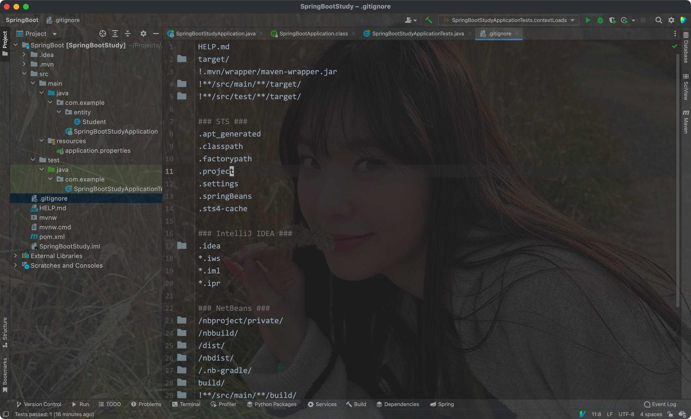
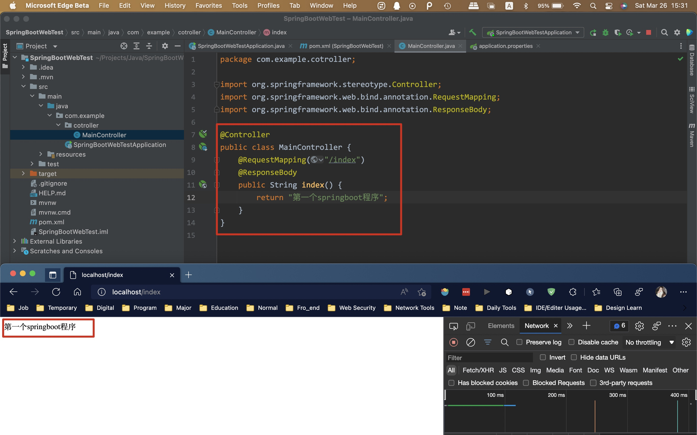

# 一、初入

好处:

- 比起之前SSM阶段，SpringBoot可以直接省去编写配置类的步骤，**通过started整合相关的框架、依赖和工具(**Tomcat、Mybatis)


- 创建一个SpringBoot项目


- 该面板中可以选择项目使用的依赖和其他的框架


SpingBoot为我们设置好了基本的配置，不需要配置类就能实现实体类的自动注入


<hr>


# 二、项目文件目录

- Application

SpringBootApplication注解中实现了自动扫描，所以不需要我们自己编写配置类


- maven配置


- 第一个依赖是SpringBoot的核心依赖
- 第二个依赖是SpringBoot的测试依赖


父项目中定义了一个依赖文件，专门用来管理当前SpringBoot版本对应的可兼容依赖版本:


- 我们的项目可以直接使用该父项目中的依赖，而不需要指定具体的版本:


- properties

> 这是SpringBoot中唯一的配置文件


该文件中编写的是SpringBoot的配置


- gitignore



其中展示的是git忽略的目录

<hr>


# 三、整合Web


## 1) 服务器


- 在创建项目时选择spring-web依赖


- 直接启动后，可在浏览器中访问:


- 直接编写controller即可

注意: Application和controller一定要在同一个包内(同级目录下)

Eg:




- 通过properties文件可以对SpringBoot进行一定的配置

Eg:


- 直接返回对象，可以转换为JSON格式了


- properties配置文件里的值可以通过`@Value`注解来获取

Eg:


## 2) SpringSecurity

- 导入对应的依赖:

```xml
<dependency>
  <groupId>org.springframework.boot</groupId>
  <artifactId>spring-boot-starter-security</artifactId>
</dependency>
```


可在properties文件中填写用户信息

但还是需要我们自己写配置类:


- 在application.properties配置文件中即可设置对应的用户信息:

```properties
server.port=80

spring.security.user.name=alex
spring.security.user.password=abcdef
spring.security.user.roles=user, admin
```


- 可以使用更简洁的`yaml`或者`yml`格式文件来代替`properties`:

```yaml
server:
  port: 80

spring:
  security:
    user:
      name: alex
      password: abcdef
      roles:
      - user
      - admin
```


> 在Spring Security5.7中，WebSecurityConfigurerAdapter类被弃置了

<hr>


# 四、整合MyBatic

依赖:

```xml
<dependency>
  <groupId>org.mybatis.spring.boot</groupId>
  <artifactId>mybatis-spring-boot-starter</artifactId>
  <version>2.2.0</version>
</dependency>
<dependency>
  <groupId>mysql</groupId>
  <artifactId>mysql-connector-java</artifactId>
</dependency>
```


编写Mapper:

- 注意加上`@Mapper`注解


编写对应的用户实体类:


编写对应的鉴权服务:

- 注意添加`@Service`注解
- 通过实现`UserDetailService`接口，重写其中的`loadUserByUserName`方法，通过自动注入`Mapper`来查询对应的用户实体类实例


编写SpringSecurity配置，重写另一个configure方法，验证用户:

- 通过`@Resource`注解将Service实例自动注入


<hr>


# 五、整合Thymeleaf模版引擎

在maven中导入对应的starter依赖:

```xml
<dependency>
  <groupId>org.springframework.boot</groupId>
  <artifactId>spring-boot-starter-thymeleaf</artifactId>
</dependency>
```


将主页和登录页放入resources下的template文件夹中，将静态资源放入resources下的static文件夹中:

- 注意在页面中设置thymeleaf的命名空间

```html
<html lang="en" xmlns:th="http://www.thymeleaf.org" 
				xmlns:sec="http://www.thymeleaf.org/extras/spring-security">
  
</html>
```


然后注意在登录页面设置csrf:


在登录表单中设置行为和发送的路径:


在controller中注册登录页面:


在SecurityConfiguration中设置登录页，并重新分配对应的页面权限和记住用户功能


在配置文件的spring.mvc项里设置对应的静态资源路径:


<hr>


# 六、日志系统

> 不管项目中其他组建/工具使用的是什么日志实现(Mybatis、Thymeleaf等框架工具的日志)
>
> - SpringBoot会将所有其他依赖的日志实现都去除
> - 将所有的日志都导向Slf4j作为日志门面(facade)
> - 最后统一使用LogBack作为日志实现(Log4j同一个作者的另一个更高效的日志实现)


- 通过Lombok注解可以直接使用LogBack日志实例对象


- 想要自定义自己的日志格式的话，需要创建一个`logback-spring.xml`文件
- 其会覆盖掉SpringBoot原本的日志配置

Eg:

```xml
<?xml version="1.0" encoding="UTF-8"?>
<configuration>
    <!--  导入其他配置文件，作为预设  -->
    <include resource="org/springframework/boot/logging/logback/defaults.xml" />

    <!--  Appender作为日志打印器配置，这里命名随意  -->
    <!--  ch.qos.logback.core.ConsoleAppender是专用于控制台的Appender  -->
    <appender name="CONSOLE" class="ch.qos.logback.core.ConsoleAppender">
        <encoder>
            <pattern>${CONSOLE_LOG_PATTERN}</pattern>
            <charset>${CONSOLE_LOG_CHARSET}</charset>
        </encoder>
    </appender>

    <!--  指定日志输出级别，以及启用的Appender，这里就使用了我们上面的ConsoleAppender  -->
    <root level="INFO">
        <appender-ref ref="CONSOLE"/>
    </root>
</configuration>
```


- SpringBoot的默认图标可以通过创建`banner.txt`文件来替换:

Eg:


<hr>


# 七、多环境配置

- 实际开发中，我们往往需要进行将项目在多种环境下运行(开发，测试，生产等等)，不同环境下使用到的配置往往也是不同的


创建两个`.yaml`文件作为不同环境下的配置:


- 通过原来的`application.yaml`文件中配置`spring.profile.active`选项来选择对应的配置

Eg:


通过在日志中设置`springProfile`标签，即可指定日志在不同环境下的输出:


```xml
<springProfile name="dev">
    <root level="INFO">
        <appender-ref ref="CONSOLE"/>
        <appender-ref ref="FILE"/>
    </root>
</springProfile>

<springProfile name="prod">
    <root level="INFO">
        <appender-ref ref="FILE"/>
    </root>
</springProfile>
```


配置不同的打包配置:

- 在maven的pom.xml中添加`profiles`标签


Eg:

```xml
<!--分别设置开发，生产环境-->
<profiles>
    <!-- 开发环境 -->
    <profile>
        <id>dev</id>
        <activation>
            <activeByDefault>true</activeByDefault>
        </activation>
        <properties>
            <environment>dev</environment>
        </properties>
    </profile>
    <!-- 生产环境 -->
    <profile>
        <id>prod</id>
        <activation>
            <activeByDefault>false</activeByDefault>
        </activation>
        <properties>
            <environment>prod</environment>
        </properties>
    </profile>
</profiles>
```


但具体的配置还需要在`build`标签中添加`resources`，并且在`application`主配置文件中修改active为`'@environment@'`才能生效:


Eg:

```xml
<resources>
<!--排除配置文件-->
    <resource>
        <directory>src/main/resources</directory>
        <!--先排除所有的配置文件-->
        <excludes>
            <!--使用通配符，当然可以定义多个exclude标签进行排除-->
            <exclude>application*.yml</exclude>
        </excludes>
    </resource>

    <!--根据激活条件引入打包所需的配置和文件-->
    <resource>
        <directory>src/main/resources</directory>
        <!--引入所需环境的配置文件-->
        <filtering>true</filtering>
        <includes>
            <include>application.yml</include>
            <!--根据maven选择环境导入配置文件-->
            <include>application-${environment}.yml</include>
        </includes>
    </resource>
</resources>
```


> 记得每次更换配置后，需要通过maven将原来的打包项目文件清理掉
>
> 注意maven配置的文件后缀名要与实际项目中的文件后缀相同: .properties, .yaml, /yml

<hr>


# 八、邮件接发


## 1. demo

1. 在SpringBoot项目中导入mail依赖:

```xml
<dependency>
  <groupId>org.springframework.boot</groupId>
  <artifactId>spring-boot-starter-mail</artifactId>
</dependency>
```


2. 在发送邮箱的设置中打开SMTP服务(SMTP服务器作为发送服务器，POP3是接收协议)


- 注意保存弹出的code，之后要作为密码添加到SpringBoot的配置文件中


3. 填写配置文件


4. 编写测试用例

- 导入start-mail后，可以通过自动注入的方式获取一个`JavaMailSender`实例对象
- 可以通过创建`SimpleMailMessage`或者`MimeMessage`实例对象来设置邮箱的内容:


SimpleMailMessage:

- void setSubject(String subject): 设置邮箱的`标题`内容
- void setText(String text): 设置邮箱的`正文内容`
- void setSentDate(Date sentDate): 设置邮件的`发送日期`
- void setTo(String to): 设置`收件人`的邮箱地址
- void setFrom(String from): 设置`发件人`的邮箱地址(必须与之前开通SMTP服务的邮箱地址同)


JavaMailSender:

> 其继承了MailSender接口

- void send(SimpleMailMessage simpleMessage) throws MailException: 接收一个`SimpleMailMessage`实例对象，完成邮件的发送
- 


Eg:

```java
SimpleMailMessage mailMessage = new SimpleMailMessage();
mailMessage.setSubject("【Microsoft】About your XGP account");
mailMessage.setText("Hello, Dear user,\n" +
                    "We are contacting you about your current Xbox Game Pass subscription." +
                    "While we appreciate add our Xbox fans, we have detected that your subscription was obtained through illegitimate means and is therefore in violation of the Microsoft Services Agreement.");
mailMessage.setSentDate(new Date());
mailMessage.setTo("907785012@qq.com");
mailMessage.setFrom("907785012@qq.com");

mailSender.send(mailMessage);
```


添加附件:

- 需要使用`JavaMailSender`实例对象调用`createMimeMessage()`方法才能创建一个`MimeMessage`对象
- 然后还需要创建一个`MimeMessageHelper`实例调用构造器方法传入`MimeMessage`对象实例，并制定multipart为true:

```java
MimeMessage mimeMessage = mailSender.createMimeMessage();
MimeMessageHelper helper = new MimeMessageHelper(mimeMessage, true);
```


- 通过`addAttachment`方法可以传入附件(文件名, 文件):

```java
helper.addAttachment("Joy.jpg", new File("/Users/alex/Projects/Java/SpringBootStudy/src/main/resources/static/image/Joy.jpg"));
```


其余和SimpleMailMessage一样:

```java
MimeMessage mimeMessage = mailSender.createMimeMessage();
MimeMessageHelper helper = new MimeMessageHelper(mimeMessage, true);

helper.setSubject("【Microsoft】About your XGP account");
helper.setText("Hello, Dear user,\n" +
               "We are contacting you about your current Xbox Game Pass subscription." +
               "While we appreciate add our Xbox fans, we have detected that your subscription was obtained through illegitimate means and is therefore in violation of the Microsoft Services Agreement.");
helper.addAttachment("Joy.jpg", new File("/Users/alex/Projects/Java/SpringBootStudy/src/main/resources/static/image/Joy.jpg"));

helper.setTo("907785012@qq.com");
helper.setFrom("907785012@qq.com");
mailSender.send(mimeMessage);
```

<hr>


## 2. 邮箱注册

- 导入`register.html`页面，记得修改对应的按钮:

```html
<button type="submit" class="btn btn-primary squer-btn sm-btn">登录</button>
```


<hr>


