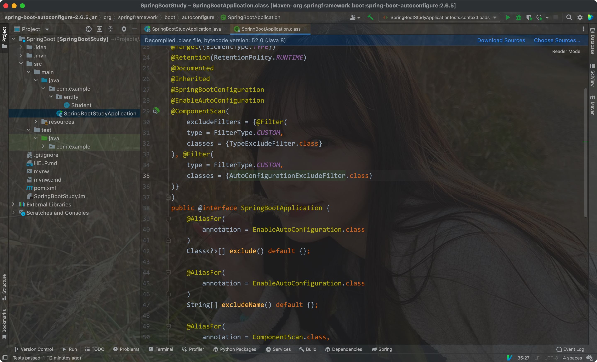
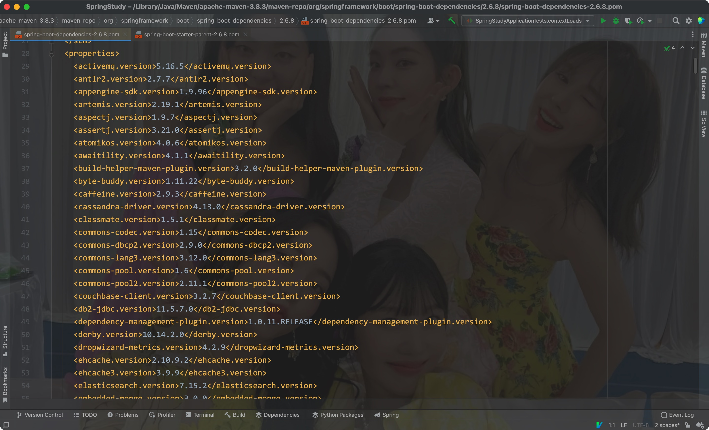

# 一、初入

好处:

- 比起之前SSM阶段，SpringBoot可以直接省去编写配置类的步骤，**通过started整合相关的框架、依赖和工具(**Tomcat、Mybatis)


- 创建一个SpringBoot项目


- 该面板中可以选择项目使用的依赖和其他的框架


SpingBoot为我们设置好了基本的配置，不需要配置类就能实现实体类的自动注入


<hr>


# 二、项目文件目录

- Application

SpringBootApplication注解中实现了自动扫描，所以不需要我们自己编写配置类




- maven配置


- 第一个依赖是SpringBoot的核心依赖
- 第二个依赖是SpringBoot的测试依赖


父项目中定义了一个依赖文件，专门用来管理当前SpringBoot版本对应的可兼容依赖版本:


- 我们的项目可以直接使用该父项目中的依赖，而不需要指定具体的版本:




- properties

> 这是SpringBoot中唯一的配置文件


该文件中编写的是SpringBoot的配置


- gitignore


其中展示的是git忽略的目录

<hr>


# 三、整合Web


## 1) 服务器


- 在创建项目时选择spring-web依赖


- 直接启动后，可在浏览器中访问:


- 直接编写controller即可

注意: Application和controller一定要在同一个包内(同级目录下)

Eg:


- 通过properties文件可以对SpringBoot进行一定的配置

Eg:


- 直接返回对象，可以转换为JSON格式了


- properties配置文件里的值可以通过`@Value`注解来获取

Eg:


## 2) SpringSecurity

- 导入对应的依赖:

```xml
<dependency>
  <groupId>org.springframework.boot</groupId>
  <artifactId>spring-boot-starter-security</artifactId>
</dependency>
```


可在properties文件中填写用户信息

但还是需要我们自己写配置类:


- 在application.properties配置文件中即可设置对应的用户信息:

```properties
server.port=80

spring.security.user.name=alex
spring.security.user.password=abcdef
spring.security.user.roles=user, admin
```


- 可以使用更简洁的`yaml`或者`yml`格式文件来代替`properties`:

```yaml
server:
  port: 80

spring:
  security:
    user:
      name: alex
      password: abcdef
      roles:
      - user
      - admin
```


> 在Spring Security5.7中，WebSecurityConfigurerAdapter类被弃置了

<hr>


# 四、整合MyBatic

依赖:

```xml
<dependency>
  <groupId>org.mybatis.spring.boot</groupId>
  <artifactId>mybatis-spring-boot-starter</artifactId>
  <version>2.2.0</version>
</dependency>
<dependency>
  <groupId>mysql</groupId>
  <artifactId>mysql-connector-java</artifactId>
</dependency>
```


编写Mapper:

- 注意加上`@Mapper`注解


编写对应的用户实体类:


编写对应的鉴权服务:

- 注意添加`@Service`注解
- 通过实现`UserDetailService`接口，重写其中的`loadUserByUserName`方法，通过自动注入`Mapper`来查询对应的用户实体类实例


编写SpringSecurity配置，重写另一个configure方法，验证用户:

- 通过`@Resource`注解将Service实例自动注入


<hr>


# 五、整合Thymeleaf模版引擎


