# 一、获取/安装

- Official site:

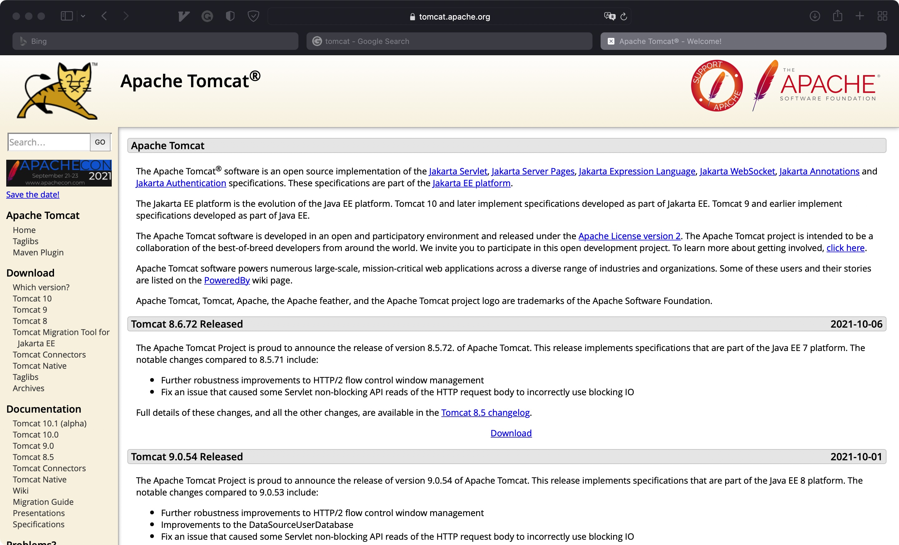


- Download Options:

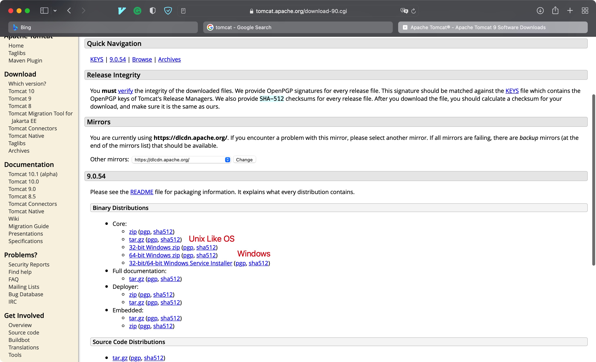


# 二、配置/启动


- 文件结构

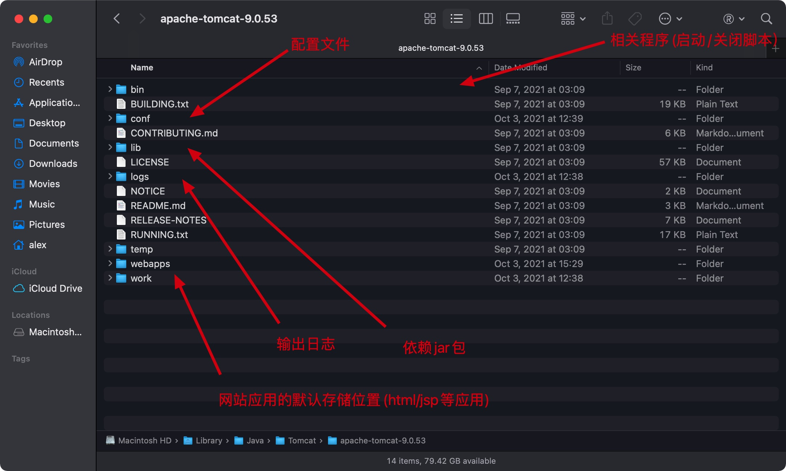


## 1. 配置


### 1) /bin目录下的应用

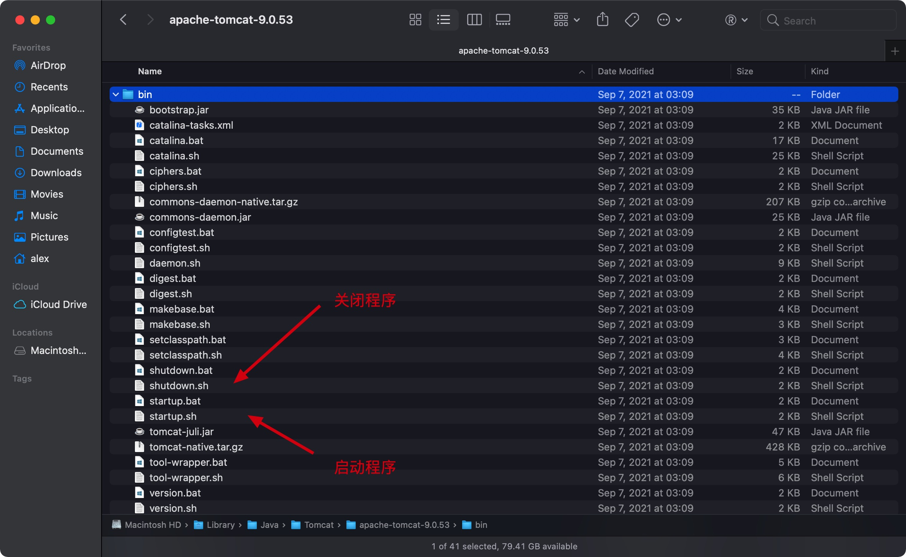


- Unix下启动程序

```shel
./program_name
```


Eg:

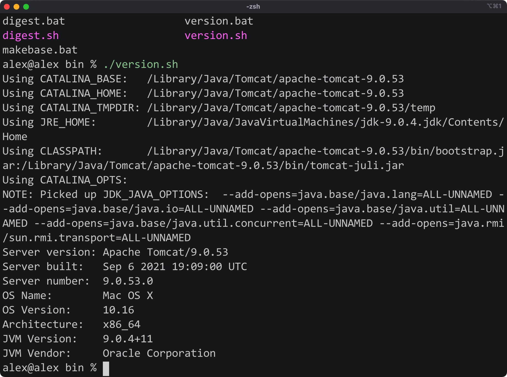


### 2) /conf目录下的应用

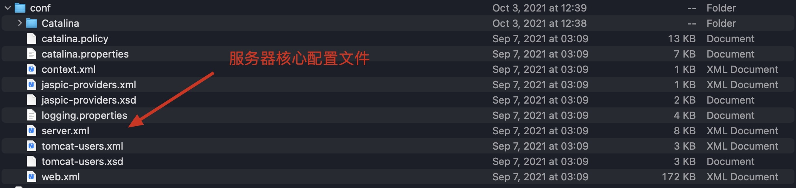


- 通过server.xml查看/修改配置

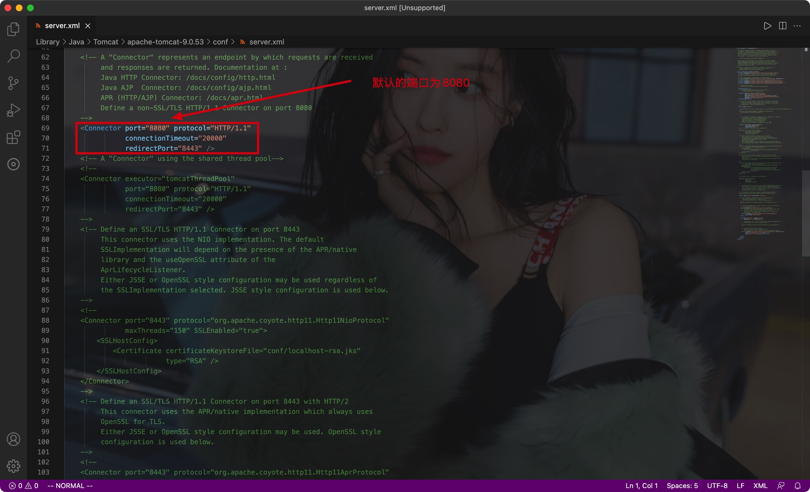


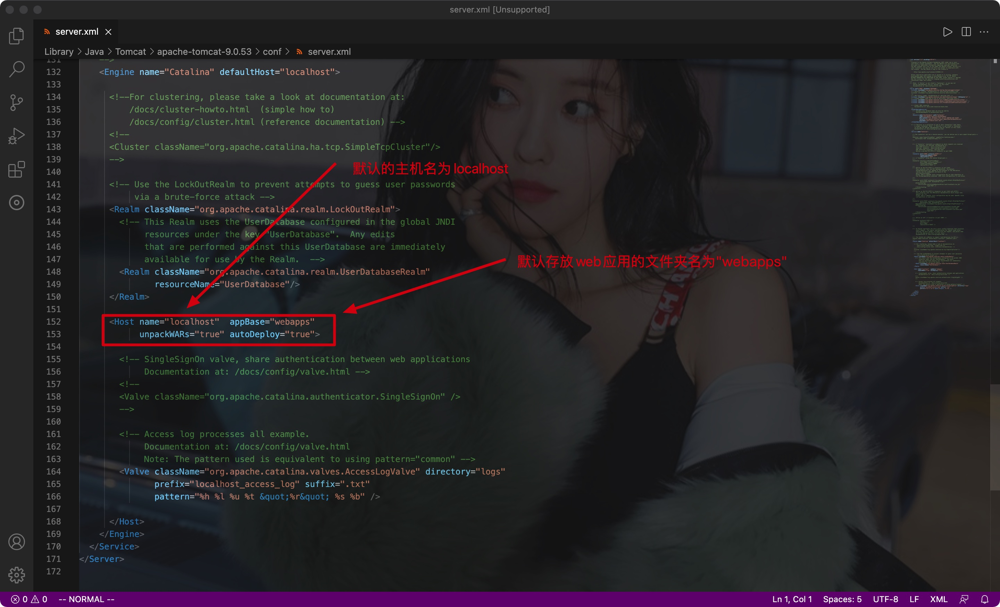


### 3) /lib目录下的应用

- 一些依赖jar包

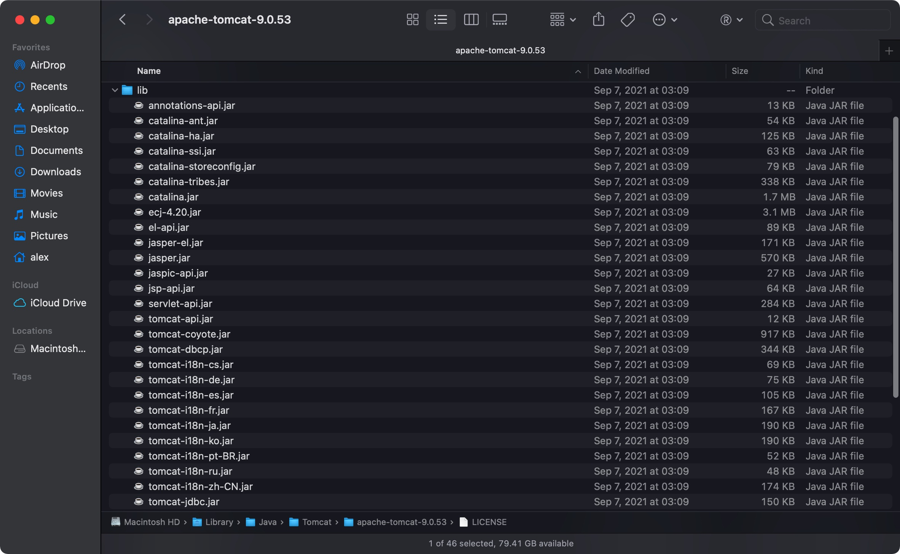


### 4) /webapps目录下的应用

- 其中每一个文件夹代表一个应用
- 当通过默认域名访问Tomcat时，默认访问ROOT目录下的index.jsp文件

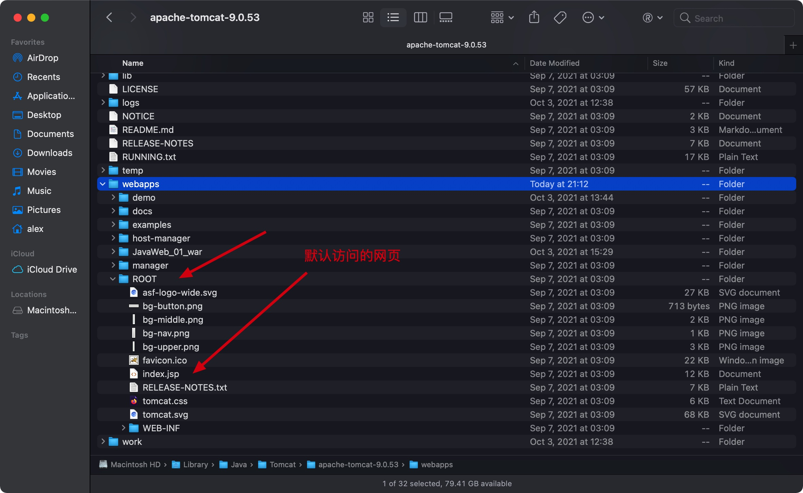


## 2. 启动

- Unix下使用./直接启动即可
- 启动后，通过**conf目录的server.xml配置文件**中**指定的host和端口号**即可访问

Eg:

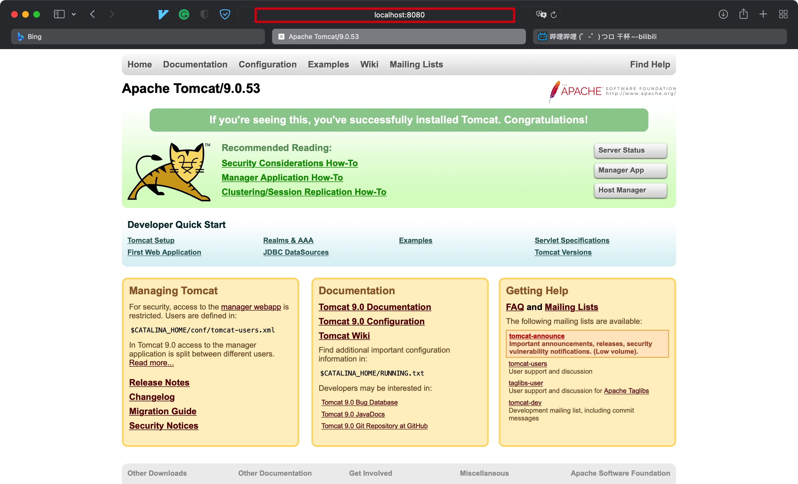

- 每次修改server.xml文件后都需要重启服务器


DNS解析顺序:

本地 -> DNS服务器


**拓展**

- 注意如果我们在server.xml中修改了默认的主机名，**则需要将该域名写入系统的host文件中才行，不然无法解析！**


Eg:

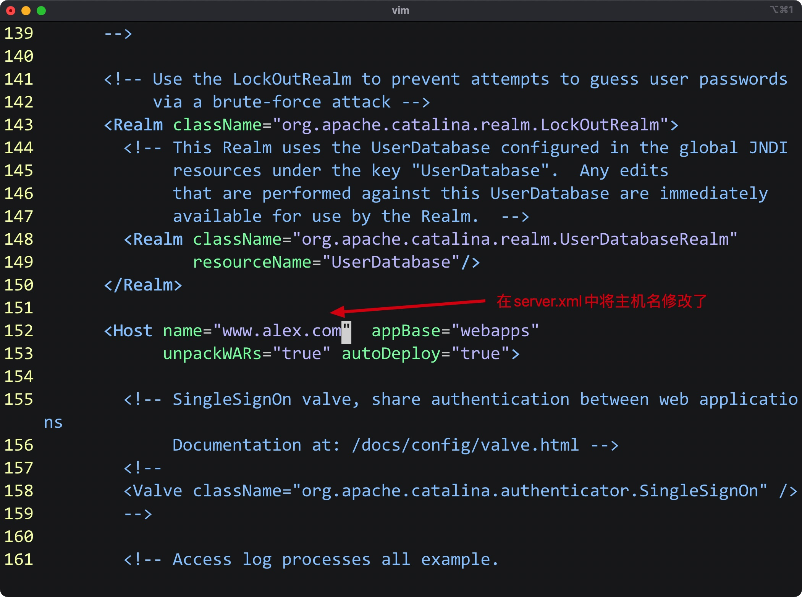


- Mac OS上host文件的路径: /etc/hosts

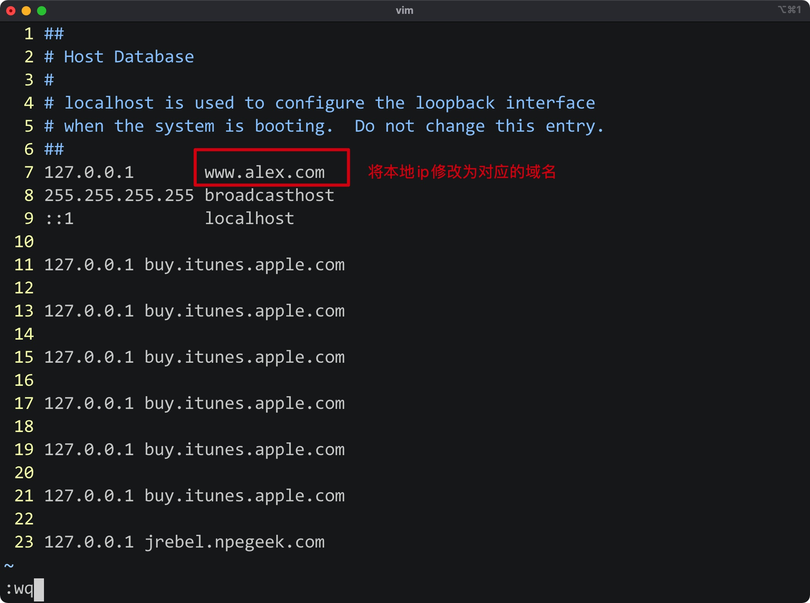


- 正常访问

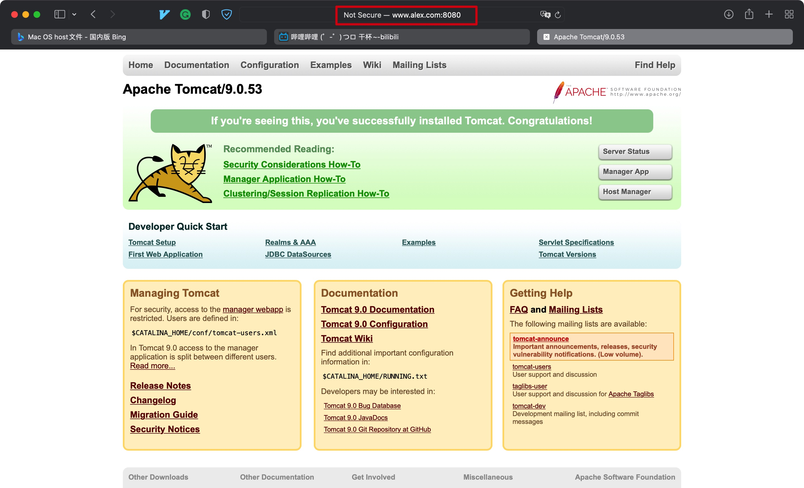


## 3. 发布自己的网站


- Tomcat网站的默认存放位置: webapps(可通过conf/server.xml文件修改)。默认会访问ROOT文件夹中的index.jsp
- 我们通过在webapps目录下创建一个文件夹，并创建对应的index.jsp或者index.html即可通过路径直接访问

```mysql
-- webapps
	- ROOT
		- WEB-INF
			- web.xml
		- index.jsp
	- JavaWeb_01_war
		- WEB-INF
			- web.xml
		- index.html
```


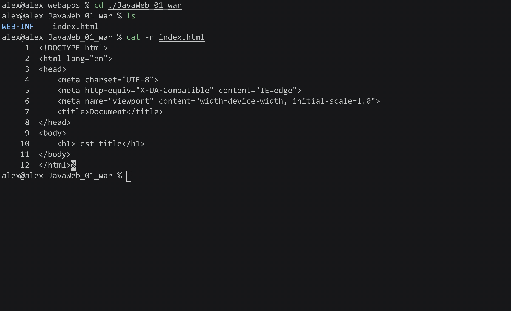


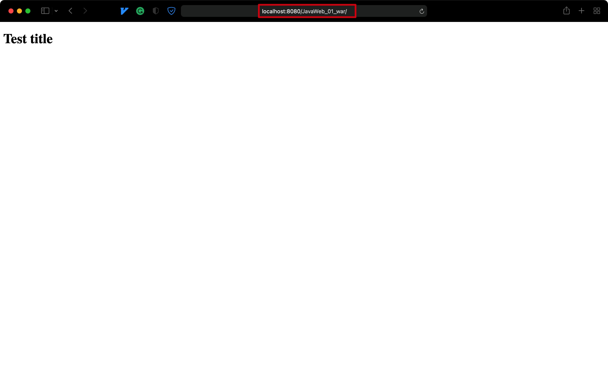


