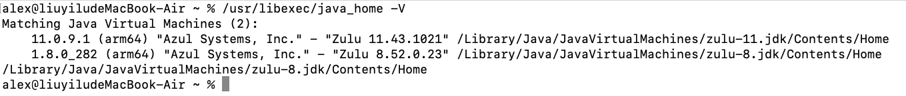
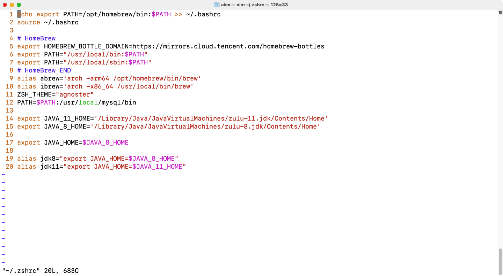
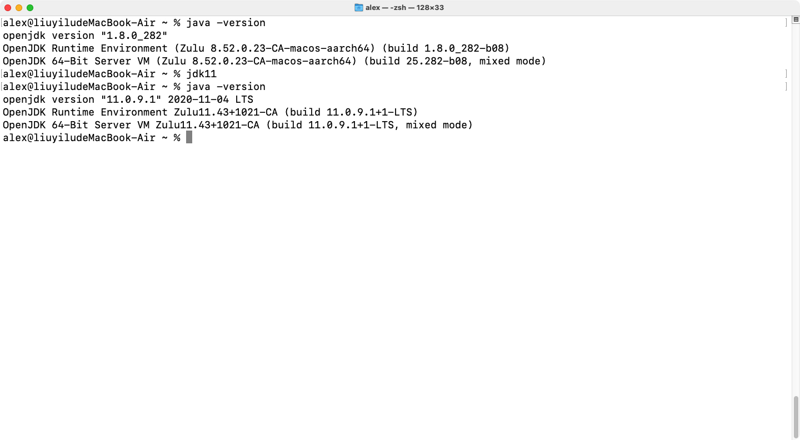

# 1.Check installed jdk version


```
/usr/libexec/java_home -V
```


exam:




# 2.Edit environment variable


Zsh:

```
vim ~/.zshrc
```


Bash:

```
vim ~/.bash_profile
```

 


Content:

```
export JAVA_versionNum_HOME='install directory'
alias jdk_versionNum="export JAVA_HOME=$JAVA_versionNum_HOME"
```


exam:




# 3.update profile


Zsh:

```
source .zshrc
```


Bash:

```
source .bash_profile
```


# 4.change jdk version


```
jdk_versionNum
```


exam:

