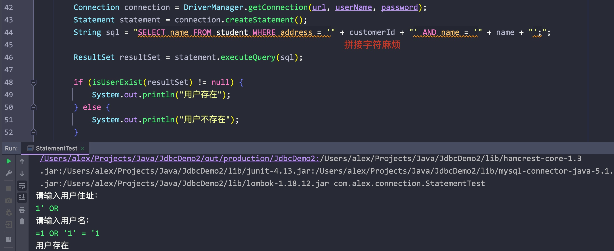

# 一、获取数据库连接

- Java定义了一个Driver驱动接口，每个想要接入的数据库都需要实现这个类
- 所以我们需要导入对应数据库重写的接口

## 1.1 第一种获取连接的方式

## 1.2 第二种获取连接的方式

- 其实在MySQL对应jar包内有一个META-INF/services/java.sql.Driver文件
- MySQL默认为我们加载了，所以可以省去加载的步骤直接通过DriverManager获取连接

## 1.3 第三种方式

连接所需的参数:

实现驱动、url，password，user

1. 将这些参数放在单独的配置文件中方便修改，实现了程序与数据的解耦(分离)
2. 项目编译时不需要重新打包(代码没变，只是外部的配置文件变了)

# 二、使用PreparedStatement进行CRUD

## 2.1 Statement的弊端

- 在使用Statement对象调用execute方法时，拼接字符串很麻烦
- 会被SQL注入攻击

SQL注入:

为防止SQL注入，可以使用PreparedStatement

## 2.2 PreparedStatement对象

- 写好SQL语句，其中需要传入的参数用占位符(?)代替
- 通过Connection对象调用prepareStatement方法，传入写好的SQL语句，返回一个PreparedStatement对象
- 通过该PreparedStatement对象调用setType()方法设置占位符代表的参数(index, param)，注意索引从1开始

## 2.3 通用的更新方法

## 2.4 查询操作

- execute(): 单纯的执行
- executeQuery(): 该执行会返回一个ResultSet对象
- 通过ResultSet对象，调用getType获取每条记录对应索引的值即可
- 最好将每条数据封装为一个对象

