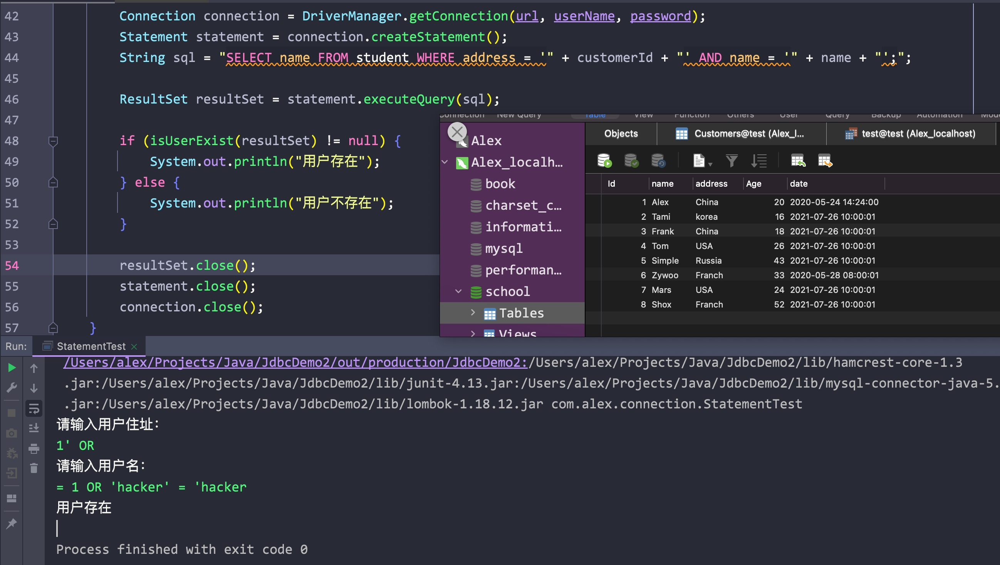

# 一、获取数据库连接

- Java定义了一个Driver驱动接口，每个想要接入的数据库都需要实现这个类
- 所以我们需要导入对应数据库重写的接口


## 1.1 第一种获取连接的方式


## 1.2 第二种获取连接的方式


- 其实在MySQL对应jar包内有一个META-INF/services/java.sql.Driver文件
- MySQL默认为我们加载了，所以可以省去加载的步骤直接通过DriverManager获取连接


## 1.3 第三种方式


连接所需的参数:

实现驱动、url，password，user


1. 将这些参数放在单独的配置文件中方便修改，实现了程序与数据的解耦(分离)
2. 项目编译时不需要重新打包(代码没变，只是外部的配置文件变了)

<hr>


# 二、使用PreparedStatement进行CRUD


## 2.1 Statement的弊端

- 在使用Statement对象调用execute方法时，拼接字符串很麻烦
- 会被SQL注入攻击





SQL注入:

为防止SQL注入，可以使用PreparedStatement


## 2.2 PreparedStatement对象

- 写好SQL语句，其中需要传入的参数用占位符(?)代替
- 通过Connection对象调用prepareStatement方法，传入写好的SQL语句，返回一个PreparedStatement对象
- 通过该PreparedStatement对象调用setType()方法设置占位符代表的参数(index, param)，注意索引从1开始


## 2.3 通用的更新方法


- 使用可变参数即可传入多个参数
- 利用参数的length字段从而确定所需设置占位符数量
- 通过PreparedStatement对象调用setObject方法设置占位符，其中参数的索引从1开始，但参数从0开始


## 2.4 查询操作

- execute(): 单纯的执行
- executeQuery(): 该执行会返回一个ResultSet对象
- 通过ResultSet对象，调用getType获取每条记录对应索引的值即可
- 最好将每条数据封装为一个对象


## 2.5 单表的通用查询

- 通过ResutlSet对象调用getMetaData()方法获取该对象的元数据类
- 通过该元数据类调用getColumnCount()方法获取结果集中的字段数

syntax:

```java
ResultMetaData metaData = resultSet.getMetaData();
int colCount = metaData.getColumnCount();
```


- 进入循环，在其中通过ResultSetMetaData对象调用getColumnName()，传入对应的字段索引，获取对应的字段名称

syntax:

```java
String colName = metaData.getColumnName(index);
```


- 通过用户类的反射获取字段字符串对应的字段对象
- 通过字段对象设置字段的访问可见
- 再通过set方法，传入对象和值，以设置对应当前字段的值

syntax:

```java
Field field = ClassName.class.getDeclaredField(colName);

field.setAccessible(true);
field.set(curObj, colVal);
```


## 2.6 获取表的别名

- 在MySQL的表中，对应字段的命名规则为: user_id
- 而java中类的字段名为小驼峰，所以我们应该在SQL中对表起别名
- 此时不能再使用getColumnName方法获取字段了，因为该方法获取的是原字段值
- 之后应该在通过ResultSetMetaData对象调用getColumnLable方法，传入对应的索引值，从而获取表的别名


## 2.7 查询的结构

- MySQL中的表的字段类型和一个类对应字段的类型要一致
- 由于命名规则的问题，SQL语句中需要对表起别名，获取别名时通过ResultSetMetaData对象调用getColumnLable方法获取结果集中列的别名(不能使用getColumnName，该方法会返回原始的列名)
- 由于占位符数量未知，所以我们使用可变参数的长度来设置占位符
- 通过类的反射: ClassName.class.getDeclaredField方法传入之前获取的列的别名，返回一个对应该列的别名的Field对象
- 通过Field对象调用setAccessible方法，将可见性设置为true
- 再调用set方法，传入对象，传入值即可


## 2.8 通用表的查询

- 将单表通用查询中的具体类变为一个泛型类
- 添加一个泛型类作为参数(Class<T> clazz)，传入的clazz是什么类型，返回的就是什么类型
- 其余与单表一致


返回一个对象


返回对象集合


## 2.9 PreparedStatement的优点

- 解决了Statement拼串麻烦的问题(使用占位符代替输入的条件变量)
- 预防了SQL注入问题(SQL语句会预编译，SQL中的逻辑关系不再改变)
- PreparedStatement对象可以操作Blob数据(可传入流)，而Statement不行
- Preparedstatement对象可以实现高效的批量操作


## 2.10 小结

- 两种思想
    - 面向接口编程
    - ORM思想(Object Relational Mapping)
        - 一个数据表对应一个java类
        - 表中一条记录对应一个对象
        - 表中一个字段对应对象中的一个属性
- 两种技术
    - JDBC结果集ResultSet的元数据: ResultSetMetaData
        - 获取列数: getColumnCount(int index)
        - 获取列的别名: getColumnLable(int index)
    - 通过反射可以创建对应类的对象，之后通过别名获取属性，设置该对象的列值


