# 一、语法


## 1. 准备工作

JS在HTML中有两种导入方式:

- 在`head`标签中添加`script`标签后在标签内编写JS代码
- 以单独的js文件的方式，在`script`标签中通过`src`属性指定js的路径

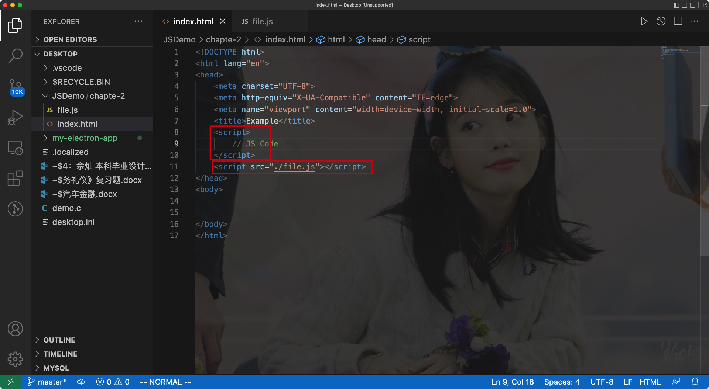


注意:

> 将script放在</body>标签之前**能够使得浏览器更快地加载页面**

- 这里我们没有在`script`标签内指定`type="text/javascript"`这个属性，因为脚本默认是JS，所以不需要指定

<hr>


## 2. 语法


### 语句

- 每个语句放在不同的行上就可以隔开，想要放在一行则需要使用`;`隔开，最好在每句末尾都加上`;`

<hr>


### 注释

```js
// 单行
<!-- 同样是单行注释(不推荐)

/*
多行
*/
```

<hr>


### 变量

为变量赋值:

```js
mood = "happy";
age = 33;
```


通过弹窗显示两个变量:

```js
alert(mood);
alert(age);
```


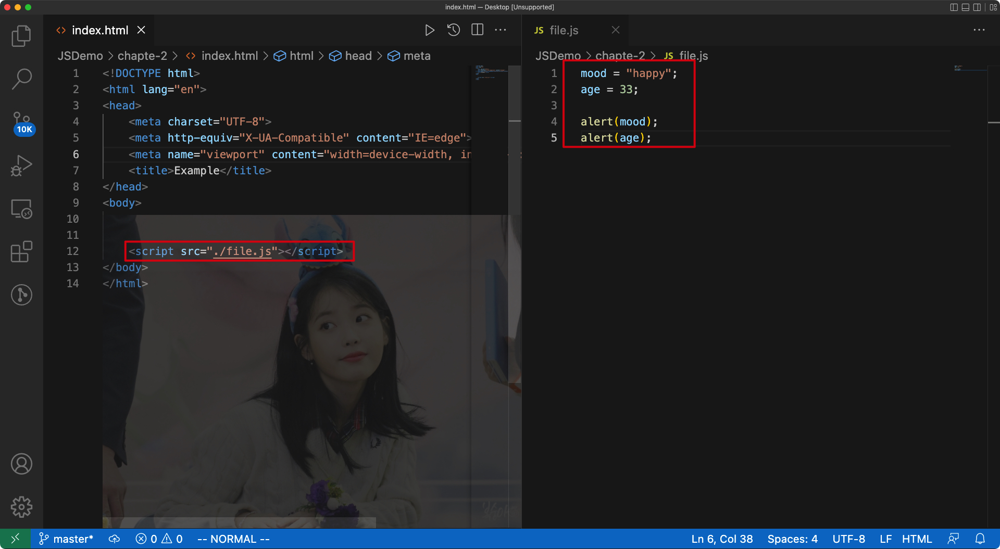


- JS中允许直接对变量赋值而不声明，赋值操作将自动声明该变量
- 提前声明是一个好习惯:

```js
var mood;
var age;

// 通过一条语句一次声明多个变量:

var mood, age;

// 同时完成声明和赋值:

var mood = "happy";
var age = 33;

// 或者这样:
var mood = "happy", age = "33";
```


注意:

- JS中区分大小写
- JS中不允许变量名包含空格或者标点符号(除了$)
- 变量名命名规则同C语言(小驼峰)或者大驼峰

<hr>


### 数据类型

js是一种弱类型语言，`可以任意修改变量的类型`


JS中的数据类型:

- 字符串
- 数值
- 布尔值

<hr>


### 数组

通过`Array`关键字可以声明一个数组，并制定数组的初始长度:

```js
var beatles = Array(4);
```

- 也可以在声明数组时不给出数组的长度:

```js
var beatles = Array();
```


设置/填充数组操作需要通过下标来完成:

```js
array_name[idx] = val;
```


- 可以在声明数组的同时对其进行填充操作:

```js
var beatles = Array("John", "Paul", "George", "Ringo");

// 可以直接省略Array关键字，该用方括号:

var beatles = ["John", "Paul", "George", "Ringo"];
```

js中数组可以存法不同类型的变量、值

> 数组中还可以是其他的数组

<hr>


### 对象

创建对象:

```js
var lennon = Object();
lennon.name = "John";
lennon.year = 1940;
lennon.living = false;
```


也可以通过花括号的语法创建对象:

```js
var lennon = { name: "John", yaer: 1940, living: false };
```


Eg:

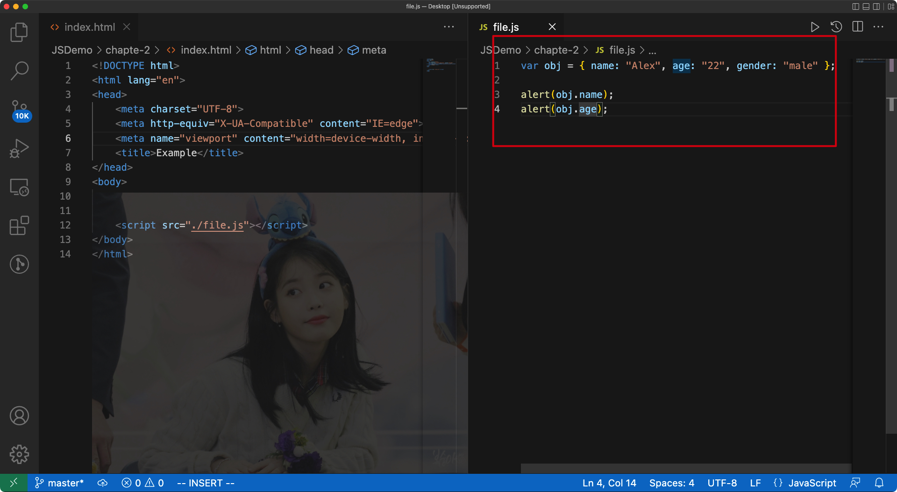

<hr>


## 3. 操作


注意:

> JS中`===`才是严格相等，同理`!==`才是严格不相等

<hr>


## 4. 函数

定义函数的语法:

```js
function func_name(arguments) {
  statements;
}
```


JS的函数中不需要指定返回类型，直接使用`return`语句返回即可

我们可以使用一个变量来接收返回值

> 函数还可以视为一种数据类型(类)


Eg:


<hr>


## 5. 对象

- 对象也是JS中的一种数据类型


对象中可以有`属性|字段`和`方法|函数`

创建一个对象实例的语法:

```js
var instance = new Object;
```


### 1) 内建对象

> js中预先定义好的对象就是内建对象

- 数组就是一个内建对象，通过其`length`属性我们就可以获取它的长度
- Math对象可以直接使用：`round方法`、`floor方法`、`ceil方法`等等

<hr>


### 2) 宿主对象(host object)

> 部分对象由JS的运行环境提供，这些对象称为宿主对象(浏览器等等)

通过`document`对象，我们可以获取页面中的任何一个元素的信息

<hr>


# 二、DOM


## 1. DOM中的D

> D即document

<hr>


## 2. DOM中的O

> O即Object


JS中有三种对象:

- 用户定义对象
- 内建对象
- 宿主对象


在JS的最初版本中，最基础的是`window`对象

> window对象对应着整个浏览器窗口，其对应的属性和方法称为`BOM`(Browser Object Model)

现在不需要再使用该对象了，专心于`document`对象即可

<hr>


## 3. DOM中的M

> M即Model


DOM的思想就是将每个页面视作一个文档，其中每个文档都可以用"树"表示

Eg:

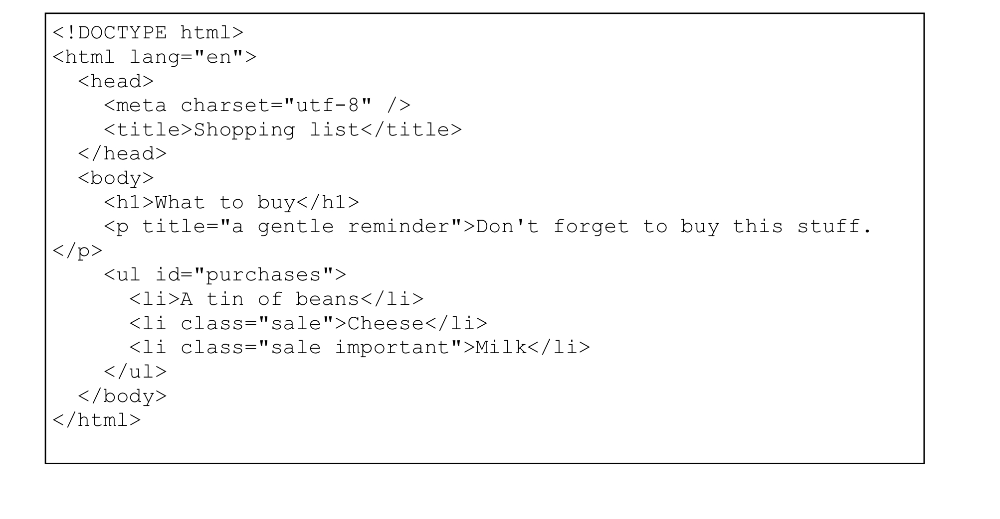


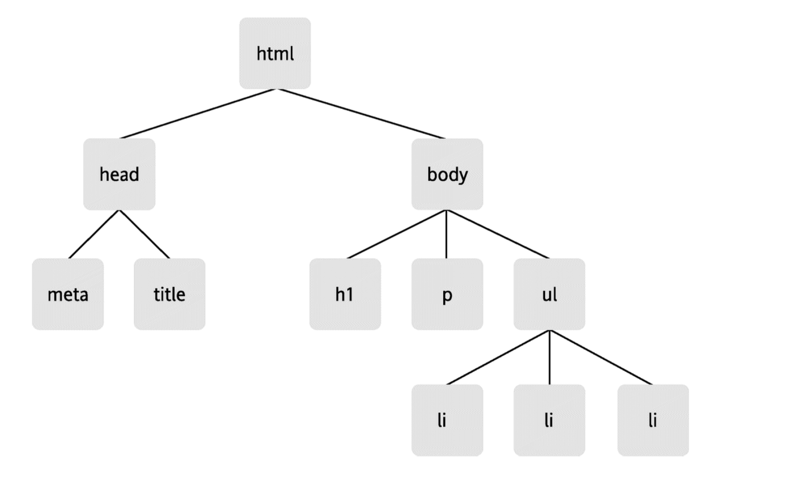

<hr>


## 4. 节点

> DOM中，文档是节点构成的集合


### 1) 元素节点

> DOM的原子是`元素节点`

<hr>


### 2) 文本节点

> 包含文本的节点就是一个文本节点

<hr>


### 3) 属性节点

Eg:

```html
<p title="a gentle reminder">Don't forget to buy this stuff.</p>
```


- 其中`title`就是一个`属性节点`

<hr>


### 4) 获取元素

获取元素节点的三种DOM方法:

- 通过元素ID
- 通过标签名
- 通过类名


1. getElementById

通过该方法可以获取有**指定id值的元素节点对应的对象**

Syntax:

```js
document.getElementById("id");
```


Eg:

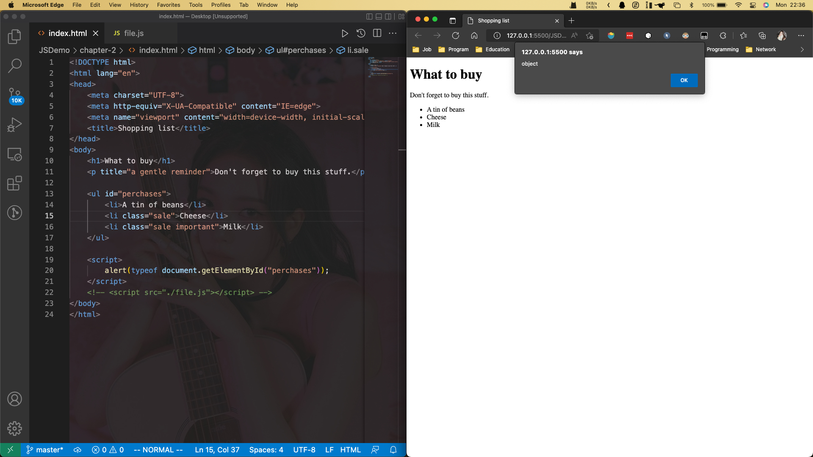

<hr>


2. getElementsByTagName

通过该方法，可以**通过标签的名字返回一个对象数组**

syntax:

```js
document.getElementsByTagName("tagName");
```


Eg:


该方法返回的对象可以用一个变量来代替

我们可以通过for循环来获取其中的每个对象

Eg:

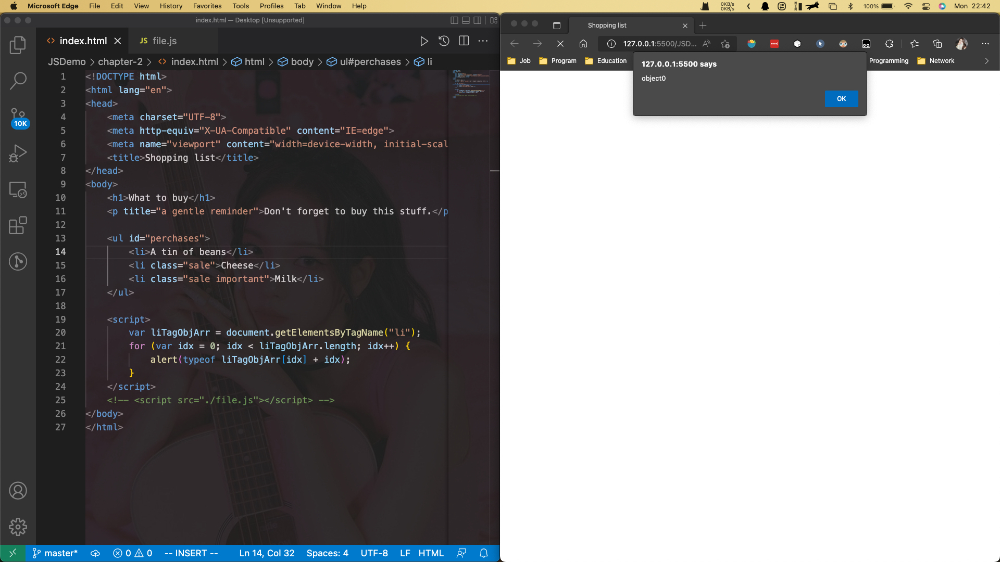

---


3. getElementsByClassName

> 改方法为HTML5中新增的方法

改方法可以让我们能够通过`class`属性中的类名获取对应的元素集合


Syntax:

```js
document.getElementsByClassName(class_name);
```

- 如果需要查找带有多个类名的元素，可以在参数同通过空格将类名进行分隔即可:

```js
document.getElementsByClassName(class_name1 class_name2);
```


Eg:

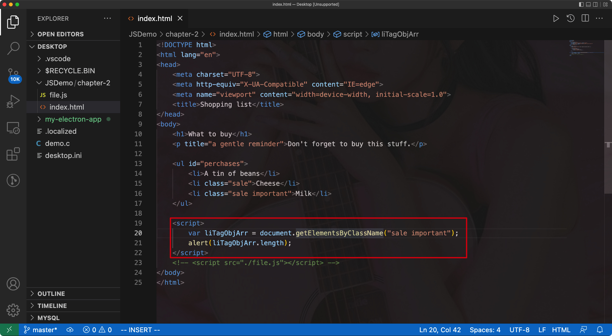


---


## 5. 获取/设置属性

- 当我们通过前面三种方法获取一个元素/结点后，就可以获取其各个属性


- getAttribute: 获取元素/结点中对应的属性值
- setAttribute: 修改元素/结点中对应的属性值


### 1) getAttribute

- 该方法可以查询对应属性的名字

Syntax:

```js
obj.getAttribute("attributeName");
```


> getAttribute方法不属于document对象，只能通过元素结点对象调用

Eg:

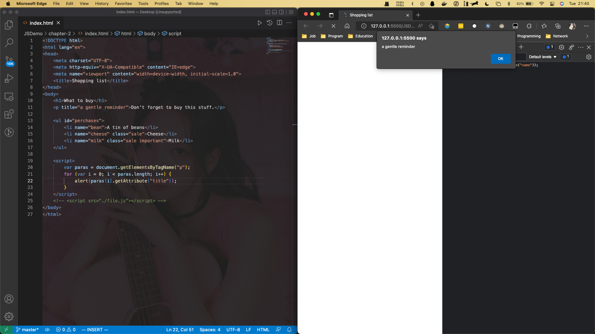


如果对应的<p>标签中没有值，那么此时通过`getAttribute`方法得到的结果只能是null


通过判断返回值是否为null，我们可以跳过没有对应属性的弹出值

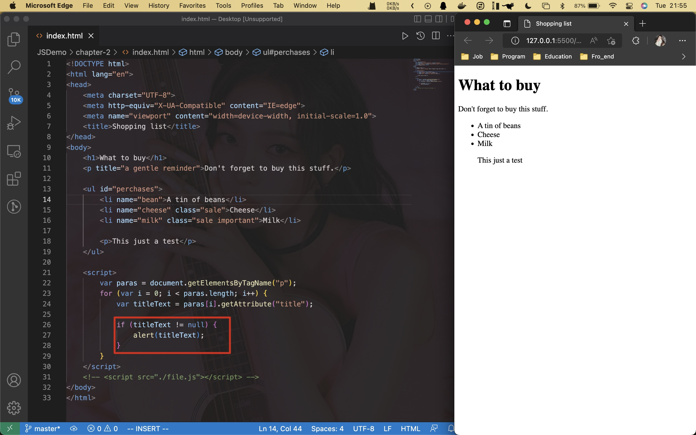


我们还可以将if中的句子修改得更加简单一些:

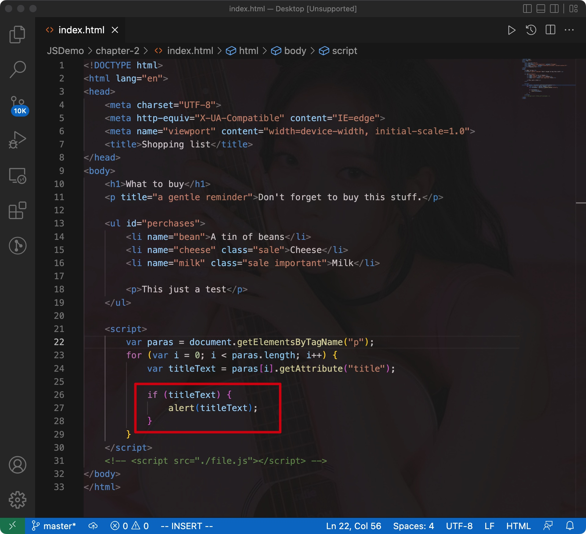

---


### 2) setAttribute

- 该方法可以对结点值进行修改，但同样只对元素节点对象有用

Syntax:

```js
object.setAttribute(attribute, value);
```


Eg:

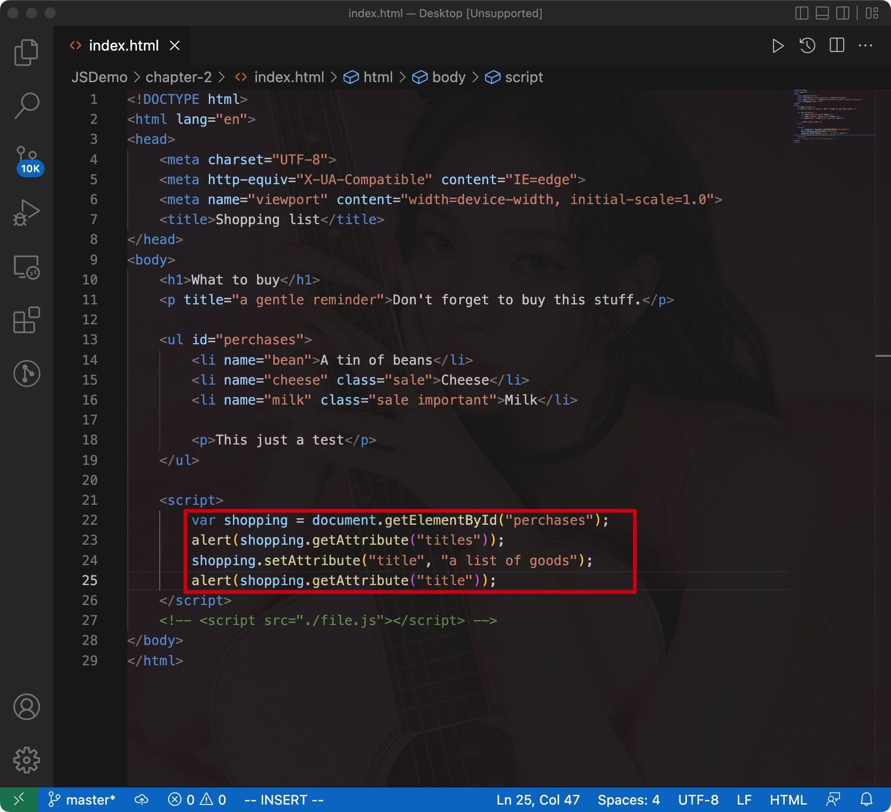


- 如果对应的元素节点中没有对应的属性，setAttribute方法就会创建该属性再赋值
- 如果有相关的属性，setAttribute方法则会覆盖掉原来的值


注意:

> 通过setAttribute方法修改后，页面的源代码并未改变
>
> 即：setAttribute所做的修改并不会反映在文档本身的代码当中


DOM的工作模式:

加载文档静态内容 -> 动态刷新 -> 动态刷新时并不会影响文档的静态内容

---


# 三、JS图片库

如果网页中图片比较多，那么产生的流量就会非常大，为了解决这个问题，我们应该将所有的图片浏览链接放在图片库的主页中

> 只有当用户点击对应的图片链接时，才会加载对应的图片

---


## 1. 标记

Eg:


