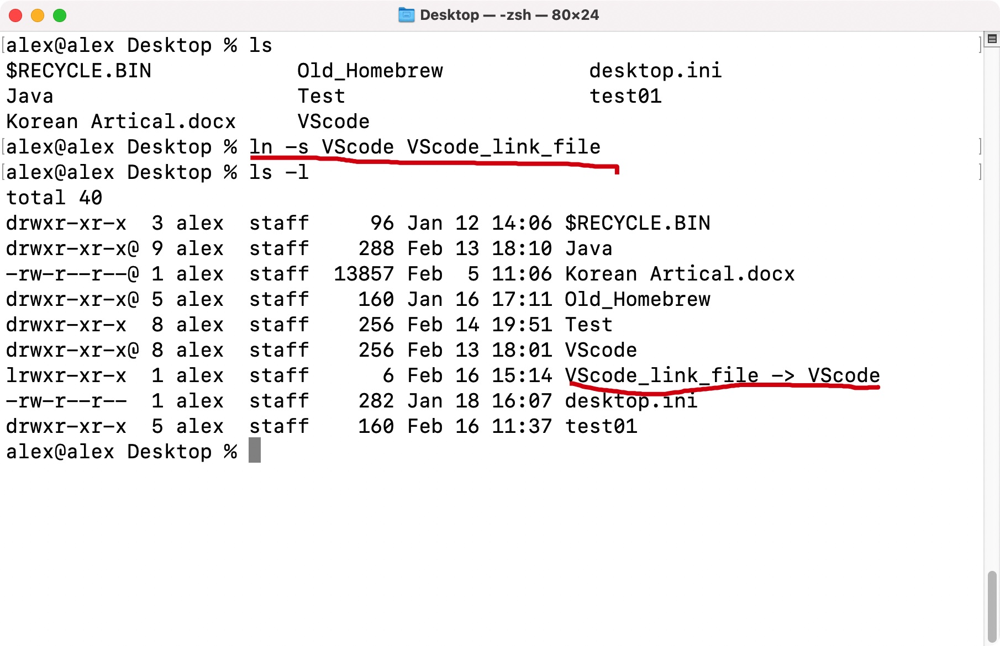
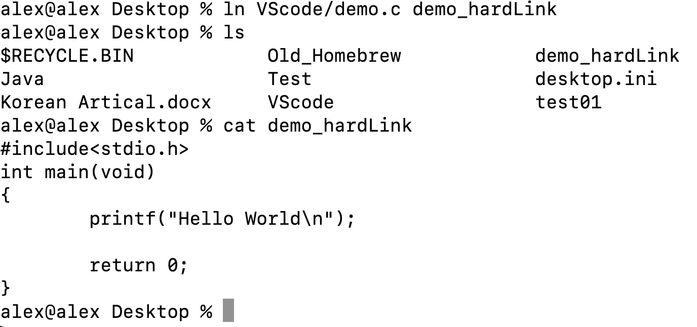
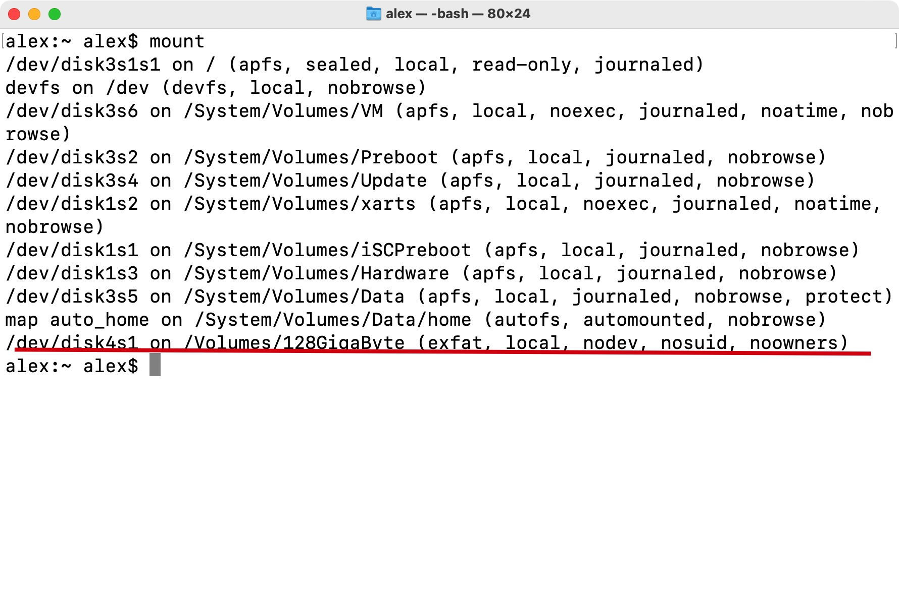

# 1.不同的发行版


- Debian --> Ubuntu, Kali, Deepin
- Fedora --> Red Hat, 
- openSuzu

****

# 2.四个组成部分


**Linux真正的名字**:GNU/Linux

- Linux kernel 内核
- GNU工具(开发基础应用、驱动)
- GUI (graphic user interface)用户图形界面
- App 应用

****


# 3.GNU


模仿Unix的工具，移植到Linux，为其提供工具

**供Linux使用的工具: coreutils coreutilities软件包**


## 1) 处理文件

读写，保存等


## 2) 操作文件

删除，复制


## 3) 管理进程

结束进程，停止进程


# 4.shell


让用户和计算机交互


- shell提供的命令界面(CLI) Command Lind Interface
- 提供的图形界面(GUI)


## 1) bash shell


基础的shell，兼容所有的发行版


## 2) zsh

在MacOS上常用，包含其他很多shell的特性


## 3) oh-my-zsh

更强大，主流


## 4) other


ash, korn, tcsh...

****


# 5.GUI


X Windows

KDE(基于QT)

GNOME(由GNU开发)

Unity(来自GNOME，用于Ubuntu)

****


# 6.shell-CLI

- tty: teletypewriter
- @前是用户名，@后是计算机名
- “~”为当前的用户目录(home) 位置: /home
- "$"等待用户输入
- "man 命令名"可查看命令使用方式
- 可使用"&&"将两个命令连接起来
- "!$"可以代替成为上一条命令的最后一个路径，作为命令的参数


文件扩展匹配符

- "*"，可替换多个符号
- 使用"?"，可替换单个符号

元字符通配符

- 可用[]进行限定查找


exam:

```shell
ls -l no[range]e.txt
```


使用"&&"连接命令：


例子：

按文件类型查看


## 1) ls

显示当前目录下的所有文件(list files)

```shell
ls
```


显示隐藏文件

```shell
ls -a
```


显示文件信息

```shell
ls -l
```


一列显示

```shell
ls -1
```


逗号分隔显示

```shell
ls -m
```


递归显示(目录结构)

```shell
ls -R
```


按照修改时间列出文件和文件夹信息

```shell
ls -ltr
```


为目录加"/"后缀，可运行文件加"*"后缀

```shell
ls -F
```


最常用

```shell
ll
```


## 2) cd


切换目录(change directory)


切换至用户目录

```shell
cd ~
cd
```


​	返回到上一目录

```shell
cd ..
```


返回到上两级目录

```shell
cd ../..
```


返回到上一次的目录

```shell
cd -
```


快速跳转至上一条命令最后参数中的路径

```shell
cd !$
```


## 3) pwd

显示当前目录(print working directory)


```shell
pwd
```


## 4) touch


默认使用时，会创建一个新文件

```shell
touch file_name.file_type
```


exam:


对于已经存在的文件，可以用touch命令更新其创建时间，且不会改变文件的内容:


## 5) cp

复制文件(copy)


**注意事项**

- 使用cp命令时，如果目标文件已存在，则会进行覆盖重写；如果目标文件不存在，则会创建一个目标文件
- 使用cp命令时，可以添加参数"-i"以在复制之前确认是否存在目标文件，避免文件内容丢失(强制要求添加)


例子:

```shell
cp resource_file target_file/target_directory
```


exam:


添加参数"-i"防止已存在的目标文件被重写(必须使用)


格式：

```shell
cp -i 源文件 目标文件
```


exam:


添加参数"-R"复制文件夹

格式:

```shell
cp -R 源文件夹 目标文件夹
```


exam:


## 6) 终端中快速移动光标


让光标在单词中跳跃：

Windows:

```
ctrl + 左右方向键
```


Mac:

```
option + 左右方向键
```


移动到命令开头:

```
ctrl + A
```


移动到命令结尾

```
ctrl + E
```


直接删除一行命令

```
ctrl + U
```


移动光标

```
左移：ctrl + B
右移：ctrl + F
```


交换之前的字符(将光标选中的字符与光标之前的字符交换)

```
ctrl + T
```


搜索之前使用的命令

```
ctrl + R
```


删除光标之后的内容

```
ctrl + K
```


删除光标之前的内容

```
ctrl + U
```


上一条/下一条命令

```
ctrl + P = 上
ctrl + N = 下
```


回车

```
ctrl + J
```


## 7) mv

可移动/重命名(move)文件


格式：

```shell
mv 源文件 新文件
```


## 8) rm

移除remove


格式

```shell
rm 文件
```


删除文件夹和内部的文件

```shell
rm -r
```


强制删除文件

```shell
rm -f
```


提示是否删除(强制添加；同cp命令)

```shell
rm -i
```


## 9) mkdir

创建文件夹(make directories)


创建时，同时创建子文件夹

```shell
mkdir -p level1/level2
```


## 10) file

查看文件类型


exam:


## 11) cat

查看文件内容(适用于少量文件内容时)


添加参数"-A"可查看具体格式($代替空格，^I代替Tab)

exam:


添加参数"-n"可在查看时输出行号

exam:


## 12) more

查看文件(大量文件内容时)


空格向下翻页，"B"向上翻页，回车下移一行


## 13) less

查看文件


用法同more，可使用Page Up/Page Down进行翻页


## 14) tail

查看文件后部分的内容


默认查看后十行:


添加参数"-n"可制定查看的行数:


## 15) head

查看文件前部分内容


默认查看前十行:


添加参数"-n"制定查看行数:


# 7.目录

一切皆为文件，由文件和文件夹组成


**以"."开头的文件是隐藏文件**

- 输入cd可以切换到用户目录
- Linux下为"/"(正斜线)slash，Windows用"\\"(反斜线)
- "~"为用户目录
- "/"为根目录
- "."为当前目录
- ".."为上一目录


## 1) /bin 二进制目录

存放多用户的由GNU编写的工具


## 2) /etc

系统配置文件目录


## 3) /lib 库目录

软件的依赖文件


## 4) /mnt 挂载目录

主要的挂载目录，挂载的硬盘，U盘


## 5) /temp 临时目录


## 6) /var 可变目录

存放经常变化的文件


## 7) /boot 启动目录


## 8) /dev 设备目录

类似Windows的设备管理器


## 9) /proc 伪文件目录


## 10) /run 运行目录


## 11) media

媒体设备挂载


## 12) /opt 可选目录

第三方软件


## 13) /root root用户管理员目录


## 14) /sbin 

管理员工具目录


## 15) /srv 

服务目录


## 16) /usr

用户二进制目录，GNU工具

/usr/bin 自己安装的软件

****


# 8.链接


## 1) 符号链接(Symbolic Link)

**国内称为软链接**


软链接的使用场景及优点

- 链接文件和源文件不在同一块硬盘内
- 可以通过ls -l命令看清楚链接的具体指向


可以理解为Windows里的快捷方式


创建软链接

```shell
ln -s 源文件/文件夹 链接文件名称
```

exam:




## 2) 硬链接(Hard Link)


可以理解为一个文件的副本


硬链接的使用

- 链接文件和源文件在同一块硬盘内
- 为文件建立多个指引，防止数据误删(只有最后一个被删除才会彻底丢失数据)
- 链接文件的大小和源文件一样
- 只能链接文件，不能链接文件夹


创建硬链接

```shell
ln 源文件/文件夹 链接文件
```

exam:



****


# 9.用户和主机管理


## 1) 主机名


查看主机名:

```shell
hostname
```


主机名保存目录:

```shell
/etc/hostname
```


Fedora发行版路径:

```
/etc/sysconfig/nerwork
```

****


# 10.Advance Shell


## 1) ps(process status)

用于查看进程信息


```shell
ps
```


查看所有的进程

```shell
ps -A
```


查看进程与自己用户这次登陆相关的信息

```shell
ps -l
```


**PID:**Process ID

即进程的ID号码，该号码不唯一


## 2) kill 

可用于杀死进程，后跟需要结束进程的PID


```shell
kill PID
```


可搭配ps使用(查看grep程序的相关进程以获取PID)

```shell
ps -aux | grep name
```


## 3) 挂载

- 挂载: 将U盘插入后，系统内显示一个新的硬盘(Windows)，或者创建一个新的路径的行为就叫做挂载
- Mac OS路径: 

/Volumes/

- Ubuntu20.04路径:

/media/user_name/

- 挂载时是将一个分区挂载到一个目录


## 4) mount

用于挂载系统外的文件


查看硬盘的挂载路径:

```shell
mount
```


exam:


修改挂载点:

```shell
mount file_direction/file_name 另外的路径
```


解除挂载(需要在未被占用的前提下)

```shell
umount file_direction/file_name
```

- 挂载后显示的路径**为映射路径**，**不是真实路径**


真实路径:




Mac OS:

```shell
sudo diskutil umount 路径
```


exam:


## 5) df/du


### 1. df

disk free，显示目前系统的磁盘使用情况


常用命令:

```shell
df -h
```


(human-readable): 以可读性高的方式显示磁盘使用信息


exam:


### 2. du

disk uage，显示当前目录下磁盘的使用情况


常用命令:

```shell
du -h
```

human readable: 以可读性高的方式显示信息


```shell
du -s
```

summarize: 显示总计


exam:


****


## 6) sort

单独使用时，可用于对**文本文件的内容**排序后输出(对源文件无影响)


exam:


常用参数:


- -n: 根据数字大小排序(未加参数时，默认使用开头的数字/字母进行排序)


exam:


- -r: reverse，将结果倒序输出


exam:


- -M: 根据日期进行排序输出(常用于查看日志)


exam:


组合命令(用于排序其他内容):

```shell
du -sh * | sort -nr
```


exam:


## 7) grep

可用于搜索文本内容


```shell
grep content file
```


exam:


## 8) tar

归档(打包)和解压命令


**注：**

- Linux中一次只能压缩一个文件，所以需要先将需要压缩的文件归档，然后才能压缩


常用形式


将文件归档并压缩为一个文件:

```shell
tar -zvcf outputFile.tar.gz source_file
```


exam:


解压文件:

```shell
tar -zxvf file_name.tar.gz
```


参数:

- -z: 有gzip属性的
- -c: create，创建一个归档
- -v: verbose，显示操作的详细信息
- -f: file_name，即指定文件名
- -x: extract，从归档中提取文件


