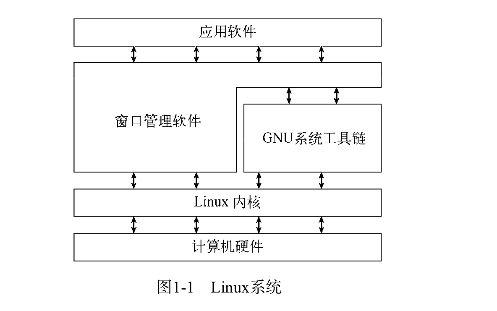
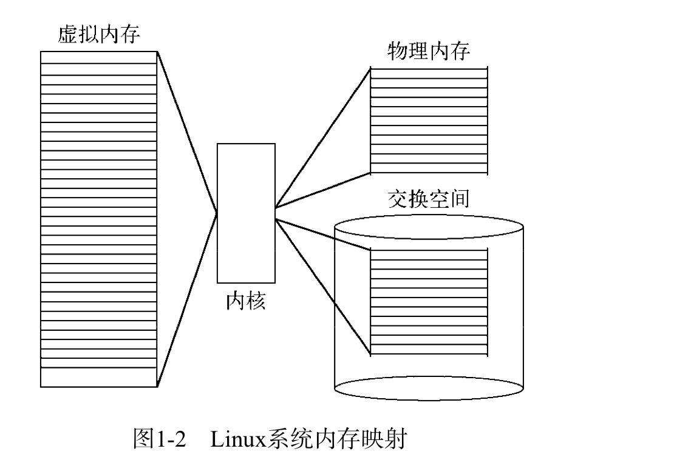
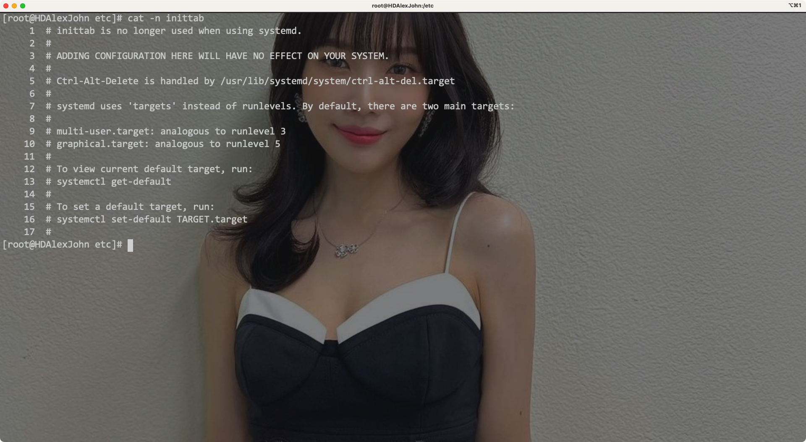

# 一、初始Linux Shell

## 1. What is Linux

Linux可以分为四个部分:

- Linux内核(kernel)
- GNU工具
- 图形化桌面环境
- 应用软件

Eg:

### 1) 探究Linux kernel

- Linux的内核控制所有的软硬件，其负责硬件资源的分配和软件的运行

Kernel的主要功能有四种:

- 系统内存管理
- 软件程序管理
- 硬件设备管理
- 文件系统管理

#### 一) 系统内存管理

> 内核会管理系统上的`物理内存`，还会创建并管理`虚拟内存`

- 虚拟内存:

> 内核会通过`硬盘上的空间`实现虚拟内存，这块存储空间被称为`交换空间(swap space)`

通过`在交换空间和物理内存之间不断交换虚拟内存中的内容`，就可以让系统拥有比物理内存更多的可用内存

Eg:

- 内存存储单位按照组分为多个块，`每块称为页面(page)`
- 每个内存page会放在物理内存或者虚拟内存中，内核会维护一个`内存page表`，其指明了内存页面`位于物理内存还是虚拟内存`中

- 内核会记录使用中的内存page，其会自动`将长时间未使用的内存page复制到swap space`，称为`换出(swapping out)`，这种操作`在物理内存可用时也依然存在`
- 如果program想要`访问swapping out的内存page`，则需要内核`从物理内存中swapping out相应大小的内存page`为它让出位置，然后`再从swap space换入`

---

#### 二) 软件程序管理

> Linux中`运行中的程序称为进程`

- 内核会创建`第一个进程(init`)用来`启动系统上其他所有进程`
- `内核启动后`，init进程会被`加载到虚拟内存中`

内核启动其他进程时，会**在虚拟内存中**给新的进程**分配一块专有区域来存储新进程用到的数据和代码**

- 部分发行版在`/etc/inittab`存放开机自启动的进程
- 其余系统则采用`/etc/init.d`目录，其中存放开机启动/停止应用的脚本，这些脚本通过`/etc/rcX.d`目录下的入口启动，X代表运行级(run level)
- 运行级代表init进程运行`/etc/initttab`文件或`/etc/rcX.d`文件中某些特点类型的进程

Eg:

Linux中存在5中运行级:

- 1:

只启动基本的系统进程和一个控制台终端(单用户模式)，通常用于紧急的文件系统维护，此时只允许一个人登录系统进行操作

- 3:

其为标准的运行级，大多数软件都会启动

- 5:

该运行级会启动GUI，并允许通过GUI进行登录

---

#### 三) 硬件设备管理

