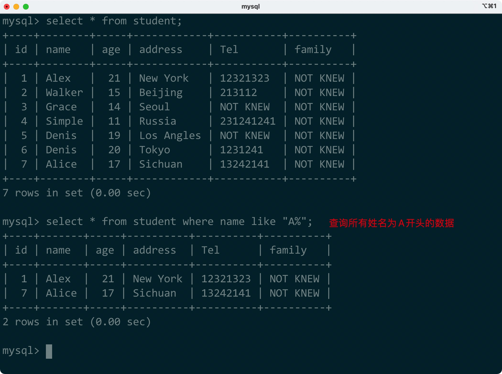
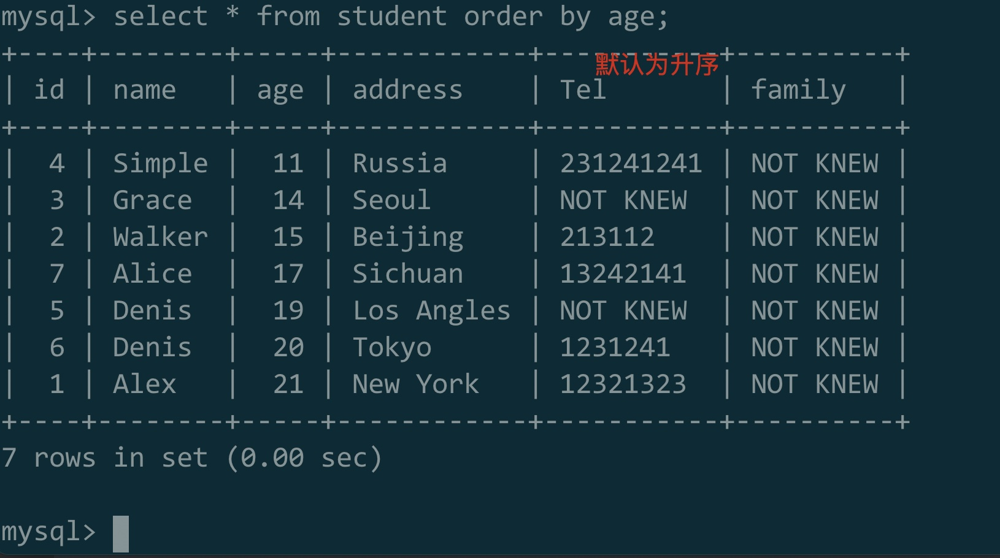
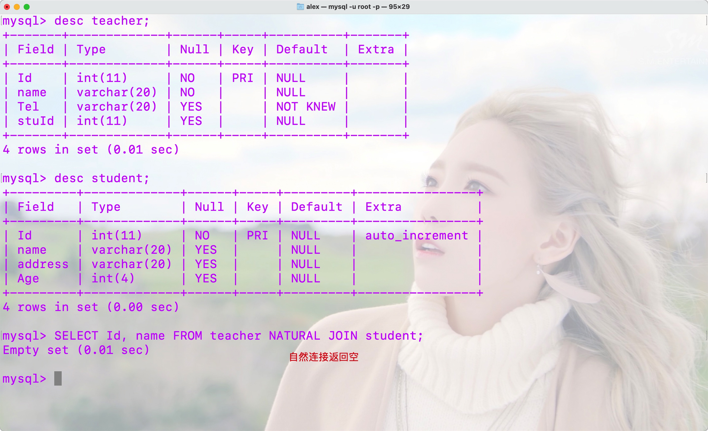
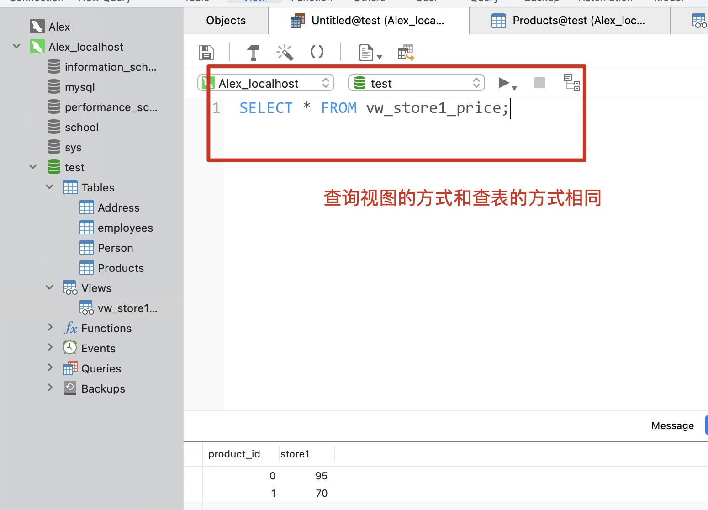

# 一、MySQL基础操作(数据库操作)


## 1.MySQL的开启和关闭

***注：`为反引号，位于TAB上方(Windows 10)**


### 1)win10 任务管理器 服务

### 2)终端命令：

```cmd
net stop/start mysql57
```


## 2.MySQL的连接和退出


### 1)终端命令连接：

```cmd
mysql -u root -p
```


### 2)终端命令退出：

```cmd
exit /q quit
```


## 3.库的创建


### 1)创建库

SQL语句：

```sql
create database database_name;
```


### 2)创建与关键字冲突的库：

SQL语句：

```sql
create database `database_name`;
```


### 3)避免重名而创建库：

SQL语句：

```sql
create database if not exists database_name;
```


## 4.库的删除


### 1)删除库：

SQL语句：

```sql
drop database database_name;
```


### 2)避免不存在而删除库：

SQL语句：

```sql
drop database if exists database_name;
```


### 3)删除与关键字冲突的库：

SQL语句：

```sql
drop database `database_name`;
```


## 5.查看创建库时使用的语句及字符编码

SQL语句：

```sql
show create database database_name;
```


## 6.创建库时添加字符编码

**(Windows学习可用gbk, 但Mac、Linux和实际生产中需用utf-8)**
SQL语句：

```sql
create database if not exists `database_name` charset=编码格式;
```


## 7.更改库的字符编码

SQL语句：

```sql
alter database database_name charset=编码;
```

****


# 二、MySQL基础操作(表操作)


## 操作表


### 1、使用库、显示库中的表


#### 1) 使用库

SQL语句：

```sql
use database_name;
```


#### 2) 显示库中所有表

SQL语句：

```sql
show tables;
```


### 2、创建表

#### 1)常规方法

SQL语句：

```sql
create table table_name(
parameter_1 parameter_1_type,
parameter_2 parameter_2_type,
...
);
```

**参数类型讲解**

```sql
int ：整数
varchar(lenght) ：字符串
```


#### 2)进阶方法

SQL语句：

```mysql
create table if not exists table_name(
parameter_1 int auto_increment primary key comment 'The comments',
parameter_2 varchar(length) not null comment '',
parameter_3 varchar(length) default 'something value' comment '',
...
)engine=innodb;
```

**相关讲解**

```mysql
auto_imcrement: 自增
primary key：主键(唯一的)
comment ''：注释
not null：不能为空(强制填写)
default ''：不主动填写后自动填充的默认值，不写defaul语句则会默认为null
engine=innodb：MySQL的默认引擎
```


### 3、显示表(简单排列)

**不同于show table**

SQL语句

```sql
desc table_name;
```

**desc**:  *descending*                          **adj.**下降的；递降的


### 4、删除表

SQL语句

```sql
drop table if exists table_name_1, table_name_2, ...; 
```


### 5、修改表


#### 1)修改表名


SQL语句

```sql
alter table table_name rename to table_new_name;
```


#### 2)修改字段(column)


##### 一、添加字段(add column)


SQL语句

**默认方法：会默认添加到最后一行**

```sql
alter table table_name add column column_type() default 'The default info.' comment 'The value' after column_name;
```


SQL语句

**可用after指定位置**

```sql
alter table table_name add column column_type() after target_column;
```


SQL语句

**可用first置于首位**

```SQL 
alter table table_name add column column_type() first;
```


##### 二、删除字段(drop column)


SQL语句

```sql
alter table table_name drop column;
```


##### 三、修改字段信息


SQL语句

**修改字段名和类型(change)**

```sql
alter table table_name change column_name column_new_name column_new_type;
```

```sql
alter table table_name change column_name column_new_name column_new_type null_option comment 'The sentence of comment';
```


SQL语句

**修改字段类型(modify)**

注：还可添加其他参数

```sql
alter table table_name modify column_name column_new_type;
```

```sql
alter table table_name modify column_name column_new_type null_option comment 'The sentence of comment';
```


## 操作数据


### 1)添加数据

**注意：**

**1.primary key不能重复**

**2.除了not null的参数，其余都不能写为null**


SQL语句

**繁琐写法(参数顺序需要与table_name后一致)**

```sql
insert into table_name (column_1, column_2, ...) values(value_1, value_2, ...);
```


SQL语句

**默认写法(参数顺序和数量需要和table默认顺序和数量一样)**

```sql
insert into table_name values(value_1, value_2, ...);
```

**注：value值在允许前提下可以为null，也可以为default**


SQL语句

**自定义写法(可自己定义参数数量与顺序)**

```sql
insert into table_name (self_column_1, self_column_2, ...) values(value_1, value_2, ...)
```


SQL语句

**插入多条数据**

```sql
insert into table_name values(value_1, value_2, ...),(value_a, value_b, ...);
```


### 2)数据查询


**查询所有数据(不推荐使用)**

SQL语句

```sql
select * from table_name;
```


SQL语句

```sql
select column_1, column_2, ... from table_name;
```


### 3)删除数据

SQL语句

**删除符合where后条件的**

```sql
delete from table_name where column=target_value;
```

**注：column最好为一个唯一值，如选择有重复的column，则会删除多条数据**


SQL语句

**其余条件用法**

```sql
delete from table_name where condition_statement;
```

examples:

SQL语句

```sql
delete from table_name where column>value;
```


**删除表内所有数据(不建议)**

注：会进行遍历，会比较慢

SQL语句

```sql
delete from table_name;
```

**使用该方法删除后，再次添加数据时，编号会接着被删除的数据，所以不推荐使用**


**推荐删除方法**

SQL语句

```sql
truncate table table_name;
```


### 4)更新数据/更改数据

**注：**

**1.where后的condition最好不要有重复符合的**

**2.不带where的话所有column都会被更改**


SQL语句

```sql
update table_name set edited_1, edited_2 where column_condition;
```

**例子**

SQL语句

```sql
update table_name set name='xxx' where id=x or id=y;
```


## MySQL的编码问题

**注：生产环境中的MySQL的字符是UTF-8，但windows10 默认为gbk，需要注意**


**查看编码设置**

SQL语句

```sql
show variables like 'character_set_%';
```


**修改编码设置**

SQL语句

```sql
set character_set_clinet=gbk;
```

(需要修改的值：client, results)

****


# 三、数据类型


## 1.int整形相关类型

|    type     |  size   |                       signed range                       |         unsigned range          |
| :---------: | :-----: | :------------------------------------------------------: | :-----------------------------: |
|   tinyint   | 1 btye  |                       (-128, 127)                        |            (0, 255)             |
|  smallint   | 2 bytes |                    (-37 768, 32 767)                     |           (0, 65,535)           |
|   medium    | 3 bytes |                 (-8 388 608  8 388 607)                  |         (0, 16,777,215)         |
| int/integer | 4 bytes |             (-2 147 483 648, 2 147 483 647)              |       (0, 4 294 967 295)        |
|   bigint    | 8 bytes | (-9 223 372 036 854 775 808, 9 223 372 036 854 775 807 ) | (0，18 446 744 073 709 551 615) |


SQL语句

```sql
create table table_name(
column_1 tinyint(size) ......
column_2 smallint(size) unsigned ......
);
```


## 2.浮点型相关类型

|  type  |  size   |
| :----: | :-----: |
| float  | 4 bytes |
| double | 8 bytes |

usage method:


SQL语句

```sql
create table table_name(
parameter_1 float(total_width, 小数位数),
parameter_2 double unsigned(total_width, 小数位数)
...
);
```

**注：float和double会丢失精度(在超过规定位数后)**


## 3.定点数类型

**因为其整数和小数部分分开存放，故不会丢失精度(支持无符号)**


SQL语句

```sql
create table table_name(
parameter_1 decimal(m,d),
parameter_2 decimal unsigned(m, d)
);
```


## 4.字符串类型


注：

**1.SQL里的char就是字符串，不同于C和Java**

**2.char和varchar区别：**

​	1.char的长度不变，而varchar会回收多余的字节

​	2.char比varchar要更加高效

|    type    |         size          |              usage              |
| :--------: | :-------------------: | :-----------------------------: |
|    char    |      0~255 bytes      |           定长字符串            |
|  varchar   |     0~65535 bytes     |           变长字符串            |
|  tinyblob  |      0~255 bytes      | 不超过 255 个字符的二进制字符串 |
|  TINYTEXT  |      0-255 bytes      |          短文本字符串           |
|    BLOB    |    0-65 535 bytes     |     二进制形式的长文本数据      |
|    TEXT    |    0-65 535 bytes     |           长文本数据            |
| MEDIUMBLOB |  0-16 777 215 bytes   |  二进制形式的中等长度文本数据   |
| MEDIUMTEXT |  0-16 777 215 bytes   |        中等长度文本数据         |
|  LONGBLOB  | 0-4 294 967 295 bytes |    二进制形式的极大文本数据     |
|  LONGTEXT  | 0-4 294 967 295 bytes |          极大文本数据           |


## 5.布尔类型


SQL语句

```sql
create table table_name(
column_1 boolean,
...
);
```

```sql
insert into table_name values(true/fasle);
```


## 6.枚举类型


注意：**添加枚举类型字段参数时，添加的参数一定只能为enum内存在的参数(有局限性)**


SQL语句

```sql
create table table_name(
column_1 enum('parameter_1', 'parameter_2', 'parameter_3', ......),
......
);
```


SQL语句

```sql
insert into table_name values('parameter_*');
```


#### **特：枚举类型enum的存储方式(另类的插入方式)**


例子:

SQL语句

```sql
create table test(
gender enum('man', 'woman', '?', 'it')
);
```


SQL语句_1

```sql
insert into test values('man');
```


SQL语句_2

```sql
insert into test values('1');
```


SQL语句_1等价于SQL语句2(排序从1开始)

由于只存数字，所以比较快，节省空间


## 7.set集合类型


注：**同enum类型一样，添加字段参数时只能选择已有参数，但可以选择多个。**


创建方式：

SQL语句

```sql
create table table_name(
column_1 set('parameter_1', 'parameter_2', ...),
......
);
```


插入方式：

SQL语句

```sql
insert into table_name values('parameter_1, parameter_2');
```

注：逗号只能在单引号内，不能在单引号外，不然就算做多个字段参数。


## 8.日期和时间类型


|   type    | bytes |       format        |
| :-------: | :---: | :-----------------: |
|   date    |   3   |     YYYY-MM-DD      |
|   time    |   3   |      HH:MM:SS       |
|   year    |   1   |        YYYY         |
| datetime  |   8   | YYYY-MM-DD HH:MM:SS |
| timestamp |   4   |   YYYYMMDD HHMMSS   |


创建方式：

SQL语句

```sql
create table table_name(
column datetime;
);
```


插入方式：

SQL语句

```sql
insert into table_name values('2000-02-07 13:00:00');
```

****


# 四、字段属性


### 1.主键primary key


**注：**

**1.一个表里可以有组合键/复合主键(本质也是一个主键)，但不能有多个主键**

**2.可能与其他库和表关联(例如身份证号)**


#### 1)创建和添加

只能给唯一的，不会重复的值，插入主键值时不能重复，最好是不会修改的值

**注：默认情况下不能为null；如果设置为为auto_increment ，则可以为null，其会自动添加**


SQL语句

```sql
create table if not exists table_name(
column type auto_increment primary key
);
```


**创建后再添加主键**

```sql
alter table table_name add primary key (column_name);
```


#### 2)组合键

可以在创建表示选择多个字段作为主键


**创建后再添加主键**

SQL语句

```sql
alter table table_name add primary key (column_1, column_2, ...);
```


#### 3)删除主键


SQL语句

```sql
alter table table_name drop primary key;
```


### 2.唯一键

与主键的不同：

**可以为空，可以有多个，仅保证数据不重复，一般只在一张表内起作用**


#### 1)创建唯一键


SQL语句

```sql
create table table_name(
column_1 type unique
column_2 type unique
);
```


**创建后添加唯一键**

SQL语句

```sql
alter table table_name add unique(column);
```


#### 2)删除唯一键


SQL语句

```sql
alter table table_name drop index column;
```

****


# 五、注释


## 1.SQL内注释


## 2.代码内注释

****


# 六、四大规范


## 1.字段完整(保证实体的完整性)/域完整性


主键、自增


## 2.合适的数据类型机约束/实体完整性


类型、null、default


## 3.引用和被引用/引用完整性


可能被其他的表应用


## 4.自定义约束/自主完整性

自己需求的约束

****


# 七、外键


作用：

**在一个表中引用另一个表内的数据**


**注：外键无法使用desc语句查看，只能通过show create table查询，且创建均在外表中进行**


## 1.创建外键


Table_1:

SQL语句

```sql
create table if not exists table_1(
column_1 type options...,
......
);
```


引用Table_1中的column_1

Table_2:

SQL语句

```sql
create table if not exists table_2(
need to set_column same_type,
foreign key (set_column) references target_table(column)
);
```


创建后/删除后，再添加外键

SQL语句

```sql
alter table table_name add foreign key (set_column) reference target_table(column);
```


## 2.删除外键

**注：需输入CONSTRAINT后的内容**


SQL语句

```sql
alter table table_name drop foreign key target_ibfk_1;
```


## 3.外键相关操作


场景：(一个数据被删除，其作为外键的值在其他表内需要进行一些操作。)


具体场景：

**学生被开除，但他的ID存在于学校的食堂中，不能因为他被开除，就抹去他产生的交易，否则会影响食堂的营业额统计。**


### 1)置空操作


将该学生的ID改为null,但其对应的其他记录(消费金额等)依然存在。


**在创建时设置**


SQL语句

```sql
create table if not exists table_name(
column_1 type...,
...,
foreign key (set_column) references target_tabel(column) on delete set null on update cascade;
);
```


### 2)级联操作


该学生休学一年，其学号进行了变更，那么其之前使用老学号所生成的数据都应该变更为新的学号。


该学生需要隐藏信息，那么删除时，其通过外键相关联的其他数据都应该被删除。


设置同置空


SQL语句

```sql
create table if not exists table_name(
column_1 type...,
...,
foreign key (set_column) references target_tabel(column) on delete set null on update cascade
);
```

****


# 八、数据库设计


## 1) 基本概念

- 行: 一条数据/实体
- 列: 一个字段/属性

**注：**可以对应到OOP语言中的对象


**数据冗余：**

- 数据冗余是无法避免的
- 留存数据冗余可以增加查询性能，但会降低性能(主要用于需要经常查询的数据)
- 数据冗余过多对后期管理不友好


## 2) 实体的关系(关系型数据库)

- 一对一
- 一对多
- 多对一
- 多对一


## 3) 六大范式


### 1. 第一范式: 确保字段的原子性

- 在给定的条件内，确保字段不能再被分割
- 该性质需要前提条件，**如果条件改变**，字段是否遵循原子性的判断结果也会被改变


### 2. 第二范式: 非键字段必须依赖于键字段

- 表中**不应该出现的字段不能被加入**
- 不能扯淡！

例子：学生基础信息表中不应该出现食堂消费记录信息


### 3. 第三范式: 消除传递依赖性

- 尽可能地去除冗余的字段

例子: 总分可以由语数外相加得来，那就**没必要单独设立一个总分字段**


### 4. 总结

设计数据库时，没有绝对的标准，一切都要先看需求

****


# 九、单表查询


## 1) SELECT


exam:


指定查询结果的字段名:

```shell
select "content" as column
```


exam:


## 2) FROM

指明查询的来源(字段/表/库)

- 一次性查询多张表时，会返回一个笛卡尔积


exam:


## 3) dual

使用select语句进行查询时，如果没有指定表(from table_name)，其会默认从dual中进行查询，不过可以省略


exam: 


## 4) WHERE

指定查询时的条件


exam:


where指定字段条件(条件之间可以使用and, or, not 等逻辑符号)


## 5) IN


用于指定where中的查询条件


格式:

```mysql
SELECT (content) FROM table_name WHERE column_name IN (column_content);
```


可以加上not取反:

```mysql
SELECT (content) FROM table_name WHERE column_name NOT IN (column_content);
```


exam:


## 6) between...and


通过between...and，可以在where后指定范围


格式:

```mysql
SELECT (content) FROM table_name WHERE column_name BETWEEN (start) AND (end);
```

**注意：**与大于小于不同，between...and**包含开始和结束位置**


可以通过not取反

```mysql
SELECT (content) FROM table_name WHERE column_name NOT BETWEEN (start) AND (end);
```


exam:


## 7) is null

- 用于查找指定字段属性为null的行(实体)


格式:

```mysql
SELECT (content) FROM table_name WHERE column_name IS null;
```


通过not取反

```mysql
SELECT (content) FROM table_name WHERE column_name IS NOT null;
```

**注意：是is not, 不是not is**


## 8) 聚合函数

用于获取指定的内容(和，最大/小值，平均值，个数)

- **注意：通过聚合函数查找的结果表名，需要写在聚合函数后面**

exam:


### sum:

```mysql
SELECT SUM(column_name) FROM table_name;
```


exam:


### max:

```mysql
SELECT MAX(column_name) FROM table_name;
```


exam:


### min:

```mysql
SELECT MIN(column_name) FROM table_name;
```


exam:


### avg:

```mysql
SELECT AVG(column_name) FROM table_name;
```


exam:


### count:

```mysql
SELECT COUNT(column_name) FROM table_name;
```

**注：只有count会跳过null**

exam:


## 9) 模糊查询

- 用于查询大致匹配的数据(同姓等等)


格式

```mysql
SELECT (content) FROM table_name WHERE (column_name) LIKE (vague)
```


exam:



**注意："%"用于代表多个字符，不限字符数**


**注："_"只能用于代表一个字符**


## 10) 排序查询

- 根据指定的字段，按照升序或降序排列


格式

```mysql
SELECT (content) FROM table_name ORDER BY (column_name) ASC/DESC
```

**注意：asc为升序，desc为降序，未指定则默认升序**

- asc: ascending
- desc: descending


exam:





## 11) 分组查询

- 将聚合函数查询出的数据**通过字段进行分组**


格式

```mysql
SELECT func(column_name) AS 'result column_name', group_column AS 'result column_name' FROM table_name GROUP BY group_column;
```

**格式：select 聚合函数，分组字段 from 表名 group by 分组字段**


exam:


**末尾可以添加排序**


## 12) 聚合分组搜索

- 使用group_concat将需要的字段聚合起来(显示在一行中)，需结合goup by


格式

```mysql
SELECT GROUP_CONCAT(column_name), (group_by_column_name) FROM table_name GROUP BY column;
```


exam:


## 13) HAVING

- 用于在查询后的结果表上，进一步进行查询(使用结果表的字段名)


格式:

```mysql
SELECT (content) FROM table_name WHERE (column_name) (condition) HAVING (column_name) (condition);
```


exam:


## 14) LIMIT

- 用于限制查询结果的**起始位置和结果长度**


格式：

```mysql
SELECT (content) FROM table_name LIMIT start_index, data_length;
```

- 如果"LIMIT"后只写一个数字，则**默认从0开始**，**将输入的数字作为结果的长度**
- 查询的结果**起始位置与数组的规则相同**


exam:


- 从索引0处开始，查询两条数据


- 默认从索引0处开始，查询一条数据


## 15) DISTINCT

- 去除重复的结果，**相同结果只显示一次**


格式:

```mysql
SELECT DISTINCT (content) FROM table_name;
```


exam:


结合用法:


## 16) OFFSET

- 用于跳过开头的数据


格式:

```mysql
SELECT (content) FROM table_name (condition) OFFSET (num_of_skipDate);
```


exam:


****


# 十、多表查询


## 1) Union 联合查询

- 连接两个SELECT语句，将多个查询结果**组合到一个表中**


- 格式

```mysql
SELECT (content) FROM (table_name) WHERE (column_name) (condition) UNION (ALL/DISTINCT) SELECT...
```

**后接"ALL"则将所有数据列出(无论是否重复)**


exam:


## 2) INNER JOHN 內连接

- 用于与其他的表关联起来，添加查询条件


- 格式

```mysql
SELECT (colunmn_name), (column_name) FROM (table_name) INNER JOIN (another_table_name) ON (condition)
```

**注：內连接的条件为两个表中字段的关系，通常为同一字段，使用格式: table_name.column(用"."表示调用表中的字段)**

- 如果多个表中有同名字段，则需要在字段前加上表名


exam:


多表的情况(再加一句INNER JOIN 即可):


## 3) LEFT JOIN 左连接

- 以左边的表为基准进行查询


- 格式

```mysql
SELECT (content) FROM (left_table_name) LEFT JOIN (right_table_name) ON (condition);
```


exam:


## 4) RIGTH JOIN 右连接

- 以右表为基准，进行查询


- 格式

```mysql
SELECT (content) FROM (left_table_name) RIGTH JOHN (right_table_name) ON (condition);
```


exam:


## 5) CROSS JOIN 交叉连接

**使用较少**

- 会返回两表中指定字段的**笛卡尔积**(即所有字段之间的排列结果)


- 格式

```mysql
SELECT (content) FROM (table_name) CROSS JOIN (table_name) option:condition;
```


exam:


## 6) NATURAL JOIN

**DBA的内容**


- 自然连接，当两个表中有**公共字段(即字段名相同)**时，会自动进行获取(默认为內连接)


- 格式

```mysql
SELECT (content) FROM (table_name) NATURAL JOIN (another_table_name);
```


exam:


自然右连接/左连接:

- 同右连接和左连接相同，以左/右表为基准进行的查询


**注意：当两表中没有公共字段时，会返回两表的笛卡尔积**

exam:


## 7) USING

- 当两张表中有两个以上的公共字段(甚至结构相同)时，使用USING指定基准字段

**注：此时如果使用自然连接，则会返回null！**


- 格式

```mysql
SELECT (content) FROM (table_name) INNER JOIN (another_table) USING(public_column);
```


exam:




## 8) 规范

- 最好使用INNER JOIN (table) ON的形式
- 在ON后指定查询的字段条件，**有利于其他不了解表结构的人了解查询基准，增加可读性**

****


# 十一、子查询


## 1. IN/NOT IN

- 通过对一张表进行查询后的结果(**结果必须只有一个字段**)，可以作为WHERE语句中的条件，再进行查询


- 格式

```mysql
SELECT (content) FROM (table_name) WHERE base_column (NOT) IN (sub_query_result);
```

**如果查询出的结果只有一条，则可以将IN换为=，但不推荐，IN更通用**


exam:


## 2. EXISTS/NOT EXISTS

- 用于WHERE中，**指定子查询不存在/存在的情况**


- 格式

```mysql
SELECT (content) FROM (table_name) WHERE (NOT) EXISTS (sub_query_result);
```


exam:


****


# 十二、视图(view)

- 视图的作用:

用于显示指定的信息(屏蔽掉敏感信息)


## 1. 视图的创建/使用


- 格式

```mysql
CREATE VIEW (view_name) AS SELECT (content) FROM (table_name/Query Statement) (option: condition);
```


exam:





**在终端中的使用：**


显示视图:

 


显示创建视图的信息:


## 2. 修改/删除视图


### 修改

```mysql
ALTER VIEW (view_name) AS (new_content);
```


exam:


### 删除

```mysql
DROP VIEW IF EXISTS (view_name);
```


## 3. 视图算法

- 如果将子查询放入视图中，需要指定视图算法才能使子查询有效
- 共有三种算法选项:

1. UNDEFINDED(未定义)
2. MERGE(融合)
3. TEMPTABLE(临时)


- 格式

```mysql
CREATE ALGORITHM=[options] VIEW (view_name) AS (view_content/query statement);
```


exam:


Navicat: 选中视图右击，选择高级即可修改视图算法


****


# 十三、事务(transaction)

**注意：只有在创建数据库时，指定引擎为innodb后，才能使用事务**


- 将所有的数据都确认后再更新，而不会一条一条地更新
- 事务要么多条一起更新，要么直接回滚
- 处于事务中的语句，**只有在提交后才能生效**（网购时双方都确认后才会更新账户数据）


## 1. 事务的简单使用


- 开启事务

```mysql
start transaction;
```


exam:


- 结束事务/提交

```mysql
commit;
```


exam:


- 回滚事务/取消事务

```mysql
rollback;
```


exam:


## 2. 回滚到指定回滚点

- 类似恢复虚拟机快照，或者Git版本回滚
- 需要手动设置回滚点


### 设置回滚点

```mysql
SAVEPOINT (point_name);
```


### 回滚到指定回滚点

```mysql
ROLLBACK TO (point_name);
```


## 3. ACID

- A: Atomicity             原子性：事务是一个不能再分隔的单元，事务中的操作要么都发生，要么都不发生
- C: Consistency        一致性：事务前后数据完整性保持一致
- I:   Isolation              独立性：事务之间相互隔离
- D: Durabiliy              持久性：确认后不能修改

****


# 十四、索引

- 用于加快查询速度
- 会拖累增，删，改的速度，还会占用一定的空间
- 数据量小较时，不应该使用


## 1. 创建索引

- 普通索引

```mysql
CREATE INDEX index_name ON table_name(column);
```


- 唯一键

```mysql
CREATE unique index_name ON table_name(column);
```


- 主键索引

```mysql
CREATE primary key index_name ON table_name(column);
```


## 2. 删除索引


```mysql
DROP INDEX index_name ON table;
```


