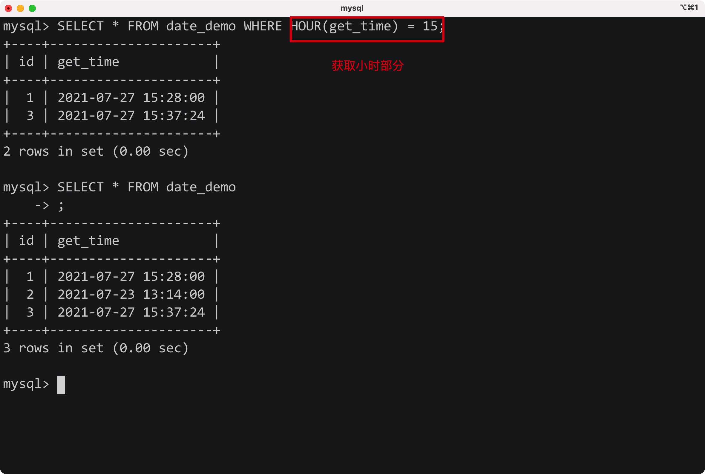

# 1.REPLACE(column, oldVal, newVal)

SQL Practice Day 29


将指定字段中的指定数据，进行修改，**可用于更新字段**


eg:


# 2.Window Func

- 仅在MySQL8.0及其之后的版本才开始支持窗口函数


## 1) DENSE_RANK()

- 根据分组或整体进行排名，排名值连续(相同排名后不会跳过)
- 该函数应该和ORDER BY一起使用，不然字段就是对等关系
- 使用PARTITION BY可以指定分组的字段，该函数则对不同的分组进行排名(不写则对所有数据进行排序)
- 使用ORDER BY指定排序字段及规则

Syntax:

```mysql
DENSE_RANK() OVER (
	PARTITION BY column_name
  ORDER BY column_name DESC/ASC
) AS 'alias'
```


eg:


## 2) SUM() OVER


****


# 3.Date Func


## 1) DATE

- 获取日期数据字段中的日期部分


Syntax:

```mysql
DATE(column_name);
```


Eg:


## 2) TIME

- 获取日期数据类型中的时间部分

Syntax:

```mysql
TIME(column_name)
```


Eg:


## 3) DATEDIFF

SQL Practice Day 12

- 返回expr1-expr2的值，用来判断两个日期的先后关系

Syntax:

```mysql
DATEDIFF(expr1, expr2);
```

 


**注意：日期值需要加上' '**


exam:


## 4) ADDDATE

- 将指定的日期值添加上指定的天数


Syntax:

```mysql
ADDDATE(expr, day);
```


## 5) ADDTIME

- 将指定的时间值添加指定的时间


Syntax:

```mysql
ADDTIME(expr1, expr2);
```


Eg:


- 不需要单独取出时间部分


## 6) CURDATE/CURTIME/NOW

- 获取当前的日期/时间/完整时间
- 这三个函数不需要任何参数


Eg:


## 7) DATE_ADD

- 添加指定的时间单位到特定字段上


Syntax

```mysql
DATE_ADD(date_column, INTERVAL expr unit);
```


Eg:


## 8) DATE_FORMAT

- 将指定的时间数据，以指定的格式输出

Syntax:

```mysql
DATE_FORMAT(date, format)
```


格式对应:

| 格式 |                      描述                      |
| :--: | :--------------------------------------------: |
|  %a  |                   缩写星期名                   |
|  %b  |                    缩写月名                    |
|  %c  |                    月，数值                    |
|  %D  |             带有英文前缀的月中的天             |
|  %d  |              月的天，数值(00-31)               |
|  %e  |               月的天，数值(0-31)               |
|  %f  |                      微秒                      |
|  %H  |                  小时 (00-23)                  |
|  %h  |                  小时 (01-12)                  |
|  %I  |                  小时 (01-12)                  |
|  %i  |               分钟，数值(00-59)                |
|  %j  |                年的天 (001-366)                |
|  %k  |                  小时 (0-23)                   |
|  %l  |                  小时 (1-12)                   |
|  %M  |                      月名                      |
|  %m  |                月，数值(00-12)                 |
|  %p  |                    AM 或 PM                    |
|  %r  |       时间，12-小时（hh:mm:ss AM 或 PM）       |
|  %S  |                   秒(00-59)                    |
|  %s  |                   秒(00-59)                    |
|  %T  |            时间, 24-小时 (hh:mm:ss)            |
|  %U  |        周 (00-53) 星期日是一周的第一天         |
|  %u  |        周 (00-53) 星期一是一周的第一天         |
|  %V  |  周 (01-53) 星期日是一周的第一天，与 %X 使用   |
|  %v  |  周 (01-53) 星期一是一周的第一天，与 %x 使用   |
|  %W  |                     星期名                     |
|  %w  |         周的天 （0=星期日, 6=星期六）          |
|  %X  | 年，其中的星期日是周的第一天，4 位，与 %V 使用 |
|  %x  | 年，其中的星期一是周的第一天，4 位，与 %v 使用 |
|  %Y  |                    年，4 位                    |
|  %y  |                    年，2 位                    |


Eg:


## 9) DAYOFWEEK/MONTH/YEAR

- 返回一个日期在一周/月/年中的顺序

Eg:


## 10) HOUR/MINUTE/SECOND

- 获取时间中的小时/分钟/秒

Eg:



****


# 4.String


## 1) LEFT/RIGHT

- 用于获取字符串左边或者右边指定位置的字符串(可用来按照特定位置的字符进行比较)


Syntax:

```mysql
LEFT(str, len);
RIGHT(str, len);
```


Eg:


## 2) LENGTH()

- 获取字符串的长度


Syntax:

```mysql
LENGTH(str);
```


## 3) LOCATE()


Syntax:

```mysql
LOCATE(subStr, Str)

LOCATE(subStr, Str, Pos)
```

- 找出字符串中子串第一次出现的开始位置
- 如果未找到匹配的子串，则返回0


Eg:


## 4) LOWER/UPPER

- 将指定的字段转换为全小写/大写

Syntax:

```mysql
LOWER(str);
UPPER(str);
```


Eg:


## 5) LTRIM/RTRIM/TRIM

- 去除字段数据左边/右边的空格/左右两边的空格


Syntax:

```mysql
LTRIM(str);
RTRIM(str);
TRIM(str);
```


Eg:


## 6) SUBSTR()

- 从原字符串中，获取指定范围内的子串

Syntax:

```mysql
SUBSTR(str, pos, len);
```


Eg:


