# 二十、undo日志


## 20.1 事务回滚的需求

- Server, OS错误
- 手动rollback


回滚时需要记录的东西:

- 插入记录时，记下记录的主键值，回滚时将主键值对应的记录删除即可
- 删除记录时，记下插入数据的内容，回滚时将这些内容组成记录后插入回原表中即可
- 修改记录时，需要记录下更新列的旧值，回滚时将这些列设置为旧值即可


这些为了回滚而记录的东西称为undo日志


## 20.2 事务id


### 20.2.1 分配事务id的时机


事务可以是一个只读事务，也可以是一个读写事务(默认)


如果事务在执行时对表进行了改动(不含读取)，那么InnoDB会为它分配一个独一无二的事务id。

分配的方式:

- 对于只读事务来说:

之后**只有在它第一次对某个用户创建的临时表执行改动时**，才会分配一个独一无二的事务id


例如:

在使用EXPLAIN分析查询计划的时候，有时会在Extra列看到Using temporary的提示，说明在执行时会用到内部的临时表，在事务回滚时，并不需要将该临时表也回滚，所以也不会为该事务分配事务id


- 对于读写事务来说，只有在其第一次对表CRUD时才会为事务分配一个唯一事务id，否则不会为该事务分配事务id


现在只需要知道:

只有在事务对表进行改动时才会为其分配一个事务id(没有分配时，事务的默认id为0)


### 20.2.2 事务id的生成

事务id本质为一个数字，分配策略如下:


- 服务器会在内存中维护一个全局变量，每当需要分配事务id时，就将该变量的值作为事务id分配给事务，之后该变量 + 1
- 当该变量的值为256的倍数时，将该值刷新到系统表空间中页号为5的页面中一个名为Max Trx ID的属性中，该属性占用8字节的存储空间
- 重启后，该值会加上256后赋值给之前的全局变量(变量的值可能大于该Max Trx ID的值)

这样就能保证事务id是一个递增的数字了


### 20.2.3 trx_id隐藏列


之前在行格式中说过，聚簇索引记录除了用户记录外，还会添加名为trx_id、roll_pointer的隐藏列(如果没有主键和不为null的唯一键，还会添加一个row_id列)


其中的trx_id就是**对该聚簇索引记录进行修改的语句所在事务对应的事务id**


## 20.3 undo日志格式


为了实现原子性，InnoDB在进行实际的CUD之前，会先将对应的undo日志记录下来

一个事务会对应多条undo日志，**这些undo日志从0开始编号，这个编号称为undo no**


这些undo日志被记录到类型为FIL_PAGE_UNDO_LOG的页面中，这些页面从系统表空间中分配，也可以从一个专门存放undo日志的表空间(undo tablespace)中分配


不同的操作都会产生怎样的undo日志呢？

Eg table:

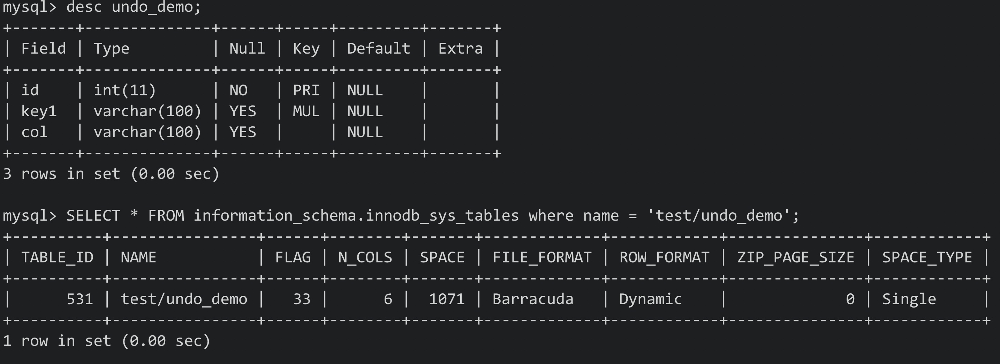

- 记住table_id


### 20.3.1 INSERT操作对应的undo日志


在插入记录时，最终的结果都是将该记录插入到数据页中，在写对应undo日志时，只需要将该记录的主键值记录好就行了


该undo日志的类型为TRX_UNDO_INSERT_REC，完整结构为:

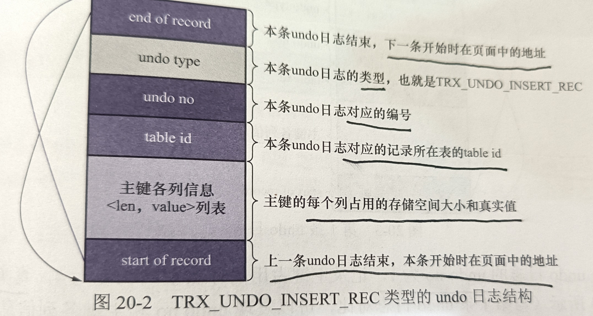


- undo no在事务是从0开始递增的。只要事务没有提交，**每生成一条undo日志，该日志的undo no自增**
- 如果**记录的主键只含一列**，该上述类型的undo日志中，只需要将列占用存储空间大小和真实值记录下来即可

**如果包含多个列，则需要将每个列的存储空间和真实值都记录下来**，len表示列占用的存储空间大小，value代表列的真实值


插入记录:

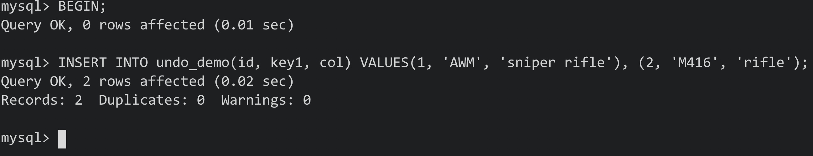


因为记录的主键列只有一个id列，所以**只需要在undo日志中存储待插入记录的id列占用的空间长度和真实值即可**

因为这里插入了两台记录，所以**会产生两条类型为TRX_UNDO_INSERT_REC的undo日志**


- 第一条undo日志的undo no为0，记录主键占用的存储空间长度为4，真实值为1，如:

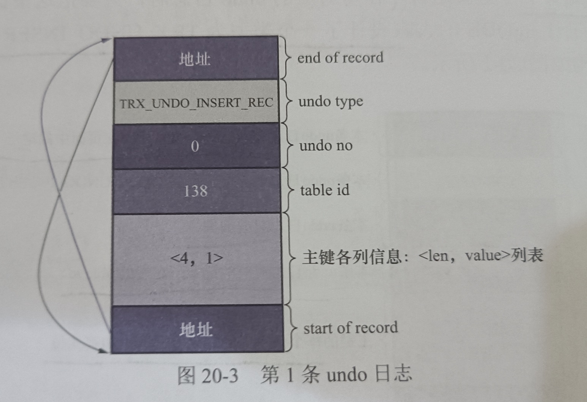

- 第二条undo日志的undo no为1，记录主键占用的存储空间长度为4，真实值为2，如:

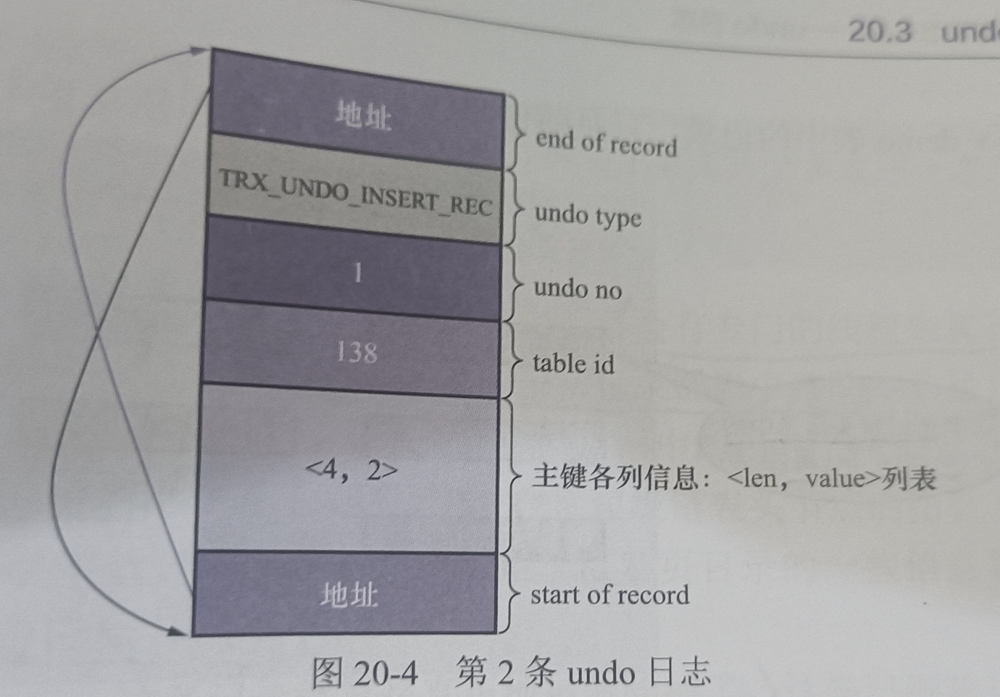


roll_pointer:

- 其本质就是一个指向记录对应的undo日志的指针


我们之前插入的两条记录，意味着向聚簇索引和二级索引插入了2条记录

聚簇索引记录存放在类型为FIL_PAGE_INDEX的页面中，undo日志存放在类型为FIL_PAGE_UNDO_LOG的页面中，效果为:

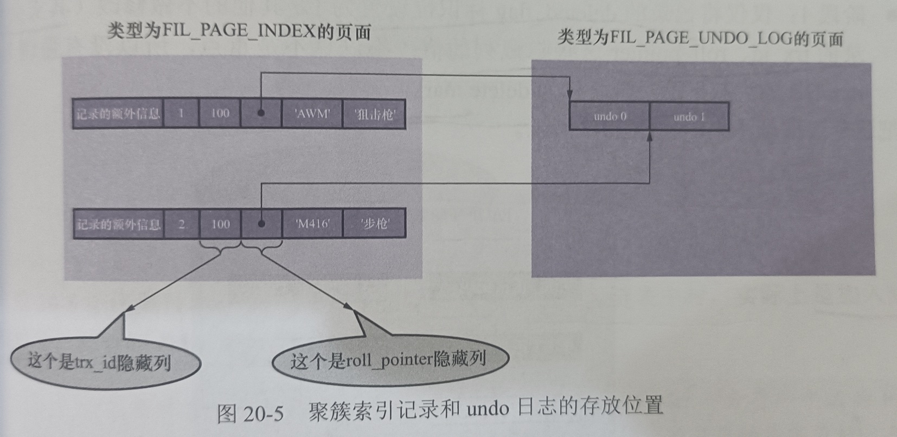

- roll pointer指向记录对应的undo日志


### 20.3.2 DELETE操作对应的undo日志


回顾:

插入的记录会根据记录头信息中的next_record属性组成一个单向链表，该链表称为正常记录链表

被删除的记录也会根据next_record属性组成一个链表，只不过**该链表的记录占用的空间可以重用**，该链表**称为垃圾链表**。Page Header部分中有一个名为PAGE FREE的属性，其指向垃圾链表的头节点


Eg:

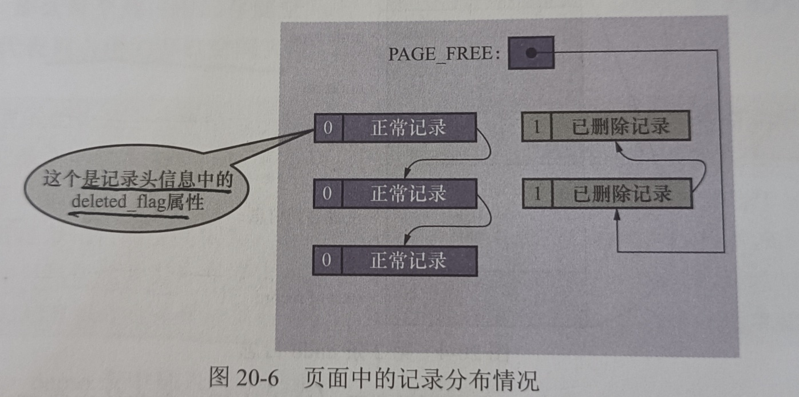


- 在垃圾链表中，这些记录所占的空间可以被重用
- PAGE_FREE代表该垃圾链表的头节点


如果使用DELETE语句将正常记录中的最后一条删除，则需要经历两个过程:


#### 阶段1

- **仅仅将deleted_flay属性设置为1，该阶段称为delete mark**

Eg:

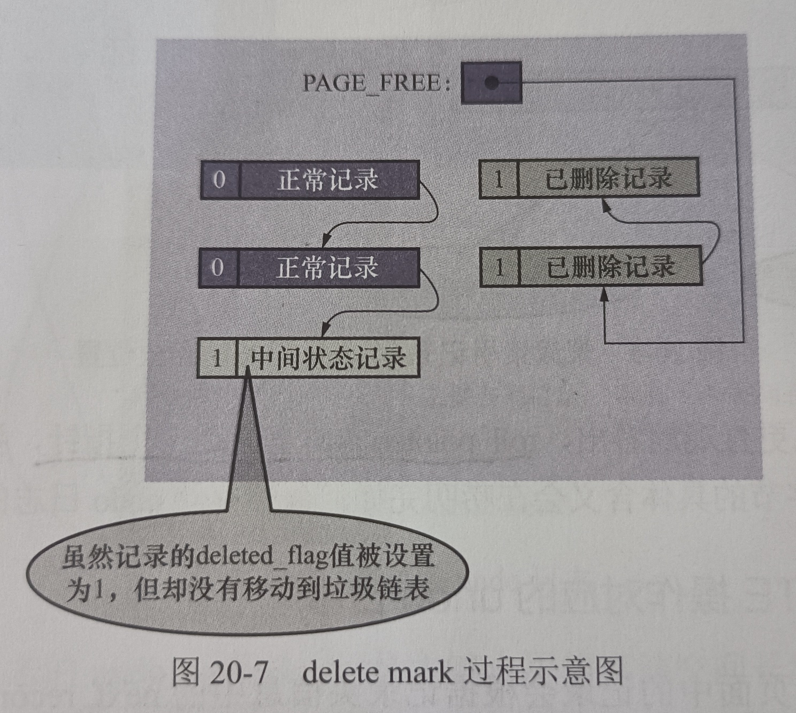

- 此时最后一条记录的delete_flag被设置为了1，但该记录还没有加入到垃圾链表中
- 所以此时该记录既不是正常记录，也不是已删除记录，而是处于中间状态的记录


注：在删除语句所在的事务提交之前，被删除的记录会一直处于这种中间状态


#### 阶段2

- **当该删除语句所在事务提交后**，**会有专门的线程将记录删除掉**，此时就是真正的删除
- 会**将记录从正常记录链表中移除，并加入到垃圾链表中**，还会调整一些页面信息


- **该阶段称为purge**


阶段2执行完后，这条记录才算是真正地被删除了，其所占用的存储空间就可以被重用了

Eg:

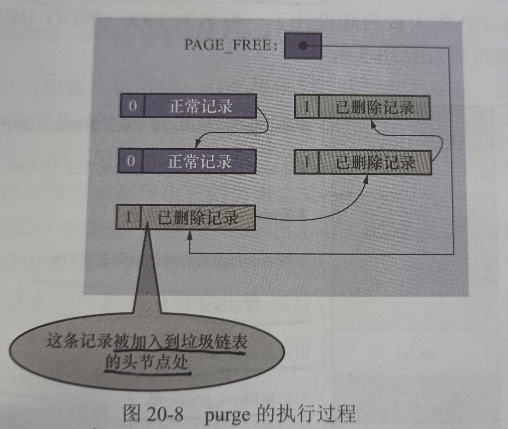

- 在将删除记录添加到垃圾链表中时，实际时间该记录添加到了链表的头节点处，还会修改PAGE_FREE属性的值


补充:

每当有记录加入到垃圾链表后，都会将PAGE_CARBAGE属性的值加上已删除占用记录占用的存储空间大小


PAGE_FREE指向垃圾链表的头节点，每当新插入记录时，会首先判断垃圾链表头节点指向的已删除记录存储的空间是否足够容纳新插入的记录

如果无法容纳，则会申请一个新的空间来容纳这条新记录

如果可以容纳，则会直接重用头节点对应的已删除记录的存储空间，并将PAGE_FREE指向下一个节点


出现的问题:

- 如果头节点指向的记录对应空间大于插入记录所需的空间，那么**重用后会有一部分空间用不到，这部分空间就算作碎片空间**
- 插入纪录越来越多之后，产生的碎片空间也会越来越多，**这些碎片空间如何处置？**

其实不然

- 这些碎片空间占用的存储空间大小会被统计到PAGE_GARBAGE属性中，当一个页面快占满时:
- 此时页面中剩余空间不能分配出给一条完整记录的空间，此时就会先看PAGE_GARBAGE的空间和页面剩余空间相加后，是否可以容纳这条记录
- 如果可以，那么InnoDB会尝试重新组织页面中的记录:
- 该过程就是**开辟出一个临时页，将原页面中的记录依次插入**(依次插入时不会产生碎片)，之后**再将临时页中的内容复制回页面中，这样就能解放碎片空间了**。
- 重新组织比较耗费性能


从上述可知，在执行删除时，该删除语句所在事务未提交之前，只会经历阶段1(delete mark)

一旦事务提交后，我们就不需要再回滚这个事务了


对应的，undo日志只需要考虑对删除操作在阶段1所做的修改进行回滚即可

因此设计了一个名为TRX_UNDO_DEL_MARK_REC类型的undo日志

Eg:

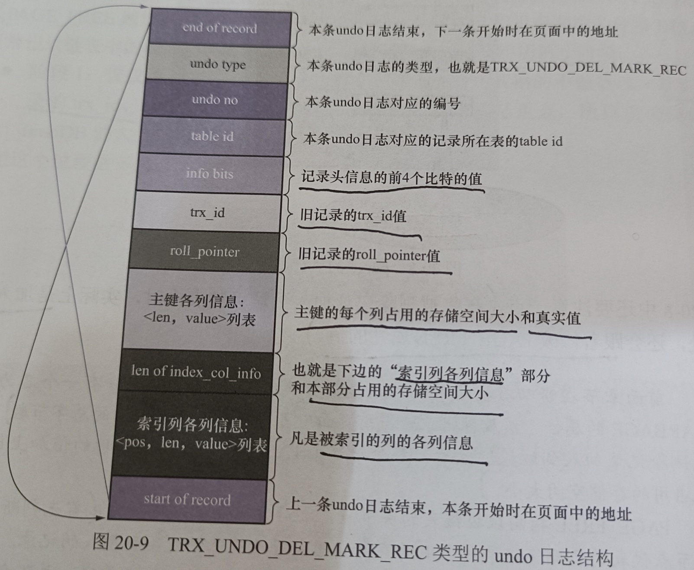


需要注意的点:

- 对一条记录进行delete mark操作前

需要把该记录的trx_id和roll_pointer隐藏列的旧值记录到对应undo日志中的trx_id和roll_pointer属性中

这样做的好处: 可以**通过undo日志的roll_pointer属性**，**找到上一次对该记录进行改动时产生的undo日志**

Eg:

先插入再删除

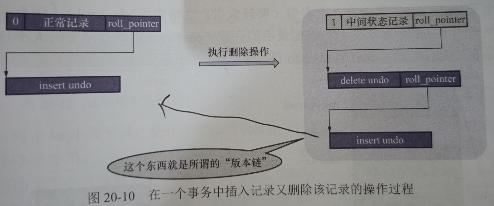

在执行完delete mark之后，中间状态记录、delete mark操作产生的undo日志和INSERT产生的undo日志串成了一个链表，该链表称为版本链(在UPDATE对应的undo日志中会起作用)


- 与插入类型TRX_UNDO_INSERT_REC的undo日志不同

类型为TRX_UNDO_DEL_MARK_REC的undo日志**会多一个与索引列信息的内容**。

如果某列中包含某个索引时，那么**相关信息应该记录到这个索引列各列信息**部分

包含该列在记录中的位置(pos)、该列占用的存储空间大小(len)、该列实际值(value)，所以该部分存储的内容本质上是一个<pos, len, value>的列表。

该部分在事务提交后，**用来对中间状态的记录进行真正的删除**(purge阶段)


例子:

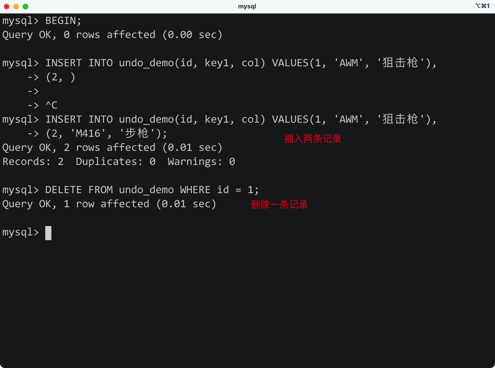


删除语句的delete mark操作对应的undo日志结构如图:

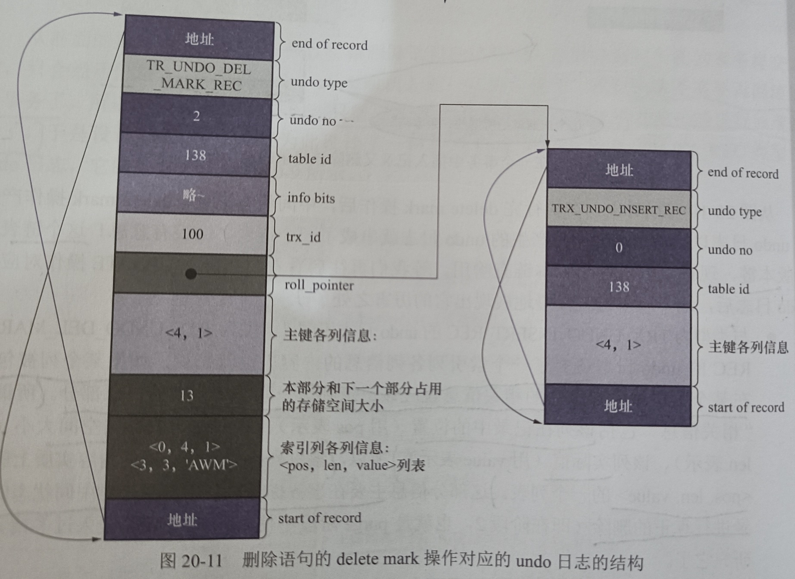

- 这条delete mark操作对应的undo日志是第三条undo日志，其对应的undo no为2
- 在对记录执行delete mark操作时，记录的trx_id隐藏列的值为100，与当前事务id相同(说明该记录最近一次的修改就在本事务中)，所以将100填入undo日志的trx_id属性中
- 之后将记录的roll_pointer隐藏列的值取出来，填入undo日志的roll_pointer，这样可以**通过undo日志的roll_pointer找到上一次对该记录进行改动时产生的undo日志**
- 由于undo_demo表中有两个索引，所以只要是包含在索引中的列，都需要将列在记录中的位置(pos)，占用的存储空间(len)，实际值(value)存储在undo日志中


- 在索引列中存储的信息:

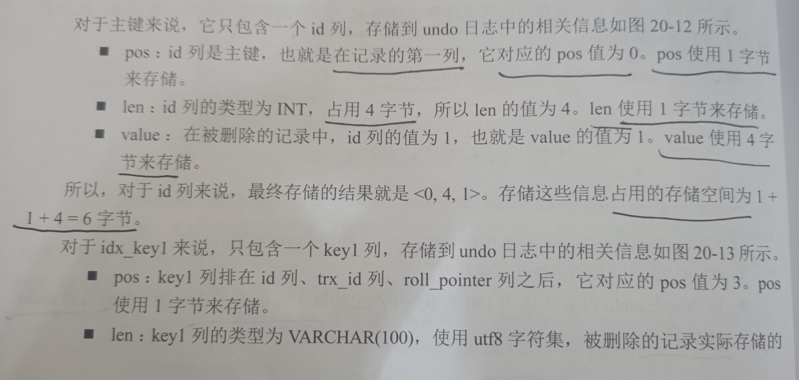


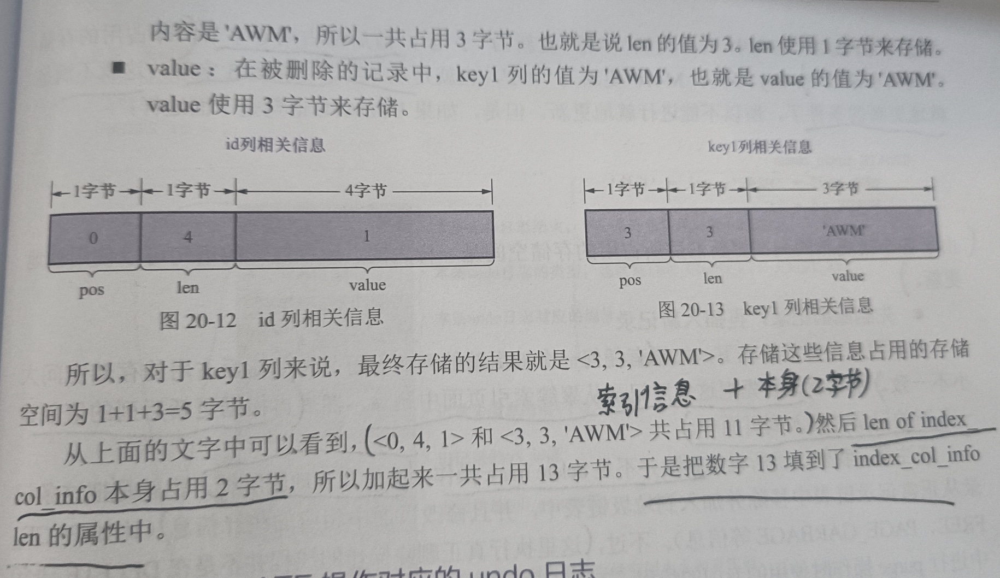


### 20.3.3 UPDATE操作对应的undo日志

执行UPDATE时，InnoDB对更新主键和不更新主键有不同的处理方案


#### 1) 不更新主键

不更新主键中，可以细分为**被更新的列占用的存储空间不变化和变化**两种情况


##### (1) 就地更新


**如果更新后的列与更新的列占用空间相同**，则**可以进行就地更新**

此时直接在原记录的基础上修改对应列的值即可


**注意：**必须每个列在更新前后的存储空间都一样大时，才能使用就地更新，否则就不能就地更新


##### (2) 先删旧记录，再插入新纪录


不更新主键时，如果有任何一个被更新列更新前后所占的存储空间大小不一致

那么就需要**先将旧记录从聚簇索引中删除**，然后**根据更新后列的值创建一条新纪录并插入**


这里的删除指的是真正的删除，不是delete mark，也就是将该记录添加到垃圾链表的头节点中

**注意：**与purge不同的是，这里执行删除的线程不是在purge操作中的专门线程，而是由用户线程同步执行真正的删除操作

在删除后，就根据更新的值创建一条新记录，并插入到页面中


如果创建的新纪录所占空间不超过旧记录占用的空间，那么直接重用旧记录所占空间即可，否则需要申请新的空间，如果页面没有足够空间则需要进行页分裂，然后插入新纪录


针对不更新主键的UPDATE操作，对应的undo日志类型为TRX_UNDO_UPD_EXIST_REC

结构如图:

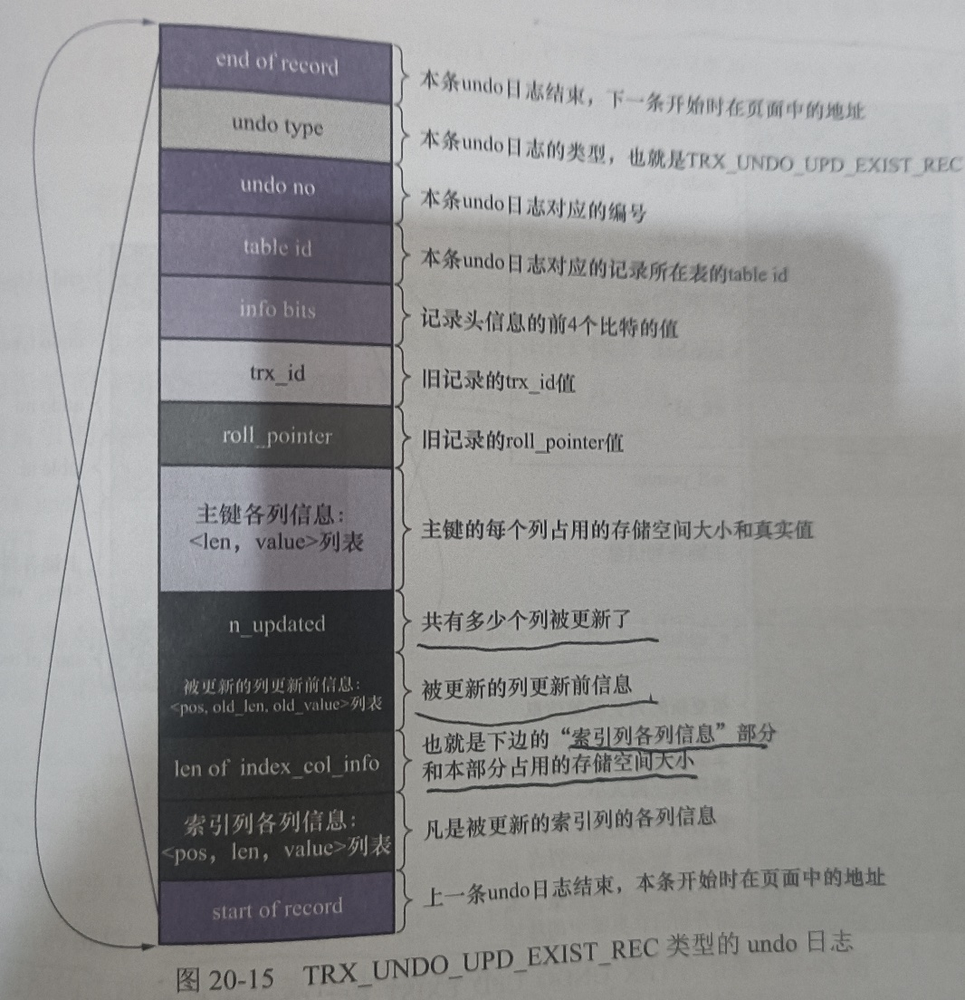

该日志需要注意的点

- 

- n_updated属性:

表示UPDATE更新的列数

- 如果UPDATE中更新的列包含索引列，那么都会添加"索引各列信息"这个部分，否则不会添加该部分


如果UPDATE语句更新的列大小没有改变，可以使用就地更新

此时会在改动页面之前记录一条类型为TRX_UNDO_UPD_EXIST_REC的undo日志

如图:

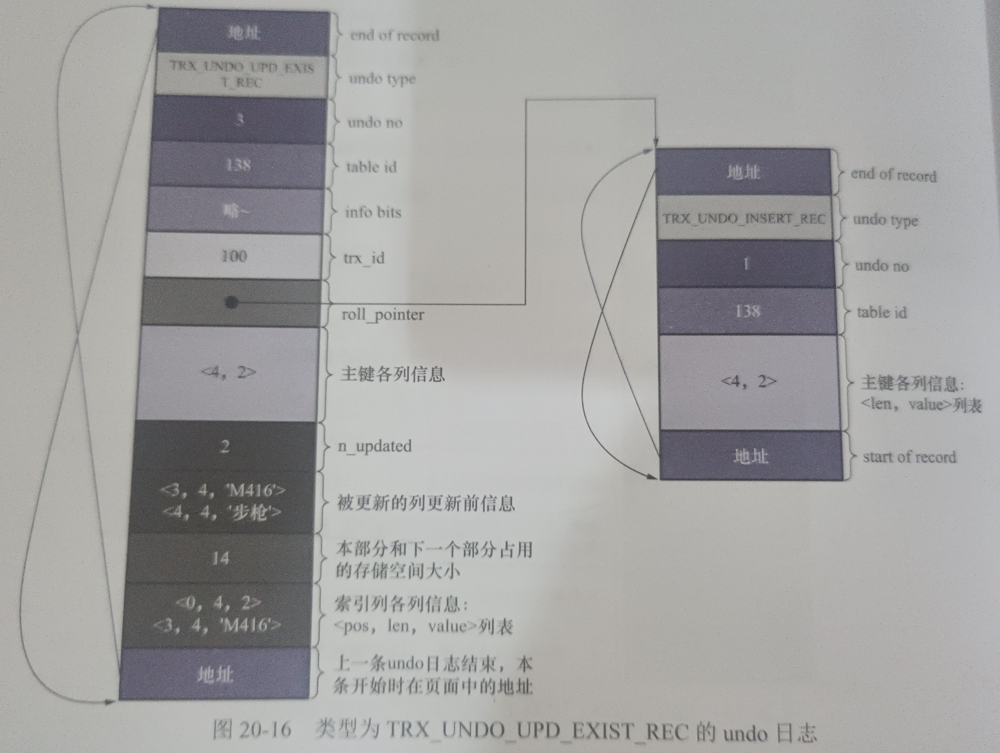

注意点:

- 该条记录是id为100的事务产生的第4条undo日志，所以它对应undo no为3
- 该条日志roll_pointer指向undo no为1的日志，也就是插入主键值为2的记录时产生的undo日志，即上一次对记录做出改动时产生的undo日志


#### 2) 更新主键

因为聚簇索引中记录按照主键的顺序串成了一个单向链表，所以如果更新了主键值，该记录在聚簇索引中对应的位置会发生改变

针对更新记录主键值的情况，InnoDB聚簇索引分为了两步


##### (1) 将旧记录进行delete mark


在UPDATE语句对应事务提交之前，只对旧记录执行一次delete mark操作

在事务提交后才执行purge操作，从而将其添加到垃圾链表中(前面是真正的删除)


补充:

之所以只执行delete mark，是因为对应的记录又可能被其他事务访问，如果直接删除则其他事务无法访问，该功能为MVCC(下一章)


##### (2) 根据更新的值创建新纪录，之后将其插入到聚簇索引中去


由于主键值发生了改变，所以需要重新从聚簇索引中定位新纪录所在的位置后，再插入


针对更新主键值的情况:

- 对记录进行delete mark操作时，会记录一条类型为TRX_UNDO_DEL_MARK_REC的undo日志
- 插入记录时，会记录一条类型为TRX_UNDO_INSERT_REC的undo日志


综上，每对一条记录的主键值进行修改时，都为记录两条undo日志


### 20.3.4 增删改操作对二级索引的影响


对二级索引执行INSERT和DELETE操作，与在聚簇索引中执行产生的影响差不多

但UPDATE略微不同

- 如果UPDATE语句中没有二级索引列

Eg:

```mysql
UPDATE undo_demo SET col = '手枪' WHERE id = 2
```

这**不需要对二级索引执行任何操作**


- 如果有

Eg:

```mysql
UPDATE undo_demo SET key1 = 'P92', col = '手枪' WHERE id = 2;
```

此时更新了二级索引的键值，则需要进行两个操作:


- 对旧的二级索引记录执行delete mark操作
- 根据新纪录的值创建一条新的二级索引记录，将其定位到二级索引中对应的位置插入


拓展：

只有聚簇索引中才有trx_id、roll_pointer等属性

但当我们增删改一条二级索引时，都会影响到该条索引所在页的Page Header部分中一个名为PAGE_MAX_TRX_ID的属性，该属性代表当前页的最大事务id(后面会用到该属性)


## 20.4 通用链表结构

undo日志会被写在什么地方？写入过程中需要注意的问题？


在写入undo日志时，会用到多个链表，这些链表节点都有相同的结构:

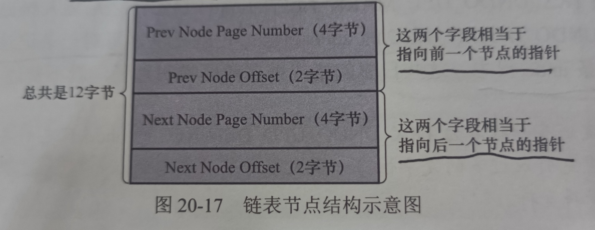


- List Length: 

表明链表的节点数

- First Node Page Number和First Node Offset的组合

指向链表头节点的指针

- Last Node Page Number和Last Node Offset的组合

指向链表尾节点的指针

整个链表的基节点占用16字节空间


链表基节点和链表节点两个结构组成链表表示图:

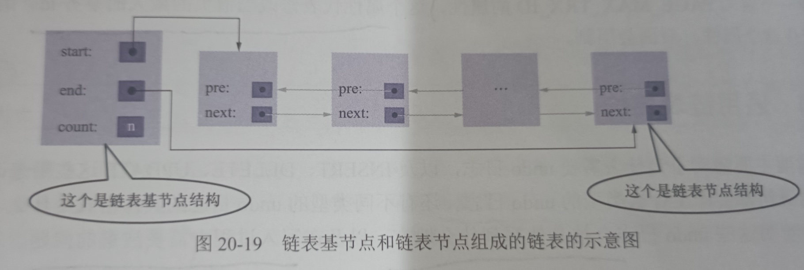


## 20.5 FIL_PAGE_UNDO_LOG页面


存储undo日志的页面类型名为FIL_PAGE_UNDO_LOG

其通用页面结构为:

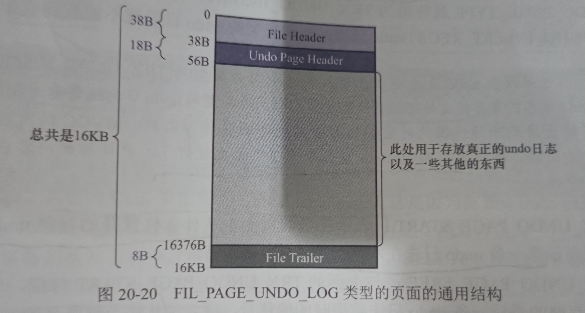

其中的Undo Page Header是undo页面特有的，其结构如下:


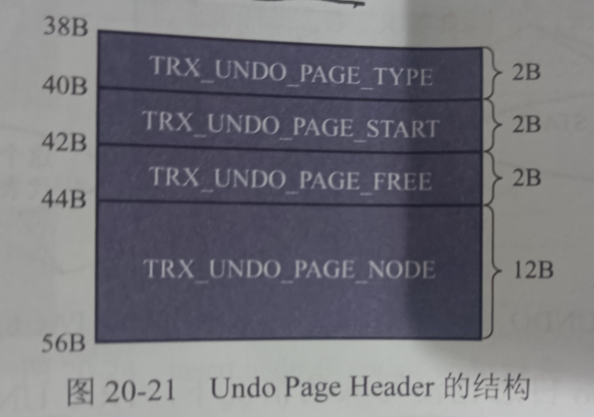

各个属性的意思:

- TRX_UNDO_PAGE_TYPE

本页面准备存储undo日志的类型，其有两个类型：


1. TRX_UNDO_INSERT:

类型为TRX_UNDO_INSERT_REC的undo日志属于这个类，一般由INSERT语句产生(UPDATE语句更新主键时也会产生该类型的undo日志)。

我们将属于该大类的undo日志简称为insert undo日志


2. TRX_UNDO_UPDATE:

除了类型为TRX_UNDO_INSERT_REC的undo日志，其他undo日志都属于这个大类

一般由DELETE、UPDATE语句产生，我们将属于这个da类的undo日志称为update undo日志


**注意: **不同大类的undo日志不能混合存储


拓展: 之所以分为两类，因为其中的insert类型在事务提交后可以直接删除，而update类型需要为MVCC服务


- TRX_UNDO_PAGE_START

表示当前页面从什么位置存储undo日志/表示第一条undo日志在页面中的起始偏移量

- TRX_UNDO_PAGE_FREE

与上面的start对应，表示当前页中存储的最后一条undo日志结束时的偏移量位置。从该位置开始可以继续写新的undo日志了

Eg:

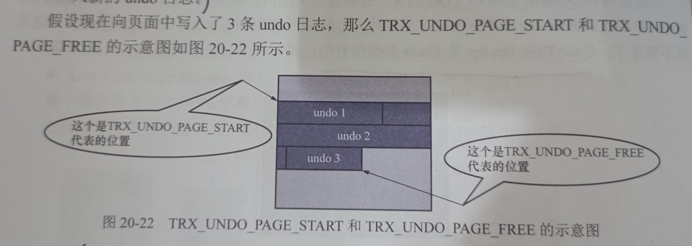

- TRX_UNDO_PAGE_NODE


代表一个链表节点结构


## 20.6 Undo页面链表


### 20.6.1 单个事务中的undo页面链表

事务中的一条语句对记录进行修改时，在对聚簇索引记录改动前，都需要记录1/2条undo日志

所以一个事务会产生多个undo日志，这些日志需要放在多个undo页面中

这些页面根据页面中的TRX_UNDO_PAGE_NODE属性连成链表(双向链表)

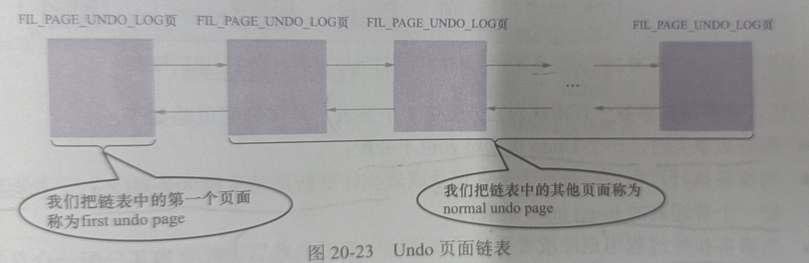

链表中的第一个页面(first undo page)除了Undo Page Header外，还有一些管理信息，其余页面没有


因为事务中会有多种语句(UPDATE/DELETE/INSERT)，所以会产生两大类undo日志

而这两大日志需要存储在两个不同的链表中，因此一个事务在执行时可能需要2个undo页面的链表

一个为insert undo链表，另一个为update undo链表

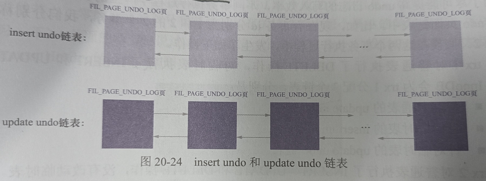


另外，对普通表和临时表进行修改时产生的undo日志需要分别记录，所以一个事务中最多会有四个undo页面链表

Eg:

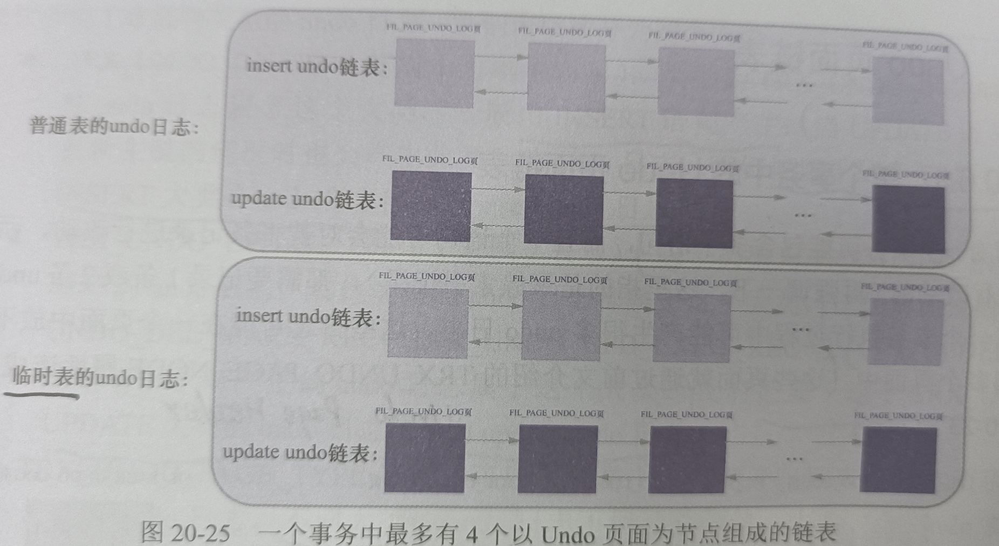

并不是一开始就有四个链表，具体的分配策略如下:

- 开启事务时一个页面链表也没有
- 当向普通表中插入记录/更新主键时，会分配一个insert undo链表
- 当删除/更新了普通表，会分配一个update undo链表
- 当向临时表中插入记录/更新主键时，会分配一个临时表的insert undo链表
- 当删除/更新了临时表，会分配一个临时表的update undo链表

总之，需要时才会分配


### 20.6.2 多个事务中的undo页面链表

为了提高效率，不同事务执行时产生的undo日志会写入到不同的undo链表中


对于事务trx1和trx2:

- trx1对普通表执行了delete，对临时表执行了insert和update，此时分配三个链表
    - 普通表的updete链表
    - 临时表的update链表
    - 临时表的insert链表
- trx2对普通表执行了insert、update和delete操作，没有修改临时表，此时分配两个链表
    - 普通表的insert undo链表
    - 普通表的update undo链表

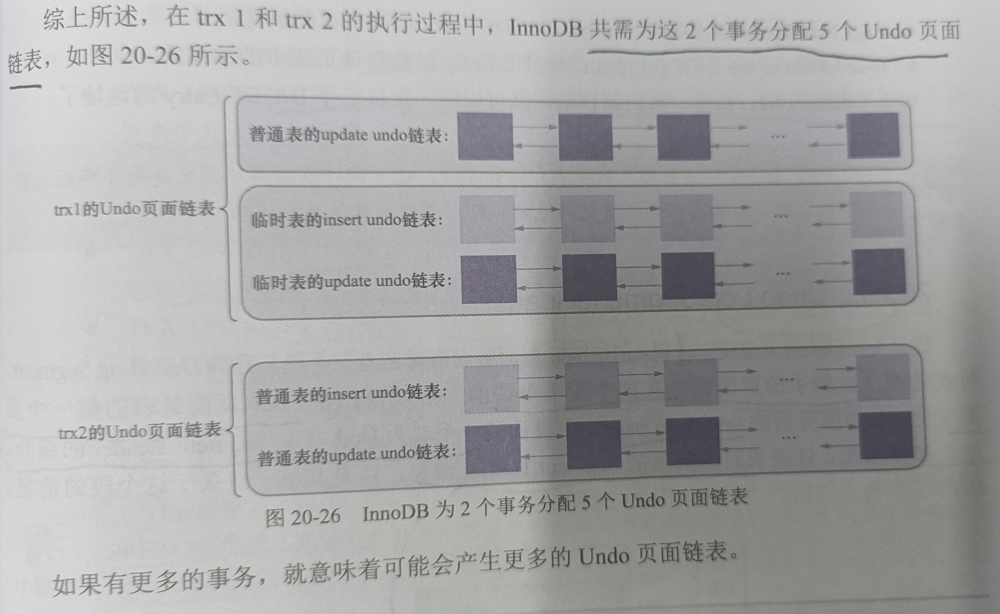


## 20.7 undo日志的写入过程


### 20.7.1 段的概念

回顾:

段是一个逻辑上的概念，其由若干零散页和若干完整区组成

一个B+树的索引被划分为两个段: 叶子结点段，非叶子结点

每个段对应一个INODE Entry结构，该结构描述了段的各个信息

为了定位INODE Entry，有一个Segment Header结构可用(该结构存在于页面链表的第一个页面中)


Segment Header的结构:

|   Space ID of the INODE Entry(4byts)   |
| :------------------------------------: |
| Page Number of the INODE Entry(4bytes) |
| Byte Offset of the INODE Entry(2bytes) |

各属性含义:

- Space ID of the INODE Entry: INODE Entry结构所在表空间ID
- Page Number of the INODE Entry: INODE Entry结构所在页号
- Byte Offset of the INODE Entry: INODE Entry结构在页面中的偏移量


### 20.7.2 Undo Log Segment Header

每个undo页面链表都对应一个段，称为Undo Log Segment

链表页面都从这个段中申请，在undo页面链表中的第一个页面(first undo page)中有一个Undo Log Segment Header的部分，该部分包含了链表对应段的Segment Header信息，以及其他一些段的信息


first undo page的结构:

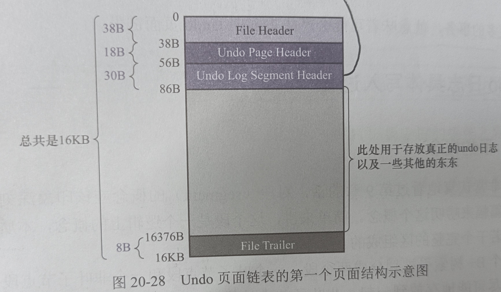


该页面比起其他页面只是多了一个Undo Log Segment Header，该结构如图:

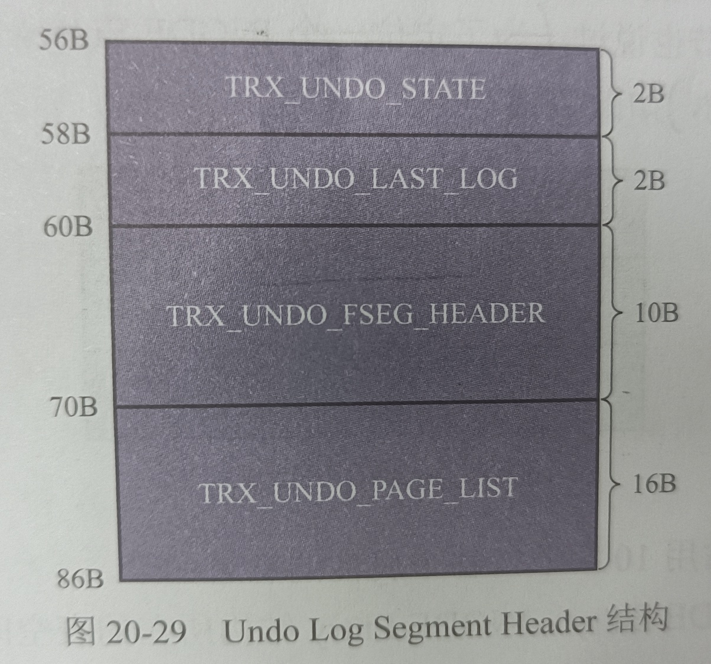

各个属性的意思:

- TR_UNDO_STATE: 表示页面链表处于的状态
    - TRX_UNDO_ACTIVE: **活跃状态**，一个活跃的事务正在向undo页面中写入日志
    - TRX_UNDO_CACHED: **被缓冲的状态**，Undo页面链表等待被重用
    - TRX_UNDO_TO_FREE: **等待被释放**，insert undo链表对应的事务提交后，该链表不能被重用
    - TRX_UNDO_PURGE: **等待purge**，update undo链表对应事务提交后，链表不能重用
    - TRX_UNDO_PREPARED: undo页面链表用户存储处于PREPARED阶段的事务产生的日志

注：何时重用，如何重用，后面会详细讲解，PREPARED在分布式事务中才会出现，暂时忽略


- TRX_UNDO_LAST_LOG: 当前undo页面链表中最后一个Undo Log Header的位置
- TRX_UNDO_FSEG_HEADER: 当前undo页面链表对应段的Segment Header信息(用来找段对应的INODE Entry)
- TRX_UNDO_PAGE_LIST: undo页面链表的基节点


每个undo页面根据一个TRX_UNDO_PAGE_NODE属性组成一个双向链表，而TRX_UNDO_PAGE_LIST就是该链表的基节点，这个基节点只存在于first undo page中(在Undo Log Segment Header中)


### 20.7.3 Undo Log Header

事务向undo页面写入undo日志时，会直接往里"堆"，一条紧接着一条写，各条undo日志是紧靠的

每当写完一个undo页面后，就会从段中申请一个新的页面，然后将页面插入到undo页面链表中，再从这个新的页面开始写undo日志


**同一个事务写入的undo日志是一个组**，每写入一组undo日志时，都会**在该组undo日志前记录一下该组的属性**

**存储这些属性的地方称为Undo Log Header**


因此在undo页面链表第一个页面真正写入undo日志之前，都会填充Undo Page Header、Undo Log Segment Header、Undo Log Header这三个部分，如图:

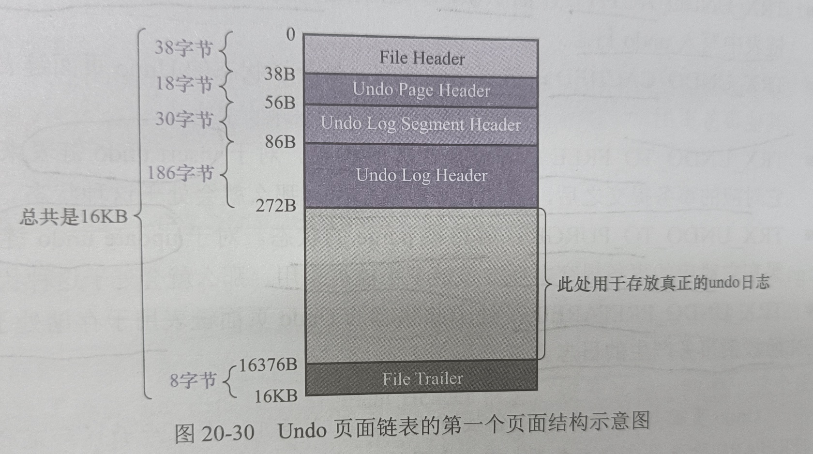


其中Undo Log Header具体结构如图:

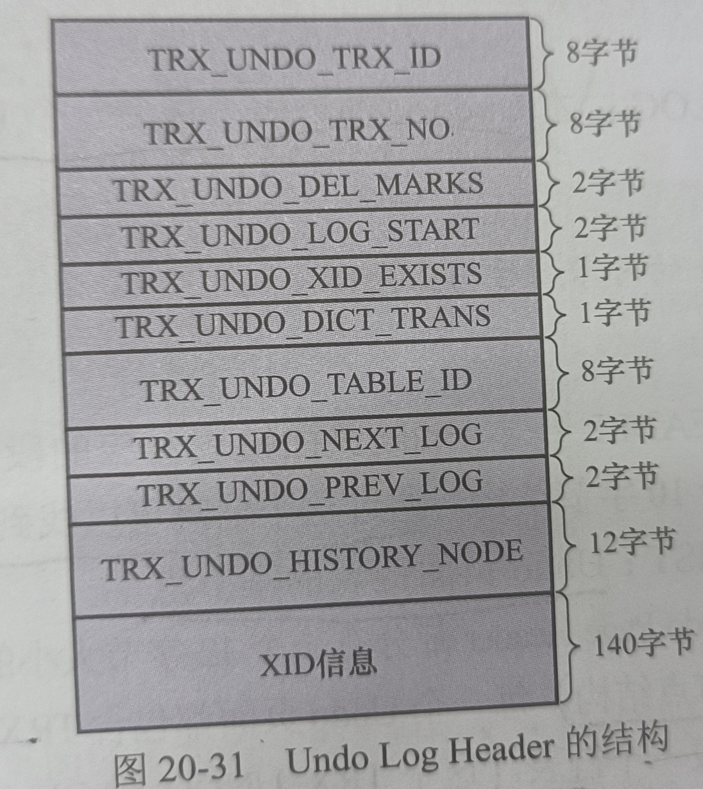

各属性的意义:

- TRX_UNDO_TRX_ID: 本组undo日志的事务id
- TRX_UNDO_TRX_NO: 事务提交后的序号，标记事务提交的顺序
- TRX_UNDO_DEL_MARKS: 标记本组undo日志是否存在包含由delete mark操作产生的undo日志
- TRX_UNDO_LOG_START: 表示本组undo日志中第一条undo日志在页面中的偏移量
- TRX_UNDO_XID_EXISTS: 暂不了解
- TRX_UNDO_DICT_TRANS: 标记本组undo日志是否由DDL语句产生
- TRX_UNDO_TABLE_ID: 如果上一个属性为true，那么本属性代表DDL语句操作表的表id
- TRX_UNDO_NEXT_LOG: 下一组undo日志在页面中开始的偏移量
- TRX_UNDO_PREV_LOG: 上一组undo日志在页面中开始的偏移量

拓展: undo页面链表重用后，一个页面中可能会有多组事务产生的undo日志，上述两个属性就区分了不同组的undo日志

- TRX_UNDO_HISTORY_NODE: 一个12字节的链表节点结构，代表一个名为History的链表节点(下一章)


### 20.7.4 小结

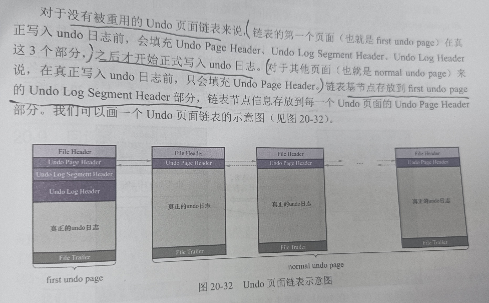


## 20.8 重用Undo页面

之前说过:

一个事务执行期间可能会产生4条Undo页面链表，但会造成问题：

如果事务在执行时至修改了一条/几条记录，那么对应undo页面链表中只产生了很少的undo日志

这些undo日志可能只占用了一点点存储空间，但**为了存储这么一点undo日志而创建undo页面链表很浪费**


为了解决这个问题：

事务提交后某些情况下会重用undo页面链表，需要符合两个情况:


- 链表只包含一个Undo页面

如果事务产生了很多的undo日志，那么会从段中申请很多页面加入到undo页面链表中

事务提交后，**如果整个链表的页面都重用**，那么即使新事务只写入了很少的undo日志，链表也需要维护很多页面


为了避免这种浪费，规定**Undo页面链表中只包含一个Undo页面时，链表才可以被下一个事务重用**


- undo页面已经使用的空间小于整个页面的3/4

因为如果该页已经使用了大部分空间，那么重用的好处不大


按照undo日志，页面链表也非为两大类: update undo页面链表和insert undo页面链表，两种链表在重用时的策略也不同:


- insert undo链表

这种链表存储的日志在事务提交后就没用了，所以重用该链表时，可以直接将之前事务写入的undo日志覆盖掉

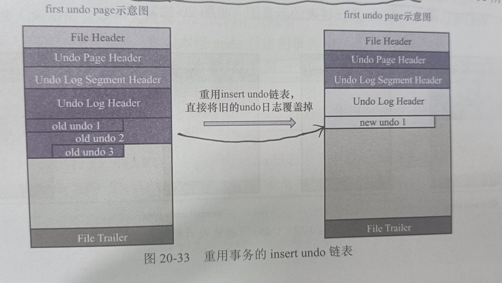

拓展:

在重用undo页面链表时，还会更新Undo Page Header，Undo Log Segment Header，Undo Log Header中的多个属性值


- update undo链表

update语句对应的事务提交后，其对应的undo日志不能立即删除，此时重用该update undo页面链表时不能覆盖掉之前的undo日志，此时页面中会有多组undo日志

Eg:

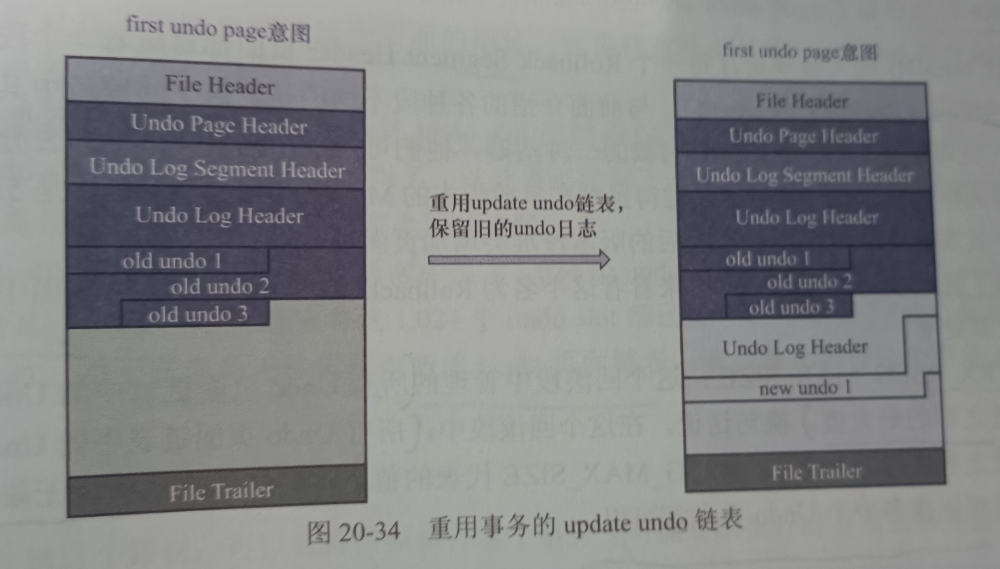


## 20.9 回滚段


### 20.9.1 概念

事务执行时最多会分配4个undo页面链表，而不同事务对应的链表不同


为了管理这些链表，有一个名为Rollback Segment Header的页面

其中存放了各个undo页面链表的first undo page的页号，这些页号被称为"undo slot"


我们可以通过Rollback Segment Header中的undo slot找到对应的first undo page，再通过first undo page找到对应的undo页面链表


Rollback Segment Header页面的结构:

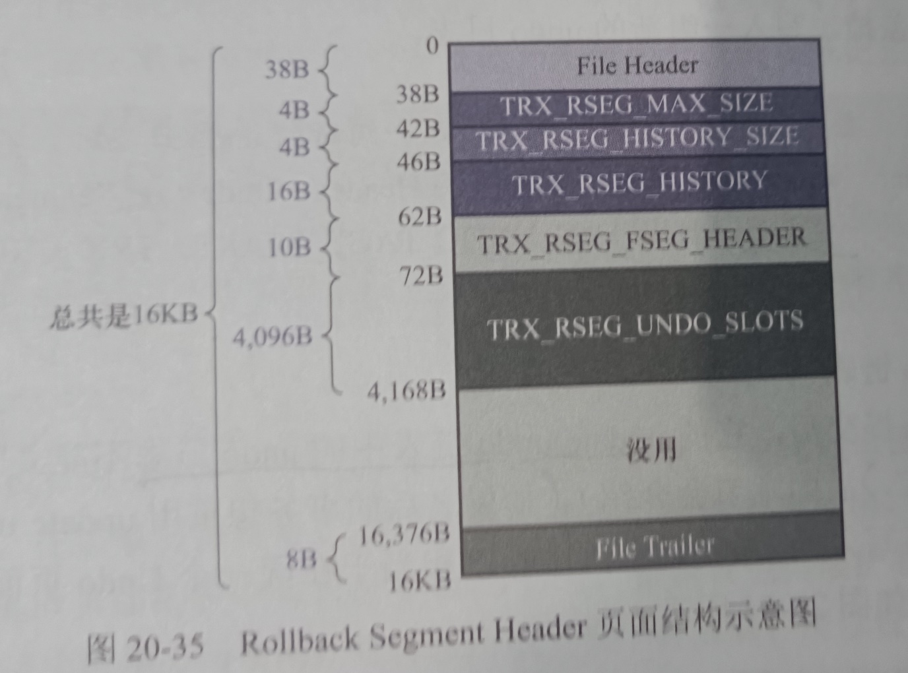


按照规定，**每个Rollback Segment Header页面都对应一个段，这个段就是回滚段(Rollback Segment)**

不同于其他的段，回滚段中其实只有一个页面


Rollback Segment Header页中各个部分的含义:

- TRX_RSEG_MAX_SIZE

该回滚段对应undo页面链表中undo页面数之和的最大值，所有undo页面链表中的undo页面数之和不能超过该值

拓展：

其实际上的默认值为0xFFFFFFFE(4bytes)


下一章：

- TRX_RSEG_HISTORY_SIZE

History链表占用的页面数

- TRX_RSEG_HISTORY

History链表的基节点


- TRX_RSEG_FSEG_HEADER

通过该属性可以找到回滚段对应的10字节大小的Segment Header结构，从而找到本段对应的INODE Entry

- TRX_RSEG_UNDO_SLOTS

各个undo页面链表的first undo page页号集合，也就是undo slots集合

一个页号4bytes，一个大小为16KB的页能够存储1024个undo slot，所以该属性占用4096Bytes


### 20.9.2 从回滚段中申请Undo页面链表


初始情况下，由于没有为任何事务分配任何undo页面链表，所以对于Rollbakc Segment Header页面来说，它的各个undo slot都应该设置为一个特殊值: FIL_NULL

该值表示undo slot不指向任何一个undo页面(undo slot: undo页面链表中 first undo page的页号)


当需要为事务分配undo页面链表时，从回滚段的第一个undo slot开始，查看undo slot的值是否为FIL_NULL

- 如果为FIL_NULL，那么就需要在表空间中新创建一个段(Undo Log Segment)，再从这个段中申请页面作为Undo页面链表的first undo page，最后将undo slot更新为这个页面的地址，意味着该undo slot被分配给了这个事务
- 如果不为FIL_NULL，那么说明undo slot已经指向了一个undo页面链表，说明该undo slot被占用了，此时需要跳到下一个undo slot，并重复上述步骤


一个Rollback Segment Header页面中包含1024个undo slot，如果都不为FIL_NULL，说明无法为事务分配新的undo页面链表，此时就是停止待分配的事务，并报错：

```mysql
Too many active concurrent transactions
```


此时可以重新执行事务(可能其他事务提交了，undo页面链表可以重用了)


#### 事务提交后，对应的undo slot有两种处理方式


- 如果undo slot指向的undo页面链表**符合重用条件**

则该**undo slot就处于被缓存的状态**，其指向的**undo页面链表对应的TRX_UNDO_STATE属性就会被设置为TRX_UNDO_CACHED**

**被缓存的undo slot都会被加入到一个链表中**，不同类型的undo页面链表对应的undo slot会被加入到不同的链表中


1. 如果对应的undo页面链表**是insert undo链表**

则该undo slot**会被加入到insert undo cache链表中**


2. 如果对应的undo页面链表是update undo链表

则该undo slot会被加入到update undo cached链表中


一个回滚段对应上述两个cached链表，之后如果需要为新事务分配事务id，都会先从对应的cached链表中去找

如果没有缓存的undo slot，才会从回滚段中Rollback Segment Header页面中查找


- 如果不符合重用条件

根据undo slot对应undo页面链表的类型进行不同的处理:


1. 如果对应的undo页面链表为insert undo链表

则该undo页面链表的TRX_UNDO_STATE属性会被设置为TRX_UNDO_TO_FREE

之后undo页面链表对应的段会被释放(段中的页面可以重用)，undo slot设置为FIL_NULL


2. 如果对应的undo页面链表是update undo链表

则undo页面链表的TRX_UNDO_STATE属性会被设置为TRX_UNDO_TO_PURGE

并将该undo slot的值设置为FIL_NULL，然后将事务写入的一组undo日志放入History链表中(对应段不会释放，还需要为MVCC服务)


### 20.9.3 多个回滚段

一个回滚段中只有1024个undo slot，所以在之后直接定义了128个回滚段

与之前一样，每个回滚段都有一个对应的Rollback Segment Header页面，**这128个页面需要储存**


这些Rollback Segment Header页面的地址都被存储在系统表空间第5号页面某个区域，其中包含128个8字节的格子

Eg:

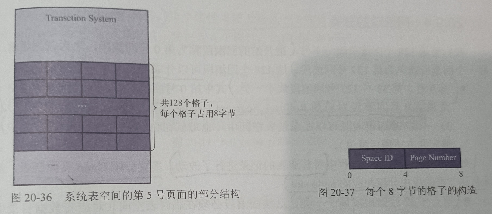


每个格子由两个部分组成:

- Space ID: 代表表空间id
- Page number: 代表一个页号

每个格子相当于一个指针，指向表空间中的某一页，这个页就是Rollback Segment Header

不同的回滚段可能分布在不同的表空间中


总结:

系统表空间中第5号页面中存储了128个Rollback Segment Header页面地址

每个Rollback Segment Header就对应一个回滚段

每个Rollback Segment Header页面中有1024个undo slot

每个undo slot对应一个undo页面链表

Eg:


### 20.9.4 回滚段的分类


对这128个回滚段编号:

最开始的回滚段为第0号回滚段，直到第127号回滚段，这128个回滚段可以分为2类:


#### 1) 第0、第33～127号回滚段

其中第0号必须在系统表空间中，也就是其对应的Rollback Segment Header页面必须在系统表空间中

而第33～127号可以在系统表空间或者自己配置的undo表空间中


如果事务对普通表的记录进行了修改，那么必须从这一类的段中分配相应的undo slot


#### 2) 第1～32号回滚段

这些回滚段必须在临时表空间，对应datadir下的ibtmp1文件

如果事务对临时表记录进行了改动，需要分配undo页面链表时，必须从这类段中分配对应的undo slot


总结:

如果事务执行时修改了临时表和普通表的记录，那么需要为记录分配两个回滚段，然后分别从回滚段中分配对应的undo slot


#### 3) 分类的原因

Undo页面其实是类型为FIL_PAGE_UNDO_LOG页面的简称，其只是普通的页面

向undo页面写入undo日志其实就是写页面的过程，所以在写入undo日志之前还需要写上对应的redo日志

所以我们对undo页面的修改都会记录相应类型的redo日志


对于临时表来说，因为修改临时表产生的undo日志只在运行时有效，崩溃重启后不需要恢复，所以针对临时表修改写的undo日志不需要写对应的redo日志


针对普通表和临时表划分不同类型段的原因:

在修改针对普通表的回滚段中undo页面时，需要记录对应的redo日志

在修改针对临时表的回滚段中undo页面时，不需要记录对应的redo日志


### 20.9.5 roll_pointer的组成

roll_pointer是聚簇索引记录中一个隐藏列


有些类型的undo日志也包含一个名为roll_pointer的属性，该属性本质就是一个指针，指向一条undo日志的地址

Eg:

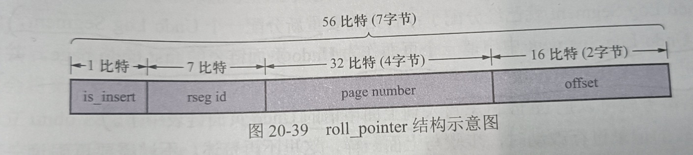

各个属性的含义:

- is_insert: 表面该指针指向的是否为TRX_UNDO_INSERT大类的undo日志
- rseg_id: 表示指针指向的undo日志回滚段编号，即第几号回滚段
- page_number: 表示指针指向的undo日志所在页面的页号
- offset: 表示指针指向undo日志在页面中的偏移量


### 20.9.6 为事务分配undo页面链表的详细过程


以事务**对普通表记录改动为例**，梳理事务执行时分配undo页面链表时的完整过程


#### 1) 事务在对普通表记录进行首次修改之前

会到系统表空间的第5号页面中分配一个回滚段(Rollback Segment Header的地址)，一旦某个回滚段被分配到了一个事务，那么之后事务对普通表进行改动时，就不会重复分配

该过程使用round-robin(循环使用)的方式来分配，也就是将128个回滚段轮着分配给不同的事务


#### 2) 分配回滚段之后

首先查看该回滚段的两个cached链表中有没有缓存的undo slot

如果执行的是INSERT操作，则到对应的insert undo cached链表中查看有没有缓存的undo slot

如果是DELETE操作，则到update undo cached链表中查看有没有缓存的undo slot，有则分配给事务


#### 3) 没有缓冲的undo slot

那么就需要到Rollback Segment Header页面中去找了，过程见20.9.2


#### 4) 找到可用的undo slot之后

如果是从cached链表中找到的，那么其对应的Undo Log Segment就已经分配了，否则需要重新分配一个Undo Log Segment，并从这个段中申请一个页面作为undo页面链表的first undo page，并更新该页的页号到undo slot中


#### 5) 之后事务可将undo日志写到undo页面链表中了

并发执行的事务也可以被分配相同的回滚段，只需要分配不同的undo slot即可


## 20.10 回滚段配置


### 20.10.1 配置回滚段数量


系统中默认有128个回滚段，我们可以通过启动项innodb_rollback_segments来设置回滚段的数量

该选项**不会影响临时表的回滚段数量**，**临时表的回滚段数量一直为32**

也就是说:

- 如果将innodb_rollback_segments设置为1，那么普通表只有一个可用的回滚段，而临时表有32个可用的回滚段
- 如果设置为2～32之间的数，效果和1相同
- 如果设置为大于33的数，那么实际可用的回滚段数量 = 设置数量 - 32


### 20.10.2 配置undo表空间


默认情况下，普通表可用的回滚段(第0号以及33～127号回滚段)都是分配到系统表空间中的

其中的第0号回滚段一直在系统表空间中，但33～127号可通过配置放到指定的undo表空间中

该设置只能够在系统初始化的时候使用，一旦初始化完成，就不能再更改了。相关的启动项:

- innodb_undo_directory: 指定undo表空间所在的目录，如果没有指定该参数，则默认undo日志所在目录为数据目录
- innodb_undo_tablespaces: **定义了undo表空间的数量**，默认值为0，表明不创建任何undo表空间

第33～127号回滚段可以平均分不到不同的undo表空间中


如果设置了undo表空间，那么系统表空间中的第0号回滚段将不可用


设置undo表空间的好处: 当undo表空间中文件过大时，会自动将该undo表空间截断成小文件

而系统表空间只会不断增大


## 20.11 undo日志在崩溃恢复时的作用


按照redo的方法:

重启时根据redo日志恢复到之前的状态，这样可以保证持久性，但是没有提交的事务写入的redo日志可能已经刷盘

那么如果按照未提交事务对应的redo日志进行恢复的话就会出错


为了保证事务的原子性，在服务器重启时会将未提交事务回滚，但是如何找到未提交的事务？通过undo日志！


通过系统表空间中页号为5的页面定位128个回滚段的位置

在每个回滚段的1024个undo slot中找到值不为FIL_NULL的undo slot

每个undo slot都指向一个undo页面链表

根据链表中第一个页面的Undo Segment Header找到TRX_UNDO_STATE属性(标识当前undo页面链表的状态)

如果该属性为TRX_UNDO_ACTIVE，说明有一个活跃的事务向undo页面链表写入undo日志

在页面的Undo Sgement Header中找到TRX_UNDO_LAST_LOG属性，通过该属性找到当前undo页面链表中最后一个Undo Log Header的位置，从该Undo Log Header中找到对应事务的事务id，该事务id对应的事务就是未提交的事务

之后通过undo日志将事务对页面所做的更改全部回滚即可，从而保证了原子性

<hr>


# 二十一、事务隔离等级/MVCC


## 21.1 准备

Eg:

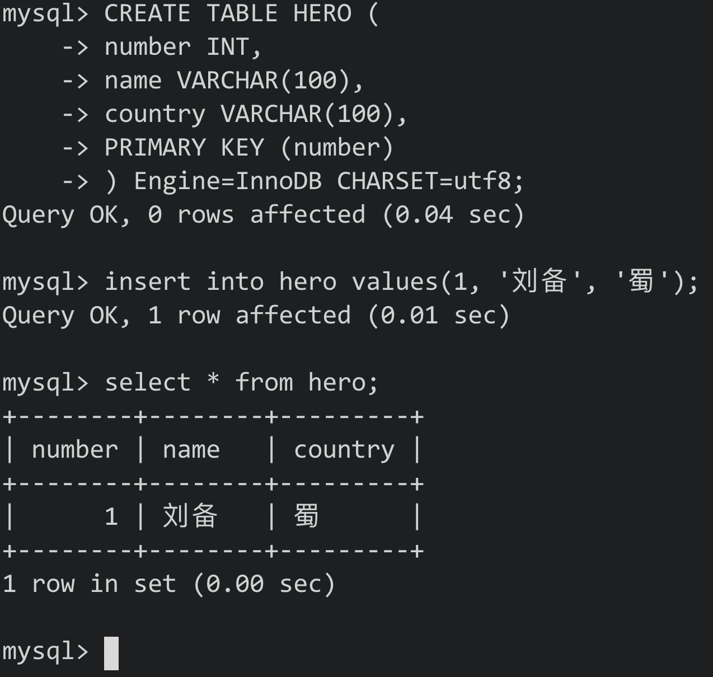


## 21.2 事务隔离等级


先导:

一个事务对应现实世界中的一次状态转换。事务执行后需要符合现实世界的所有规则，这就是一致性，一致性一般由Code保证

而原子性由undo日志保证

持久性由redo日志保证


在转账中的一致性需求: 我们需要保证参与转账的用户的总余额不变

通常只需要将这些步骤都放在一个事务中即可

如果事务按照单个的形式一个接一个的串行执行，那么开始一个事务的时候，面对的就是上一个事务执行后留下的一致性状态

但如果事务并发执行的话，可能引发一致性问题:

- 如果两个事务不会访问相同的数据则没有问题
- 如果两个事务会访问相同数据，则会出现问题


Eg:

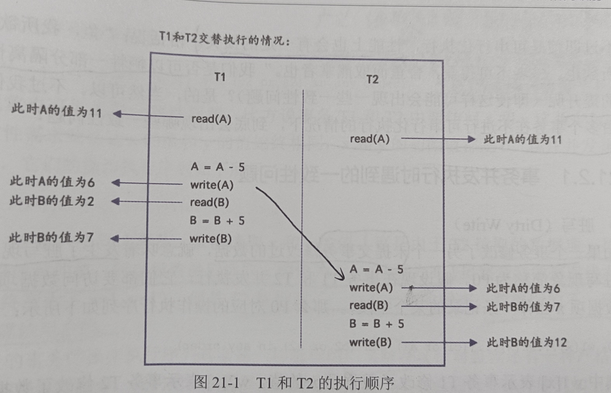

(此时发生了脏读)

此时因为两个事务并发执行，所以没能保持一致性

为了让事务保持一致性，我们需要**让这些事务按照顺序一个一个地单独执行或者"隔离"地执行，互不干扰**

**这就是事务的隔离性**


**串行执行:**


实现隔离性最粗暴方式就是系统同一时刻只能运行一个事务(例如让所有的事务在一个线程中执行)

其余事务只能在当前事务运行完成后才能开始运行，**这种事务的执行方式为串行执行**


缺点:

**串行执行过于严格，会严重降低系统吞吐量和资源利用率，会增加事务的等待时间**，因此需要改进


从原因出发: 


串行化执行

并发事务**之所以影响一致性，是因为它们执行时会访问相同的数据**

我们可以**只在某事务访问数据时，对其他试图访问相同数据的事务进行限制，想要访问相同数据时就排队**，这种**多个事务的执行方式称为串行化执行**


拓展:

单纯的读操作不会影响一致性，所以**读-读(两个事务都读取数据)不会引发一致性问题**

**只有在至少一个事务对数据进行写的时候才可能带来一致性问题**

因此在实现串行化执行时，只需要在多个事务对相同数据访问是读-写、写-读、写-写时才对其进行排队(通常是通过加锁实现的)


问题:

**串行化执行在性能上也会有一些损失，我们可以牺牲一些隔离性来获取性能提升**，只需要搞清楚多个事务在不进行串行化执行时会出现的一致性问题即可


### 21.2.1 事务并发执行时遇到的一致性问题


#### 1) 脏写

**一个事务修改了另一个未提交事务修改过的数据，则发生了脏写**(先写不提交，后再被另一个写)


Eg:


T1和T2并发执行，访问数据x

脏写P0:

P0: w1[x]...w2[x]...((c1 or a1) and (c2 or a2) in any order)


w1[x]: 事务T1修改了数据x的值, w2[x]表示事务T2修改了数据x的值

c1: 事务T1提交(commit), a1: 事务T1的中止(Abort)

c2: 事务T2的提交, a2: 事务T2的中止


其中**事务T2修改了事务T1修改过的数据，而T1事务还未提交**，所以发生了脏写


脏写还**可能破坏原子性和持久性**:


T1和T2事务并发执行修改数据项x和y，**一致性需求为x和y相等**

w1[x=2]w2[x=3]w2[y=3]c2a1

T1先修改了数据项x，而T2再次修改了数据项x，此时T1还未提交，之后T2提交了T1中止了


因为T1事务中止了，所以需要回滚T1所做的修改，也就是将x改为0

但T2事务已经提交了，**如果回滚T1的话，还需要回滚T2对x的修改，此时就影响到了原子性**

如果**将两个事务的修改都回滚的话，那么T2作为已经提交的事务对数据的修改应该具有持久性**，此时持久性就被破坏了


#### 2) 脏读

一个事务读到了另一个未提交事务修改过的数据，此时发生了脏读


事务T1和T2并发执行，都访问数据项x

脏读P1:

P1:w1[x]...r2[x]...((c1 or a1) and (c2 or a2)) in any order


例子:

T1和T2事务并发执行，都访问数据x，y，一致性需求为x，y始终相等

w1[x=1]r2[x=1]r2[y=0]c2w1[y=1]c1


T2只是一个只读事务，一次读取x和y

由于T2读取的数据是事务T1修改过的值，所以导致最后读取的x为1，y为0，此时数据库状态不一致


脏读的严格定义:

A1:w1[x]...r2[x]...(a1 and c2 in any order)


即: T1先修改了了数据值，然后T2读取到了这个数据值，而T1还未提交，而之后T1中止而T2提交，**这就意味着T2读取了一个不存在的数据**


区分:

- 广义: 读取的为未提交事务修过过的
- 严格: 读取的为未提交事务修改过的，**之后该事务中止(读取的值不存在)**


#### 3) 不可重复读

修改了一个未提交事务读取的数据，则发生了不可重复读现象


与脏读的区别:

- 脏读: 先改后读
- 不可重复读: 先读后改(之前读取的数据之后再读就变了，所以不能重复读)


不可重复读现象可能引发一致性问题

例子:


事务T1和T2并发执行，访问x和y，一致性需求要让x和y值始终相等

r1[x=0]w2[x=1]w2[y=1]c2r1[y=1]c1


T1读取数据x，T2修改数据x和y后提交，虽然未发生脏写和脏读，但T1最终得到的x为0，而y为1，这是不一致的状态


严格定义:


A2: r1[x]...w2[x]...c2...r1[x]...c1

T1先读取数据x，之后T2修改了T1读取的数据x，之后T1再次读取x，此时的值与第一次的值不同


区别:

- 广义: 先读未提交，后被另一个改，之后另一提交
- 严格: 先读未提交，后被另一个改，之后另一提交，**再读时与之前读取的不一致**


#### 4) 幻读

事务先根据条件查询出一些记录，**之后在该事务未提交时，另一个事务写入了一些符合之前条件的记录**，此时就发生了幻读


例子:

现在符合条件P的记录条数为3，记录项z表示符合搜索条件P的记录条数，初始值为3

一致性需求为: z能够符合满足搜索条件P的记录数

并发执行事务T1和T2，执行序列:

r1[P]w2[insert y to P]r2[z=3]w2[z=4]c2r1[z=4]c1


T1先读取出符合条件P的记录，然后T2插入一条符合条件P的记录，之后更新数据项后事务T2提交，最后T1再次读取数据项z，此时z变为了4，**此时读取的数据条数与之前不符**


严格定义:

A3: r1[p]...w2[y in p]...c2...r1[p]...c1

T1先读取符合搜索条件p的记录，之后T2写入了符合搜索条件p的记录。**最后T1再次读取时，两次读取的记录不同**


SQL标准:

只有在T2插入记录时才会引发幻读


MySQL:

一个事务按照相同搜索条件多次读取数据时，在后面读取到的之前没有读取到的记录

这些"之前没有读取到的记录"可能是由其他事务插入的，也可能是由UPDATE更新主键得到的，这些"后面读取到的之前没有读取到的记录"可以称为幻影记录

其中的每条记录分别发生了不可重复读


### 	21.2.2 SQL标准中的隔离等级


按照导致一致性问题的严重性给这些现象排序:
脏写 -> 脏读 -> 不可重复读 -> 幻读


"舍弃部分隔离性换取部分性能"在这里就体现为: 设立一些隔离等级，级别越低就越会发生严重的问题

SQL标准中的隔离等级:

- READ UNCOMMITTED: 未提交读
- READ UNCOMMITTED: 已提交读
- REPEATABLE READ: 可重复读
- SERIALIZABLEL: 可串行化


根据SQL标准，不同隔离等级并发执行事务过程中可以发生不同的现象:

|     隔离等级     |  脏读  | 不可重复读 |  幻读  |
| :--------------: | :----: | :--------: | :----: |
| READ UNCOMMITTED |  可能  |    可能    |  可能  |
|  READ COMMITTED  | 不可能 |    可能    |  可能  |
| REPEATABLE READ  | 不可能 |   不可能   |  可能  |
|   SERIALIZABLE   | 不可能 |   不可能   | 不可能 |

- 在READ UNCOMMITTED隔离等级下，可能发生脏读、不可重复读、幻读
- 在READ COMMITTED隔离等级下，可能发生不可重复读、幻读
- 在REPEATABLE READ隔离等级下，可能发生幻读
- 在SERIALIZABLE隔离等级下不会发生一致性问题

无论哪种隔离等级都不允许脏写发生


### 21.2.3 MySQL支持的四种隔离等级

MySQL中各级隔离等级允许发生的现象与SQL规定中的有些出入:

MySQL在REPEATABLE READ隔离等级下，可以很大程度上禁止幻读发生


MySQL默认隔离等级为REPEATABLE READ


#### 1) 设置事务的隔离等级

Syntax:

```mysql
SET [GLOBAL|SESSION] TRANSACTION ISOLATION LEVEL level;
```


level的可选项:

```mysql
level : {
	REPEATABLE READ | READ COMMITTED | READ UNCOMMITTED | SERIALIZABLE
}
```


设置隔离等级时，SET后不同的关键字对事务的影响范围:


- GLOBAL
    - 只对执行完语句后产生的新回话有效(新的client连接)
    - 当前已经存在的会话无效
- SESSION
    - 只对当前会话的后续事务有效
    - 该语句不会影响正在执行的事务
    - 在事务之间执行时，只对后续事务有效
- 都不使用(只生效一次)
    - 只对当前会话中下一个即将开始的事务有效
    - **下一个事务执行完后，后续事务将恢复到之前的隔离等级**
    - 不能在已经开始的事务中执行，会报错


启动时改变隔离等级

修改启动选项: transaction-isolation

Eg:

```shell
mysqld --transaction-isolation=SERIALIZABLE
```


通过系统变量查看隔离等级:

```mysql
SHOW VARIABLES LIKE 'transaction_isolation';
```

或者

```mysql
SHOW @@transaction_isolation;
```


**注意：**在MySQL5.7.20之前的版本需要使用"tx_isolation"


Eg:

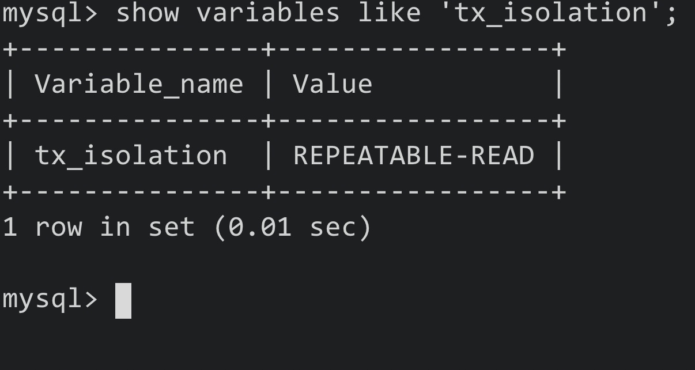


之前使用"SET TRANSACTION ISOLATION LEVEL level"就是在修改"tx/transaction_isolation"这个变量


通过修改系统变量的方式修改隔离等级的语法:

|                 Syntax                  |       scope        |
| :-------------------------------------: | :----------------: |
| SET GLOBAL transaction_isolaton = level |        全局        |
|     SET @@GLOBALE var_name = level      |        全局        |
|      SET SESSION var_name = level       |        会话        |
|     SET @@SESSION var_name = level      |        会话        |
|          SET var_name = level           |        会话        |
|          SET @@var_name = leve          | 下一个事务(一次性) |


## 21.3 MVCC原理


### 21.3.1 版本链

使用InnoDB存储引擎的表，在聚簇索引记录下都包含两个隐藏列(row_id非必需)

- trx_id: 每次当有一个事务对聚簇索引记录进行修改时，都会将事务的id赋值到该列上
- roll_pointer: 该列相当于指针，可以指向该记录修改前的信息(undo日志)


假设现在一个id为80的事务执行了插入操作，则对应插入的记录为:


注意:

insert undo日志只在事务回滚时起作用，因此如果事务提交了，那么insert undo就没用了

对应的Undo log Segment会被回收(undo页面链表被重用/释放)

但roll pointer不会清除。roll pointer占用7bytes，第一个bit标记其指向的undo日志类型，为1则说明指向的是TRX_UNDO_INSERT类


之后的内容是为了展示undo日志在MVCC中的应用，而非事务回滚中的应用，所以后面都会去掉最开始的insert undo日志


例子:

假设之后有两个id为100、200的事务对这条记录进行了UPDATE操作，操作流程:

  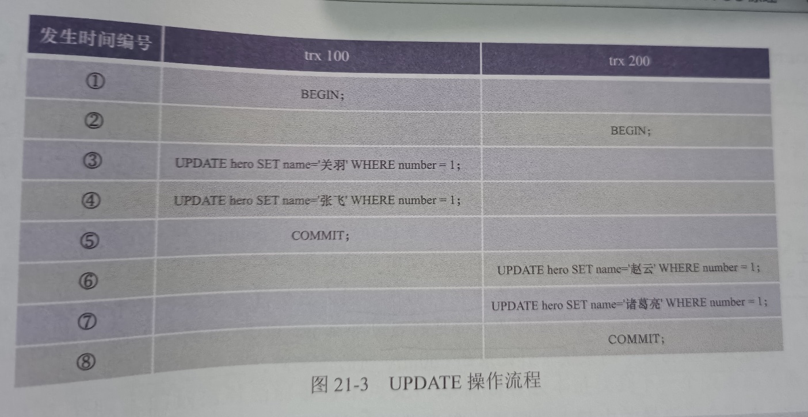

- 每一次UPDATE都会记录对应的undo日志，而每条undo日志又有一个roll_pointer属性指向上一个undo日志，这里省去了最早的insert undo日志

Eg:

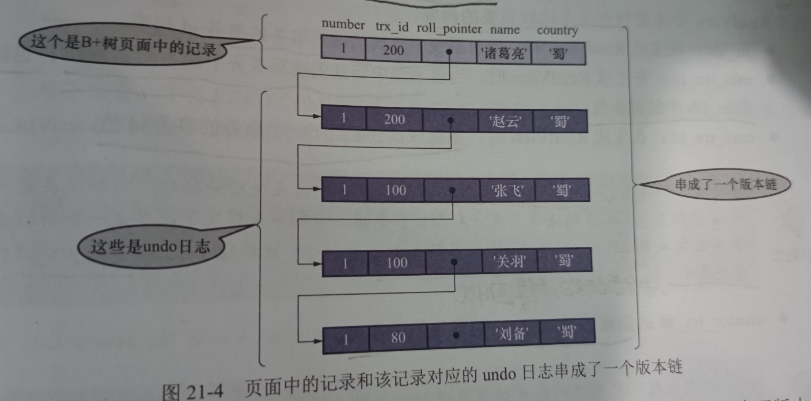


每次更新记录后，都会将旧值(被更新的部分)放到一条undo日志中，之后所有的undo**通过roll_pointer连接起来形成版本链**，其中的每个undo日志都有其生成时对应操作所在的事务id

其中头节点就是当前记录的最新值

我们会**通过这个记录的版本链来控制并发事务访问相同记录时的行为**，**我们将这种机制称为MVCC**(Multi-Version Concurrency Control)


拓展:

在update undo日志中，只会记录索引列和更新列的信息，所以不会记录下所有列的信息

其中没有记录的列信息说明该列的值没有被更新，在之前的版本中找即可，如果都没有说明该列的值没有变过


### 21.3.2 ReadView


对于使用READ UNCOMMITTED隔离等级的事务:

**可以读到未提交事务修改过的记录**，所有**直接读取记录版本链中的最新版记录即可**


对于使用SERIALIZABLE隔离等级的事务:

会**直接对记录加锁的方式来访问记录**


对于使用READ COMMITTED和REPEATABLE READ的事务来说:

必需保证**读取已提交事务修改的记录**

也就是说明，一个事务修改了数据后但事务未提交，**此时其他事务不能读取该未提交事务在版本链中对应的新版记录**


此时的核心问题就是:

**如何判断记录的哪些版本是当前事务可操作的/可见的**


为此提出了ReadView的概念，其中4个重要的内容:

- m_id: 生成ReadView时，当前系统中**活跃事务的事务id列表**
- min_trx_id: 生成ReadView时，当前系统**活跃的读写事务中最小的事务id**，即m_id中的最小值
- max_trx_id: 生成ReadView时，系统应该分配给下一个事务的事务id

**注意:** max_trx_id不是m_id中的最大值。假如有三个事务1、2、3，事务id为3的提交了，此时如果生成ReadView，那么**m_id为[1, 2]，max_trx_id为4**

- creator_id: 生成ReadView的事务对应的事务id


通过ReadView来判断记录版本可见的步骤:


1. 如果**对应记录最新版本中的trx_id与当前事务生成的ReadView对应的create_trx_id相同**
    - 说明当前事务在访问它修改过的记录(上次修改也是在本事务中)。当前版本可以访问
2. 如果当前访问记录最新版本中的trx_id < 当前事务生成的ReadView对应的creator_trx_id
    - 则说明上次修改当前记录的事务已经提交了，所以当前版本可以访问(事务id小的说明执行靠前)
3. 如果当前访问记录最新版本中的trx_id >= 当前事务生成的ReadView对应的creator_trx_id
    - **则说明生成该版本记录的事务在当前事务之后执行，需要先执行完当前事务后才能再次修改**，所以不能访问当前版本
4. 如果当前访问记录最新版本中的trx_id 在min_trx_id和max_trx_id之间
    - 则需要进一步判断其是否在m_id中
    - 如果在说明生成该版本的记录还未提交，所以当前版本不能访问
    - 如果不在则说明对应事务已经提交，可以访问该版本


如果当前版本对事务不可见，则通过roll_pointer去找之前的版本，再做相同的判断

如果都不可见，则该记录则不会包含在查询结果中


而READ COMMITTED和REPEATABLE和直接一个非常大的区别就是生成ReadViewd的时间不同


