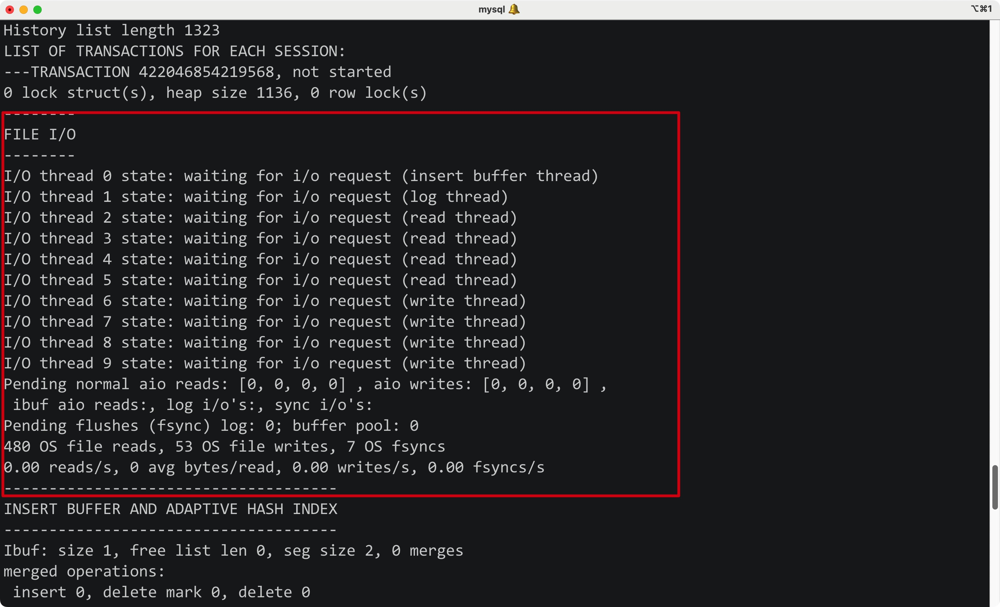
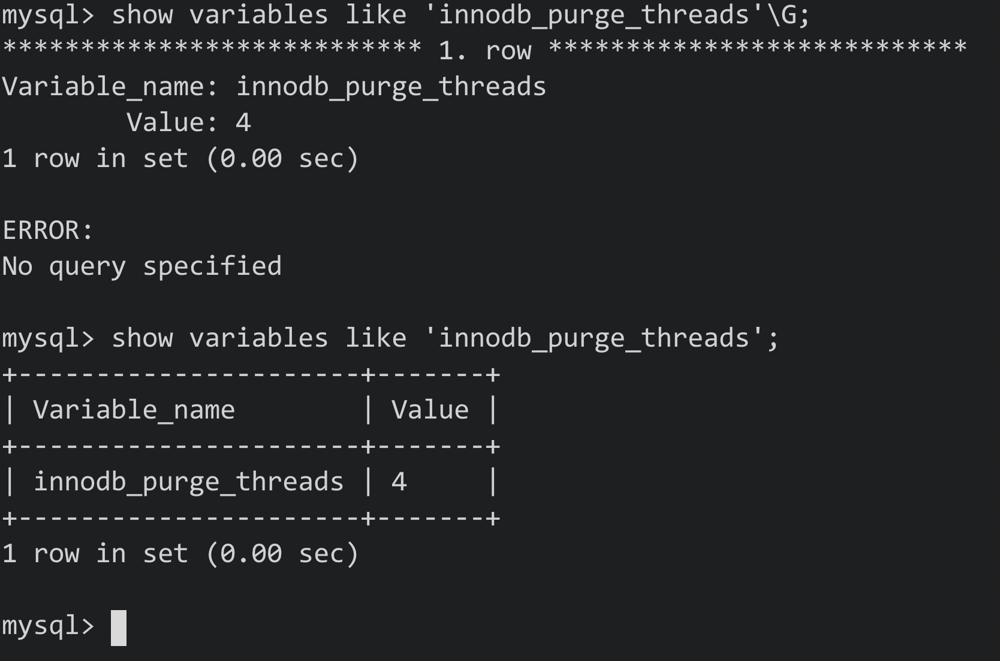

# 一、InnoDB存储引擎


## 1) 概述

- InnoDB存储引擎从MySQL5.5开始就是默认的存储引擎了
- 其是第一个完整支持事务的存储引擎(之前的BDB已经停止开发了)
- InnDB的特点是：支持MVCC、支持外键、支持一致性非锁定读(现在还支持全文本索引)

<hr>


## 2) 版本

- 从MySQL5.1开始，MySQL允许动态加载引擎，这样引擎的版本就不会和数据库绑定了

<hr>


## 3) 体系结构

InnoDB存储引擎的体系架构:


其中内存池的工作:

- 维护所有的进程/线程所访问的内部结构
- 缓存磁盘上的文件，同时缓存对磁盘上文件的修改(Buffer Pool)
- rede log缓冲


后台线程的工作:

- 刷新内存中的数据：保证缓冲池中的数据都是最近被修改的，并将完成修改的文件从缓冲池刷新到磁盘(刷盘)
- 保证异常情况下InnoDB能够恢复到正常状态

<hr>


### 1. 后台线程

- InnoDB存储引擎是个多线程的模型，所以后台有多个线程，负责处理不同的任务


1. Master Thread

Master Thread是一个非常核心的后台线程

Master Thread的作用:

- 将缓冲池中的数据异步刷新到磁盘中，保证数据一致性(脏页的刷新、合并插入、undo也回收)

<hr>


2. IO Thread

InnoDB中大量使用了AIO(Async IO)来处理写IO请求以提升性能


IO Thread的作用:

- 负责IO请求的回调(call back)的处理


通过SQL观察IO Thread:

```mysql
SHOW ENGINE INNODB STATUS\G;
```





由图可知:

- 除了前两个insert buffer和log外，之后都是读写线程
- 读写线程可根据参数innodb_read_io_threads和innodb_write_threads来设置
- 读线程的id总是小于写线程

<hr>


3. Purge Thread

事务提交后，对应的undo log可能不需要了，因此需要purge thread来回收对应的undo页

在InnoDB1.1之前，purge操作仅在InnoDB的Master Thread中进行，**之后则独立到单独的Purge Thread中去执行了**


从InnoDB1.2开始，InnoDB支持多个Purge Thread了，这样可以加快undo页的回收


查看innodb_purge_threads变量:



<hr>


4. Page Cleaner Thread

从InnoDB 1.2.x开始引入

其能将刷新脏页的工作从Master Thread中独立出来

<hr>


### 2. 内存


1. 缓冲池


