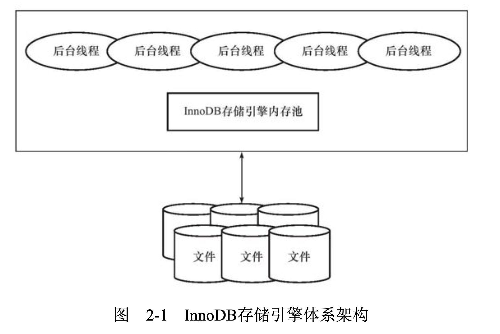

# 一、InnoDB存储引擎

## 1) 概述

- InnoDB存储引擎从MySQL5.5开始就是默认的存储引擎了
- 其是第一个完整支持事务的存储引擎(之前的BDB已经停止开发了)
- InnDB的特点是：支持MVCC、支持外键、支持一致性非锁定读(现在还支持全文本索引)

## 2) 版本

- 从MySQL5.1开始，MySQL允许动态加载引擎，这样引擎的版本就不会和数据库绑定了

## 3) 体系结构

InnoDB存储引擎的体系架构:

其中内存池的工作:

- 维护所有的进程/线程所访问的内部结构
- 缓存磁盘上的文件，同时缓存对磁盘上文件的修改(Buffer Pool)
- rede log缓冲

后台线程的工作:

- 刷新内存中的数据：保证缓冲池中的数据都是最近被修改的，并将完成修改的文件从缓冲池刷新到磁盘(刷盘)
- 保证异常情况下InnoDB能够恢复到正常状态

### 1. 后台线程

- InnoDB存储引擎是个多线程的模型，所以后台有多个线程，负责处理不同的任务

1. Master Thread

