# 十六、optimizer trace


## 16.1 简介

- 在MySQL5.6以及之前的版本中，查询优化器就是一个"黑盒"，我们只能通过EXPLAIN的方式查看最终的执行计划，而无法得知其为何做出这样的决定
- 而在之后的版本中，MySQL提供了名为optimizer trace的功能，该功能可以让用户方便的查看优化器生成执行计划的全过程

该功能的开启和关闭由系统变量optimizer_trace来决定

Eg:


**注意:**one_line值用来控制输出的格式，如果值为on，则输出都将在一行中展示，并不适合阅读，所以保持为off即可

原理:

- 打开optimizer trace功能后，**需要先执行一次想要查看优化过程的SQL语句，或者使用EXPLAIN查看一个执行计划**
- 之后只需要查看information_schema库下的OPTIMIZER_TRACE表即可

该表中有4列:

- QUERY: 表示输入的查询语句(我们自己写的SQL)
- TRACE: 表示优化过程的JSON文本
- MISSING_BYTES_BEYOND_MAX_MEN_SIZE: 如果生成过程中输出的内容超出了某个限制，则多余的文本不会显示。该字段表明剩余未显示内容的文本字节数
- INSUFFICIENT_PRIVILEGES: 表示是否有查看执行计划的权限，默认为0(有权限)，某些情况下为1(暂不关心)


## 16.2 通过optimizer trace分析查询优化器的具体工作过程

Eg:


优化过程的三个阶段:

- prepare阶段
- optimize阶段
- execute阶段

基于成本的优化主要集中在optimize阶段

- **对于单表查询来说**，主要关注的是**optimize阶段的rows_estimation过程**
- **对于多表连接查询来说**，主要关注的是**considered_execution_plans过程**

****


# 十七、InnoDB的Buffer Pool


## 17.1 缓存的作用

- 数据始终会存放在磁盘内，所以而访问页中的记录时，会将整个页的数据加载到内存中
- 之后就可以进行读写访问了，**在读写访问之后并不着急释放页对应的内存空间，而是缓存起来**，之后**再次访问时就能省下读取表的I/O开销了**


## 17.2 InnoDB的Buffer Pool


### 17.2.1 Buffer Pool的定义

- 为了缓存从磁盘中读取的页，InnoDB会在MySQL服务器启动时就申请一片连续的内存，名为"Buffer Pool"
- 该缓存大小默认为128MB，可以通过在配置文件中指定innodb_buffer_pool_size这个启动项来指定其值

Configuration:

```mysql
[server]
innodb_buffer_pool_size = byte_nunmber
```

- 其单位为字节，其值不能太小，最小为5MB(小于5MB时MySQL会强制更正)


### 17.2.2 Buffer Pool内部组成

- Buffer Pool被划分成了若干页面，**该页面大小和InnoDB表空间使用的页面大小一致，都为16KB**
- 这里我们将**这些页面称为缓冲页**
- 为了管理这些缓冲页，**InnoDB为每个缓冲页都创建了一些控制信息**

- 每个缓冲页中对应的控制信息占用的内存大小是一致的，**每个页对应的控制信息占用的每块内存被称为一个控制块，控制块与缓冲页一一对应**
- **控制块在Buffer Pool的前面，缓冲页在后面**

Image:

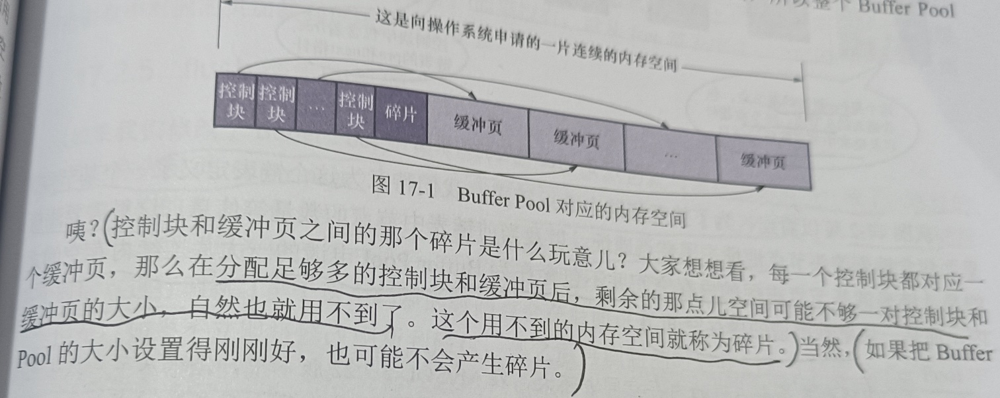

- 我们设置的innodb_buffer_pool_size并不包含控制块占用的内存空间，所以在申请连续内存时，这片空间会比innodb_buffer_pool_size大5%
- 控制块大约占缓冲页大小的5%(DEBUG模式下，其余模式下会小一些)


### 17.2.3 free链表的管理

- 在启动服务器的时候需要完成Buffer Pool的初始化，也就是先向OS申请Buffer Pool的内存空间，划分为若干控制块和缓冲页
- 此时没有任何页面从磁盘缓存到Buffer Pool中

在从磁盘读取一个页到Buffer Pool时，该放到Buffer Pool中的哪个位置呢？或者说怎么区分Buffer Pool中哪些缓存页是空闲的？

- 我们可以把所有空闲缓冲页对应的控制块作为节点，放入一个链表内，该链表称为free链表
- 刚刚初始化后的Buffer Pool中 ，所有缓冲页都是空闲的

free链表的效果图:

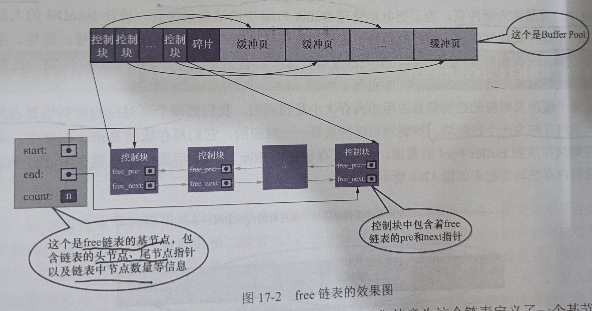

- 如图，为了管理这个free链表，定义了一个基节点，其中包含了链表的头节点/尾节点地址。以及链表中节点的数量等等
- 基节点占用的内存空间并不包含在Buffer Pool中申请的大片连续的内存空间中，其是一块单独的内存空间
- 有了基节点之后，每当需要从磁盘中加载一个页到Buffer Pool中时，就**从free链表中获取一个空闲的页**，并**将该缓冲页对应的控制块的信息填好**，并**把该控制块从free链表中移除即可**


### 17.2.4 缓冲页的哈希处理

- 之前说过缓冲页的作用: 访问某个页的数据时，将该页从磁盘加载到Buffer Pool中，如果已经在Buffer Pool中了，则直接使用即可

问题是，我们怎么知道所需的页在不在Buffer Pool中呢？难道要遍历Buffer Pool中的所有缓冲页吗？

- 之前我们定位一个页面就是通过表空间号与页号来获取页的
- 对应的，表空间号 + 页号就是一个key，缓冲控制块就是对应的value，建立一个哈希表即可


### 17.2.5 flush链表的管理

- 如果我们修改了Buffer Pool中某个缓冲页的数据，其与**磁盘上的页就不一致了**(还未同步到磁盘内)，**这样的缓冲页称为脏页**(dirty page)
- 我们可以立即将修改刷新到磁盘上的对应页，但磁盘很慢，所以**频繁向磁盘写数据会影响程序的性能**
- 所以我们**并不能立即将修改同步到磁盘上**，而是**在未来的时间点进行刷新**(暂不介绍该时间点)

不能立即将修改刷新到磁盘上，那么怎么判断哪些页是脏页呢？

- 我们不得不再创建一个存储脏页的链表，其存储所有被修改过的缓冲页对应的控制块(脏页的控制块)
- 这个**链表节点对应的缓冲页都是需要刷新到磁盘上的，所以称为flush链表**，**构造和free链表差不多**

结构图:

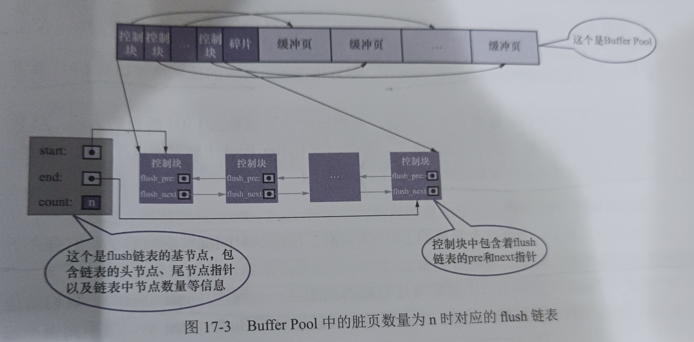

总结: 缓冲页是空闲的，那就不可能是脏页，如果其是脏页，则肯定不是空闲的


### 17.2.6 LRU链表的管理

#### 1) 缓冲区不够的窘境

Buffer Pool对应的内存大小是有限的，如果需要缓冲的页占用的内存大小超过了Buffer Pool规定的大小，则需要将旧的缓冲页从中移除，再将新的页面放进去

问题是具体移除哪些页呢？

- 我们设立Buffer Pool的初衷是想减少磁盘I/O(减少从磁盘加载页的次数)
- 假设访问次数为n，则被访问的页在Buffer Pool中的次数 / n即为命中率，我们希望命中率越高越好
- 以聊天列表为例，经常使用的就在前面，不经常使用的就在后面，所以一旦超出了容量，则只会保留很频繁使用的列表

#### 2) 简单的LRU链表

- 管理Buffer Pool其实也用的是这个道理。不过我们怎么知道哪些缓冲页最近使用频繁，哪些最近很少使用呢？
- 我们可以再创建一个链表，由于该链表是为了按照最少使用原则去淘汰缓冲页的，所以该链表可以被称为LRU链表(Least Recently Used)，当访问页面时按照如下方式处理LRU链表
  - 如果页不在Buffer Pool中，将该页从磁盘加载到Buffer Pool中的缓冲页时，就把该缓冲页对应的控制块作为节点塞到LRU链表的头部
  - 如果该页存在于Buffer Pool中，则直接把该页对应的控制块移动到LRU链表的头部
- 所以当使用到缓冲页时，则将该页调整到LRU的头部，此时尾部就是最近很少使用的缓冲页了，当Buffer Pool中的空闲缓冲页使用完时，淘汰掉链表尾部的链表即可

#### 3) 划分区域的LRU链表

上述简单的链表其实有两个问题:

- 情况1: InnoDB提供一个服务——预读，所谓预读就是InnoDB认为执行当前请求时，可能会在后面读取某些页面，于是会预先将这些页面加载到Buffer Pool中。预读细分为两种:
  1. 线性预读: 如果读取一个区中的页面**超过了系统变量"innodb_read_aheaed_threshold"**，则会**触发一次异步读取下一个区中全部的页面到Buffer Pool中的请求**，由于是异步的，所以不会影响当前工作线程的正常执行，innodb_read_ahead_threshold系统变量的值默认为56，可以在启动时调整该变量，或者在运行时使用SET GLOBAL命令修改
  2. 随机预读: 如果某个区的13个连续的页面都被加载到了Buffer Pool中，无论这些页面是不是顺序读取的，都会触发一次异步读取本区所有页面到Buffer Pool中的请求，MySQL提供了innodb_random_ahead系统变量，默认值为OFF，说明该功能默认关闭，想开启同样需要使用SET GLOBAL设置为ON即可

预读本来是好事，如果预读到Buffer Pool中的页被成功地使用到了，那么可以提高效率，但如果用不到呢？

如果预读的页很多，但都用不到，则这些预读的页就会被很快地淘汰掉，大大降低Buffer Pool的命中率

- 情况2: 当需要全表扫描时，需要访问的页面特别多，此时Buffer Pool中的缓冲页可能会全部换一次，这回影响其他查询，从而降低Buffer Pool的命中率

总结，以下两种情况会降低Buffer Pool的命中率：

- 加载到Buffer Pool中的页不一定被用到(预读)
- 非常多使用频率较低的页被同时加载到Buffer Pool中

为了解决上述问题，LRU链表被按比例分为了两个部分:

- 一部分存储使用频率很高的缓冲页，这部分链表被称为热数据，或者young区域
- 另一部分存储使用频率不是很高的缓冲页，这部分链表被称为冷数据，或者old区域

MySQL会按照比例划分LRU链表，而不是将某些节点固定在其中一个区域，节点所处的区域随时可能改变

- 两个区域的划分比例依据系统变量innodb_old_blocks_pct来确定，其指定了old区域在整个LRU中所占的比例

Eg:

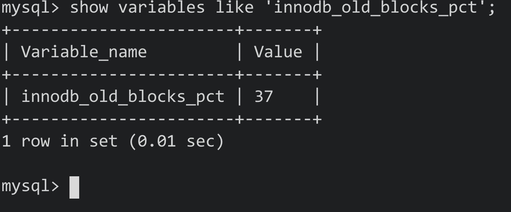

- 该变量可以通过innodb_old_blocks_pct启动项控制，或者写入配置文件:

```
[server]
innodb_old_blocks_pct=40
```

- 也可以在启动后通过SET GLOBAL命令修改

有了这两个区域后，就可以优化之前可能降低Buffer Pool命中率的情况了

- 针对预读的页面，可能不进行后续访问的优化
  - 在之前预读的基础上，磁盘上 的页首次加载到Buffer Pool上的某个缓冲页上时，该缓冲页对应的控制块会放在old区域的头部
  - 这样这些只通过预读获取了一次的页面在后续未被访问后就被移除了，这样就不会影响young区域了
- 针对全表扫描会加载大量低频页面的优化
  - 按照上一个优化方法，首次加载的页面会放在old区域，但之后又会被访问到，从而加载到young中
  - 而此时不能再使用之前的优化方法了，因为每读取其中的一条记录，就是访问一次页面，所以全表扫描就是访问该页面很多次
  - 为了解决这个问题，我们通过规定，在对处于old区域的缓冲页进行第一次访问时，先在它对应的控制块内记录下访问的时间，
  - 如果**后续再次访问的时间与上次记录的时间在某个间隔内**，则不会从old区放到young区的头部，否则就会放到young区域的头部，该间隔时间由系统变量innodb_old_blocks_time控制

Eg:

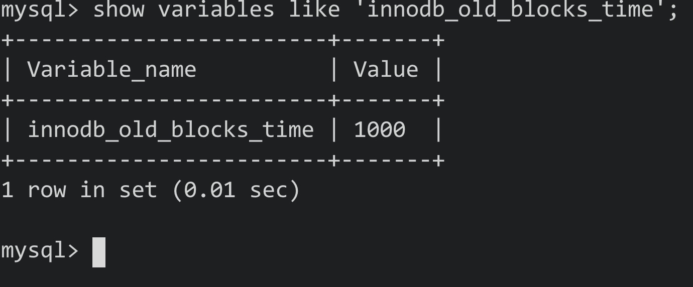

- 该值默认为1000，单位为毫秒

#### 4) 进一步优化LRU链表

- 对于young区域的缓冲页来说，每次访问其中的页都要移动到LRU链表的头部，这样的开销依然很大(这些数据都是经常访问的)
- 为了解决这个问题，我们提出一个策略比如：
  - 只有被访问的页处于后1/4位置时才移动到LRU链表的头部，这样就能降低调整链表的频率了
  - 之前的随机预读中，某个区中13个连续页面还必须都是在young区域中前1/4位置的页面

**注意：**在flush链表中的节点肯定在LRU链表中


### 17.2.7 其他链表

- 还有其他例如管理解压页的unzip LRU链表
- 管理压缩页的zip clean链表等等


### 17.2.8 刷新脏页到磁盘

**后台中有一个专门的线程负责每个一段时间将脏页刷新到磁盘中**，而不影响用户线程处理正常请求，刷新的方式主要有两种:

- **从LRU链表的冷数据中刷新一部分页面到磁盘**(old区域)
  - 后台线程会**定时从LRU链表的尾部开始扫描一些页面**，**扫描页面的数量通过系统变量innodb_lru_scan_depth控制**
  - 如果**在LRU链表内发现了脏页，则会将其刷新到磁盘**，**这种方式称为BUF_FLUSH_LRU**
- 从flush链表中刷新部分页面到磁盘
  - 后台线程也会定时**从flush链表中刷新部分页面到磁盘内**，**刷新速率取决于系统是否繁忙**
  - 这种方式称为BUF_FLUSH_LIST

有的时候，后台刷新脏页的速度很慢，此时会导致磁盘中的页需要加载到Buffer Pool时没有可用的空闲缓冲页

- 此时会尝试查看LRU链表的尾部，查看是否有可以直接从Buffer Pool中释放的未修改的缓冲页
- 如果没有则不得不将LRU链表尾部的一个脏页同步到磁盘中，这种将单个页面刷新到磁盘的刷新方式被称为BUF_FLUSH_SINGLE_PAGE

当系统繁忙时，可能出现用户线程从flush链表中刷新脏页的情况

- 在处理用户请求时刷新脏页会严重降低处理速度，这是一种迫不得已的情况


### 17.2.9 多个Buffer Pool实例

- Buffer Pool本质是一块连续的内存空间，在多线程访问时，其中的各个链表都要加锁
- 在Buffer Pool特别大且多线程并发访问量特别高时，单一的Buffer Pool会影响请求的处理速度
- 所以在Buffer Pool特别大时，可以将其拆分为多个小的Buffer Pool，每个Buffer Pool都是一个实例
- 它们有独立的内存空间，独立管理链表，并发访问时不会相互影响，从而能提高并发处理能力
- 实例的数量可以设置全局变量buffer_pool_instances值来控制，配置文件:

```
[server]
innodb_buffer_pool_instances = number
```

- 单个实例占用的内存空间大小可以通过公示算出:

```
innodb_buffer_pool_size / innodb_buffer_pool_instances
```

- 当innodb_buffer_pool_size小于1GB时，设置多个实例是无效的，数量默认为1


### 17.2.10 innodb_buffer_pool_chunk_size

- 在MySQL5.7.5之前只能在启动服务器之前通过配置innodb_buffer_pool_size来调整Buffer Pool的大小，不能在运行过程中修改
- 之后的版本中则可以在运行过程中修改了，但每次重新调整Buffer Pool大小时，都需要重新申请连续的内存，并将旧Buffer Pool中的内容复制过来，该过程及其耗时
- 所以MySQL在之后的版本中**不再一次性为某个Buffer Pool实例申请大片连续内存**，而是**以chunk为单位申请空间**
- 所以一个Buffer Pool实例其实是由若干chunk组成的，一个chunk就代表一片连续的空间，其中包含若干缓冲页和对应的控制块
- 在运行期间调整innodb_buffer_pool_size时，就以chunk为单位增加/删除空间
- innodb_buffer_pool_chunk_size的大小默认为128MB，其值只能在启动项中指定，不能在运行过程中修改
- 如果在运行中修改则会遇到和旧版本中调整Buffer Pool大小时的问题
- innodb_buffer_pool_chunk_size对应的值并不包含缓冲页对应的控制块的内存大小，每个chunk的大小要比innodb_buffer_pool_chunk_size的值要大5%(DEBUG模式)


### 17.2.11 配置Buffer Pool注意事项

- Innodb_buffer_pool_size必须是innodb_buffer_pool_chunk_size * innodb_buffer_pool_instances的整数倍
- 服务器启动时，如果innodb_buffer_pool_chunk_size * innodb_buffer_pool_instances的值大于了innodb_buffer_pool_size的值，则innodb_buffer_pool_chunk_size的值会被服务器自动配置为innodb_buffer_pool_size / ]innodb_buffer_pool_instances的值


### 17.2.12 Buffer Pool的状态信息

Syntax:

```mysql
SHOW ENGINE INNODB STATUS;
```

Eg:

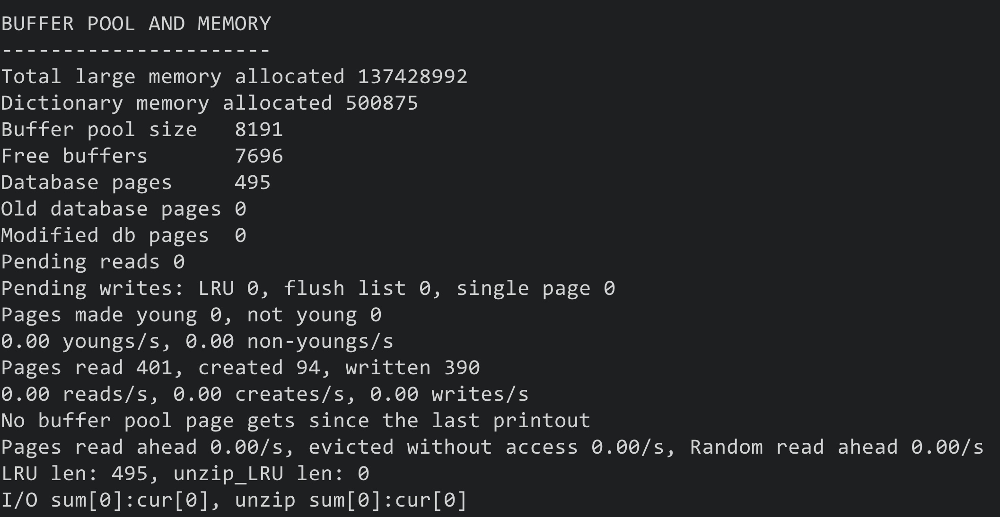

****


# 十八、事务简述

- 在现实生活中，银行转账是一个不可分割的整体性操作，要么转了，要么没转
- 而**转账操作在数据库中则对应两条SQL语句的执行**(减去一个用户的金额，增加一个用户的金额)
- 如果发生意外**使得这两条记录只执行了一条时**，这个操作就出现了问题
- 就和将页面加载到Buffer Pool中一样，修改某个页面后不会立马刷新到磁盘中，而是在之后的某个时间刷新到磁盘，但如果在刷新到磁盘之前就崩溃了呢？


## 18.1 事务的起源


### 18.1.1 原子性(Automicity)

- 在现实世界中，转账是一个不可分割的操作，要么转了，要么没转，没有中间的状态。**MySQL将这种“要么全做，要么全不做”的状态称为原子性**
- 现实世界中一个不可分割的操作在数据库中却可能对应多条不同的操作，而数据库中的操作也可能对应多个步骤(修改缓冲页后刷新到磁盘中)
- 为了保证原子性： 如果在执行过程中发生了错误，则把已经执行的操作恢复成执行之前的状态


### 18.1.2 隔离性(Isolation)

- 对于某些现实世界中状态转换对应的数据库操作来说，**在保证原子性的同时，还要保证其他状态转换不会影响到本次状态转换，这个规则称为隔离性**(类似多线程中需要保证资源同步)


### 18.1.3 一致性(Consistency)

- 存放在库内的数据需要满足一定约束才是有效的(分数有最高分，身份证号不能重复等等)

保证数据一致性的方法:

- 通过数据库本身的功能
  - 例如数据库中对某个列声明为NOT NULL，或者建立唯一索引来避免重复值的插入
  - 还支持使用CHECK语句来自定义约束

Eg:

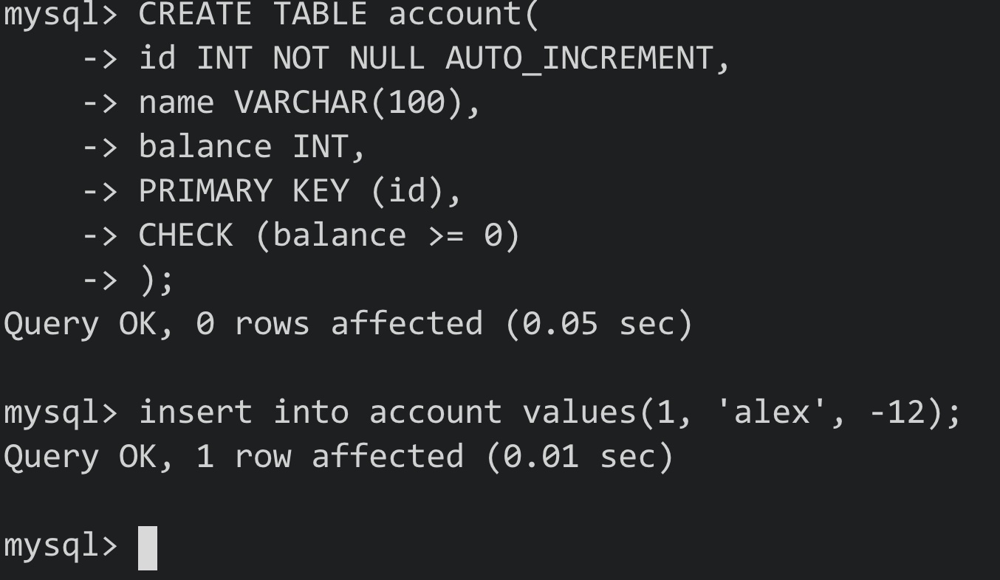

但该CHECK语法没有实际的限制作用，插入时并不会检查

- CHECK没用，但我们可以通过创建触发器来自定义一些约束条件，保证数据的一致性
- 其他更多的一致性需求需要通过业务代码来保证，而不是全部甩给MySQL

**注意：**满足原子性和隔离性不一定满足一致性，但一般在定义一致性需求时，只要满足原子性和隔离规则即可


### 18.1.4 持久性(Durability)

- 现实世界中一个状态转换完成后，这个转换的结果将永久保存，这个规则被称为持久性
- 持久性意味着转换对应修改的数据应该在磁盘中永久保留


## 18.2 事务的概念

- 现实世界转换过程中需要遵循的4个特性，统称为ACID
- 需要**保证原子性，完整性，隔离性，持久性的一个或者多个数据库操作称为事务(transaction)**

根据执行的不同阶段，事务分为5个状态:

1. 活动的(active)：操作**在执行过程中**
2. 部分提交的(partially committed)：当**事务中的最后一个操作执行完成**，操作在内存中执行，**所造成的影响并没有刷新到磁盘中**，该事务处于部分提交的状态
3. 失败的(failed)：事务**处于活动的状态或者部分提交的状态时**，**遇到某些错误而无法继续执行，或者人为停止了**，则该事务处于失败的状态
4. 中止的(aborted)：事务执行了半截而变为失败的状态，**要撤销失败事务对数据库的影响，也就是回滚**。**回滚执行完毕后，数据库恢复到了执行事务之前的状态，我们就说该事务处于中止的状态**
5. 提交的(committed)：当一个**处于部分提交的事务，将修改过的数据都刷新到磁盘后**，该**事务处于提交的状态**

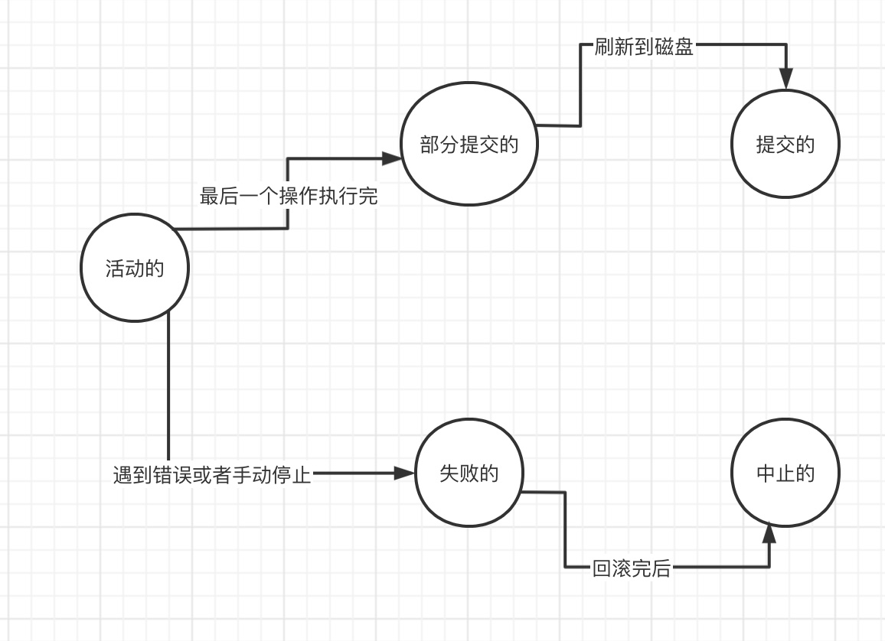

- 只有事务处于提交或者中止的状态时，一个事物的生命周期才结束
- 对于已经提交的事务来说，事务对数据库所做的修改将永久生效
- 对于处于中止状态的事务来说，事务对数据库所做的修改都会被回滚到没执行事务之前的状态

## 18.3 事务的语法

- 事务只是一些符合ACID特性的数据库操作


### 18.3.1 开启事务

开启事务有两种方法:

- BEGIN [WORK]：

WORK可省略，开始事务后，之后写的若干语句都属于这个开始的事务

Eg:

```mysql
BEGIN;
```

- START TRANSACTION:

其与BEGIN语句有同样的作用

Eg:

```mysql
START TRANSACTION
```

相较BEGIN语句，START TRANSACTION语句后可以跟修饰符:

1. READ ONLY：标识当前事务只是一个可读事务，**属于该事务的数据操作只能读取不能修改**

只读事务只是不允许修改哪些其他事务也能访问的表中的数据，可以修改临时表(其他事务不可修改)

2. READ WRITE：标识当前事务是一个读写事务，**属于该事务的数据操作可以读取也能修改数据**
3. WITH CONSISTENT SNAPSHOT：启动一致性读

总结:

如果想在START TRANSACTION后跟随多个修饰符，可以使用逗号将修饰符分开

Eg:

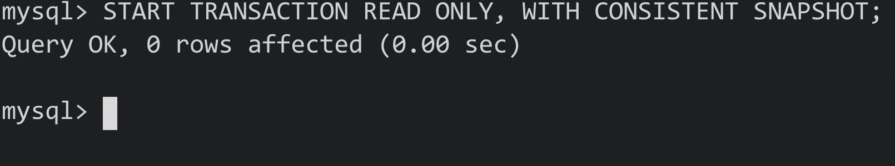

**注意：**如果事务不显式地指定访问模式，则事务访问模式默认为读写模式


### 18.3.2 提交事务

Syntax:

```mysql
COMMIT [WORK];
```

COMMIT语句代表提交了一个事务，WORK可有可无

Eg:

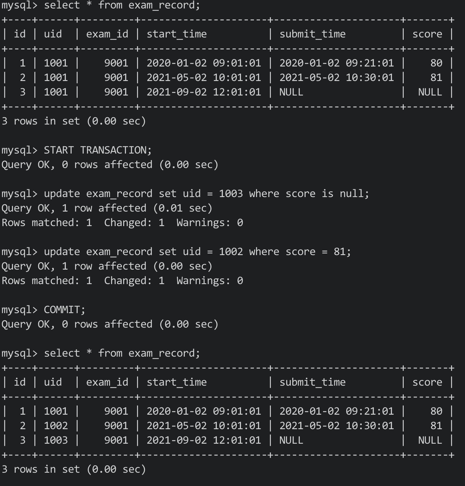


### 18.3.3 手动中止事务

通过ROLLBACK可以将数据恢复到事务中的语句执行之前的状态:

Syntax:

```mysql
ROLLBACK [WORK]
```

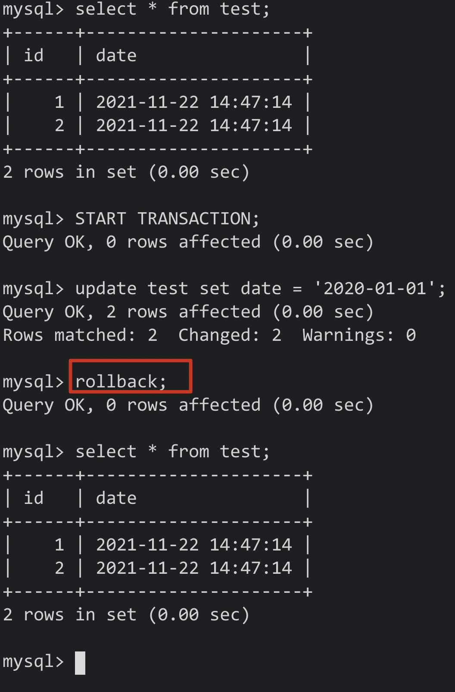

注意:

ROLLBACK只是我们手动回滚事务时使用的，如果事务执行时遇到错误而无法继续执行，大部分情况下会回滚失败的情况(死锁等)


### 18.3.4 支持事务的存储引擎

并不是所有的引擎都支持事务，**目前只有InnoDB和NDB支持**

如果**表使用的存储引擎不支持事务，则对改变所做的修改不能回滚**


### 18.3.5 自动提交

系统变量autocommit，用来自动提交事务

Eg:

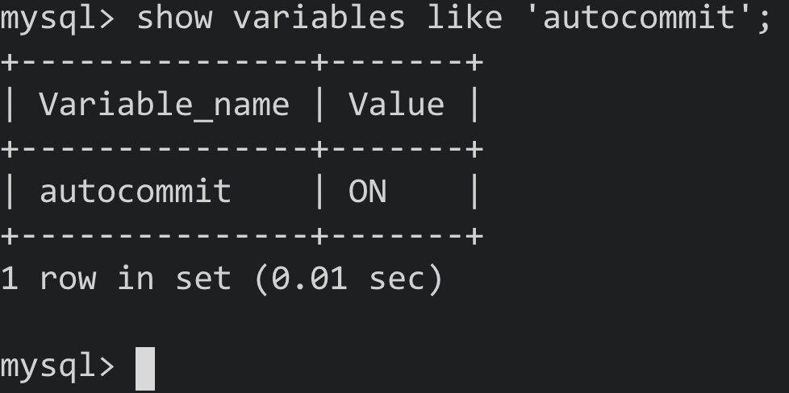

其默认为ON

**在默认情况下，如果不显式使用START TRANSACTION或者BEGIN开始事务**，则**每条语句都是一个独立的事务**

关闭自动提交的方法:

- 显式地使用START TRANSACTION或者BEGIN开启一个事务，在事务提交/回滚前，会暂时关闭自动提交
- 将该变量设置为OFF

Eg:

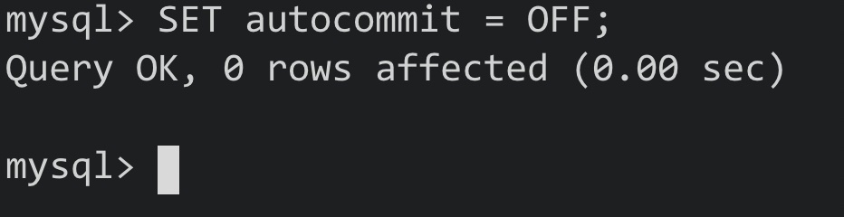

关闭后，写的语句都属于同一个事务，直到我们显式地写出COMMIT语句提交事务，或者显式地写出ROLLBACK回滚事务


### 18.3.6 隐式提交

当使用START TRANSACTION或者BEGIN语句开始了一个事务之后，或者将autocommit修改为OFF之后，事务就不会自动提交了

但我们输入的一些语句会导致之前的事务悄悄地提交，这种因为某些特殊语句导致事务提交的情况称为隐式提交

导致隐式提交的语句:

- 定义/修改数据库对象的定义语言

数据库对象指的是数据库、表、视图、存储过程等等，当使用CREATE、ALTER、DROP等语句修改这些数据库对象时，就会隐式提交前面语句所属的事务

Eg:

```mysql
BEGIN;

SELECT...;
UPDATE...;

CREATE TABLE... // 此语句就会将之前的事务隐式提交
```

- 隐式使用/修改MySQL库中的表

使用ALTER USER、CREATE USER、DROP USER、GRANT、RENAME USER、REVOKE、SET PASSWORD等语句时，都会隐式地提交之前的事务

- 事务控制/关于锁定的语句

当一个事务还未提交/还没回滚时，又开启了一个新的事务，此时会隐式提交上一个事务

使用LOCK TABLES、UNLOCK TABLES等关于锁定的语句时，也会隐式提交上一个事务

- 加载数据的语句

使用LOAD DATA向数据库中批量导入数据时，也会隐式提交之前的事务

- 关于MySQL复制的语句

使用START SLAVE、STOP SLAVE、RESET SLAVE、CHANGE MASTER TO等

- 其他

ANALYZE TABLE/CACHE INDEX/CHECK TABLE/FLUSH/LOAD INDEX INTO CACHE/OPTIMIE TABLE/REPAIR TABLE/RESET


### 18.3.7 保存点

- 如果发现事务中某个语句出错了，直接回滚会重置所有的语句
- 为了方便控制回滚的位置，我们可以设置保存点(savepoint)，我们可以通过ROLLBACK TO语句指定回滚的位置，而不是回滚所有操作

设置回滚点:

```mysql
SAVEPOINT savepoint_name;
```

回滚到指定的回滚点:

```mysql
ROLLBACK TO savepoint_name;
```

Eg:

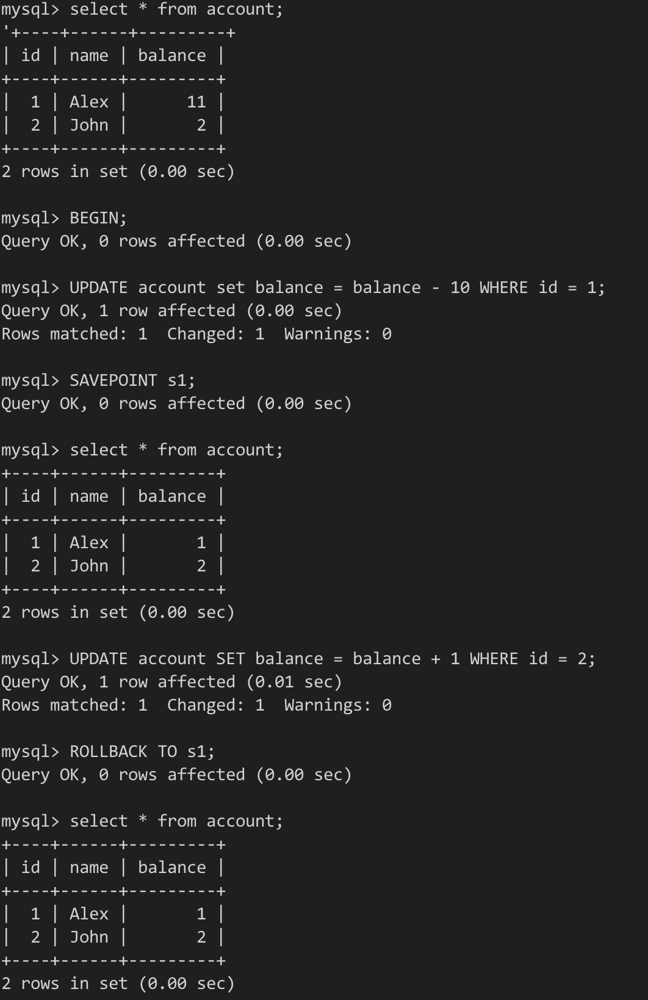

****

# 十九、redo日志

- 在访问页面时，**需要将页面加载到内存中，才能进行访问**
- 在事务中，**就算系统崩溃了，已经提交的事务对库所做的修改也不能丢失，即持久性**
- 如果只将Buffer Pool中的页面进行了修改，**还未刷新脏页**，此时**如果事务提交出现了错误内存中的数据丢了**，那么事务所做的修改也丢失了，这是不应该的


## 19.1 redo日志的定义

如何保证持久性？

一个简单的方法就是**在事务还没有提交完成前，将事务修改的所有页面都刷新到磁盘中**，但这种方法有一些问题:

- 有时我们**只是修改了页面中的某个字节**，但InnoDB是以页为单位进行磁盘I/O的，所以**在事务提交时不得不将一个完整的页面从内存刷新到磁盘中**。因为一个字节就要刷新16KB(一个页的大小)到磁盘上，太浪费了
- **事务修改的页面是随机的**，那么将这些随机的页面从Buffer Pool中刷新到磁盘上时，**会进行很多的随机I/O**

我们的目的是：

让已经提交的事务对数据库的修改永久有效，即使系统崩溃，之后也应该能够将修改恢复

所以，我们不需要将事务修改的页面都刷新到磁盘中，只需要记录一下修改的内容即可，比如修改偏移量

如此一来，在事务提交的时候，只需要将这些修改记录写入到磁盘即可，系统恢复后根据这些记录来恢复数据

在系统崩溃而重启时需要按照上述步骤重新更新数据页，**所以上述日志也被称为重做日志(redo log)**

将redo日志刷新到磁盘比起将事务修改的内存中的页刷新到磁盘中的好处有:

- redo日志占用空间小，只需要存储更新的值
- redo日志是顺序写入磁盘中的，在执行事务时，**每执行一条语句，就可能产生若干redo日志**，这些**日志都是按照产生的顺序写入到磁盘中的，也就是顺序I/O**


## 19.2 redo日志格式

redo日志本质上就是记录了事务对数据库进行的修改

而针对事务所做的不同修改场景，redo日志有多种类型，但绝大部分类型的redo日志都有如下的通用结构:

<table border="1" cellspacing="10">
  <tr>
    <th>type</th>
    <th>space ID</th>
    <th>page number</th>
    <th>date</th>
  </tr>
</table>

各部分解释:

- type: 这条redo日志的类型
- space ID: 表空间ID
- page number: 页号
- data: 这条redo日志的具体内容


### 19.2.1 简单的redo日志类型

引出日志类型

如果没有为表显式地定义主键且没有定义不为null的唯一键(UNIQUE)，**那么InnoDB会自动为表添加一个名为row_id的隐藏列作为主键**，为该隐藏列进行赋值的方式:

- server会**在内存中维护一个全局变量**，每当**向某个包含row_id隐藏列插入一条记录时**，就会**将这个全局变量的值当作新纪录的row_id，并将这个全局变量自增1**
- 每当这个**全局变量的值为256的倍数时**，就会将该变量的值**刷新到系统表空间页号为7的页面中一个名为Max Row ID的属性中**
- 系统启动时，会将这个Max Row ID属性加载到内存中，并将值加上256后赋值给全局变量

Max Row ID这个属性**占用的存储空间为8字节**。所以当事务向包含row_id隐藏列表中插入数据时，**并且该新纪录的row_id值为256的倍数时**，**会向系统表空间号为7的页面对应的偏移量中写入8字节的值**

我们需要将对这次页面的修改以redo日志的形式记录下来，这样即使系统崩溃后，也能通过日志将页面恢复到崩溃前的状态

这种对页面的修改是极其简单的，**redo日志中只需要记录一下在某个页面中的某个偏移量处的修改的字节数、具体修改的内容即可，这种极其简单的redo日志称为物理日志**

根据在页面中写入的数据量，划分了几种不同的redo日志类型

- MLOG_1BYTE(type字段值为1): 表示在页面中某个偏移量处写入1字节的redo日志类型
- MLOG_2BYTE(type字段值为2): 表示在页面中某个偏移量处写入2字节的redo日志类型
- MLOG_4BYTE(type字段值为4): 表示在页面中某个偏移量处写入4字节的redo日志类型
- MLOG_8BYTE(type字段值为8): 表示在页面中某个偏移量处写入8字节的redo日志类型
- MLOG_WRITE_STRING(type字段值为30): 表示在页面中某个偏移量处写入一个字节序列

我们之前提到的Max Row ID属性实际占用8字节存储空间，所以在修改对应 页面中的属性时，会记录一条类型为MLOG_8BYTE的redo日志

结构如下:

| type | space ID | page number | offset(页面偏移量) | 具体数据 |
|:----:|:--------:|:-----------:|:-------------:|:----:|

- 其余1BYTE/2BYTE/4BYTE类型的redo日志结构与MLOG_8BYTE的日志结构类似，只不过具体数据包含的字节数不同而已
- MLOG_WRITE_STRING比较特殊，其需要写入一个字节序列，因为不能确定写入的具体数据占用多少字节，所以需要在日志中添加一个len字段

| type | space ID | page number | offset | len(具体数据占用的字节数) | 具体数据 |
|:----:|:--------:|:-----------:|:------:|:---------------:|:----:|


### 19.2.2 复杂的redo日志类型

执行语句时，可能会修改非常多的页面，包括系统数据页面和用户数据页面(用户数据页面就是聚簇索引和二级索引对应的B+树)。

例如一条INSERT语句除了向B+树中插入数据外，还有可能更新Max Row ID的值，但用户更关心对B+树的更新：

- 表中有多少索引，那么一条INSERT语句就可能更新多少颗B+树
- 对于某颗B+树而言，既可能更新叶子结点的页面，也可能更新内节点的页面，还可能创建页面

语句执行时，INSERT语句对页面的所有修改都会保存在redo日志中。需要记录的不只是某个位置偏移量增加的数据(实际数据改动)，每个index page页面中还需要更新File Header，Page Header，Page Directory等部分，所以在插入数据时，还有其他地方也会跟着更新:

- Page Directory中的槽信息(slot)
- Page Header中的各种页面统计信息，比如槽的数量，未使用的空间最小地址等等，PAGE_N_HEAP等等
- Index Page中的记录列按照单向链表的方式连接，每插入一条记录，还需要更新上一条记录的记录头信息中的next_record属性来维护这个单链表

猜想：

说白了，将一条记录插入到一个页面中时，需要修改的地方很多，如果需要使用简单的物理redo日志记录这些修改，有两种方案:

- 方案1: 在每处修改的地方都记录一条redo日志

这样做的话，**因为修改的地方太多**，**所以redo日志占用的空间都要比整个页面占用的空间多**

- 方案2: 将整个页面**第一个被修改的字节到最后一个被修改的字节之间所有数据**当作一条物理redo日志中的具体数据

这样做的话在第一个和最后一个字节之间，有许多没有被修改过的数据，很浪费空间

解决：

为了高效地记录这些修改到redo日志中，提出了一些新的redo日志类型

- MLOG_REC_INSERT(type为9):

插入一条使用非紧凑行格式记录时(REDUNDANT)，redo日志的类型

- MLOG_COMP_REC_INSERT(type为38):

表示在插入一条使用紧凑行格式记录时(COMPACT，DYNAMIC，COMPRESSED)，redo日志的类型

- MLOG_COMP_REC_CREATE(type为58):

表示在创建一个存储紧凑行格式记录的页面时(COMPACT，DYNAMIC，COMPRESSED)，redo日志的类型

- MLOG_COMP_REC_DELETE(type为42):

表示在删除一条使用紧凑格式记录时(COMPACT，DYNAMIC，COMPRESSED)，redo日志的类型

- MLOG_COMP_LIST_START_DELETE(type为44):

从某条给定记录开始删除页面中一系列使用紧凑行格式记录时(COMPACT，DYNAMIC，COMPRESSED)，redo日志的类型

- MLOG_COMP_LIST_END_DELETE(type为43):

与上一个类型的redo日志对应，表示删除一系列记录，直到MLOG_COMP_LIST_END_DELETE类型的redo日志对应的记录为止

**注：**如果每删除一条记录就写一条redo日志，那么效率会很低，而后两种redo日志可以很大程度上减少创建redo日志的数量

- MLOG_ZIP_PAGE_COMPRESSED(type为51):

表示在压缩一个数据页时，redo日志的类型

这些复杂redo日志既包含物理层面的意思，还包含逻辑层面的意思:

- 从物理层面看，这些日志指明了对哪个表空间的哪个页进行修改
- 从逻辑层面看，在系统崩溃重启后，**不能直接根据这些日志恢复数据**，而是**需要调用一些实现准备好的函数**，**执行完函数后才能恢复成系统崩溃前的样子**

以MLOG_COMP_REC_INSERT类型的redo日志为例，先看一看它的结构:

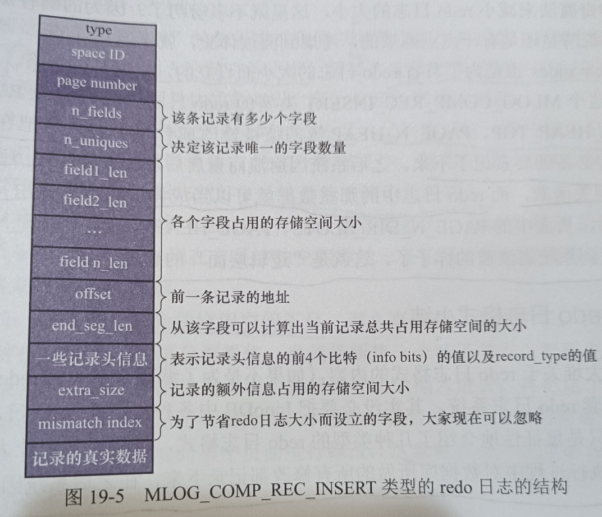

该结构的一些地方需要注意:

- n_uniques:

在一条记录中，需要几个字段的值才能保证记录的唯一性(对于二级索引记录需要两个字段->索引列包含的列数 + 主键列包含的列数)，唯一二级索引也可能为NULL值，则此时的n_uniques依然为索引列 + 主键列包含的列数

- field1_len~field_len:

代表该记录若干字段占用存储空间的大小，无论该字段的类型是固定长度还是可变长度，该字段占用的存储空间都要写入到redo日志中

- offset:

代表该记录前一条记录在页面中的地址。因为每条记录的记录头中都包含一个名为next_record的属性，插入新纪录时，需要修改前一条记录的next_record属性

- end_seg_len:

一条记录其实由额外信息和真实信息组成，这两部分的总大小就是一条记录占用存储空间的总大小。

通过end_seg_len可以计算出一条记录占用存储空间的总大小，写redo日志非常繁琐，所以**为了减少redo日志本身占用的存储空间，需要一些复杂度的算法，所以不会直接存储总空间大小**

- mismatch_index: 也是为了节省redo日志的大小而设立的(可忽略)

日志其实只记录了修改页面所需的必备要素，系统崩溃重启后，服务器会调用向某个页面进行修改的函数

而redo日志中的数据就是这个函数的参数，调用完成后，页面中的值就恢复了


### 19.2.3 redo日志小结

- 如果不是为了编写redo日志解析工具或者日志系统，则不需要深刻研究redo日志的结构
- redo日志会把事务在执行过程中对数据所做的所有修改都记录下来，在系统重启后，会将事务所做的修改都恢复
- redo日志还经过了一定的压缩处理


## 19.3 Mini-Transaction


### 19.3.1 以组的形式写入redo日志

SQL语句执行后会更新聚簇索引/二级索引对应的B+树中的页，但这些修改都发生在Buffer Pool中，所以需要记录下对应的redo日志

**执行SQL产生的日志被划分为了若干不可分割的组，例如**:

- 更新Max Row ID属性时产生的redo日志为一组，不可分割
- 向聚簇索引对应的B+树页面插入一条记录时产生的redo日志为一组，不可分割
- 向某个二级索引对应的B+树页面插入一条记录时产生的redo日志为一组，不可分割
- 其他。。。

不可分割:

向索引对应的B+树中插入记录为例

向B+树中插入记录之前，需要先定位记录应该被插入的叶子节点数据页，定位后有两种情况:

1. **剩余数据页空间充足**，足够容纳这条记录，那么我们直接将该记录插入到这个数据页中，并记录一条MLOG_COMP_REC_INSERT类型的redo日志即可。**此种情况称为乐观插入**
2. **剩余数据页空间不足**，那么需要页分裂，这样就会生产许多redo日志。**此种情况称为悲观插入**

对于记录的插入过程应该是原子性的，不能插入一半就停止

而记录redo日志的过程中，**如果只记录了一部分，那么在崩溃重启后会将索引恢复到一种不确定的状态，这是不应该的**，因此规定**在执行需要保证原子性的操作时，必须以组的形式来记录redo日志**，对于**组内的日志，要么全部恢复，要么都不恢复**，解决方法如下:

- 一些需要保证原子性的操作会生成多条redo日志，比如一次悲观插入。

如何保证redo日志都在一个组里？

在**同组的最后一条redo日志后面加上一个特殊类型的redo日志**，该类型**日志名称为MLOG_MULTI_REC_END**，其只有一个type字段(31)

某个需要保证原子性操作对应产生的一系列redo日志必须以一条类型为MLOG_MULTI_REC_END的redo日志结尾，如图:

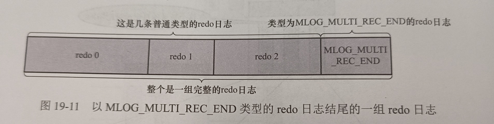

这样在系统崩溃重启后，**只有解析到类型为MLOG_MULTI_REC_END的redo日志时，才会认为解析了一组完整的redo日志，才会进行恢复**，否则会放弃前面解析的所有redo日志

- 有些需要保证原子性的操作只生成一条redo日志，例如更新Max Row ID属性的操作

表示redo日志类型只需要7个bit，上述的type字段占用了一个bit，**没有type字段的日志说明原子操作只产生单一redo日志**


### 19.3.2 Mini-Transaction概念

**对底层页面进行一次原子访问的过程称为Mini-Transaction，简称为MTR**

一个MTR可以包含一组redo日志，恢复时将一组redo日志作为一个不可分割的整体来处理

事务，语句，MTR，redo日志的关系:

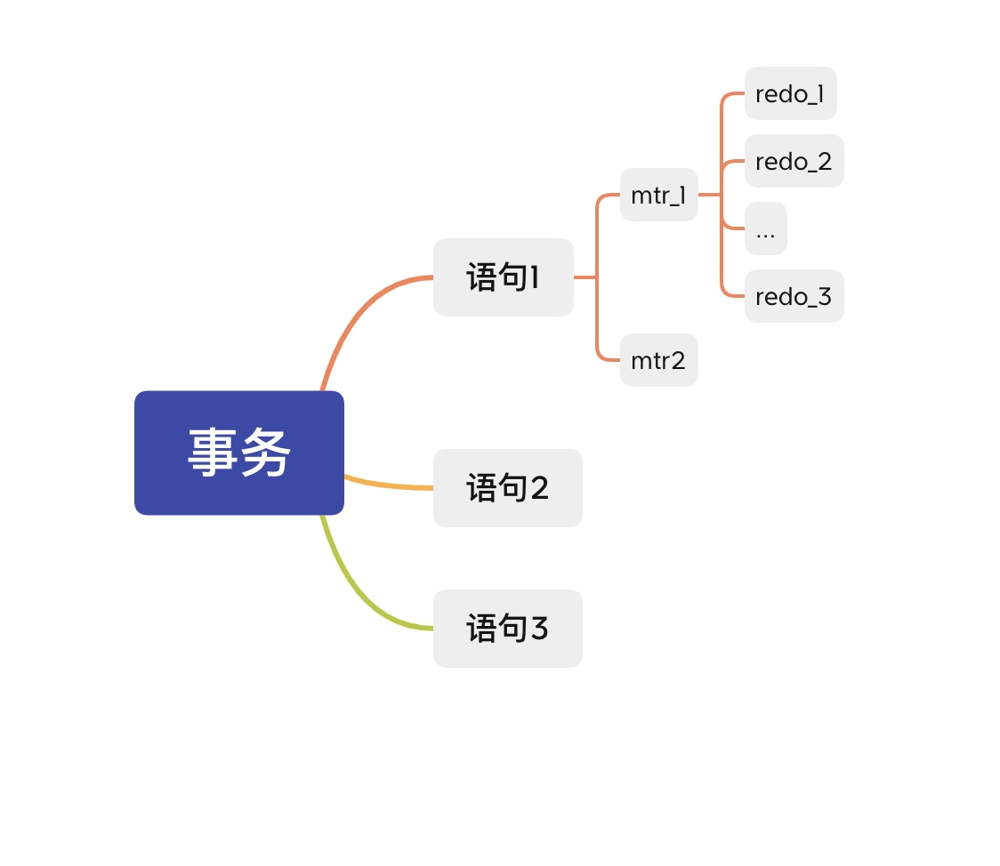


## 19.4 redo日志的写入过程


### 19.4.1 redo log block

为了管理redo日志，一个MTR生成的redo日志都放在了大小为512byte的页面里，我们将存储redo日志的页称为block

一个redo log block的结构如下:

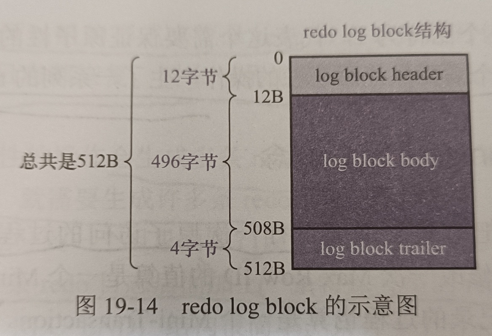

在一个redo log block中，只有log block body是存储真正的redo日志的(占用496字节)

其余的log block header和log block trailer存储的是一些管理信息，如图:

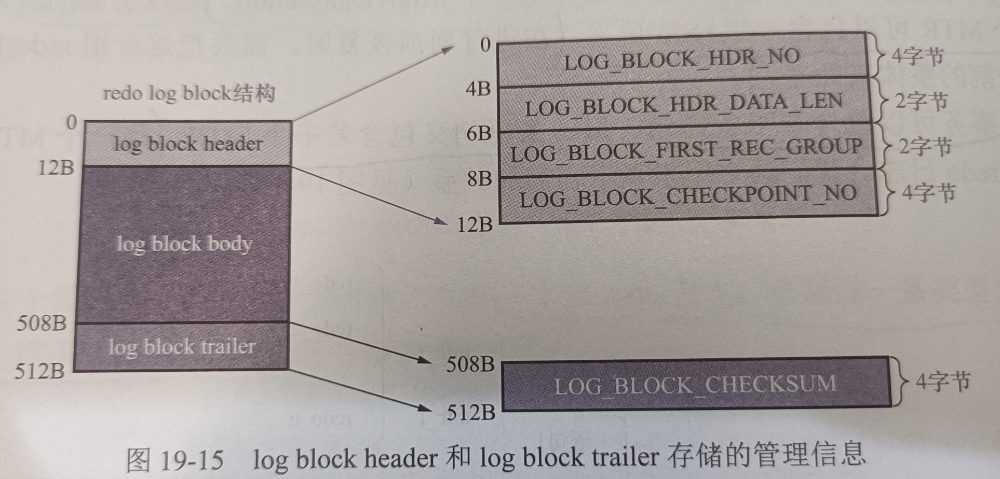

log block header中几个属性的意思:

- LOG_BLOCK_HDR_NO: **表示block的编号值**(**每个block都有一个大于0的唯一编号**)
- LOG_BLOCK_HDR_DATA_LEN: 表示**block中已经使用了多少字节**，初始值为12(由图，其从第12个字节处开始)，如果log block body被写满，则该属性的值为512
- LOG_BLOCK_FIRST_REC_GROUP: **一条redo日志也被称为一条redo日志记录**。一个MTR会生成多条redo日志记录，这个**MTR生成的这些redo日志记录被称为一个redo日志记录组**。**该值就是block中第一个MTR生成的redo日志记录组的偏移量**。
- LOG_BLOCK_CHECKPOINT_NO: 表示checkpoint的序号(**后面介绍**)
- LOG_BLOCK_CHECKSUM: 表示block的校验值，用于正确性校验(**暂时不关心**)


### 19.4.2 redo日志缓冲区

之前为了解决磁盘写入满的问题而引入了Buffer Pool，同理，写入redo日志时也不能直接写到磁盘中

实际上在server启动时向系统申请了一大片连续的内存空间，称为"redo log buffer"，简称为log buffer

该空间被分成若干连续的redo log block，如图:

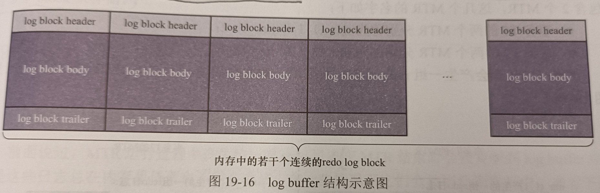

- 可以通过innodb_log_buffer_size来指定log buffer的大小，该启动项的默认值为16MB(MySQL5.7.22)


### 19.4.3 redo日志写入log buffer

向log buffer中**写入redo日志的过程是顺序的**，也就是先在前面的block中写，该block空间用完后再写在后面的block中

往log buffer中写日志时的问题: 写在哪个block的哪个偏移量处？

**通过名为"buf_free"的全局变量，该变量指明后续写入的redo日志应该写在log buffer中的哪个位置处**，如图:

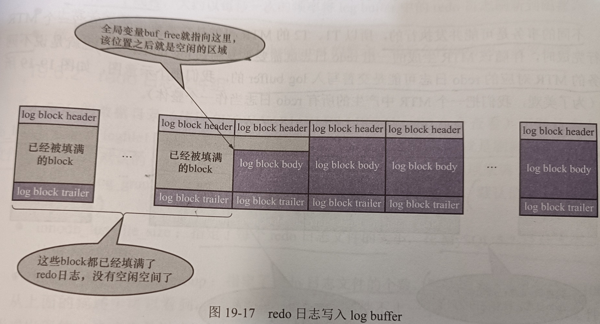

一个MTR执行时可能会生成若干条redo日志，而这些redo日志都是不可分割的组，所以**不是每生成一条redo日志就插入到log buffer中，而是将每个MTR运行时产生的日志暂存在一个地方；**

**当MTR结束时，将过程中产生的一组redo日志全部复制到log buffer中**


不同的事务可能是并发执行的，其对应MTR生成的redo日志就需要交替写入到log buffer中，示意图:

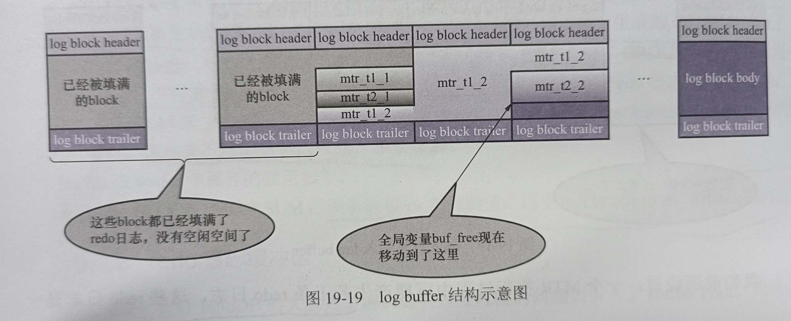

可见不同MTR产生的redo日志占用的存储空间不同


## 19.5 redo日志文件


### 19.5.1 redo日志刷盘时机

MTR运行中产生的一组redo日志会在MTR结束后会被复制到log buffer中

但在一些情况下，这些日志会被刷新到磁盘中:


- log buffer空间不足

log buffer的空间是有限的(由innodb_log_buffer_size限定)，当log buffer中写入的日志量占满了50%后，就需要将这些日志刷新到磁盘中

- 事务提交时

有了redo日志后，可以不把修改过的Buffer Pool页面立即刷新到磁盘中，但为了持久性，必须把页面修改后对应的redo日志刷新到磁盘，否则事务所做的修改

- 后台线程

**后台有一个线程**会**以每秒一次的频率将log buffer中的redo日志刷新到磁盘中**

- 正常关闭服务器时
- 做checkpoint时(之后介绍)


### 19.5.2 redo日志组


MySQL数据目录中默认有两个名为ib_logfile0和ib_logfile1两个文件

**log buffer中的日志默认情况下会刷新到这两个磁盘中**


可以通过几个**启动选项**来调节:

- innodb_log_group_home_dir

指定了redo日志所在的目录，默认值就是当前的数据目录

- innodb_log_file_size

指定了每个redo日志文件的大小

- innodb_log_files_in_group

指定了redo日志的数量，默认为2，最大100


磁盘上的redo日志文件不止一个，而是以一个日志文件组的形式出现。这些文件以"ib_logfile"的形式命名

将redo日志写入日志组时，从ib_logfile0开始写起

如果写到最后一个文件后写满了，则会重新转到ib_logfile0继续写

Eg:


redo日志的总大小为: innodb_log_file_size * innodb_log_files_in_group

为了避免数据被覆盖，所以提出了checkpoint的概念


### 19.5.3 redo日志文件格式

log buffer本质上是一片连续的内存空间，被划分成若干512字节大小的block。

将log buffer中的redo日志刷新到磁盘的本质就是将block的镜像写入到磁盘中的日志文件中，所以磁盘中的redo日志其实也是由若干512字节大小的block组成


redo日志组中，每个文件的大小，格式都一样，都由两个部分组成

- 前2048字节(4个block): 用来存储一些管理信息
- 从第2048个字节往后的字节用来存储log buffer中的block镜像


redo日志前四个block的格式:

| log file header | checkpoint1 | useless | Checkpoint2 |
| :-------------: | :---------: | :-----: | :---------: |


- log file header:

描述该redo日志文件的一些整体属性

Eg:

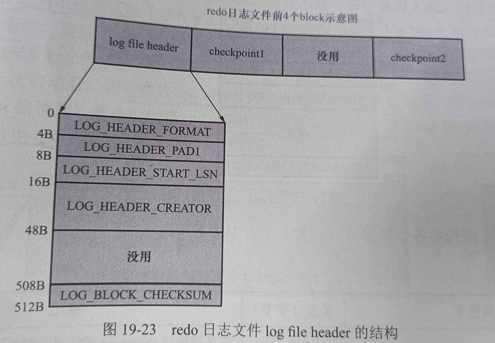


log file header结构中各个属性的具体含义见表:

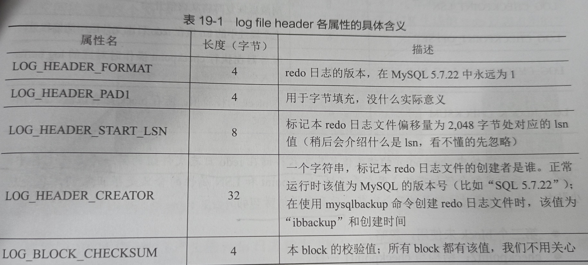

LSN之后会讲


- check point1:

记录关于checkpoint的一些属性

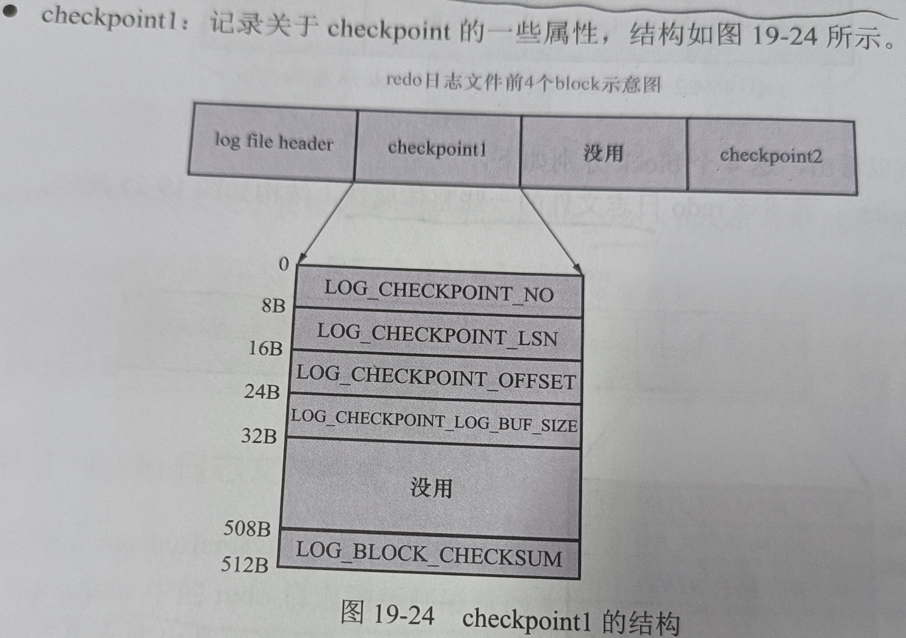


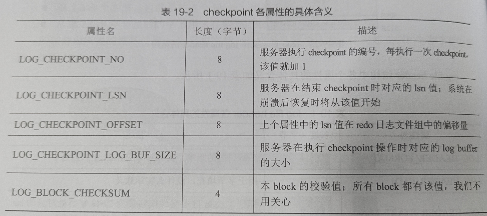

**注：**checkpoint的相关信息其实只存储在redo日志文件组的第一个日志文件中


- 第三个block未使用(忽略)
- checkpoint2: 结构与checkpoint1相同


## 19.6 log sequence number(LSN)

MySQL使用一个名为lsn(log sequence number)的全局变量来**记录当前总共已经写入到log buffer中的redo日志量**

**注意：**初始的lsn值为8704(未写入任何一条redo日志时)


向log buffer中写入redo日志时，是**以MTR生成的一组redo日志为单位写入的**，而且是**写在了block中的log block body位置**

但lsn计算时其实将block中的log block header和log block trailer部分都统计在内了，例如：


- 在初始化log buffer的时候，buf_free(指定redo日志在log buffer中的写入位置)会指向第一个block的偏移量为12字节，lsn值也会跟着增加12(此时还未写入任何redo日志)

如图:


- 如果某个MTR产生的一组redo日志占用的存储空间较小，那么lsn增长的量就是该MTR产生的redo日志占用的字节数

如图:

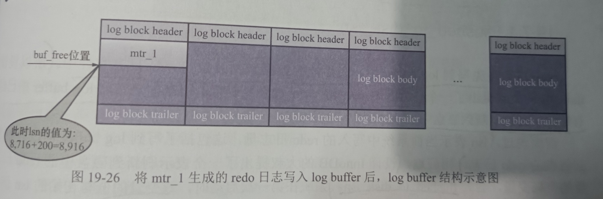


- 如果某个MTR产生的一组redo日志占用的存储空间很大，而一个block的剩余空间不够，需要使用多个block的空间
- 此时lsn的增长量中就包含了中间block的log block header和log block trailer的字节数

如图:

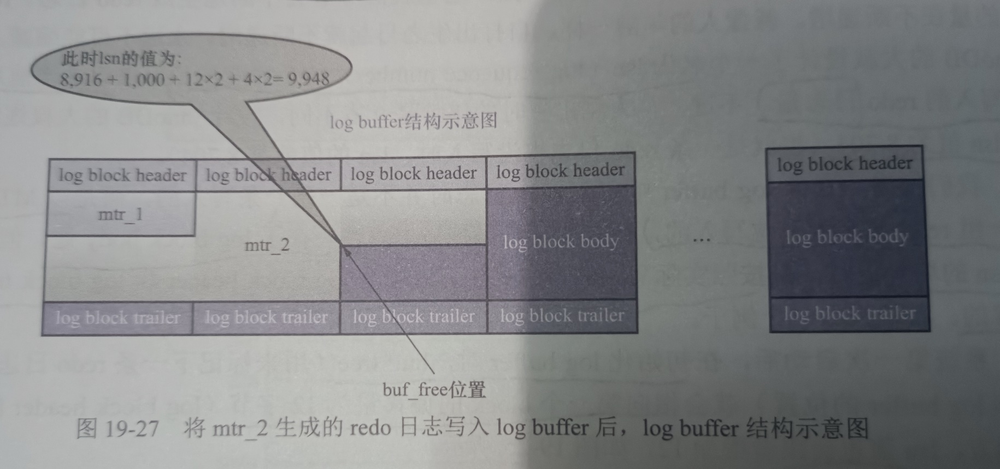

其中的12和4就是log block header与log block trailer占用的空间


总结：lsn为对应的值时，就会对应一组MTR生成的redo日志

**重点**：**所以每一组由MTR生成的redo日志都有一个唯一的lsn值与之对应；lsn值越小，则说明redo日志产生得越早**


### 19.6.1 flushed_to_disk_lsn

redo日志先写到log buffer中，之后才会被刷新到磁盘的redo日志文件中

全局变量"buf_next_to_write"**用来标记当前log buffer中哪些日志被刷新到了磁盘中**

如图:

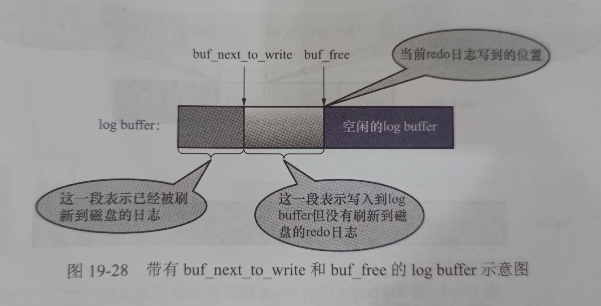


全局变量flushed_to_disk_lsn**表示刷新到磁盘中的redo日志的数量**

因为redo日志首先会被写入到log buffer中，所以lsn的值会增加，但**redo日志并不会马上刷新到磁盘中**，所以**flushed_to_disk_lsn与lsn的值会拉开差距**

例如：

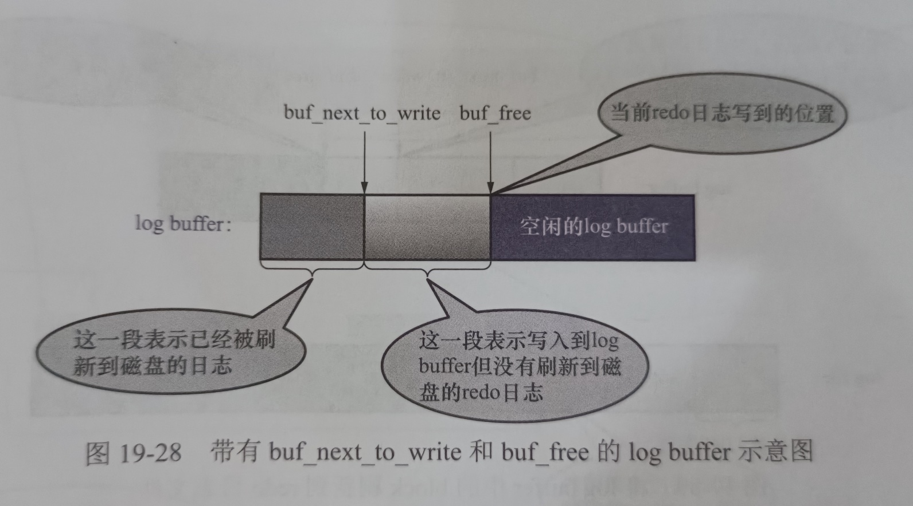


综上：当有新的redo日志写入到log buffer中时，lsn的值会增长，但flushed_to_disk_lsn不变；当有log buffer中的日志被刷新到磁盘中时，flushed_to_disk_lsn的值就会增长，如果lsn和flushed_to_disk_lsn值相同，说明log buffer中的所有redo日志都刷新到了磁盘中


### 19.6.2 lsn值和redo日志文件组中偏移量的关系

- 因为lsn值代表系统写入的redo日志量的和，一个MTR产生多少redo日志，lsn的值就增加多少(有时需要增加上log block header和log block trailer的大小)。
- 因此可以计算出一个lsn值在redo日志文件组中的偏移量

如图:

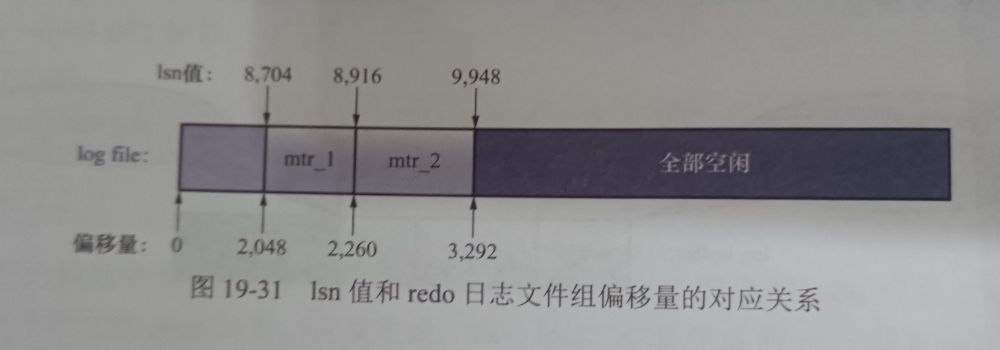


- 初始化后lsn的值为8704，对应redo日志文件组的偏移量为2048


### 19.6.7 flush链表的lsn

在一个MTR结束后，有了非常重要的事：把MTR执行过程中修改的页面加入到Buffer Pool的flush链表中


重温flush链表:

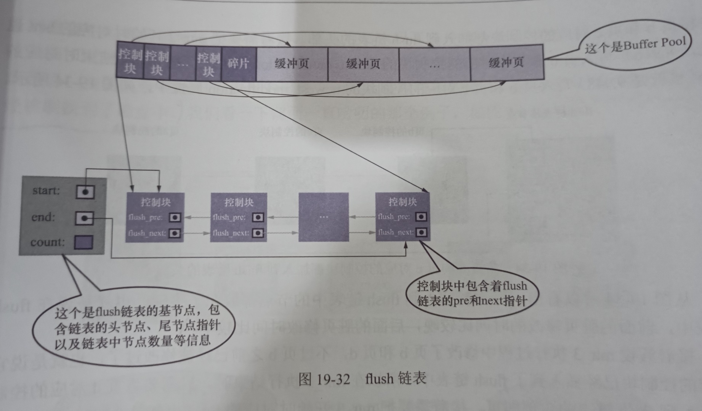

定义：

当**修改某个已经加载到Buffer Pool中的页面时**，会**将页面对应的控制块插入到flush链表的头部**，之后再修改该页面时，则不再插入

所以flush链表中的脏页是按照页面第一次修改的时间进行排序的(第一次插入到flush的头部)

此时会在缓冲页对应的控制块中记录两个页面修改时间的属性:

- oldest_modification: **第一次修改Buffer Pool中某个缓冲页时**，**将修改该页面的MTR开始时的lsn写入到这个属性中**
- newest_modification: 每次修改页面，都会将该次修改对应MTR结束后对应的lsn值写入到这个属性中(表示最近一次修改后对应的lsn值)


例子：

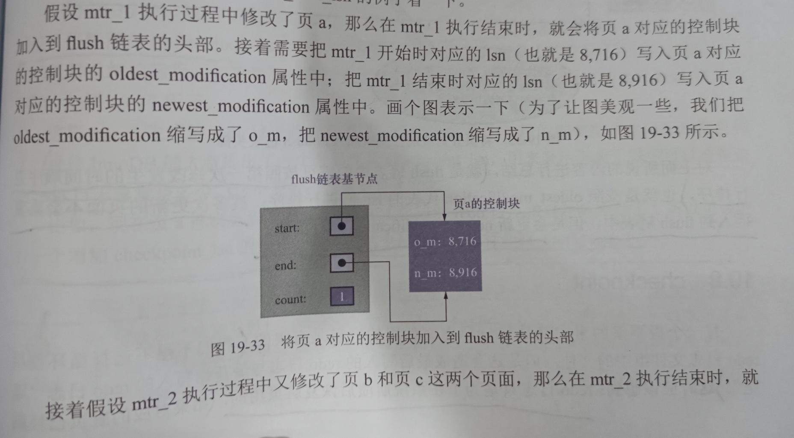


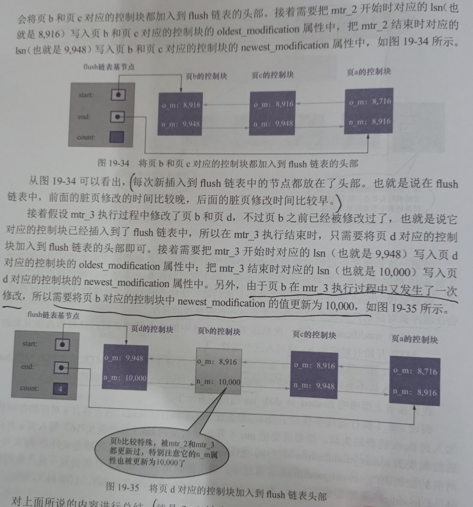


总结：

flush链表中的脏页按照第一次修改发生的时间进行排序(oldest_modification代表的lsn值)

被多次修改的页面不会重复插入到flush链表中，但会更新其控制块中的newest_modification值


## 19.7 checkpoint

redo日志文件组的容量是有限的，所以我们有时不得不循环使用redo日志文件组中的文件(bi_log_file0等)，但这样会使得最后写入的redo日志文件覆盖掉最早写入的redo日志文件

此时应该想到：

redo日志是为了在系统崩溃重启后，回复脏页用的，**如果对应脏页已经刷新到了磁盘中**，此时即使系统奔溃，重启后也不用使用redo日志来恢复页面了，其对应的redo日志也没有存在必要了，此时就可以被覆盖


所以，判断redo日志占用的磁盘空间是否可以被覆盖的依据是：

**对应的脏页是否已经刷新到了磁盘中**


- 如果对应的redo日志被刷新到了磁盘中，但**对应的脏页还留在Buffer Pool中没有刷新**，**此时对应redo日志的磁盘空间不能被覆盖**
- **全局变量checkpoint_lsn用来表示当前系统中可以被覆盖的redo日志的总量**


例子：
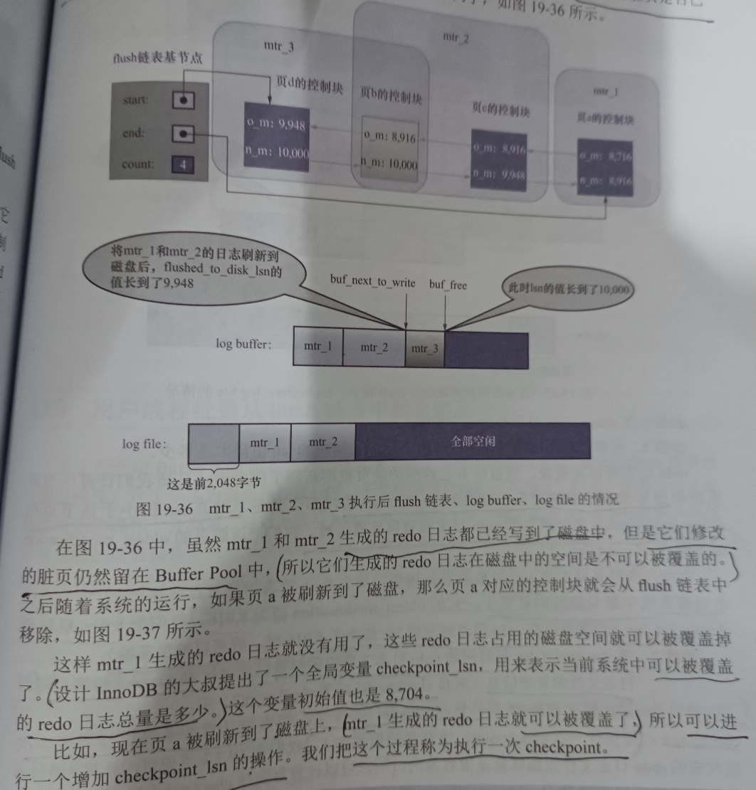


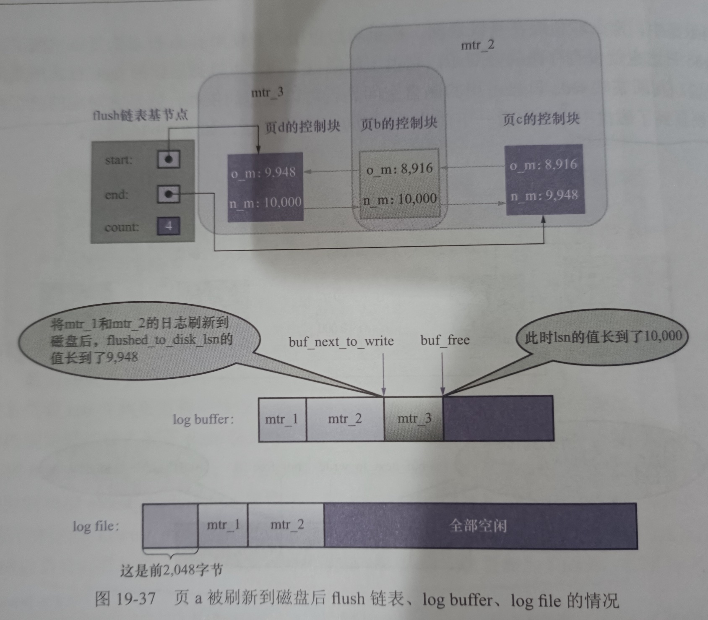

**当某个页被刷新到了磁盘上，那么该页对应生成的redo日志可以被覆盖了，此时会进行一个增加checkpoint_lsn的操作，该过程被称为执行一次checkpoint**


**注意：**有些后台线程会将Buffer Pool中的脏页刷新到磁盘中，而脏页刷新到磁盘和执行一次checkpoint是两回事

刷新脏页和执行checkpoint是在不同线程上执行的，所以不是每次刷新脏页都执行一次checkpoint


一次checkpoint分为两个步骤:

1. 计算当前系统中可以被覆盖的redo日志对应的最大lsn值

因为redo日志可以被覆盖，说明其对应脏页已经刷新到了磁盘中，**我们只需要计算当前系统中最早修改的脏页对于的oldest_modification值**，那么lsn小于该值对应的redo日志都可以被覆盖。我们**将该脏页的oldest_modification值赋给checkpoint_lsn**


2. **将checkpoint_lsn与对应的redo日志文件组偏移量以及此次checkpoint的编号**写到日志文件的**管理信息中**(一个redo日志文件中的**check point1和check point2部分**)

InnoDB维护了一个checkpoint_no变量，其用来统计目前系统执行的checkpoint的次数，每执行一次checkpoint，该值就递增1

我们可以计算得到checkpoint_lsn在redo日志文件组中对应的偏移量checkpoint_offset，之后将checkpoint_no, checkpoint_lsn, checkpoint_offset三个值都写到redo日志文件组的管理信息中

关于checkpoint的信息只会被写到日志文件组中的第一个日志文件中，那么存储在checkpoint1还是checkpoint2呢？


规定：

如果checkpoint_no的值为偶数，则写到checkpoint1中，奇数则写到checkpoint2中


记录完checkpoint的信息后，redo日志文件组中各个lsn值的关系

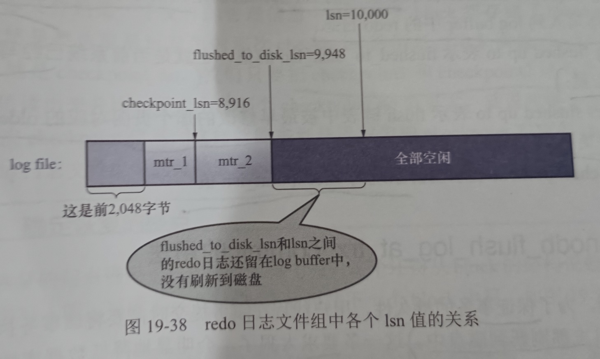


## 19.8 用户线程批量从flush链表中刷新脏页

一般都是后台线程对LRU链表和flush链表进行刷脏操作，因为刷脏操作较慢，不想影响用户线程请求

如果此时修改页面的操作很频繁，就会导致写redo日志的操作十分频繁，系统的lsn值增长过快

如果后台不能及时将脏页刷出，系统就不能及时执行checkpoint，此时需要用户线程将flush链表中最早修改的脏页(在链表尾)同步刷新到磁盘中，此时对应的redo日志就可以被覆盖了，就可以执行checkpoint了


## 19.9 查看系统中的lsn值

Syntax:

```mysql
SHOW ENGINE INNODB STATUS\G;
```


Eg:

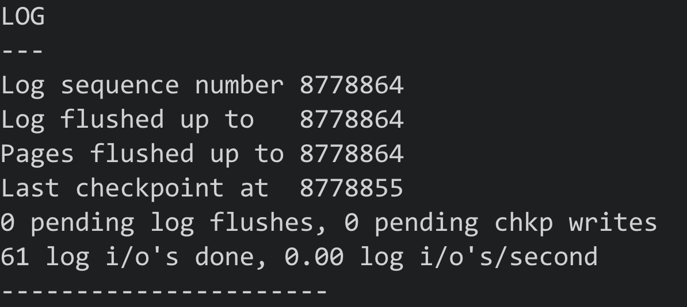


- Log sequence number: 表示系统的lsn值，便是系统已经写入的redo日志量，包含写入到log buffer中的redo日志
- Log flushed up to: 表示flushed_to_disk_lsn的值，表示写入到磁盘中的redo日志量
- Pages flushed up to: 表示flush链表中最早被修改的那些页面对应的oldest_modification值
- Last checkpoint: 表示当前系统的checkpoint_lsn值


## 19.10 innodb_flush_log_at_trx_commit的用法

通过变量innodb_flush_log_at_trx_commit可以控制是否立即将事务对应的所有redo日志刷新到磁盘中，其有三个变量：

- 0: 表示不立即向磁盘同步redo日志，此任务交给后台线程处理。

这样会加快处理请求的速度，但如果事务提交后服务器崩溃了，且**后台线程没有将redo日志刷新到磁盘中**，**此时事务的修改就会丢失！**

- 1(默认值): 表示在事务提交时需要将redo日志同步到磁盘，这样可以保证事务的持久性
- 2: 表示事务提交时需要将redo日志**写到操作系统的缓冲区中**，但不需要将日志真正地刷新到磁盘

这种情况下，**只要操作系统没挂，就能保证事务的持久性**(内存还在)


Eg:

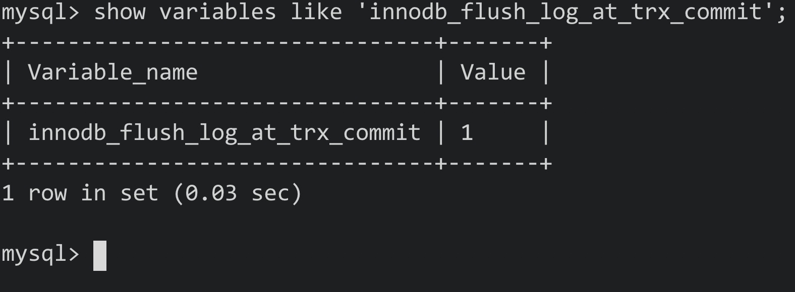


## 19.11 崩溃恢复

如果数据库一挂，那么redo日志就很重要

恢复过程：


### 19.11.1 确定恢复的起点

对于对应的lsn值小于checkpoint_lsn的redo日志来说，它们可以被覆盖

对于对应的lsn值不小于checkpoint_lsn的redo日志来说，其对应的脏页可能被刷盘也可能没有，不能确定，**此时需要从对应lsn值为checkpoint_lsn的redo日志开始恢复页面**


在redo日志文件组的第一个文件的管理信息中，有两个block存储了checkpoint_lsn的信息，**我们需要选取最近一次发生的那次checkpoint的信息**，将checkpoint1和checkpoint2中两个block中的checkpoint_no值读取出来比对一下大小，**哪个更大，就能说明哪个block存储的就是最近一次checkpoint信息**。

这样就能**获取最近发生的check_point对应的check_point_lsn**，**和其在redo日志文件组中的偏移量checkpoint_offset**


### 19.11.2 确定恢复的终点

- 普通block的log block header部分有一个名为LOG_BLOCK_HDR_DATA_LEN的属性，**该属性记录了当前block中使用的字节空间**
- 被填满的block中，该属性值为512。如果不为512，那么说明它就是需要扫描的最后一个block
- 在恢复时，**从checkpoint_lsn在日志文件中对应的偏移量开始**，**一直扫描redo日志中的block，直到某个block的LOG_BLOCK_HDR_DATA_LEN值不等于512为止**


### 19.11.3 恢复的方式

假设现在有5条redo日志：

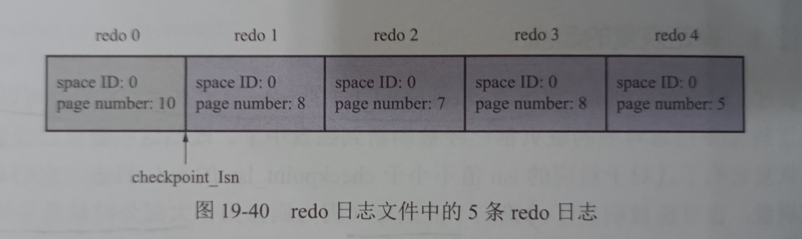

按照redo日志的顺序依次扫描checkpoint_lsn之后的各条redo日志，按照日志中记载的内容将对应的页面恢复

InnoDB通过一些方法加快了这个恢复过程


- 使用哈希表

根据redo日志的space ID的page number属性计算出哈希值，将space ID和page number相同的redo日志放到哈希表的同一个位置中，，如果多个redo日志有相同的space ID和page number，则会将它们通过链表连接起来

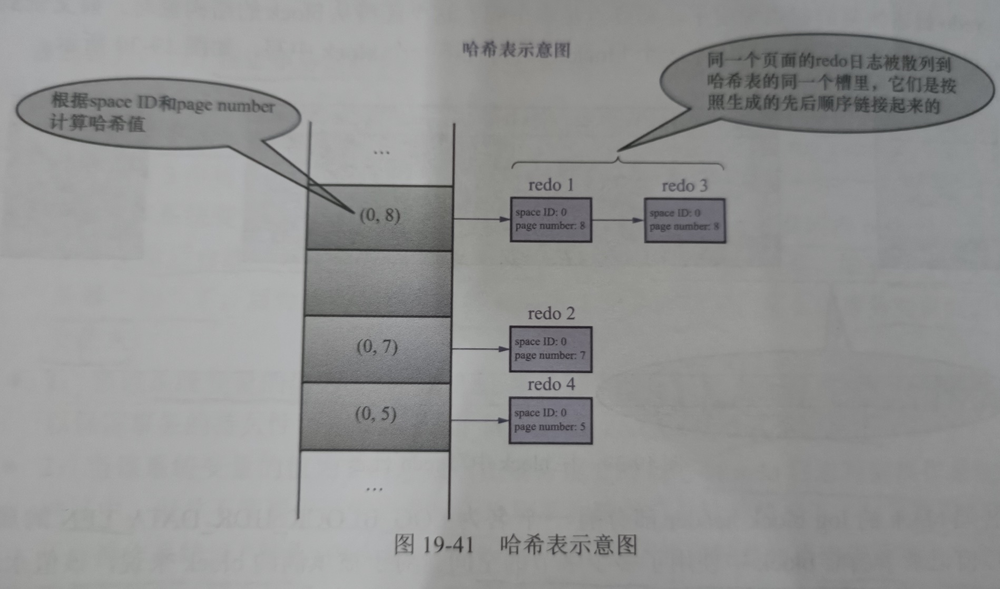


之后遍历哈希表，因为对同一个页面的redo日志放在了一起，所以可以一次将一个页面修复好(避免了随机I/O)

**注意：**恢复时是按照时间顺序来的


- 跳过已经刷新到磁盘中的页面

在最近一次执行checkpoint之后，后台线程可能不断从LRU链表和flush链表中将脏页刷出

在恢复时怎么知道某个redo日志对应的脏页是否在崩溃前刷新大了磁盘呢？


在File Header中有一个称为FIL_PAGE_LSN的属性，该属性记录了最近一次修改页面时对应的lsn值(控制块中的newest_modification)，执行checkpoint之后，有脏页被刷新到磁盘，那么该页对应的FIL_PAGE_LSN代表的lsn值大于checkpoint_lsn。

凡是符合这种情况的页面就不需要根据lsn值小于FIL_PAGE_LSN的redo日志，可以直接跳过


## 19.12 LOG_BLOCK_HDR_NO的计算

- 该属性代表block的唯一编号，其在初次使用该block时进行分配，与系统lsn有关
- 使用如下公式计算出block的LOG_BLOCK_HDR_NO值:

```
((lsn / 512) & 0x3FFFFFFF) + 1
```

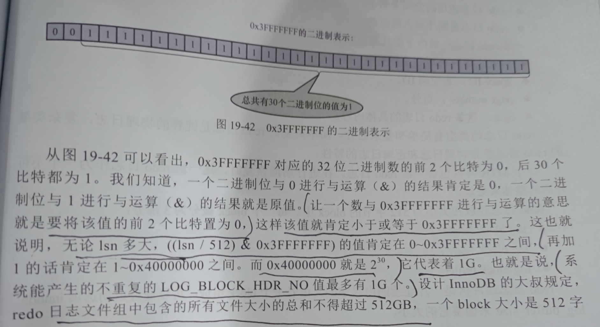


**注意：**如果事务执行到了一般时系统崩了，此时redo日志虽然刷新到了磁盘中，执行一半的事务所做的修改都会被撤销，下一张undo日志中会讲解

****


