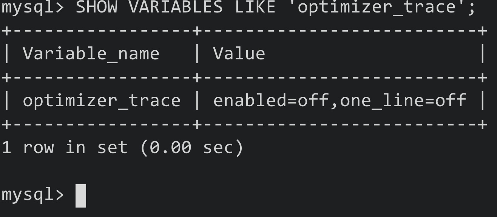

# 十六、optimizer trace


## 16.1 简介

- 在MySQL5.6以及之前的版本中，查询优化器就是一个"黑盒"，我们只能通过EXPLAIN的方式查看最终的执行计划，而无法得知其为何做出这样的决定
- 而在之后的版本中，MySQL提供了名为optimizer trace的功能，该功能可以让用户方便的查看优化器生成执行计划的全过程


该功能的开启和关闭由系统变量optimizer_trace来决定

Eg:




**注意:**one_line值用来控制输出的格式，如果值为on，则输出都将在一行中展示，并不适合阅读，所以保持为off即可


原理:

- 打开optimizer trace功能后，**需要先执行一次想要查看优化过程的SQL语句，或者使用EXPLAIN查看一个执行计划**
- 之后只需要查看information_schema库下的OPTIMIZER_TRACE表即可


该表中有4列:

- QUERY: 表示输入的查询语句(我们自己写的SQL)
- TRACE: 表示优化过程的JSON文本
- MISSING_BYTES_BEYOND_MAX_MEN_SIZE: 如果生成过程中输出的内容超出了某个限制，则多余的文本不会显示。该字段表明剩余未显示内容的文本字节数
- INSUFFICIENT_PRIVILEGES: 表示是否有查看执行计划的权限，默认为0(有权限)，某些情况下为1(暂不关心)


## 16.2 通过optimizer trace分析查询优化器的具体工作过程

Eg:


优化过程的三个阶段:

- prepare阶段
- optimize阶段
- execute阶段


基于成本的优化主要集中在optimize阶段

- **对于单表查询来说**，主要关注的是**optimize阶段的rows_estimation过程**
- **对于多表连接查询来说**，主要关注的是**considered_execution_plans过程**

****


# 十七、InnoDB的Buffer Pool


## 17.1 缓存的作用

- 数据始终会存放在磁盘内，所以而访问页中的记录时，会将整个页的数据加载到内存中
- 之后就可以进行读写访问了，**在读写访问之后并不着急释放页对应的内存空间，而是缓存起来**，之后**再次访问时就能省下读取表的I/O开销了**


## 17.2 InnoDB的Buffer Pool


### 17.2.1 Buffer Pool的定义

- 为了缓存从磁盘中读取的页，InnoDB会在MySQL服务器启动时就申请一片连续的内存，名为"Buffer Pool"
- 该缓存大小默认为128MB，可以通过在配置文件中指定innodb_buffer_pool_size这个启动项来指定其值

Configuration:

```mysql
[server]
innodb_buffer_pool_size = byte_nunmber
```

- 其单位为字节，其值不能太小，最小为5MB(小于5MB时MySQL会强制更正)


### 17.2.2 Buffer Pool内部组成

- Buffer Pool被划分成了若干页面，**该页面大小和InnoDB表空间使用的页面大小一致，都为16KB**
- 这里我们将**这些页面称为缓冲页**
- 为了管理这些缓冲页，**InnoDB为每个缓冲页都创建了一些控制信息**


- 每个缓冲页中对应的控制信息占用的内存大小是一致的，**每个页对应的控制信息占用的每块内存被称为一个控制块，控制块与缓冲页一一对应**
- **控制块在Buffer Pool的前面，缓冲页在后面**

Image:


- 我们设置的innodb_buffer_pool_size并不包含控制块占用的内存空间，所以在申请连续内存时，这片空间会比innodb_buffer_pool_size大5%
- 控制块大约占缓冲页大小的5%(DEBUG模式下，其余模式下会小一些)


### 17.2.3 free链表的管理

- 在启动服务器的时候需要完成Buffer Pool的初始化，也就是先向OS申请Buffer Pool的内存空间，划分为若干控制块和缓冲页
- 此时没有任何页面从磁盘缓存到Buffer Pool中


在从磁盘读取一个页到Buffer Pool时，该放到Buffer Pool中的哪个位置呢？或者说怎么区分Buffer Pool中哪些缓存页是空闲的？

- 我们可以把所有空闲缓冲页对应的控制块作为节点


